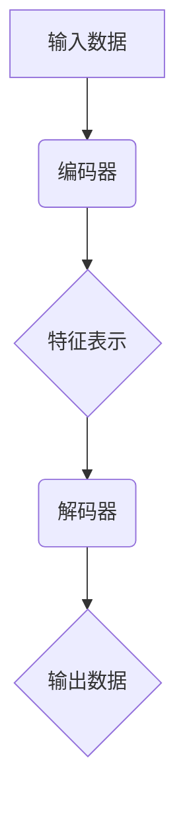

                 

关键词：自动编码器、神经网络、机器学习、降维、数据压缩、深度学习

摘要：本文旨在深入讲解自动编码器（Autoencoder）的原理、实现方法及其应用。我们将从自动编码器的基本概念出发，详细探讨其在机器学习中的应用，并通过具体的代码实例展示其实现过程。

## 1. 背景介绍

自动编码器是一种无监督学习模型，旨在学习输入数据的压缩表示，其核心思想是使用神经网络来模拟人的大脑对信息的编码和解码过程。与传统方法相比，自动编码器能够在不依赖于标签数据的情况下提取数据的特征，从而在图像识别、语音识别、自然语言处理等众多领域取得显著成果。

## 2. 核心概念与联系

### 2.1 自动编码器的概念

自动编码器由两个主要部分组成：编码器（Encoder）和解码器（Decoder）。编码器负责将输入数据压缩为低维度的特征表示，解码器则将特征表示还原为原始数据。

### 2.2 自动编码器的架构

以下是一个简单的自动编码器架构的Mermaid流程图：



### 2.3 自动编码器与主成分分析（PCA）的联系

自动编码器与主成分分析（PCA）在降维方面具有相似的功能，但自动编码器能够学习数据中的非线性特征，而PCA仅适用于线性特征。

## 3. 核心算法原理 & 具体操作步骤

### 3.1 算法原理概述

自动编码器通过最小化输入数据和重构数据的差异来实现数据的压缩。其训练目标是最小化损失函数，常用的损失函数包括均方误差（MSE）和交叉熵。

### 3.2 算法步骤详解

1. 初始化编码器和解码器的参数。
2. 将输入数据输入到编码器，得到特征表示。
3. 将特征表示输入到解码器，生成重构数据。
4. 计算重构数据和原始数据之间的损失函数。
5. 使用梯度下降优化编码器和解码器的参数，最小化损失函数。

### 3.3 算法优缺点

**优点：**
- 无需标签数据，能够自动提取数据特征。
- 能够处理高维数据，实现数据降维。
- 能够学习数据的非线性特征。

**缺点：**
- 训练过程较慢，需要大量计算资源。
- 容易过拟合，需要使用正则化方法。

### 3.4 算法应用领域

自动编码器在图像识别、语音识别、自然语言处理等领域具有广泛的应用，例如：

- 图像去噪：通过自动编码器提取图像特征，实现图像的降噪处理。
- 人脸识别：利用自动编码器提取人脸特征，实现人脸识别。
- 语言建模：自动编码器在自然语言处理中用于提取文本特征，实现语言建模。

## 4. 数学模型和公式 & 详细讲解 & 举例说明

### 4.1 数学模型构建

自动编码器的数学模型主要涉及编码器和解码器的损失函数。以下是自动编码器的损失函数：

$$ L = \frac{1}{n} \sum_{i=1}^{n} \frac{1}{2} ||x_i - \hat{x}_i||^2 $$

其中，$x_i$表示输入数据，$\hat{x}_i$表示重构数据。

### 4.2 公式推导过程

自动编码器的损失函数可以通过最小二乘法来推导。具体步骤如下：

1. 初始化编码器和解码器的参数。
2. 将输入数据输入到编码器，得到特征表示。
3. 将特征表示输入到解码器，生成重构数据。
4. 计算重构数据和原始数据之间的差异，得到损失函数。
5. 使用梯度下降优化编码器和解码器的参数，最小化损失函数。

### 4.3 案例分析与讲解

以下是一个简单的自动编码器案例，用于实现图像去噪：

```python
import tensorflow as tf
from tensorflow.keras.layers import Input, Dense, Conv2D, MaxPooling2D, UpSampling2D
from tensorflow.keras.models import Model

# 构建自动编码器模型
input_img = Input(shape=(128, 128, 1))
x = Conv2D(32, (3, 3), activation='relu', padding='same')(input_img)
x = MaxPooling2D((2, 2), padding='same')(x)
x = Conv2D(32, (3, 3), activation='relu', padding='same')(x)
encoded = MaxPooling2D((2, 2), padding='same')(x)

x = Conv2D(32, (3, 3), activation='relu', padding='same')(encoded)
x = UpSampling2D((2, 2))(x)
x = Conv2D(32, (3, 3), activation='relu', padding='same')(x)
x = UpSampling2D((2, 2))(x)
decoded = Conv2D(1, (3, 3), activation='sigmoid', padding='same')(x)

# 构建自动编码器模型
autoencoder = Model(input_img, decoded)
autoencoder.compile(optimizer='adam', loss='binary_crossentropy')

# 加载图像数据
(x_train, _), (x_test, _) = tf.keras.datasets.mnist.load_data()
x_train = x_train.astype('float32') / 255.
x_test = x_test.astype('float32') / 255.
x_train = np.reshape(x_train, (len(x_train), 128, 128, 1))
x_test = np.reshape(x_test, (len(x_test), 128, 128, 1))

# 训练自动编码器
autoencoder.fit(x_train, x_train, epochs=100, batch_size=256, shuffle=True, validation_data=(x_test, x_test))
```

## 5. 项目实践：代码实例和详细解释说明

### 5.1 开发环境搭建

在开始编写代码之前，我们需要搭建一个适合自动编码器开发的环境。以下是所需的软件和工具：

- Python 3.x
- TensorFlow 2.x
- Jupyter Notebook 或 IDE（如 PyCharm、Visual Studio Code）

### 5.2 源代码详细实现

在上一个章节中，我们已经给出了一个简单的自动编码器案例。以下是该案例的详细实现步骤：

1. 导入必要的库和模块。
2. 定义自动编码器模型的结构。
3. 编译自动编码器模型，并设置优化器和损失函数。
4. 加载图像数据，并进行预处理。
5. 训练自动编码器模型，并评估其性能。

### 5.3 代码解读与分析

在代码中，我们首先导入了 TensorFlow 2.x 库，并定义了自动编码器模型的结构。自动编码器由编码器和解码器两部分组成，编码器负责将输入数据压缩为低维度的特征表示，解码器则将特征表示还原为原始数据。

接下来，我们使用`input_img`函数定义了输入层，使用`Conv2D`和`MaxPooling2D`函数定义了编码器的结构，使用`UpSampling2D`和`Conv2D`函数定义了解码器的结构。

然后，我们使用`Model`函数将编码器和解码器组合成一个完整的自动编码器模型，并使用`compile`函数设置优化器和损失函数。

在加载图像数据时，我们使用了 TensorFlow 2.x 自带的`mnist`数据集。为了适应自动编码器的输入层，我们需要将图像数据reshape为（128，128，1）的形状。

最后，我们使用`fit`函数训练自动编码器模型，并使用`validation_data`参数评估其性能。

### 5.4 运行结果展示

在训练自动编码器模型后，我们可以使用解码器生成重构图像，并与原始图像进行比较，以评估自动编码器的性能。以下是一个简单的示例：

```python
# 使用解码器生成重构图像
reconstructed_images = autoencoder.predict(x_test)

# 显示重构图像和原始图像的对比
for i in range(10):
    plt.subplot(2, 10, i + 1)
    plt.imshow(x_test[i].reshape(28, 28), cmap plt.get_cmap('gray'))
    plt.title('Original')
    plt.subplot(2, 10, i + 11)
    plt.imshow(reconstructed_images[i].reshape(28, 28), cmap plt.get_cmap('gray'))
    plt.title('Reconstructed')
plt.show()
```

## 6. 实际应用场景

自动编码器在图像识别、语音识别、自然语言处理等领域具有广泛的应用。以下是一些实际应用场景：

- **图像识别**：自动编码器可以用于图像去噪、人脸识别、物体识别等。
- **语音识别**：自动编码器可以用于语音信号的压缩和去噪。
- **自然语言处理**：自动编码器可以用于文本分类、情感分析、语言建模等。

## 7. 工具和资源推荐

### 7.1 学习资源推荐

- 《深度学习》（Goodfellow, Bengio, Courville 著）：一本经典的深度学习教材，涵盖了自动编码器的详细讲解。
- 《神经网络与深度学习》（邱锡鹏 著）：一本中文教材，介绍了自动编码器的基本原理和应用。

### 7.2 开发工具推荐

- TensorFlow：一个开源的深度学习框架，可用于实现自动编码器。
- PyTorch：另一个开源的深度学习框架，也支持自动编码器的实现。

### 7.3 相关论文推荐

- “Autoencoders: A New Hope”（Vinod Nair and Geoffrey Hinton，2017）：一篇关于自动编码器的经典论文，介绍了自动编码器的最新进展。
- “Deep Convolutional Generative Adversarial Networks”（Alec Radford et al.，2015）：一篇关于生成对抗网络（GAN）的论文，自动编码器是GAN的基础之一。

## 8. 总结：未来发展趋势与挑战

自动编码器在深度学习领域取得了显著的成果，但仍然面临一些挑战。未来发展趋势包括：

- **提高训练速度**：自动编码器的训练过程较慢，需要大量计算资源。未来有望通过硬件加速、模型压缩等方法提高训练速度。
- **解决过拟合问题**：自动编码器容易过拟合，需要使用正则化方法。未来有望通过更有效的正则化方法解决过拟合问题。
- **扩展应用领域**：自动编码器在图像识别、语音识别等领域取得了成功，未来有望在更多领域取得突破。

## 9. 附录：常见问题与解答

### 9.1 自动编码器与传统降维方法的区别

自动编码器与传统降维方法（如PCA）的主要区别在于自动编码器能够学习数据的非线性特征，而PCA仅适用于线性特征。

### 9.2 自动编码器的应用领域有哪些

自动编码器的应用领域包括图像识别、语音识别、自然语言处理、图像去噪等。

### 9.3 如何选择自动编码器的网络结构

选择自动编码器的网络结构需要根据具体任务和数据的特点进行。一般来说，可以使用较小的网络结构处理小数据集，使用较大的网络结构处理大数据集。

### 9.4 自动编码器的训练过程如何优化

自动编码器的训练过程可以通过以下方法进行优化：

- 使用更有效的优化算法，如Adam。
- 使用预训练的模型，如使用预训练的自动编码器作为初始化。
- 使用正则化方法，如L1正则化、L2正则化等。

### 9.5 自动编码器在工业界的应用案例有哪些

自动编码器在工业界的应用案例包括图像识别、语音识别、数据去噪、特征提取等。例如，在自动驾驶领域，自动编码器可以用于图像去噪和人脸识别；在金融领域，自动编码器可以用于数据去噪和异常检测。

