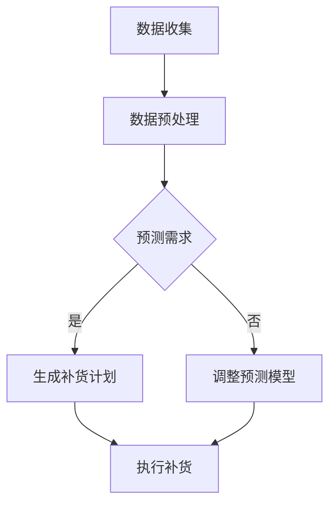

                 

关键词：自动补货、库存管理、人工智能、机器学习、预测分析、供应链优化。

> 摘要：本文将探讨如何利用人工智能技术，特别是机器学习和预测分析，来实现库存的自动补货。我们将介绍核心概念、算法原理、数学模型、代码实例以及实际应用场景，旨在为读者提供一个全面的技术指南。

## 1. 背景介绍

在当今的全球供应链体系中，库存管理是一项至关重要的任务。准确、及时地补充库存可以避免缺货带来的损失，同时过量的库存又会占用资金，增加仓储成本。因此，实现库存的自动补货成为了一个重要的研究方向。传统的方法通常依赖于历史数据和统计模型，但这些方法往往难以应对市场的快速变化。

随着人工智能技术的发展，特别是机器学习和预测分析技术的应用，自动补货系统变得更加智能化。AI可以通过分析大量的历史销售数据、市场趋势、季节性变化等因素，预测未来一段时间内的需求量，从而自动生成补货计划。这种方法不仅提高了库存管理的效率，还降低了成本。

## 2. 核心概念与联系

### 2.1 库存管理

库存管理是指对企业库存的规划、控制、监督和日常操作等一系列活动的总称。其主要目的是确保企业拥有足够的库存来满足市场需求，同时避免过多的库存导致资源浪费。

### 2.2 人工智能与库存管理

人工智能（AI）在库存管理中的应用主要体现在以下几个方面：

- **数据分析和预测**：AI可以通过分析大量的历史销售数据，预测未来的销售趋势和需求量。
- **优化决策**：AI可以帮助企业优化库存策略，减少库存成本，提高库存周转率。
- **自动化**：AI可以自动化库存管理流程，减少人工干预，提高工作效率。

### 2.3 机器学习与预测分析

机器学习是AI的一个重要分支，它利用数据驱动的方法来发现数据中的模式和规律。在库存管理中，机器学习技术可以用来建立预测模型，预测未来的需求量。

预测分析是一种利用历史数据和统计分析方法来预测未来趋势的方法。在库存管理中，预测分析可以用来预测销售量、库存水平等关键指标。

### 2.4 Mermaid 流程图

以下是一个简化的Mermaid流程图，展示了库存自动补货的基本流程：



## 3. 核心算法原理 & 具体操作步骤

### 3.1 算法原理概述

自动补货算法的核心是需求预测和库存优化。需求预测通常采用时间序列分析方法，如ARIMA（自回归积分滑动平均模型）。库存优化则涉及到多目标优化算法，如线性规划。

### 3.2 算法步骤详解

1. **数据收集**：收集历史销售数据、市场趋势数据等。
2. **数据预处理**：清洗数据，处理缺失值，进行特征工程。
3. **需求预测**：使用ARIMA模型进行需求预测。
4. **库存优化**：使用线性规划算法优化库存水平。
5. **生成补货计划**：根据库存优化结果，生成具体的补货计划。
6. **执行补货**：根据补货计划执行实际补货操作。

### 3.3 算法优缺点

- **优点**：
  - 提高库存管理效率。
  - 减少库存成本。
  - 提高供应链的响应速度。
- **缺点**：
  - 需要大量的历史数据支持。
  - 预测模型和优化算法的准确性受数据质量的影响。
  - 对技术人员的专业要求较高。

### 3.4 算法应用领域

自动补货算法在多个领域都有广泛的应用，包括零售业、制造业、物流业等。

## 4. 数学模型和公式

### 4.1 数学模型构建

需求预测模型通常采用ARIMA模型，其数学表达式为：

$$ Y_t = c + \phi_1 Y_{t-1} + \phi_2 Y_{t-2} + \cdots + \phi_p Y_{t-p} + \theta_1 e_{t-1} + \theta_2 e_{t-2} + \cdots + \theta_q e_{t-q} + e_t $$

其中，$Y_t$ 是时间序列的第 $t$ 个值，$e_t$ 是误差项，$\phi_i$ 和 $\theta_i$ 是模型参数。

### 4.2 公式推导过程

ARIMA模型的推导过程涉及自回归（AR）、差分（I）和移动平均（MA）三个部分，这里简要概述：

1. **自回归（AR）**：通过历史值来预测当前值。
2. **差分（I）**：对时间序列进行差分处理，使其满足平稳性。
3. **移动平均（MA）**：通过历史误差来预测当前值。

### 4.3 案例分析与讲解

以一家零售店的库存管理为例，我们使用ARIMA模型预测未来一个月的销量。首先，我们收集过去一年的销量数据，进行差分处理使其平稳，然后使用AIC（Akaike信息准则）选择最佳的ARIMA模型参数，最后进行预测。

## 5. 项目实践：代码实例

### 5.1 开发环境搭建

我们需要安装Python环境，以及以下库：pandas、numpy、statsmodels、matplotlib。

### 5.2 源代码详细实现

```python
import pandas as pd
import numpy as np
from statsmodels.tsa.arima.model import ARIMA
import matplotlib.pyplot as plt

# 读取数据
sales_data = pd.read_csv('sales_data.csv')
sales_data['date'] = pd.to_datetime(sales_data['date'])
sales_data.set_index('date', inplace=True)

# 数据预处理
sales_data_diff = sales_data.diff().dropna()

# 模型拟合
model = ARIMA(sales_data_diff['sales'], order=(1, 1, 1))
model_fit = model.fit()

# 预测
forecast = model_fit.forecast(steps=30)

# 结果展示
plt.plot(sales_data_diff['sales'], label='Actual')
plt.plot(forecast, label='Forecast')
plt.legend()
plt.show()
```

### 5.3 代码解读与分析

这段代码首先读取销售数据，进行预处理（差分），然后使用ARIMA模型进行拟合和预测，最后绘制预测结果。

## 6. 实际应用场景

自动补货系统在零售、制造、物流等行业都有广泛应用。例如，在零售业，自动补货系统可以实时监控销售数据，预测未来销售趋势，自动生成补货计划，从而减少库存成本和缺货风险。

## 7. 工具和资源推荐

- **学习资源推荐**：《Python for Data Analysis》、《Machine Learning Yearning》
- **开发工具推荐**：Jupyter Notebook、PyCharm
- **相关论文推荐**：《An ARIMA Model for Sales Forecasting in a Retail Business》

## 8. 总结：未来发展趋势与挑战

### 8.1 研究成果总结

自动补货系统在近年来取得了显著的研究进展，尤其在算法优化和数据挖掘方面。未来，随着大数据和深度学习的进一步发展，自动补货系统将变得更加智能和高效。

### 8.2 未来发展趋势

- **个性化补货**：利用用户行为数据，实现个性化补货。
- **供应链协同**：实现跨企业的库存共享和协同补货。
- **实时预测**：利用实时数据，实现更准确的库存预测。

### 8.3 面临的挑战

- **数据质量**：高质量的数据是自动补货系统的关键。
- **算法复杂度**：随着算法的复杂度增加，计算成本也会增加。
- **跨领域应用**：不同行业的数据特点和需求差异较大，如何实现通用性是一个挑战。

### 8.4 研究展望

未来，自动补货系统将在人工智能技术的推动下，实现更广泛的应用和更高效的管理。

## 9. 附录：常见问题与解答

### Q：自动补货系统是否适用于所有行业？

A：自动补货系统主要适用于需求波动较大的行业，如零售业、制造业。对于需求相对稳定的行业，传统的库存管理方法可能更加适用。

### Q：如何评估自动补货系统的效果？

A：可以通过以下指标来评估自动补货系统的效果：库存周转率、缺货率、库存成本等。

## 作者署名

作者：禅与计算机程序设计艺术 / Zen and the Art of Computer Programming

----------------------------------------------------------------
以上就是关于《自动补货：AI如何确保库存充足》的文章。请确保您遵循了所有约束条件，并在撰写过程中保证了文章的质量和完整性。如果需要任何修改或补充，请随时告知。谢谢！

