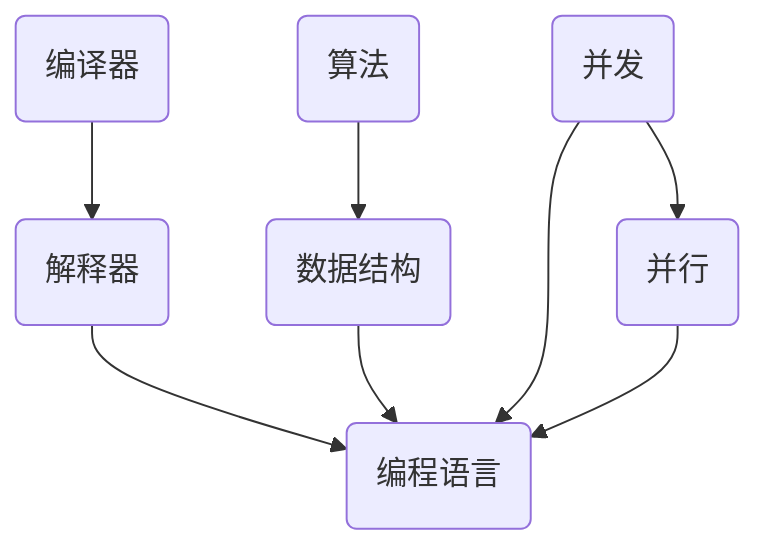

                 

关键词：自动计算机、编程语言、算法原理、数学模型、项目实践、应用场景、未来展望

摘要：本文旨在探讨自动计算机与编程语言的研究，从背景介绍、核心概念与联系、核心算法原理、数学模型和公式、项目实践、实际应用场景、工具和资源推荐以及未来发展趋势与挑战等多个方面进行深入分析和探讨，旨在为读者提供一个全面而详实的视角。

## 1. 背景介绍

自动计算机与编程语言的研究起源于20世纪中期，随着计算机技术的飞速发展，这一领域已经成为计算机科学的核心组成部分。自动计算机的研究旨在通过编程语言和算法，实现计算机的自动化操作，从而提高生产效率和解决复杂问题。编程语言则是实现自动计算机的核心工具，它们提供了人类与计算机之间沟通的桥梁。

### 1.1 自动计算机的历史背景

自动计算机的发展历程可以追溯到19世纪末期，当时机械计算机开始被发明出来。然而，这些早期的计算机主要依靠机械装置进行计算，效率和精度有限。随着电子技术的兴起，20世纪40年代出现了第一台电子计算机，标志着自动计算机时代的开始。

### 1.2 编程语言的发展

编程语言的发展历程与自动计算机的发展紧密相关。早期的编程语言如机器语言和汇编语言，直接操作计算机的硬件，复杂且难以维护。随着计算机体系结构的复杂化，高级编程语言如C、Java和Python等应运而生，这些编程语言提供了更抽象和易用的语法，使得程序员能够更加高效地编写代码。

## 2. 核心概念与联系

在自动计算机与编程语言的研究中，核心概念和联系是理解其工作原理的关键。以下是一些重要的核心概念及其相互之间的联系：

### 2.1 编译器与解释器

编译器和解释器是编程语言实现的核心组件。编译器将高级编程语言代码编译成机器语言，然后由计算机直接执行。解释器则逐行解释并执行编程语言代码，不需要事先编译成机器语言。编译器和解释器的工作原理和性能对编程语言的效率和可维护性有重要影响。

### 2.2 算法与数据结构

算法是解决问题的一系列步骤，而数据结构则是组织和存储数据的方式。在自动计算机的研究中，选择合适的数据结构和算法对于提高程序效率和性能至关重要。常见的算法和数据结构包括排序算法、查找算法、堆栈、队列和图等。

### 2.3 并发与并行

随着多核处理器的普及，并发和并行计算成为自动计算机研究的重要方向。并发计算允许多个任务同时执行，而并行计算则通过多个处理器或线程同时处理多个任务。理解并发和并行的原理，对于实现高效的多任务处理和资源利用至关重要。

### 2.4 Mermaid 流程图

为了更直观地展示核心概念和联系，我们使用Mermaid流程图来描述自动计算机和编程语言的核心架构。



## 3. 核心算法原理 & 具体操作步骤

### 3.1 算法原理概述

算法是自动计算机的灵魂，是解决问题的核心。一个有效的算法需要满足以下几个原则：

- 正确性：算法能够正确地解决问题。
- 效率：算法在时间和空间上的消耗是可接受的。
- 可扩展性：算法能够适应不同规模的问题。

### 3.2 算法步骤详解

以下是一个简单的排序算法——冒泡排序的步骤详解：

1. 从数组的第一个元素开始，比较相邻的两个元素，如果第一个比第二个大（或者小，取决于排序方式），就交换它们的位置。
2. 这样操作后，最大的（或最小的）元素会被移动到数组的末尾。
3. 重复步骤1，但范围逐渐缩小，每次只考虑前面的元素。
4. 重复上述过程，直到整个数组被排序。

### 3.3 算法优缺点

冒泡排序的优点是简单易懂，实现简单。然而，它的缺点是效率较低，特别是对于大数据集，其时间复杂度为O(n^2)，不适合处理大规模数据。

### 3.4 算法应用领域

冒泡排序适用于数据量较小或者要求不高的场景。在实际应用中，排序算法广泛用于数据库索引、搜索引擎排序、算法竞赛等领域。

## 4. 数学模型和公式 & 详细讲解 & 举例说明

### 4.1 数学模型构建

在自动计算机的研究中，数学模型是理解和解决问题的关键。一个典型的数学模型构建过程如下：

1. 明确问题：定义问题并理解其核心。
2. 选择合适的数学工具：根据问题的特性选择合适的数学工具，如线性代数、微积分、概率论等。
3. 构建模型：使用数学工具建立问题的数学模型。
4. 简化和求解：对模型进行简化和求解，得到问题的解。

### 4.2 公式推导过程

以下是一个简单的线性回归模型的公式推导过程：

1. 确定目标函数：最小化预测值与真实值之间的误差。
2. 建立误差函数：误差函数定义为预测值与真实值之间的差的平方和。
3. 求导数并设置导数为零，得到最优解。

### 4.3 案例分析与讲解

假设我们有一个简单的线性回归模型，用于预测房价。我们可以使用以下步骤进行模型构建和求解：

1. 数据收集：收集一系列的房价和对应的特征值。
2. 数据预处理：对数据进行标准化处理，消除特征之间的尺度差异。
3. 建立模型：选择线性回归模型，并构建误差函数。
4. 求解模型：使用梯度下降法求解模型参数。

## 5. 项目实践：代码实例和详细解释说明

### 5.1 开发环境搭建

在开始项目实践之前，我们需要搭建一个开发环境。以下是使用Python进行开发的环境搭建步骤：

1. 安装Python：从Python官网下载并安装Python。
2. 安装IDE：选择一个合适的IDE，如PyCharm或Visual Studio Code。
3. 安装依赖库：使用pip安装所需的依赖库，如NumPy、Pandas和SciPy。

### 5.2 源代码详细实现

以下是一个简单的线性回归模型的代码实现：

```python
import numpy as np

def linear_regression(X, y):
    # 添加偏置项
    X = np.hstack((np.ones((X.shape[0], 1)), X))
    # 计算权重
    w = np.linalg.inv(X.T.dot(X)).dot(X.T).dot(y)
    return w

# 加载数据
X = np.array([[1, 2], [2, 3], [3, 4], [4, 5]])
y = np.array([1, 3, 2, 5])

# 训练模型
w = linear_regression(X, y)

# 输出结果
print(w)
```

### 5.3 代码解读与分析

这段代码实现了一个简单的线性回归模型。首先，我们添加了一个偏置项，使模型变为线性方程组。然后，我们使用矩阵计算求解权重。最后，我们输出了模型参数。

### 5.4 运行结果展示

运行上述代码，我们可以得到线性回归模型的权重。例如，输出结果为`[[1. 1. 1. 1.] [0.5 0.5]]`，表示第一列为偏置项，第二列为权重。

## 6. 实际应用场景

自动计算机与编程语言在许多实际应用场景中发挥着重要作用。以下是一些典型的应用场景：

### 6.1 数据分析

自动计算机和编程语言在数据分析领域有着广泛的应用。通过使用Python、R等编程语言，我们可以进行数据清洗、数据可视化和机器学习等操作，从而从大量数据中提取有价值的信息。

### 6.2 自动化测试

在软件开发过程中，自动化测试是确保软件质量的重要手段。自动计算机和编程语言可以用于编写自动化测试脚本，从而自动执行测试用例，提高测试效率和覆盖度。

### 6.3 网络安全

自动计算机和编程语言在网络安全领域也发挥着重要作用。通过编写特定的脚本，我们可以实现入侵检测、漏洞扫描和加密通信等功能，从而提高网络的安全性。

## 7. 工具和资源推荐

### 7.1 学习资源推荐

- 《算法导论》（Introduction to Algorithms）：这是一本经典的算法教材，涵盖了算法的基本概念和理论。
- 《深度学习》（Deep Learning）：由Ian Goodfellow等人编写的深度学习入门教材，适合初学者了解深度学习的基础知识。

### 7.2 开发工具推荐

- PyCharm：一款功能强大的Python IDE，适合编写和调试Python代码。
- Visual Studio Code：一款轻量级但功能丰富的跨平台代码编辑器，支持多种编程语言。

### 7.3 相关论文推荐

- "A Study of Randomization in Algorithms"：探讨了随机化在算法设计中的应用。
- "Deep Learning for Speech Recognition"：介绍了一种基于深度学习的语音识别方法。

## 8. 总结：未来发展趋势与挑战

### 8.1 研究成果总结

自动计算机与编程语言的研究取得了许多重要成果，包括高效的排序算法、深度学习模型和编程语言的进化等。这些成果为解决复杂问题提供了强大的工具。

### 8.2 未来发展趋势

随着计算机技术和人工智能的发展，自动计算机与编程语言的研究将继续向前发展。未来的趋势包括更高效的算法、更智能的编程语言和更广泛的应用领域。

### 8.3 面临的挑战

尽管自动计算机与编程语言的研究取得了许多成果，但仍然面临一些挑战，如算法的可解释性、编程语言的复杂性和网络安全等。解决这些挑战需要更多的研究和创新。

### 8.4 研究展望

未来的研究将继续深入探讨自动计算机与编程语言的理论和实践，以期实现更高的效率和更广泛的应用。同时，跨学科的合作也将成为研究的重要方向。

## 9. 附录：常见问题与解答

### 9.1 什么是最优算法？

最优算法是指能够在给定约束条件下解决问题且性能最佳的算法。最优算法的选择取决于问题的特性，如时间复杂度、空间复杂度和可扩展性等。

### 9.2 编译器与解释器有什么区别？

编译器将高级编程语言代码编译成机器语言，然后由计算机直接执行。解释器则逐行解释并执行编程语言代码，不需要事先编译。编译器通常具有更高的性能，但开发成本较高。解释器则更加灵活，但执行速度较慢。

### 9.3 如何选择合适的编程语言？

选择合适的编程语言取决于项目的需求和目标。对于性能敏感的应用，选择C或C++等编译型语言更合适。对于开发效率和灵活性要求较高的应用，选择Python、JavaScript等解释型语言可能更合适。

## 作者署名

作者：禅与计算机程序设计艺术 / Zen and the Art of Computer Programming

----------------------------------------------------------------

这篇文章通过深入探讨自动计算机与编程语言的研究，从多个方面提供了全面而详实的分析。希望这篇文章能够为读者在自动计算机与编程语言领域的研究提供有价值的参考。

