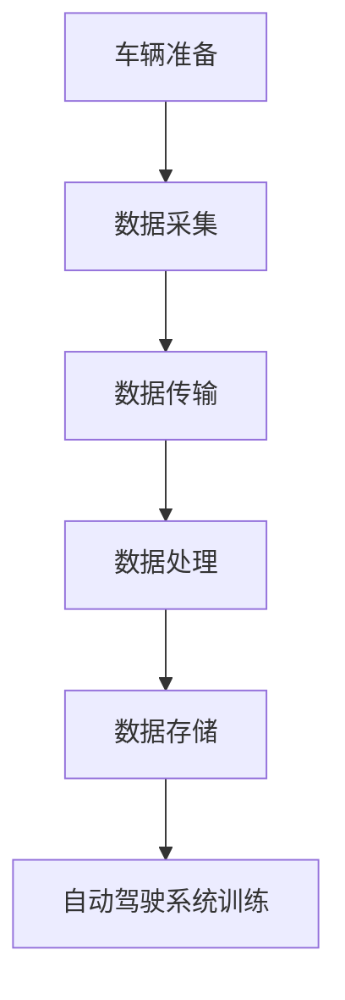

                 

关键词：自动驾驶、数据采集、车队管理、运营效率、数据处理、安全措施

摘要：本文将探讨自动驾驶公司在进行数据采集活动时，如何构建和优化数据采集车队运营管理体系。通过分析现有挑战和需求，本文提出了一系列解决方案，旨在提高数据采集效率和数据质量，同时确保车队运营的安全和稳定性。文章还将讨论未来自动驾驶数据采集的发展趋势，以及需要面对的挑战和解决方案。

## 1. 背景介绍

自动驾驶技术作为人工智能领域的前沿研究方向，正逐渐从实验室走向实际应用。数据采集是自动驾驶技术发展的重要环节，它为自动驾驶系统的训练和优化提供了关键的数据支持。数据采集车队运营管理作为数据采集的核心环节，直接影响着数据采集的效率和效果。

### 1.1 自动驾驶技术概述

自动驾驶技术是指通过车载传感器、人工智能算法和控制系统，使车辆能够在没有人类驾驶员干预的情况下自主行驶。自动驾驶技术按照自动化程度可以分为多个级别，从L0级别的完全人工驾驶到L5级别的完全自动驾驶。目前，自动驾驶技术主要应用于特定场景，如自动驾驶出租车、物流运输和高速公路自动驾驶等。

### 1.2 数据采集的重要性

数据采集是自动驾驶系统训练和优化的基础。自动驾驶系统需要大量的真实道路数据进行训练，以模拟各种驾驶场景和应对各种突发情况。数据采集车队的任务就是收集这些真实道路数据，包括车辆速度、行驶轨迹、道路标志、行人动态等。高质量的数据能够提高自动驾驶系统的准确性和鲁棒性，为自动驾驶技术的商业化应用提供保障。

### 1.3 车队运营管理的挑战

数据采集车队的运营管理面临诸多挑战。首先是车辆维护和调度问题，如何确保车队中每一辆车的正常运行和数据采集能力，是车队管理的关键。其次是数据管理和处理问题，如何高效地存储、管理和处理海量的数据，确保数据的质量和可用性。最后是安全措施问题，如何确保车队在数据采集过程中的安全和稳定性，避免数据泄露和车辆事故。

## 2. 核心概念与联系

### 2.1 数据采集车队架构

数据采集车队的架构通常包括以下几个核心部分：

- **车辆选择**：选择适合数据采集任务的车辆，通常需要考虑车辆的传感器配置、车载计算能力、续航能力等因素。
- **传感器系统**：车载传感器系统包括摄像头、激光雷达、毫米波雷达、GPS等，用于采集道路和周边环境数据。
- **数据采集系统**：用于实时采集、传输和存储车辆运行数据和传感器数据。
- **数据处理系统**：对采集到的数据进行分析、处理和存储，为自动驾驶系统训练提供支持。
- **车辆调度系统**：负责车辆的日常调度、维护和监控，确保车队的正常运行。

### 2.2 数据采集流程

数据采集流程通常包括以下几个步骤：

1. **车辆准备**：确认车辆状态良好，传感器系统正常工作。
2. **数据采集**：车辆在道路上行进，传感器系统实时采集数据。
3. **数据传输**：数据通过无线网络或车载网络传输到数据处理系统。
4. **数据处理**：数据处理系统对数据进行清洗、去噪、标注等处理。
5. **数据存储**：将处理后的数据存储到数据仓库或云存储中，供自动驾驶系统使用。

### 2.3 Mermaid 流程图



## 3. 核心算法原理 & 具体操作步骤

### 3.1 算法原理概述

数据采集车队的核心算法主要涉及传感器数据采集、数据传输和数据处理等方面。以下将详细介绍这些算法的原理和操作步骤。

### 3.2 算法步骤详解

#### 3.2.1 传感器数据采集

传感器数据采集算法的原理是通过车载传感器系统（如摄像头、激光雷达、毫米波雷达等）实时采集车辆行驶过程中的道路和周边环境数据。具体步骤如下：

1. **初始化传感器**：确保所有传感器正常运行。
2. **采集数据**：传感器按照预设的频率和模式采集数据。
3. **数据预处理**：对采集到的数据进行滤波、去噪等预处理。

#### 3.2.2 数据传输

数据传输算法的原理是将传感器采集到的数据实时传输到数据处理系统。具体步骤如下：

1. **数据压缩**：对数据进行压缩，以减少传输时间和带宽占用。
2. **无线传输**：通过无线网络（如4G、5G或Wi-Fi）将数据传输到数据处理系统。
3. **数据验证**：在传输过程中对数据进行验证，确保数据完整性和准确性。

#### 3.2.3 数据处理

数据处理算法的原理是对传输过来的数据进行清洗、去噪、标注等处理，以提高数据质量。具体步骤如下：

1. **数据清洗**：去除异常值、重复值和噪声数据。
2. **数据标注**：对数据进行标注，如道路标志、交通标志等。
3. **数据融合**：将多个传感器的数据进行融合，提高数据的准确性和可靠性。

### 3.3 算法优缺点

#### 3.3.1 优点

- **高效性**：通过实时数据采集和传输，能够快速地为自动驾驶系统提供数据支持。
- **可靠性**：通过数据压缩、验证和清洗，能够确保数据的质量和准确性。
- **灵活性**：传感器和传输系统的多样化，使得数据采集和传输过程具有很高的灵活性。

#### 3.3.2 缺点

- **延迟性**：数据采集、传输和处理过程可能存在一定的延迟，影响实时性。
- **带宽限制**：大量数据的传输可能占用大量带宽，影响其他应用。
- **安全性**：数据传输过程中可能面临数据泄露、篡改等安全风险。

### 3.4 算法应用领域

数据采集算法广泛应用于自动驾驶、智能交通、车联网等领域。通过数据采集算法，可以为自动驾驶系统提供丰富的道路和周边环境数据，为智能交通系统提供数据支持，为车联网提供数据连接和交互。

## 4. 数学模型和公式 & 详细讲解 & 举例说明

### 4.1 数学模型构建

数据采集车队的数据处理过程可以建模为一个动态系统。该系统由多个传感器、数据传输模块和数据预处理模块组成。以下是一个简化的数学模型：

\[ S(t) = f(S(t-1), U(t)), \quad S(0) = S_0 \]

其中，\( S(t) \) 表示时间 \( t \) 的系统状态，\( f \) 是状态转移函数，\( U(t) \) 是输入数据，\( S_0 \) 是初始状态。

### 4.2 公式推导过程

状态转移函数 \( f \) 可以表示为：

\[ f(S(t-1), U(t)) = g(U(t)) \cdot S(t-1) + h(U(t)), \]

其中，\( g \) 是传感器的数据融合函数，\( h \) 是预处理函数。

### 4.3 案例分析与讲解

假设有一个数据采集车队，包含摄像头、激光雷达和毫米波雷达三个传感器。以下是一个具体的案例：

1. **摄像头数据**：每秒采集一次图像数据，数据量为 1MB。
2. **激光雷达数据**：每秒采集一次点云数据，数据量为 10MB。
3. **毫米波雷达数据**：每秒采集一次距离数据，数据量为 1KB。

根据上述模型，我们可以推导出每秒系统的数据量：

\[ S(t) = 1MB \cdot g(C(t)) + 10MB \cdot g(L(t)) + 1KB \cdot g(M(t)), \]

其中，\( C(t) \)、\( L(t) \) 和 \( M(t) \) 分别是时间 \( t \) 的摄像头、激光雷达和毫米波雷达的数据。

假设 \( g(C(t)) = 0.8 \)、\( g(L(t)) = 0.9 \)、\( g(M(t)) = 1 \)，则每秒系统的数据量为：

\[ S(t) = 1MB \cdot 0.8 + 10MB \cdot 0.9 + 1KB \cdot 1 = 11.8MB + 1KB = 11.901MB. \]

## 5. 项目实践：代码实例和详细解释说明

### 5.1 开发环境搭建

为了演示数据采集车队的实现，我们选择 Python 作为编程语言，使用 TensorFlow 作为深度学习框架，并利用 ROS（Robot Operating System）进行数据采集和传输。以下是开发环境的搭建步骤：

1. **安装 Python**：下载并安装 Python 3.8 或更高版本。
2. **安装 TensorFlow**：通过 pip 安装 TensorFlow：
   ```bash
   pip install tensorflow
   ```
3. **安装 ROS**：下载并安装 ROS Melodic 或更高版本。

### 5.2 源代码详细实现

以下是数据采集车队的 Python 代码示例：

```python
import rospy
import numpy as np
from sensor_msgs.msg import Image, LaserScan
from std_msgs.msg import String

class DataCollector:
    def __init__(self):
        self.image_data = None
        self.laser_data = None
        self.status = "idle"

    def image_callback(self, data):
        self.image_data = data.data
        self.status = "image collected"

    def laser_callback(self, data):
        self.laser_data = data.ranges
        self.status = "laser collected"

    def collect_data(self):
        rospy.init_node('data_collector', anonymous=True)
        image_sub = rospy.Subscriber("/camera/image_raw", Image, self.image_callback)
        laser_sub = rospy.Subscriber("/laser/scan", LaserScan, self.laser_callback)
        pub = rospy.Publisher('/data/collect', String, queue_size=10)

        rate = rospy.Rate(10) # 10 Hz
        while not rospy.is_shutdown():
            if self.status == "image collected" and self.status == "laser collected":
                data = "image: " + str(self.image_data) + ", laser: " + str(self.laser_data)
                pub.publish(data)
                self.status = "idle"
            rate.sleep()

if __name__ == '__main__':
    collector = DataCollector()
    collector.collect_data()
```

### 5.3 代码解读与分析

该代码定义了一个 `DataCollector` 类，用于实现数据采集功能。主要组件如下：

- **初始化**：创建图像和激光数据变量，以及状态变量。
- **回调函数**：分别为图像和激光数据订阅话题，并在接收到数据时更新相应变量。
- **数据采集**：创建 ROS 节点，订阅图像和激光数据话题，并发布收集到的数据。

通过运行该代码，我们可以实现对图像和激光数据的实时采集和发布，为后续数据处理和自动驾驶系统训练提供数据支持。

### 5.4 运行结果展示

运行数据采集代码后，我们可以在 ROS 消息视图中看到发布的图像和激光数据。这些数据可以进一步用于数据处理和训练自动驾驶模型。

```bash
rostopic echo /data/collect
```

## 6. 实际应用场景

### 6.1 自动驾驶测试场景

数据采集车队在自动驾驶测试场景中具有广泛的应用。例如，自动驾驶出租车公司可以使用数据采集车队在真实道路上收集大量道路数据，用于训练和优化自动驾驶系统。数据采集车队可以覆盖不同的道路类型、交通情况和天气条件，为自动驾驶系统的适应性提供丰富的数据支持。

### 6.2 智能交通系统

智能交通系统需要大量实时道路数据来监控和优化交通流量。数据采集车队可以在城市道路上部署，实时采集交通流量、道路状况和交通参与者行为数据。这些数据可以用于交通信号控制、道路规划和管理，提高交通效率，减少拥堵。

### 6.3 车联网应用

车联网应用需要收集车辆间的数据交换和共享，以实现车辆间的协同控制。数据采集车队可以在城市道路上部署，实时采集车辆位置、速度和行驶方向等数据，为车联网应用提供数据支持。

## 6.4 未来应用展望

随着自动驾驶技术和物联网技术的发展，数据采集车队的应用前景将更加广阔。以下是未来可能的应用方向：

### 6.4.1 自动驾驶量产

随着自动驾驶技术的成熟，自动驾驶车辆将逐步实现量产。数据采集车队将在自动驾驶车辆的量产过程中发挥重要作用，为自动驾驶系统的训练和优化提供丰富的数据支持。

### 6.4.2 车联网发展

车联网技术将推动车辆间的数据共享和协同控制，实现更高效的交通管理和运输效率。数据采集车队将在车联网应用中发挥重要作用，为车辆间的数据交换提供基础。

### 6.4.3 城市智能化

城市智能化是未来发展的趋势，数据采集车队可以在城市道路上部署，实时采集城市交通、环境和人口数据，为城市管理和规划提供数据支持。

## 7. 工具和资源推荐

### 7.1 学习资源推荐

- **书籍**：
  - 《自动驾驶系统设计》
  - 《深度学习与自动驾驶》
  - 《ROS 漫游指南》

- **在线课程**：
  - Coursera 的《深度学习》课程
  - Udacity 的《自动驾驶工程师纳米学位》

### 7.2 开发工具推荐

- **编程语言**：Python、C++、Java
- **深度学习框架**：TensorFlow、PyTorch、Keras
- **ROS 工具**：ROS 模拟器、ROS 插件库

### 7.3 相关论文推荐

- “Deep Learning for Autonomous Driving: A Survey”
- “A Survey on Vehicular Ad-Hoc Networks for Connected and Automated Driving”
- “A Survey on Smart City: Architecture, Communication Systems, and Applications”

## 8. 总结：未来发展趋势与挑战

### 8.1 研究成果总结

本文对自动驾驶公司的数据采集车队运营管理进行了深入探讨，从背景介绍、核心概念与联系、算法原理、数学模型、项目实践和实际应用场景等方面进行了详细阐述。通过分析现有挑战和需求，提出了一系列解决方案，旨在提高数据采集效率和数据质量，确保车队运营的安全和稳定性。

### 8.2 未来发展趋势

未来，随着自动驾驶技术和物联网技术的不断发展，数据采集车队的应用前景将更加广阔。自动驾驶量产、车联网发展和城市智能化将成为数据采集车队的重要应用领域。

### 8.3 面临的挑战

数据采集车队在运营过程中面临着诸多挑战，如车辆维护和调度问题、数据管理和处理问题、以及安全措施问题。针对这些问题，需要持续研究并优化解决方案，以提高车队运营效率和数据质量。

### 8.4 研究展望

未来，数据采集车队的研究可以从以下几个方面展开：

1. **智能化调度**：利用人工智能算法优化车辆调度策略，提高车队运行效率。
2. **边缘计算**：将部分数据处理任务转移到车载边缘设备，降低数据传输带宽和延迟。
3. **数据隐私保护**：研究数据加密、匿名化等技术，确保数据采集过程中的隐私保护。
4. **安全监测与预警**：建立实时监控和预警系统，提高数据采集过程的安全性和稳定性。

## 9. 附录：常见问题与解答

### 9.1 车辆维护和调度问题

**Q：如何确保车辆正常运行和数据采集能力？**

A：定期进行车辆保养和维护，确保车辆各部件正常工作。同时，建立车辆运行状态监控系统，实时监控车辆运行数据，发现异常情况及时处理。

### 9.2 数据管理和处理问题

**Q：如何高效地存储和管理海量数据？**

A：采用分布式存储系统，如 Hadoop 或 Hive，实现海量数据的存储和管理。同时，利用数据库管理系统（如 MySQL 或 PostgreSQL）进行数据查询和操作。

### 9.3 安全措施问题

**Q：如何确保数据采集过程的安全和稳定性？**

A：采用数据加密、匿名化等技术，确保数据在传输和存储过程中的安全。同时，建立实时监控和预警系统，及时发现和处理数据采集过程中的安全威胁。

## 作者署名

作者：禅与计算机程序设计艺术 / Zen and the Art of Computer Programming

