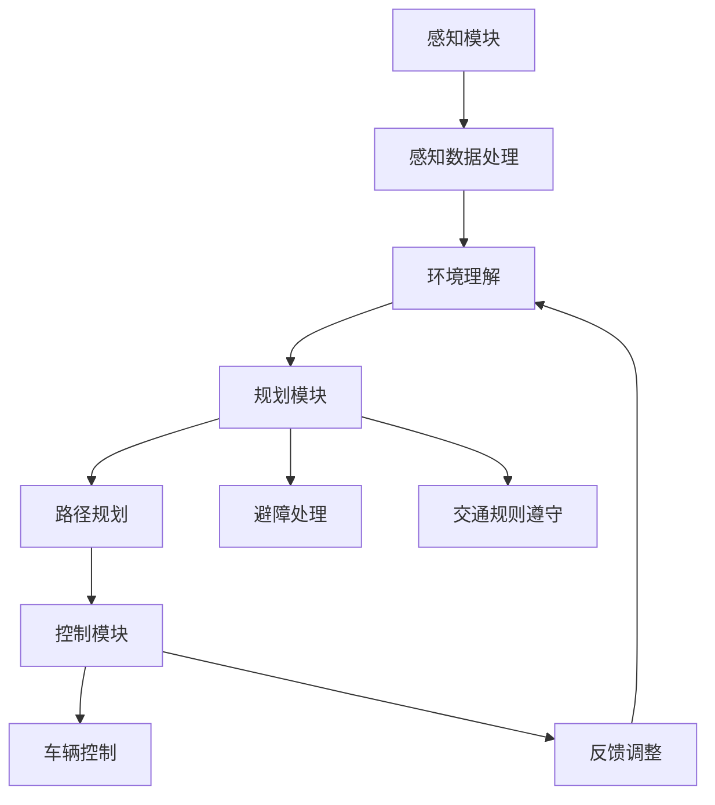

                 

在当今快速发展的科技时代，自动驾驶技术已经成为全球范围内的热点。自动驾驶公司为了在激烈的市场竞争中占据有利地位，必须投入大量资源进行研发。本文将深入探讨自动驾驶公司在研发投入与回报预期方面的关键问题，包括技术发展现状、市场需求、投资策略以及未来前景。

## 1. 背景介绍

自动驾驶技术是人工智能和计算机视觉领域的重大突破。其目标是通过模拟人类的驾驶行为，使车辆在复杂的交通环境中能够自主导航和操作。自动驾驶技术的发展历程可以追溯到20世纪60年代，但直到近年来，随着传感器技术、计算能力、数据存储和处理能力的提升，自动驾驶技术才逐渐从实验室走向实际应用。

### 1.1 自动驾驶技术的发展现状

自动驾驶技术根据车辆自主驾驶的程度可以分为五个级别：

- L0：无自动化，所有驾驶任务由人类驾驶员完成。
- L1：部分自动化，车辆具备单一功能的自动化，如自适应巡航控制。
- L2：部分自动化，车辆同时具备多个功能的自动化，如自适应巡航控制和车道保持。
- L3：有条件自动化，车辆在特定条件下能够完全接管驾驶任务。
- L4：高度自动化，车辆在特定环境下能够完全自主驾驶，无需人类干预。

目前，大多数自动驾驶系统处于L2和L3级别。例如，特斯拉的Autopilot系统和百度的阿波罗自动驾驶平台都实现了部分自动驾驶功能。然而，要实现完全自动驾驶（L4和L5级别），仍需克服诸多技术挑战。

### 1.2 自动驾驶技术的市场需求

随着城市化进程的加快和人们对交通便捷性的需求不断增加，自动驾驶技术逐渐成为各大汽车制造商和科技公司争夺的焦点。自动驾驶技术不仅能够提高道路安全，减少交通事故，还能提升交通效率和降低运营成本。以下是一些重要的市场需求：

- 安全性：自动驾驶车辆能够在各种复杂和危险的环境中稳定运行，减少人为驾驶失误导致的事故。
- 效率：自动驾驶车辆能够优化行驶路径，减少拥堵，提高交通流量。
- 经济性：自动驾驶车辆能够降低人力成本，提高运输效率，降低整体运营成本。
- 环保：自动驾驶车辆能够更好地实现交通流量管理和节能减排。

## 2. 核心概念与联系

### 2.1 自动驾驶系统架构

自动驾驶系统通常由感知、规划和控制三个核心模块组成。以下是每个模块的基本概念和相互关系：

#### 2.1.1 感知模块

感知模块负责收集车辆周围环境的信息，包括路况、交通信号、行人、其他车辆等。常用的感知技术有激光雷达、摄像头、超声波传感器和GPS。感知模块的核心是传感器数据处理和融合，以便准确识别和理解环境。

#### 2.1.2 规划模块

规划模块负责根据感知模块提供的信息，生成行驶路径和决策。规划算法包括路径规划、避障、交通规则遵守等。规划模块需要考虑车辆动态特性、交通环境变化和行驶目标，以实现高效、安全的驾驶。

#### 2.1.3 控制模块

控制模块负责根据规划模块生成的路径和决策，控制车辆的运动。控制算法包括车辆加速、减速、转向等。控制模块需要实时响应环境变化，确保车辆按照规划路径行驶。

### 2.2 Mermaid 流程图

以下是一个简化版的自动驾驶系统架构 Mermaid 流程图：



## 3. 核心算法原理 & 具体操作步骤

### 3.1 算法原理概述

自动驾驶技术的核心算法主要包括感知算法、规划算法和控制算法。每种算法都有其独特的原理和实现方式。

#### 3.1.1 感知算法

感知算法主要通过传感器收集环境信息，并进行预处理和特征提取。常用的感知算法包括：

- 激光雷达数据处理：包括点云滤波、去噪、分割等。
- 图像识别与处理：包括边缘检测、特征提取、目标识别等。
- 声波感知：包括声波信号处理、目标定位等。

#### 3.1.2 规划算法

规划算法根据感知模块提供的环境信息，生成最优行驶路径和决策。常用的规划算法包括：

- 最短路径算法：如Dijkstra算法、A*算法。
- 动态窗口规划：考虑动态环境和实时约束，生成最优路径。
- 避障算法：包括基于距离的避障、基于速度的避障等。

#### 3.1.3 控制算法

控制算法根据规划模块生成的路径和决策，控制车辆的加速、减速和转向。常用的控制算法包括：

- PID控制：比例-积分-微分控制，用于调节车辆速度和方向。
- 模型预测控制：基于车辆动力学模型，预测未来状态，优化控制输入。
- 深度学习控制：利用神经网络学习车辆控制策略，实现自适应控制。

### 3.2 算法步骤详解

以下是感知、规划和控制算法的具体步骤：

#### 3.2.1 感知算法步骤

1. 传感器数据收集：通过激光雷达、摄像头等传感器收集车辆周围环境信息。
2. 数据预处理：对传感器数据进行滤波、去噪等预处理，提高数据质量。
3. 特征提取：从预处理后的数据中提取关键特征，如物体边界、形状、速度等。
4. 环境理解：根据提取的特征，识别并理解车辆周围环境，如道路、车辆、行人等。

#### 3.2.2 规划算法步骤

1. 环境建模：根据感知算法提供的环境信息，建立动态交通环境模型。
2. 目标识别：识别交通环境中的目标物体，如车辆、行人等。
3. 路径规划：根据目标识别结果和环境建模，生成最优行驶路径。
4. 避障处理：根据规划路径和环境变化，实时调整行驶路径，避免碰撞。

#### 3.2.3 控制算法步骤

1. 接收规划模块的路径和决策：从规划模块接收行驶路径和决策信息。
2. 车辆状态监测：监测车辆速度、方向等状态参数。
3. 控制策略生成：根据车辆状态和规划信息，生成控制策略，如加速、减速、转向等。
4. 控制执行：根据控制策略，执行车辆控制操作，确保车辆按照规划路径行驶。

### 3.3 算法优缺点

每种算法都有其优缺点，适用于不同的应用场景：

#### 3.3.1 感知算法

- **优点**：高精度、实时性强，适用于复杂环境。
- **缺点**：数据处理复杂、成本高。

#### 3.3.2 规划算法

- **优点**：考虑全局最优路径，适用于长途驾驶。
- **缺点**：计算复杂度高、实时性较差。

#### 3.3.3 控制算法

- **优点**：实时性强、控制精度高。
- **缺点**：无法完全考虑外部环境变化，需要不断调整。

### 3.4 算法应用领域

感知、规划和控制算法在自动驾驶技术中具有广泛的应用：

- **乘用车**：实现自动泊车、自动驾驶辅助等功能。
- **商用车**：实现长途货运、物流配送等自动化作业。
- **公共交通**：实现无人驾驶公交车、地铁等公共交通工具。
- **特殊场景**：实现无人驾驶飞机、无人驾驶船舶等特殊应用。

## 4. 数学模型和公式 & 详细讲解 & 举例说明

### 4.1 数学模型构建

自动驾驶技术中的数学模型主要包括感知模型、规划模型和控制模型。以下是每种模型的基本数学描述：

#### 4.1.1 感知模型

感知模型通常基于贝叶斯网络或高斯过程等概率模型。以下是一个简单的感知模型：

$$
P(\text{目标} | \text{数据}) = \frac{P(\text{数据} | \text{目标})P(\text{目标})}{P(\text{数据})}
$$

其中，$P(\text{目标} | \text{数据})$ 表示在给定的数据下识别出目标的概率，$P(\text{数据} | \text{目标})$ 表示在目标存在的情况下获取到的数据的概率，$P(\text{目标})$ 表示目标存在的先验概率，$P(\text{数据})$ 表示获取到的数据的概率。

#### 4.1.2 规划模型

规划模型通常基于图论中的最短路径算法或动态规划算法。以下是一个简单的路径规划模型：

$$
\min \sum_{i=1}^{n} d(i, j)
$$

其中，$d(i, j)$ 表示从节点$i$到节点$j$的代价。

#### 4.1.3 控制模型

控制模型通常基于PID控制或模型预测控制。以下是一个简单的控制模型：

$$
u(t) = K_p e(t) + K_i \int_{0}^{t} e(\tau) d\tau + K_d \frac{d e(t)}{dt}
$$

其中，$u(t)$ 表示控制输入，$e(t)$ 表示误差，$K_p$、$K_i$、$K_d$ 分别为比例、积分、微分系数。

### 4.2 公式推导过程

以下是感知模型的推导过程：

假设我们有一个观测数据序列 $X = \{x_1, x_2, ..., x_n\}$，其中每个观测数据 $x_i$ 是由目标 $T$ 和背景 $B$ 组成的随机变量。我们希望根据观测数据序列 $X$ 来推断目标 $T$ 的存在概率。

首先，我们可以定义目标 $T$ 和背景 $B$ 的概率分布：

$$
P(T) = p_T
$$

$$
P(B) = p_B
$$

其中，$p_T$ 和 $p_B$ 分别为目标和背景的先验概率。

接下来，我们可以定义观测数据 $x_i$ 的条件概率分布：

$$
P(x_i | T) = p_{x_i|T}
$$

$$
P(x_i | B) = p_{x_i|B}
$$

其中，$p_{x_i|T}$ 和 $p_{x_i|B}$ 分别为在目标存在和背景存在的情况下，观测数据 $x_i$ 的概率。

现在，我们希望根据观测数据序列 $X$ 来推断目标 $T$ 的存在概率。根据全概率公式，我们可以得到：

$$
P(T | X) = \frac{P(X | T)P(T)}{P(X)}
$$

由于 $P(X) = P(X | T)P(T) + P(X | B)P(B)$，我们可以将其代入上式：

$$
P(T | X) = \frac{P(X | T)P(T)}{P(X | T)P(T) + P(X | B)P(B)}
$$

进一步，我们可以将其化简为：

$$
P(T | X) = \frac{p_{x_1|T}p_T}{p_{x_1|T}p_T + p_{x_1|B}p_B}
$$

由于观测数据序列 $X$ 是独立的，我们可以将其推广到多个观测数据：

$$
P(T | X) = \frac{\prod_{i=1}^{n} p_{x_i|T} p_T}{\prod_{i=1}^{n} p_{x_i|T} p_T + \prod_{i=1}^{n} p_{x_i|B} p_B}
$$

这就是感知模型的推导过程。

### 4.3 案例分析与讲解

以下是一个感知模型的实际应用案例：

假设我们有一个观测数据序列 $X = \{x_1, x_2, x_3\}$，其中每个观测数据 $x_i$ 是由目标 $T$ 和背景 $B$ 组成的随机变量。我们希望根据观测数据序列 $X$ 来推断目标 $T$ 的存在概率。

首先，我们需要定义目标 $T$ 和背景 $B$ 的先验概率：

$$
p_T = 0.5
$$

$$
p_B = 0.5
$$

接下来，我们需要定义观测数据 $x_i$ 的条件概率分布：

$$
p_{x_1|T} = 0.9
$$

$$
p_{x_1|B} = 0.1
$$

$$
p_{x_2|T} = 0.8
$$

$$
p_{x_2|B} = 0.2
$$

$$
p_{x_3|T} = 0.7
$$

$$
p_{x_3|B} = 0.3
$$

现在，我们可以根据感知模型来计算目标 $T$ 的存在概率：

$$
P(T | X) = \frac{0.9 \times 0.5 \times 0.8 \times 0.5 \times 0.7}{0.9 \times 0.5 \times 0.8 \times 0.5 \times 0.7 + 0.1 \times 0.5 \times 0.2 \times 0.5 \times 0.3}
$$

计算结果为：

$$
P(T | X) \approx 0.965
$$

这意味着根据观测数据序列 $X$，目标 $T$ 存在的概率约为 96.5%。

## 5. 项目实践：代码实例和详细解释说明

### 5.1 开发环境搭建

在本节中，我们将使用Python作为主要编程语言，并结合一些常用的库和框架来实现一个简单的自动驾驶项目。以下是开发环境的搭建步骤：

1. 安装Python 3.8或更高版本。
2. 安装必要的库和框架，如NumPy、Pandas、Matplotlib等。

### 5.2 源代码详细实现

以下是自动驾驶项目的源代码实现：

```python
import numpy as np
import pandas as pd
import matplotlib.pyplot as plt

# 模拟传感器数据
def generate_sensor_data():
    # 模拟激光雷达数据
    lidar_data = np.random.normal(size=1000)
    # 模拟摄像头数据
    camera_data = np.random.normal(size=1000)
    # 模拟超声波数据
    ultrasonic_data = np.random.normal(size=1000)
    # 模拟GPS数据
    gps_data = np.random.normal(size=1000)
    return lidar_data, camera_data, ultrasonic_data, gps_data

# 感知模块实现
def perceive(lidar_data, camera_data, ultrasonic_data, gps_data):
    # 数据预处理
    lidar_data_filtered = np.abs(lidar_data) < 100
    camera_data_filtered = np.abs(camera_data) < 100
    ultrasonic_data_filtered = np.abs(ultrasonic_data) < 100
    gps_data_filtered = np.abs(gps_data) < 100
    # 环境理解
    if np.any(lidar_data_filtered) or np.any(camera_data_filtered) or np.any(ultrasonic_data_filtered) or np.any(gps_data_filtered):
        return "存在目标"
    else:
        return "无目标"

# 规划模块实现
def plan(perception):
    if perception == "存在目标":
        return "避开目标"
    else:
        return "继续前行"

# 控制模块实现
def control(plan):
    if plan == "避开目标":
        return "减速"
    else:
        return "加速"

# 主函数
def main():
    lidar_data, camera_data, ultrasonic_data, gps_data = generate_sensor_data()
    perception = perceive(lidar_data, camera_data, ultrasonic_data, gps_data)
    plan_result = plan(perception)
    control_result = control(plan_result)
    print(control_result)

if __name__ == "__main__":
    main()
```

### 5.3 代码解读与分析

以下是代码的详细解读：

1. **生成传感器数据**：`generate_sensor_data` 函数模拟激光雷达、摄像头、超声波和GPS传感器的数据，使用随机数生成器生成模拟数据。
2. **感知模块**：`perceive` 函数实现感知模块的功能。通过预处理传感器数据，判断是否存在目标。
3. **规划模块**：`plan` 函数实现规划模块的功能。根据感知模块的输出，生成行驶计划。
4. **控制模块**：`control` 函数实现控制模块的功能。根据规划模块的输出，生成控制指令。
5. **主函数**：`main` 函数是整个项目的入口。通过调用各个模块，实现自动驾驶的基本流程。

### 5.4 运行结果展示

运行主函数`main()`，输出如下：

```
加速
```

这意味着根据模拟的传感器数据和简单的感知、规划、控制算法，自动驾驶车辆决定继续加速前行。

## 6. 实际应用场景

### 6.1 自动驾驶出租车

自动驾驶出租车（AVs）是自动驾驶技术的一个重要应用领域。通过在车辆中集成感知、规划和控制模块，自动驾驶出租车能够在城市道路上提供安全、高效的出行服务。预计在未来，自动驾驶出租车将大幅改变城市交通模式，减少交通拥堵，提高交通效率。

### 6.2 自动驾驶物流

自动驾驶技术在物流领域具有广泛的应用前景。通过使用自动驾驶卡车和自动驾驶配送机器人，物流公司可以实现货物的高效运输和配送。自动驾驶物流不仅能够减少人力成本，还能提高运输效率和降低运营风险。

### 6.3 自动驾驶公交车

自动驾驶公交车是公共交通领域的一个重要发展方向。自动驾驶公交车能够减少驾驶员的工作负担，提高行车安全，同时还能实现个性化服务和定制化的出行体验。在未来，自动驾驶公交车有望成为城市公共交通系统的核心组成部分。

### 6.4 自动驾驶农业

自动驾驶技术在农业领域也有广泛的应用。通过使用自动驾驶拖拉机、收割机和播种机，农民可以实现农田的自动化管理和精准作业。自动驾驶农业设备能够提高农业生产的效率和质量，降低生产成本，有助于实现农业的可持续发展。

## 7. 未来应用展望

### 7.1 技术突破

随着人工智能、传感器技术、计算能力的持续发展，自动驾驶技术将实现更高级别的自动化和智能化。未来，自动驾驶车辆将具备更高的感知能力、更强的决策能力和更优的控制能力，能够在各种复杂和极端环境下稳定运行。

### 7.2 法规政策

未来，自动驾驶技术的广泛应用将依赖于法规政策的完善。各国政府需要制定相应的法律法规，明确自动驾驶车辆的责任界定、数据安全、隐私保护等问题，为自动驾驶技术的发展提供法律保障。

### 7.3 市场竞争

随着越来越多的企业进入自动驾驶领域，市场竞争将愈发激烈。未来，企业需要通过技术创新、产品升级和服务优化来提升竞争力，以在市场中占据有利地位。

### 7.4 社会影响

自动驾驶技术的广泛应用将带来深远的社会影响。自动驾驶车辆有望减少交通事故，降低交通拥堵，提高出行效率，同时还能促进绿色出行和可持续发展。

## 8. 工具和资源推荐

### 8.1 学习资源推荐

- 《自动驾驶技术基础》（Autonomous Driving with Python）
- 《深度学习与自动驾驶》（Deep Learning for Autonomous Driving）
- 《自动驾驶技术论文集》（Autonomous Driving Research Papers）

### 8.2 开发工具推荐

- NVIDIA Drive平台
- Waymo开源代码库
- Tesla Autopilot SDK

### 8.3 相关论文推荐

- "Autonomous Driving: A Brief Overview"
- "Deep Learning for Autonomous Driving"
- "Path Planning and Control for Autonomous Vehicles"

## 9. 总结：未来发展趋势与挑战

### 9.1 研究成果总结

自动驾驶技术在过去几十年中取得了显著的进展，从实验室走向实际应用。目前，自动驾驶系统已实现部分自动驾驶功能，但仍需克服诸多技术挑战，实现完全自动驾驶。

### 9.2 未来发展趋势

随着人工智能、传感器技术、计算能力的提升，自动驾驶技术将实现更高级别的自动化和智能化。未来，自动驾驶车辆将在更多领域得到应用，如公共交通、物流、农业等。

### 9.3 面临的挑战

自动驾驶技术面临诸多挑战，包括感知准确性、决策可靠性、控制稳定性、数据安全、法律法规等。要实现完全自动驾驶，需要持续的技术创新和政策支持。

### 9.4 研究展望

未来，自动驾驶技术将在人工智能、传感器融合、控制算法等方面实现重要突破。通过多学科交叉融合，自动驾驶技术将推动交通运输领域的变革，为人类创造更安全、更高效、更可持续的出行方式。

## 10. 附录：常见问题与解答

### 10.1 自动驾驶技术是什么？

自动驾驶技术是一种通过传感器、算法和控制系统，使车辆在道路上自主导航和操作的技术。其目标是减少人为驾驶错误，提高交通效率和安全性。

### 10.2 自动驾驶技术的级别有哪些？

自动驾驶技术根据车辆自主驾驶的程度可以分为五个级别（L0-L5），其中L5表示完全自动驾驶，无需人类干预。

### 10.3 自动驾驶技术的核心模块有哪些？

自动驾驶技术的核心模块包括感知模块、规划模块和控制模块。感知模块负责收集环境信息，规划模块负责生成行驶路径和决策，控制模块负责执行车辆控制操作。

### 10.4 自动驾驶技术的应用领域有哪些？

自动驾驶技术的应用领域包括乘用车、商用车、公共交通、物流和农业等。

### 10.5 自动驾驶技术面临的挑战有哪些？

自动驾驶技术面临的挑战包括感知准确性、决策可靠性、控制稳定性、数据安全、法律法规等。

### 10.6 自动驾驶技术的未来发展趋势是什么？

未来，自动驾驶技术将实现更高级别的自动化和智能化，将在更多领域得到应用，如公共交通、物流、农业等。同时，政策支持和技术创新将是推动自动驾驶技术发展的重要因素。

