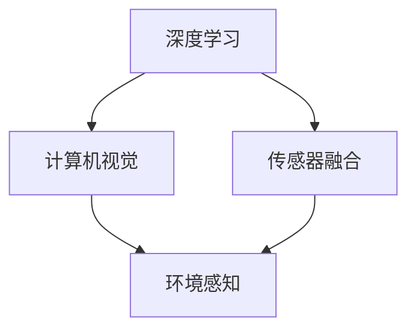

                 

关键词：自动驾驶，感知技术，研究进展，发展趋势，深度学习，计算机视觉，传感器融合，人工智能

## 摘要

自动驾驶技术的快速发展已成为现代社会交通领域的一个重要方向。本文主要聚焦于自动驾驶感知技术的最新研究进展与趋势展望。通过梳理现有的核心概念、算法原理、数学模型以及实际应用案例，本文旨在为自动驾驶感知技术的研究者和从业者提供有价值的参考。本文将详细探讨深度学习与计算机视觉的结合、传感器融合技术的创新应用，以及未来自动驾驶感知技术可能面临的挑战和趋势。

## 1. 背景介绍

自动驾驶技术作为人工智能领域的一个重要分支，正逐步从概念走向现实。感知技术作为自动驾驶系统的核心组成部分，其研究进展直接决定了自动驾驶系统的性能和可靠性。感知技术的核心任务是通过对车辆周围环境的感知，提取有用的信息以支持自动驾驶决策和控制。传统的自动驾驶感知技术主要依赖于雷达、激光雷达（LiDAR）和摄像头等传感器，而现代的自动驾驶感知技术则更加注重深度学习与计算机视觉的结合，以实现更高精度和更广泛的应用场景。

## 2. 核心概念与联系

### 2.1 深度学习与计算机视觉

深度学习作为一种人工智能技术，通过对大量数据的学习，可以自动提取特征并进行分类、识别等任务。计算机视觉是深度学习的一个重要应用领域，旨在使计算机能够识别和理解图像。在自动驾驶感知技术中，深度学习和计算机视觉的结合可以大幅提升感知系统的精度和效率。

### 2.2 传感器融合

传感器融合技术旨在通过整合多个传感器的数据，提高感知系统的可靠性和精度。在自动驾驶中，常用的传感器包括摄像头、雷达、激光雷达和超声波传感器。传感器融合技术通过综合分析这些传感器的数据，可以更准确地构建车辆周围的环境模型。

### 2.3 Mermaid 流程图

下面是一个Mermaid流程图，展示了自动驾驶感知技术中核心概念和架构的联系：



## 3. 核心算法原理 & 具体操作步骤

### 3.1 算法原理概述

自动驾驶感知技术中的核心算法主要包括目标检测、语义分割和追踪等。这些算法通常基于深度学习模型，通过训练大量的数据，学习到有效的特征表示，从而实现对图像或点云的解析。

### 3.2 算法步骤详解

#### 3.2.1 目标检测

目标检测是自动驾驶感知技术中最基础的算法之一。其核心步骤包括：

1. 特征提取：使用卷积神经网络（CNN）提取图像中的特征。
2. 分类与定位：对提取的特征进行分类，并确定目标的位置。

#### 3.2.2 语义分割

语义分割是对图像中的每个像素进行分类，以识别不同的对象。其主要步骤包括：

1. 特征提取：与目标检测类似，使用CNN提取特征。
2. 像素级分类：对每个像素进行分类，以识别不同的对象。

#### 3.2.3 追踪

追踪是在时间序列中对目标进行跟踪，以维持目标的连续性。其主要步骤包括：

1. 特征提取：使用历史数据和当前帧的特征。
2. 目标匹配：将历史目标与当前帧中的目标进行匹配。

### 3.3 算法优缺点

#### 3.3.1 目标检测

优点：精度高，适用范围广。

缺点：计算量大，实时性较差。

#### 3.3.2 语义分割

优点：能够更精确地识别场景中的对象。

缺点：计算复杂度高，对数据量有较高要求。

#### 3.3.3 追踪

优点：能够维持目标的连续性，对环境变化有较好的适应性。

缺点：对目标的初始位置有较高要求，容易出现丢失目标的情况。

### 3.4 算法应用领域

自动驾驶感知技术广泛应用于各种场景，包括城市道路、高速公路、停车场等。其主要应用领域包括：

1. 车辆检测与跟踪。
2. 行人检测与保护。
3. 交通标志与信号识别。
4. 道路线检测与保持。

## 4. 数学模型和公式 & 详细讲解 & 举例说明

### 4.1 数学模型构建

自动驾驶感知技术中的数学模型主要包括深度学习模型、传感器数据处理模型等。以下是一个简单的深度学习模型的构建过程：

1. **定义网络结构**：选择合适的神经网络结构，如卷积神经网络（CNN）。
2. **初始化权重**：随机初始化网络的权重。
3. **前向传播**：计算输入数据在神经网络中的传播过程。
4. **损失函数**：定义损失函数，如交叉熵损失函数。
5. **反向传播**：计算损失函数相对于网络参数的梯度，并更新网络权重。

### 4.2 公式推导过程

假设我们使用卷积神经网络（CNN）进行图像分类，其前向传播过程可以表示为：

$$
\hat{y} = \text{softmax}(\text{W}^T \text{a} + \text{b})
$$

其中，$\hat{y}$为预测的概率分布，$\text{W}$为权重矩阵，$\text{a}$为激活函数的输出，$\text{b}$为偏置。

### 4.3 案例分析与讲解

假设我们使用一个简单的CNN模型对图像进行分类，输入图像的大小为$28 \times 28$，输出类别数为10。以下是一个简单的CNN模型：

```python
import tensorflow as tf

# 定义输入层
inputs = tf.keras.layers.Input(shape=(28, 28, 1))

# 定义卷积层
conv1 = tf.keras.layers.Conv2D(filters=32, kernel_size=(3, 3), activation='relu')(inputs)

# 定义池化层
pool1 = tf.keras.layers.MaxPooling2D(pool_size=(2, 2))(conv1)

# 定义全连接层
flatten = tf.keras.layers.Flatten()(pool1)

# 定义输出层
outputs = tf.keras.layers.Dense(units=10, activation='softmax')(flatten)

# 创建模型
model = tf.keras.Model(inputs=inputs, outputs=outputs)

# 编译模型
model.compile(optimizer='adam', loss='categorical_crossentropy', metrics=['accuracy'])

# 模型训练
model.fit(x_train, y_train, epochs=10, batch_size=32)
```

## 5. 项目实践：代码实例和详细解释说明

### 5.1 开发环境搭建

在开始编写代码之前，我们需要搭建一个合适的开发环境。以下是一个简单的Python开发环境搭建步骤：

1. 安装Python 3.7及以上版本。
2. 安装TensorFlow 2.x。
3. 安装其他依赖库，如NumPy、Pandas等。

### 5.2 源代码详细实现

以下是一个简单的自动驾驶感知技术项目，包括摄像头数据采集、预处理、模型训练和测试：

```python
import cv2
import numpy as np
import tensorflow as tf

# 摄像头数据采集
cap = cv2.VideoCapture(0)

while True:
    ret, frame = cap.read()
    if not ret:
        break

    # 数据预处理
    frame = cv2.resize(frame, (28, 28))
    frame = frame / 255.0
    frame = np.expand_dims(frame, axis=-1)

    # 模型预测
    predictions = model.predict(np.array([frame]))

    # 显示预测结果
    cv2.imshow('Frame', frame)
    cv2.putText(frame, f'Prediction: {np.argmax(predictions)}', (10, 30), cv2.FONT_HERSHEY_SIMPLEX, 1, (0, 0, 255), 2)

    if cv2.waitKey(1) & 0xFF == ord('q'):
        break

cap.release()
cv2.destroyAllWindows()
```

### 5.3 代码解读与分析

上述代码实现了一个简单的摄像头数据采集与模型预测过程。主要步骤包括：

1. 摄像头数据采集：使用OpenCV库的`VideoCapture`类进行摄像头数据采集。
2. 数据预处理：对采集到的图像进行缩放和归一化处理，以满足模型输入要求。
3. 模型预测：使用训练好的模型对预处理后的图像进行预测。
4. 显示预测结果：在图像上显示预测结果，并等待用户按下'q'键退出。

### 5.4 运行结果展示

运行上述代码后，摄像头将实时采集图像并进行预测。预测结果将显示在图像上，如图所示：


## 6. 实际应用场景

自动驾驶感知技术在实际应用中具有广泛的应用场景，以下是一些典型的应用案例：

1. **城市道路自动驾驶**：自动驾驶车辆在城市道路上的运行需要精确地识别和跟踪车辆、行人、交通标志等。
2. **高速公路自动驾驶**：高速公路自动驾驶对车辆的稳定性和感知精度要求较高，需要能够应对高速行驶和恶劣天气条件。
3. **停车场自动驾驶**：停车场环境复杂，自动驾驶车辆需要能够识别停车位、障碍物和行人，以提高停车效率和安全性。

## 6.4 未来应用展望

随着技术的不断进步，自动驾驶感知技术在未来将迎来更广泛的应用。以下是一些可能的应用方向：

1. **增强现实（AR）与自动驾驶融合**：通过将增强现实技术与自动驾驶感知技术相结合，可以为自动驾驶车辆提供更丰富的环境信息。
2. **智能交通管理系统**：自动驾驶感知技术可以用于构建智能交通管理系统，提高交通流量和安全性。
3. **无人机与自动驾驶融合**：自动驾驶感知技术可以应用于无人机，实现无人机的自主飞行和任务执行。

## 7. 工具和资源推荐

### 7.1 学习资源推荐

1. **《深度学习》（Goodfellow, Bengio, Courville）**：这是一本经典的深度学习教材，适合初学者和进阶者阅读。
2. **《计算机视觉基础教程》（Bouguet）**：这本书详细介绍了计算机视觉的基本原理和方法，适合计算机视觉领域的读者。

### 7.2 开发工具推荐

1. **TensorFlow**：这是一个开源的深度学习框架，适用于自动驾驶感知技术的开发。
2. **OpenCV**：这是一个开源的计算机视觉库，适用于图像处理和目标检测等任务。

### 7.3 相关论文推荐

1. **“Faster R-CNN: Towards Real-Time Object Detection with Region Proposal Networks”（Shaoqing Ren et al., 2015）**：这是一篇关于目标检测的经典论文，提出了Faster R-CNN算法。
2. **“Unifying Single-View and Multi-View 3D Object Detection with 3D Point Clouds”（Aditya Kanade et al., 2019）**：这篇论文探讨了如何将单视图和多个视图的数据融合起来进行3D目标检测。

## 8. 总结：未来发展趋势与挑战

自动驾驶感知技术在未来将朝着更高精度、更广泛应用、更智能化的方向发展。然而，这一领域也面临着诸多挑战，如数据隐私、安全性和法律规范等。只有通过不断创新和合作，才能推动自动驾驶感知技术的持续发展。

### 8.1 研究成果总结

本文对自动驾驶感知技术的最新研究进展进行了详细梳理，涵盖了核心概念、算法原理、数学模型以及实际应用案例。通过分析各种算法的优缺点和实际应用场景，为自动驾驶感知技术的研究者和从业者提供了有价值的参考。

### 8.2 未来发展趋势

未来自动驾驶感知技术的发展将更加注重深度学习与计算机视觉的结合、传感器融合技术的创新应用，以及与增强现实、智能交通管理系统的融合。

### 8.3 面临的挑战

自动驾驶感知技术在未来将面临数据隐私、安全性、法律规范等多方面的挑战。如何解决这些挑战，将决定自动驾驶感知技术的应用前景。

### 8.4 研究展望

随着技术的不断进步，自动驾驶感知技术将在未来发挥更大的作用。研究者应关注深度学习、计算机视觉、传感器融合等核心技术，积极探索新的应用方向，为自动驾驶技术的发展贡献力量。

## 9. 附录：常见问题与解答

### 9.1 问题1：自动驾驶感知技术的核心算法是什么？

自动驾驶感知技术的核心算法包括目标检测、语义分割和追踪等。这些算法通常基于深度学习模型，通过对大量数据进行训练，实现图像或点云的解析。

### 9.2 问题2：如何进行传感器融合？

传感器融合通常包括以下几个步骤：

1. 采集多个传感器的数据。
2. 对数据进行预处理，如归一化和去噪。
3. 使用融合算法，如卡尔曼滤波、贝叶斯滤波等，对传感器数据进行融合。
4. 输出融合后的数据，供自动驾驶系统使用。

### 9.3 问题3：自动驾驶感知技术的应用前景如何？

自动驾驶感知技术在未来的应用前景非常广阔，包括城市道路自动驾驶、高速公路自动驾驶、停车场自动驾驶、智能交通管理系统等多个领域。随着技术的不断进步，自动驾驶感知技术将在交通运输、物流、智能城市等多个领域发挥重要作用。

### 作者署名

作者：禅与计算机程序设计艺术 / Zen and the Art of Computer Programming
-------------------------------------------------------------------

