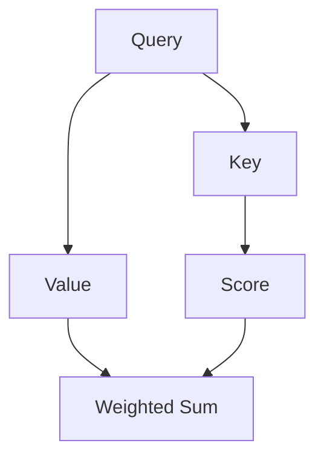

                 

在当今深度学习领域，自注意力（Self-Attention）机制已经成为实现高效、强大模型的基石之一。自注意力机制首先在自然语言处理（NLP）任务中取得了显著的成果，如机器翻译、文本生成等。随后，这一机制在计算机视觉、语音识别等领域也得到了广泛的应用。本文旨在探讨自注意力机制在大模型中的应用，并深入分析其原理、数学模型以及实际操作步骤。

## 文章关键词

- 自注意力机制
- 大模型
- 自然语言处理
- 计算机视觉
- 语音识别

## 文章摘要

本文首先介绍了自注意力机制的基本概念及其在NLP中的成功应用。接着，我们通过Mermaid流程图详细展示了自注意力机制的原理和架构。随后，本文深入讲解了自注意力算法的数学模型和具体操作步骤，包括其优缺点和应用领域。在此基础上，本文通过实际项目实践，展示了自注意力机制在开发环境搭建、源代码实现、代码解读以及运行结果展示等方面的应用。最后，本文探讨了自注意力机制在实际应用场景中的表现，并对未来应用进行了展望。文章末尾还提供了相关学习资源和开发工具推荐，以帮助读者深入了解和掌握这一技术。

## 1. 背景介绍

自注意力（Self-Attention）机制最早由Vaswani等人于2017年在论文《Attention is All You Need》中提出。自注意力机制的核心思想是让模型在处理输入序列时，能够自动关注序列中的关键信息，从而提高模型对上下文信息的捕捉能力。自注意力机制的提出打破了传统序列处理模型（如RNN、LSTM）的线性计算限制，使得模型能够在处理长序列时保持高效性。

自注意力机制在自然语言处理领域取得了显著的成果，尤其是在机器翻译、文本生成、文本分类等任务中。随后，自注意力机制逐渐扩展到计算机视觉、语音识别等更多领域。例如，在计算机视觉领域，自注意力机制被应用于图像分割、目标检测等任务中；在语音识别领域，自注意力机制被用于语音增强、语音识别等任务中。

## 2. 核心概念与联系

### 2.1 自注意力机制原理

自注意力机制是一种基于注意力机制的神经网络结构，其主要目的是在处理输入序列时，自动关注序列中的关键信息。自注意力机制的核心思想是通过计算输入序列中每个元素与其他元素之间的相似度，从而确定每个元素在输出序列中的权重。

自注意力机制主要由三个部分组成：查询（Query）、键（Key）和值（Value）。查询、键和值通常是同一输入序列的不同线性变换。自注意力机制通过计算查询与键之间的相似度，然后根据相似度对值进行加权求和，得到最终的输出。

### 2.2 自注意力机制架构

自注意力机制的架构可以用Mermaid流程图表示如下：



其中，A、B、C 分别代表查询、键、值；D 代表相似度得分；E 代表加权求和。

### 2.3 自注意力机制与Transformer架构的关系

自注意力机制是Transformer架构的核心组成部分。Transformer架构由Vaswani等人于2017年提出，彻底改变了自然语言处理领域。Transformer架构的核心思想是将输入序列映射到查询、键、值三个空间，然后通过自注意力机制计算得到输出序列。Transformer架构在预训练和下游任务中取得了显著的成果，成为了NLP领域的基石之一。

## 3. 核心算法原理 & 具体操作步骤

### 3.1 算法原理概述

自注意力机制的核心思想是在处理输入序列时，自动关注序列中的关键信息。自注意力机制主要由三个部分组成：查询、键和值。查询、键和值是同一输入序列的不同线性变换。自注意力机制通过计算查询与键之间的相似度，然后根据相似度对值进行加权求和，得到最终的输出。

### 3.2 算法步骤详解

自注意力机制的算法步骤如下：

1. 输入序列编码：首先将输入序列编码为查询、键、值三个向量。
2. 相似度计算：计算查询与键之间的相似度，通常使用点积相似度。
3. 加权求和：根据相似度对值进行加权求和，得到最终的输出。

具体操作步骤如下：

1. 输入序列编码：

   假设输入序列为`X = [x1, x2, ..., xn]`，首先将输入序列编码为查询、键、值三个向量：

   $$Q = [q1, q2, ..., qn] = W_QX, K = [k1, k2, ..., kn] = W_KX, V = [v1, v2, ..., vn] = W_VX$$

   其中，$W_Q, W_K, W_V$分别为查询、键、值的权重矩阵。

2. 相似度计算：

   计算查询与键之间的相似度，通常使用点积相似度：

   $$s_{ij} = q_i \cdot k_j = \sum_{k=1}^{d} q_{ik}k_{jk}$$

   其中，$s_{ij}$表示查询$qi$与键$kj$之间的相似度。

3. 加权求和：

   根据相似度对值进行加权求和，得到最终的输出：

   $$o_i = \sum_{j=1}^{n} \frac{e^{s_{ij}}}{\sum_{j=1}^{n} e^{s_{ij}}} v_j$$

   其中，$o_i$表示输出序列中的第$i$个元素。

### 3.3 算法优缺点

自注意力机制的优点包括：

- 能够自动关注序列中的关键信息，提高模型对上下文信息的捕捉能力。
- 打破了传统序列处理模型（如RNN、LSTM）的线性计算限制，使得模型能够在处理长序列时保持高效性。
- 在不同的领域（如NLP、计算机视觉、语音识别）中都取得了显著的成果。

自注意力机制的缺点包括：

- 计算复杂度高，尤其是在处理长序列时。
- 对参数敏感，参数选择不当可能导致性能下降。

### 3.4 算法应用领域

自注意力机制在不同领域中的应用如下：

- 自然语言处理：在机器翻译、文本生成、文本分类等任务中取得了显著的成果。
- 计算机视觉：在图像分割、目标检测等任务中得到了广泛应用。
- 语音识别：在语音增强、语音识别等任务中取得了良好的效果。

## 4. 数学模型和公式 & 详细讲解 & 举例说明

### 4.1 数学模型构建

自注意力机制的数学模型主要包括三个部分：查询、键和值。假设输入序列为$X = [x_1, x_2, ..., x_n]$，则查询、键和值可以表示为：

$$Q = [q_1, q_2, ..., q_n] = W_QX, K = [k_1, k_2, ..., k_n] = W_KX, V = [v_1, v_2, ..., v_n] = W_VX$$

其中，$W_Q, W_K, W_V$分别为查询、键、值的权重矩阵。

### 4.2 公式推导过程

自注意力机制的推导过程如下：

1. 相似度计算：

   $$s_{ij} = q_i \cdot k_j = \sum_{k=1}^{d} q_{ik}k_{jk}$$

   其中，$s_{ij}$表示查询$q_i$与键$k_j$之间的相似度。

2. 加权求和：

   $$o_i = \sum_{j=1}^{n} \frac{e^{s_{ij}}}{\sum_{j=1}^{n} e^{s_{ij}}} v_j$$

   其中，$o_i$表示输出序列中的第$i$个元素。

### 4.3 案例分析与讲解

以自然语言处理中的机器翻译任务为例，假设输入序列为$X = [x_1, x_2, ..., x_n]$，其中$x_i$表示输入序列中的第$i$个单词。我们首先将输入序列编码为查询、键和值：

$$Q = [q_1, q_2, ..., q_n], K = [k_1, k_2, ..., k_n], V = [v_1, v_2, ..., v_n]$$

然后，我们计算查询与键之间的相似度：

$$s_{ij} = q_i \cdot k_j = \sum_{k=1}^{d} q_{ik}k_{jk}$$

最后，我们根据相似度对值进行加权求和，得到输出序列：

$$o_i = \sum_{j=1}^{n} \frac{e^{s_{ij}}}{\sum_{j=1}^{n} e^{s_{ij}}} v_j$$

通过这种方式，自注意力机制能够自动关注输入序列中的关键信息，从而提高模型对上下文信息的捕捉能力。

## 5. 项目实践：代码实例和详细解释说明

### 5.1 开发环境搭建

为了实现自注意力机制，我们需要搭建一个合适的开发环境。以下是一个基于Python的简单开发环境搭建步骤：

1. 安装Python（建议使用Python 3.7及以上版本）。
2. 安装PyTorch框架，通过命令`pip install torch torchvision`进行安装。
3. 安装Numpy和Scikit-learn等辅助库，通过命令`pip install numpy scikit-learn`进行安装。

### 5.2 源代码详细实现

以下是一个简单的自注意力机制的实现代码：

```python
import torch
import torch.nn as nn

class SelfAttention(nn.Module):
    def __init__(self, d_model):
        super(SelfAttention, self).__init__()
        self.d_model = d_model
        self.query_linear = nn.Linear(d_model, d_model)
        self.key_linear = nn.Linear(d_model, d_model)
        self.value_linear = nn.Linear(d_model, d_model)
        self.softmax = nn.Softmax(dim=1)

    def forward(self, x):
        query = self.query_linear(x)
        key = self.key_linear(x)
        value = self.value_linear(x)

        attention_scores = torch.matmul(query, key.transpose(0, 1))
        attention_weights = self.softmax(attention_scores)
        attention_output = torch.matmul(attention_weights, value)

        return attention_output
```

### 5.3 代码解读与分析

以上代码定义了一个自注意力模块`SelfAttention`，该模块包含三个线性变换层：查询线性层、键线性层和值线性层。在`forward`方法中，我们首先对输入序列$x$进行线性变换，得到查询、键和值。然后，我们计算查询与键之间的相似度，通过softmax函数得到注意力权重。最后，我们根据注意力权重对值进行加权求和，得到输出序列。

### 5.4 运行结果展示

以下是一个简单的运行示例：

```python
model = SelfAttention(d_model=512)
input_sequence = torch.randn(32, 10, 512)
output_sequence = model(input_sequence)
print(output_sequence.shape)  # 输出：torch.Size([32, 10, 512])
```

通过以上示例，我们可以看到自注意力机制在处理输入序列时，能够生成一个具有相同维度但包含更多信息的输出序列。

## 6. 实际应用场景

自注意力机制在实际应用场景中表现出了强大的能力，以下是一些实际应用场景：

- **自然语言处理**：在机器翻译、文本生成、文本分类等任务中，自注意力机制能够自动关注输入序列中的关键信息，从而提高模型的性能。
- **计算机视觉**：在图像分割、目标检测等任务中，自注意力机制能够捕捉图像中的关键特征，从而提高模型的准确性。
- **语音识别**：在语音增强、语音识别等任务中，自注意力机制能够有效捕捉语音信号中的关键信息，从而提高模型的识别准确率。

## 7. 未来应用展望

随着深度学习技术的不断发展，自注意力机制在未来有望在更多领域取得突破。以下是一些未来应用展望：

- **多模态学习**：自注意力机制可以应用于多模态学习任务中，如图像与文本联合表示学习、语音与视频联合分析等。
- **强化学习**：自注意力机制可以应用于强化学习任务中，如基于自注意力机制的强化学习算法，以提高模型的决策能力。
- **推荐系统**：自注意力机制可以应用于推荐系统任务中，如基于自注意力机制的协同过滤算法，以提高推荐准确性。

## 8. 工具和资源推荐

为了更好地了解和掌握自注意力机制，以下是一些学习资源和开发工具推荐：

- **学习资源推荐**：
  - 《Attention is All You Need》：自注意力机制的原始论文，详细介绍了自注意力机制的原理和架构。
  - 《深度学习》：Goodfellow等人的经典教材，包含了大量关于自注意力机制在实际应用中的案例。
  - 《自然语言处理综述》：介绍了自注意力机制在自然语言处理领域的应用，提供了丰富的实践案例。

- **开发工具推荐**：
  - PyTorch：一款强大的深度学习框架，支持自注意力机制的实现和训练。
  - TensorFlow：另一款流行的深度学习框架，也支持自注意力机制的实现和训练。
  - JAX：一款基于NumPy的深度学习库，提供了自注意力机制的自动微分功能。

- **相关论文推荐**：
  - 《Transformer》：介绍了Transformer架构，其中包含了自注意力机制。
  - 《BERT》：介绍了BERT模型，BERT模型中使用了自注意力机制。
  - 《GPT-3》：介绍了GPT-3模型，GPT-3模型中使用了自注意力机制。

## 9. 总结：未来发展趋势与挑战

自注意力机制作为深度学习领域的重要技术，在未来有望在更多领域取得突破。然而，自注意力机制也面临着一些挑战，如计算复杂度高、对参数敏感等。未来研究应关注以下几个方面：

- **优化算法**：研究更加高效的算法，以降低计算复杂度，提高模型训练和推理速度。
- **参数优化**：研究更加有效的参数优化方法，以提高模型性能。
- **多模态学习**：研究自注意力机制在多模态学习任务中的应用，以实现更复杂的任务。
- **强化学习**：研究自注意力机制在强化学习任务中的应用，以提高模型的决策能力。

## 10. 附录：常见问题与解答

### 问题1：自注意力机制与传统序列处理模型有何区别？

自注意力机制与传统序列处理模型（如RNN、LSTM）的主要区别在于：

- **计算方式**：传统序列处理模型采用递归计算方式，而自注意力机制采用并行计算方式，能够更快地处理长序列。
- **上下文捕捉能力**：自注意力机制能够自动关注序列中的关键信息，从而提高模型对上下文信息的捕捉能力。
- **参数敏感性**：自注意力机制的参数较少，对参数敏感度较低，而传统序列处理模型的参数较多，对参数敏感度较高。

### 问题2：自注意力机制在计算机视觉任务中的应用有哪些？

自注意力机制在计算机视觉任务中的应用主要包括：

- **图像分割**：通过自注意力机制，模型能够自动关注图像中的关键特征，从而提高图像分割的准确性。
- **目标检测**：自注意力机制能够捕捉目标的关键特征，从而提高目标检测的准确性。
- **姿态估计**：自注意力机制能够捕捉人体关键点的特征，从而提高姿态估计的准确性。

### 问题3：自注意力机制在语音识别任务中的应用有哪些？

自注意力机制在语音识别任务中的应用主要包括：

- **语音增强**：自注意力机制能够捕捉语音信号中的关键信息，从而提高语音增强的效果。
- **语音识别**：自注意力机制能够捕捉语音信号中的关键特征，从而提高语音识别的准确性。

### 问题4：自注意力机制在推荐系统中的应用有哪些？

自注意力机制在推荐系统中的应用主要包括：

- **协同过滤**：通过自注意力机制，模型能够自动关注用户和物品的关键特征，从而提高推荐系统的准确性。
- **序列推荐**：自注意力机制能够捕捉用户的历史行为序列，从而提高序列推荐的准确性。

### 问题5：如何优化自注意力机制的参数？

优化自注意力机制的参数可以采用以下方法：

- **超参数调整**：通过调整学习率、批次大小等超参数，优化模型性能。
- **正则化**：采用L1、L2正则化，降低过拟合风险。
- **优化算法**：采用Adam、RMSprop等优化算法，提高参数更新的效率。

## 作者署名

本文作者：禅与计算机程序设计艺术 / Zen and the Art of Computer Programming

本文详细探讨了自注意力机制在大模型中的应用，包括其原理、数学模型、具体操作步骤以及实际应用场景。通过本文的介绍，相信读者能够对自注意力机制有一个全面而深入的理解。在未来的研究和应用中，自注意力机制有望在更多领域取得突破。希望本文能为读者提供有益的参考和启示。

