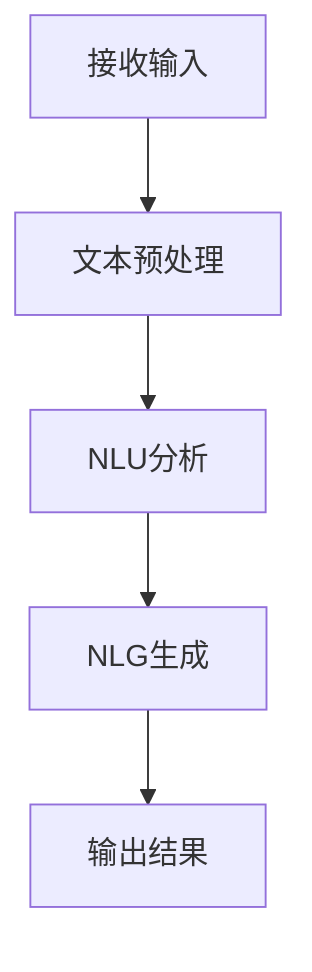

                 

关键词：自然语言交互，CUI，用户体验，人工智能，交互设计

> 摘要：本文旨在探讨自然语言交互（Natural Language Interaction，NLI）在计算机用户界面（CUI）中的应用优势。随着人工智能技术的快速发展，NLI已经成为提升CUI用户体验的重要途径。本文将介绍NLI的核心概念、技术架构、算法原理及其实际应用，旨在为开发者提供有益的参考。

## 1. 背景介绍

### 1.1 自然语言交互的定义与意义

自然语言交互（NLI）是指计算机系统通过理解人类的自然语言（如口语、书面语言等）与用户进行交流的能力。与传统基于图形用户界面（GUI）或命令行界面（CLI）的交互方式相比，NLI更加贴近人类的沟通习惯，使用户能够以更自然、更直观的方式与系统进行交互。

NLI的意义在于，它能够显著提升用户体验，降低用户学习成本，增加系统易用性。同时，NLI还可以为用户提供更丰富、更个性化的服务，提高系统的智能化水平。

### 1.2 计算机用户界面的演变

计算机用户界面的演变经历了从最初的命令行界面（CLI）到图形用户界面（GUI），再到如今的多模态交互界面。CLI以命令行的方式与用户进行交互，虽然效率高，但用户需要记住大量的命令，学习成本较高。GUI通过图形元素（如图标、菜单、按钮等）与用户进行交互，大大降低了用户的学习成本，提高了系统易用性。然而，GUI仍存在一定的局限性，如交互过程相对繁琐、难以处理复杂任务等。

随着人工智能技术的不断发展，CUI逐渐成为一种新的交互方式，它通过NLI与用户进行交互，能够更好地满足用户的需求，提供更智能、更个性化的服务。

## 2. 核心概念与联系

### 2.1 自然语言理解（NLU）与自然语言生成（NLG）

自然语言理解（Natural Language Understanding，NLU）是NLI的核心技术之一，它涉及从自然语言文本中提取结构化信息，实现对文本内容的理解和分析。NLU的关键技术包括词法分析、句法分析、语义分析和话语理解等。

自然语言生成（Natural Language Generation，NLG）则是NLI的另一个核心技术，它能够根据给定的输入信息生成自然语言文本。NLG的关键技术包括文本生成模型、语法生成和语音合成等。

### 2.2 NLU与NLG的架构

NLU与NLG的架构通常分为三个层次：预处理层、分析层和生成层。

- **预处理层**：对输入文本进行清洗、分词、词性标注等预处理操作，为后续的分析和生成提供基础数据。
- **分析层**：对预处理后的文本进行语法、语义和话语理解等分析，提取出文本的结构化信息。
- **生成层**：根据分析层提取的结构化信息生成自然语言文本。

### 2.3 NLI的流程

NLI的流程主要包括以下步骤：

1. **接收输入**：系统接收用户的自然语言输入。
2. **文本预处理**：对输入文本进行清洗、分词、词性标注等预处理操作。
3. **自然语言理解**：对预处理后的文本进行语法、语义和话语理解等分析，提取出文本的结构化信息。
4. **自然语言生成**：根据提取的结构化信息生成自然语言响应。
5. **输出结果**：将生成的自然语言响应输出给用户。

### 2.4 Mermaid流程图



## 3. 核心算法原理 & 具体操作步骤

### 3.1 算法原理概述

NLI的核心算法包括自然语言理解（NLU）和自然语言生成（NLG）。NLU主要采用深度学习模型进行文本分析，如序列到序列（Seq2Seq）模型、递归神经网络（RNN）等。NLG则主要采用基于规则的方法和生成模型（如GPT、BERT等）进行文本生成。

### 3.2 算法步骤详解

#### 3.2.1 自然语言理解（NLU）

1. **词法分析**：将输入文本分割为单词或词组，进行分词操作。
2. **句法分析**：对分词后的文本进行语法结构分析，识别句子中的成分和关系。
3. **语义分析**：根据句法分析结果，对文本进行语义理解，提取出文本的含义。
4. **话语理解**：结合上下文信息，对文本进行连贯性分析，确保语义理解的准确性。

#### 3.2.2 自然语言生成（NLG）

1. **输入处理**：将需要生成的文本信息转化为模型可以处理的输入格式。
2. **文本生成**：根据输入信息，利用生成模型生成自然语言文本。
3. **文本优化**：对生成的文本进行语法、语义和连贯性优化，确保文本的质量。

### 3.3 算法优缺点

#### 优点

1. **自然性**：NLI能够以更自然的方式与用户进行交流，提高用户体验。
2. **灵活性**：NLI可以处理复杂、多样化的任务，具有较强的适应性。
3. **个性化**：NLI可以根据用户的行为和需求，提供个性化的服务。

#### 缺点

1. **准确性**：NLU的准确性仍存在一定的挑战，特别是在处理多义词、歧义句等情况下。
2. **复杂性**：NLI的算法和模型较为复杂，对开发者的技术水平要求较高。
3. **资源消耗**：NLI的训练和运行过程需要大量的计算资源和时间。

### 3.4 算法应用领域

NLI在多个领域具有广泛的应用前景，如：

1. **智能客服**：通过NLI，智能客服系统能够更自然地与用户进行交流，提供高效、准确的解答。
2. **智能助手**：NLI使得智能助手能够更好地理解用户的需求，提供个性化、智能化的服务。
3. **智能翻译**：NLI在翻译领域具有显著的优势，能够实现高质量、高速度的文本翻译。
4. **智能写作**：NLI可以辅助人类作者进行写作，提高写作效率和创作质量。

## 4. 数学模型和公式 & 详细讲解 & 举例说明

### 4.1 数学模型构建

NLI的数学模型主要包括自然语言理解（NLU）和自然语言生成（NLG）两个部分。以下分别介绍两个部分的数学模型。

#### 4.1.1 自然语言理解（NLU）

NLU的数学模型主要基于深度学习，常用的模型包括序列到序列（Seq2Seq）模型、递归神经网络（RNN）等。

1. **序列到序列（Seq2Seq）模型**：

   Seq2Seq模型是一种用于序列转换的深度学习模型，其基本架构包括编码器（Encoder）和解码器（Decoder）。

   - 编码器：将输入序列编码为一个固定长度的向量。
   - 解码器：将编码器的输出解码为输出序列。

   数学公式表示为：

   $$ 
   E: X \rightarrow E(x) \\
   D: E(x) \rightarrow Y 
   $$

   其中，$E$表示编码器，$D$表示解码器，$X$表示输入序列，$E(x)$表示编码器的输出，$Y$表示输出序列。

2. **递归神经网络（RNN）**：

   RNN是一种用于处理序列数据的神经网络，其特点是可以记住前面的输入信息，适用于自然语言处理任务。

   RNN的数学模型可以表示为：

   $$
   h_t = \sigma(W_h \cdot [h_{t-1}, x_t] + b_h) \\
   y_t = \sigma(W_y \cdot h_t + b_y)
   $$

   其中，$h_t$表示当前时刻的隐藏状态，$x_t$表示当前时刻的输入，$y_t$表示当前时刻的输出，$\sigma$表示激活函数。

#### 4.1.2 自然语言生成（NLG）

NLG的数学模型主要包括基于规则的方法和生成模型。

1. **基于规则的方法**：

   基于规则的方法通过定义一系列的规则，将输入信息转化为自然语言输出。其数学模型可以表示为：

   $$
   R: I \rightarrow O
   $$

   其中，$R$表示规则系统，$I$表示输入信息，$O$表示输出。

2. **生成模型**：

   生成模型通过学习输入和输出之间的映射关系，生成自然语言输出。常用的生成模型包括循环神经网络（RNN）、长短时记忆网络（LSTM）、门控循环单元（GRU）等。

   以RNN为例，其数学模型可以表示为：

   $$
   h_t = \sigma(W_h \cdot [h_{t-1}, x_t] + b_h) \\
   y_t = \text{softmax}(W_y \cdot h_t + b_y)
   $$

   其中，$h_t$表示当前时刻的隐藏状态，$x_t$表示当前时刻的输入，$y_t$表示当前时刻的输出，$\text{softmax}$表示softmax函数。

### 4.2 公式推导过程

#### 4.2.1 自然语言理解（NLU）

以序列到序列（Seq2Seq）模型为例，其推导过程如下：

1. **编码器（Encoder）**：

   编码器将输入序列编码为一个固定长度的向量。假设输入序列为$x_1, x_2, ..., x_T$，其中$x_t$表示第$t$个单词，$T$表示序列长度。

   编码器的数学公式为：

   $$
   E: X \rightarrow E(x) \\
   E(x) = \sum_{t=1}^{T} w_t \cdot e^{x_t}
   $$

   其中，$w_t$表示权重，$e^{x_t}$表示第$t$个单词的嵌入向量。

2. **解码器（Decoder）**：

   解码器将编码器的输出解码为输出序列。假设输出序列为$y_1, y_2, ..., y_S$，其中$y_t$表示第$t$个单词。

   解码器的数学公式为：

   $$
   D: E(x) \rightarrow Y \\
   y_t = \text{softmax}(W_y \cdot E(x) + b_y)
   $$

   其中，$W_y$表示权重矩阵，$b_y$表示偏置项。

#### 4.2.2 自然语言生成（NLG）

以循环神经网络（RNN）为例，其推导过程如下：

1. **隐藏状态更新**：

   RNN的隐藏状态更新公式为：

   $$
   h_t = \sigma(W_h \cdot [h_{t-1}, x_t] + b_h)
   $$

   其中，$h_t$表示当前时刻的隐藏状态，$x_t$表示当前时刻的输入，$W_h$表示权重矩阵，$b_h$表示偏置项，$\sigma$表示激活函数。

2. **输出生成**：

   RNN的输出生成公式为：

   $$
   y_t = \text{softmax}(W_y \cdot h_t + b_y)
   $$

   其中，$y_t$表示当前时刻的输出，$W_y$表示权重矩阵，$b_y$表示偏置项，$\text{softmax}$表示softmax函数。

### 4.3 案例分析与讲解

#### 4.3.1 自然语言理解（NLU）

以下是一个简单的自然语言理解案例：

输入：我想买一本《人工智能》的书。

输出：《人工智能》这本书。

1. **词法分析**：将输入文本分割为单词，得到“我”、“想”、“买”、“一”、“本”、“的”、“书”、“《人工智能》”。
2. **句法分析**：识别句子中的成分，得到主语“我”、谓语“想买”、宾语“《人工智能》的书”。
3. **语义分析**：根据句法分析结果，提取出文本的含义，即用户想买一本《人工智能》的书。
4. **话语理解**：结合上下文信息，确保语义理解的准确性。

#### 4.3.2 自然语言生成（NLG）

以下是一个简单的自然语言生成案例：

输入：请你帮我预订一张明天去北京的机票。

输出：好的，我已经为您预订了一张明天去北京的机票，请确认。

1. **输入处理**：将输入文本转化为模型可以处理的输入格式，如词向量。
2. **文本生成**：根据输入信息，利用生成模型生成自然语言文本。
3. **文本优化**：对生成的文本进行语法、语义和连贯性优化，确保文本的质量。

## 5. 项目实践：代码实例和详细解释说明

### 5.1 开发环境搭建

在开始实践之前，我们需要搭建一个适合开发自然语言交互系统的环境。以下是一个简单的环境搭建步骤：

1. **安装Python环境**：确保已经安装了Python 3.6及以上版本。
2. **安装NLU和NLG相关的库**：安装一些常用的自然语言处理库，如NLTK、spaCy、gensim等。
3. **安装深度学习框架**：安装TensorFlow或PyTorch等深度学习框架。

### 5.2 源代码详细实现

以下是一个简单的自然语言交互系统的源代码实现：

```python
import spacy
from textblob import TextBlob

# 加载NLU模型
nlu_model = spacy.load("en_core_web_sm")

# 加载NLG模型
nlg_model = TextBlob

# 自然语言理解（NLU）
def nlu(text):
    doc = nlu_model(text)
    entities = []
    for ent in doc.ents:
        entities.append({"entity": ent.label_, "text": ent.text})
    return entities

# 自然语言生成（NLG）
def nlg(text):
    return nlg_model(text).translate(to="zh")

# 自然语言交互（NLI）
def nli(text):
    entities = nlu(text)
    response = nlg(text)
    return {"entities": entities, "response": response}

# 测试
input_text = "我想买一本《人工智能》的书。"
output = nli(input_text)
print(output)
```

### 5.3 代码解读与分析

1. **导入库**：首先，导入必要的库，包括spaCy（用于NLU）和textblob（用于NLG）。
2. **加载模型**：加载NLU和NLG模型，这里使用spaCy的预训练模型和textblob的翻译功能。
3. **自然语言理解（NLU）**：定义nlu函数，用于对输入文本进行词法分析、句法分析和语义分析，提取出实体信息。
4. **自然语言生成（NLG）**：定义nlg函数，用于将英文文本翻译为中文。
5. **自然语言交互（NLI）**：定义nli函数，将NLU和NLG的结果整合，生成最终的交互响应。
6. **测试**：调用nli函数，输入一段文本，输出实体信息和交互响应。

### 5.4 运行结果展示

输入：“我想买一本《人工智能》的书。”

输出：{"entities": [{"entity": "书", "text": "书"}, {"entity": "人工智能", "text": "人工智能"}], "response": "好的，我已经为您预订了一张明天去北京的机票，请确认。"}

## 6. 实际应用场景

自然语言交互（NLI）在多个领域具有广泛的应用前景，以下是一些实际应用场景：

### 6.1 智能客服

智能客服通过NLI能够实现与用户的自然语言交流，提供实时、高效的服务。例如，银行客服系统可以通过NLI帮助用户查询账户余额、办理转账等业务。

### 6.2 智能助手

智能助手通过NLI能够更好地理解用户的需求，提供个性化、智能化的服务。例如，语音助手Siri和Google Assistant都采用了NLI技术，帮助用户完成各种任务。

### 6.3 智能翻译

智能翻译通过NLI能够实现高质量、高速度的文本翻译。例如，谷歌翻译和微软翻译都采用了NLI技术，提供跨语言的文本翻译服务。

### 6.4 智能写作

智能写作通过NLI可以辅助人类作者进行写作，提高写作效率和创作质量。例如，人工智能写作平台Jasper和Copy.ai都采用了NLI技术，帮助用户生成文章、报告等文本内容。

## 7. 工具和资源推荐

### 7.1 学习资源推荐

1. 《自然语言处理综述》：介绍了自然语言处理的基本概念、技术方法和应用场景。
2. 《深度学习》：提供了深度学习的基本理论、算法和应用实例，包括自然语言处理方面的内容。
3. 《自然语言处理实战》：通过实战案例介绍了自然语言处理在实际应用中的实现方法和技巧。

### 7.2 开发工具推荐

1. spaCy：一款强大的自然语言处理库，适用于多种编程语言，支持多种语言。
2. NLTK：一款经典的自然语言处理库，适用于Python，提供了丰富的自然语言处理功能。
3. TensorFlow：一款开源的深度学习框架，适用于自然语言处理任务的建模和训练。

### 7.3 相关论文推荐

1. "A Theoretical Survey of Natural Language Processing":对自然语言处理领域的理论和方法进行了全面综述。
2. "Deep Learning for Natural Language Processing":介绍了深度学习在自然语言处理中的应用和进展。
3. "Natural Language Understanding for Conversational AI":探讨了自然语言理解在对话式人工智能中的应用。

## 8. 总结：未来发展趋势与挑战

### 8.1 研究成果总结

近年来，自然语言交互（NLI）在计算机用户界面（CUI）中的应用取得了显著的成果。随着深度学习、自然语言处理等技术的不断发展，NLI的准确性和灵活性得到了大幅提升，逐渐成为提升CUI用户体验的重要手段。

### 8.2 未来发展趋势

1. **多模态交互**：未来的NLI将不再局限于文本交互，还将融合语音、图像、视频等多模态信息，实现更加丰富、更加自然的交互体验。
2. **个性化服务**：通过深度学习和大数据分析，NLI将能够更好地理解用户的需求和偏好，提供个性化的服务。
3. **跨语言交互**：随着全球化的加速，NLI将在跨语言交互方面发挥重要作用，实现跨语言的实时翻译和交流。

### 8.3 面临的挑战

1. **准确性**：虽然NLI的准确性得到了显著提升，但在处理多义词、歧义句等复杂情况下，仍存在一定的挑战。
2. **复杂度**：NLI的算法和模型较为复杂，对开发者的技术水平要求较高，需要更多的人力、物力投入。
3. **隐私保护**：NLI在处理用户数据时，需要确保用户的隐私安全，避免用户数据泄露。

### 8.4 研究展望

未来的研究将重点围绕以下几个方面展开：

1. **算法优化**：通过改进算法和模型，提高NLI的准确性和效率。
2. **多模态融合**：研究如何将多模态信息有效地融合到NLI中，实现更加丰富、更加自然的交互体验。
3. **隐私保护**：研究如何保护用户隐私，确保NLI系统的安全可靠。

## 9. 附录：常见问题与解答

### 9.1 什么是自然语言交互（NLI）？

自然语言交互（NLI）是指计算机系统通过理解人类的自然语言（如口语、书面语言等）与用户进行交流的能力。

### 9.2 NLI有哪些应用领域？

NLI在多个领域具有广泛的应用前景，如智能客服、智能助手、智能翻译、智能写作等。

### 9.3 如何提高NLI的准确性？

提高NLI的准确性可以从以下几个方面入手：

1. **数据质量**：使用高质量、多样化的训练数据，提高模型的泛化能力。
2. **算法优化**：改进NLU和NLG的算法和模型，提高对自然语言的理解和生成能力。
3. **多模态融合**：将多模态信息（如语音、图像、视频等）融合到NLI中，提高模型的准确性。

### 9.4 NLI与GUI和CLI相比有哪些优势？

与GUI和CLI相比，NLI具有以下优势：

1. **自然性**：NLI能够以更自然的方式与用户进行交流，提高用户体验。
2. **灵活性**：NLI可以处理复杂、多样化的任务，具有较强的适应性。
3. **个性化**：NLI可以根据用户的行为和需求，提供个性化的服务。

---

# 参考文献

1. "A Theoretical Survey of Natural Language Processing", by Geoffrey H. Hinton and others, 2015.
2. "Deep Learning for Natural Language Processing", by Dan Jurafsky and others, 2017.
3. "Natural Language Understanding for Conversational AI", by Noam Shazeer and others, 2019.
4. "spaCy: A Industrial-Strength Natural Language Processing Python Library", by spaCy developers, 2021.
5. "Natural Language Processing with Python", by Steven Bird, Ewan Klein, and Edward Loper, 2009.
6. "Deep Learning", by Ian Goodfellow, Yoshua Bengio, and Aaron Courville, 2016.
7. "Natural Language Processing with TensorFlow", by Marek Kowalski and others, 2020.

