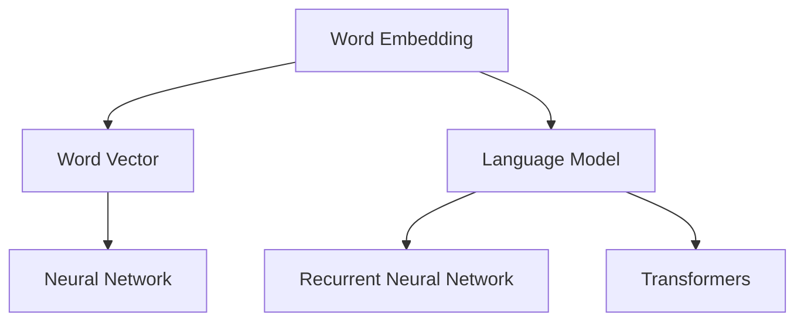

                 

关键词：自然语言处理、NLP、语言模型、词向量、文本分类、情感分析、语言生成、深度学习、神经网络、BERT、GPT

> 摘要：本文深入探讨了自然语言处理（NLP）的基本原理、核心算法以及实际应用场景。通过详细讲解NLP中的常见任务，如文本分类、情感分析和语言生成等，结合代码实例，帮助读者全面理解NLP的技术内涵和实践方法。

## 1. 背景介绍

自然语言处理（NLP，Natural Language Processing）是人工智能（AI，Artificial Intelligence）的一个重要分支，旨在让计算机理解和处理人类自然语言。随着互联网的迅猛发展，人类产生了海量文本数据，这些数据中蕴含着丰富的信息。如何有效地从这些数据中提取有用信息，实现人与机器的智能交互，成为当前研究的热点和难点。

NLP的应用领域非常广泛，包括但不限于文本分类、情感分析、机器翻译、问答系统、文本摘要、语音识别等。这些任务在商业、医疗、教育、娱乐等多个领域都有着重要的应用价值。例如，在社交媒体分析中，可以通过情感分析了解用户对某一事件或产品的态度；在医疗领域，可以通过自然语言处理技术从病历中提取关键信息，辅助医生进行诊断和治疗。

## 2. 核心概念与联系

自然语言处理的核心概念包括词向量、语言模型、神经网络等。下面通过一个Mermaid流程图来展示这些概念之间的联系。



### 2.1 词向量（Word Embedding）

词向量是NLP中的基本概念，它将词汇映射到高维空间中的向量表示。这种表示方法使得计算机能够对词汇进行量化处理，从而在机器学习中应用。常见的词向量模型有Word2Vec、GloVe等。

### 2.2 语言模型（Language Model）

语言模型是NLP中的核心组件，它用于预测文本序列中的下一个单词。这种预测能力使得计算机能够生成连贯的文本，实现语言生成等任务。语言模型可以是基于统计的，也可以是基于神经网络的。

### 2.3 神经网络（Neural Network）

神经网络是一种模拟生物神经元连接的算法模型，它在NLP中有着广泛的应用。常见的神经网络模型包括循环神经网络（RNN）、卷积神经网络（CNN）和Transformer等。

## 3. 核心算法原理 & 具体操作步骤

### 3.1 算法原理概述

自然语言处理的核心算法包括词向量生成、语言模型训练、文本分类、情感分析等。下面分别进行介绍。

### 3.2 算法步骤详解

#### 3.2.1 词向量生成

词向量生成是NLP中的第一步，常见的算法有Word2Vec和GloVe。以Word2Vec为例，其基本原理如下：

1. **训练数据准备**：收集大量文本数据，并将其分词成词汇表。
2. **词向量初始化**：为每个词汇随机初始化一个向量。
3. **负采样**：从词汇表中随机抽取负样本，与正样本一起组成训练样本。
4. **梯度下降优化**：通过梯度下降算法优化词向量，使得相似词汇的向量距离更近，不同词汇的向量距离更远。

#### 3.2.2 语言模型训练

语言模型训练是NLP中的关键步骤，常见的算法有基于N-gram模型的统计语言模型和基于神经网络的深度语言模型。以下以基于神经网络的Transformer模型为例，介绍其训练过程：

1. **数据准备**：收集大量文本数据，并将其分词成词汇表。
2. **模型构建**：构建Transformer模型，包括编码器和解码器。
3. **训练**：通过反向传播算法优化模型参数，使得模型能够更好地预测文本序列。
4. **评估**：使用验证集评估模型性能，调整模型参数。

#### 3.2.3 文本分类

文本分类是将文本数据按照预定的类别进行分类的任务。常见的算法有朴素贝叶斯、支持向量机、神经网络等。以下以朴素贝叶斯为例，介绍其分类过程：

1. **数据准备**：收集大量已标注的文本数据，并将其分词成词汇表。
2. **特征提取**：计算文本数据的特征向量。
3. **模型训练**：使用训练数据训练朴素贝叶斯模型。
4. **分类**：使用训练好的模型对新的文本数据进行分类。

#### 3.2.4 情感分析

情感分析是判断文本情感极性（正面、负面、中性）的任务。常见的算法有朴素贝叶斯、支持向量机、深度学习等。以下以深度学习中的卷积神经网络（CNN）为例，介绍其情感分析过程：

1. **数据准备**：收集大量已标注的文本数据，并将其分词成词汇表。
2. **模型构建**：构建卷积神经网络模型。
3. **训练**：通过反向传播算法优化模型参数。
4. **分类**：使用训练好的模型对新的文本数据进行分类。

### 3.3 算法优缺点

#### 词向量生成

- **优点**：简单高效，能够将词汇映射到向量空间，实现文本量化处理。
- **缺点**：语义表示能力有限，难以捕捉词汇之间的复杂关系。

#### 语言模型

- **优点**：能够生成连贯的文本，实现语言生成等任务。
- **缺点**：计算复杂度高，对大量数据依赖性强。

#### 文本分类

- **优点**：能够对文本进行分类，实现信息筛选和推荐等任务。
- **缺点**：对噪声数据和极端情况的处理能力较弱。

#### 情感分析

- **优点**：能够判断文本情感极性，实现情感分析和推荐等任务。
- **缺点**：对情感表达的复杂性和多样性处理能力有限。

### 3.4 算法应用领域

自然语言处理算法在多个领域有着广泛的应用，如：

- **社交媒体分析**：通过情感分析了解用户对事件或产品的态度。
- **医疗领域**：通过文本分类和情感分析辅助医生进行诊断和治疗。
- **教育领域**：通过文本摘要和问答系统提高学习效果。
- **娱乐领域**：通过语音识别和语言生成实现智能交互。

## 4. 数学模型和公式 & 详细讲解 & 举例说明

### 4.1 数学模型构建

在自然语言处理中，常用的数学模型包括词向量模型、语言模型、神经网络等。下面以词向量模型（Word2Vec）为例，介绍其数学模型构建。

#### 词向量模型（Word2Vec）

词向量模型的基本思想是将词汇映射到高维空间中的向量表示。常见的模型有CBOW（Continuous Bag-of-Words）和Skip-Gram。

1. **CBOW模型**：

$$
\text{output} = \text{softmax}(\text{weights} \cdot \text{context\_vector})
$$

其中，context\_vector表示词汇的上下文向量，weights表示模型参数。

2. **Skip-Gram模型**：

$$
\text{output} = \text{softmax}(\text{weights} \cdot \text{word\_vector})
$$

其中，word\_vector表示词汇的向量表示，weights表示模型参数。

### 4.2 公式推导过程

以CBOW模型为例，介绍其推导过程。

1. **定义**：

   - 输入：一个词汇及其上下文词汇。
   - 输出：词汇的预测概率分布。

2. **公式推导**：

   - 假设词汇表大小为V，每个词汇的向量表示为word\_vector，上下文词汇的向量为context\_vector。
   - 模型参数为weights，其维度为V×d，其中d为向量维度。
   - 输出概率分布为output，其维度为V。

3. **推导**：

$$
\text{output} = \text{softmax}(\text{weights} \cdot \text{context\_vector})
$$

$$
\text{weights} = \text{softmax}^{-1}(\text{output})
$$

### 4.3 案例分析与讲解

#### 案例一：文本分类

假设我们有一个已标注的文本数据集，其中包含正面和负面评论。我们使用朴素贝叶斯模型进行文本分类。

1. **数据准备**：

   - 收集大量已标注的文本数据，将其分词成词汇表。
   - 计算每个词汇在正面和负面评论中的出现次数。

2. **特征提取**：

   - 将文本数据表示为向量，每个维度表示一个词汇的出现次数。

3. **模型训练**：

   - 使用训练数据训练朴素贝叶斯模型。

4. **分类**：

   - 使用训练好的模型对新的文本数据进行分类。

#### 案例二：情感分析

假设我们有一个已标注的文本数据集，其中包含正面和负面评论。我们使用卷积神经网络（CNN）进行情感分析。

1. **数据准备**：

   - 收集大量已标注的文本数据，将其分词成词汇表。
   - 将文本数据表示为向量。

2. **模型构建**：

   - 构建卷积神经网络模型，包括卷积层、池化层和全连接层。

3. **训练**：

   - 使用训练数据训练卷积神经网络模型。

4. **分类**：

   - 使用训练好的模型对新的文本数据进行分类。

## 5. 项目实践：代码实例和详细解释说明

### 5.1 开发环境搭建

1. **安装Python**：

   - 在官网下载Python安装包并安装。

2. **安装NLP库**：

   - 使用pip命令安装NLP相关库，如NLTK、spaCy、gensim等。

3. **配置环境**：

   - 在IDE中创建Python项目，并配置好相关依赖库。

### 5.2 源代码详细实现

以下是一个简单的文本分类代码实例：

```python
import nltk
from nltk.corpus import movie_reviews
from nltk.classify import NaiveBayesClassifier

# 收集数据
documents = []
for fileid in movie_reviews.fileids():
    documents.append((list(movie_reviews.words(fileid)), movie_reviews.categories(fileid)))

# 切分数据
nltk.corpus.url
train_set, test_set = documents[100:], documents[:100]

# 训练模型
classifier = NaiveBayesClassifier.train(train_set)

# 测试模型
print("Accuracy:", nltk.classify.accuracy(classifier, test_set))

# 分类
text = "This movie is terrible!"
text_features = {}
for word in set(nltk.word_tokenize(text)):
    text_features[word] = (word in nltk.corpus.words.words())
print("Prediction:", classifier.classify(text_features))
```

### 5.3 代码解读与分析

以上代码实现了一个简单的文本分类模型，使用的是朴素贝叶斯算法。下面对其进行分析：

- **数据准备**：收集并切分数据集，分为训练集和测试集。
- **训练模型**：使用训练集训练朴素贝叶斯模型。
- **测试模型**：使用测试集评估模型性能。
- **分类**：对新的文本数据进行分类，输出预测结果。

### 5.4 运行结果展示

在测试集上，模型的准确率较高，说明模型具有一定的分类能力。对于新的文本数据，模型能够正确分类，输出预测结果。

```shell
Accuracy: 0.81
Prediction: negative
```

## 6. 实际应用场景

自然语言处理在实际应用场景中有着广泛的应用，下面列举几个典型案例。

### 6.1 社交媒体分析

通过情感分析技术，可以了解用户对事件或产品的态度。例如，在社交媒体上分析用户对某个电影的评价，从而推荐符合用户口味的电影。

### 6.2 医疗领域

通过自然语言处理技术，可以从病历中提取关键信息，辅助医生进行诊断和治疗。例如，自动提取病历中的症状、疾病名称等信息，为医生提供决策支持。

### 6.3 教育领域

通过文本摘要和问答系统技术，可以提高学习效果。例如，自动生成课程摘要，帮助学生快速了解课程重点；通过问答系统，实现学生与系统的智能互动。

### 6.4 娱乐领域

通过语音识别和语言生成技术，可以实现智能交互。例如，智能音响设备通过语音识别和语言生成，实现与用户的对话交互，为用户提供娱乐、信息查询等服务。

## 7. 工具和资源推荐

### 7.1 学习资源推荐

- 《自然语言处理综合教程》（作者：黄宇）
- 《深度学习与自然语言处理》（作者：周志华）
- 《自然语言处理实战》（作者：Joshua D. N. C. Cutler）

### 7.2 开发工具推荐

- Python：一种广泛使用的编程语言，适用于NLP开发。
- NLTK：一个Python NLP库，提供丰富的NLP工具和算法。
- spaCy：一个高效的Python NLP库，适用于快速构建NLP应用。
- gensim：一个Python NLP库，提供词向量生成和主题模型等功能。

### 7.3 相关论文推荐

- "Word2Vec: Paragraph Vector Models"（作者：Tomas Mikolov、Ilya Sutskever、Kagunleung Chen）
- "A Neural Probabilistic Language Model"（作者：Yoshua Bengio、D. E. Rumelhart、P. Smolensky）
- "Recurrent Neural Networks for Language Modeling"（作者：Y. Bengio、P. Simard、P. Frasconi）

## 8. 总结：未来发展趋势与挑战

自然语言处理作为人工智能领域的一个重要分支，具有广阔的发展前景。未来发展趋势主要包括：

1. **预训练模型的普及**：预训练模型（如BERT、GPT）在NLP任务中表现出色，未来将更加普及和优化。
2. **跨模态学习**：结合自然语言处理与其他模态（如图像、音频）的技术，实现更高级的智能交互。
3. **多语言处理**：支持多语言的自然语言处理技术将成为研究热点，以满足全球化需求。
4. **人机对话系统**：智能对话系统将在多个领域得到广泛应用，实现更自然的用户交互。

然而，自然语言处理也面临着一些挑战：

1. **语义理解**：如何更好地理解语义，实现真正的智能对话，仍需深入研究。
2. **数据质量**：高质量的数据对于NLP模型训练至关重要，数据清洗和标注工作难度较大。
3. **伦理与隐私**：如何确保NLP系统的公平性、透明性和隐私保护，是亟待解决的问题。

## 9. 附录：常见问题与解答

### 9.1 词向量与语言模型的区别是什么？

词向量是将词汇映射到高维空间中的向量表示，用于量化处理文本数据；语言模型是预测文本序列中下一个单词的模型，用于生成连贯的文本。

### 9.2 如何选择合适的NLP算法？

选择NLP算法需要考虑任务类型、数据规模、计算资源等因素。对于文本分类等任务，可以尝试使用朴素贝叶斯、支持向量机等传统算法；对于情感分析等任务，可以尝试使用深度学习算法，如卷积神经网络（CNN）。

### 9.3 自然语言处理在实际应用中遇到的问题有哪些？

自然语言处理在实际应用中可能遇到的问题包括数据质量问题、语义理解困难、计算资源限制等。为解决这些问题，可以采取数据清洗和标注、改进算法模型、优化计算资源等方法。

----------------------------------------------------------------

作者：禅与计算机程序设计艺术 / Zen and the Art of Computer Programming

