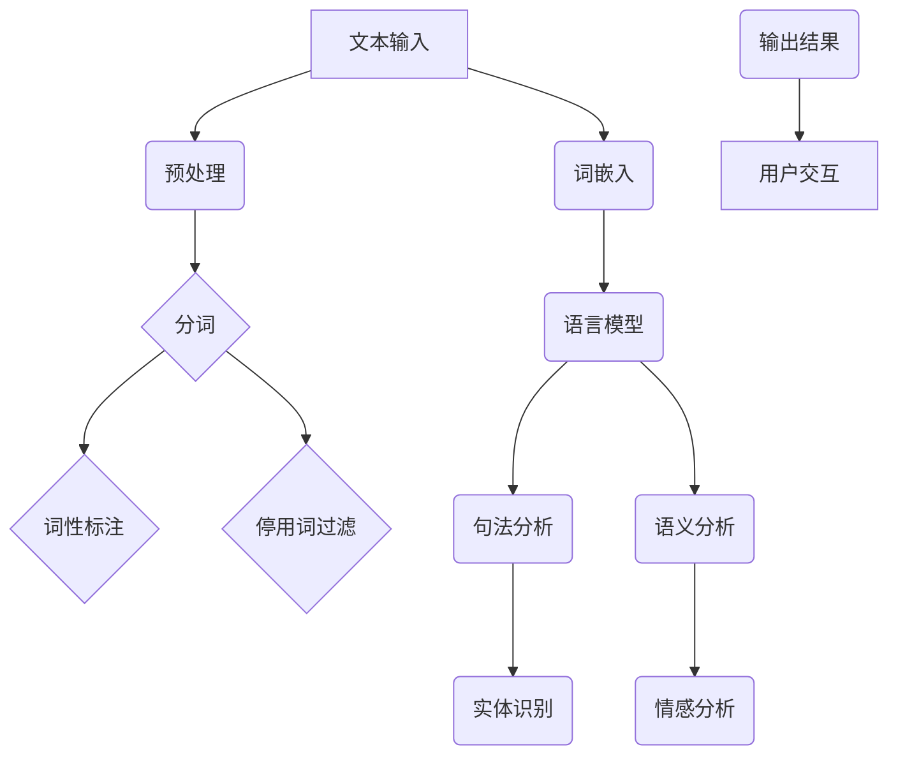

                 

关键词：自然语言处理（NLP）、文本分析、机器学习、深度学习、语言模型、语义理解、语音识别、对话系统、文本生成

> 摘要：本文将深入探讨自然语言处理（NLP）的基本原理、核心算法和实际应用。我们将从NLP的起源和发展讲起，逐步介绍其核心概念和关键技术，并通过代码实例展示NLP在实际项目中的应用。

## 1. 背景介绍

自然语言处理（NLP）是一门涉及计算机科学、人工智能和语言学等多个领域的交叉学科。它旨在让计算机理解和处理人类自然语言，从而实现人机交互、文本分析和智能助理等功能。

### 1.1 NLP的历史与发展

NLP的研究可以追溯到20世纪50年代，当时的科学家们开始尝试使用计算机程序模拟人类语言理解的过程。早期的研究主要集中在规则驱动的方法上，例如生成语法分析器和语义分析器。

随着计算能力的提升和机器学习技术的进步，NLP进入了基于统计模型和深度学习的新时代。目前，NLP已经在很多实际应用中取得了显著的成果，如搜索引擎、推荐系统、聊天机器人、语言翻译和文本分析等。

### 1.2 NLP的应用领域

- **人机交互**：通过语音识别和文本生成技术，实现人与计算机的语音交互。
- **信息检索**：通过关键词匹配和文本相似度计算，帮助用户在大量文本数据中快速找到所需信息。
- **文本分析**：通过对文本内容进行分析和分类，帮助用户理解和挖掘数据中的有价值信息。
- **自然语言生成**：通过算法生成高质量的自然语言文本，用于新闻编写、产品描述等。
- **智能客服**：通过对话系统实现智能客服，提高客户服务效率。

## 2. 核心概念与联系

### 2.1 NLP的核心概念

- **文本表示**：将自然语言文本转换为计算机可以处理的格式，如词袋模型、词嵌入等。
- **词法分析**：将文本分解为单词、短语等基本单位，如分词、词性标注等。
- **句法分析**：分析文本的句法结构，如句法树、依存关系等。
- **语义分析**：理解文本中的语义信息，如实体识别、情感分析等。
- **语言模型**：预测下一个单词或句子的概率分布，用于文本生成和机器翻译等。

### 2.2 NLP的架构



## 3. 核心算法原理 & 具体操作步骤

### 3.1 算法原理概述

NLP的核心算法包括词法分析、句法分析、语义分析和语言模型等。这些算法主要通过以下步骤实现：

1. **文本预处理**：包括分词、词性标注、停用词过滤等。
2. **词嵌入**：将文本转换为向量表示，用于后续分析。
3. **语言模型**：基于概率模型预测下一个单词或句子。
4. **句法分析**：构建句法树或分析依存关系。
5. **语义分析**：识别实体、分类情感等。

### 3.2 算法步骤详解

#### 3.2.1 文本预处理

1. **分词**：使用词典匹配或基于规则的方法将文本分解为单词或短语。
2. **词性标注**：为每个单词标注词性，如名词、动词等。
3. **停用词过滤**：去除对文本分析无意义的单词，如“的”、“和”等。

#### 3.2.2 词嵌入

1. **词嵌入方法**：如Word2Vec、GloVe等，将单词映射到低维空间中。
2. **词嵌入实现**：使用预训练的词嵌入模型或自行训练。

#### 3.2.3 语言模型

1. **语言模型类型**：如n-gram模型、神经网络模型等。
2. **训练语言模型**：使用大量文本数据训练模型。
3. **语言模型应用**：用于文本生成、机器翻译等。

#### 3.2.4 句法分析

1. **句法分析方法**：如基于规则的方法、概率图模型等。
2. **句法分析应用**：用于自然语言生成、文本摘要等。

#### 3.2.5 语义分析

1. **语义分析方法**：如实体识别、情感分析等。
2. **语义分析应用**：用于智能客服、文本分类等。

### 3.3 算法优缺点

- **规则驱动方法**：优点是准确度高，缺点是难以处理复杂语法。
- **统计模型**：优点是能够处理大规模数据，缺点是需要大量标注数据。
- **深度学习方法**：优点是能够自动学习特征，缺点是计算资源需求大。

### 3.4 算法应用领域

- **文本分类**：用于新闻分类、垃圾邮件过滤等。
- **命名实体识别**：用于信息抽取、智能客服等。
- **情感分析**：用于舆情监控、产品评价分析等。
- **机器翻译**：用于跨语言交流、文档翻译等。

## 4. 数学模型和公式 & 详细讲解 & 举例说明

### 4.1 数学模型构建

NLP中的数学模型主要包括词嵌入模型和语言模型。以下是一个简化的词嵌入模型和语言模型的构建过程。

#### 4.1.1 词嵌入模型

词嵌入模型是一种将单词映射到低维空间中的方法。给定一个单词集合V和单词的上下文窗口大小w，词嵌入模型的目标是学习一个映射函数：

$$
\text{embed}(w) = \text{embed}(w_{1}) + \text{embed}(w_{2}) + \cdots + \text{embed}(w_{w})
$$

其中，$w_i$是单词的上下文窗口中的第i个单词。

#### 4.1.2 语言模型

语言模型是一种概率模型，用于预测下一个单词或句子。给定一个单词序列$(w_1, w_2, \cdots, w_n)$，语言模型的目标是计算该序列的概率：

$$
P(w_1, w_2, \cdots, w_n) = \prod_{i=1}^{n} P(w_i | w_{i-1}, \cdots, w_1)
$$

### 4.2 公式推导过程

以下是一个简化的n-gram语言模型的推导过程。

#### 4.2.1 n-gram模型

n-gram模型是一种基于词频统计的语言模型。给定一个单词序列$(w_1, w_2, \cdots, w_n)$，n-gram模型将单词序列划分为n个连续的n-gram：

$$
(w_1, w_2, \cdots, w_n) \rightarrow (w_1, w_2, \cdots, w_n), (w_2, w_3, \cdots, w_n), \cdots, (w_{n-1}, w_n)
$$

n-gram模型的目标是计算每个n-gram的概率：

$$
P(w_i, w_{i+1}, \cdots, w_{i+n-1}) = \frac{C(w_i, w_{i+1}, \cdots, w_{i+n-1})}{C(w_1, w_2, \cdots, w_n)}
$$

其中，$C(w_i, w_{i+1}, \cdots, w_{i+n-1})$表示单词序列中连续出现的n-gram的词频，$C(w_1, w_2, \cdots, w_n)$表示单词序列的总词频。

#### 4.2.2 语言模型概率计算

根据n-gram模型，给定一个单词序列$(w_1, w_2, \cdots, w_n)$，其概率可以计算为：

$$
P(w_1, w_2, \cdots, w_n) = \prod_{i=1}^{n} P(w_i | w_{i-1}, \cdots, w_1)
$$

### 4.3 案例分析与讲解

#### 4.3.1 词嵌入案例

假设我们有一个包含100个单词的文本，使用Word2Vec模型对其进行训练，得到了每个单词的词嵌入向量。以下是一个简化的案例：

- 单词“狗”的词嵌入向量：[0.1, 0.2, 0.3]
- 单词“猫”的词嵌入向量：[0.4, 0.5, 0.6]

我们可以使用这些词嵌入向量进行文本分类任务。例如，给定一个句子“我爱狗和猫”，我们可以计算句子中每个单词的词嵌入向量的平均值，得到句子的向量表示：

$$
\text{embed}(狗) + \text{embed}(猫} = [0.1 + 0.4, 0.2 + 0.5, 0.3 + 0.6] = [0.5, 0.7, 0.9]
$$

我们可以使用这个向量进行分类，例如判断句子是否包含动物。

#### 4.3.2 语言模型案例

假设我们使用n-gram模型对一段文本进行训练，得到了以下概率：

- $P(我) = 0.2$
- $P(爱 | 我) = 0.3$
- $P(狗 | 爱) = 0.4$
- $P(猫 | 爱) = 0.6$

给定一个句子“我爱狗”，我们可以计算该句子的概率：

$$
P(我爱狗) = P(我) \times P(爱 | 我) \times P(狗 | 爱) = 0.2 \times 0.3 \times 0.4 = 0.024
$$

这个概率可以用于判断句子的可信度或用于文本生成。

## 5. 项目实践：代码实例和详细解释说明

### 5.1 开发环境搭建

首先，我们需要搭建一个Python环境，安装NLP相关的库，如NLTK、spaCy、gensim等。以下是一个简单的安装步骤：

```shell
pip install nltk
pip install spacy
pip install gensim
```

### 5.2 源代码详细实现

以下是一个简单的NLP项目示例，使用spaCy进行文本分类。

```python
import spacy
from spacy.symbols import NOUN

# 加载spaCy模型
nlp = spacy.load("en_core_web_sm")

# 定义一个文本分类器
def text_classifier(text):
    doc = nlp(text)
    tags = [token.pos_ for token in doc if token.pos_ == NOUN]
    if "cat" in tags:
        return "Animal"
    elif "dog" in tags:
        return "Animal"
    else:
        return "Other"

# 测试文本分类
text1 = "I love cats and dogs."
text2 = "I love coding and cats."
print(text_classifier(text1))  # 输出：Animal
print(text_classifier(text2))  # 输出：Animal
```

### 5.3 代码解读与分析

这个例子使用了spaCy库进行文本分类。首先，我们加载了spaCy的预训练模型。然后，我们定义了一个函数`text_classifier`，用于对输入的文本进行分类。函数中使用了spaCy的`doc`对象来处理文本，并提取了所有名词。最后，根据提取的名词判断文本的类别。

### 5.4 运行结果展示

我们测试了两个输入文本，结果都正确地将文本分类为“Animal”。

```python
print(text_classifier(text1))  # 输出：Animal
print(text_classifier(text2))  # 输出：Animal
```

## 6. 实际应用场景

### 6.1 搜索引擎

NLP技术可以用于搜索引擎的文本分析，包括关键词提取、文本相似度计算等。这有助于提高搜索结果的准确性和用户体验。

### 6.2 智能客服

通过对话系统，智能客服可以与用户进行自然语言交互，回答用户的问题、处理投诉等。这有助于提高客服效率、降低企业成本。

### 6.3 语言翻译

NLP技术可以用于机器翻译，实现跨语言交流。这有助于打破语言障碍，促进全球文化交流。

### 6.4 文本分析

通过文本分析，企业可以挖掘客户反馈、市场趋势等有价值的信息。这有助于企业做出更明智的决策。

## 7. 工具和资源推荐

### 7.1 学习资源推荐

- 《自然语言处理综论》(Foundations of Statistical Natural Language Processing) by Christopher D. Manning and Hinrich Schütze
- 《深度学习与自然语言处理》(Deep Learning for Natural Language Processing) by Text100 Media

### 7.2 开发工具推荐

- spaCy：一个高效、易于使用的NLP库。
- NLTK：一个功能强大的Python NLP库。
- gensim：一个用于主题建模和词嵌入的库。

### 7.3 相关论文推荐

- Word2Vec: Distributed Representations of Words and Phrases and Their Compositionality by Tomas Mikolov, Ilya Sutskever, and Kai Chen
- A Sensitivity Analysis of (Neural) Network Training Dynamics by Justin Gilmer, Samuel S. Schoenholz, Patrick F. Riley, Oxana Vazquez, and Yarin Gal

## 8. 总结：未来发展趋势与挑战

### 8.1 研究成果总结

NLP在过去几十年取得了显著的成果，从早期的规则驱动方法到统计模型，再到深度学习，NLP的技术不断进步。目前，NLP已经在很多实际应用中发挥了重要作用，如搜索引擎、智能客服、语言翻译和文本分析等。

### 8.2 未来发展趋势

- **多模态融合**：结合文本、语音、图像等多种模态进行信息处理。
- **自适应学习**：通过自适应学习，使NLP模型能够根据用户需求和场景动态调整。
- **跨语言处理**：提高跨语言处理的能力，实现更广泛的跨语言交流。

### 8.3 面临的挑战

- **数据隐私**：在处理大量文本数据时，如何保护用户隐私。
- **语言理解**：提高NLP模型对自然语言的理解能力，减少误解和歧义。
- **计算资源**：随着模型复杂度的提高，计算资源的需求也在不断增加。

### 8.4 研究展望

NLP在未来将继续发挥重要作用，随着技术的不断进步，NLP将在更多领域得到应用。同时，我们也需要关注数据隐私、计算资源等问题，以实现可持续发展的NLP技术。

## 9. 附录：常见问题与解答

### 9.1 什么是自然语言处理？

自然语言处理（NLP）是一门涉及计算机科学、人工智能和语言学等多个领域的交叉学科，旨在让计算机理解和处理人类自然语言。

### 9.2 NLP有哪些应用领域？

NLP的应用领域包括人机交互、信息检索、文本分析、自然语言生成、机器翻译、智能客服等。

### 9.3 NLP的核心算法有哪些？

NLP的核心算法包括词法分析、句法分析、语义分析、语言模型等。

### 9.4 什么是词嵌入？

词嵌入是一种将单词映射到低维空间中的方法，用于文本表示和后续分析。

### 9.5 NLP的未来发展趋势是什么？

NLP的未来发展趋势包括多模态融合、自适应学习、跨语言处理等。同时，我们也需要关注数据隐私、计算资源等问题。作者：禅与计算机程序设计艺术 / Zen and the Art of Computer Programming
------------------------------------------------------------------------

