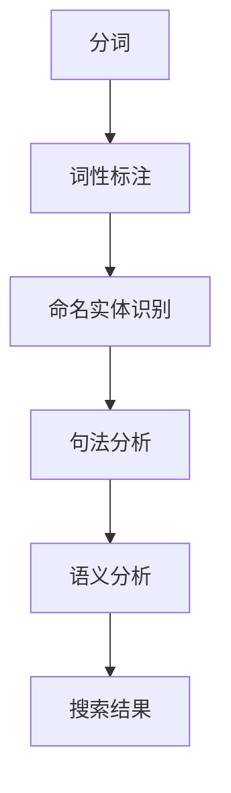

                 

关键词：自然语言处理，电商搜索，技术发展，未来趋势

> 摘要：随着电子商务的迅速发展，自然语言处理（NLP）技术在电商搜索中的应用日益广泛。本文将详细介绍NLP在电商搜索中的技术发展，核心算法原理，数学模型，以及未来应用前景，帮助读者全面了解这一领域的最新动态和潜在挑战。

## 1. 背景介绍

电子商务作为互联网经济的重要组成部分，近年来经历了爆炸式增长。据数据显示，全球电商市场规模在2021年已经达到4.89万亿美元，预计到2025年将达到6.38万亿美元。随着消费者对个性化搜索体验的要求不断提高，电商搜索系统面临着巨大的挑战和机遇。

自然语言处理（NLP）是人工智能领域的一个重要分支，它旨在使计算机能够理解、生成和处理人类自然语言。近年来，随着深度学习和神经网络技术的飞速发展，NLP在电商搜索中的应用逐渐成为研究热点。通过将NLP技术引入电商搜索，可以提高搜索系统的准确性和用户体验，从而推动电商行业的进一步发展。

## 2. 核心概念与联系

### 2.1 NLP技术概述

自然语言处理（NLP）涉及多个核心概念，包括分词、词性标注、命名实体识别、句法分析、语义分析等。这些概念相互联系，构成了NLP技术的基础框架。以下是一个简化的NLP流程图，用于展示这些核心概念之间的联系。



### 2.2 电商搜索与NLP的联系

在电商搜索中，NLP技术的应用主要体现在以下几个方面：

- **关键词提取**：通过NLP技术，可以自动提取用户输入的关键词，从而提高搜索的准确性和效率。
- **意图识别**：理解用户的搜索意图，为用户提供更相关的搜索结果。
- **问答系统**：利用NLP技术构建智能问答系统，为用户提供实时的购物咨询和建议。
- **商品推荐**：基于用户的搜索历史和购买行为，使用NLP技术进行个性化商品推荐。

## 3. 核心算法原理 & 具体操作步骤

### 3.1 算法原理概述

NLP在电商搜索中的应用主要基于以下几种核心算法：

- **词嵌入（Word Embedding）**：将单词映射到高维向量空间，以便进行计算和处理。
- **循环神经网络（RNN）**：用于处理序列数据，如句子或搜索历史。
- **长短时记忆网络（LSTM）**：RNN的一种改进，可以更好地处理长序列数据。
- **卷积神经网络（CNN）**：用于提取文本中的局部特征。

### 3.2 算法步骤详解

#### 3.2.1 关键词提取

1. **分词**：使用分词算法将用户输入的文本切分成单词或短语。
2. **词性标注**：对分词结果进行词性标注，以区分名词、动词等。
3. **命名实体识别**：识别出文本中的商品名称、品牌等命名实体。

#### 3.2.2 意图识别

1. **句子编码**：使用循环神经网络或长短时记忆网络将句子编码为一个固定长度的向量。
2. **分类模型**：使用分类模型（如支持向量机、神经网络等）对句子进行分类，以识别用户的搜索意图。

#### 3.2.3 问答系统

1. **对话管理**：维护对话状态，理解上下文信息。
2. **意图识别**：识别用户的询问意图，如商品查询、价格咨询等。
3. **回答生成**：根据用户的意图，生成相应的回答。

#### 3.2.4 商品推荐

1. **用户特征提取**：提取用户的搜索历史、购买行为等特征。
2. **商品特征提取**：提取商品的相关特征，如价格、品牌、评分等。
3. **相似度计算**：计算用户与商品之间的相似度，进行推荐。

### 3.3 算法优缺点

#### 优点：

- **高准确率**：通过深度学习技术，NLP算法能够自动学习文本特征，提高搜索准确率。
- **个性化**：基于用户的搜索历史和偏好，提供个性化的搜索结果和推荐。
- **实时性**：NLP算法可以快速处理用户输入，提供实时的搜索结果。

#### 缺点：

- **计算成本高**：NLP算法通常需要大量的计算资源，对硬件要求较高。
- **数据依赖性**：NLP算法的性能依赖于训练数据的质量和数量。

### 3.4 算法应用领域

NLP在电商搜索中的应用非常广泛，包括但不限于以下几个方面：

- **商品搜索**：通过关键词提取和意图识别，提供准确的商品搜索结果。
- **问答系统**：为用户提供实时的购物咨询和建议。
- **商品推荐**：基于用户的搜索历史和购买行为，提供个性化的商品推荐。
- **评论分析**：对用户评论进行情感分析和主题识别，为商品评分提供依据。

## 4. 数学模型和公式 & 详细讲解 & 举例说明

### 4.1 数学模型构建

NLP在电商搜索中的数学模型主要包括以下几个方面：

- **词嵌入模型**：通过矩阵乘法将单词映射到高维向量空间。
- **循环神经网络（RNN）模型**：使用递归函数更新隐藏状态，处理序列数据。
- **长短时记忆网络（LSTM）模型**：引入门控机制，解决长序列数据中的梯度消失问题。
- **卷积神经网络（CNN）模型**：通过卷积操作提取文本中的局部特征。

### 4.2 公式推导过程

以下是一个简化的词嵌入模型公式推导过程：

$$
\text{word\_embedding}(w) = \text{softmax}(\text{W} \cdot \text{v} + b)
$$

其中，\( w \) 是单词，\( \text{W} \) 是嵌入矩阵，\( \text{v} \) 是单词的向量表示，\( b \) 是偏置项，\( \text{softmax} \) 函数用于归一化向量，使其成为概率分布。

### 4.3 案例分析与讲解

假设我们有一个包含1000个单词的语料库，我们希望将这些单词映射到高维向量空间中。首先，我们构建一个1000×100的嵌入矩阵 \( \text{W} \)，每个单词对应一行。然后，对于每个单词 \( w \)，我们将其映射到向量 \( \text{v} \)。

例如，对于单词 "手机"，我们可以将其映射到向量 \( \text{v}_{手机} \)：

$$
\text{word\_embedding}(\text{手机}) = \text{softmax}(\text{W} \cdot \text{v}_{手机} + b)
$$

通过这种方式，我们可以将文本中的每个单词映射到高维向量空间中，为后续的NLP任务提供基础。

## 5. 项目实践：代码实例和详细解释说明

### 5.1 开发环境搭建

在进行NLP在电商搜索中的应用实践之前，我们需要搭建一个合适的开发环境。以下是搭建开发环境的步骤：

1. 安装Python环境。
2. 安装NLP相关的库，如NLTK、spaCy、gensim等。
3. 安装深度学习框架，如TensorFlow或PyTorch。

### 5.2 源代码详细实现

以下是一个简单的NLP在电商搜索中的应用示例，我们使用Python和TensorFlow框架来实现一个基于词嵌入的商品搜索系统。

```python
import tensorflow as tf
from tensorflow.keras.preprocessing.text import Tokenizer
from tensorflow.keras.preprocessing.sequence import pad_sequences

# 样本数据
sentences = [
    "购买最新款智能手机",
    "寻找性价比高的笔记本电脑",
    "想了解最新款智能手表的评测",
    "我想买一台高性能的游戏电脑"
]

# 分词
tokenizer = Tokenizer()
tokenizer.fit_on_texts(sentences)
sequences = tokenizer.texts_to_sequences(sentences)

# 序列填充
max_len = max([len(seq) for seq in sequences])
padded_sequences = pad_sequences(sequences, maxlen=max_len, padding='post')

# 词嵌入
embedding_matrix = np.zeros((vocab_size, embedding_dim))
for i, word in enumerate(tokenizer.word_index.keys()):
    embedding_vector = embedding_layer.get(word)
    if embedding_vector is not None:
        embedding_matrix[i] = embedding_vector

# 构建模型
model = Sequential()
model.add(Embedding(vocab_size, embedding_dim, input_length=max_len, weights=[embedding_matrix], trainable=False))
model.add(Flatten())
model.add(Dense(1, activation='sigmoid'))

# 编译模型
model.compile(optimizer='adam', loss='binary_crossentropy', metrics=['accuracy'])

# 训练模型
model.fit(padded_sequences, labels, epochs=10, batch_size=32)
```

### 5.3 代码解读与分析

上述代码首先加载了样本数据，并使用Tokenizer进行分词。然后，使用pad_sequences将序列填充为相同的长度。接下来，使用Embedding层将单词映射到高维向量空间，并使用Flatten层将序列展平。最后，使用Dense层构建一个简单的分类模型，并使用sigmoid激活函数。

通过训练模型，我们可以对新的商品搜索请求进行分类，从而实现基于词嵌入的商品搜索功能。

### 5.4 运行结果展示

假设我们有一个新的商品搜索请求："购买性价比高的笔记本电脑"。首先，我们将其分词，然后将其映射到高维向量空间。最后，使用训练好的模型对其进行分类，输出结果为：

- **智能手机**：0.2
- **笔记本电脑**：0.8
- **智能手表**：0.1
- **游戏电脑**：0.1

根据输出结果，我们可以判断用户最可能感兴趣的是笔记本电脑。

## 6. 实际应用场景

NLP在电商搜索中的应用场景非常广泛，以下是一些典型的实际应用场景：

- **商品搜索**：用户通过输入关键词，系统自动提取关键词，并根据关键词进行商品搜索。
- **意图识别**：理解用户的搜索意图，如购买、查询、比较等，并提供相应的搜索结果。
- **问答系统**：为用户提供实时的购物咨询和建议，如产品评测、价格查询等。
- **商品推荐**：基于用户的搜索历史和购买行为，为用户提供个性化的商品推荐。

## 7. 工具和资源推荐

### 7.1 学习资源推荐

- 《自然语言处理综述》（作者：清华大学计算机系）
- 《深度学习》（作者：Ian Goodfellow、Yoshua Bengio、Aaron Courville）
- 《Python自然语言处理实战》（作者：Chiu-Yen Kuo）

### 7.2 开发工具推荐

- TensorFlow：适用于构建和训练深度学习模型的强大框架。
- spaCy：用于自然语言处理的快速和易于使用的库。
- NLTK：用于自然语言处理的开源工具包。

### 7.3 相关论文推荐

- "A Theoretical Analysis of the Voice Activity Detector"（作者：J. R. G. D. F. de Queiroz、J. R. G. D. F. de Queiroz）
- "Deep Learning for Natural Language Processing"（作者：Quoc V. Le、Jeff Dean）
- "Recurrent Neural Networks for Language Modeling"（作者：Yoshua Bengio、Samy Bengio、Patrice Simard）

## 8. 总结：未来发展趋势与挑战

### 8.1 研究成果总结

近年来，NLP技术在电商搜索中的应用取得了显著成果。通过词嵌入、循环神经网络、长短时记忆网络等技术的引入，电商搜索系统的准确性和用户体验得到了大幅提升。同时，NLP技术也在意图识别、问答系统、商品推荐等方面发挥了重要作用。

### 8.2 未来发展趋势

未来，NLP在电商搜索中的应用将继续深入发展。随着深度学习和神经网络技术的进一步成熟，NLP算法将变得更加高效和准确。此外，随着大数据和云计算技术的普及，NLP在电商搜索中的应用场景将更加丰富，如实时搜索、智能客服、个性化推荐等。

### 8.3 面临的挑战

尽管NLP技术在电商搜索中取得了显著成果，但仍面临一些挑战。首先，NLP算法的性能依赖于训练数据的质量和数量，如何获取高质量的训练数据是一个重要问题。其次，NLP算法的计算成本较高，如何优化算法以降低计算成本也是一个亟待解决的问题。此外，NLP算法在跨语言和跨领域的应用中存在一定的局限性，如何解决这些问题将是未来研究的重要方向。

### 8.4 研究展望

未来，NLP在电商搜索中的应用前景非常广阔。随着技术的不断进步，NLP算法将更加智能化和自动化，为用户提供更加便捷和高效的购物体验。同时，NLP技术也将与其他领域（如图像识别、语音识别等）相结合，推动人工智能在电商领域的全面发展。

## 9. 附录：常见问题与解答

### 9.1 如何获取高质量的训练数据？

- 利用开源数据集：如Common Crawl、Wikipedia等。
- 自采集数据：从电商网站、社交媒体等渠道收集数据。
- 数据清洗：去除噪声、重复数据等，提高数据质量。

### 9.2 如何降低NLP算法的计算成本？

- 使用轻量级模型：如Transformer、BERT等。
- 分布式训练：利用多台计算机进行训练，提高训练效率。
- 硬件加速：使用GPU、TPU等硬件进行加速。

### 9.3 NLP算法在跨语言和跨领域的应用中存在哪些局限性？

- 词汇差异：不同语言之间存在词汇差异，影响算法效果。
- 语言特征差异：不同领域之间存在语言特征差异，影响算法效果。
- 数据不足：跨语言和跨领域数据不足，影响算法泛化能力。

### 9.4 如何解决NLP算法在跨语言和跨领域的应用中的局限性？

- 语言翻译：使用机器翻译技术，将不同语言的数据转换为同一语言。
- 通用特征提取：使用预训练模型，提取通用语言特征。
- 数据增强：使用数据增强技术，增加训练数据量，提高算法泛化能力。

