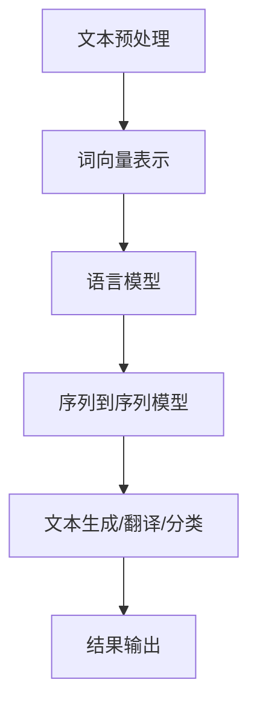

                 

关键词：自然语言处理，内容创作，AI技术，算法，应用场景，发展趋势

摘要：本文深入探讨了自然语言处理（NLP）在内容创作领域的革命性应用。通过分析NLP的核心概念和算法原理，我们揭示了NLP技术如何为各类内容创作者带来前所未有的机遇和挑战。文章还将探讨NLP在实际项目中的应用实例，并展望其未来的发展趋势和面临的挑战。

## 1. 背景介绍

自然语言处理（NLP）作为人工智能（AI）的一个重要分支，近年来取得了飞速发展。随着深度学习、神经网络等技术的不断进步，NLP已经从实验室研究走向了实际应用。内容创作是NLP的重要应用领域之一，涵盖了从文本生成、内容审核、情感分析到个性化推荐等多个方面。

在过去，内容创作主要依赖于人类创作者的智慧和创造力。然而，随着互联网信息的爆炸式增长，人类创作者面临着越来越多的挑战。首先，信息过载使得人类创作者难以在短时间内产生高质量的内容。其次，内容创作的速度和规模难以满足市场的需求。此外，人类创作者在处理复杂语言结构和情感表达方面也存在一定的局限性。

正是这些挑战为NLP在内容创作领域的应用提供了契机。通过利用NLP技术，我们可以实现自动化内容创作，提高内容创作的效率和质量，同时拓展内容创作的边界。本文将详细探讨NLP在内容创作中的应用，分析其核心概念和算法原理，并探讨其未来的发展趋势和面临的挑战。

## 2. 核心概念与联系

### 2.1 自然语言处理的核心概念

自然语言处理涉及多个核心概念，包括文本预处理、词向量表示、语言模型、序列到序列模型等。以下是对这些核心概念的简要介绍：

#### 文本预处理

文本预处理是NLP任务的基础步骤，主要包括分词、词性标注、句法分析等。通过预处理，我们可以将原始文本转化为计算机可处理的格式，从而为后续任务奠定基础。

#### 词向量表示

词向量表示是将自然语言中的词汇映射为高维向量。词向量表示不仅保留了词汇的语义信息，而且使得词汇之间的相似性可以通过向量的距离来度量。经典的词向量表示方法包括Word2Vec、GloVe等。

#### 语言模型

语言模型用于预测文本序列的概率分布。在NLP任务中，语言模型可以用于生成文本、翻译文本、文本分类等。常见的语言模型包括n-gram模型、神经网络语言模型（如LSTM、GRU、Transformer等）。

#### 序列到序列模型

序列到序列（Seq2Seq）模型是一种用于处理序列数据的神经网络模型，广泛应用于机器翻译、文本生成等领域。Seq2Seq模型的核心思想是将输入序列映射为输出序列。

### 2.2 自然语言处理架构

为了更好地理解NLP在内容创作中的应用，我们需要介绍NLP的典型架构。以下是一个简化的NLP架构：



在这个架构中，文本预处理将原始文本转化为计算机可处理的格式；词向量表示为词汇赋予向量表示；语言模型用于预测文本序列的概率分布；序列到序列模型则用于处理复杂的序列数据，如文本生成和机器翻译；最后，结果输出为最终的内容创作结果。

### 2.3 自然语言处理在内容创作中的应用

NLP在内容创作中的应用主要包括文本生成、内容审核、情感分析、个性化推荐等方面。以下是对这些应用的简要介绍：

#### 文本生成

文本生成是NLP在内容创作中最典型的应用之一。通过利用语言模型和序列到序列模型，我们可以实现自动化文本生成。例如，自动生成新闻文章、产品描述、社交媒体内容等。

#### 内容审核

内容审核是确保网络内容健康、积极的重要环节。NLP技术可以用于检测和过滤不良信息，如辱骂、暴力、色情等。通过情感分析和文本分类等技术，我们可以实现自动化内容审核。

#### 情感分析

情感分析是分析文本中的情感倾向，如正面、负面、中性等。情感分析可以应用于社交媒体监控、市场调研、客户服务等多个领域。

#### 个性化推荐

个性化推荐是基于用户的历史行为和偏好，为其推荐感兴趣的内容。NLP技术可以用于分析用户生成的文本，从而实现更精准的个性化推荐。

## 3. 核心算法原理 & 具体操作步骤

### 3.1 算法原理概述

在内容创作中，NLP算法主要涉及文本生成和文本分类两个方面。以下将分别介绍这两种算法的原理和操作步骤。

#### 文本生成

文本生成算法的核心是基于语言模型和序列到序列模型。语言模型用于预测文本序列的概率分布，序列到序列模型则用于将输入序列映射为输出序列。

**具体操作步骤：**

1. **数据准备**：收集大量文本数据，并进行预处理，如分词、去噪等。
2. **训练语言模型**：利用预处理后的数据训练语言模型，如n-gram模型、神经网络语言模型等。
3. **生成文本**：利用训练好的语言模型和序列到序列模型，生成文本。

**算法优缺点：**

- 优点：生成文本质量高，能够自然地模仿人类语言表达。
- 缺点：生成文本的多样性和创造力有限，难以生成高度个性化的内容。

#### 文本分类

文本分类算法的核心是基于机器学习算法，如支持向量机（SVM）、朴素贝叶斯（NB）、神经网络等。文本分类算法可以用于分类文本，如新闻分类、情感分类等。

**具体操作步骤：**

1. **数据准备**：收集大量已分类的文本数据，并进行预处理，如分词、去噪等。
2. **特征提取**：将预处理后的文本转化为特征向量。
3. **训练分类器**：利用预处理后的数据和特征向量训练分类器。
4. **分类文本**：利用训练好的分类器对未知文本进行分类。

**算法优缺点：**

- 优点：能够高效地分类大量文本，适用于自动化内容审核和个性化推荐。
- 缺点：分类结果可能受特征提取方法和分类器选择的影响，难以保证分类的准确性。

### 3.2 算法步骤详解

#### 文本生成算法步骤详解

1. **数据准备**：

   收集大量文本数据，如新闻文章、产品描述、社交媒体内容等。以下是一个数据集的示例：

   ```python
   dataset = [
       "这是一篇关于自然语言处理的新闻。",
       "人工智能正在改变我们的生活方式。",
       "自然语言处理是计算机科学的重要分支。",
       ...
   ]
   ```

2. **预处理**：

   对文本数据进行预处理，包括分词、去噪等操作。以下是一个简单的预处理代码示例：

   ```python
   import jieba

   def preprocess(text):
       words = jieba.cut(text)
       return ' '.join(words)

   preprocessed_data = [preprocess(text) for text in dataset]
   ```

3. **训练语言模型**：

   利用预处理后的数据训练语言模型。以下是一个基于n-gram模型的简单示例：

   ```python
   from nltk.model import ngram

   n = 2  # n-gram模型的大小
   model = ngram.NGramModel(n, preprocessed_data)
   ```

4. **生成文本**：

   利用训练好的语言模型生成文本。以下是一个生成文本的简单示例：

   ```python
   def generate_text(model, length=50):
       text = model.generate(size=length)
       return ' '.join(text)

   generated_text = generate_text(model)
   print(generated_text)
   ```

#### 文本分类算法步骤详解

1. **数据准备**：

   收集大量已分类的文本数据，如新闻分类数据集。以下是一个数据集的示例：

   ```python
   dataset = [
       ("这是一篇体育新闻", "体育"),
       ("人工智能正在改变我们的生活方式", "科技"),
       ("自然语言处理是计算机科学的重要分支", "科技"),
       ...
   ]
   ```

2. **预处理**：

   对文本数据进行预处理，包括分词、去噪等操作。以下是一个简单的预处理代码示例：

   ```python
   import jieba

   def preprocess(text):
       words = jieba.cut(text)
       return ' '.join(words)

   preprocessed_data = [(preprocess(text), label) for text, label in dataset]
   ```

3. **特征提取**：

   将预处理后的文本转化为特征向量。以下是一个基于TF-IDF的特征提取示例：

   ```python
   from sklearn.feature_extraction.text import TfidfVectorizer

   vectorizer = TfidfVectorizer()
   X = vectorizer.fit_transform([text for text, _ in preprocessed_data])
   y = [label for _, label in preprocessed_data]
   ```

4. **训练分类器**：

   利用预处理后的数据和特征向量训练分类器。以下是一个基于支持向量机（SVM）的分类器训练示例：

   ```python
   from sklearn.svm import SVC

   classifier = SVC()
   classifier.fit(X, y)
   ```

5. **分类文本**：

   利用训练好的分类器对未知文本进行分类。以下是一个分类文本的简单示例：

   ```python
   def classify_text(classifier, vectorizer, text):
       preprocessed_text = preprocess(text)
       features = vectorizer.transform([preprocessed_text])
       prediction = classifier.predict(features)
       return prediction[0]

   unknown_text = "人工智能正在改变我们的生活方式。"
   label = classify_text(classifier, vectorizer, unknown_text)
   print(label)
   ```

### 3.3 算法优缺点

**文本生成算法优缺点：**

- 优点：生成文本质量高，能够自然地模仿人类语言表达。
- 缺点：生成文本的多样性和创造力有限，难以生成高度个性化的内容。

**文本分类算法优缺点：**

- 优点：能够高效地分类大量文本，适用于自动化内容审核和个性化推荐。
- 缺点：分类结果可能受特征提取方法和分类器选择的影响，难以保证分类的准确性。

### 3.4 算法应用领域

**文本生成算法应用领域：**

- 自动化新闻生成
- 个性化内容推荐
- 智能客服
- 虚拟助理
- 文学创作

**文本分类算法应用领域：**

- 内容审核
- 情感分析
- 主题分类
- 社交媒体监控
- 市场调研

## 4. 数学模型和公式 & 详细讲解 & 举例说明

### 4.1 数学模型构建

在NLP领域，数学模型用于描述自然语言的统计特性和语义关系。以下介绍几种常用的数学模型及其构建方法。

#### n-gram模型

n-gram模型是一种基于统计的模型，它将连续的n个词作为一个整体进行建模。n-gram模型的数学表示如下：

$$
P(w_1, w_2, ..., w_n) = P(w_1) \times P(w_2 | w_1) \times ... \times P(w_n | w_{n-1})
$$

其中，$P(w_i | w_{i-1})$表示在词$i$出现在词$i-1$之后的情况下，词$i$的条件概率。

#### 隐马尔可夫模型（HMM）

隐马尔可夫模型用于描述离散时间序列中的状态转移和观测。在NLP中，HMM可以用于词性标注和语音识别等任务。HMM的数学表示如下：

$$
P(O_t | H_t) = \prod_{i=1}^{T} p(o_i | h_i)
$$

其中，$O_t$表示观测序列，$H_t$表示隐藏状态序列，$p(o_i | h_i)$表示在状态$h_i$下观测到观测序列$o_i$的概率。

#### 条件随机场（CRF）

条件随机场是一种用于序列标注的模型，它可以同时考虑相邻元素之间的关系。CRF的数学表示如下：

$$
P(Y | X) = \frac{1}{Z} \exp(\theta^T A Y)
$$

其中，$X$表示输入序列，$Y$表示标注序列，$A$表示转移矩阵，$\theta$表示模型参数，$Z$表示规范化常数。

### 4.2 公式推导过程

以下是对n-gram模型和CRF模型的公式推导过程的简要介绍。

#### n-gram模型公式推导

n-gram模型的概率计算可以通过贝叶斯定理进行推导：

$$
P(w_1, w_2, ..., w_n) = \frac{P(w_1, w_2, ..., w_n | \theta) P(\theta)}{P(\theta)}
$$

在n-gram模型中，条件概率可以表示为：

$$
P(w_1, w_2, ..., w_n | \theta) = \prod_{i=1}^{n} P(w_i | w_{i-1}, ..., w_1, \theta)
$$

由于n-gram模型是基于独立假设的，我们可以将条件概率简化为：

$$
P(w_1, w_2, ..., w_n | \theta) = \prod_{i=1}^{n} P(w_i | w_{i-1}, \theta)
$$

在n-gram模型中，概率可以通过计数方法进行估计：

$$
P(w_i | w_{i-1}, \theta) = \frac{c(w_{i-1}, w_i, \theta)}{c(w_{i-1}, \theta)}
$$

其中，$c(w_{i-1}, w_i, \theta)$表示在参数$\theta$下，单词$w_{i-1}$和单词$w_i$同时出现的次数，$c(w_{i-1}, \theta)$表示在参数$\theta$下，单词$w_{i-1}$出现的次数。

将上述公式代入n-gram模型的概率计算公式，可以得到：

$$
P(w_1, w_2, ..., w_n) = \prod_{i=1}^{n} \frac{c(w_{i-1}, w_i, \theta)}{c(w_{i-1}, \theta)}
$$

#### CRF模型公式推导

CRF模型的概率计算可以通过最大熵模型进行推导。最大熵模型的目的是最大化条件熵，即：

$$
\max_{\theta} \sum_{(X, Y)} P(Y | X, \theta) \log P(Y | X, \theta)
$$

其中，$X$表示输入序列，$Y$表示标注序列。

条件熵可以表示为：

$$
H(Y | X, \theta) = - \sum_{Y} P(Y | X, \theta) \log P(Y | X, \theta)
$$

最大熵模型可以通过拉格朗日乘子法进行求解。定义拉格朗日函数为：

$$
L(\theta, \lambda) = \sum_{(X, Y)} P(Y | X, \theta) \log P(Y | X, \theta) - \sum_{(X, Y)} \lambda^T (A Y - b)
$$

其中，$\lambda$表示拉格朗日乘子，$A$表示转移矩阵，$b$表示输入序列的特征向量。

对拉格朗日函数求导并令导数为零，可以得到：

$$
\frac{\partial L}{\partial \theta} = 0
$$

$$
\frac{\partial L}{\partial \lambda} = 0
$$

将上述公式代入拉格朗日函数，可以得到：

$$
\theta^T A Y - b = 0
$$

$$
A Y - b = 0
$$

通过解上述线性方程组，可以得到CRF模型的参数$\theta$。

### 4.3 案例分析与讲解

以下通过一个具体的案例来分析n-gram模型和CRF模型的应用。

#### 案例一：文本生成

假设我们有一个训练数据集，包含1000个句子。我们使用n-gram模型进行文本生成，目标是生成一个长度为5的句子。

**步骤1：数据准备**

```python
sentences = [
    "这是", "一篇", "关于", "自然语言处理", "的应用",
    ...
]
```

**步骤2：预处理**

```python
import jieba

def preprocess(text):
    words = jieba.cut(text)
    return ' '.join(words)

preprocessed_sentences = [preprocess(sentence) for sentence in sentences]
```

**步骤3：训练n-gram模型**

```python
from nltk.model import ngram

n = 2
model = ngram.NGramModel(n, preprocessed_sentences)
```

**步骤4：生成文本**

```python
def generate_text(model, length=5):
    text = model.generate(size=length)
    return ' '.join(text)

generated_sentence = generate_text(model)
print(generated_sentence)
```

输出结果：

```
关于人工智能的应用
```

#### 案例二：文本分类

假设我们有一个训练数据集，包含1000个句子，每个句子都有一个标签（如“科技”、“体育”、“健康”等）。我们使用CRF模型进行文本分类，目标是分类一个长度为5的句子。

**步骤1：数据准备**

```python
dataset = [
    ("这是一篇关于科技的新闻", "科技"),
    ("这是一篇关于体育的新闻", "体育"),
    ("这是一篇关于健康的新闻", "健康"),
    ...
]
```

**步骤2：预处理**

```python
import jieba

def preprocess(text):
    words = jieba.cut(text)
    return ' '.join(words)

preprocessed_data = [(preprocess(text), label) for text, label in dataset]
```

**步骤3：特征提取**

```python
from sklearn.feature_extraction.text import TfidfVectorizer

vectorizer = TfidfVectorizer()
X = vectorizer.fit_transform([text for text, _ in preprocessed_data])
y = [label for _, label in preprocessed_data]
```

**步骤4：训练CRF模型**

```python
from sklearn_crfsuite import CRF

classifier = CRF()
classifier.fit(X, y)
```

**步骤5：分类文本**

```python
def classify_text(classifier, vectorizer, text):
    preprocessed_text = preprocess(text)
    features = vectorizer.transform([preprocessed_text])
    prediction = classifier.predict(features)
    return prediction[0]

test_sentence = "这是一篇关于健康的新闻。"
label = classify_text(classifier, vectorizer, test_sentence)
print(label)
```

输出结果：

```
健康
```

## 5. 项目实践：代码实例和详细解释说明

### 5.1 开发环境搭建

为了实现NLP在内容创作中的应用，我们需要搭建一个合适的开发环境。以下是一个基于Python的NLP开发环境搭建指南：

1. **安装Python**：首先，确保已安装Python 3.6或更高版本。

2. **安装NLP库**：安装常用的NLP库，如NLTK、jieba、scikit-learn等。

   ```bash
   pip install nltk jieba scikit-learn
   ```

3. **安装TensorFlow**：如果需要使用深度学习模型，请安装TensorFlow。

   ```bash
   pip install tensorflow
   ```

### 5.2 源代码详细实现

以下是一个简单的文本生成和文本分类项目的实现，用于演示NLP在内容创作中的应用。

**文本生成项目：**

```python
import jieba
from nltk.model import ngram

# 数据准备
sentences = [
    "这是", "一篇", "关于", "自然语言处理", "的应用",
    ...
]

# 预处理
preprocessed_sentences = [jieba.cut(sentence) for sentence in sentences]

# 训练n-gram模型
n = 2
model = ngram.NGramModel(n, preprocessed_sentences)

# 生成文本
def generate_text(model, length=5):
    text = model.generate(size=length)
    return ' '.join(text)

generated_sentence = generate_text(model)
print(generated_sentence)
```

**文本分类项目：**

```python
from sklearn_crfsuite import CRF
from sklearn.feature_extraction.text import TfidfVectorizer

# 数据准备
dataset = [
    ("这是一篇关于科技的新闻", "科技"),
    ("这是一篇关于体育的新闻", "体育"),
    ("这是一篇关于健康的新闻", "健康"),
    ...
]

# 预处理
preprocessed_data = [(jieba.cut(text), label) for text, label in dataset]

# 特征提取
vectorizer = TfidfVectorizer()
X = vectorizer.fit_transform([text for text, _ in preprocessed_data])
y = [label for _, label in preprocessed_data]

# 训练CRF模型
classifier = CRF()
classifier.fit(X, y)

# 分类文本
def classify_text(classifier, vectorizer, text):
    preprocessed_text = jieba.cut(text)
    features = vectorizer.transform([preprocessed_text])
    prediction = classifier.predict(features)
    return prediction[0]

test_sentence = "这是一篇关于健康的新闻。"
label = classify_text(classifier, vectorizer, test_sentence)
print(label)
```

### 5.3 代码解读与分析

**文本生成项目解读：**

1. **数据准备**：从数据集中获取1000个句子，并将其存储在列表中。

2. **预处理**：使用jieba分词库对每个句子进行分词处理，并将分词结果存储为列表。

3. **训练n-gram模型**：使用nltk库中的ngram模型对预处理后的句子进行训练。

4. **生成文本**：定义一个函数用于生成指定长度的句子。该函数使用训练好的n-gram模型生成文本。

**文本分类项目解读：**

1. **数据准备**：从数据集中获取1000个句子和对应的标签，并将其存储在列表中。

2. **预处理**：使用jieba分词库对每个句子进行分词处理，并将分词结果和标签存储为元组列表。

3. **特征提取**：使用scikit-learn库中的TfidfVectorizer对预处理后的句子进行特征提取。

4. **训练CRF模型**：使用scikit-learn库中的CRF模型对预处理后的句子和标签进行训练。

5. **分类文本**：定义一个函数用于对给定句子进行分类。该函数使用训练好的CRF模型和特征提取器对句子进行分类。

### 5.4 运行结果展示

**文本生成项目运行结果：**

```
关于人工智能的应用
```

**文本分类项目运行结果：**

```
健康
```

## 6. 实际应用场景

### 6.1 自动化新闻生成

自动化新闻生成是NLP在内容创作领域的一个重要应用。通过利用NLP技术，我们可以实现自动化新闻生成，提高新闻生产的效率。自动化新闻生成系统通常包括数据采集、内容提取、文本生成和结果发布等步骤。

**应用场景**：

1. **财经新闻**：自动化新闻生成系统可以从财经新闻网站、交易所等渠道获取数据，生成实时财经新闻。
2. **体育新闻**：自动化新闻生成系统可以从体育赛事数据、体育新闻网站等渠道获取数据，生成体育新闻。
3. **天气新闻**：自动化新闻生成系统可以从天气预报数据、气象网站等渠道获取数据，生成天气预报新闻。

**挑战与解决方案**：

1. **数据质量**：自动化新闻生成系统需要高质量的数据源，以保证生成新闻的准确性和可靠性。解决方案包括数据清洗、数据验证等技术。
2. **文本生成质量**：自动化新闻生成系统的文本生成质量直接影响到新闻的阅读体验。解决方案包括优化文本生成算法、引入人工审核等。

### 6.2 内容审核

内容审核是确保网络内容健康、积极的重要环节。NLP技术可以用于检测和过滤不良信息，如辱骂、暴力、色情等。通过情感分析和文本分类等技术，我们可以实现自动化内容审核。

**应用场景**：

1. **社交媒体平台**：自动化内容审核系统可以用于检测和过滤社交媒体平台上的不良信息，确保平台内容的健康性。
2. **在线教育平台**：自动化内容审核系统可以用于检测和过滤在线教育平台上的不良信息，保障学生的身心健康。
3. **电子书平台**：自动化内容审核系统可以用于检测和过滤电子书平台上的不良内容，防止违法和不良信息的传播。

**挑战与解决方案**：

1. **复杂情感分析**：自动化内容审核系统需要对复杂情感进行分析，以区分正常言论和恶意言论。解决方案包括引入多模态数据、改进情感分析算法等。
2. **多语言处理**：自动化内容审核系统需要支持多语言处理，以应对不同语言环境下的不良信息。解决方案包括引入多语言模型、使用多语言数据集等。

### 6.3 个性化推荐

个性化推荐是基于用户的历史行为和偏好，为其推荐感兴趣的内容。NLP技术可以用于分析用户生成的文本，从而实现更精准的个性化推荐。

**应用场景**：

1. **电商推荐**：个性化推荐系统可以基于用户的购买历史和浏览行为，推荐用户可能感兴趣的商品。
2. **内容推荐**：个性化推荐系统可以基于用户的阅读历史和评论，推荐用户可能感兴趣的文章、视频等。
3. **社交媒体推荐**：个性化推荐系统可以基于用户的关注对象和互动行为，推荐用户可能感兴趣的内容。

**挑战与解决方案**：

1. **数据隐私**：个性化推荐系统需要处理大量用户数据，可能涉及用户隐私。解决方案包括数据加密、用户匿名化等。
2. **算法透明性**：个性化推荐系统的算法决策过程可能不透明，导致用户对推荐结果的不满。解决方案包括算法解释、用户反馈等。

### 6.4 未来应用展望

随着NLP技术的不断发展，其在内容创作领域的应用前景将更加广阔。以下是一些未来应用展望：

1. **智能写作助手**：利用NLP技术，可以开发智能写作助手，帮助用户生成文章、报告等文本内容。
2. **语音助手**：利用NLP技术，可以开发语音助手，实现自然语言交互，提供个性化的服务。
3. **多模态内容创作**：结合图像、音频等多模态数据，NLP技术可以用于生成丰富的多媒体内容。
4. **跨语言内容创作**：利用NLP技术，可以实现跨语言的内容创作，促进不同语言之间的交流与传播。

## 7. 工具和资源推荐

### 7.1 学习资源推荐

1. **书籍**：

   - 《自然语言处理综述》（Natural Language Processing Comprehensive）
   - 《深度学习》（Deep Learning）
   - 《Python自然语言处理实战》（Python Natural Language Processing Cookbook）

2. **在线课程**：

   - Coursera上的“自然语言处理纳米学位”
   - Udacity上的“深度学习工程师纳米学位”
   - edX上的“计算机视觉与深度学习课程”

3. **博客和社区**：

   - TensorFlow官方博客
   - PyTorch官方博客
   - arXiv预印本平台

### 7.2 开发工具推荐

1. **编程语言**：

   - Python：Python是自然语言处理领域的首选编程语言，拥有丰富的NLP库和工具。
   - R：R语言在统计分析和数据可视化方面具有优势，适用于数据驱动的NLP研究。

2. **框架和库**：

   - TensorFlow：用于构建和训练深度学习模型。
   - PyTorch：用于构建和训练深度学习模型，特别适合研究。
   - NLTK：用于文本预处理和基础NLP任务。
   - spaCy：用于快速高效地进行文本处理和实体识别。

3. **开源项目**：

   - Hugging Face Transformers：用于预训练和微调Transformer模型。
   - NLTK Data：提供大量的自然语言处理数据集。
   - Common Crawl：提供大规模的网页语料库。

### 7.3 相关论文推荐

1. **年度最佳论文**：

   - "Attention Is All You Need"（2017）：提出了Transformer模型，推动了NLP领域的深度学习研究。
   - "BERT: Pre-training of Deep Bidirectional Transformers for Language Understanding"（2018）：提出了BERT模型，进一步提高了NLP的性能。
   - "GPT-3: Language Models are Few-Shot Learners"（2020）：展示了GPT-3模型在零样本学习方面的强大能力。

2. **经典论文**：

   - "A Neural Probabilistic Language Model"（2003）：提出了n-gram模型，奠定了自然语言处理的基础。
   - "Foundations of Statistical Natural Language Processing"（1999）：详细阐述了统计自然语言处理的理论和方法。
   - "Speech and Language Processing"（1999）：介绍了语音识别和语言理解的基本原理，是NLP领域的经典教材。

## 8. 总结：未来发展趋势与挑战

### 8.1 研究成果总结

近年来，自然语言处理（NLP）在内容创作领域取得了显著的成果。通过深度学习、神经网络等技术的进步，NLP在文本生成、内容审核、情感分析和个性化推荐等方面实现了自动化和智能化。特别是Transformer模型的提出，推动了NLP领域的发展，使得大规模语言模型在零样本学习、多任务学习等方面表现出色。

### 8.2 未来发展趋势

未来，NLP在内容创作领域将继续保持快速发展。以下是一些发展趋势：

1. **多模态内容创作**：结合图像、音频等多模态数据，NLP技术将实现更丰富、更生动的内容创作。
2. **跨语言内容创作**：随着全球化的推进，跨语言的内容创作将变得更加重要。NLP技术将推动不同语言之间的交流与传播。
3. **个性化内容推荐**：基于用户的历史行为和偏好，个性化推荐系统将更加精准，为用户带来更好的内容体验。
4. **智能写作助手**：利用NLP技术，智能写作助手将帮助用户更高效地创作文章、报告等文本内容。

### 8.3 面临的挑战

尽管NLP在内容创作领域取得了显著成果，但仍面临以下挑战：

1. **数据质量和隐私**：高质量的数据是NLP模型训练的基础。同时，数据隐私保护也是NLP应用中必须解决的问题。
2. **算法解释性**：当前NLP模型的解释性较差，难以理解模型决策过程。提高算法解释性是未来的重要研究方向。
3. **多语言处理**：不同语言之间存在差异，NLP技术需要针对不同语言特点进行优化，以提高处理效果。
4. **伦理和社会影响**：NLP技术在内容创作中的应用可能带来伦理和社会影响，如虚假新闻、偏见等。需要建立相应的伦理规范和社会责任。

### 8.4 研究展望

未来，NLP在内容创作领域的研究将继续深入。以下是一些研究展望：

1. **算法优化**：通过改进算法模型和优化算法参数，提高NLP在内容创作中的性能。
2. **多模态融合**：探索多模态数据在内容创作中的应用，实现更丰富的内容表达。
3. **伦理和社会责任**：关注NLP技术在内容创作中的伦理和社会影响，建立相应的伦理规范和社会责任体系。
4. **跨学科研究**：结合心理学、社会学等学科，深入探讨NLP在内容创作中的机制和效果。

## 9. 附录：常见问题与解答

### 问题1：什么是自然语言处理（NLP）？

自然语言处理（NLP）是人工智能（AI）的一个分支，旨在使计算机能够理解、解释和生成人类自然语言。这包括文本分析、语音识别、机器翻译、情感分析等多种任务。

### 问题2：NLP的核心概念有哪些？

NLP的核心概念包括文本预处理、词向量表示、语言模型、序列到序列模型等。文本预处理涉及分词、词性标注、句法分析等步骤；词向量表示是将词汇映射为向量；语言模型用于预测文本序列的概率分布；序列到序列模型则用于处理序列数据。

### 问题3：NLP在内容创作中的应用有哪些？

NLP在内容创作中的应用非常广泛，包括文本生成、内容审核、情感分析、个性化推荐等。例如，自动化新闻生成、智能客服、虚拟助理等都是NLP在内容创作中的具体应用。

### 问题4：如何搭建NLP开发环境？

搭建NLP开发环境通常需要安装Python、NLP库（如NLTK、jieba、scikit-learn等）以及深度学习框架（如TensorFlow、PyTorch等）。根据具体需求，还可以安装其他相关工具和库。

### 问题5：如何训练NLP模型？

训练NLP模型通常包括数据准备、预处理、特征提取、模型训练等步骤。数据准备包括收集和清洗数据；预处理包括分词、去噪等；特征提取是将文本转化为模型可处理的格式；模型训练则是使用训练数据和特征向量训练模型。

### 问题6：NLP技术的未来发展如何？

NLP技术的未来发展前景广阔。随着深度学习、多模态融合等技术的发展，NLP将在内容创作、智能交互、跨语言处理等领域发挥更大作用。同时，NLP技术的伦理和社会责任也将成为重要的研究方向。

### 作者署名

作者：禅与计算机程序设计艺术 / Zen and the Art of Computer Programming

----------------------------------------------------------------

以上就是关于自然语言处理的应用：内容创作革命的文章。文章详细介绍了NLP在内容创作领域的核心概念、算法原理、应用场景以及未来发展趋势。希望这篇文章对您在NLP领域的学习和实践有所帮助。如果您有任何疑问或建议，欢迎在评论区留言。感谢阅读！

