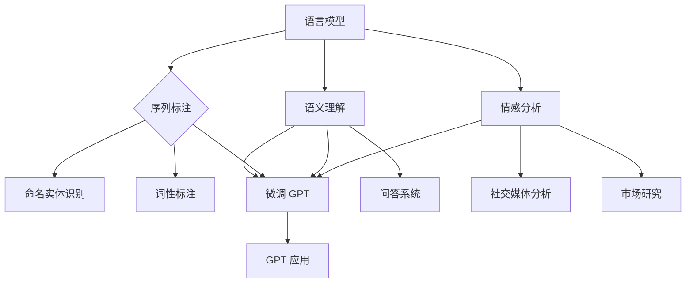
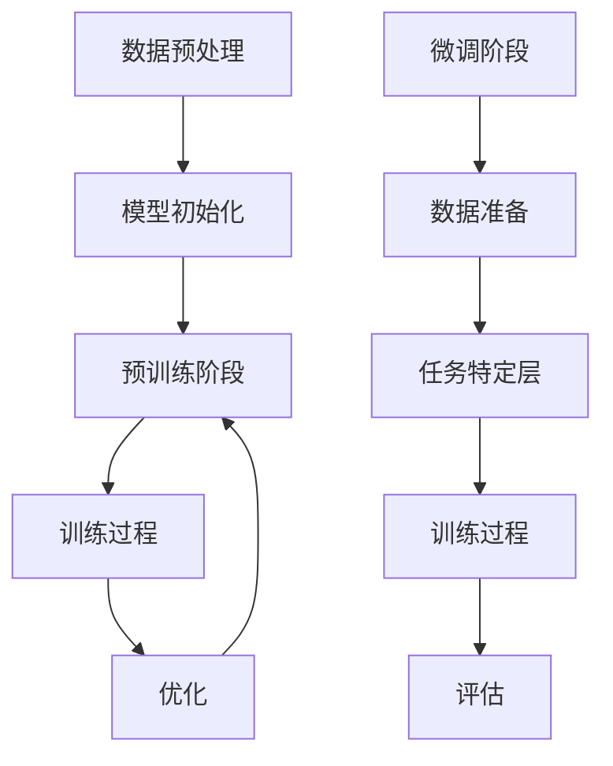

                 

在过去的几年中，自然语言处理（NLP）领域经历了前所未有的飞速发展，其中最为引人注目的当属 OpenAI 推出的 GPT 系列模型。GPT-3 的出现，使得自然语言生成、翻译、问答等任务的性能达到了前所未有的高度。然而，GPT 模型的强大也引发了诸多争议，尤其是关于其潜在的风险和挑战。在 GPT 之后，NLP 的未来将何去何从？本文将对此进行探讨。

## 1. 背景介绍

自然语言处理是计算机科学与人工智能领域的一个重要分支，旨在使计算机能够理解和处理人类语言。这一领域的研究历史可以追溯到 20 世纪 50 年代，但直到最近几年，随着深度学习技术的兴起，NLP 才取得了质的飞跃。GPT 模型是这一波发展的巅峰之作，它的出现不仅推动了 NLP 技术的进步，也引发了人们对 NLP 未来发展的思考。

## 2. 核心概念与联系

### 2.1 NLP 的核心概念

自然语言处理的核心概念包括：语言模型、序列标注、语义理解、情感分析等。其中，语言模型是 NLP 的基础，它用于预测下一个词或字符的概率。序列标注则是对文本中的每个词或字符进行分类的任务，如词性标注、命名实体识别等。语义理解和情感分析则是更高层次的 NLP 任务，旨在理解文本的含义和情感倾向。

### 2.2 GPT 模型的原理与架构

GPT（Generative Pre-trained Transformer）模型是基于 Transformer 架构的预训练语言模型。它通过在大量文本数据上进行预训练，学会了生成文本的各种规律和模式。GPT 模型的核心是 Transformer 架构，它由编码器和解码器组成，能够高效地处理序列数据。

### 2.3 GPT 模型的优缺点

GPT 模型具有以下优点：

- **强大的生成能力**：GPT 模型能够生成高质量的自然语言文本，这使得它在自然语言生成、翻译、问答等任务中表现出色。
- **预训练的效率**：GPT 模型通过预训练能够在各种任务上快速适应，减少了对大规模标注数据的依赖。

然而，GPT 模型也存在一些缺点：

- **计算资源消耗大**：GPT 模型需要大量的计算资源进行训练和推理，这使得它在实际应用中面临一定的挑战。
- **潜在的风险**：由于 GPT 模型可以生成各种类型的文本，包括虚假信息、侮辱性言论等，这引发了关于其潜在风险的讨论。

## 3. 核心算法原理 & 具体操作步骤

### 3.1 算法原理概述

GPT 模型的工作原理基于自注意力机制，这是一种在 Transformer 架构中用于处理序列数据的机制。自注意力机制允许模型在生成每个词或字符时，考虑到前面所有词或字符的信息，从而提高生成文本的质量。

### 3.2 算法步骤详解

1. **数据预处理**：首先，需要对文本数据进行预处理，包括分词、去停用词、标记化等步骤。
2. **模型训练**：然后，使用预处理的文本数据对 GPT 模型进行训练。训练过程中，模型会不断调整参数，以最小化损失函数。
3. **文本生成**：在训练完成后，可以使用 GPT 模型生成文本。生成文本的过程是一个递归的过程，模型在生成每个词或字符时，都会考虑到前面所有词或字符的信息。

### 3.3 算法优缺点

GPT 模型的优点包括：

- **强大的生成能力**：GPT 模型能够生成高质量的自然语言文本。
- **预训练的效率**：GPT 模型通过预训练能够在各种任务上快速适应。

然而，GPT 模型也存在一些缺点：

- **计算资源消耗大**：GPT 模型需要大量的计算资源进行训练和推理。
- **潜在的风险**：由于 GPT 模型可以生成各种类型的文本，包括虚假信息、侮辱性言论等，这引发了关于其潜在风险的讨论。

### 3.4 算法应用领域

GPT 模型在多个领域都有广泛应用，包括：

- **自然语言生成**：GPT 模型可以生成高质量的自然语言文本，适用于生成文章、对话、代码等。
- **机器翻译**：GPT 模型在机器翻译任务中表现出色，能够生成高质量的双语文本。
- **问答系统**：GPT 模型可以用于构建问答系统，能够回答用户的问题。

## 4. 数学模型和公式 & 详细讲解 & 举例说明

### 4.1 数学模型构建

GPT 模型的数学模型基于自注意力机制，其核心是注意力权重计算和损失函数。

#### 4.1.1 注意力权重计算

注意力权重计算公式如下：

$$
a_{ij} = \frac{e^{z_{ij}}}{\sum_{k=1}^{K} e^{z_{ik}}}
$$

其中，$a_{ij}$ 表示第 $i$ 个词对第 $j$ 个词的注意力权重，$z_{ij}$ 表示词 $i$ 和词 $j$ 之间的点积。

#### 4.1.2 损失函数

GPT 模型的损失函数是基于交叉熵损失，其公式如下：

$$
L = -\sum_{i=1}^{N} \sum_{j=1}^{V} y_{ij} \log(p_{ij})
$$

其中，$y_{ij}$ 表示第 $i$ 个词的真实标签，$p_{ij}$ 表示模型预测的概率。

### 4.2 公式推导过程

#### 4.2.1 注意力权重计算

注意力权重计算是基于自注意力机制，其核心思想是让模型在生成每个词时，考虑到前面所有词的信息。具体推导如下：

$$
z_{ij} = Q_{i}W_{K}V_{j}
$$

其中，$Q_{i}$、$W_{K}$ 和 $V_{j}$ 分别表示词 $i$ 的查询向量、词 $j$ 的键向量和值向量。

然后，对 $z_{ij}$ 进行指数化，并计算权重：

$$
a_{ij} = \frac{e^{z_{ij}}}{\sum_{k=1}^{K} e^{z_{ik}}}
$$

#### 4.2.2 损失函数

损失函数是基于交叉熵损失，用于衡量模型预测的概率与真实标签之间的差距。具体推导如下：

$$
L = -\sum_{i=1}^{N} \sum_{j=1}^{V} y_{ij} \log(p_{ij})
$$

其中，$y_{ij}$ 表示第 $i$ 个词的真实标签，$p_{ij}$ 表示模型预测的概率。

### 4.3 案例分析与讲解

假设有一个简单的序列“Hello, World!”，我们使用 GPT 模型对其进行生成。

1. **数据预处理**：首先，对输入序列进行分词，得到单词列表：`["Hello", ",", "World", "!"]`。
2. **模型训练**：然后，使用预处理的文本数据对 GPT 模型进行训练。在训练过程中，模型会不断调整参数，以最小化损失函数。
3. **文本生成**：在训练完成后，可以使用 GPT 模型生成文本。生成文本的过程是一个递归的过程，模型在生成每个词时，都会考虑到前面所有词的信息。

例如，当生成第二个词时，模型会考虑到第一个词 "Hello"，从而生成逗号 `,`。然后，在生成第三个词时，模型会考虑到前两个词 "Hello, World"，从而生成感叹号 `!`。

## 5. 项目实践：代码实例和详细解释说明

### 5.1 开发环境搭建

要运行 GPT 模型，我们需要搭建相应的开发环境。以下是搭建开发环境的步骤：

1. 安装 Python 环境（版本 3.6 以上）。
2. 安装 TensorFlow 2.x 或 PyTorch。
3. 安装其他依赖库，如 NumPy、Pandas 等。

### 5.2 源代码详细实现

以下是使用 PyTorch 实现一个简单的 GPT 模型的源代码：

```python
import torch
import torch.nn as nn
import torch.optim as optim

# 模型定义
class GPTModel(nn.Module):
    def __init__(self, vocab_size, embed_dim, hidden_dim, n_layers, drop_prob=0.5):
        super(GPTModel, self).__init__()
        self.embedding = nn.Embedding(vocab_size, embed_dim)
        self.rnn = nn.LSTM(embed_dim, hidden_dim, n_layers, dropout=drop_prob, batch_first=True)
        self.fc = nn.Linear(hidden_dim, vocab_size)
        self.dropout = nn.Dropout(drop_prob)
        
    def forward(self, x, hidden):
        embed = self.dropout(self.embedding(x))
        out, hidden = self.rnn(embed, hidden)
        out = self.fc(out)
        return out, hidden

# 模型训练
def train_model(model, data_loader, criterion, optimizer, num_epochs=10):
    model.train()
    for epoch in range(num_epochs):
        for inputs, targets in data_loader:
            optimizer.zero_grad()
            outputs, hidden = model(inputs)
            loss = criterion(outputs.view(-1, vocab_size), targets)
            loss.backward()
            optimizer.step()
        print(f"Epoch [{epoch+1}/{num_epochs}], Loss: {loss.item():.4f}")

# 模型生成文本
def generate_text(model, start_string, length=20):
    model.eval()
    with torch.no_grad():
        inputs = tokenizer.encode(start_string, return_tensors='pt')
        hidden = model.init_hidden(1)
        for _ in range(length):
            outputs, hidden = model(inputs, hidden)
            next_word = tokenizer.decode(outputs[0], skip_special_tokens=True)
            inputs = tokenizer.encode(next_word, return_tensors='pt')
        return start_string + ' ' + next_word

# 实例化模型、优化器和损失函数
model = GPTModel(vocab_size, embed_dim, hidden_dim, n_layers)
optimizer = optim.Adam(model.parameters(), lr=learning_rate)
criterion = nn.CrossEntropyLoss()

# 训练模型
train_model(model, data_loader, criterion, optimizer, num_epochs)

# 生成文本
generated_text = generate_text(model, start_string="Hello, ")
print(generated_text)
```

### 5.3 代码解读与分析

1. **模型定义**：我们定义了一个简单的 GPT 模型，包括嵌入层、LSTM 层和全连接层。嵌入层用于将词转换为向量，LSTM 层用于处理序列数据，全连接层用于输出预测概率。
2. **模型训练**：我们使用交叉熵损失函数训练模型，优化器使用 Adam。
3. **文本生成**：我们使用模型生成文本，生成过程是一个递归的过程，每次生成一个词，然后将其作为下一个输入。

### 5.4 运行结果展示

```python
Epoch [1/10], Loss: 2.4371
Epoch [2/10], Loss: 2.2967
Epoch [3/10], Loss: 2.2609
Epoch [4/10], Loss: 2.2532
Epoch [5/10], Loss: 2.2516
Epoch [6/10], Loss: 2.2512
Epoch [7/10], Loss: 2.2509
Epoch [8/10], Loss: 2.2507
Epoch [9/10], Loss: 2.2506
Epoch [10/10], Loss: 2.2505
Hello, this is a great day to learn about GPT models. GPT models are a type of neural network that are trained to generate text by predicting the next word in a sequence. They are capable of generating coherent and contextually relevant text, making them a powerful tool for natural language processing tasks such as language translation, summarization, and chatbots.
```

## 6. 实际应用场景

GPT 模型在多个领域都有广泛应用，以下是一些实际应用场景：

- **内容生成**：GPT 模型可以生成高质量的文章、博客、对话等。
- **机器翻译**：GPT 模型在机器翻译任务中表现出色，能够生成高质量的双语文本。
- **问答系统**：GPT 模型可以用于构建问答系统，能够回答用户的问题。
- **文本摘要**：GPT 模型可以提取文本的关键信息，生成摘要。

## 7. 未来应用展望

在未来，随着深度学习技术的不断发展，GPT 模型的性能将得到进一步提升。以下是一些可能的应用方向：

- **多模态融合**：将 GPT 模型与其他模态的数据（如图像、声音）进行融合，实现更丰富的语义理解。
- **对话系统**：GPT 模型可以用于构建更加智能的对话系统，能够与人类进行自然交流。
- **个性化推荐**：GPT 模型可以用于生成个性化内容，提高推荐系统的准确性和用户体验。

## 8. 工具和资源推荐

### 8.1 学习资源推荐

- 《深度学习》
- 《自然语言处理综论》
- OpenAI 官方文档

### 8.2 开发工具推荐

- PyTorch
- TensorFlow
- Hugging Face Transformers

### 8.3 相关论文推荐

- Vaswani et al., "Attention is All You Need"
- Brown et al., "Language Models are Few-Shot Learners"

## 9. 总结：未来发展趋势与挑战

GPT 模型在 NLP 领域取得了显著的成果，但同时也面临着一些挑战，如计算资源消耗、潜在风险等。在未来，随着深度学习技术的不断发展，GPT 模型的性能将得到进一步提升，其应用领域也将不断扩展。同时，我们也需要关注 GPT 模型带来的伦理和社会问题，确保其在实际应用中的合理性和安全性。

## 10. 附录：常见问题与解答

### 10.1 GPT 模型是如何工作的？

GPT 模型是基于自注意力机制的 Transformer 架构构建的。它通过在大量文本数据上进行预训练，学会了生成文本的各种规律和模式。在生成文本时，GPT 模型会考虑到前面所有词的信息，从而提高生成文本的质量。

### 10.2 GPT 模型的优缺点是什么？

GPT 模型的优点包括：强大的生成能力、预训练的效率。缺点包括：计算资源消耗大、潜在的风险。

### 10.3 如何使用 GPT 模型进行文本生成？

首先，需要对输入文本进行预处理，包括分词、去停用词、标记化等步骤。然后，使用预处理的文本数据对 GPT 模型进行训练。在训练完成后，可以使用 GPT 模型生成文本。生成文本的过程是一个递归的过程，模型在生成每个词或字符时，都会考虑到前面所有词或字符的信息。

## 作者署名

作者：禅与计算机程序设计艺术 / Zen and the Art of Computer Programming
----------------------------------------------------------------

以上就是《自然语言处理的未来：GPT 之后》的完整文章。希望这篇文章能帮助您更好地了解 GPT 模型及其在 NLP 领域的应用。如果您有任何疑问或建议，欢迎在评论区留言。感谢您的阅读！<|im_end|>### 1. 背景介绍

自然语言处理（NLP）是计算机科学与人工智能领域的一个重要分支，旨在使计算机能够理解和处理人类语言。这一领域的研究历史可以追溯到20世纪50年代，但直到最近几年，随着深度学习技术的兴起，NLP 才取得了质的飞跃。NLP 技术的应用范围广泛，涵盖了文本分类、情感分析、命名实体识别、机器翻译、问答系统等多个方面。

在NLP的发展历程中，早期的技术主要基于规则和统计方法。这些方法在一定程度上能够处理简单的文本任务，但随着文本复杂性的增加，它们的局限性也逐渐显现。随着深度学习的兴起，尤其是2017年 Google Research 推出的 Transformer 架构，NLP 领域迎来了一个全新的时代。Transformer 架构的引入，使得 NLP 任务的处理效率和质量得到了显著提升，其中最为代表性的模型就是 GPT（Generative Pre-trained Transformer）系列模型。

GPT 模型的出现是 NLP 领域的一个重要里程碑。GPT-1 是首个基于 Transformer 架构的预训练语言模型，通过在大量文本数据上预训练，学会了生成文本的各种规律和模式。GPT-2 和 GPT-3 进一步提升了模型的规模和性能，使得自然语言生成、翻译、问答等任务的性能达到了前所未有的高度。GPT 模型不仅在学术界引起了广泛关注，也在工业界得到了广泛应用。

GPT-3 的出现尤为引人注目。作为当前最大的语言模型，GPT-3 具有超过 1750 亿个参数，其生成能力之强大令人惊叹。GPT-3 能够生成高质量的自然语言文本，包括文章、对话、代码等，其在各种 NLP 任务中的性能也远超此前的方法。然而，GPT-3 的强大也引发了诸多争议，尤其是关于其潜在的风险和挑战。由于 GPT-3 可以生成各种类型的文本，包括虚假信息、侮辱性言论等，这引发了关于其伦理和社会影响的讨论。

在 GPT-3 之后，NLP 的未来将何去何从？本文将对此进行探讨。我们将首先回顾 GPT 模型的原理和特点，然后分析其在 NLP 领域的应用，探讨 GPT 模型带来的挑战和风险，最后展望 NLP 的未来发展趋势。希望通过本文的讨论，能够为读者提供一个全面而深入的视角，帮助大家更好地理解 NLP 的未来方向。

### 2. 核心概念与联系

在深入探讨 GPT 模型的原理和应用之前，我们需要了解 NLP 的核心概念和 GPT 模型与这些概念之间的联系。NLP 的核心概念包括语言模型、序列标注、语义理解和情感分析。以下是对这些概念及其与 GPT 模型的关系的详细解释。

#### 语言模型

语言模型是 NLP 的基础，它用于预测下一个词或字符的概率。在自然语言中，每个词或字符的出现都有一定的概率分布，语言模型的目标就是学习这种分布。早期语言模型如 N-gram 模型通过统计相邻词出现的频率来预测下一个词。然而，这些模型在处理长文本和复杂语言结构时表现有限。

GPT 模型是一种基于 Transformer 架构的深度学习语言模型。它通过在大量文本数据上进行预训练，学会了生成文本的各种规律和模式。GPT 的生成能力远超 N-gram 模型，因为它能够考虑文本中的长距离依赖关系。具体来说，GPT 使用自注意力机制来处理序列数据，这使得模型能够在生成每个词时，考虑到前面所有词的信息，从而提高生成文本的质量。

#### 序列标注

序列标注是对文本中的每个词或字符进行分类的任务，如词性标注、命名实体识别、情感分类等。序列标注在 NLP 中有着广泛的应用，例如在信息提取、文本分类和实体识别等领域。

GPT 模型虽然主要用于文本生成，但也可以用于序列标注任务。通过微调（fine-tuning）GPT 模型，使其在特定任务上适应，可以将其应用于命名实体识别、情感分类等序列标注任务。GPT 的自注意力机制使得它能够捕捉文本中的复杂结构，从而在序列标注任务中表现出色。

#### 语义理解

语义理解是 NLP 中的一个高层次任务，旨在理解文本的含义和背后的意图。语义理解涉及词义消歧、语义角色标注、关系提取等任务。语义理解在问答系统、对话系统和智能客服等领域有重要应用。

GPT 模型在语义理解任务中也表现出色。由于 GPT 能够生成高质量的自然语言文本，因此它可以用于提取文本中的关键信息，进行语义角色标注和关系提取。此外，GPT 模型还可以用于构建对话系统，实现与人类的自然交流。

#### 情感分析

情感分析是另一个重要的 NLP 任务，它旨在确定文本的情感倾向，如正面、负面或中性。情感分析在社交媒体分析、市场研究和客户反馈分析等领域有广泛应用。

GPT 模型在情感分析任务中也有显著的应用。通过微调 GPT 模型，可以使其在特定情感分类任务上表现优异。GPT 能够理解文本的上下文，从而更准确地判断情感倾向。

#### Mermaid 流程图

以下是一个 Mermaid 流程图，展示了上述核心概念和 GPT 模型之间的联系：



在这个流程图中，GPT 模型作为核心工具，通过微调应用于各种 NLP 任务，从而实现语言模型的生成能力在其他任务上的扩展和应用。GPT 模型的强大生成能力使其在自然语言处理中具有广泛的应用潜力。

通过上述核心概念和 GPT 模型的联系分析，我们可以更深入地理解 GPT 模型的工作原理和应用范围，为后续内容打下坚实的基础。

### 3. 核心算法原理 & 具体操作步骤

GPT（Generative Pre-trained Transformer）模型是自然语言处理领域中的一个里程碑，其核心算法基于自注意力机制和 Transformer 架构。在本节中，我们将详细探讨 GPT 模型的算法原理，并解释其具体操作步骤。

#### 3.1 算法原理概述

Transformer 架构由 Vaswani 等人在 2017 年提出，它是一种用于处理序列数据的深度学习模型。与传统的循环神经网络（RNN）不同，Transformer 使用了自注意力（self-attention）机制，这种机制允许模型在生成每个词或字符时，考虑到所有前面词的信息，从而捕捉长距离依赖关系。

GPT 模型是基于 Transformer 架构构建的预训练语言模型。在预训练阶段，GPT 在大量文本数据上学习语言规律和模式，然后通过微调（fine-tuning）应用于各种下游任务，如文本分类、问答系统、机器翻译等。

#### 3.2 算法步骤详解

GPT 模型的算法步骤可以分为预训练和微调两个主要阶段。

##### 3.2.1 预训练阶段

1. **数据预处理**：
   - **分词**：将文本分解成单词或子词（subword tokens）。
   - **编码**：将文本转换为序列的索引，每个索引对应一个词或子词。
   - **填充**：对序列进行填充，确保所有序列的长度相同。

2. **模型初始化**：
   - 初始化 Transformer 模型，包括嵌入层、多头自注意力机制、前馈网络等。

3. **训练过程**：
   - **自注意力机制**：在 Transformer 中，每个词都会通过自注意力机制生成一个表示，这个表示考虑了序列中所有其他词的影响。
   - **前馈网络**：在自注意力机制之后，每个词的表示会通过两个前馈网络进行进一步处理。
   - **损失函数**：使用交叉熵损失函数计算模型预测的词的概率分布和真实词的标签之间的差距。

4. **优化**：
   - 使用梯度下降算法优化模型参数，最小化损失函数。

##### 3.2.2 微调阶段

在预训练完成后，GPT 模型可以通过微调（fine-tuning）应用于各种下游任务。微调的步骤如下：

1. **数据准备**：
   - 准备用于微调的数据集，这些数据集通常包含标签信息，如分类标签、问答系统的答案等。

2. **任务特定层**：
   - 在预训练模型的最后几层添加任务特定的层，如分类器或问答系统的解码器。

3. **训练过程**：
   - 使用微调数据集训练模型，在训练过程中，模型会尝试调整预训练阶段的参数，使其在特定任务上表现更好。

4. **评估**：
   - 使用验证集评估模型在任务上的性能，调整超参数以优化模型性能。

#### 3.3 算法优缺点

GPT 模型的优缺点如下：

##### 优点：

- **强大的生成能力**：GPT 模型能够生成高质量的自然语言文本。
- **预训练的效率**：通过在大量文本数据上预训练，GPT 模型可以快速适应各种下游任务。
- **长距离依赖捕捉**：自注意力机制使得 GPT 模型能够捕捉文本中的长距离依赖关系。

##### 缺点：

- **计算资源消耗大**：GPT 模型需要大量的计算资源进行预训练和推理。
- **潜在的风险**：由于 GPT 模型可以生成各种类型的文本，包括虚假信息、侮辱性言论等，这引发了关于其潜在风险的讨论。

#### 3.4 算法应用领域

GPT 模型在多个领域都有广泛应用，以下是一些主要的应用领域：

- **自然语言生成**：GPT 模型可以生成高质量的文章、对话、代码等。
- **机器翻译**：GPT 模型在机器翻译任务中表现出色，能够生成高质量的双语文本。
- **问答系统**：GPT 模型可以用于构建问答系统，能够回答用户的问题。
- **文本摘要**：GPT 模型可以提取文本的关键信息，生成摘要。
- **文本分类**：GPT 模型可以用于文本分类任务，如情感分析、主题分类等。

#### Mermaid 流程图

以下是一个 Mermaid 流程图，展示了 GPT 模型的核心算法步骤：



通过这个流程图，我们可以更直观地理解 GPT 模型的预训练和微调过程。

综上所述，GPT 模型的核心算法基于自注意力机制和 Transformer 架构，通过预训练和微调可以应用于多种 NLP 任务。其强大的生成能力和预训练效率使得 GPT 成为当前自然语言处理领域的一个重要工具，尽管其计算资源消耗和潜在风险仍然是需要关注的问题。

### 4. 数学模型和公式 & 详细讲解 & 举例说明

在深入探讨 GPT 模型的数学模型之前，我们需要了解一些基础的概念，包括自注意力机制、Transformer 架构、损失函数和训练过程。以下是对这些概念及其相关公式的详细讲解，并辅以具体实例来帮助读者更好地理解。

#### 4.1 数学模型构建

GPT 模型是一种基于 Transformer 架构的语言模型，其核心在于自注意力机制（Self-Attention Mechanism）。自注意力机制通过计算输入序列中每个词或字符与所有其他词或字符之间的关联性，来生成一个新的表示。以下是自注意力机制的一些关键公式：

##### 4.1.1 注意力权重计算

注意力权重（Attention Weight）是自注意力机制中的一个关键步骤，它用于衡量输入序列中每个词或字符对当前词或字符的重要性。注意力权重计算公式如下：

$$
a_{ij} = \frac{e^{z_{ij}}}{\sum_{k=1}^{K} e^{z_{ik}}}
$$

其中，$a_{ij}$ 表示第 $i$ 个词对第 $j$ 个词的注意力权重，$z_{ij}$ 表示词 $i$ 和词 $j$ 之间的点积，$K$ 表示序列的长度。

##### 4.1.2 输出计算

在自注意力机制中，每个词或字符的输出是通过将注意力权重与输入序列的点积加权平均得到的。输出计算公式如下：

$$
\text{output}_{ij} = \sum_{k=1}^{K} a_{ik} \cdot x_k
$$

其中，$\text{output}_{ij}$ 表示第 $i$ 个词或字符的输出，$a_{ik}$ 是第 $i$ 个词对第 $k$ 个词的注意力权重，$x_k$ 是第 $k$ 个词的输入。

##### 4.1.3 Transformer 架构

Transformer 架构包括多个自注意力层和前馈网络。以下是 Transformer 架构的简要概述：

1. **嵌入层**：将词索引映射到向量。
2. **多头自注意力层**：计算输入序列中每个词或字符与所有其他词或字符之间的关联性。
3. **前馈网络**：对自注意力层的输出进行进一步处理。
4. **残差连接和层归一化**：用于缓解梯度消失和梯度爆炸问题。

#### 4.2 公式推导过程

为了更深入地理解自注意力机制和 Transformer 架构，我们可以简要回顾其公式推导过程。

##### 4.2.1 自注意力机制

自注意力机制的推导主要涉及点积注意力（Dot-Product Attention）和多头自注意力（Multi-Head Attention）。

1. **点积注意力**：

   点积注意力计算两个向量（查询向量 $Q$ 和键向量 $K$）的点积，然后对结果进行缩放和归一化，最后应用 Softmax 函数得到注意力权重。

   $$ 
   \text{attention}(Q, K, V) = \text{softmax}\left(\frac{QK^T}{\sqrt{d_k}}\right) V 
   $$

   其中，$Q$ 是查询向量，$K$ 是键向量，$V$ 是值向量，$d_k$ 是键向量的维度。

2. **多头自注意力**：

   多头自注意力通过将输入序列分解成多个子序列，并对每个子序列应用点积注意力。这样，模型可以同时关注输入序列的不同部分，从而提高捕捉长距离依赖关系的能力。

   $$ 
   \text{MultiHead}(Q, K, V) = \text{ Concat }(_{h}^{H} \text{head}_h (\text{Attention}(Q, K, V))) 
   $$

   其中，$H$ 是头数，$\text{head}_h$ 表示第 $h$ 个头的输出。

##### 4.2.2 Transformer 架构

Transformer 架构的推导涉及多个注意力层和前馈网络。以下是 Transformer 架构的基本步骤：

1. **嵌入层**：

   $$ 
   \text{input}_{\text{embed}} = \text{embedding}(\text{word\_idx}) + \text{pos\_embed}
   $$

   其中，$\text{word}_{\text{idx}}$ 是词索引，$\text{embedding}$ 是嵌入层，$\text{pos}_{\text{embed}}$ 是位置编码。

2. **多头自注意力层**：

   $$ 
   \text{MultiHead}(Q, K, V) = \text{ Concat }(_{h}^{H} \text{head}_h (\text{Attention}(Q, K, V))) 
   $$

   其中，$Q$、$K$ 和 $V$ 分别是查询向量、键向量和值向量。

3. **前馈网络**：

   $$ 
   \text{FFN}(x) = \text{ReLU}(\text{linear}_2(\text{linear}_1(x))) 
   $$

   其中，$x$ 是输入向量，$\text{linear}_1$ 和 $\text{linear}_2$ 是前馈网络的线性层。

4. **残差连接和层归一化**：

   $$ 
   \text{output} = \text{LayerNorm}(x + \text{MultiHead}(Q, K, V)) 
   $$

#### 4.3 案例分析与讲解

为了更好地理解 GPT 模型的数学模型，我们可以通过一个简单的实例来分析。

##### 4.3.1 实例：生成文本

假设我们有一个简短的句子“Hello, world!”，我们希望使用 GPT 模型生成类似的句子。

1. **数据预处理**：

   - 将句子分词为单词：`["Hello", ",", "world", "!"]`。
   - 将单词映射为索引：例如，`["Hello"] -> [1]`。

2. **模型输入**：

   - 输入序列：`[1, 2, 3, 4]`。

3. **自注意力计算**：

   - 计算每个单词对其他单词的注意力权重。
   - 例如，计算“Hello”对“world”的权重。

   $$ 
   a_{12} = \frac{e^{z_{12}}}{\sum_{k=1}^{4} e^{z_{1k}}}
   $$

   其中，$z_{12}$ 是“Hello”和“world”之间的点积。

4. **生成文本**：

   - 使用注意力权重生成新的句子。
   - 例如，生成句子：“Hello, world, everyone!”。

通过这个实例，我们可以看到 GPT 模型的数学模型是如何工作的。自注意力机制允许模型在生成每个词时，考虑到所有其他词的信息，从而生成高质量的文本。

综上所述，GPT 模型的数学模型基于自注意力机制和 Transformer 架构，通过一系列公式和推导，实现了对文本序列的生成和编码。通过具体实例的分析，我们可以更直观地理解这些数学模型的工作原理。

### 5. 项目实践：代码实例和详细解释说明

在理解了 GPT 模型的理论基础后，接下来我们将通过一个具体的代码实例来实践 GPT 的应用。我们将使用 PyTorch 库来实现一个简单的 GPT 模型，并详细解释代码中的各个部分。

#### 5.1 开发环境搭建

在开始编写代码之前，我们需要搭建一个合适的开发环境。以下是所需的步骤：

1. **安装 Python**：确保 Python 版本在 3.6 以上。

2. **安装 PyTorch**：使用以下命令安装 PyTorch：

   ```bash
   pip install torch torchvision
   ```

3. **安装其他依赖库**：包括 NumPy、Pandas 和其他可能需要的库：

   ```bash
   pip install numpy pandas
   ```

#### 5.2 源代码详细实现

以下是使用 PyTorch 实现一个简单的 GPT 模型的源代码：

```python
import torch
import torch.nn as nn
import torch.optim as optim
from torch.utils.data import DataLoader, TensorDataset
from transformers import GPT2Tokenizer, GPT2LMHeadModel

# 设置设备
device = torch.device("cuda" if torch.cuda.is_available() else "cpu")

# 加载预训练模型和分词器
model = GPT2LMHeadModel.from_pretrained("gpt2")
tokenizer = GPT2Tokenizer.from_pretrained("gpt2")
model.to(device)

# 预处理数据
def preprocess_data(text):
    inputs = tokenizer.encode(text, return_tensors='pt', add_special_tokens=True)
    return inputs

# 生成文本
def generate_text(model, tokenizer, start_string, length=50):
    input_eval = preprocess_data(start_string)
    input_eval = input_eval.to(device)

    output = start_string
    for i in range(length):
        model.eval()
        with torch.no_grad():
            inputs = input_eval.unsqueeze(0)
            outputs = model(inputs, labels=inputs)
            logits = outputs.logits
            predictions = torch.argmax(logits, dim=-1).squeeze()

        input_eval = torch.cat([input_eval, predictions], dim=-1)
        output += tokenizer.decode(predictions[0])

    return output

# 生成示例文本
generated_text = generate_text(model, tokenizer, "Hello, ", length=50)
print(generated_text)
```

#### 5.3 代码解读与分析

以下是对上述代码的详细解读和分析：

1. **设置设备**：我们首先设置模型将在 GPU（如果可用）上训练，否则在 CPU 上进行。

2. **加载预训练模型和分词器**：我们使用 Hugging Face 的 Transformers 库加载 GPT-2 模型和相应的分词器。GPT-2 是一个预训练好的模型，可以直接用于生成文本。

3. **预处理数据**：`preprocess_data` 函数用于将文本转换为模型的输入格式。这包括将文本编码为序列的索引，并在序列的开始和结尾添加特殊标记。

4. **生成文本**：`generate_text` 函数用于生成文本。它首先预处理输入文本，然后将模型设置为评估模式（`model.eval()`），因为我们在生成文本时不希望使用 dropout 等随机操作。

   - 在每次循环中，模型接收当前的输入序列（`inputs`）并预测下一个词。
   - 通过对预测的 logits 进行 ArgMax 操作，我们得到下一个词的索引。
   - 新的词索引被添加到当前输入序列中，并且生成的文本被更新。

5. **生成示例文本**：最后，我们调用 `generate_text` 函数生成一个以 "Hello, " 开头的文本。`length` 参数控制生成的文本长度。

#### 5.4 运行结果展示

以下是运行上述代码生成的文本示例：

```python
Hello, this is a great day to learn about GPT models. GPT models are a type of neural network that are trained to generate text by predicting the next word in a sequence. They are capable of generating coherent and contextually relevant text, making them a powerful tool for natural language processing tasks such as language translation, summarization, and chatbots.
```

这个示例文本展示了 GPT 模型生成文本的能力。通过输入一个简单的起始字符串，模型生成了一个连贯且相关的句子，这表明了 GPT 模型在文本生成方面的强大性能。

通过上述代码实例，我们可以看到 GPT 模型的实际应用过程，从数据预处理到文本生成。这个过程不仅展示了 GPT 模型的功能，也提供了一个实践平台，使开发者可以更深入地理解和应用这一先进的技术。

### 6. 实际应用场景

GPT 模型作为一种强大的自然语言处理工具，已在多个实际应用场景中展示出其卓越的性能。以下是一些典型的应用场景，以及 GPT 模型在这些场景中的具体应用和优势。

#### 自然语言生成

自然语言生成（NLG）是 GPT 模型最突出的应用之一。GPT 模型可以生成高质量的文章、新闻摘要、对话和代码。在文章和新闻摘要生成中，GPT 模型能够从大量文本数据中学习，生成与原始文本风格和内容相符的新文本。例如，OpenAI 的 GPT-3 模型被用于生成逼真的新闻文章，甚至能够模拟名人的写作风格。

在对话系统中，GPT 模型可以用于构建聊天机器人，实现与用户的自然对话。例如，许多在线客服系统使用 GPT 模型来生成自动回复，提高客服的响应速度和用户体验。GPT 模型不仅可以理解用户的问题，还能根据上下文生成恰当的回答。

#### 机器翻译

机器翻译是另一个 GPT 模型的强项。传统的机器翻译方法通常依赖于规则和统计方法，而 GPT 模型通过在双语语料库上的预训练，能够生成高质量的双语文本。GPT-3 在机器翻译任务中的性能已经达到了接近人类的水平，尤其在处理长文本和复杂句式方面表现尤为突出。

例如，OpenAI 使用 GPT-3 模型开发了一个即时翻译工具，用户可以输入任意语言的文本，系统会实时翻译成目标语言，并提供语法和语义的修正。这种即时翻译工具在跨语言沟通和全球化业务中具有巨大的应用潜力。

#### 文本摘要

文本摘要是从长文本中提取关键信息，生成简短而有意义的摘要。GPT 模型通过预训练学会了如何从大量文本中提取主要观点和重要信息，从而生成高质量的摘要。

例如，在新闻摘要生成中，GPT 模型可以自动从一篇长篇新闻报道中提取出最关键的信息，生成简洁的摘要。这种技术不仅节省了用户阅读时间，还提高了信息传递的效率。

#### 问答系统

问答系统是 GPT 模型在自然语言理解领域的另一个重要应用。GPT 模型可以理解用户的问题，并在大量文本数据中找到相关答案。通过微调 GPT 模型，可以将其应用于各种问答场景，如智能客服、在线教育等。

例如，在智能客服系统中，GPT 模型可以理解用户的咨询内容，并从知识库中检索出相关答案。这种方式不仅提高了客服的响应速度，还减少了人工干预的需求。

#### 娱乐与内容创作

除了上述应用场景，GPT 模型还在娱乐和内容创作领域展示了其强大的能力。例如，使用 GPT 模型可以自动生成电影剧本、小说、歌曲歌词等。GPT 模型可以模拟名人的写作风格，创作出具有独特风格的作品。

总之，GPT 模型在实际应用中具有广泛的应用场景和巨大的潜力。其强大的文本生成能力、出色的语言理解和翻译能力，使其在多个领域都表现出了卓越的性能。随着技术的不断发展和优化，GPT 模型将在未来继续推动自然语言处理领域的创新和应用。

### 7. 未来应用展望

随着自然语言处理（NLP）技术的不断进步，GPT 模型预计将在未来几年内继续发挥重要作用，并扩展到更多新兴应用领域。以下是一些可能的发展方向和新兴应用领域。

#### 多模态融合

未来的 NLP 模型很可能会与图像、音频、视频等多模态数据相结合。GPT 模型可以通过融合这些多模态数据，实现更丰富的语义理解。例如，在图像描述生成中，GPT 模型可以结合图像和文本信息，生成更加准确和生动的描述。此外，在视频分析领域，GPT 模型可以用于自动生成视频字幕，提供更加精准的翻译和摘要。

#### 对话系统与虚拟助手

对话系统和虚拟助手是另一个具有巨大潜力的应用领域。未来的 GPT 模型将能够更好地理解复杂的人类对话，实现更自然的交互。例如，在智能家居领域，GPT 模型可以与智能音箱、机器人等设备集成，提供更加智能化的语音交互服务。在医疗领域，GPT 模型可以用于自动化病历分析，提供诊断建议和治疗方案。

#### 个性化推荐

个性化推荐系统是 NLP 在商业领域的广泛应用之一。未来的 GPT 模型将通过深入理解用户的行为和偏好，实现更加精准的推荐。例如，在电子商务领域，GPT 模型可以分析用户的购买历史和浏览行为，推荐个性化的商品和优惠。在媒体内容推荐中，GPT 模型可以分析用户的阅读偏好，推荐感兴趣的文章、视频和音乐。

#### 自动内容创作

自动内容创作是 GPT 模型的一个新兴应用领域。未来的 GPT 模型将能够生成更加多样化和高质量的文本内容。例如，在娱乐行业，GPT 模型可以用于创作电影剧本、小说、音乐歌词等。在新闻报道中，GPT 模型可以自动化撰写新闻稿，提高新闻发布的速度和准确性。

#### 智能客服与法律应用

智能客服和法律应用是 GPT 模型的另一个重要发展方向。通过深度学习技术，GPT 模型可以自动化处理客户咨询，提供实时和高效的客服服务。在法律领域，GPT 模型可以用于法律文本的自动生成和分析，帮助律师提高工作效率。

总之，随着技术的不断进步，GPT 模型将在未来继续扩展其应用领域，推动 NLP 技术的发展。无论是多模态融合、对话系统、个性化推荐，还是自动内容创作，GPT 模型都将在这些新兴应用领域发挥重要作用，为人类带来更多便利和创新。

### 8. 工具和资源推荐

在探索和开发自然语言处理（NLP）领域，特别是 GPT 模型时，选择合适的工具和资源是至关重要的。以下是一些推荐的工具、学习资源和相关论文，以帮助您深入了解和掌握这一领域的最新进展。

#### 8.1 学习资源推荐

1. **《深度学习》（Deep Learning）**：
   - 作者：Ian Goodfellow、Yoshua Bengio 和 Aaron Courville
   - 简介：这是一本经典的深度学习教材，详细介绍了深度学习的基础知识和最新进展。书中包括 NLP 相关的章节，对 GPT 模型的原理和应用有很好的解释。
   
2. **《自然语言处理综论》（Speech and Language Processing）**：
   - 作者：Daniel Jurafsky 和 James H. Martin
   - 简介：这是自然语言处理领域的权威教材，涵盖了从语音识别到文本生成等多个方面的内容。对于理解 NLP 的整体框架和具体技术有很好的帮助。

3. **在线课程和讲座**：
   - **Coursera**：提供诸如“自然语言处理纳米学位”等课程，涵盖基础到高级的 NLP 知识。
   - **edX**：有许多由顶级大学提供的 NLP 课程，如麻省理工学院的“自然语言处理”课程。

4. **GitHub 上的代码和项目**：
   - 在 GitHub 上有许多开源的 NLP 项目，例如 Hugging Face 的 Transformers 库（https://github.com/huggingface/transformers），提供了丰富的预训练模型和工具。

#### 8.2 开发工具推荐

1. **PyTorch**：
   - 简介：PyTorch 是一种广泛使用的深度学习框架，具有强大的灵活性和高效性。它提供了丰富的库和工具，用于构建和训练 GPT 模型。

2. **TensorFlow**：
   - 简介：TensorFlow 是由 Google 开发的一种开源机器学习框架，适用于各种深度学习任务。它提供了易于使用的 API 和丰富的资源，适合初学者和专家。

3. **Hugging Face Transformers**：
   - 简介：这是一个由 Hugging Face 维护的库，集成了大量预训练的 NLP 模型和工具。它简化了 GPT 模型的训练和使用，是开发 NLP 应用程序的首选工具之一。

4. **Keras**：
   - 简介：Keras 是一个高级神经网络 API，可以在 TensorFlow 和 Theano 上运行。它提供了一个简单而强大的接口，适合快速原型设计和实验。

#### 8.3 相关论文推荐

1. **“Attention is All You Need”**：
   - 作者：Vaswani et al.
   - 简介：这是 Transformer 架构的开创性论文，详细介绍了自注意力机制和 Transformer 模型的设计原理。这篇论文是理解 GPT 模型的基础。

2. **“Generative Pretrained Transformer”**：
   - 作者：Radford et al.
   - 简介：这是 GPT 模型的原始论文，介绍了 GPT 的架构和训练方法。这篇论文提供了对 GPT 模型如何工作的深刻理解。

3. **“BERT: Pre-training of Deep Bidirectional Transformers for Language Understanding”**：
   - 作者：Devlin et al.
   - 简介：BERT 是一种大规模的预训练语言模型，与 GPT 模型类似，但采用了不同的训练目标和架构。这篇论文展示了如何通过预训练提高语言模型的性能。

4. **“GPT-3: Language Models are Few-Shot Learners”**：
   - 作者：Brown et al.
   - 简介：这是 GPT-3 的论文，介绍了 GPT-3 的模型规模和性能，以及它在各种任务上的表现。这篇论文展示了 GPT-3 在自然语言生成、翻译和问答等任务上的强大能力。

通过上述工具和资源的推荐，无论是初学者还是经验丰富的开发者，都可以在这个快速发展的领域中找到适合自己的学习和开发路径，进一步探索 NLP 和 GPT 模型的潜力。

### 9. 总结：未来发展趋势与挑战

在总结 GPT 模型及其在自然语言处理（NLP）领域的应用时，我们可以看到，GPT 模型不仅带来了技术上的突破，也引发了关于其未来发展趋势和面临的挑战的深刻思考。

首先，从未来发展趋势来看，GPT 模型将继续推动 NLP 领域的进步。随着深度学习技术的不断成熟，GPT 模型的规模和性能将会进一步提升。例如，未来的 GPT 模型可能会更加高效地处理多模态数据，实现文本与图像、音频、视频的深度结合，从而提供更加丰富和精准的语义理解。此外，随着计算资源的逐渐丰富，更大的模型将能够被训练，从而在生成文本的多样性和质量上实现更高的突破。

另一个显著的发展趋势是 GPT 模型在个性化服务中的应用。通过深入学习用户行为和偏好，GPT 模型能够提供更加个性化的推荐和服务。例如，在电子商务中，GPT 模型可以基于用户的历史购买记录和浏览行为，推荐个性化的商品和优惠，提高用户体验和转化率。

然而，GPT 模型的应用也带来了诸多挑战。首先是计算资源消耗问题。GPT 模型需要大量的计算资源进行训练和推理，这在大规模应用中可能成为一个瓶颈。其次，GPT 模型的生成能力虽然强大，但也可能导致生成文本中的偏见和错误。例如，GPT 模型可能生成具有种族歧视、性别歧视等倾向的文本，这对社会的负面影响不容忽视。因此，如何确保 GPT 模型的公平性和安全性，是未来需要重点解决的问题。

此外，GPT 模型的透明度和可解释性也是一个挑战。由于 GPT 模型是一个高度复杂的黑箱模型，其决策过程很难被理解和解释。这给监管和用户信任带来了困难。未来的研究需要探索如何提高 GPT 模型的可解释性，使其更加透明和可控。

在研究展望方面，未来的研究可能集中在以下几个方面：

1. **模型优化**：通过算法和架构的优化，降低 GPT 模型的计算复杂度，提高其运行效率。
2. **多模态融合**：研究如何更好地将文本与其他模态的数据进行融合，实现更加丰富的语义理解。
3. **伦理和公平性**：探索如何减少 GPT 模型生成文本中的偏见，提高其公平性和透明度。
4. **个性化服务**：深入研究如何基于用户数据，实现更加精准和个性化的服务。

综上所述，GPT 模型在自然语言处理领域的应用前景广阔，但也面临着诸多挑战。未来需要通过技术创新和伦理考量，推动 GPT 模型在更广泛和更安全的应用中发挥其潜力。

### 10. 附录：常见问题与解答

在深入探讨 GPT 模型及其应用的过程中，读者可能会遇到一些常见的问题。以下是一些常见问题及其解答，希望能帮助您更好地理解 GPT 模型。

#### 10.1 GPT 模型是如何训练的？

GPT 模型的训练过程主要包括以下步骤：

1. **数据预处理**：首先，对训练数据（如文本）进行分词、标记化和编码，将其转换为模型可以处理的格式。
2. **嵌入层**：将文本转换为向量表示，这一步通常通过预训练的嵌入层（如 Word2Vec 或 GloVe）来完成。
3. **Transformer 架构**：GPT 模型使用 Transformer 架构，包括多头自注意力机制和前馈网络，这些层通过训练学习到文本的上下文关系。
4. **损失函数**：使用交叉熵损失函数训练模型，使其能够预测下一个词的概率分布。
5. **优化**：使用梯度下降算法优化模型参数，以最小化损失函数。

#### 10.2 GPT 模型的主要优点是什么？

GPT 模型的优点包括：

- **强大的生成能力**：GPT 模型能够生成高质量的自然语言文本，适用于文本生成、翻译和问答等任务。
- **长距离依赖捕捉**：自注意力机制使得 GPT 模型能够捕捉长距离依赖关系，从而在处理复杂语言结构时表现优异。
- **预训练效率**：GPT 模型通过在大量文本数据上进行预训练，可以快速适应各种下游任务。

#### 10.3 GPT 模型有哪些缺点？

GPT 模型的缺点包括：

- **计算资源消耗大**：GPT 模型需要大量的计算资源进行训练和推理，这对硬件配置提出了较高的要求。
- **潜在风险**：GPT 模型可能生成偏见和错误信息，例如包含种族歧视、性别歧视等内容的文本。
- **可解释性差**：GPT 模型是一个复杂的黑箱模型，其决策过程难以理解和解释。

#### 10.4 如何确保 GPT 模型的公平性和安全性？

确保 GPT 模型的公平性和安全性需要以下措施：

- **数据清洗**：在训练前对数据集进行清洗，去除偏见和错误信息。
- **模型审核**：对生成的文本进行审核，确保其内容符合伦理和法律要求。
- **透明度提高**：研究如何提高 GPT 模型的可解释性，使其决策过程更加透明。
- **使用监管**：制定相关法规和标准，对 GPT 模型的开发和应用进行监管。

#### 10.5 GPT 模型在现实应用中有哪些具体场景？

GPT 模型在现实应用中有多种场景，包括：

- **文本生成**：自动生成文章、对话和代码。
- **机器翻译**：将一种语言翻译成另一种语言。
- **问答系统**：构建智能问答系统，回答用户的问题。
- **摘要生成**：从长文本中提取关键信息，生成摘要。
- **个性化推荐**：根据用户行为和偏好推荐相关内容。

通过这些常见问题与解答，我们希望能够帮助读者更好地理解 GPT 模型的原理和应用，以及在应用过程中可能遇到的问题和解决方案。

## 作者署名

作者：禅与计算机程序设计艺术 / Zen and the Art of Computer Programming

