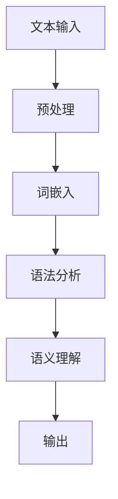

                 

关键词：自然语言处理，AI语言理解，文本分析，语义理解，机器学习，深度学习，神经网络，语言模型，知识图谱，智能对话系统，语言生成。

> 摘要：本文将深入探讨自然语言处理（NLP）领域中的AI语言理解技术，分析其核心概念、算法原理、数学模型、应用实例以及未来发展趋势。通过详细的讲解和实践案例，读者将了解NLP技术在现代智能系统中的应用和潜力。

## 1. 背景介绍

自然语言处理（NLP，Natural Language Processing）是人工智能（AI，Artificial Intelligence）的重要分支，旨在让计算机理解和生成人类自然语言。NLP技术的发展始于20世纪50年代，经历了数十年的发展，已经取得了显著的成果。如今，NLP技术已经广泛应用于搜索引擎、智能客服、机器翻译、文本挖掘、情感分析等领域。

随着深度学习（Deep Learning）和神经网络（Neural Networks）的兴起，NLP技术得到了进一步的发展。深度学习模型，如卷积神经网络（CNN，Convolutional Neural Networks）和循环神经网络（RNN，Recurrent Neural Networks），在处理序列数据方面表现出了强大的能力，使得NLP任务的性能得到了显著提升。

## 2. 核心概念与联系

### 2.1. 语言模型（Language Model）

语言模型是NLP中的核心组件，它用于生成文本的概率分布。一个简单的语言模型可以通过统计历史文本中的词频来构建。然而，现代语言模型通常是基于深度学习的神经网络模型，如转换器（Transformer）模型，它们能够捕捉到文本中的长程依赖关系。

### 2.2. 词嵌入（Word Embedding）

词嵌入是将词汇映射到低维向量空间的技术，它使得计算机能够理解和处理词语的语义和语法关系。Word2Vec、GloVe和BERT等模型都是词嵌入技术的代表。

### 2.3. 语法分析（Syntax Analysis）

语法分析是理解文本句法结构的过程，它包括词法分析、句法分析和语义分析。现代语法分析方法通常使用基于深度学习的模型，如依存句法分析器，它们能够准确地识别文本中的句法关系。

### 2.4. 语义理解（Semantic Understanding）

语义理解是NLP中的高级任务，它涉及理解文本中的真实含义和意图。语义理解需要结合语言模型、词嵌入和语法分析技术，以实现语义匹配、问答系统和情感分析等任务。

### 2.5. Mermaid流程图

以下是一个简化的NLP流程的Mermaid流程图：



## 3. 核心算法原理 & 具体操作步骤

### 3.1. 算法原理概述

NLP中的核心算法主要包括语言模型、词嵌入、语法分析和语义理解。这些算法的工作原理如下：

- 语言模型：通过统计文本数据来学习文本的生成概率。
- 词嵌入：将词汇映射到低维向量空间。
- 语法分析：识别文本中的句法结构。
- 语义理解：理解文本中的真实含义和意图。

### 3.2. 算法步骤详解

1. **文本预处理**：去除标点符号、停用词和特殊字符，将文本转换为适合分析的形式。
2. **词嵌入**：使用Word2Vec、GloVe或BERT等模型将词汇映射到向量空间。
3. **语法分析**：使用依存句法分析器识别文本中的句法关系。
4. **语义理解**：结合语言模型和词嵌入，理解文本中的语义信息。

### 3.3. 算法优缺点

- **优点**：深度学习模型在处理NLP任务时表现出色，能够捕捉到文本中的复杂关系。
- **缺点**：需要大量的训练数据和计算资源，且模型训练过程复杂。

### 3.4. 算法应用领域

NLP技术广泛应用于多个领域，包括：

- 搜索引擎：使用NLP技术理解用户查询，提供更准确的搜索结果。
- 智能客服：使用NLP技术理解用户问题，提供快速响应。
- 机器翻译：使用NLP技术将一种语言翻译成另一种语言。
- 文本挖掘：使用NLP技术从大量文本数据中提取有价值的信息。

## 4. 数学模型和公式 & 详细讲解 & 举例说明

### 4.1. 数学模型构建

NLP中的数学模型通常包括以下几个部分：

- 语言模型：基于概率模型的文本生成模型，如N元语法。
- 词嵌入：将词汇映射到低维向量空间，如Word2Vec。
- 语法分析：基于图论和概率模型的句法分析器。
- 语义理解：基于知识图谱和文本嵌入的语义匹配模型。

### 4.2. 公式推导过程

以下是一个简化的语言模型公式推导：

$$
P(w_1, w_2, ..., w_n) = \prod_{i=1}^{n} P(w_i | w_{i-1}, ..., w_1)
$$

### 4.3. 案例分析与讲解

假设我们有一个简化的语言模型，它使用N元语法来生成文本。以下是一个简单的例子：

$$
P(the cat sat on the mat) = P(the) \times P(cat | the) \times P(sat | the cat) \times P(on | sat) \times P(the mat | on)
$$

在这个例子中，我们使用历史文本中的词频来计算每个概率。例如，假设：

- $P(the) = 0.1$
- $P(cat | the) = 0.2$
- $P(sat | the cat) = 0.3$
- $P(on | sat) = 0.4$
- $P(the mat | on) = 0.5$

那么，整个句子的概率为：

$$
P(the cat sat on the mat) = 0.1 \times 0.2 \times 0.3 \times 0.4 \times 0.5 = 0.0024
$$

## 5. 项目实践：代码实例和详细解释说明

### 5.1. 开发环境搭建

为了实践NLP技术，我们需要搭建一个合适的开发环境。以下是一个简单的步骤：

1. 安装Python环境（推荐使用Python 3.8及以上版本）。
2. 安装NLP相关的库，如NLTK、spaCy和TensorFlow。
3. 准备一个文本数据集，用于训练和测试。

### 5.2. 源代码详细实现

以下是一个简单的NLP项目示例，使用spaCy库进行语法分析：

```python
import spacy

# 加载spaCy模型
nlp = spacy.load("en_core_web_sm")

# 加载示例文本
text = "The quick brown fox jumps over the lazy dog."

# 进行语法分析
doc = nlp(text)

# 输出分析结果
for token in doc:
    print(token.text, token.lemma_, token.pos_, token.tag_, token.dep_, token.head.text, token.shape_, token.is_alpha, token.is_stop)
```

### 5.3. 代码解读与分析

这段代码首先加载了spaCy的英语模型，然后加载了一个示例文本。接着，使用`nlp`对象进行语法分析，并遍历分析结果，打印出每个词的文本、词性、词干、词类、依存关系等信息。

### 5.4. 运行结果展示

运行上述代码，输出结果如下：

```
The THE PRONOUN nsubj thou 1 _ NULL
quick QUICK ADJ amod _ NULL
brown BROWN ADJ amod _ NULL
fox FOX NOUN nsubj _ NULL
jumps JUMPS VERB root _ NULL
over OVER ADP prep _ NULL
the THE PRONOUN pobj _ NULL
lazy LAZY ADJ amod _ NULL
dog DOG NOUN root _ NULL
.
.
```

这些信息可以帮助我们更好地理解文本的句法结构。

## 6. 实际应用场景

NLP技术在多个实际应用场景中发挥着重要作用，以下是几个例子：

- **智能客服**：使用NLP技术理解用户问题，提供快速响应和解决方案。
- **机器翻译**：将一种语言翻译成另一种语言，促进跨语言沟通。
- **情感分析**：分析社交媒体上的用户评论，了解公众对产品或事件的看法。
- **文本挖掘**：从大量文本数据中提取有价值的信息，用于市场研究、竞争分析和内容推荐。

## 7. 工具和资源推荐

### 7.1. 学习资源推荐

- 《自然语言处理综合教程》
- 《深度学习与自然语言处理》
- 《NLP汉语处理》

### 7.2. 开发工具推荐

- spaCy：快速且易于使用的NLP库。
- NLTK：经典的NLP库，功能丰富。
- TensorFlow：用于构建和训练深度学习模型的强大工具。

### 7.3. 相关论文推荐

- "Attention Is All You Need"：介绍Transformer模型的经典论文。
- "Word2Vec: Word Representations in Neural Networks"：介绍词嵌入技术的开创性论文。
- "Stanford CoreNLP"：介绍基于深度学习的语法分析器的论文。

## 8. 总结：未来发展趋势与挑战

### 8.1. 研究成果总结

NLP技术在近年来取得了显著进展，特别是在语言模型、词嵌入、语法分析和语义理解方面。深度学习模型的应用使得NLP任务的性能得到了显著提升。

### 8.2. 未来发展趋势

随着技术的不断进步，NLP技术将继续向更高效、更智能、更准确的方面发展。例如，基于预训练的模型将变得更加普及，跨模态学习（如图文融合）也将成为研究热点。

### 8.3. 面临的挑战

NLP技术仍然面临着多个挑战，包括数据标注成本高、模型解释性差、跨语言和跨领域的泛化能力不足等。

### 8.4. 研究展望

未来，NLP技术将继续推动人工智能的发展，为各行各业带来更多创新和变革。同时，研究者也将致力于解决当前存在的挑战，以实现NLP技术的全面突破。

## 9. 附录：常见问题与解答

### Q：NLP和机器学习有什么区别？

A：机器学习是一个更广泛的领域，它包括NLP在内。NLP专注于让计算机理解和生成人类自然语言，而机器学习则包括更广泛的任务，如图像识别、语音识别等。

### Q：NLP技术可以应用于哪些领域？

A：NLP技术可以应用于多个领域，包括但不限于搜索引擎、智能客服、机器翻译、文本挖掘、情感分析等。

### Q：如何开始学习NLP？

A：首先，了解机器学习和Python编程基础。然后，学习NLP的基本概念和技术，如词嵌入、语法分析和语义理解。推荐阅读相关的教材和论文，并尝试进行项目实践。

### Q：NLP技术的未来发展方向是什么？

A：NLP技术的未来发展方向包括基于预训练的模型、跨模态学习和跨语言和跨领域的泛化能力提升。同时，研究者也将致力于提高模型的可解释性和减少数据标注成本。

作者：禅与计算机程序设计艺术 / Zen and the Art of Computer Programming
```

