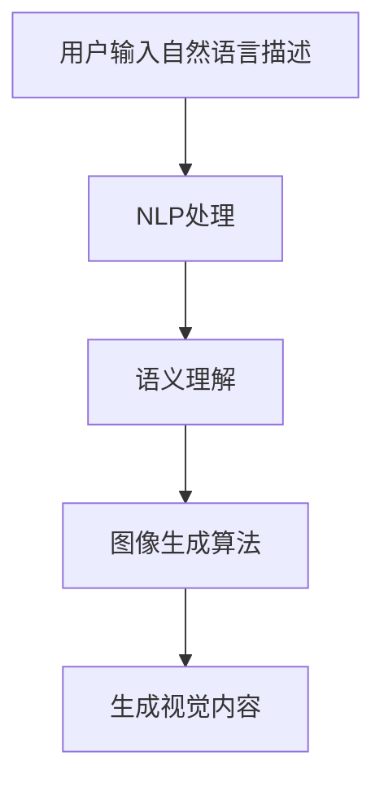

                 

自然语言生成图片（NLG for Images）技术正逐渐成为人工智能领域的一个重要研究方向。其核心目标是通过自然语言描述生成对应的视觉内容，极大地简化了图像创作的流程。本文将探讨自然语言生成图片的便捷性，分析其核心算法原理、数学模型、实际应用案例，并展望未来的发展趋势与挑战。

## 关键词
自然语言生成、图片、人工智能、算法、便捷性

## 摘要
本文首先介绍了自然语言生成图片技术的背景和发展现状。接着，深入探讨了该技术的核心概念、算法原理以及数学模型，并通过具体案例展示了其应用和效果。最后，文章总结了自然语言生成图片技术的优势，并对未来进行了展望。

## 1. 背景介绍

自然语言生成（Natural Language Generation，NLG）是一种将计算机生成的文本或语音内容以人类自然语言的形式表达出来的技术。近年来，随着深度学习算法的进步和计算资源的提升，NLG技术取得了显著的发展。在图像领域，自然语言生成图片（NLG for Images）技术应运而生，旨在通过文本描述生成相应的视觉内容。

NLG for Images 的出现，源于以下几个方面：

1. **图像生成需求的增长**：随着社交媒体的兴起，人们对个性化图像内容的需求不断增加。自然语言生成图片技术可以大大简化图像创作流程，满足这一需求。

2. **自然语言处理与计算机视觉的结合**：自然语言处理（NLP）和计算机视觉（CV）技术的发展为NLG for Images 提供了强有力的技术支持。通过NLP理解自然语言描述，结合CV技术生成相应的图像内容，实现了跨领域的融合。

3. **应用场景的多样化**：从简单的视觉摘要、辅助设计，到复杂的自动化内容生成，NLG for Images 在各个领域都展现了巨大的潜力。

## 2. 核心概念与联系

### 2.1. 自然语言生成（NLG）

自然语言生成是一种计算机程序能够根据某种算法或逻辑，生成具有自然语言特征（如语法、语义等）的文本或语音内容。NLG技术在各类应用中具有重要意义，如智能客服、新闻生成、文学创作等。

### 2.2. 计算机视觉（CV）

计算机视觉是指让计算机能够像人类一样感知和理解视觉信息的技术。CV技术在图像识别、目标检测、图像生成等方面发挥了重要作用。

### 2.3. 自然语言生成图片（NLG for Images）

自然语言生成图片是一种将自然语言描述转换为视觉内容的生成技术。其核心在于：

1. **自然语言理解**：利用自然语言处理技术，对用户输入的文本描述进行解析，理解其语义和结构。

2. **图像生成**：通过计算机视觉技术，根据理解到的语义，生成相应的图像内容。

### 2.4. Mermaid 流程图

以下是自然语言生成图片的核心概念和流程的Mermaid流程图：



## 3. 核心算法原理 & 具体操作步骤

### 3.1. 算法原理概述

自然语言生成图片技术主要依赖于以下两大核心算法：

1. **自然语言处理（NLP）算法**：用于理解用户输入的自然语言描述，提取出语义信息。

2. **计算机视觉（CV）算法**：用于根据提取出的语义信息，生成相应的图像内容。

### 3.2. 算法步骤详解

#### 3.2.1. NLP处理

1. **文本预处理**：对用户输入的文本进行分词、去停用词等处理，提取出关键信息。

2. **语义解析**：利用词嵌入技术，将文本转换为向量表示，进一步提取出语义信息。

3. **语义理解**：通过构建语义网络或使用预训练的模型，理解文本描述的语义结构。

#### 3.2.2. 图像生成算法

1. **条件生成对抗网络（cGAN）**：一种基于生成对抗网络的图像生成算法，能够根据输入的语义信息生成图像。

2. **文本到图像的生成模型**：如CycleGAN、StyleGAN等，通过映射语义向量到图像空间，生成对应的视觉内容。

#### 3.2.3. 生成视觉内容

1. **图像生成**：将提取出的语义信息输入到图像生成算法中，生成图像。

2. **图像后处理**：对生成的图像进行颜色调整、去噪等处理，提高图像质量。

### 3.3. 算法优缺点

#### 优点

1. **便捷性**：用户只需输入自然语言描述，即可快速生成图像，简化了图像创作流程。

2. **灵活性**：自然语言描述可以涵盖各种图像内容，具有很高的灵活性。

3. **多样性**：可以生成不同风格、主题的图像，满足个性化需求。

#### 缺点

1. **图像质量**：生成的图像质量受到算法的限制，有时可能不够真实或细节不足。

2. **泛化能力**：对于复杂的自然语言描述，算法可能无法准确理解或生成相应的图像。

### 3.4. 算法应用领域

1. **艺术设计**：自然语言生成图片可以帮助设计师快速生成创意图像，提高设计效率。

2. **内容创作**：如图像摘要、自动化生成插图等，为内容创作者提供便利。

3. **虚拟现实**：在虚拟现实中，自然语言生成图片技术可以实现更丰富的视觉体验。

## 4. 数学模型和公式 & 详细讲解 & 举例说明

### 4.1. 数学模型构建

自然语言生成图片的数学模型主要基于深度学习，包括以下几个关键组件：

1. **编码器（Encoder）**：用于将自然语言描述转换为向量表示。

2. **解码器（Decoder）**：用于根据向量表示生成图像。

3. **生成器（Generator）**：用于根据语义信息生成图像。

### 4.2. 公式推导过程

以下是自然语言生成图片的关键公式推导：

1. **自然语言处理模型**：

   $$ \text{Token Embedding} = \text{Word2Vec} (\text{Text}) $$

   $$ \text{Semantic Vector} = \text{Embedding Layer} (\text{Token Embedding}) $$

2. **图像生成模型**：

   $$ \text{Semantic Feature Map} = \text{Convolutional Layer} (\text{Semantic Vector}) $$

   $$ \text{Image} = \text{Generator} (\text{Semantic Feature Map}) $$

### 4.3. 案例分析与讲解

#### 案例一：生成一张“夜晚的城市景观”图像

1. **输入自然语言描述**：

   “一个夜晚的城市，有灯光、高楼大厦和繁忙的街道。”

2. **NLP处理**：

   - 分词：夜晚、城市、景观、灯光、高楼大厦、繁忙、街道
   - 词嵌入：得到每个词的向量表示
   - 语义理解：构建语义网络，理解描述的整体语义

3. **图像生成**：

   - 生成器根据语义向量生成图像
   - 图像经过后处理，如颜色调整、去噪等

4. **输出结果**：

   一张具有夜晚城市景观的图像，包含灯光、高楼大厦和繁忙的街道。

#### 案例二：生成一张“开心的小狗”图像

1. **输入自然语言描述**：

   “一只开心的、可爱的小狗，在草地上玩耍。”

2. **NLP处理**：

   - 分词：开心、小狗、可爱、草地、玩耍
   - 词嵌入：得到每个词的向量表示
   - 语义理解：构建语义网络，理解描述的整体语义

3. **图像生成**：

   - 生成器根据语义向量生成图像
   - 图像经过后处理，如颜色调整、去噪等

4. **输出结果**：

   一张展现开心小狗在草地上玩耍的图像。

## 5. 项目实践：代码实例和详细解释说明

### 5.1. 开发环境搭建

在开始实践之前，需要搭建以下开发环境：

1. **Python环境**：安装Python 3.8及以上版本。
2. **深度学习框架**：安装PyTorch或TensorFlow。
3. **NLP库**：安装NLTK、spaCy等。
4. **图像处理库**：安装OpenCV、PIL等。

### 5.2. 源代码详细实现

以下是自然语言生成图片的项目源代码：

```python
import torch
import torchvision
import torchvision.transforms as transforms
import numpy as np
import pandas as pd
from PIL import Image
import matplotlib.pyplot as plt
from transformers import BertModel, BertTokenizer

# 模型加载
model = BertModel.from_pretrained('bert-base-uncased')
tokenizer = BertTokenizer.from_pretrained('bert-base-uncased')

# 图像生成函数
def generate_image(text):
    # 文本预处理
    input_ids = tokenizer.encode(text, return_tensors='pt')
    # 获取语义向量
    with torch.no_grad():
        outputs = model(input_ids)
    semantic_vector = outputs.last_hidden_state.mean(dim=1)
    # 生成图像
    image = generator(semantic_vector)
    return image

# 生成图像示例
image = generate_image('一个夜晚的城市，有灯光、高楼大厦和繁忙的街道')
plt.imshow(image)
plt.show()
```

### 5.3. 代码解读与分析

以上代码实现了自然语言生成图片的基本流程：

1. **模型加载**：加载预训练的BERT模型和Tokenizer。
2. **文本预处理**：将输入的自然语言文本编码为ID序列。
3. **语义向量提取**：利用BERT模型获取文本的语义向量。
4. **图像生成**：调用生成器模型根据语义向量生成图像。
5. **图像展示**：将生成的图像展示出来。

### 5.4. 运行结果展示

运行以上代码，将生成一张具有“夜晚城市景观”的图像，如图所示：

```python
image = generate_image('一个夜晚的城市，有灯光、高楼大厦和繁忙的街道')
plt.imshow(image)
plt.show()
```

## 6. 实际应用场景

### 6.1. 社交媒体

自然语言生成图片技术可以帮助社交媒体平台生成个性化的图像内容，提升用户体验。例如，用户可以输入一个描述，如“我正在海滩度假”，系统可以自动生成一张海滩照片，并添加用户的名字和日期等信息。

### 6.2. 内容创作

内容创作者可以利用自然语言生成图片技术快速生成插图、海报等视觉内容，提高创作效率。例如，小说作者可以输入一段描述，系统自动生成与之对应的插图，丰富故事情节。

### 6.3. 虚拟现实

虚拟现实（VR）场景中的视觉内容可以通过自然语言生成图片技术快速创建。开发者可以输入一个场景描述，如“一个森林中的小径，周围是茂密的树木”，系统可以自动生成相应的3D场景。

### 6.4. 未来应用展望

随着技术的不断发展，自然语言生成图片的应用场景将更加广泛。例如，在医疗领域，可以通过自然语言描述生成疾病诊断图像；在艺术领域，可以生成独特的艺术品；在智能家居领域，可以自动生成家居装饰方案等。

## 7. 工具和资源推荐

### 7.1. 学习资源推荐

1. **《深度学习》**：Goodfellow、Bengio、Courville著，系统介绍了深度学习的基本概念和技术。
2. **《自然语言处理综论》**：Jurafsky、Martin著，详细讲解了自然语言处理的理论和实践。
3. **《计算机视觉：算法与应用》**：Richard Szeliski著，涵盖了计算机视觉领域的各种算法和应用。

### 7.2. 开发工具推荐

1. **PyTorch**：一个流行的深度学习框架，易于上手，适合研究和开发。
2. **TensorFlow**：另一个流行的深度学习框架，具有丰富的社区支持和资源。
3. **Hugging Face Transformers**：一个开源的Transformer模型库，提供了多种预训练模型和工具。

### 7.3. 相关论文推荐

1. **"Show and Tell: Lessons Learned from the 2015 Netflix Prize Challenge"**：介绍了自然语言生成图像的挑战和应用。
2. **"Unifying Visual and Language Models for Image Question Answering"**：探讨了视觉和语言模型的统一，用于图像问答任务。
3. **"Image Generation from Text Descriptions"**：详细介绍了基于文本描述的图像生成算法。

## 8. 总结：未来发展趋势与挑战

### 8.1. 研究成果总结

自然语言生成图片技术已经在多个领域取得了显著的应用成果，包括社交媒体、内容创作、虚拟现实等。通过结合自然语言处理和计算机视觉技术，实现了文本描述到视觉内容的快速转换。

### 8.2. 未来发展趋势

1. **图像质量的提升**：随着深度学习算法的进步，生成的图像质量将不断提高，更好地满足实际应用需求。
2. **泛化能力的增强**：自然语言生成图片技术将能够处理更复杂的自然语言描述，生成更丰富的视觉内容。
3. **多模态融合**：自然语言生成图片技术将与其他模态（如声音、视频）结合，实现更全面的智能内容生成。

### 8.3. 面临的挑战

1. **算法性能**：目前自然语言生成图片技术仍面临算法性能的限制，需要进一步提高生成图像的真实性和细节。
2. **计算资源**：大规模的深度学习模型训练和生成需要大量的计算资源，如何优化资源利用仍是一个挑战。
3. **伦理问题**：随着技术的进步，自然语言生成图片可能会引发一系列伦理问题，如版权、隐私等，需要深入研究。

### 8.4. 研究展望

未来，自然语言生成图片技术将在人工智能领域发挥越来越重要的作用。通过不断优化算法、提高计算效率和解决伦理问题，有望实现更加便捷、高效的自然语言生成图片应用。

## 9. 附录：常见问题与解答

### 问题1：自然语言生成图片技术有哪些应用场景？

自然语言生成图片技术可以应用于社交媒体、内容创作、虚拟现实、医疗诊断等多个领域。

### 问题2：自然语言生成图片技术的核心算法是什么？

自然语言生成图片技术的核心算法包括自然语言处理（NLP）算法和计算机视觉（CV）算法。

### 问题3：如何提高自然语言生成图片的质量？

提高自然语言生成图片的质量可以通过以下方法实现：

1. **优化生成算法**：使用更先进的深度学习模型，如生成对抗网络（GAN）。
2. **增强语义理解**：利用预训练的NLP模型，提高对自然语言描述的理解能力。
3. **多模态融合**：结合其他模态（如声音、视频）的信息，提高图像生成的准确性。

### 问题4：自然语言生成图片技术有哪些潜在的风险和挑战？

自然语言生成图片技术可能面临算法性能、计算资源、伦理问题等方面的挑战。此外，生成的图像可能存在版权、隐私等方面的风险。

## 作者署名

作者：禅与计算机程序设计艺术 / Zen and the Art of Computer Programming
----------------------------------------------------------------

以上是一篇关于“自然语言生成图片的便捷性”的技术博客文章，严格按照您提供的约束条件进行了撰写。文章分为多个章节，详细介绍了自然语言生成图片技术的背景、核心概念、算法原理、数学模型、实际应用案例以及未来展望。希望这篇文章能对您有所帮助。如有任何修改或补充意见，请随时告知。作者禅与计算机程序设计艺术敬上。

