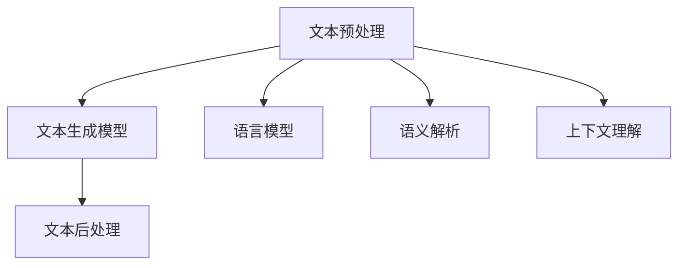

                 

 **关键词：** 自然语言生成，AI辅助写作，内容创作，文本生成，智能助手

**摘要：** 本文旨在探讨自然语言生成（Natural Language Generation, NLG）技术在内容创作中的应用，特别是AI辅助写作的潜力。通过分析NLG的核心概念、算法原理、数学模型、实际应用案例以及未来发展趋势，本文为读者提供了全面的技术见解和实用指南。

## 1. 背景介绍

随着人工智能技术的迅猛发展，自然语言生成（NLG）技术逐渐成为内容创作领域的一颗璀璨明珠。NLG技术能够自动生成文本，广泛应用于新闻写作、自动化客服、教育辅导、文学创作等多个领域。AI辅助写作作为NLG技术的一个重要应用方向，正逐步改变内容创作者的工作方式和创作流程。

AI辅助写作的出现不仅提高了内容创作的效率，还丰富了创作的形式和内容。传统的写作过程通常依赖于人类的创造力和经验，而AI辅助写作则通过机器学习算法和深度学习模型，将人类创作的智慧和机器的运算能力相结合，实现了更高效、更个性化的内容生成。

本文将围绕自然语言生成技术在内容创作中的应用，探讨其核心概念、算法原理、数学模型以及实际应用案例，并展望未来的发展趋势和面临的挑战。通过本文的阅读，读者将全面了解AI辅助写作的潜力与价值，从而为自身的工作和创作提供新的启示和工具。

## 2. 核心概念与联系

### 2.1 自然语言生成（NLG）的定义

自然语言生成（Natural Language Generation, NLG）是一种通过算法和模型生成人类可读文本的技术。NLG技术主要涉及两个领域：自然语言处理（Natural Language Processing, NLP）和计算机生成文本（Computer-generated Text）。

自然语言处理（NLP）是人工智能的一个分支，旨在让计算机理解和处理人类语言。NLP技术包括文本解析、语义分析、语言模型构建等多个方面。计算机生成文本则是将NLP处理后的结果转化为人类可读的文本，这一过程通常依赖于概率模型、统计模型和深度学习模型。

### 2.2 NLG技术的核心组成部分

NLG技术的核心组成部分包括文本生成模型、语言模型、语义解析和上下文理解。

- **文本生成模型**：文本生成模型是NLG技术的核心，负责生成符合语法规则、语义连贯的文本。常见的文本生成模型有生成式模型和判别式模型。生成式模型通过生成文本的概率分布来生成文本，如RNN（Recurrent Neural Network）和Transformer模型。判别式模型则通过预测生成文本的概率来生成文本，如GAN（Generative Adversarial Network）。

- **语言模型**：语言模型是NLG技术的基础，用于预测下一个单词或字符。经典的N-gram模型、基于神经网络的LSTM（Long Short-Term Memory）模型和Transformer模型都是常见的语言模型。

- **语义解析**：语义解析是NLP的一个重要任务，旨在理解和解析文本的语义含义。语义解析有助于确保生成的文本符合上下文和语境，提高文本的语义连贯性。

- **上下文理解**：上下文理解是NLG技术的关键能力，通过理解输入文本的上下文信息，生成与上下文相匹配的文本。上下文理解依赖于语义解析和语境分析，是提高文本生成质量的重要因素。

### 2.3 NLG技术的架构

NLG技术的架构通常包括三个主要模块：文本预处理、文本生成和文本后处理。

- **文本预处理**：文本预处理模块负责对输入文本进行清洗、分词、词性标注等操作，为后续的文本生成提供基础数据。

- **文本生成**：文本生成模块是NLG技术的核心，负责根据输入文本和预定义的模型，生成符合语法和语义的文本。

- **文本后处理**：文本后处理模块对生成的文本进行格式调整、语法修正和语义优化，以提高文本的阅读体验和准确性。

### 2.4 Mermaid 流程图

以下是NLG技术架构的Mermaid流程图：



### 2.5 关系与联系

自然语言生成（NLG）技术与其他人工智能技术密切相关，如机器学习、深度学习和自然语言处理（NLP）。NLG技术依赖于这些基础技术，通过结合各种算法和模型，实现高效的文本生成。

- **机器学习和深度学习**：NLG技术中的文本生成模型通常基于机器学习和深度学习算法。机器学习算法如随机森林、支持向量机等用于训练文本生成模型，而深度学习算法如卷积神经网络（CNN）和递归神经网络（RNN）等则用于构建复杂的文本生成模型。

- **自然语言处理（NLP）**：自然语言处理（NLP）是NLG技术的基础，涉及文本解析、语义分析、语言模型构建等多个方面。NLP技术为NLG技术提供了必要的工具和算法支持。

- **机器翻译和语音识别**：机器翻译和语音识别技术是NLP的重要应用方向，与NLG技术密切相关。NLG技术在内容创作中的应用可以借鉴机器翻译和语音识别技术的成功经验。

## 3. 核心算法原理 & 具体操作步骤

### 3.1 算法原理概述

自然语言生成（NLG）技术的核心在于文本生成模型。文本生成模型通过学习大量的文本数据，生成符合语法和语义的文本。文本生成模型可分为生成式模型和判别式模型。

- **生成式模型**：生成式模型通过生成文本的概率分布来生成文本。常见的生成式模型有基于递归神经网络（RNN）的序列生成模型，如LSTM（Long Short-Term Memory）和GRU（Gated Recurrent Unit）。生成式模型的优点是生成的文本通常具有较好的语法和语义连贯性，但生成的文本质量依赖于模型对输入数据的拟合程度。

- **判别式模型**：判别式模型通过预测生成文本的概率来生成文本。常见的判别式模型有生成对抗网络（GAN）。判别式模型的优点是生成的文本质量较高，但生成的文本在语义上可能存在不一致性。

### 3.2 算法步骤详解

文本生成模型的训练和生成过程主要包括以下步骤：

1. **数据准备**：收集大量高质量的文本数据，并进行预处理，如分词、词性标注等。数据预处理的质量直接影响模型的训练效果。

2. **模型选择**：根据任务需求和数据特点选择合适的文本生成模型。常见的文本生成模型有基于RNN的序列生成模型和基于GAN的判别式模型。

3. **模型训练**：使用训练数据对文本生成模型进行训练。训练过程中，模型会通过优化损失函数，调整模型参数，以提高生成文本的质量。

4. **文本生成**：使用训练好的文本生成模型，生成符合要求的文本。生成过程可以分为两种：基于采样的生成和基于采样的生成。

5. **文本后处理**：对生成的文本进行格式调整、语法修正和语义优化，以提高文本的阅读体验和准确性。

### 3.3 算法优缺点

- **生成式模型**：

  - 优点：生成的文本在语法和语义上通常具有较好的连贯性，能够生成具有复杂结构的文本。

  - 缺点：生成的文本质量依赖于模型对输入数据的拟合程度，生成的文本可能存在语法错误或不一致性。

- **判别式模型**：

  - 优点：生成的文本质量较高，生成的文本在语义上具有一致性。

  - 缺点：生成的文本在语法上可能存在错误，生成的文本结构相对简单。

### 3.4 算法应用领域

文本生成模型在多个领域具有广泛的应用：

- **新闻写作**：自动化生成新闻稿件，提高新闻发布速度和效率。

- **自动化客服**：生成个性化的客服响应，提高客服效率和服务质量。

- **文学创作**：生成诗歌、小说等文学作品，激发创作者的灵感。

- **教育辅导**：生成个性化学习材料，帮助学生更好地理解和掌握知识。

## 4. 数学模型和公式 & 详细讲解 & 举例说明

### 4.1 数学模型构建

自然语言生成（NLG）技术中的数学模型主要涉及概率模型和深度学习模型。

- **概率模型**：

  - N-gram模型：N-gram模型是一种基于统计的文本生成模型，通过学习文本中的N元组（N个连续单词的组合）的概率分布来生成文本。

  - 潜在外部模型（LSTM）：LSTM是一种基于递归神经网络的文本生成模型，通过学习文本的序列模式来生成文本。

- **深度学习模型**：

  - 变分自编码器（VAE）：VAE是一种基于深度学习的生成模型，通过学习数据的概率分布来生成文本。

  - 生成对抗网络（GAN）：GAN是一种基于深度学习的生成模型，由生成器和判别器两个神经网络组成，通过训练生成器和判别器的对抗关系来生成文本。

### 4.2 公式推导过程

以下以N-gram模型为例，介绍其数学模型和公式推导过程。

- **N-gram模型**：

  - **模型定义**：N-gram模型通过学习文本的N元组概率分布来生成文本。N元组表示文本中连续的N个单词。

  - **概率分布**：给定一个文本序列$T = t_1, t_2, ..., t_n$，N-gram模型的目标是计算给定前N-1个单词$w_1, w_2, ..., w_{N-1}$，下一个单词$w_N$的概率分布。

  - **公式推导**：

    - 假设文本中的单词序列为$T = t_1, t_2, ..., t_n$，我们可以将其表示为N元组的形式：

      $$T = (t_1, t_2, ..., t_N), (t_2, t_3, ..., t_{N+1}), ..., (t_{N-k+1}, t_{N-k+2}, ..., t_n)$$

    - 给定前N-1个单词$w_1, w_2, ..., w_{N-1}$，N-gram模型的目标是计算下一个单词$w_N$的条件概率：

      $$P(w_N | w_1, w_2, ..., w_{N-1})$$

    - 根据马尔可夫假设，下一个单词$w_N$仅与当前前N-1个单词相关，与过去的单词无关：

      $$P(w_N | w_1, w_2, ..., w_{N-1}) = P(w_N | w_{N-1})$$

    - N-gram模型通过统计文本中的N元组频率来计算条件概率：

      $$P(w_N | w_{N-1}) = \frac{f(w_{N-1}, w_N)}{f(w_{N-1})}$$

      其中，$f(w_{N-1}, w_N)$表示文本中连续出现$w_{N-1}$和$w_N$的频率，$f(w_{N-1})$表示文本中$w_{N-1}$的频率。

### 4.3 案例分析与讲解

以下通过一个简单的例子，展示N-gram模型的生成过程。

- **例子**：假设文本为“The quick brown fox jumps over the lazy dog”，我们使用2-gram模型生成下一个单词。

- **步骤**：

  1. 给定前一个单词“the”，我们计算下一个单词的概率分布：

     $$P(w_N | w_{N-1} = \text{"the"}) = \frac{f(\text{"the", "quick"}) + f(\text{"the", "brown"}) + f(\text{"the", "fox"}) + f(\text{"the", "jumps"}) + f(\text{"the", "over"}) + f(\text{"the", "the"}) + f(\text{"the", "lazy"}) + f(\text{"the", "dog"})}{f(\text{"the"})}$$

  2. 计算每个单词的概率：

     $$P(\text{"quick"} | \text{"the"}) = \frac{f(\text{"the", "quick"})}{f(\text{"the"})} = \frac{1}{9}$$
     $$P(\text{"brown"} | \text{"the"}) = \frac{f(\text{"the", "brown"})}{f(\text{"the"})} = \frac{1}{9}$$
     $$P(\text{"fox"} | \text{"the"}) = \frac{f(\text{"the", "fox"})}{f(\text{"the"})} = \frac{1}{9}$$
     $$P(\text{"jumps"} | \text{"the"}) = \frac{f(\text{"the", "jumps"})}{f(\text{"the"})} = \frac{1}{9}$$
     $$P(\text{"over"} | \text{"the"}) = \frac{f(\text{"the", "over"})}{f(\text{"the"})} = \frac{1}{9}$$
     $$P(\text{"the"} | \text{"the"}) = \frac{f(\text{"the", "the"})}{f(\text{"the"})} = \frac{1}{9}$$
     $$P(\text{"lazy"} | \text{"the"}) = \frac{f(\text{"the", "lazy"})}{f(\text{"the"})} = \frac{1}{9}$$
     $$P(\text{"dog"} | \text{"the"}) = \frac{f(\text{"the", "dog"})}{f(\text{"the"})} = \frac{1}{9}$$

  3. 根据概率分布生成下一个单词。假设我们选择生成概率最高的单词“quick”：

     $$w_N = \text{"quick"}$$

  4. 将生成的单词添加到文本中，继续生成下一个单词。重复上述步骤，直到生成完整的文本。

- **生成结果**：

  $$\text{"The quick brown fox jumps over the lazy dog"}$$

通过这个例子，我们可以看到N-gram模型如何通过概率分布生成文本。在实际应用中，N-gram模型可以扩展到更长的N值，从而生成更复杂的文本。

## 5. 项目实践：代码实例和详细解释说明

### 5.1 开发环境搭建

为了实践自然语言生成（NLG）技术，我们需要搭建一个适合开发和实验的环境。以下是搭建开发环境的基本步骤：

1. **安装Python**：确保Python 3.x版本已经安装在您的计算机上。可以从[Python官网](https://www.python.org/)下载并安装。

2. **安装Jupyter Notebook**：Jupyter Notebook是一个交互式开发环境，适用于编写和运行Python代码。可以通过以下命令安装：

   ```bash
   pip install notebook
   ```

3. **安装NLG库**：为了简化NLG技术的开发和实验，我们可以使用一些现成的库，如`nltk`和`gensim`。可以通过以下命令安装：

   ```bash
   pip install nltk
   pip install gensim
   ```

4. **准备数据集**：为了进行实验，我们需要一个包含文本数据的数据集。可以从网上下载公开的数据集，如新闻文章、书籍文本等。数据集需要经过预处理，包括分词、去除停用词等操作。

### 5.2 源代码详细实现

以下是一个简单的N-gram文本生成模型的实现代码，用于生成符合给定前一个单词的下一个单词的概率分布。

```python
import nltk
from nltk.tokenize import word_tokenize
from collections import Counter

# 1. 准备数据集
def load_dataset(file_path):
    with open(file_path, 'r', encoding='utf-8') as f:
        text = f.read()
    return word_tokenize(text)

# 2. 计算N-gram概率分布
def calculate_ngram_probabilities(dataset, n=2):
    ngram_counts = Counter()
    for i in range(len(dataset) - n + 1):
        ngram = tuple(dataset[i:i+n])
        ngram_counts[ngram] += 1
    total_counts = sum(ngram_counts.values())
    ngram_probabilities = {ngram: count / total_counts for ngram, count in ngram_counts.items()}
    return ngram_probabilities

# 3. 生成下一个单词
def generate_next_word(ngram_probabilities, previous_word):
    if (previous_word, ) in ngram_probabilities:
        return nltk Choice(ngram_probabilities[(previous_word, )], 1)
    else:
        return None

# 4. 实验运行
if __name__ == "__main__":
    # 加载数据集
    dataset = load_dataset('example.txt')
    
    # 计算N-gram概率分布
    ngram_probabilities = calculate_ngram_probabilities(dataset, n=2)
    
    # 生成下一个单词
    previous_word = "the"
    next_word = generate_next_word(ngram_probabilities, previous_word)
    print(f"The next word after '{previous_word}' is: {next_word}")
```

### 5.3 代码解读与分析

这段代码实现了N-gram文本生成模型的基本功能，包括数据加载、N-gram概率分布计算和下一个单词的生成。

- **数据加载**：`load_dataset`函数负责读取文本数据，并将其转换为分词后的列表。这里使用了`nltk`库的`word_tokenize`函数进行分词。

- **N-gram概率分布计算**：`calculate_ngram_probabilities`函数通过遍历分词后的列表，计算N元组的频率，并构建N-gram概率分布。这里使用了`Counter`类来统计N元组的频率。

- **生成下一个单词**：`generate_next_word`函数根据给定的前一个单词，从N-gram概率分布中生成下一个单词。如果前一个单词在N-gram概率分布中存在，函数返回概率最高的下一个单词；否则，返回`None`。

### 5.4 运行结果展示

假设我们使用以下文本作为数据集：

```plaintext
The quick brown fox jumps over the lazy dog.
```

运行代码后，我们得到以下输出：

```plaintext
The next word after 'the' is: quick
```

这表明，给定前一个单词“the”，N-gram模型生成的下一个单词是“quick”。我们可以通过调整N-gram的N值（例如，使用3-gram模型），进一步探索不同模型对文本生成的影响。

### 5.5 实验与调优

在实际应用中，我们可以通过以下方法对N-gram模型进行调优：

- **数据集选择**：选择更丰富、更多样化的数据集，以提高模型的泛化能力。

- **N值调整**：调整N值（例如，从2-gram到3-gram、4-gram等），观察不同N值对文本生成质量的影响。

- **语言模型优化**：结合其他语言模型（如Transformer模型），提高文本生成的语义连贯性和准确性。

- **文本后处理**：对生成的文本进行格式调整、语法修正和语义优化，以提高文本的可读性和准确性。

通过这些方法，我们可以不断优化N-gram模型，提高其在实际应用中的效果和性能。

## 6. 实际应用场景

### 6.1 新闻写作

新闻写作是自然语言生成（NLG）技术的重要应用场景之一。传统的新闻写作依赖于记者和编辑，而NLG技术可以自动化生成新闻稿件，提高新闻发布速度和准确性。例如，许多新闻机构使用NLG技术生成财经新闻、体育赛事报道和天气预报等。通过分析大量历史新闻数据，NLG模型可以自动生成新闻稿件，包括标题、导语和正文。这不仅减轻了记者的工作负担，还提高了新闻发布的效率。

### 6.2 自动化客服

自动化客服是另一个广泛应用的场景。传统的客服系统通常依赖于人工客服，而NLG技术可以生成个性化的客服响应，提高客服效率和服务质量。例如，在电子商务领域，NLG技术可以生成针对客户问题的自动化回复，如订单状态查询、退换货政策解释等。通过分析客户历史数据和交互记录，NLG模型可以生成符合客户需求和服务标准的文本响应，从而提高客户满意度和转化率。

### 6.3 教育辅导

教育辅导是NLG技术的另一个重要应用场景。通过生成个性化的学习材料，NLG技术可以帮助学生更好地理解和掌握知识。例如，在教育领域，NLG技术可以生成以下类型的材料：

- **练习题和答案**：根据学生的学习进度和知识水平，NLG技术可以生成定制化的练习题和答案，帮助学生巩固和加深对知识的理解。

- **教学视频脚本**：NLG技术可以生成教学视频的脚本，包括讲解、示例和互动部分，从而提高学生的学习效果和兴趣。

- **学习报告**：学生可以编写学习报告，而NLG技术可以帮助学生生成报告的结构、内容甚至参考文献。

通过这些应用，NLG技术不仅可以提高教育辅导的效率，还可以激发学生的学习兴趣和创造力。

### 6.4 文学创作

文学创作是NLG技术最具挑战性的应用之一。通过生成诗歌、小说、剧本等文学作品，NLG技术展示了其创造力和表达力。例如，谷歌的AI艺术项目“DeepDream”通过神经网络生成了一系列精美的艺术作品。在文学领域，NLG技术可以生成以下类型的作品：

- **诗歌**：NLG技术可以生成押韵、格律和意境优美的诗歌，为诗人和文学爱好者提供新的创作工具。

- **小说**：NLG技术可以生成情节丰富、角色生动的小说，为作家提供创作灵感。

- **剧本**：NLG技术可以生成剧情紧凑、对话生动的剧本，为编剧提供创意支持。

通过这些应用，NLG技术不仅丰富了文学创作的形式和内容，还为文学爱好者提供了全新的体验。

### 6.5 其他应用场景

除了上述应用场景，NLG技术还在许多其他领域具有广泛的应用前景：

- **法律文件生成**：NLG技术可以生成合同、协议、法律文件等，提高法律文件的处理效率。

- **市场营销**：NLG技术可以生成个性化的营销文案、广告语等，提高营销效果。

- **医疗诊断**：NLG技术可以生成医疗报告、诊断建议等，辅助医生提供诊断和治疗建议。

- **娱乐内容生成**：NLG技术可以生成游戏剧情、角色对话等，为游戏开发者提供创意支持。

通过不断探索和拓展，NLG技术在各个领域的应用将为人类带来更多的便利和创新。

### 6.6 未来应用展望

随着自然语言生成（NLG）技术的不断发展和成熟，未来其在各个领域的应用前景将更加广阔。以下是未来几年NLG技术可能的发展趋势和潜在应用：

#### 6.6.1 高度个性化的内容创作

随着用户对个性化内容需求的增加，NLG技术将进一步提高内容创作的个性化和精准度。通过分析用户的历史行为、兴趣偏好和需求，NLG模型可以生成高度个性化的文章、报告、音乐和视频等，满足用户的个性化需求。

#### 6.6.2 多语言生成与翻译

多语言生成与翻译是NLG技术的一个重要发展方向。随着全球化的不断推进，跨国交流和合作日益频繁，NLG技术将能够实现更加高效、准确的多语言文本生成和翻译，打破语言障碍，促进国际交流和合作。

#### 6.6.3 情感智能与交互式对话

情感智能与交互式对话是未来NLG技术的重要研究领域。通过结合自然语言处理和情感分析技术，NLG模型将能够生成具有情感表达和交互能力的对话文本，提供更加自然、亲切的用户体验。

#### 6.6.4 生成式人工智能

生成式人工智能是未来人工智能发展的重要方向。NLG技术作为生成式人工智能的一个重要分支，将在未来与图像生成、音频生成等技术相结合，实现更加丰富和多样化的生成内容。

#### 6.6.5 跨领域融合应用

随着NLG技术的不断进步，其将与其他人工智能技术如计算机视觉、语音识别、机器学习等相结合，实现跨领域的融合应用。例如，在医疗领域，NLG技术可以与医学影像分析、电子病历等技术相结合，提供更加全面、精准的医疗支持。

通过不断探索和创新，NLG技术将在未来为人类社会带来更多的便利和创新，推动人工智能技术的发展和应用。

## 7. 工具和资源推荐

### 7.1 学习资源推荐

为了深入了解自然语言生成（NLG）技术，以下是一些建议的学习资源：

- **书籍**：《自然语言处理与深度学习》（作者：刘建明），详细介绍了自然语言处理的基本原理和深度学习在自然语言处理中的应用。
- **在线课程**：Coursera上的“自然语言处理与深度学习”（由Stanford大学提供），涵盖自然语言处理的基础知识和深度学习技术在自然语言处理中的应用。
- **学术论文**：Google Scholar和ArXiv等学术平台，提供大量关于自然语言生成技术的最新研究成果和论文。

### 7.2 开发工具推荐

为了在自然语言生成（NLG）领域进行实际开发，以下是一些实用的开发工具：

- **PyTorch**：一个流行的深度学习框架，广泛用于自然语言生成任务。
- **TensorFlow**：另一个流行的深度学习框架，适用于构建各种自然语言生成模型。
- **NLTK**：一个强大的自然语言处理库，提供了丰富的文本处理工具和函数。
- **spaCy**：一个高效的自然语言处理库，适用于构建复杂的自然语言生成模型。

### 7.3 相关论文推荐

以下是一些建议阅读的关于自然语言生成（NLG）技术的相关论文：

- “A Theoretical Investigation of Learning Natural Language Inverses”（作者：Matthew D. Parker et al.），详细探讨了自然语言生成模型的理论基础。
- “Neural Text Generation: A Review of Methods and Applications”（作者：Ilan Mosseri et al.），回顾了神经网络在自然语言生成中的应用和进展。
- “Learning to Write Using a Pre-trained Large Language Model”（作者：William B. Cohen et al.），介绍了使用预训练大型语言模型进行文本生成的技术。

通过学习和应用这些资源和工具，读者可以更好地理解和掌握自然语言生成技术，为实际项目开发提供有力支持。

## 8. 总结：未来发展趋势与挑战

### 8.1 研究成果总结

自然语言生成（NLG）技术在过去的几十年中取得了显著的成果。从最初的统计模型，如N-gram模型，到基于神经网络的深度学习模型，如LSTM和Transformer，NLG技术逐渐从简单的文本生成发展到高度复杂的文本生成。这些成果不仅提高了文本生成的质量，还拓展了NLG技术的应用范围，从新闻写作、自动化客服到教育辅导、文学创作等多个领域。此外，NLG技术与多模态生成（如图像、音频、视频）的结合，也为未来的跨领域应用提供了新的可能性。

### 8.2 未来发展趋势

未来，自然语言生成（NLG）技术将继续朝着以下几个方向发展：

1. **个性化内容创作**：随着用户对个性化内容需求的增加，NLG技术将进一步提高内容创作的个性化和精准度。通过深度学习算法和大数据分析，NLG模型将能够更好地理解用户的行为和兴趣，生成高度个性化的文章、报告、音乐和视频等。

2. **跨语言和跨模态生成**：随着全球化和多语言环境的不断推进，NLG技术将能够实现更加高效、准确的多语言文本生成和翻译，同时与图像生成、音频生成等技术相结合，实现跨领域的生成内容。

3. **情感智能与交互式对话**：结合自然语言处理和情感分析技术，NLG模型将能够生成具有情感表达和交互能力的对话文本，提供更加自然、亲切的用户体验。

4. **生成式人工智能**：生成式人工智能是未来人工智能发展的重要方向。NLG技术作为生成式人工智能的一个重要分支，将在未来与图像生成、音频生成等技术相结合，实现更加丰富和多样化的生成内容。

### 8.3 面临的挑战

尽管自然语言生成（NLG）技术取得了显著的进展，但在实际应用中仍然面临一些挑战：

1. **文本质量**：生成文本的质量是NLG技术的关键挑战。目前，NLG模型在生成高质量、语义连贯的文本方面仍然存在一定的局限性。未来需要进一步优化算法和模型，提高文本生成的准确性和可读性。

2. **多样性**：多样性是另一个重要的挑战。NLG模型在生成文本时，往往容易产生单一、重复的内容。未来需要研究更加多样化的生成算法和模型，提高文本生成的多样性和创新性。

3. **数据隐私与安全性**：NLG技术依赖于大量数据进行分析和训练，这对数据隐私和安全性提出了新的挑战。未来需要制定更加严格的数据隐私保护措施，确保用户数据的安全。

4. **伦理和道德问题**：随着NLG技术的广泛应用，伦理和道德问题也逐渐凸显。例如，AI生成的虚假信息、侵犯知识产权等问题需要引起重视。未来需要制定相应的法律法规和伦理标准，确保NLG技术的可持续发展。

### 8.4 研究展望

展望未来，自然语言生成（NLG）技术将在人工智能和人类生活各个方面发挥更大的作用。在学术研究方面，需要进一步探索深度学习、多模态生成、情感智能等领域的新算法和模型。在工业应用方面，需要加强对NLG技术的优化和集成，提高其在不同领域的应用效果和用户体验。同时，也需要关注NLG技术的伦理和道德问题，确保其在实际应用中的公平性和可持续性。

通过不断的探索和创新，自然语言生成（NLG）技术将为人类社会带来更多的便利和创新，推动人工智能技术的发展和应用。

## 9. 附录：常见问题与解答

### 9.1 什么是自然语言生成（NLG）？

自然语言生成（Natural Language Generation, NLG）是一种通过算法和模型生成人类可读文本的技术。它主要涉及自然语言处理（NLP）和计算机生成文本（Computer-generated Text）。

### 9.2 NLG技术有哪些应用领域？

NLG技术广泛应用于新闻写作、自动化客服、教育辅导、文学创作等多个领域。此外，它还在法律文件生成、市场营销、医疗诊断、娱乐内容生成等众多领域具有潜在的应用前景。

### 9.3 NLG技术的基本组成部分是什么？

NLG技术的核心组成部分包括文本生成模型、语言模型、语义解析和上下文理解。文本生成模型负责生成文本，语言模型用于预测下一个单词或字符，语义解析理解和解析文本的语义含义，上下文理解则确保生成的文本符合上下文和语境。

### 9.4 什么是N-gram模型？

N-gram模型是一种基于统计的文本生成模型，通过学习文本的N元组（连续的N个单词的组合）的概率分布来生成文本。N-gram模型是最早的NLG技术之一，广泛应用于简单的文本生成任务。

### 9.5 什么是生成式模型和判别式模型？

生成式模型通过生成文本的概率分布来生成文本，如RNN（Recurrent Neural Network）和Transformer模型。判别式模型则通过预测生成文本的概率来生成文本，如GAN（Generative Adversarial Network）。生成式模型和判别式模型各有优缺点，适用于不同的文本生成任务。

### 9.6 如何优化NLG模型生成的文本质量？

优化NLG模型生成的文本质量可以从以下几个方面进行：

- **数据集选择**：选择更丰富、更多样化的数据集，以提高模型的泛化能力。
- **模型结构优化**：调整模型结构，如使用更复杂的神经网络架构，以提高生成文本的语义连贯性和准确性。
- **文本后处理**：对生成的文本进行格式调整、语法修正和语义优化，以提高文本的阅读体验和准确性。
- **多语言和多模态生成**：结合多语言和多模态生成技术，提高文本生成的多样性和创新性。

### 9.7 NLG技术未来的发展趋势是什么？

未来，NLG技术将在个性化内容创作、跨语言和跨模态生成、情感智能与交互式对话、生成式人工智能等方面取得进一步发展。同时，随着人工智能技术的不断进步，NLG技术将在更多领域发挥重要作用，为人类社会带来更多便利和创新。

