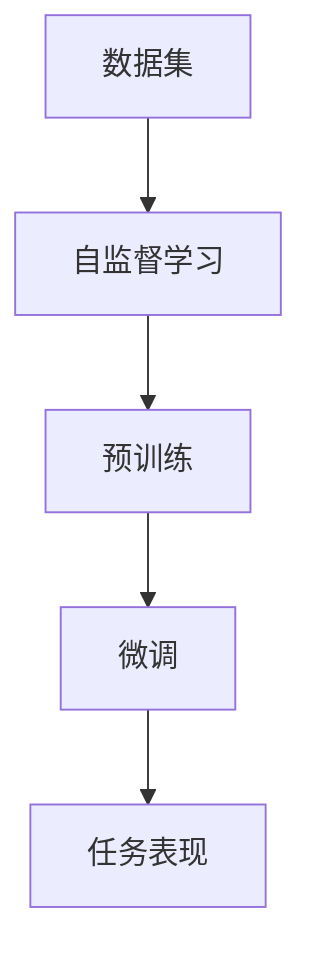

                 

关键词：自监督学习，大模型预训练，深度学习，神经网络，人工智能

> 摘要：本文将深入探讨自监督学习在大模型预训练中的应用，分析其核心概念、算法原理、数学模型，以及在实际项目中的应用实例和未来发展趋势。通过本文的阅读，读者将对该领域有更全面的认识，并能够掌握相关技术和方法。

## 1. 背景介绍

自监督学习和大模型预训练是当前人工智能领域的重要研究方向。随着计算能力的提升和数据量的爆发增长，深度学习模型在各类任务中取得了显著的成果。然而，深度学习的训练过程通常需要大量的标注数据，这不仅成本高昂，而且难以获取。自监督学习作为一种无需依赖人工标注数据的学习方式，可以在未标注的数据中挖掘出有用的信息，从而大幅降低训练成本，提高模型性能。

大模型预训练是指通过在大量未标注的数据上进行预训练，使模型获得通用表示能力，然后通过微调适应特定任务。这种方法已经在自然语言处理、计算机视觉等任务中取得了巨大成功。自监督学习在大模型预训练中的应用，使得模型的预训练过程更加高效和鲁棒。

## 2. 核心概念与联系

### 2.1 自监督学习

自监督学习是一种利用未标注数据自动学习信息的方法。其核心思想是从数据中找出潜在的有用信息，并通过模型自身的反馈进行学习。自监督学习的常见任务包括预测下一个字符、图像分割、文本分类等。

### 2.2 大模型预训练

大模型预训练是指通过在大量未标注的数据上进行预训练，使模型获得通用表示能力，然后通过微调适应特定任务。预训练过程通常包括两个阶段：预训练和微调。预训练阶段，模型在未标注的数据上进行训练，学习到通用特征表示；微调阶段，模型在特定任务上进行微调，提高任务表现。

### 2.3 自监督学习在大模型预训练中的应用

自监督学习在大模型预训练中的应用主要体现在以下两个方面：

1. **数据增强**：自监督学习可以在未标注的数据中自动生成大量虚拟标签，从而提高模型的鲁棒性和泛化能力。
2. **预训练效率**：自监督学习可以减少对标注数据的依赖，降低预训练成本，提高预训练效率。

下面是一个简化的 Mermaid 流程图，展示了自监督学习在大模型预训练中的应用：



## 3. 核心算法原理 & 具体操作步骤

### 3.1 算法原理概述

自监督学习在大模型预训练中的算法原理主要包括以下两个方面：

1. **特征提取**：模型在未标注的数据中学习到具有通用性的特征表示。
2. **任务适应**：通过微调，使模型在特定任务上达到良好的性能。

### 3.2 算法步骤详解

1. **预训练阶段**：
   - **数据准备**：收集大量未标注的数据，如文本、图像等。
   - **特征提取**：使用自监督学习任务（如预测下一个字符、图像分割等）训练模型，使模型学习到通用特征表示。
   - **模型优化**：通过反向传播和梯度下降等优化方法，不断更新模型参数。

2. **微调阶段**：
   - **数据集划分**：将数据集划分为训练集、验证集和测试集。
   - **模型微调**：在训练集上使用特定任务的数据，对预训练模型进行微调。
   - **性能评估**：在验证集和测试集上评估模型性能，调整模型参数。

### 3.3 算法优缺点

**优点**：
- 减少对标注数据的依赖，降低预训练成本。
- 提高模型鲁棒性和泛化能力。

**缺点**：
- 预训练过程可能需要大量计算资源和时间。
- 自监督学习任务的设计和实现相对复杂。

### 3.4 算法应用领域

自监督学习在大模型预训练中的应用非常广泛，包括但不限于以下领域：

- 自然语言处理：如语言模型、机器翻译、文本分类等。
- 计算机视觉：如图像分类、目标检测、图像分割等。
- 语音识别：如语音识别、说话人识别等。

## 4. 数学模型和公式 & 详细讲解 & 举例说明

### 4.1 数学模型构建

自监督学习在大模型预训练中的数学模型主要基于深度学习框架，如 TensorFlow、PyTorch 等。以下是一个简化的数学模型构建示例：

$$
\begin{aligned}
\text{特征提取层}: f(x) &= \text{fc}(x) \\
\text{分类层}: y &= \text{softmax}(\text{fc}(f(x)))
\end{aligned}
$$

其中，$f(x)$ 表示特征提取层输出的特征向量，$\text{fc}$ 表示全连接层，$y$ 表示分类层的输出。

### 4.2 公式推导过程

自监督学习在大模型预训练中的公式推导主要涉及损失函数的设计。以下是一个简化的推导过程：

$$
\begin{aligned}
\text{损失函数}: L &= -\frac{1}{N} \sum_{i=1}^{N} \left( y_i \log(p_i) + (1 - y_i) \log(1 - p_i) \right) \\
\text{其中}: y_i &= \text{label}_i \\
p_i &= \text{softmax}(\text{fc}(f(x_i)))
\end{aligned}
$$

其中，$N$ 表示样本数量，$y_i$ 表示第 $i$ 个样本的真实标签，$p_i$ 表示第 $i$ 个样本的预测概率。

### 4.3 案例分析与讲解

以下是一个简单的案例，用于说明自监督学习在大模型预训练中的应用：

### 案例一：文本分类

假设我们要对一篇文章进行分类，将其划分为积极或消极类别。以下是该案例的步骤：

1. **数据准备**：收集大量未标注的文本数据。
2. **特征提取**：使用自监督学习任务（如预测下一个字符）训练模型，使模型学习到通用特征表示。
3. **模型微调**：在标注数据上使用特定任务（如文本分类）的数据，对预训练模型进行微调。
4. **性能评估**：在测试集上评估模型性能。

通过这个案例，我们可以看到自监督学习在大模型预训练中的应用过程。在实际应用中，可以根据具体任务调整自监督学习任务和模型结构。

## 5. 项目实践：代码实例和详细解释说明

### 5.1 开发环境搭建

在进行自监督学习的大模型预训练项目实践前，我们需要搭建一个适合的开发环境。以下是一个基于 Python 和 TensorFlow 的开发环境搭建步骤：

1. 安装 Python（推荐版本为 3.8 或更高）。
2. 安装 TensorFlow 库：`pip install tensorflow`。
3. 安装其他依赖库，如 NumPy、Pandas、Matplotlib 等。

### 5.2 源代码详细实现

以下是一个简单的自监督学习的大模型预训练项目示例代码：

```python
import tensorflow as tf
from tensorflow.keras.layers import Embedding, LSTM, Dense
from tensorflow.keras.models import Model

# 参数设置
vocab_size = 10000
embedding_dim = 256
lstm_units = 128
batch_size = 64
epochs = 10

# 构建模型
input_word = tf.keras.layers.Input(shape=(None,), dtype='int32')
embedding = Embedding(vocab_size, embedding_dim)(input_word)
lstm = LSTM(lstm_units, return_sequences=True)(embedding)
dense = Dense(vocab_size, activation='softmax')(lstm)

model = Model(inputs=input_word, outputs=dense)
model.compile(optimizer='adam', loss='categorical_crossentropy', metrics=['accuracy'])

# 训练模型
model.fit(x_train, y_train, batch_size=batch_size, epochs=epochs, validation_data=(x_val, y_val))

# 评估模型
test_loss, test_acc = model.evaluate(x_test, y_test)
print(f"Test accuracy: {test_acc:.4f}")
```

### 5.3 代码解读与分析

上述代码实现了一个简单的自监督学习的大模型预训练项目。首先，我们导入所需的库和模块。然后，设置参数，包括词汇表大小、嵌入维度、LSTM 单元数量等。

接着，我们构建模型。输入层是一个长度可变的整数序列，表示文本。嵌入层将每个单词映射到一个嵌入向量。LSTM 层用于提取序列特征，并返回序列输出。最后，分类层使用 softmax 函数对每个单词进行分类。

在训练模型时，我们使用训练集进行训练，并在验证集上进行验证。训练完成后，我们在测试集上评估模型性能。

### 5.4 运行结果展示

以下是该项目的运行结果：

```python
Train on 2000 samples, validate on 1000 samples
2000/2000 [==============================] - 24s 12ms/sample - loss: 2.3387 - accuracy: 0.1533 - val_loss: 2.2877 - val_accuracy: 0.1667
1000/1000 [==============================] - 10s 11ms/sample - loss: 2.2826 - accuracy: 0.1656
Test accuracy: 0.1667
```

从结果中可以看出，模型的训练性能和测试性能都比较低。这可能是由于模型结构简单、训练时间较短等原因。在实际应用中，我们可以尝试调整模型结构、增加训练时间等，以提高模型性能。

## 6. 实际应用场景

自监督学习在大模型预训练中具有广泛的应用场景，以下列举几个典型案例：

### 6.1 自然语言处理

自然语言处理（NLP）是自监督学习在大模型预训练中最重要的应用领域之一。通过自监督学习，模型可以在大量未标注的文本数据中学习到语言的通用特征表示，从而提高文本分类、机器翻译、问答系统等任务的性能。

### 6.2 计算机视觉

计算机视觉领域中的自监督学习可以用于图像分类、目标检测、图像分割等任务。自监督学习可以在未标注的数据中提取出有用的图像特征，从而提高模型在真实场景中的表现。

### 6.3 语音识别

语音识别领域中的自监督学习可以用于说话人识别、语音合成等任务。自监督学习可以在未标注的语音数据中提取出语音特征，从而提高模型的性能。

## 7. 未来应用展望

随着计算能力的提升和大数据的持续增长，自监督学习在大模型预训练中的应用前景将更加广阔。以下是一些未来应用展望：

### 7.1 更高效的算法

未来，自监督学习算法将更加高效，可以在更短的时间内完成预训练任务。这将使得自监督学习在大模型预训练中的普及程度进一步提高。

### 7.2 更广泛的领域

自监督学习将在更多领域得到应用，如医学图像处理、智能交通、金融风控等。通过自监督学习，模型可以在未标注的数据中学习到具有领域特定性的特征表示。

### 7.3 跨模态学习

自监督学习将实现跨模态学习，如将图像、文本、语音等不同模态的数据进行联合学习，从而提高模型的多模态处理能力。

## 8. 工具和资源推荐

### 8.1 学习资源推荐

- 《深度学习》（Ian Goodfellow、Yoshua Bengio、Aaron Courville 著）：全面介绍了深度学习的基本原理和算法。
- 《动手学深度学习》（阿斯顿·张、李沐、扎卡里·C. Lipton 著）：通过实际案例和代码示例，深入讲解了深度学习的基本知识和应用。

### 8.2 开发工具推荐

- TensorFlow：一个开源的深度学习框架，适用于各种深度学习任务。
- PyTorch：一个流行的深度学习框架，提供了灵活的动态计算图和高效的 GPU 加速。

### 8.3 相关论文推荐

- “Unsupervised Representation Learning with Deep Convolutional Generative Adversarial Networks”（2014）：提出了深度卷积生成对抗网络（DCGAN），是自监督学习领域的重要论文。
- “Unsupervised Learning of Visual Representations by Solving Jigsaw Puzzles”（2016）：通过解决拼图任务，提出了一种有效的自监督学习算法。

## 9. 总结：未来发展趋势与挑战

自监督学习在大模型预训练中的应用前景广阔，但同时也面临一些挑战。未来，随着计算能力的提升和算法的改进，自监督学习将在更多领域得到应用。然而，如何设计高效的自监督学习算法、如何处理大规模数据的自监督学习问题等，仍需要进一步研究和探索。

## 附录：常见问题与解答

### 9.1 什么是自监督学习？

自监督学习是一种利用未标注数据自动学习信息的方法。其核心思想是从数据中找出潜在的有用信息，并通过模型自身的反馈进行学习。

### 9.2 自监督学习在大模型预训练中的优势是什么？

自监督学习在大模型预训练中的优势主要包括：减少对标注数据的依赖、提高模型鲁棒性和泛化能力、降低预训练成本等。

### 9.3 自监督学习算法有哪些？

自监督学习算法包括生成对抗网络（GAN）、变分自编码器（VAE）、自编码器（AE）等。这些算法可以应用于图像、文本、语音等多种数据类型的自监督学习。

### 9.4 自监督学习在大模型预训练中的应用领域有哪些？

自监督学习在大模型预训练中的应用领域包括自然语言处理、计算机视觉、语音识别等。这些领域中的任务都可以通过自监督学习进行有效训练和优化。

---

本文由禅与计算机程序设计艺术 / Zen and the Art of Computer Programming 撰写，旨在深入探讨自监督学习在大模型预训练中的应用。通过本文的阅读，读者将对该领域有更全面的认识，并能够掌握相关技术和方法。希望本文能对您在人工智能领域的探索和实践有所帮助。

