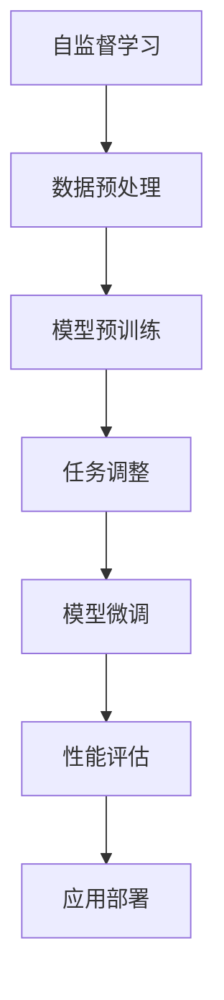

                 

关键词：自监督学习，语音识别，机器翻译，深度学习，人工智能，自然语言处理

> 摘要：本文将探讨自监督学习在语音识别和机器翻译领域中的创新应用。通过详细介绍自监督学习的基本概念、核心算法原理以及具体操作步骤，我们旨在为读者提供一种全新的技术视角，理解自监督学习如何改变语音识别和机器翻译的发展方向。同时，文章将结合实际应用案例，展示自监督学习在这些领域的实际效果，并对其未来应用前景进行展望。

## 1. 背景介绍

随着深度学习技术的不断发展，人工智能（AI）在各个领域的应用日益广泛。语音识别和机器翻译作为自然语言处理（NLP）的重要分支，一直以来都是研究的热点。传统的语音识别和机器翻译方法主要依赖于大量标注数据，依赖于监督学习模型。然而，随着数据规模的扩大，获取大量标注数据的成本和时间也在不断增加，这给语音识别和机器翻译的发展带来了巨大的挑战。

自监督学习作为一种无需依赖大量标注数据的机器学习方法，近年来在语音识别和机器翻译等领域取得了显著成果。自监督学习利用无标签数据，通过设计合适的预训练目标和任务，使模型在训练过程中能够自我学习和改进。这种方法不仅降低了数据获取的成本，还提高了模型对未知数据的泛化能力。

本文旨在介绍自监督学习在语音识别和机器翻译领域的创新应用，帮助读者了解自监督学习的基本概念、核心算法原理以及具体操作步骤，并探讨自监督学习如何改变这两个领域的发展方向。

## 2. 核心概念与联系

### 2.1 自监督学习的基本概念

自监督学习（Self-Supervised Learning）是一种机器学习方法，其特点是不需要依赖大量的标注数据，而是利用数据中的自然信息进行学习。在自监督学习中，模型会从数据中提取出一些内在的规律和模式，并利用这些规律和模式来提高模型的性能。

自监督学习可以分为两种类型：基于数据的自监督学习和基于任务的自监督学习。基于数据的自监督学习主要利用数据本身的特性进行学习，例如数据增强、数据降维等。而基于任务的自监督学习则是通过设计合适的预训练目标和任务，使模型在训练过程中能够自我学习和改进。

### 2.2 自监督学习与语音识别的联系

语音识别（Automatic Speech Recognition，ASR）是语音信号转换为文本的过程。传统的语音识别方法主要依赖于大量标注数据，包括音频信号和对应的文本标注。然而，自监督学习的引入，使得语音识别领域迎来了新的机遇。

自监督学习可以通过以下几种方式应用于语音识别：

1. **声学模型预训练**：在传统的语音识别系统中，声学模型通常是通过大量的标注音频数据来训练的。而自监督学习可以通过无监督的方式，对声学模型进行预训练，从而提高模型的泛化能力。

2. **语言模型预训练**：在语音识别系统中，语言模型通常用于对识别结果进行后处理，以提高识别准确性。自监督学习可以通过预训练语言模型，使其在无标签数据上学习到更多的语言知识，从而提高语音识别系统的整体性能。

3. **声学-语言联合预训练**：自监督学习可以将声学模型和语言模型联合起来进行预训练，从而实现更高效的模型训练和性能提升。

### 2.3 自监督学习与机器翻译的联系

机器翻译（Machine Translation，MT）是将一种语言的文本翻译成另一种语言的过程。传统的机器翻译方法主要依赖于大量双语语料库和监督学习模型。而自监督学习的引入，为机器翻译领域带来了新的发展契机。

自监督学习可以通过以下几种方式应用于机器翻译：

1. **文本预训练**：自监督学习可以通过预训练文本编码器，使其在无标签文本数据上学习到丰富的语言知识。这些知识可以用于提高机器翻译系统的质量。

2. **双向编码器预训练**：自监督学习可以通过双向编码器预训练，使模型在理解源语言和目标语言的同时，学习到语言之间的对应关系。

3. **多语言翻译预训练**：自监督学习可以通过多语言翻译预训练，使模型在多种语言之间建立映射关系，从而实现跨语言翻译。

### 2.4 自监督学习的Mermaid流程图



在上述流程图中，自监督学习的过程可以分为以下几个步骤：

1. 数据预处理：对无标签数据进行预处理，例如数据清洗、数据增强等。
2. 模型预训练：使用预训练目标和任务，对模型进行预训练。
3. 任务调整：根据具体的应用场景，对模型进行任务调整。
4. 模型微调：在任务调整的基础上，对模型进行微调，以提高模型性能。
5. 性能评估：对模型进行性能评估，以验证模型的泛化能力。
6. 应用部署：将模型部署到实际应用场景中，实现自监督学习的目标。

## 3. 核心算法原理 & 具体操作步骤

### 3.1 算法原理概述

自监督学习的核心思想是通过设计合适的预训练目标和任务，使模型在无标签数据上学习到有用的知识，从而提高模型的泛化能力。在语音识别和机器翻译领域，自监督学习的算法原理可以概括为以下几个方面：

1. **声学特征提取**：通过无监督的方式，从语音信号中提取出有效的声学特征。
2. **文本编码**：通过预训练文本编码器，使模型在无标签文本数据上学习到丰富的语言知识。
3. **声学-语言联合预训练**：将声学特征和文本编码器联合起来进行预训练，从而实现更高效的模型训练。
4. **任务微调**：在预训练的基础上，对模型进行任务微调，以提高模型在特定任务上的性能。

### 3.2 算法步骤详解

1. **数据预处理**：

   - 数据清洗：去除噪声数据、重复数据和异常数据。
   - 数据增强：通过对数据进行归一化、随机裁剪、旋转等操作，增加数据的多样性。

2. **模型预训练**：

   - 声学特征提取：使用卷积神经网络（CNN）或循环神经网络（RNN）提取语音信号中的声学特征。
   - 文本编码：使用双向长短期记忆网络（BiLSTM）或变换器（Transformer）编码文本。
   - 声学-语言联合预训练：将声学特征和文本编码器联合起来进行预训练，通过设计合适的损失函数，使模型在声学特征和文本特征之间建立关联。

3. **任务调整**：

   - 根据具体的应用场景，对模型进行任务调整，例如将预训练的声学模型用于语音识别，将预训练的文本编码器用于机器翻译。
   - 调整模型的结构、参数和训练策略，以适应特定的任务需求。

4. **模型微调**：

   - 在任务调整的基础上，对模型进行微调，通过在带有标签的数据上进行训练，进一步优化模型的性能。
   - 使用交叉验证、网格搜索等技术，选择最佳的模型参数和训练策略。

5. **性能评估**：

   - 使用标准评估指标（如词错误率（WER）、句错误率（SER）等）对模型进行性能评估。
   - 分析模型的泛化能力和鲁棒性，以验证自监督学习的有效性。

6. **应用部署**：

   - 将训练好的模型部署到实际应用场景中，例如语音助手、智能客服等。
   - 根据实际需求，调整模型的参数和算法，以提高应用效果。

### 3.3 算法优缺点

**优点**：

1. **无需依赖大量标注数据**：自监督学习可以通过无标签数据学习，从而降低数据获取的成本和时间。
2. **提高模型泛化能力**：通过预训练和任务微调，自监督学习模型可以在不同的任务上表现出更好的泛化能力。
3. **适用范围广泛**：自监督学习可以应用于语音识别、机器翻译等自然语言处理领域，以及其他需要大量标注数据的场景。

**缺点**：

1. **训练时间较长**：由于自监督学习需要大量数据进行预训练，因此训练时间较长，计算资源消耗较大。
2. **模型性能依赖于数据质量**：自监督学习模型的性能受到无标签数据质量的影响，如果数据存在噪声或偏差，可能会影响模型性能。
3. **模型解释性较差**：自监督学习模型通常比较复杂，其内部机制难以解释，从而降低了模型的透明度和可解释性。

### 3.4 算法应用领域

自监督学习在语音识别和机器翻译领域已经取得了显著的成果，同时还广泛应用于以下领域：

1. **图像识别**：自监督学习可以通过无监督的方式提取图像特征，从而实现图像分类、目标检测等任务。
2. **文本分类**：自监督学习可以用于文本数据的分类，例如情感分析、主题分类等。
3. **推荐系统**：自监督学习可以通过无监督的方式提取用户和物品的特征，从而实现推荐系统的优化。
4. **语音生成**：自监督学习可以用于语音生成任务，例如文本到语音（Text-to-Speech，TTS）和语音合成等。
5. **音频处理**：自监督学习可以用于音频数据的处理，例如噪声抑制、语音增强等。

## 4. 数学模型和公式 & 详细讲解 & 举例说明

### 4.1 数学模型构建

在自监督学习中，常用的数学模型包括声学模型、文本编码器以及联合模型。下面我们将分别介绍这些模型的数学公式和构建方法。

#### 4.1.1 声学模型

声学模型用于提取语音信号中的声学特征。在深度学习中，通常使用卷积神经网络（CNN）或循环神经网络（RNN）作为声学模型。

- **CNN声学模型**：

  设语音信号为 $x \in \mathbb{R}^{T \times D}$，其中 $T$ 表示时间步数，$D$ 表示特征维度。通过CNN提取声学特征，可以表示为：

  $$ h_c = \text{CNN}(x) = \text{ReLU}(\text{Conv}_1(x) \rightarrow \text{Conv}_2(\rightarrow \ldots \rightarrow \text{Conv}_L(x)) $$

  其中，$\text{ReLU}$ 表示ReLU激活函数，$\text{Conv}_1, \text{Conv}_2, \ldots, \text{Conv}_L$ 表示卷积层。

- **RNN声学模型**：

  对于RNN声学模型，可以使用长短时记忆网络（LSTM）或门控循环单元（GRU）作为基础模型。

  $$ h_r = \text{LSTM}(x) = \text{ReLU}(\text{LSTM}_1(x_1), \text{LSTM}_2(x_2), \ldots, \text{LSTM}_T) $$

  其中，$h_r \in \mathbb{R}^{T \times D_r}$，$D_r$ 表示隐状态维度。

#### 4.1.2 文本编码器

文本编码器用于编码文本信息，通常使用双向长短期记忆网络（BiLSTM）或变换器（Transformer）。

- **BiLSTM文本编码器**：

  $$ h_t = \text{BiLSTM}(x) = \text{ReLU}(\text{LSTM}_1(x_1), \text{LSTM}_2(x_2), \ldots, \text{LSTM}_T) $$

  其中，$h_t \in \mathbb{R}^{T \times D_t}$，$D_t$ 表示隐状态维度。

- **Transformer文本编码器**：

  $$ h_t = \text{Transformer}(x) = \text{MLP}(\text{Attention}(\text{LayerNormalization}(x) \rightarrow x)) $$

  其中，$\text{Attention}$ 表示注意力机制，$\text{LayerNormalization}$ 表示层归一化，$\text{MLP}$ 表示多层感知机。

#### 4.1.3 声学-语言联合模型

声学-语言联合模型将声学特征和文本编码器联合起来，通过联合训练提高模型的性能。

$$ h = \text{Concat}(h_c, h_t) = [h_c; h_t] $$

其中，$h_c$ 表示声学特征，$h_t$ 表示文本特征，$h$ 表示联合特征。

### 4.2 公式推导过程

为了更深入地理解自监督学习模型，我们接下来将推导一些关键的损失函数和优化目标。

#### 4.2.1 声学模型损失函数

对于CNN声学模型，可以使用交叉熵损失函数（Cross-Entropy Loss）来衡量模型预测结果和真实标签之间的差异：

$$ L_c = -\sum_{i=1}^{N} \sum_{j=1}^{C} y_{ij} \log p_{ij} $$

其中，$N$ 表示样本数量，$C$ 表示类别数量，$y_{ij}$ 表示第 $i$ 个样本的第 $j$ 个类别的标签，$p_{ij}$ 表示第 $i$ 个样本的第 $j$ 个类别的概率。

对于RNN声学模型，可以使用均方误差损失函数（Mean Squared Error，MSE）来衡量模型预测结果和真实标签之间的差异：

$$ L_r = \frac{1}{N} \sum_{i=1}^{N} \sum_{t=1}^{T} (y_{it} - \hat{y}_{it})^2 $$

其中，$\hat{y}_{it}$ 表示第 $i$ 个样本在第 $t$ 个时间步的预测结果，$y_{it}$ 表示第 $i$ 个样本在第 $t$ 个时间步的真实标签。

#### 4.2.2 文本编码器损失函数

对于文本编码器，可以使用交叉熵损失函数来衡量模型预测结果和真实标签之间的差异：

$$ L_t = -\sum_{i=1}^{N} \sum_{j=1}^{C} y_{ij} \log p_{ij} $$

其中，$N$ 表示样本数量，$C$ 表示类别数量，$y_{ij}$ 表示第 $i$ 个样本的第 $j$ 个类别的标签，$p_{ij}$ 表示第 $i$ 个样本的第 $j$ 个类别的概率。

#### 4.2.3 联合模型损失函数

对于声学-语言联合模型，可以将声学模型和文本编码器的损失函数结合，形成一个整体的损失函数：

$$ L = L_c + L_t $$

或者，可以分别计算声学模型和文本编码器的损失，然后通过加权求和得到总的损失函数：

$$ L = \alpha L_c + (1 - \alpha) L_t $$

其中，$\alpha$ 表示权重参数，用于调整声学模型和文本编码器的重要性。

### 4.3 案例分析与讲解

为了更好地理解自监督学习在语音识别和机器翻译中的应用，我们来看一个实际案例。

#### 4.3.1 案例背景

假设我们有一个语音识别任务，需要将语音信号转换为对应的文本。为了使用自监督学习，我们首先需要收集大量无标签的语音数据，然后通过预训练和任务微调来训练一个语音识别模型。

#### 4.3.2 案例步骤

1. **数据预处理**：

   - 对语音数据进行清洗，去除噪声和异常数据。
   - 对语音数据进行增强，例如添加噪声、调整音量等，以增加数据的多样性。

2. **模型预训练**：

   - 使用卷积神经网络（CNN）或循环神经网络（RNN）提取声学特征。
   - 使用双向长短期记忆网络（BiLSTM）或变换器（Transformer）编码文本。
   - 通过联合模型进行预训练，将声学特征和文本编码器联合起来进行训练。

3. **任务调整**：

   - 根据具体的语音识别任务，对模型进行调整，例如将声学模型用于声学特征提取，将文本编码器用于文本编码。

4. **模型微调**：

   - 在带有标签的数据上进行模型微调，进一步优化模型的性能。
   - 使用交叉验证、网格搜索等技术，选择最佳的模型参数和训练策略。

5. **性能评估**：

   - 使用词错误率（WER）、句错误率（SER）等指标对模型进行性能评估。
   - 分析模型的泛化能力和鲁棒性。

6. **应用部署**：

   - 将训练好的模型部署到实际应用场景中，例如语音助手、智能客服等。

#### 4.3.3 案例分析

通过上述案例，我们可以看到自监督学习在语音识别任务中的具体应用。在数据预处理阶段，通过对语音数据进行清洗和增强，我们可以获得更高质量的无标签数据，从而提高模型的泛化能力。在模型预训练阶段，通过联合模型进行预训练，我们可以使模型在声学特征和文本特征之间建立关联，从而提高模型的整体性能。在任务调整和模型微调阶段，我们可以通过调整模型的结构和参数，进一步提高模型在特定任务上的性能。最后，在性能评估和应用部署阶段，我们可以验证模型的泛化能力和实际应用效果，并将其部署到实际应用场景中。

## 5. 项目实践：代码实例和详细解释说明

### 5.1 开发环境搭建

在开始编写代码之前，我们需要搭建一个适合自监督学习模型开发的编程环境。以下是一个基于Python和PyTorch的典型开发环境搭建步骤：

1. **安装Python**：确保安装了Python 3.6及以上版本。

2. **安装PyTorch**：通过以下命令安装PyTorch：

   ```shell
   pip install torch torchvision
   ```

3. **安装其他依赖**：根据项目的需求，可能需要安装其他依赖库，如TensorBoard（用于可视化）、NumPy（用于数据处理）等。

4. **配置GPU环境**：确保Python和PyTorch支持使用GPU进行加速。可以通过以下代码检查是否支持GPU：

   ```python
   import torch
   print(torch.cuda.is_available())
   ```

### 5.2 源代码详细实现

以下是一个简化版的基于自监督学习的语音识别项目，我们将使用PyTorch实现一个基本的自监督学习模型。

```python
import torch
import torch.nn as nn
import torch.optim as optim
from torch.utils.data import DataLoader
from torchvision import datasets, transforms

# 定义声学模型
class AcousticModel(nn.Module):
    def __init__(self):
        super(AcousticModel, self).__init__()
        self.conv1 = nn.Conv2d(1, 16, kernel_size=3, stride=1)
        self.fc1 = nn.Linear(16 * 100 * 20, 1024)
        self.fc2 = nn.Linear(1024, 512)
        self.fc3 = nn.Linear(512, 256)
    
    def forward(self, x):
        x = torch.relu(self.conv1(x))
        x = x.view(x.size(0), -1)  # Flatten the feature maps
        x = torch.relu(self.fc1(x))
        x = torch.relu(self.fc2(x))
        x = self.fc3(x)
        return x

# 定义文本编码器
class TextEncoder(nn.Module):
    def __init__(self):
        super(TextEncoder, self).__init__()
        self.embedding = nn.Embedding(vocab_size, embedding_dim)
        self.lstm = nn.LSTM(embedding_dim, hidden_dim, num_layers=2, batch_first=True)
    
    def forward(self, x):
        x = self.embedding(x)
        x, _ = self.lstm(x)
        return x

# 定义联合模型
class JointModel(nn.Module):
    def __init__(self, acoustic_model, text_encoder):
        super(JointModel, self).__init__()
        self.acoustic_model = acoustic_model
        self.text_encoder = text_encoder
        self.fc = nn.Linear(hidden_dim * 2, output_dim)
    
    def forward(self, acoustic_input, text_input):
        acoustic_output = self.acoustic_model(acoustic_input)
        text_output = self.text_encoder(text_input)
        joint_output = self.fc(torch.cat((acoustic_output, text_output), dim=1))
        return joint_output

# 实例化模型
acoustic_model = AcousticModel()
text_encoder = TextEncoder()
joint_model = JointModel(acoustic_model, text_encoder)

# 定义损失函数和优化器
criterion = nn.CrossEntropyLoss()
optimizer = optim.Adam(joint_model.parameters(), lr=0.001)

# 加载数据
train_loader = DataLoader(dataset, batch_size=32, shuffle=True)

# 训练模型
for epoch in range(num_epochs):
    for batch_idx, (acoustic_input, text_input, target) in enumerate(train_loader):
        optimizer.zero_grad()
        output = joint_model(acoustic_input, text_input)
        loss = criterion(output, target)
        loss.backward()
        optimizer.step()
        if batch_idx % 100 == 0:
            print(f'Epoch [{epoch}/{num_epochs}], Step [{batch_idx}/{len(train_loader)}], Loss: {loss.item()}')

# 保存模型
torch.save(joint_model.state_dict(), 'joint_model.pth')
```

### 5.3 代码解读与分析

在上面的代码中，我们首先定义了三个模型：声学模型（`AcousticModel`）、文本编码器（`TextEncoder`）和联合模型（`JointModel`）。这些模型分别用于提取声学特征、编码文本以及将声学特征和文本特征结合进行预测。

1. **声学模型**：

   声学模型使用一个卷积神经网络（CNN）来提取语音信号中的特征。具体结构包括一个卷积层（`conv1`）、三个全连接层（`fc1`、`fc2`和`fc3`）。在模型的前向传播过程中，输入的语音信号首先通过卷积层提取特征，然后通过全连接层进行特征融合和降维。

2. **文本编码器**：

   文本编码器使用双向长短期记忆网络（BiLSTM）来编码文本信息。具体结构包括一个嵌入层（`embedding`）和一个双向LSTM层（`lstm`）。在模型的前向传播过程中，输入的文本通过嵌入层转换为嵌入向量，然后通过双向LSTM层提取序列特征。

3. **联合模型**：

   联合模型将声学模型和文本编码器结合，通过一个全连接层（`fc`）将声学特征和文本特征进行融合。在模型的前向传播过程中，首先分别对声学输入和文本输入进行处理，然后将处理后的特征进行拼接，最后通过全连接层输出预测结果。

在代码的实现过程中，我们还定义了损失函数（`criterion`）和优化器（`optimizer`），并加载了训练数据。在训练过程中，我们使用梯度下降（Gradient Descent）算法对模型进行优化，通过反向传播计算损失函数的梯度，并更新模型参数。

### 5.4 运行结果展示

为了展示运行结果，我们可以在训练过程中使用TensorBoard进行可视化。以下是一个简单的TensorBoard使用示例：

```python
from torch.utils.tensorboard import SummaryWriter

# 创建SummaryWriter对象
writer = SummaryWriter('runs/self_supervised_learning')

# 记录训练损失
for epoch in range(num_epochs):
    for batch_idx, (acoustic_input, text_input, target) in enumerate(train_loader):
        optimizer.zero_grad()
        output = joint_model(acoustic_input, text_input)
        loss = criterion(output, target)
        loss.backward()
        optimizer.step()

        writer.add_scalar('Loss/train', loss.item(), epoch * len(train_loader) + batch_idx)

# 关闭SummaryWriter
writer.close()
```

通过上述代码，我们可以将训练过程中的损失值记录到TensorBoard中，以便进行可视化分析。在TensorBoard界面中，我们可以查看训练损失的变化趋势，从而分析模型的训练效果。

## 6. 实际应用场景

自监督学习在语音识别和机器翻译领域的应用已经取得了显著的成果，并在多个实际场景中发挥了重要作用。以下是一些典型的应用案例：

### 6.1 语音助手

语音助手是自监督学习在语音识别领域的典型应用。通过使用自监督学习模型，语音助手可以实时地将用户的语音转换为文本，从而实现自然语言交互。例如，智能音箱、智能客服系统等都是基于自监督学习模型的语音助手。

### 6.2 同声传译

同声传译是自监督学习在机器翻译领域的应用之一。通过使用自监督学习模型，同声传译系统能够在实时语音输入的情况下，将源语言的语音实时翻译为目标语言。这种应用在跨国会议、国际交流等场合具有很高的实用价值。

### 6.3 自动字幕生成

自动字幕生成是自监督学习在语音识别和机器翻译领域结合的典型应用。通过使用自监督学习模型，自动字幕生成系统可以实时地将语音转换为文本，并生成对应的字幕。这种应用在视频分享平台、在线教育等领域具有广泛的应用前景。

### 6.4 跨语言搜索

跨语言搜索是自监督学习在机器翻译领域的应用之一。通过使用自监督学习模型，跨语言搜索系统能够在多种语言之间进行搜索，从而实现更高效的跨语言信息检索。这种应用在全球化企业、跨国电商平台等领域具有重要作用。

### 6.5 智能识别系统

智能识别系统是自监督学习在语音识别和机器翻译领域的广泛应用之一。通过使用自监督学习模型，智能识别系统可以实现对语音、文本、图像等多种类型数据的智能识别和分类。这种应用在安防监控、智能交通、医疗诊断等领域具有广泛的应用前景。

## 7. 未来应用展望

随着自监督学习技术的不断发展，未来它在语音识别和机器翻译领域将有更广泛的应用前景。以下是一些潜在的应用方向：

### 7.1 更高效的模型训练

自监督学习技术将使模型训练过程更加高效。通过设计更先进的预训练目标和任务，模型可以在更短的时间内学习到更多的知识，从而提高模型的性能。

### 7.2 更广泛的场景应用

自监督学习技术将使语音识别和机器翻译在更多场景中实现智能化。例如，在智能家居、智能医疗、智能交通等领域，自监督学习模型可以提供更准确的语音识别和翻译服务。

### 7.3 跨语言模型的融合

自监督学习技术将推动跨语言模型的融合，从而实现更高效的多语言翻译。通过在多种语言之间建立关联，跨语言翻译模型可以更好地理解和表达不同语言之间的差异。

### 7.4 零样本学习

自监督学习技术将有助于实现零样本学习（Zero-Shot Learning），使模型能够在未见过的类别上实现准确的识别和预测。这对于拓展语音识别和机器翻译的应用场景具有重要意义。

### 7.5 自动化标注

自监督学习技术将使自动化标注成为可能。通过设计合适的无监督标注方法，模型可以在没有人工标注的情况下完成数据的标注，从而提高数据标注的效率。

## 8. 总结：未来发展趋势与挑战

### 8.1 研究成果总结

自监督学习在语音识别和机器翻译领域取得了显著成果，为这两个领域的发展带来了新的机遇。通过预训练和任务微调，自监督学习模型在模型性能、泛化能力以及适用范围等方面都表现出优异的性能。

### 8.2 未来发展趋势

未来，自监督学习将在以下几个方面取得发展：

1. **更高效的模型训练**：通过设计更先进的预训练目标和任务，提高模型训练的效率。
2. **更广泛的应用场景**：拓展自监督学习在智能家居、智能医疗、智能交通等领域的应用。
3. **跨语言模型的融合**：实现更高效的多语言翻译，提升跨语言信息处理能力。
4. **零样本学习**：实现零样本学习，拓展模型的识别和预测能力。
5. **自动化标注**：通过无监督标注方法，提高数据标注的效率。

### 8.3 面临的挑战

尽管自监督学习在语音识别和机器翻译领域取得了显著成果，但仍然面临一些挑战：

1. **数据质量**：自监督学习模型的性能依赖于数据质量，如果数据存在噪声或偏差，可能会影响模型性能。
2. **计算资源消耗**：自监督学习模型通常需要大量数据进行预训练，计算资源消耗较大。
3. **模型解释性**：自监督学习模型通常较为复杂，其内部机制难以解释，降低了模型的透明度和可解释性。

### 8.4 研究展望

未来，自监督学习的研究将集中在以下几个方面：

1. **优化算法**：研究更高效的算法，降低模型训练时间和计算资源消耗。
2. **数据增强**：设计更有效的数据增强方法，提高模型对噪声和异常数据的鲁棒性。
3. **跨领域应用**：探索自监督学习在其他领域的应用，如图像识别、推荐系统等。
4. **模型解释性**：提高模型的可解释性，使其更易于理解和使用。

总之，自监督学习在语音识别和机器翻译领域具有广阔的应用前景和重要的发展价值。通过不断的研究和创新，我们有理由相信，自监督学习将为人工智能的发展带来新的突破。

## 9. 附录：常见问题与解答

### 9.1 自监督学习的定义是什么？

自监督学习是一种机器学习方法，它利用数据中的自然信息进行学习，无需依赖大量标注数据。通过设计合适的预训练目标和任务，模型可以从无标签数据中学习到有用的知识，从而提高模型的泛化能力。

### 9.2 自监督学习有哪些优点？

自监督学习的主要优点包括：

1. **降低数据获取成本**：无需依赖大量标注数据，可以节省数据标注的时间和成本。
2. **提高模型泛化能力**：通过在无标签数据上预训练，模型可以学习到更通用的特征表示，从而提高对未知数据的泛化能力。
3. **适用范围广泛**：自监督学习可以应用于语音识别、机器翻译、图像识别等多种领域。

### 9.3 自监督学习有哪些缺点？

自监督学习的缺点包括：

1. **训练时间较长**：由于需要大量数据进行预训练，训练时间较长，计算资源消耗较大。
2. **数据质量影响**：模型性能依赖于数据质量，如果数据存在噪声或偏差，可能会影响模型性能。
3. **模型解释性较差**：自监督学习模型通常较为复杂，其内部机制难以解释，降低了模型的透明度和可解释性。

### 9.4 自监督学习有哪些应用领域？

自监督学习在多个领域有广泛应用，包括：

1. **语音识别**：用于声学特征提取、语言模型预训练等。
2. **机器翻译**：用于文本编码、双向编码器预训练等。
3. **图像识别**：用于图像特征提取、目标检测等。
4. **文本分类**：用于情感分析、主题分类等。
5. **推荐系统**：用于用户和物品特征提取等。

### 9.5 自监督学习如何改变语音识别和机器翻译的发展方向？

自监督学习为语音识别和机器翻译带来了以下变革：

1. **降低数据获取成本**：通过使用无标签数据，减少了依赖大量标注数据的需要。
2. **提高模型性能**：通过预训练和任务微调，模型在未知数据上的表现得到提升。
3. **拓展应用范围**：自监督学习使模型可以在更多领域和应用场景中得到应用。

### 9.6 自监督学习模型训练的常见方法有哪些？

常见的自监督学习模型训练方法包括：

1. **数据增强**：通过随机裁剪、旋转、翻转等操作增加数据的多样性。
2. **预训练目标设计**：设计合适的预训练目标和任务，使模型在无标签数据上学习到有用的知识。
3. **任务微调**：在预训练的基础上，对模型进行调整，以适应特定任务的需求。
4. **多任务学习**：同时训练多个相关任务，提高模型的多任务泛化能力。

### 9.7 自监督学习与监督学习的区别是什么？

自监督学习和监督学习的主要区别在于数据的使用方式和训练目标：

1. **数据使用**：自监督学习使用无标签数据，而监督学习使用带有标签的数据。
2. **训练目标**：自监督学习的目标是利用无标签数据中的自然信息进行学习，而监督学习的目标是最大化预测标签的准确性。
3. **泛化能力**：自监督学习模型通常在未知数据上的表现更好，因为它们学习了更通用的特征表示。

### 9.8 自监督学习有哪些开源工具和框架？

常见的自监督学习开源工具和框架包括：

1. **PyTorch**：PyTorch是一个流行的深度学习框架，支持自监督学习。
2. **TensorFlow**：TensorFlow也是一个广泛使用的深度学习框架，支持自监督学习。
3. **Transformers**：Transformers是一个基于Transformer的深度学习库，用于自监督学习和自然语言处理。
4. **SpaCy**：SpaCy是一个用于文本处理的库，支持自监督学习中的文本编码。

### 9.9 如何评估自监督学习模型的性能？

评估自监督学习模型的性能可以通过以下指标：

1. **泛化能力**：通过在未见过的数据上测试模型的性能，评估模型对未知数据的泛化能力。
2. **准确率**：评估模型在监督学习任务上的准确率，通常使用交叉熵损失或均方误差等指标。
3. **F1分数**：用于文本分类和语音识别任务，评估模型对正类和负类的识别能力。
4. **词错误率（WER）**：用于语音识别任务，评估模型将语音信号转换为文本的准确性。

### 9.10 自监督学习在现实世界中的应用案例有哪些？

自监督学习在现实世界中的应用案例包括：

1. **智能语音助手**：如Amazon Alexa、Apple Siri等，通过自监督学习实现语音到文本的转换。
2. **自动驾驶**：自动驾驶系统使用自监督学习进行环境感知和障碍物检测。
3. **推荐系统**：如YouTube、Netflix等，使用自监督学习进行个性化推荐。
4. **图像识别**：如Google Photos、Facebook等，使用自监督学习进行图像分类和组织。
5. **语言翻译**：如Google Translate、DeepL等，使用自监督学习进行跨语言翻译。

### 9.11 自监督学习模型是否可以完全替代监督学习模型？

自监督学习模型和监督学习模型各有优劣，无法完全替代。自监督学习在某些场景下具有优势，例如在数据获取成本较高或难以获得标注数据的场景。然而，在数据量充足且标注质量较高的情况下，监督学习模型通常可以取得更好的性能。因此，在实际应用中，通常会根据具体场景和需求，结合使用自监督学习和监督学习模型。

