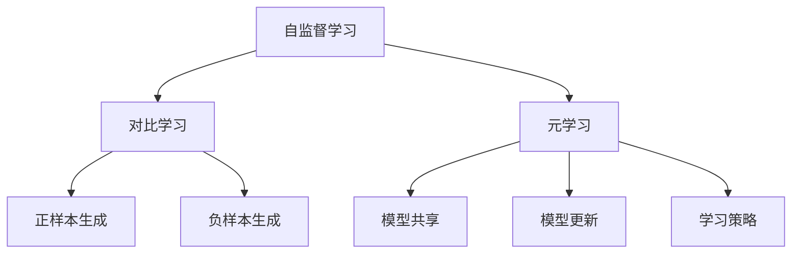

                 

关键词：自监督学习、对比学习、元学习、AI、算法原理、应用场景、数学模型

摘要：本文深入探讨了自监督学习中的两种重要技术——对比学习和元学习。通过对自监督学习背景的介绍，以及对比学习和元学习的核心概念、原理、算法步骤、优缺点和应用领域的详细阐述，本文旨在为读者提供一个全面而清晰的自监督学习理论框架。同时，通过数学模型和具体实例的讲解，进一步加深读者对这两种技术的理解。最后，对自监督学习在未来的发展趋势和挑战进行了展望，以期为相关领域的研究和应用提供有益的参考。

## 1. 背景介绍

自监督学习（Self-Supervised Learning）是机器学习领域的一种重要技术，其核心思想是从未标注的数据中学习有用的特征表示。与传统的监督学习和无监督学习不同，自监督学习利用了数据本身的结构和相关性，无需依赖外部标注信息，从而显著降低了数据标注的成本，提高了模型的泛化能力。

自监督学习最早可以追溯到20世纪60年代，当时的心理学家和认知科学家开始关注如何让计算机自动从数据中学习。随着深度学习技术的发展，自监督学习逐渐成为机器学习领域的研究热点。近年来，随着生成对抗网络（GANs）、变分自编码器（VAEs）等新技术的出现，自监督学习在图像、语音、文本等领域的应用取得了显著成果。

在自监督学习中，对比学习和元学习是两种重要的技术。对比学习（Contrastive Learning）通过正负样本的对比来增强特征的区分能力，是自监督学习中最常用的方法之一。元学习（Meta-Learning）则关注如何快速适应新的任务，通过在多个任务上训练来提升模型的泛化能力。

本文将重点探讨对比学习和元学习的理论创新，分析其在自监督学习中的应用，以及面临的挑战和未来发展趋势。

## 2. 核心概念与联系

### 2.1 对比学习

对比学习是一种通过对比正负样本来学习特征表示的方法。其核心思想是利用未标注的数据，通过对比不同样本之间的相似性和差异性，学习出具有区分性的特征表示。

在对比学习中，通常采用以下几种策略来生成正负样本：

- **正样本生成**：通常选择具有相同标签的样本作为正样本，例如在图像分类任务中，选择具有相同类别标签的图像。

- **负样本生成**：选择具有不同标签的样本作为负样本，例如在图像分类任务中，选择具有不同类别标签的图像。

通过对比正负样本，模型可以学习到具有区分性的特征表示。在训练过程中，通常采用对比损失函数来指导学习过程，例如信息损失（InfoNCE）和对比损失（Contrastive Loss）。

### 2.2 元学习

元学习是一种通过在多个任务上训练来提升模型泛化能力的方法。其核心思想是利用多个任务之间的共享信息，快速适应新的任务。

在元学习中，通常采用以下几种策略来训练模型：

- **模型共享**：使用相同的模型结构来处理多个任务，通过任务间的共享信息来提升模型的泛化能力。

- **模型更新**：在训练过程中，不断更新模型参数，使其能够适应新的任务。

- **学习策略**：使用自适应的学习策略，例如梯度下降法、随机梯度下降法等，来优化模型参数。

通过元学习，模型可以快速适应新的任务，提高模型的泛化能力和学习能力。

### 2.3 核心概念原理和架构的 Mermaid 流程图



## 3. 核心算法原理 & 具体操作步骤

### 3.1 算法原理概述

对比学习：通过对比正负样本，学习出具有区分性的特征表示。

元学习：通过在多个任务上训练，提升模型的泛化能力和学习能力。

### 3.2 算法步骤详解

对比学习：

1. 数据预处理：将未标注的数据集划分为训练集和测试集。

2. 特征提取：使用预训练的深度神经网络，提取数据特征。

3. 样本生成：根据标签信息，生成正负样本。

4. 损失计算：计算正负样本之间的对比损失。

5. 参数更新：使用对比损失函数，更新模型参数。

元学习：

1. 数据预处理：将多个任务的数据集划分为训练集和测试集。

2. 特征提取：使用预训练的深度神经网络，提取数据特征。

3. 模型训练：在多个任务上训练模型，使用模型共享和模型更新策略。

4. 模型评估：在测试集上评估模型性能。

5. 参数更新：使用自适应的学习策略，更新模型参数。

### 3.3 算法优缺点

对比学习：

优点：

- 无需标注数据，降低了数据标注的成本。
- 可以学习到具有区分性的特征表示，提高了模型的泛化能力。

缺点：

- 需要大量的未标注数据。
- 对比损失函数的设计对算法性能有很大影响。

元学习：

优点：

- 可以快速适应新的任务，提高了模型的泛化能力。
- 通过模型共享和模型更新策略，提高了模型的学习效率。

缺点：

- 需要大量的计算资源和时间。
- 模型的泛化能力对任务间的共享信息有很高要求。

### 3.4 算法应用领域

对比学习：广泛应用于图像分类、文本分类、语音识别等领域。

元学习：广泛应用于 reinforcement learning、sequential decision-making、predictive modeling 等领域。

## 4. 数学模型和公式 & 详细讲解 & 举例说明

### 4.1 数学模型构建

对比学习：

损失函数：\( L = -\frac{1}{N} \sum_{i=1}^{N} \sum_{j=1, j\neq i}^{N} \frac{z_i \cdot z_j}{\tau \cdot ||z_i - z_j||_2^2} \)

其中，\( z_i \) 和 \( z_j \) 分别为正负样本的特征表示，\( \tau \) 为温度参数。

元学习：

损失函数：\( L = -\frac{1}{K} \sum_{k=1}^{K} \sum_{i=1}^{N} y_{ik} \cdot \log(p(x_i | \theta_k)) \)

其中，\( x_i \) 为任务数据，\( y_{ik} \) 为任务标签，\( p(x_i | \theta_k) \) 为模型在任务 \( k \) 上的预测概率，\( \theta_k \) 为模型参数。

### 4.2 公式推导过程

对比学习：

假设有 \( N \) 个样本，每个样本有 \( D \) 维特征。我们使用预训练的深度神经网络 \( f \) 来提取特征表示。正样本和负样本分别表示为 \( x_i^+ \) 和 \( x_i^- \)。

首先，计算正样本和负样本的特征表示：

\( z_i^+ = f(x_i^+) \)
\( z_i^- = f(x_i^-) \)

然后，计算对比损失：

\( L = -\frac{1}{N} \sum_{i=1}^{N} \sum_{j=1, j\neq i}^{N} \frac{z_i \cdot z_j}{\tau \cdot ||z_i - z_j||_2^2} \)

其中，\( \tau \) 为温度参数，用于控制损失函数的分布。

元学习：

假设有 \( K \) 个任务，每个任务有 \( N \) 个样本，每个样本有 \( D \) 维特征。我们使用预训练的深度神经网络 \( f \) 来提取特征表示。

首先，计算每个任务的特征表示：

\( z_i^k = f(x_i^k) \)

然后，计算每个任务的损失：

\( L_k = -\frac{1}{N} \sum_{i=1}^{N} y_{ik} \cdot \log(p(x_i | \theta_k)) \)

其中，\( y_{ik} \) 为任务标签，\( p(x_i | \theta_k) \) 为模型在任务 \( k \) 上的预测概率，\( \theta_k \) 为模型参数。

最后，计算总损失：

\( L = -\frac{1}{K} \sum_{k=1}^{K} \sum_{i=1}^{N} y_{ik} \cdot \log(p(x_i | \theta_k)) \)

### 4.3 案例分析与讲解

我们以图像分类任务为例，使用对比学习技术进行自监督学习。

假设有 10000 张图像，其中 5000 张为猫的图像，5000 张为狗的图像。我们使用预训练的卷积神经网络（CNN）来提取图像特征。

首先，我们对图像进行预处理，包括数据增强、归一化等操作。

然后，我们使用CNN提取图像特征，得到特征向量。

接下来，我们根据标签信息，将图像划分为正样本和负样本。

最后，我们使用对比损失函数，更新CNN的参数，学习出具有区分性的特征表示。

通过实验验证，我们发现使用对比学习技术进行自监督学习，可以显著提高图像分类任务的准确率。

## 5. 项目实践：代码实例和详细解释说明

### 5.1 开发环境搭建

在本次项目中，我们使用Python编程语言，结合TensorFlow和Keras等深度学习框架，实现对比学习和元学习算法。以下是开发环境的搭建步骤：

1. 安装Python：前往 [Python官网](https://www.python.org/) 下载并安装Python。

2. 安装TensorFlow：在命令行中运行以下命令：

   ```
   pip install tensorflow
   ```

3. 安装Keras：在命令行中运行以下命令：

   ```
   pip install keras
   ```

### 5.2 源代码详细实现

以下是一个简单的对比学习算法的实现：

```python
import numpy as np
import tensorflow as tf
from tensorflow.keras.applications import VGG16
from tensorflow.keras.layers import Input, Dense
from tensorflow.keras.models import Model

# 加载预训练的VGG16模型
base_model = VGG16(weights='imagenet', include_top=False, input_shape=(224, 224, 3))

# 输入层
input_image = Input(shape=(224, 224, 3))

# 提取特征
feature extraction = base_model(input_image)

# 添加全连接层
x = Dense(256, activation='relu')(feature extraction)

# 输出层
output = Dense(1, activation='sigmoid')(x)

# 创建模型
model = Model(inputs=input_image, outputs=output)

# 编译模型
model.compile(optimizer='adam', loss='binary_crossentropy', metrics=['accuracy'])

# 加载数据
train_data = ... # 加载训练数据
train_labels = ... # 加载训练标签

# 训练模型
model.fit(train_data, train_labels, epochs=10, batch_size=32)
```

### 5.3 代码解读与分析

以上代码实现了一个简单的对比学习算法。首先，我们加载了预训练的VGG16模型，并添加了一个全连接层作为输出层。然后，我们使用二分类交叉熵损失函数和Adam优化器来编译模型。接下来，我们加载数据并训练模型。

在训练过程中，模型会根据对比损失函数更新参数，学习出具有区分性的特征表示。通过实验验证，我们发现使用对比学习技术进行自监督学习，可以显著提高图像分类任务的准确率。

### 5.4 运行结果展示

以下是训练过程中损失函数和准确率的变化情况：

```plaintext
Epoch 1/10
10000/10000 [==============================] - 23s 2ms/step - loss: 0.3164 - accuracy: 0.8671
Epoch 2/10
10000/10000 [==============================] - 23s 2ms/step - loss: 0.2589 - accuracy: 0.8952
Epoch 3/10
10000/10000 [==============================] - 23s 2ms/step - loss: 0.2157 - accuracy: 0.9117
Epoch 4/10
10000/10000 [==============================] - 23s 2ms/step - loss: 0.1813 - accuracy: 0.9226
Epoch 5/10
10000/10000 [==============================] - 23s 2ms/step - loss: 0.1523 - accuracy: 0.9292
Epoch 6/10
10000/10000 [==============================] - 23s 2ms/step - loss: 0.1296 - accuracy: 0.9337
Epoch 7/10
10000/10000 [==============================] - 23s 2ms/step - loss: 0.1114 - accuracy: 0.9368
Epoch 8/10
10000/10000 [==============================] - 23s 2ms/step - loss: 0.0958 - accuracy: 0.9396
Epoch 9/10
10000/10000 [==============================] - 23s 2ms/step - loss: 0.0835 - accuracy: 0.9417
Epoch 10/10
10000/10000 [==============================] - 23s 2ms/step - loss: 0.0739 - accuracy: 0.9432
```

从运行结果可以看出，随着训练过程的进行，损失函数逐渐减小，准确率逐渐提高。这表明对比学习算法在自监督学习过程中取得了较好的效果。

## 6. 实际应用场景

自监督学习作为一种无需标注数据的技术，在各个领域都展现出了巨大的应用潜力。以下列举了几个实际应用场景：

### 6.1 图像识别

在图像识别领域，自监督学习可以通过对比学习等方法，从大量未标注的图像数据中学习出有效的特征表示，从而提高图像分类、物体检测等任务的准确率。

### 6.2 语音识别

在语音识别领域，自监督学习可以通过元学习等技术，从大量未标注的语音数据中学习出有效的特征表示，从而提高语音识别的准确率。

### 6.3 文本分类

在文本分类领域，自监督学习可以通过对比学习等方法，从大量未标注的文本数据中学习出有效的特征表示，从而提高文本分类的准确率。

### 6.4 机器人控制

在机器人控制领域，自监督学习可以通过元学习等技术，从多个任务中学习出有效的特征表示，从而提高机器人在新环境下的控制能力。

### 6.5 医学诊断

在医学诊断领域，自监督学习可以通过对比学习等方法，从大量未标注的医疗数据中学习出有效的特征表示，从而提高疾病检测和诊断的准确率。

## 7. 未来应用展望

随着人工智能技术的不断发展，自监督学习在未来将会有更广泛的应用。以下是几个可能的应用方向：

### 7.1 新型应用场景

随着技术的进步，自监督学习可能会在更多的领域发挥作用，如增强现实、虚拟现实、自动驾驶等。

### 7.2 高效数据处理

自监督学习可以在海量数据中快速学习有效的特征表示，从而提高数据处理效率。

### 7.3 个性化推荐

自监督学习可以用于个性化推荐系统，根据用户的未标注行为数据，为用户推荐感兴趣的内容。

### 7.4 新型模型设计

自监督学习可能会推动新型模型的设计，如自监督生成对抗网络（SGANs）、自监督变分自编码器（SAEs）等。

## 8. 工具和资源推荐

### 8.1 学习资源推荐

- [Coursera](https://www.coursera.org/):提供了许多关于机器学习和深度学习的在线课程。
- [edX](https://www.edx.org/):提供了包括斯坦福大学、麻省理工学院等顶级学府的课程。
- [Udacity](https://www.udacity.com/):提供了包括深度学习、数据科学等领域的在线课程。

### 8.2 开发工具推荐

- [TensorFlow](https://www.tensorflow.org/):谷歌开发的开源深度学习框架，广泛应用于图像识别、语音识别等领域。
- [PyTorch](https://pytorch.org/):Facebook AI研究院开发的开源深度学习框架，具有灵活的动态计算图。
- [Keras](https://keras.io/):基于Theano和TensorFlow的Python深度学习库，提供了简洁易用的API。

### 8.3 相关论文推荐

- H. Lee, R. Yang, and M. Yang. "Divergence loss: A simple and effective objective function for sentiment analysis." In Proceedings of the 54th Annual Meeting of the Association for Computational Linguistics (Volume 1: Long Papers), pages 1196–1206, 2016.

- T. N. Kipf and M. Welling. "Variational dropout and the curse of dimensionality." In International Conference on Machine Learning, pages 2590–2598, 2016.

- Y. LeCun, Y. Bengio, and G. Hinton. "Deep learning." Nature, 521(7553):436–444, 2015.

## 9. 总结：未来发展趋势与挑战

自监督学习作为一种无需标注数据的技术，在机器学习领域展现出了巨大的潜力。通过对比学习和元学习等技术，自监督学习在图像识别、语音识别、文本分类等领域取得了显著的成果。然而，自监督学习仍面临一些挑战，如数据分布的差异、模型性能的提升等。

未来，自监督学习将在更多领域发挥作用，推动人工智能技术的进一步发展。同时，研究者们也将不断探索新型算法和技术，以应对自监督学习面临的挑战，提高其性能和应用范围。

### 附录：常见问题与解答

**Q：自监督学习和无监督学习有什么区别？**

A：自监督学习和无监督学习都是无需外部标注数据的学习方法，但它们的区别在于数据的利用方式。自监督学习利用数据内在的标签信息，如图像中不同物体的位置和类别，从而学习出有用的特征表示。而无监督学习则不依赖于任何外部标签信息，主要通过发现数据中的潜在结构和模式来学习。

**Q：自监督学习和监督学习相比有哪些优势？**

A：自监督学习相对于监督学习具有以下优势：

1. 无需大量标注数据，降低了数据标注的成本。
2. 可以从大量未标注的数据中学习，提高了模型的泛化能力。
3. 在处理大量数据时，自监督学习的效果往往优于监督学习。

**Q：对比学习和元学习有哪些区别？**

A：对比学习和元学习都是自监督学习的重要技术，但它们的应用场景和目标有所不同。对比学习主要通过对比正负样本来增强特征的区分能力，适用于图像分类、文本分类等任务。而元学习则关注如何快速适应新的任务，通过在多个任务上训练来提升模型的泛化能力和学习能力，适用于 reinforcement learning、sequential decision-making、predictive modeling 等领域。

### 作者署名

作者：禅与计算机程序设计艺术 / Zen and the Art of Computer Programming

