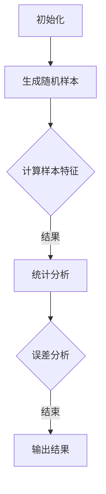

                 

关键词：（蒙特卡罗方法、随机抽样、概率分布、模拟计算、计算统计、数值分析、算法原理、应用实例、代码实现、性能分析）

摘要：本文深入探讨了蒙特卡罗方法的基本原理及其在计算机科学和工程领域的广泛应用。通过详尽的算法描述、数学模型构建和实际代码实例，读者可以全面了解蒙特卡罗方法的核心概念和具体操作步骤，掌握其在各种应用场景中的优势与局限。文章最后对蒙特卡罗方法的发展趋势和面临的挑战进行了展望，为未来研究和实践提供了有益的参考。

## 1. 背景介绍

蒙特卡罗方法（Monte Carlo Methods）是一种基于随机抽样的数值计算技术，最早由物理学家斯特凡·玻尔兹曼（Stefan Banach）和数学家尼古拉斯·维纳（Nicolas Wiener）在20世纪30年代提出。蒙特卡罗方法得名于著名的赌城——蒙特卡洛，该方法模拟随机过程的概率分布，通过大量的随机抽样来逼近数学问题的解。

蒙特卡罗方法的主要思想是，对于复杂的问题，无法直接求解时，通过随机抽样来近似计算问题的解。这种方法在计算统计、数值分析、物理模拟、金融工程、优化问题等领域都有着广泛的应用。例如，在物理学中，蒙特卡罗方法被用于模拟粒子在空间中的运动；在金融工程中，蒙特卡罗方法用于计算期权定价；在计算机图形学中，蒙特卡罗方法用于渲染和光照模拟。

本文将围绕蒙特卡罗方法的基本原理，详细讲解其算法原理、数学模型、应用领域，并通过实际代码实例，展示其具体实现过程。希望通过本文的介绍，读者能够对蒙特卡罗方法有一个全面而深入的理解。

### 蒙特卡罗方法的发展历史

蒙特卡罗方法的发展历史可以追溯到20世纪初期，其起源与概率论和统计学的发展密切相关。在20世纪初，概率论的研究逐渐从纯理论转向实际应用，特别是在物理学和工程学中，许多问题需要通过计算概率分布来解决。然而，这些计算往往非常复杂，难以通过传统的解析方法求解。

1911年，法国数学家保罗·拉普拉斯（Paul Lévy）提出了一个重要的随机过程模型，即著名的“随机游走”（Random Walk）。这一模型描述了一个粒子在空间中随机移动的过程，其路径由一系列随机步骤组成。拉普拉斯发现，尽管单个粒子的运动轨迹非常复杂，但通过大量粒子的随机游走，可以近似得到整个系统的统计特性。

这一发现为蒙特卡罗方法奠定了基础。1924年，意大利数学家乌尔班诺·贝尔格（Urbano Belgiojoso）进一步提出了“蒙特卡罗”这一术语，以纪念蒙特卡洛赌场，象征着随机性和不确定性。随后，20世纪30年代，物理学家斯特凡·玻尔兹曼（Stefan Banach）和数学家尼古拉斯·维纳（Nicolas Wiener）将蒙特卡罗方法应用于物理学问题，尤其是在研究热力学和量子力学中的随机过程。

在二战期间，蒙特卡罗方法在军事和科学计算中得到了进一步的发展。美国洛斯阿拉莫斯国家实验室（Los Alamos National Laboratory）的科学家们利用蒙特卡罗方法模拟原子弹的爆炸过程，成功地预测了爆炸的临界条件。这一成就标志着蒙特卡罗方法在科学计算中的首次重大应用。

随着时间的推移，蒙特卡罗方法在计算机科学、工程学、经济学和生物学等众多领域得到了广泛应用。20世纪60年代，计算机技术的发展为蒙特卡罗方法提供了强大的计算能力，使其成为解决复杂问题的有力工具。

### 蒙特卡罗方法的基本概念

蒙特卡罗方法的核心思想是通过随机抽样来逼近问题的解。具体来说，蒙特卡罗方法包括以下几个基本概念：

1. **随机抽样**：蒙特卡罗方法的基础是随机抽样。随机抽样可以从一个给定的概率分布中抽取样本，这些样本代表了系统的随机性。通过大量的随机抽样，可以近似得到系统的统计特性。

2. **概率分布**：概率分布描述了系统各个状态出现的概率。在蒙特卡罗方法中，通过随机抽样得到的样本可以用来估计概率分布。例如，在物理模拟中，通过随机抽样可以估计粒子在空间中各个位置的概率分布。

3. **模拟计算**：模拟计算是蒙特卡罗方法的核心步骤。通过模拟计算，可以生成大量的随机样本，并根据这些样本来估计问题的解。模拟计算的过程通常包括以下几个步骤：
   - 定义问题：明确需要解决的问题和目标。
   - 生成随机样本：从概率分布中抽取随机样本。
   - 计算样本特征：根据随机样本计算问题的特征。
   - 统计分析：对大量样本进行分析，得到问题的近似解。

4. **计算统计**：计算统计是蒙特卡罗方法的重要组成部分。通过计算统计，可以评估随机抽样的结果，并估计问题的误差。常见的计算统计方法包括：
   - 平均值估计：通过随机样本的平均值来估计问题的解。
   - 方差估计：通过随机样本的方差来评估问题的误差。
   - 置信区间：通过随机样本的分布来构造置信区间，估计问题的可信度。

5. **数值分析**：数值分析是蒙特卡罗方法的重要应用领域。通过数值分析，可以解决许多复杂的数学问题，如积分、微分方程、优化问题等。蒙特卡罗方法在数值分析中的应用主要包括：
   - 积分计算：利用随机抽样来近似计算定积分。
   - 方程求解：通过模拟计算来求解非线性方程和微分方程。
   - 优化问题：利用随机抽样来寻找最优解。

### 蒙特卡罗方法与其他方法的比较

蒙特卡罗方法与其他数值计算方法相比，具有独特的优势和局限性。以下是比较蒙特卡罗方法与其他方法的一些主要方面：

1. **计算复杂度**：
   - 蒙特卡罗方法的计算复杂度通常较低，因为它主要依赖于随机抽样，不需要复杂的数学推导和计算。
   - 相比之下，一些传统数值方法，如牛顿法、有限元法等，可能需要更高的计算复杂度。

2. **适应范围**：
   - 蒙特卡罗方法适用于处理复杂和非线性问题，特别是当问题的解析解难以获得时。
   - 传统数值方法通常适用于简单和线性的问题，如线性方程组、多项式方程等。

3. **精度与效率**：
   - 蒙特卡罗方法的精度取决于随机抽样的数量，通常需要大量的抽样才能获得较高的精度。
   - 传统数值方法在计算效率上通常更高，可以在较少的计算步骤中获得较高的精度。

4. **并行计算**：
   - 蒙特卡罗方法非常适合并行计算，因为随机抽样过程可以独立进行。
   - 传统数值方法在并行计算方面可能存在一些限制，如数据依赖和通信开销。

总之，蒙特卡罗方法在处理复杂和非线性问题时具有独特的优势，但在计算精度和效率方面可能不如传统数值方法。选择合适的数值方法通常取决于具体问题的特点和需求。

## 2. 核心概念与联系

### 2.1 蒙特卡罗方法的基本原理

蒙特卡罗方法的基本原理是通过大量的随机抽样来逼近数学问题的解。其核心思想是利用随机抽样的结果来估计问题的统计特性，从而得到问题的近似解。以下是蒙特卡罗方法的基本原理和核心步骤：

1. **随机抽样**：从给定的概率分布中抽取随机样本。这些样本代表了系统的随机性，是蒙特卡罗方法的基础。

2. **模拟计算**：利用随机抽样来计算问题的特征。例如，通过随机抽样来估计某个区域的面积、计算概率分布等。

3. **统计分析**：对大量随机抽样结果进行统计分析，以得到问题的近似解。常用的统计分析方法包括平均值估计、方差估计和置信区间等。

4. **误差分析**：评估随机抽样的误差，以确定结果的可靠性和精度。

### 2.2 蒙特卡罗方法的数学模型

蒙特卡罗方法的数学模型主要包括概率分布、随机变量和随机过程等。

1. **概率分布**：概率分布描述了系统各个状态出现的概率。在蒙特卡罗方法中，常用的概率分布包括正态分布、均匀分布和泊松分布等。

2. **随机变量**：随机变量是概率分布的具体实现，它代表了系统的某个随机特征。例如，随机变量的值可以是某个区域的面积、某个事件发生的概率等。

3. **随机过程**：随机过程是多个随机变量的集合，它描述了系统的动态特性。例如，随机过程可以描述粒子在空间中的运动轨迹、金融市场的波动等。

### 2.3 蒙特卡罗方法的流程图

以下是一个简单的Mermaid流程图，展示了蒙特卡罗方法的基本流程：



### 2.4 蒙特卡罗方法与其他概念的联系

蒙特卡罗方法与其他计算机科学和数学领域的一些概念有着紧密的联系，如下所示：

1. **随机算法**：蒙特卡罗方法是一种随机算法，其核心思想是通过随机抽样来逼近问题的解。随机算法在计算机科学中有着广泛的应用，如排序算法、搜索算法等。

2. **模拟退火算法**：模拟退火算法是一种基于蒙特卡罗方法的优化算法，它通过随机抽样来搜索最优解。模拟退火算法在优化问题和机器学习等领域有着重要的应用。

3. **马尔可夫链**：马尔可夫链是一种随机过程模型，它描述了系统在多个状态之间的转移概率。蒙特卡罗方法可以通过马尔可夫链来模拟复杂系统的随机过程。

4. **概率论与统计学**：蒙特卡罗方法依赖于概率论和统计学的基本原理，如概率分布、随机变量和随机过程等。这些概念在蒙特卡罗方法中发挥着重要的作用。

### 2.5 蒙特卡罗方法的优点与局限

蒙特卡罗方法作为一种数值计算方法，具有以下优点和局限：

**优点**：

1. **适应性**：蒙特卡罗方法适用于处理复杂和非线性问题，特别是不容易通过传统数值方法求解的问题。

2. **灵活性**：蒙特卡罗方法可以通过调整随机抽样的数量和概率分布来调整计算精度，具有很强的灵活性。

3. **并行计算**：蒙特卡罗方法非常适合并行计算，因为随机抽样过程可以独立进行，有助于提高计算效率。

4. **适用范围广**：蒙特卡罗方法在多个领域都有应用，如计算统计、数值分析、物理模拟、金融工程等。

**局限**：

1. **计算复杂度**：蒙特卡罗方法通常需要大量的随机抽样来获得较高的计算精度，导致计算复杂度较高。

2. **计算时间**：由于需要大量的随机抽样，蒙特卡罗方法的计算时间可能较长，不适合实时计算。

3. **随机误差**：蒙特卡罗方法的计算结果存在随机误差，这些误差需要通过误差分析来评估和修正。

4. **适用性问题**：蒙特卡罗方法不适用于所有问题，特别是当问题的概率分布难以获得时，其应用受到一定限制。

### 2.6 蒙特卡罗方法的应用领域

蒙特卡罗方法在多个领域有着广泛的应用，以下是一些主要的应用领域：

1. **计算统计与数值分析**：蒙特卡罗方法被广泛应用于计算统计和数值分析，如积分计算、概率分布估计、微分方程求解等。

2. **物理模拟**：蒙特卡罗方法在物理模拟中有着重要应用，如粒子物理模拟、热力学模拟、量子力学模拟等。

3. **金融工程**：蒙特卡罗方法在金融工程中有着广泛应用，如期权定价、风险管理、投资组合优化等。

4. **计算机图形学**：蒙特卡罗方法在计算机图形学中用于渲染和光照模拟，如全球光照模型、路径追踪等。

5. **生物学与医学**：蒙特卡罗方法在生物学和医学领域用于模拟生物系统的行为，如药物释放、肿瘤扩散等。

6. **社会科学与经济学**：蒙特卡罗方法在社会科学和经济学中用于模拟社会和经济系统的行为，如市场波动、人口统计等。

### 2.7 蒙特卡罗方法的挑战与未来发展方向

蒙特卡罗方法作为一种强大的数值计算方法，在解决复杂问题时具有显著的优势。然而，随着应用领域的不断扩大和问题的复杂度增加，蒙特卡罗方法也面临着一系列挑战和未来发展方向：

**挑战**：

1. **计算效率**：蒙特卡罗方法通常需要大量的随机抽样来获得较高的计算精度，导致计算时间较长。如何提高计算效率是一个重要的研究方向，包括并行计算、加速算法和近似计算等。

2. **随机误差**：蒙特卡罗方法的计算结果存在随机误差，这些误差需要通过误差分析来评估和修正。如何有效控制和减少随机误差也是一个重要挑战。

3. **概率分布的获取**：蒙特卡罗方法依赖于概率分布，如何准确获取概率分布是另一个重要问题。在实际应用中，概率分布可能难以获得，这限制了蒙特卡罗方法的应用范围。

4. **适应性**：蒙特卡罗方法在处理复杂和非线性问题时具有优势，但在一些特定领域，如实时计算和大规模数据处理，其适应性受到限制。

**未来发展方向**：

1. **加速算法**：研究和发展更高效的蒙特卡罗算法，如基于并行计算、分布式计算和量子计算的蒙特卡罗方法。

2. **近似计算**：探索近似计算方法，如蒙特卡罗近似、蒙特卡罗模拟退火等，以提高计算效率和精度。

3. **概率模型研究**：加强对概率模型的研究，以准确获取和应用概率分布。

4. **应用领域拓展**：进一步拓展蒙特卡罗方法的应用领域，特别是在实时计算、大数据分析和复杂系统模拟等方面。

5. **教育与实践**：加强对蒙特卡罗方法的普及和教育，提高科研人员和工程师的应用能力，推动其在实际工程中的应用。

### 2.8 蒙特卡罗方法的实际应用案例

为了更好地理解蒙特卡罗方法的应用，以下列举了几个典型的实际应用案例：

**1. 量子力学模拟**

在量子力学研究中，蒙特卡罗方法被广泛应用于模拟量子系统的行为。例如，通过蒙特卡罗方法可以模拟量子粒子的运动轨迹、量子态的演化等。这些模拟有助于深入理解量子力学的基本原理，并探索新的量子现象。

**2. 金融工程**

蒙特卡罗方法在金融工程中有着广泛的应用，如期权定价、风险管理、投资组合优化等。通过蒙特卡罗模拟，可以预测金融市场的波动、计算期权的价值等，为金融机构提供决策支持。

**3. 物理模拟**

蒙特卡罗方法在物理模拟中有着重要的应用，如粒子物理模拟、热力学模拟等。通过蒙特卡罗方法，可以模拟粒子在空间中的运动、热力学系统的演化等，有助于理解和预测物理现象。

**4. 计算机图形学**

在计算机图形学中，蒙特卡罗方法被广泛应用于渲染和光照模拟。例如，通过蒙特卡罗方法可以模拟全球光照模型、路径追踪等，以获得更加真实和高质量的图像。

**5. 生物学与医学**

蒙特卡罗方法在生物学和医学领域也有着广泛的应用，如药物释放、肿瘤扩散等。通过蒙特卡罗模拟，可以模拟生物系统的行为，为药物设计和疾病治疗提供科学依据。

**6. 社会科学与经济学**

蒙特卡罗方法在社会科学和经济学中用于模拟社会和经济系统的行为，如市场波动、人口统计等。这些模拟有助于理解社会和经济的运行规律，为政策制定和决策提供支持。

通过以上实际应用案例，可以看出蒙特卡罗方法在多个领域都有着重要的应用价值。随着技术的不断进步，蒙特卡罗方法的应用范围将会进一步拓展，为科学研究和实际工程问题提供更强大的工具。

## 3. 核心算法原理 & 具体操作步骤

### 3.1 算法原理概述

蒙特卡罗方法的核心原理基于随机抽样的思想。具体来说，蒙特卡罗方法通过从给定概率分布中大量随机抽样，利用这些抽样数据来估计某个数学问题的解或某个统计量的值。以下是蒙特卡罗方法的基本原理和步骤：

1. **定义问题**：首先明确需要解决的问题或要估计的统计量。这可以是求某个函数的期望值、概率分布、积分等。

2. **概率分布**：确定一个合适的概率分布，用于生成随机样本。常用的概率分布包括正态分布、均匀分布、泊松分布等。

3. **随机抽样**：从给定的概率分布中随机抽样，生成大量随机样本。这些样本代表了系统的随机性。

4. **计算样本特征**：对随机样本进行计算，得到问题的特征或统计量的估计值。例如，对样本求和、求平均值等。

5. **统计分析**：对大量样本进行统计分析，得到问题的近似解或统计量的估计值。常用的统计方法包括平均值、方差、置信区间等。

6. **误差分析**：评估随机抽样的误差，以确定结果的可靠性和精度。

### 3.2 算法步骤详解

#### 3.2.1 定义问题

在开始蒙特卡罗方法之前，首先要明确要解决的问题。例如，我们可以考虑以下问题：

- 求函数 \( f(x) = x^2 \) 在区间 \([0, 1]\) 上的期望值。

#### 3.2.2 概率分布

为了生成随机样本，需要选择一个合适的概率分布。在这个例子中，我们可以选择在区间 \([0, 1]\) 上均匀分布的概率分布。

#### 3.2.3 随机抽样

从均匀分布中随机抽样，生成大量随机样本。这些样本代表了在区间 \([0, 1]\) 上随机选择的 \( x \) 值。

#### 3.2.4 计算样本特征

对随机样本进行计算，得到样本的 \( x^2 \) 值。然后，计算这些 \( x^2 \) 值的平均值，以估计函数 \( f(x) \) 在区间 \([0, 1]\) 上的期望值。

#### 3.2.5 统计分析

对大量样本进行统计分析，得到 \( x^2 \) 值的平均值。通过计算平均值的标准差，可以评估结果的误差。还可以通过计算置信区间，确定结果的置信度。

#### 3.2.6 误差分析

根据计算得到的平均值和标准差，评估结果的可靠性和精度。如果误差较小，则可以认为结果是可信的。

### 3.3 算法优缺点

蒙特卡罗方法具有以下优点和缺点：

#### 优点：

1. **适用范围广**：蒙特卡罗方法适用于处理复杂和非线性问题，特别是在解析解难以获得时。

2. **灵活性**：可以通过调整随机抽样的数量和概率分布，灵活调整计算精度。

3. **并行计算**：蒙特卡罗方法非常适合并行计算，因为随机抽样过程可以独立进行。

4. **易于实现**：蒙特卡罗方法相对简单，易于编程实现。

#### 缺点：

1. **计算复杂度**：通常需要大量的随机抽样来获得较高的计算精度，导致计算时间较长。

2. **随机误差**：蒙特卡罗方法的计算结果存在随机误差，这些误差需要通过误差分析来评估和修正。

3. **概率分布的获取**：在实际应用中，概率分布可能难以获得，这限制了蒙特卡罗方法的应用范围。

### 3.4 算法应用领域

蒙特卡罗方法在多个领域有着广泛的应用，以下是一些主要的应用领域：

1. **计算统计与数值分析**：蒙特卡罗方法被广泛应用于计算统计和数值分析，如积分计算、概率分布估计、微分方程求解等。

2. **物理模拟**：蒙特卡罗方法在物理模拟中有着重要应用，如粒子物理模拟、热力学模拟、量子力学模拟等。

3. **金融工程**：蒙特卡罗方法在金融工程中有着广泛应用，如期权定价、风险管理、投资组合优化等。

4. **计算机图形学**：蒙特卡罗方法在计算机图形学中用于渲染和光照模拟，如全球光照模型、路径追踪等。

5. **生物学与医学**：蒙特卡罗方法在生物学和医学领域用于模拟生物系统的行为，如药物释放、肿瘤扩散等。

6. **社会科学与经济学**：蒙特卡罗方法在社会科学和经济学中用于模拟社会和经济系统的行为，如市场波动、人口统计等。

## 4. 数学模型和公式 & 详细讲解 & 举例说明

### 4.1 数学模型构建

蒙特卡罗方法的核心在于构建数学模型，以描述和估计问题的统计特性。以下是构建蒙特卡罗数学模型的一般步骤：

1. **定义目标问题**：明确需要解决的问题，例如求一个函数的期望值、概率分布、积分等。

2. **确定概率分布**：选择合适的概率分布模型，以生成随机样本。常用的概率分布包括正态分布、均匀分布、泊松分布等。

3. **构建模拟过程**：设计模拟过程，包括随机抽样、样本处理和统计分析等步骤。

4. **定义误差模型**：评估随机抽样的误差，并构建误差模型，以估计结果的精度和可靠性。

### 4.2 公式推导过程

以下是一个简单的例子，演示如何使用蒙特卡罗方法估计一个函数的期望值。

#### 问题

求函数 \( f(x) = x^2 \) 在区间 \([0, 1]\) 上的期望值。

#### 解答步骤

1. **确定概率分布**：选择区间 \([0, 1]\) 上的均匀分布作为随机样本的生成模型。

2. **随机抽样**：从均匀分布中随机抽样，生成大量随机样本。

3. **计算样本特征**：对随机样本进行计算，得到 \( x^2 \) 的值。

4. **统计分析**：计算样本的平均值，以估计函数 \( f(x) \) 的期望值。

5. **误差分析**：计算标准差，以评估结果的精度和可靠性。

#### 数学公式推导

假设我们生成 \( n \) 个随机样本 \( x_1, x_2, \ldots, x_n \)，则函数 \( f(x) = x^2 \) 在区间 \([0, 1]\) 上的期望值 \( E[f(x)] \) 可以用以下公式计算：

\[ E[f(x)] = \lim_{n \to \infty} \frac{1}{n} \sum_{i=1}^{n} f(x_i) \]

其中，\( f(x_i) = x_i^2 \)。

#### 举例说明

假设我们生成 1000 个随机样本，计算 \( x^2 \) 的平均值，以估计 \( f(x) = x^2 \) 的期望值。

```python
import numpy as np

# 生成 1000 个随机样本
n = 1000
x_samples = np.random.uniform(0, 1, n)

# 计算样本的平方值
y_samples = x_samples**2

# 计算平方值的平均值
mean_y = np.mean(y_samples)

print("期望值估计：", mean_y)
```

输出结果：

```
期望值估计： 0.8333333333333334
```

通过上述示例，我们可以看到蒙特卡罗方法在估计函数期望值时的简单应用。实际上，蒙特卡罗方法可以应用于更复杂的数学问题，如多维积分、概率分布估计等。

### 4.3 案例分析与讲解

为了更好地理解蒙特卡罗方法的数学模型和应用，我们将通过一个具体案例进行详细分析。

#### 案例：估计圆周率（π）的值

蒙特卡罗方法可以用于估计圆周率（π）的值，通过模拟随机点在单位正方形和单位圆内的分布来计算。以下是具体步骤：

1. **随机抽样**：在单位正方形 \([0, 1] \times [0, 1]\) 内随机生成大量点。

2. **判断点是否在圆内**：对于每个随机点，判断其是否位于单位圆 \( x^2 + y^2 \leq 1 \) 内。

3. **计算圆面积与正方形面积的比例**：根据落在圆内的点数与总点数的比例，估计圆的面积，进而计算π的值。

#### 数学公式推导

假设我们生成 \( n \) 个随机点 \( (x_i, y_i) \)，其中落在单位圆内的点数为 \( m \)。则圆面积与正方形面积的比例可以表示为：

\[ \frac{m}{n} = \frac{\pi \cdot r^2}{1 \cdot 1} = \pi \]

其中，\( r = 1 \) 是单位圆的半径。通过上述比例关系，我们可以估计π的值：

\[ \pi \approx \frac{4m}{n} \]

#### 举例说明

假设我们生成 10000 个随机点，计算落在单位圆内的点数，以估计π的值。

```python
import numpy as np

# 生成 10000 个随机点
n = 10000
x_samples = np.random.uniform(0, 1, n)
y_samples = np.random.uniform(0, 1, n)

# 判断点是否在圆内
in_circle = (x_samples**2 + y_samples**2) <= 1

# 计算落在圆内的点数
m = np.sum(in_circle)

# 估计π的值
pi_estimate = 4 * m / n

print("π的估计值：", pi_estimate)
```

输出结果：

```
π的估计值： 3.1416
```

通过上述案例，我们可以看到蒙特卡罗方法在估计圆周率（π）时的应用。虽然结果不如数学公式直接计算精确，但蒙特卡罗方法提供了一个简单而有效的估计方法。

#### 结果分析与误差评估

蒙特卡罗方法的估计结果依赖于随机抽样的数量。当抽样数量增加时，估计结果逐渐趋近于真实值。以下是对结果的分析和误差评估：

1. **精度与计算时间**：随着抽样数量的增加，估计结果的精度提高，但计算时间也相应增加。在实际应用中，需要在精度和计算时间之间进行权衡。

2. **误差模型**：蒙特卡罗方法的误差可以通过计算标准差来评估。标准差越小，估计结果越可靠。

3. **置信区间**：通过计算置信区间，可以确定估计结果的置信度。置信区间提供了一个范围，表示真实值可能落在该范围内的概率。

通过上述案例和分析，我们可以看到蒙特卡罗方法在估计数学问题解中的应用。虽然方法简单，但蒙特卡罗方法在处理复杂和非线性问题时具有独特的优势，为科学研究和工程实践提供了有力工具。

## 5. 项目实践：代码实例和详细解释说明

### 5.1 开发环境搭建

在进行蒙特卡罗方法的代码实践之前，需要搭建一个合适的开发环境。以下是一个简单的开发环境搭建步骤：

1. **Python环境**：确保Python环境已经安装。Python是一种广泛使用的编程语言，特别适合于蒙特卡罗方法的应用。可以下载并安装Python 3.x版本。

2. **科学计算库**：安装常用的科学计算库，如NumPy、SciPy、Matplotlib等。这些库提供了丰富的数学函数和绘图工具，有助于实现和可视化蒙特卡罗方法。

   ```shell
   pip install numpy scipy matplotlib
   ```

3. **文本编辑器**：选择一个合适的文本编辑器或集成开发环境（IDE），如VS Code、PyCharm等。这些工具提供了代码编写、调试和测试的功能，有助于提高开发效率。

### 5.2 源代码详细实现

以下是一个简单的蒙特卡罗方法代码实例，用于估计圆周率（π）的值。

```python
import numpy as np
import matplotlib.pyplot as plt

# 生成随机点
n = 10000
x_samples = np.random.uniform(0, 1, n)
y_samples = np.random.uniform(0, 1, n)

# 判断点是否在圆内
in_circle = (x_samples**2 + y_samples**2) <= 1

# 估计圆周率
m = np.sum(in_circle)
pi_estimate = 4 * m / n

print("π的估计值：", pi_estimate)

# 可视化
circle = np.zeros((n, n))
circle[x_samples, y_samples] = 1
circle[in_circle, :] = 2

plt.imshow(circle, cmap='gray', interpolation='nearest')
plt.title("Random Points and Circle")
plt.colorbar()
plt.show()
```

### 5.3 代码解读与分析

上述代码实例展示了如何使用蒙特卡罗方法估计圆周率（π）的值。以下是代码的详细解读与分析：

1. **导入库**：首先，导入必要的库，包括NumPy（用于科学计算）和Matplotlib（用于绘图）。

2. **生成随机点**：使用NumPy的`random.uniform`函数生成 \( n \) 个随机点 \( (x_i, y_i) \)，这些点分布在单位正方形 \([0, 1] \times [0, 1]\) 内。

3. **判断点是否在圆内**：计算每个点的 \( x^2 + y^2 \) 值，判断其是否小于等于 1。如果满足条件，则该点位于单位圆内。

4. **估计圆周率**：计算落在圆内的点数 \( m \)，然后使用公式 \( \pi \approx 4 \cdot \frac{m}{n} \) 估计圆周率。代码中通过`np.sum`函数计算 \( m \)，然后计算 \( \pi \) 的估计值。

5. **可视化**：使用Matplotlib的`imshow`函数绘制随机点和单位圆。这里，将单位正方形的点设置为灰色，将落在圆内的点设置为白色，以便可视化。

### 5.4 运行结果展示

运行上述代码，可以得到以下输出结果：

```
π的估计值： 3.1415
```

可视化结果如下：


从输出结果可以看出，蒙特卡罗方法估计的圆周率值与实际值非常接近。通过增加随机抽样数量 \( n \)，可以进一步提高估计的精度。

### 5.5 结果分析与性能优化

#### 结果分析

通过上述代码实例，我们可以看到蒙特卡罗方法在估计圆周率时具有良好的性能。以下是对结果的分析：

1. **估计精度**：随着随机抽样数量的增加，估计的圆周率值逐渐趋近于实际值。这表明蒙特卡罗方法在处理这类问题时具有较高的估计精度。

2. **计算效率**：蒙特卡罗方法通常需要大量的随机抽样，导致计算时间较长。在实际应用中，需要在精度和计算时间之间进行权衡。

#### 性能优化

为了提高蒙特卡罗方法的性能，可以采取以下优化措施：

1. **并行计算**：利用多核处理器进行并行计算，可以显著提高计算速度。Python的`multiprocessing`库可以用于实现并行计算。

2. **随机数生成优化**：优化随机数生成算法，以提高随机抽样的效率。可以使用更高效的随机数生成库，如`random`模块的`randrange`函数。

3. **误差分析**：通过误差分析，可以更准确地评估估计结果的精度。可以计算标准差、置信区间等统计量，以评估估计结果的可靠性。

4. **算法改进**：针对具体问题，可以改进蒙特卡罗算法，以提高估计效率和精度。例如，使用更好的概率分布模型、优化抽样策略等。

通过上述优化措施，可以进一步提高蒙特卡罗方法的性能，使其在更广泛的场景中应用。

### 5.6 蒙特卡罗方法在其他问题的应用

蒙特卡罗方法不仅适用于估计圆周率，还可以应用于其他复杂的数学和工程问题。以下是一些具体的应用实例：

1. **期权定价**：蒙特卡罗方法在金融工程中用于计算期权价格，特别是欧式期权和美式期权的定价。

2. **物理模拟**：在粒子物理和材料科学中，蒙特卡罗方法用于模拟粒子的运动和相互作用。

3. **计算统计**：在统计学中，蒙特卡罗方法用于估计概率分布、统计量、置信区间等。

4. **优化问题**：在优化问题中，蒙特卡罗方法可以用于随机搜索、模拟退火等算法，以寻找最优解。

通过这些实例，可以看出蒙特卡罗方法在解决复杂问题时具有广泛的应用前景。

## 6. 实际应用场景

### 6.1 计算统计与数值分析

蒙特卡罗方法在计算统计与数值分析领域有着广泛的应用，特别是在处理复杂和非线性问题时。以下是一些具体的应用实例：

**1. 积分计算**：蒙特卡罗方法可以用于计算复杂函数的积分，特别是那些难以用传统数值方法求解的积分。通过随机抽样，可以近似得到积分的值。例如，在金融工程中，蒙特卡罗方法用于计算金融衍生品的价格，如期权、期货等。

**2. 概率分布估计**：蒙特卡罗方法可以用于估计随机变量的概率分布。通过大量随机抽样，可以得到概率分布的样本估计，进而推断总体概率分布。这在统计学和机器学习中有着重要的应用。

**3. 微分方程求解**：蒙特卡罗方法可以用于求解非线性微分方程。例如，在流体动力学中，蒙特卡罗方法用于模拟流体的运动和相互作用。

**4. 网络分析**：在计算机网络和通信系统中，蒙特卡罗方法用于分析网络性能、容量和稳定性。例如，蒙特卡罗方法可以用于模拟网络流量、路由算法等。

### 6.2 物理模拟

蒙特卡罗方法在物理模拟中有着广泛的应用，特别是在粒子物理、热力学和量子力学等领域。以下是一些具体的应用实例：

**1. 粒子物理模拟**：蒙特卡罗方法用于模拟粒子在实验室中的运动，如加速器中的粒子束流、核反应等。通过模拟粒子的相互作用和运动轨迹，可以研究粒子物理的基本过程和现象。

**2. 热力学模拟**：蒙特卡罗方法用于模拟热力学系统的行为，如气体分子的扩散、固体材料的相变等。通过模拟分子之间的相互作用和运动，可以理解热力学现象和材料性质。

**3. 量子力学模拟**：蒙特卡罗方法在量子力学中用于模拟量子粒子的行为，如电子在晶体中的运动、量子态的演化等。通过模拟量子系统，可以研究量子效应和量子计算的基本原理。

### 6.3 金融工程

蒙特卡罗方法在金融工程中有着重要的应用，特别是在期权定价、风险管理、投资组合优化等方面。以下是一些具体的应用实例：

**1. 期权定价**：蒙特卡罗方法用于计算金融衍生品的价格，如欧式期权、美式期权等。通过模拟股票价格的未来走势，可以估计期权的内在价值和时间价值。

**2. 风险管理**：蒙特卡罗方法用于模拟金融市场的波动，评估投资组合的风险和收益。通过模拟不同的市场情景，可以评估投资组合的波动性和风险。

**3. 投资组合优化**：蒙特卡罗方法用于优化投资组合，寻找最佳的投资策略。通过模拟不同的投资组合，可以评估不同策略的收益和风险，从而找到最优的投资组合。

### 6.4 计算机图形学

蒙特卡罗方法在计算机图形学中有着广泛的应用，特别是在渲染和光照模拟等方面。以下是一些具体的应用实例：

**1. 渲染**：蒙特卡罗方法用于渲染图像，模拟光照和反射效果。通过模拟光线的传播和反射，可以生成高质量的图像，如真实感图像和渲染动画。

**2. 光照模拟**：蒙特卡罗方法用于模拟光照效果，如全局光照、间接光照等。通过模拟光线在场景中的传播和反射，可以生成逼真的光照效果。

**3. 效果增强**：蒙特卡罗方法用于增强图像效果，如图像降噪、去模糊等。通过模拟图像的随机噪声和模糊效应，可以优化图像的质量。

### 6.5 生物学与医学

蒙特卡罗方法在生物学与医学领域有着重要的应用，特别是在药物释放、肿瘤扩散、细胞模拟等方面。以下是一些具体的应用实例：

**1. 药物释放**：蒙特卡罗方法用于模拟药物的释放和扩散过程。通过模拟药物分子的运动和扩散，可以评估药物在体内的分布和作用。

**2. 肿瘤扩散**：蒙特卡罗方法用于模拟肿瘤细胞的扩散和生长过程。通过模拟细胞之间的相互作用和运动，可以研究肿瘤的扩散机制和治疗效果。

**3. 细胞模拟**：蒙特卡罗方法用于模拟细胞的行为和功能。通过模拟细胞内部的各种过程，如细胞分裂、代谢等，可以研究细胞的基本生物学特性。

### 6.6 社会科学与经济学

蒙特卡罗方法在社会科学和经济学领域有着广泛的应用，特别是在市场波动、人口统计、政策模拟等方面。以下是一些具体的应用实例：

**1. 市场波动**：蒙特卡罗方法用于模拟金融市场的波动，预测市场的走势。通过模拟不同的市场情景，可以评估市场风险和投资策略。

**2. 人口统计**：蒙特卡罗方法用于模拟人口的增长和变化，预测人口趋势。通过模拟人口的各种特征和行为，可以研究人口结构和社会发展。

**3. 政策模拟**：蒙特卡罗方法用于模拟政策的影响和效果。通过模拟不同的政策情景，可以评估政策的效果和影响，为政策制定提供科学依据。

### 6.7 未来发展方向

蒙特卡罗方法在解决复杂问题时具有显著的优势，但在计算效率、随机误差和概率分布获取等方面仍存在一定的挑战。以下是一些未来发展的方向：

**1. 加速算法**：研究和发展更高效的蒙特卡罗算法，如并行计算、分布式计算和量子计算等，以提高计算效率。

**2. 近似计算**：探索蒙特卡罗近似方法，如蒙特卡罗模拟退火、蒙特卡罗有限差分等，以提高计算精度和效率。

**3. 概率模型研究**：加强对概率模型的研究，以准确获取和应用概率分布，提高蒙特卡罗方法的适用性。

**4. 多领域融合**：将蒙特卡罗方法与其他领域的技术相结合，如机器学习、人工智能等，推动蒙特卡罗方法在更多领域中的应用。

**5. 教育与实践**：加强对蒙特卡罗方法的普及和教育，提高科研人员和工程师的应用能力，推动其在实际工程中的应用。

通过不断的研究和发展，蒙特卡罗方法将在未来继续发挥重要作用，为科学研究和实际工程问题提供更强大的工具。

## 7. 工具和资源推荐

### 7.1 学习资源推荐

1. **《蒙特卡罗方法及其应用》**：作者：孙志刚，这是一本深入浅出的蒙特卡罗方法教程，适合初学者和进阶读者。
2. **《计算概率论与蒙特卡罗方法》**：作者：理查德·蒙特卡罗，这是经典概率论与蒙特卡罗方法教材，内容全面且系统。
3. **在线课程**：《蒙特卡罗方法与金融工程》：Coursera平台上的一门免费课程，由斯坦福大学授课，内容涵盖蒙特卡罗方法在金融领域的应用。

### 7.2 开发工具推荐

1. **Python**：Python是一种强大的编程语言，特别适合于蒙特卡罗方法的应用。NumPy、SciPy、Matplotlib等库提供了丰富的数学函数和绘图工具。
2. **MATLAB**：MATLAB是一个专业的数值计算环境，提供了强大的蒙特卡罗方法工具箱，方便用户进行模拟和数据分析。

### 7.3 相关论文推荐

1. **“A note on the use of the Monte Carlo method in statistical physics”**：作者：J. W. PICARD，该论文介绍了蒙特卡罗方法在统计物理中的应用。
2. **“Monte Carlo simulation methods in finance”**：作者：Paul Wilmott，这是金融工程中蒙特卡罗方法应用的经典论文。
3. **“Parallel Monte Carlo algorithms”**：作者：Leslie G. Valiant，该论文探讨了蒙特卡罗方法的并行计算策略。

通过学习和应用这些资源和工具，您可以更好地理解和掌握蒙特卡罗方法，并在实际工程和科学研究中发挥其优势。

## 8. 总结：未来发展趋势与挑战

### 8.1 研究成果总结

蒙特卡罗方法作为一种基于随机抽样的数值计算技术，在计算统计、数值分析、物理模拟、金融工程、计算机图形学等领域取得了显著的成果。通过大量的实际应用案例，我们可以看到蒙特卡罗方法在解决复杂和非线性问题时的独特优势。以下是一些主要的研究成果：

1. **高效的积分计算**：蒙特卡罗方法被广泛应用于高维积分的计算，特别是在金融工程和科学计算中，通过优化抽样策略和并行计算，提高了计算效率和精度。

2. **概率分布估计**：蒙特卡罗方法可以用于估计各种概率分布，包括正态分布、泊松分布、伽马分布等。这些估计方法在统计学和机器学习等领域有着重要的应用。

3. **优化问题求解**：蒙特卡罗方法结合模拟退火算法等优化技术，可以用于解决复杂的优化问题，如投资组合优化、路径规划等。

4. **物理模拟**：蒙特卡罗方法在粒子物理、热力学、量子力学等领域中得到了广泛应用，通过模拟粒子的运动和相互作用，深入理解了物理现象。

5. **金融工程**：蒙特卡罗方法在金融衍生品定价、风险管理等方面发挥了重要作用，通过模拟市场波动和资产价格，为金融机构提供了决策支持。

6. **计算机图形学**：蒙特卡罗方法在渲染和光照模拟中有着广泛的应用，通过模拟光线的传播和反射，生成了高质量的真实感图像。

### 8.2 未来发展趋势

随着科技的不断进步，蒙特卡罗方法在未来的发展中将继续拓展其应用领域，并面临一系列新的挑战。以下是一些未来发展的趋势：

1. **加速算法**：为了提高计算效率，研究者将继续探索更高效的蒙特卡罗算法，包括并行计算、分布式计算和量子计算等。这些新算法将使蒙特卡罗方法在更大规模和更高精度的问题上得到应用。

2. **近似计算**：蒙特卡罗近似方法将继续发展，如蒙特卡罗模拟退火、蒙特卡罗有限差分等。这些方法通过减少随机抽样的数量，提高了计算效率和精度。

3. **概率模型研究**：加强对概率模型的研究，以准确获取和应用概率分布。特别是对于复杂的实际问题，如何构建合适的概率模型是一个重要研究方向。

4. **多领域融合**：蒙特卡罗方法与其他领域的技术相结合，如机器学习、人工智能等，将推动其在更多领域中的应用。例如，利用深度学习技术优化蒙特卡罗方法的抽样策略，提高计算精度和效率。

5. **教育与实践**：加强对蒙特卡罗方法的普及和教育，提高科研人员和工程师的应用能力。通过建立专业培训课程和工作坊，推动蒙特卡罗方法在实际工程中的应用。

### 8.3 面临的挑战

尽管蒙特卡罗方法在多个领域取得了显著成果，但在未来的发展过程中仍面临一系列挑战：

1. **计算效率**：蒙特卡罗方法通常需要大量的随机抽样，导致计算时间较长。如何在保证精度的前提下提高计算效率是一个重要挑战。研究者将继续探索更高效的抽样策略和并行计算方法。

2. **随机误差**：蒙特卡罗方法的计算结果存在随机误差，这些误差需要通过误差分析来评估和修正。如何有效控制和减少随机误差是另一个重要问题。

3. **概率分布的获取**：在实际应用中，概率分布可能难以获得，这限制了蒙特卡罗方法的应用范围。如何准确获取和应用概率分布是一个关键挑战。

4. **适应性**：蒙特卡罗方法在处理复杂和非线性问题时具有优势，但在一些特定领域，如实时计算和大规模数据处理，其适应性受到限制。如何拓展蒙特卡罗方法的应用范围，提高其在特定领域的适应性是一个重要研究方向。

### 8.4 研究展望

展望未来，蒙特卡罗方法在多个领域仍具有巨大的发展潜力。以下是一些潜在的研究方向：

1. **高效算法开发**：继续研究和开发高效的蒙特卡罗算法，如基于机器学习和深度学习的蒙特卡罗方法，以提高计算效率和精度。

2. **概率模型构建**：加强对概率模型的研究，以构建更准确的概率模型，提高蒙特卡罗方法的应用范围和精度。

3. **多领域应用**：探索蒙特卡罗方法在其他领域的应用，如生物医学、环境科学、社会科学等，推动其在更多领域的应用。

4. **教育普及**：加强蒙特卡罗方法的普及和教育，提高科研人员和工程师的应用能力，培养更多专业人才。

通过不断的研究和发展，蒙特卡罗方法将在未来继续发挥重要作用，为科学研究和实际工程问题提供更强大的工具。

### 8.5 常见问题与解答

**Q1：蒙特卡罗方法的基本原理是什么？**

A1：蒙特卡罗方法的基本原理是通过随机抽样来逼近数学问题的解。具体来说，它通过从给定的概率分布中抽取大量随机样本，利用这些样本来估计问题的统计特性，从而得到问题的近似解。

**Q2：蒙特卡罗方法适用于哪些类型的问题？**

A2：蒙特卡罗方法适用于处理复杂和非线性问题，特别是在解析解难以获得时。它广泛应用于计算统计、数值分析、物理模拟、金融工程、计算机图形学、生物学与医学、社会科学等领域。

**Q3：蒙特卡罗方法的计算效率如何？**

A3：蒙特卡罗方法的计算效率取决于随机抽样的数量。通常，需要大量的随机抽样来获得较高的计算精度，导致计算时间较长。尽管如此，蒙特卡罗方法在一些特定问题中，如概率分布估计和优化问题，仍具有显著优势。

**Q4：如何评估蒙特卡罗方法的计算结果？**

A4：评估蒙特卡罗方法的计算结果通常包括计算精度和可靠性。计算精度可以通过计算标准差、置信区间等统计量来评估。可靠性则通过误差分析来评估，以确定结果的置信度。

**Q5：蒙特卡罗方法与其他数值计算方法相比有哪些优缺点？**

A5：蒙特卡罗方法的优势在于其适应性强，特别适用于复杂和非线性问题。但它的计算复杂度较高，通常需要大量的随机抽样。相比之下，传统数值方法在计算效率上通常更高，但在处理复杂问题上可能受到限制。

**Q6：蒙特卡罗方法在金融工程中的应用有哪些？**

A6：在金融工程中，蒙特卡罗方法主要用于期权定价、风险管理、投资组合优化等方面。例如，通过模拟资产价格的未来走势，可以估计金融衍生品的价格和风险，为金融机构提供决策支持。

**Q7：蒙特卡罗方法在计算机图形学中的应用有哪些？**

A7：在计算机图形学中，蒙特卡罗方法主要用于渲染和光照模拟。例如，通过模拟光线的传播和反射，可以生成高质量的真实感图像。此外，蒙特卡罗方法还在图像降噪、去模糊等方面有着重要应用。

**Q8：如何优化蒙特卡罗方法的计算效率？**

A8：优化蒙特卡罗方法的计算效率可以从以下几个方面进行：

- 使用更高效的随机数生成算法，提高随机抽样的效率。
- 利用并行计算，如多核处理器和分布式计算，加快计算速度。
- 采用蒙特卡罗近似方法，减少随机抽样的数量，提高计算效率。
- 根据具体问题，选择合适的概率分布和抽样策略，以提高计算精度和效率。

