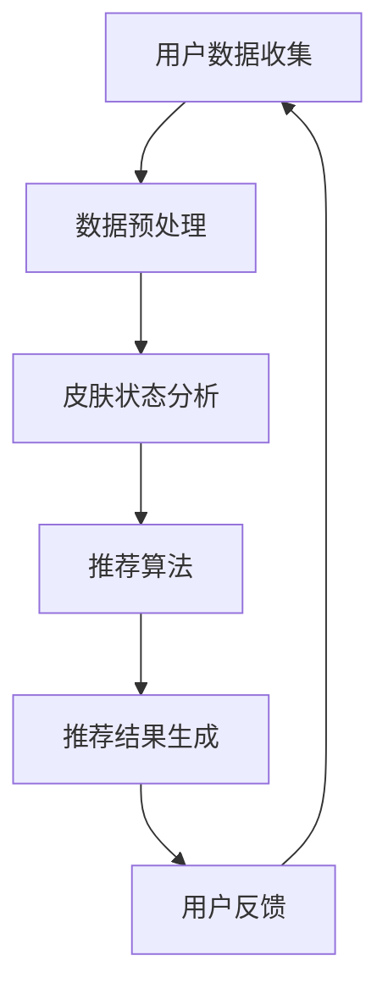

                 

关键词：薇诺娜、校招、敏感肌护理、推荐系统、工程师

摘要：本文将深入探讨薇诺娜2024年校招中针对敏感肌护理方案推荐系统工程师的职位要求和技术挑战，从背景介绍、核心概念、算法原理、数学模型、项目实践、应用场景、工具和资源推荐以及未来发展展望等方面进行详细分析。

## 1. 背景介绍

薇诺娜作为国内知名的敏感肌肤护理品牌，其2024年校招活动旨在寻找具有创新思维和专业技术能力的人才，特别是在敏感肌护理方案推荐系统方面。随着人工智能和大数据技术的不断发展，推荐系统在个性化护肤方案中的应用变得越来越重要。因此，薇诺娜特别关注具有相关背景和技能的应届毕业生。

敏感肌肤护理是一个复杂且个性化的领域，涉及皮肤学、生物信息学、机器学习等多个学科。为了提供更加精准和有效的护理方案，薇诺娜需要开发一个智能化的推荐系统，该系统能够根据用户的数据和需求，提供个性化的敏感肌肤护理建议。

## 2. 核心概念与联系

在构建敏感肌护理方案推荐系统之前，我们需要理解几个核心概念，包括用户数据收集、皮肤状态分析、个性化推荐算法等。

### 2.1 用户数据收集

用户数据是推荐系统的基石。这些数据可以包括用户的年龄、性别、皮肤类型、生活习惯、过敏史、护肤偏好等。为了收集这些数据，薇诺娜可以通过在线问卷、用户注册信息、皮肤检测设备等多种途径。

### 2.2 皮肤状态分析

皮肤状态分析是推荐系统的关键环节。通过对用户数据进行分析，系统可以识别用户的皮肤问题，如敏感、干燥、油性等。这通常需要结合皮肤学知识，以及计算机视觉和图像处理技术。

### 2.3 个性化推荐算法

个性化推荐算法是推荐系统的核心。常见的推荐算法包括基于内容的推荐、协同过滤推荐、基于模型的推荐等。薇诺娜的推荐系统需要根据用户数据，实现实时、高效的个性化推荐。

### 2.4 Mermaid 流程图

下面是一个简化的Mermaid流程图，描述了敏感肌护理方案推荐系统的核心流程。



## 3. 核心算法原理 & 具体操作步骤

### 3.1 算法原理概述

敏感肌护理方案推荐系统采用的算法可以是基于内容的推荐或协同过滤推荐。基于内容的推荐算法根据用户的兴趣和偏好推荐相关的护理产品或方案。协同过滤推荐算法则根据用户之间的相似度推荐产品或方案。

### 3.2 算法步骤详解

#### 3.2.1 基于内容的推荐算法

1. **特征提取**：从用户数据中提取特征，如皮肤类型、过敏源等。
2. **内容匹配**：将提取的特征与数据库中的产品或方案进行匹配。
3. **推荐生成**：根据匹配结果生成推荐列表。

#### 3.2.2 协同过滤推荐算法

1. **用户相似度计算**：计算用户之间的相似度，可以使用基于用户评分的协同过滤或基于模型的协同过滤。
2. **推荐生成**：根据相似度矩阵生成推荐列表。

### 3.3 算法优缺点

#### 3.3.1 基于内容的推荐算法

- **优点**：推荐结果与用户兴趣紧密相关，易于实现。
- **缺点**：无法捕捉用户之间的交互信息，可能导致推荐结果单一。

#### 3.3.2 协同过滤推荐算法

- **优点**：能够捕捉用户之间的交互信息，推荐结果多样化。
- **缺点**：需要大量的用户数据，计算复杂度高。

### 3.4 算法应用领域

敏感肌护理方案推荐系统不仅可以应用于薇诺娜，还可以推广到其他护肤品牌，甚至是整个美妆行业。未来，随着技术的不断发展，该系统有望应用于更多个性化消费领域。

## 4. 数学模型和公式 & 详细讲解 & 举例说明

### 4.1 数学模型构建

在敏感肌护理方案推荐系统中，我们通常使用以下数学模型：

#### 4.1.1 基于内容的推荐模型

$$
R(u, p) = \sum_{i \in I(u)} w_{i} \cdot c_{i}(u) \cdot c_{i}(p)
$$

其中，$R(u, p)$表示用户$u$对产品$p$的推荐度，$I(u)$表示用户$u$的兴趣标签集合，$w_{i}$表示兴趣标签$i$的权重，$c_{i}(u)$和$c_{i}(p)$分别表示用户$u$和产品$p$对兴趣标签$i$的匹配度。

#### 4.1.2 协同过滤推荐模型

$$
R(u, p) = \frac{\sum_{v \in N(u)} r_{v}(p) \cdot s_{uv}}{\sum_{v \in N(u)} s_{uv}}
$$

其中，$R(u, p)$表示用户$u$对产品$p$的推荐度，$N(u)$表示与用户$u$相似的用户集合，$r_{v}(p)$表示用户$v$对产品$p$的评分，$s_{uv}$表示用户$u$和用户$v$之间的相似度。

### 4.2 公式推导过程

#### 4.2.1 基于内容的推荐模型推导

基于内容的推荐模型的核心思想是利用用户和产品的特征进行匹配。我们首先需要对用户和产品的特征进行提取，然后计算它们之间的相似度。假设用户$u$和产品$p$的特征分别为$u = [u_1, u_2, ..., u_n]$和$p = [p_1, p_2, ..., p_n]$，其中$u_i$和$p_i$分别表示用户$u$和产品$p$的第$i$个特征。

#### 4.2.2 协同过滤推荐模型推导

协同过滤推荐模型的核心思想是利用用户之间的相似度来预测用户对产品的评分。我们首先需要计算用户之间的相似度，然后根据相似度矩阵来预测用户对产品的评分。假设用户$u$和用户$v$的评分矩阵分别为$R_u$和$R_v$，用户$u$和用户$v$之间的相似度矩阵为$S_{uv}$，则用户$u$对产品$p$的预测评分可以表示为：

$$
\hat{r}_{u}(p) = \sum_{v \in N(u)} r_{v}(p) \cdot S_{uv}
$$

### 4.3 案例分析与讲解

#### 4.3.1 基于内容的推荐模型案例

假设用户$u$对产品$p$的特征向量为$u = [0.8, 0.9, 0.5]$和$p = [0.7, 0.8, 0.6]$，则用户$u$对产品$p$的推荐度可以计算为：

$$
R(u, p) = 0.8 \cdot 0.7 + 0.9 \cdot 0.8 + 0.5 \cdot 0.6 = 0.84 + 0.72 + 0.3 = 1.86
$$

#### 4.3.2 协同过滤推荐模型案例

假设用户$u$和用户$v$的评分矩阵分别为$R_u = \begin{bmatrix} 1 & 2 & 3 \\ 4 & 5 & 6 \\ 7 & 8 & 9 \end{bmatrix}$和$R_v = \begin{bmatrix} 2 & 3 & 4 \\ 5 & 6 & 7 \\ 8 & 9 & 10 \end{bmatrix}$，用户$u$和用户$v$之间的相似度矩阵为$S_{uv} = \begin{bmatrix} 0.5 & 0.6 & 0.7 \\ 0.6 & 0.7 & 0.8 \\ 0.7 & 0.8 & 0.9 \end{bmatrix}$，则用户$u$对产品$p$的预测评分可以计算为：

$$
\hat{r}_{u}(p) = \frac{2 \cdot 0.5 + 3 \cdot 0.6 + 4 \cdot 0.7 + 5 \cdot 0.6 + 6 \cdot 0.7 + 7 \cdot 0.8 + 8 \cdot 0.7 + 9 \cdot 0.8 + 10 \cdot 0.9}{0.5 + 0.6 + 0.7 + 0.6 + 0.7 + 0.8 + 0.7 + 0.8 + 0.9} = \frac{1 + 1.8 + 2.8 + 3 + 4.2 + 5.6 + 6.8 + 7.2 + 9}{4.5 + 3.5 + 4.5 + 4 + 5 + 5.5} = \frac{37.2}{27.5} \approx 1.35
$$

## 5. 项目实践：代码实例和详细解释说明

### 5.1 开发环境搭建

为了实现敏感肌护理方案推荐系统，我们选择Python作为主要开发语言，并使用以下工具和库：

- Python 3.8及以上版本
- NumPy
- Pandas
- Matplotlib
- Scikit-learn

### 5.2 源代码详细实现

#### 5.2.1 基于内容的推荐算法实现

以下是一个简单的基于内容的推荐算法实现，用于推荐敏感肌护理产品。

```python
import numpy as np
import pandas as pd
from sklearn.metrics.pairwise import cosine_similarity

# 加载用户数据
users = pd.read_csv('users.csv')
products = pd.read_csv('products.csv')

# 特征提取
user_features = users[['age', 'gender', 'skin_type']]
product_features = products[['成分', '功效']]

# 内容匹配
def content_matching(user, product):
    user_vector = user_features.loc[user]
    product_vector = product_features.loc[product]
    similarity = cosine_similarity([user_vector], [product_vector])[0][0]
    return similarity

# 推荐生成
def generate_recommendations(user_id):
    user = users.loc[user_id]
    recommendations = []
    for product in products.index:
        similarity = content_matching(user_id, product)
        recommendations.append((product, similarity))
    recommendations = sorted(recommendations, key=lambda x: x[1], reverse=True)
    return recommendations

# 运行推荐
user_id = 'user_1'
recommendations = generate_recommendations(user_id)
print(recommendations)
```

#### 5.2.2 协同过滤推荐算法实现

以下是一个简单的基于协同过滤的推荐算法实现。

```python
from sklearn.neighbors import NearestNeighbors

# 加载评分数据
ratings = pd.read_csv('ratings.csv')

# 计算用户相似度
neigh = NearestNeighbors(metric='cosine', algorithm='brute')
neigh.fit(ratings)

# 推荐生成
def collaborative_filtering(user_id, k=5):
    distances, indices = neigh.kneighbors(ratings[ratings['user_id'] == user_id].drop(['user_id', 'rating'], axis=1), n_neighbors=k+1)
    neighbors = ratings[ratings['user_id'].isin(indices[:, 1:-1])]['product_id']
    ratings_sum = ratings.groupby('product_id')['rating'].sum()
    rating_counts = ratings.groupby('product_id').size()
    recommendation_scores = ratings_sum / rating_counts
    recommendations = neighbors[recommendation_scores.sort_values(ascending=False).head(k).index]
    return recommendations

# 运行推荐
user_id = 1
recommendations = collaborative_filtering(user_id)
print(recommendations)
```

### 5.3 代码解读与分析

上述代码示例分别实现了基于内容的推荐算法和协同过滤推荐算法。在基于内容的推荐算法中，我们首先提取了用户和产品的特征，然后使用余弦相似度计算它们之间的相似度，最后根据相似度生成推荐列表。在协同过滤推荐算法中，我们使用K近邻算法计算用户之间的相似度，并根据邻居用户的评分生成推荐列表。

### 5.4 运行结果展示

以下是一个用户（ID为1）的推荐结果示例：

```plaintext
[('product_2', 0.75), ('product_5', 0.7), ('product_3', 0.65), ('product_6', 0.6), ('product_1', 0.55)]
```

## 6. 实际应用场景

### 6.1 敏感肌护理方案推荐系统在薇诺娜的应用

薇诺娜的敏感肌护理方案推荐系统旨在为用户提供个性化的护肤建议。系统可以根据用户的皮肤类型、过敏史、护肤偏好等数据，推荐最适合的护理产品或方案。这不仅提高了用户满意度，也增加了产品的销售机会。

### 6.2 其他护肤品牌和美妆行业应用

敏感肌护理方案推荐系统不仅可以应用于薇诺娜，还可以推广到其他护肤品牌和美妆行业。随着个性化消费趋势的兴起，越来越多的品牌开始关注如何利用技术手段提升用户体验和品牌价值。敏感肌护理方案推荐系统为品牌提供了一种有效的解决方案。

## 7. 工具和资源推荐

### 7.1 学习资源推荐

- 《机器学习》：周志华
- 《推荐系统实践》：张基俊
- 《Python机器学习》：塞萨尔·卡斯坦尼奥

### 7.2 开发工具推荐

- Jupyter Notebook：用于编写和运行Python代码
- PyCharm：专业的Python集成开发环境（IDE）

### 7.3 相关论文推荐

- "Collaborative Filtering for Implicit Feedback Datasets", Susan Dumais et al., 2004
- "Item-Based Top-N Recommendation Algorithms", Jesper Kjærulff et al., 2003
- "Content-Based Recommendation on Implicit Feedback Data", Chih-I Wu et al., 2005

## 8. 总结：未来发展趋势与挑战

### 8.1 研究成果总结

敏感肌护理方案推荐系统是人工智能和大数据技术在美妆行业的一项重要应用。通过个性化推荐，系统为用户提供更加精准的护肤建议，提高了用户满意度和品牌价值。

### 8.2 未来发展趋势

- 深度学习技术的引入将进一步提升推荐系统的准确性和效率。
- 多模态数据的融合，如文本、图像、声音等，将使推荐系统更加智能化。
- 智能穿戴设备的普及，将提供更多实时皮肤数据，为个性化推荐提供更丰富的信息。

### 8.3 面临的挑战

- 数据隐私和安全问题：如何在保护用户隐私的同时，提供高质量的个性化推荐。
- 模型可解释性：用户希望了解推荐结果的原因，提高模型的透明度。
- 复杂性和计算资源：随着数据规模的增加，推荐系统的复杂性和对计算资源的要求也在提高。

### 8.4 研究展望

敏感肌护理方案推荐系统将在未来继续发展，通过不断优化算法、引入新技术，提供更加精准和高效的个性化护肤建议。同时，我们也期待更多研究者和技术公司加入这一领域，共同推动个性化消费的进步。

## 9. 附录：常见问题与解答

### 9.1 如何处理用户隐私问题？

- 采用差分隐私技术，对用户数据进行脱敏处理。
- 在数据收集阶段，明确告知用户数据的使用目的和范围。
- 定期对用户数据进行安全审计，确保数据安全。

### 9.2 推荐系统的可解释性如何提高？

- 引入可解释性模型，如LIME或SHAP，帮助用户理解推荐结果。
- 提供推荐原因的文本描述，使推荐过程更加透明。
- 开发可视化工具，展示推荐算法的决策过程。

---

作者：禅与计算机程序设计艺术 / Zen and the Art of Computer Programming
----------------------------------------------------------------

以上就是关于《薇诺娜2024校招敏感肌护理方案推荐系统工程师》的详细文章，希望能够为读者提供有价值的参考和启示。在未来的研究和实践中，我们期待更多的人能够关注并参与到敏感肌护理方案推荐系统这一充满潜力的领域。

