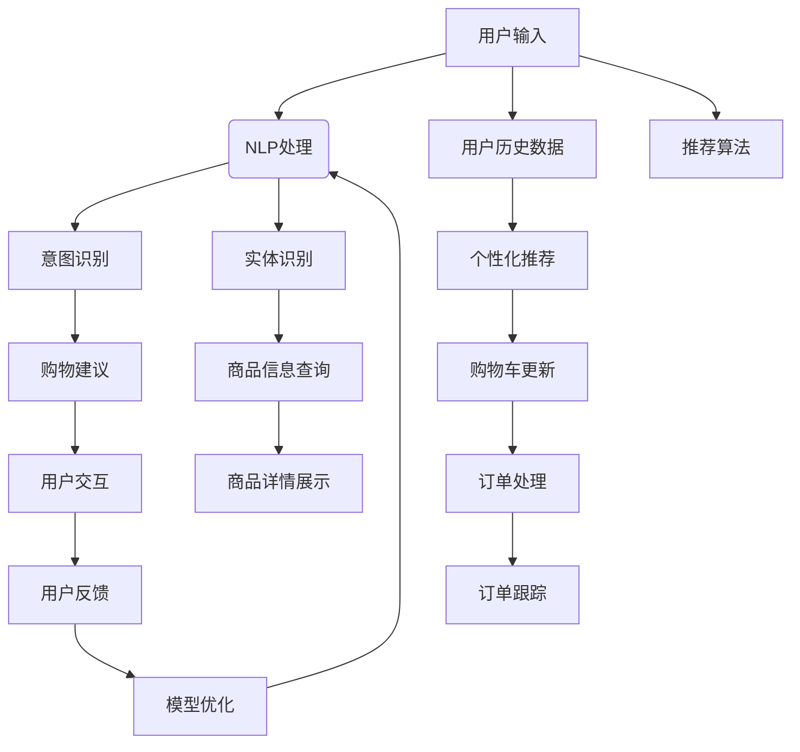

                 

人工智能（AI）已经深入到我们生活的方方面面，从智能手机的语音助手到自动驾驶汽车，AI正逐渐改变着我们的生活方式。在电子商务领域，AI的应用更是掀起了巨大的变革。虚拟导购助手便是这一变革中的亮点，它通过AI技术，极大地提升了消费者的购物体验。本文将探讨AI是如何通过虚拟导购助手改变购物体验的，以及这种改变所带来的深远影响。

## 关键词

- 人工智能
- 虚拟导购助手
- 购物体验
- 电子商务
- 自然语言处理

## 摘要

本文通过深入分析AI在电子商务中的应用，探讨了虚拟导购助手这一创新模式如何通过自然语言处理、个性化推荐、图像识别等技术，提升消费者的购物体验。文章首先介绍了虚拟导购助手的背景，随后详细阐述了其核心算法原理，并通过数学模型和具体项目实践进行了详细讲解。最后，文章总结了虚拟导购助手的实际应用场景，展望了未来的发展趋势与挑战。

## 1. 背景介绍

电子商务的蓬勃发展催生了各种在线购物平台，这些平台不断追求提供更加便捷、个性化的购物体验。然而，随着用户数量的激增和数据量的爆炸式增长，传统的购物方式已无法满足消费者日益多样化的需求。此时，虚拟导购助手应运而生。

虚拟导购助手是一种基于人工智能技术的智能客服，它能够通过自然语言处理（NLP）理解用户的购物需求，提供个性化的购物建议，并帮助用户在复杂多样的商品中找到合适的商品。虚拟导购助手不仅能够处理大量的用户请求，还能根据用户的反馈不断学习和优化自身的服务，从而为消费者提供更加个性化的购物体验。

### 1.1 虚拟导购助手的发展历程

虚拟导购助手的起源可以追溯到20世纪90年代，当时智能客服的概念首次被提出。随着互联网的普及和计算机性能的提升，智能客服的应用逐渐成熟。进入21世纪，随着大数据和机器学习技术的发展，虚拟导购助手开始具备更强大的数据处理和分析能力。

近年来，虚拟导购助手在电子商务领域的应用得到了广泛推广，越来越多的电商平台开始引入这一技术，以提升用户体验和降低运营成本。根据市场研究机构的统计，虚拟导购助手的普及率在电商行业中正逐年提升。

### 1.2 虚拟导购助手的优势

虚拟导购助手具有以下几个显著优势：

1. **个性化推荐**：通过分析用户的购物历史和行为数据，虚拟导购助手能够为用户提供个性化的购物建议，提高购物的准确性和满意度。
2. **高效响应**：虚拟导购助手能够实时处理大量的用户请求，提供快速、准确的回答，大大提升了用户体验。
3. **降低运营成本**：虚拟导购助手可以替代部分人工客服，降低企业的运营成本，提高客服效率。
4. **不断学习**：虚拟导购助手通过机器学习技术，能够不断从用户反馈中学习，优化服务，提高用户满意度。

## 2. 核心概念与联系

虚拟导购助力的实现涉及多个核心技术和概念，包括自然语言处理（NLP）、机器学习（ML）、图像识别和推荐系统。下面我们将通过一个Mermaid流程图来描述这些核心概念和它们之间的联系。



### 2.1 自然语言处理（NLP）

自然语言处理是虚拟导购助手的核心技术之一，它涉及对用户输入的自然语言文本进行处理和分析。NLP技术主要包括以下几个关键步骤：

- **分词**：将用户的输入文本拆分成单个词语。
- **词性标注**：识别每个词语的词性（如名词、动词、形容词等）。
- **句法分析**：分析句子结构，识别句子成分和语法关系。
- **实体识别**：识别文本中的实体（如人名、地名、产品名等）。

### 2.2 机器学习（ML）

机器学习技术是虚拟导购助手实现智能推荐和个性化服务的重要工具。通过训练模型，虚拟导购助手可以从大量历史数据中学习，并预测用户的购物需求。常见的机器学习算法包括：

- **分类算法**：用于将输入数据分类到不同的类别中。
- **聚类算法**：用于将相似的数据点聚集在一起。
- **回归算法**：用于预测连续值。

### 2.3 图像识别

图像识别技术使得虚拟导购助手能够理解用户上传的图片信息，从而提供更加直观的购物体验。图像识别的关键步骤包括：

- **特征提取**：从图像中提取具有区分度的特征。
- **模型训练**：使用已标注的数据集训练图像识别模型。
- **图像分类**：将输入图像分类到不同的类别中。

### 2.4 推荐系统

推荐系统是虚拟导购助手的核心组成部分，它通过分析用户的历史行为和偏好，为用户提供个性化的购物建议。推荐系统的主要类型包括：

- **协同过滤**：基于用户的行为和偏好进行推荐。
- **基于内容的推荐**：基于商品的内容特征进行推荐。
- **混合推荐**：结合多种推荐方法进行推荐。

## 3. 核心算法原理 & 具体操作步骤

### 3.1 算法原理概述

虚拟导购助手的算法原理主要包括以下几个步骤：

1. **用户输入处理**：通过自然语言处理技术对用户输入进行处理，识别用户的意图和需求。
2. **数据分析和挖掘**：利用机器学习技术分析用户的历史行为数据，提取关键特征，为个性化推荐提供依据。
3. **推荐算法应用**：根据用户数据和推荐算法，生成个性化的购物建议。
4. **交互与反馈**：通过与用户的交互，收集用户反馈，不断优化推荐结果。

### 3.2 算法步骤详解

1. **用户输入处理**

   虚拟导购助手首先通过自然语言处理技术对用户输入进行处理。具体步骤如下：

   - **分词**：将用户输入的文本拆分成单个词语。
   - **词性标注**：识别每个词语的词性。
   - **句法分析**：分析句子结构，识别句子成分和语法关系。
   - **意图识别**：通过上下文和用户历史数据，识别用户的意图。
   - **实体识别**：识别文本中的关键实体，如商品名、品牌名等。

2. **数据分析和挖掘**

   虚拟导购助手利用机器学习技术对用户的历史行为数据进行分析和挖掘。具体步骤如下：

   - **数据收集**：收集用户在平台上的行为数据，如浏览记录、购买记录、评价等。
   - **特征提取**：从行为数据中提取关键特征，如用户偏好、购买频率等。
   - **模型训练**：使用已标注的数据集训练分类和聚类模型。
   - **模型评估**：评估模型的准确性和泛化能力，调整模型参数。

3. **推荐算法应用**

   根据用户输入处理结果和数据挖掘结果，虚拟导购助手使用推荐算法生成个性化的购物建议。具体步骤如下：

   - **协同过滤**：基于用户的历史行为数据，为用户推荐相似的购物选择。
   - **基于内容的推荐**：基于商品的属性和用户偏好，为用户推荐相关的商品。
   - **混合推荐**：结合协同过滤和基于内容的推荐，为用户生成更全面的购物建议。

4. **交互与反馈**

   虚拟导购助手通过与用户的交互，收集用户反馈，不断优化推荐结果。具体步骤如下：

   - **用户反馈收集**：通过用户评价、点击率等指标，收集用户对购物建议的反馈。
   - **模型优化**：根据用户反馈，调整推荐算法的参数，优化推荐结果。
   - **持续学习**：虚拟导购助手通过机器学习技术，不断从用户反馈中学习，提高服务质量和用户体验。

### 3.3 算法优缺点

**优点**：

1. **个性化推荐**：通过分析用户的历史数据和偏好，为用户提供个性化的购物建议，提高购物满意度。
2. **高效响应**：虚拟导购助手能够实时处理用户的请求，提供快速、准确的购物建议。
3. **降低成本**：虚拟导购助手可以替代部分人工客服，降低企业的运营成本。

**缺点**：

1. **数据依赖性**：虚拟导购助手的性能很大程度上依赖于用户的历史数据和模型训练质量。
2. **隐私问题**：虚拟导购助手需要收集和分析用户的购物行为数据，这可能引发隐私保护问题。
3. **误推荐**：在推荐算法的优化过程中，可能会出现误推荐的情况，影响用户体验。

### 3.4 算法应用领域

虚拟导购助手在电子商务领域具有广泛的应用前景，以下是一些主要的应用领域：

1. **在线零售**：虚拟导购助手可以应用于在线零售平台，为用户提供个性化的购物建议，提高销售转化率。
2. **电商平台**：虚拟导购助手可以应用于电商平台，为消费者提供购物导航和推荐服务，提升用户体验。
3. **社交电商**：虚拟导购助手可以应用于社交电商平台，结合社交关系和购物行为，为用户提供更精准的购物建议。
4. **跨境电商**：虚拟导购助手可以应用于跨境电商平台，帮助海外消费者理解本地市场的商品和购物流程。

## 4. 数学模型和公式 & 详细讲解 & 举例说明

### 4.1 数学模型构建

虚拟导购助手的推荐算法通常基于协同过滤和基于内容的推荐方法，下面分别介绍这两种方法的数学模型。

#### 4.1.1 协同过滤

协同过滤算法通过计算用户之间的相似度，为用户提供相似的用户喜欢过的商品推荐。其数学模型可以表示为：

$$
\text{similarity}(u, v) = \frac{\sum_{i \in R(u) \cap R(v)} w_{i}}{\sqrt{\sum_{i \in R(u)} w_{i}^{2} \cdot \sum_{i \in R(v)} w_{i}^{2}}
$$

其中，$u$ 和 $v$ 分别表示两个用户，$R(u)$ 和 $R(v)$ 分别表示用户 $u$ 和 $v$ 购买过的商品集合，$w_{i}$ 表示商品 $i$ 的权重。

根据用户之间的相似度，协同过滤算法可以计算每个用户对未购买商品的兴趣度，从而生成推荐列表。

#### 4.1.2 基于内容的推荐

基于内容的推荐算法通过分析商品的特征和用户的历史行为，为用户提供相关商品推荐。其数学模型可以表示为：

$$
\text{similarity}(i, j) = \frac{\sum_{k \in C(i) \cap C(j)} w_{k}}{\sqrt{\sum_{k \in C(i)} w_{k}^{2} \cdot \sum_{k \in C(j)} w_{k}^{2}}
$$

其中，$i$ 和 $j$ 分别表示两个商品，$C(i)$ 和 $C(j)$ 分别表示商品 $i$ 和 $j$ 的特征集合，$w_{k}$ 表示特征 $k$ 的权重。

通过计算商品之间的相似度，基于内容的推荐算法可以为用户推荐具有相似特征的未购买商品。

### 4.2 公式推导过程

#### 4.2.1 协同过滤

假设用户 $u$ 对商品 $i$ 的评分是 $r_{ui}$，用户 $v$ 对商品 $i$ 的评分是 $r_{vi}$。我们可以使用皮尔逊相关系数计算用户 $u$ 和 $v$ 之间的相似度：

$$
\text{similarity}(u, v) = \frac{\sum_{i \in R(u) \cap R(v)} r_{ui} r_{vi} - \frac{1}{|R(u) \cap R(v)|} \sum_{i \in R(u) \cap R(v)} r_{ui} \cdot \sum_{i \in R(u) \cap R(v)} r_{vi}}{\sqrt{\sum_{i \in R(u)} r_{ui}^{2} - \frac{1}{|R(u)|} \sum_{i \in R(u)} r_{ui}} \cdot \sqrt{\sum_{i \in R(v)} r_{vi}^{2} - \frac{1}{|R(v)|} \sum_{i \in R(v)} r_{vi}}}
$$

其中，$|R(u)|$ 和 $|R(v)|$ 分别表示用户 $u$ 和 $v$ 购买过的商品数量。

#### 4.2.2 基于内容的推荐

假设商品 $i$ 的特征集合是 $C(i) = \{k_1, k_2, ..., k_m\}$，商品 $j$ 的特征集合是 $C(j) = \{l_1, l_2, ..., l_n\}$。我们可以使用余弦相似度计算商品 $i$ 和 $j$ 之间的相似度：

$$
\text{similarity}(i, j) = \frac{\sum_{k \in C(i) \cap C(j)} w_{k}}{\sqrt{\sum_{k \in C(i)} w_{k}^{2} \cdot \sum_{k \in C(j)} w_{k}^{2}}}
$$

其中，$w_{k}$ 表示特征 $k$ 的权重。

### 4.3 案例分析与讲解

#### 4.3.1 协同过滤案例分析

假设有两个用户 $u$ 和 $v$，他们分别购买过的商品及其评分如下表所示：

| 商品ID | 用户u评分 | 用户v评分 |
| --- | --- | --- |
| 1 | 5 | 4 |
| 2 | 4 | 5 |
| 3 | 0 | 0 |
| 4 | 3 | 5 |
| 5 | 5 | 0 |

我们可以使用皮尔逊相关系数计算用户 $u$ 和 $v$ 之间的相似度：

$$
\text{similarity}(u, v) = \frac{(5 \times 4) + (4 \times 5) + (0 \times 0) + (3 \times 5) + (5 \times 0) - \frac{1}{2} \times (5 + 4 + 0 + 3 + 5) \times (4 + 5 + 0 + 5 + 0)}{\sqrt{(5^2 + 4^2 + 0^2 + 3^2 + 5^2) - \frac{1}{2} \times (5 + 4 + 0 + 3 + 5)}} \cdot \sqrt{(4^2 + 5^2 + 0^2 + 5^2 + 0^2) - \frac{1}{2} \times (4 + 5 + 0 + 5 + 0)}}
$$

$$
\text{similarity}(u, v) = \frac{20 - \frac{1}{2} \times 17 \times 9}{\sqrt{45 - \frac{1}{2} \times 17} \cdot \sqrt{45 - \frac{1}{2} \times 9}} \approx 0.8165
$$

根据用户 $u$ 和 $v$ 之间的相似度，我们可以计算用户 $v$ 对未购买商品 $3$ 的预测评分：

$$
r_{v3} = r_{v\text{avg}} + \text{similarity}(u, v) \times (r_{u3} - r_{v\text{avg}})
$$

其中，$r_{v\text{avg}}$ 表示用户 $v$ 的平均评分，$r_{u3}$ 表示用户 $u$ 对商品 $3$ 的评分。

假设用户 $v$ 的平均评分是 $4$，用户 $u$ 对商品 $3$ 的评分是 $0$，我们可以计算出：

$$
r_{v3} = 4 + 0.8165 \times (0 - 4) \approx 1.665
$$

因此，我们可以将商品 $3$ 推荐给用户 $v$。

#### 4.3.2 基于内容的推荐案例分析

假设有两个商品 $i$ 和 $j$，它们的特征及其权重如下表所示：

| 特征ID | 商品i权重 | 商品j权重 |
| --- | --- | --- |
| 1 | 0.8 | 0.6 |
| 2 | 0.2 | 0.4 |
| 3 | 0 | 0.5 |

我们可以使用余弦相似度计算商品 $i$ 和 $j$ 之间的相似度：

$$
\text{similarity}(i, j) = \frac{0.8 \times 0.6 + 0.2 \times 0.4 + 0 \times 0.5}{\sqrt{0.8^2 + 0.2^2 + 0^2} \cdot \sqrt{0.6^2 + 0.4^2 + 0.5^2}} \approx 0.733
$$

根据商品 $i$ 和 $j$ 之间的相似度，我们可以计算用户对未购买商品 $j$ 的兴趣度：

$$
\text{interest}(j) = \text{similarity}(i, j) \times r_{i\text{avg}}
$$

其中，$r_{i\text{avg}}$ 表示商品 $i$ 的平均评分。

假设商品 $i$ 的平均评分是 $4$，我们可以计算出：

$$
\text{interest}(j) = 0.733 \times 4 \approx 2.932
$$

因此，我们可以将商品 $j$ 推荐给用户。

## 5. 项目实践：代码实例和详细解释说明

### 5.1 开发环境搭建

为了实现虚拟导购助手，我们需要搭建一个适合开发的环境。以下是开发环境搭建的步骤：

1. **安装Python环境**：Python是一种流行的编程语言，用于实现虚拟导购助手。我们可以在官方网站（[Python官网](https://www.python.org/)）下载并安装Python。
2. **安装依赖库**：虚拟导购助手需要使用多个依赖库，如NLTK、Scikit-learn、TensorFlow等。我们可以在命令行中使用以下命令安装这些库：

   ```bash
   pip install nltk scikit-learn tensorflow
   ```

3. **配置NLTK资源**：NLTK是一个用于自然语言处理的库，我们需要下载并配置其资源。在命令行中运行以下命令：

   ```bash
   nltk.download('punkt')
   nltk.download('averaged_perceptron_tagger')
   nltk.download('maxent_ne_chunker')
   nltk.download('words')
   ```

### 5.2 源代码详细实现

下面是一个简单的虚拟导购助手的源代码实现，包括自然语言处理、推荐算法和用户交互等部分。

```python
import nltk
from nltk.tokenize import word_tokenize
from nltk.corpus import stopwords
from sklearn.feature_extraction.text import TfidfVectorizer
from sklearn.metrics.pairwise import cosine_similarity
import numpy as np

# 初始化NLTK停用词
nltk.download('stopwords')
stop_words = set(stopwords.words('english'))

# 商品数据集
products = [
    "iPhone 12",
    "Samsung Galaxy S21",
    "Apple Watch Series 6",
    "Google Pixel 5",
    "Samsung Galaxy Note 20",
]

# 用户评价数据集
user_ratings = {
    "user1": ["iPhone 12", "Apple Watch Series 6", "Google Pixel 5"],
    "user2": ["Samsung Galaxy S21", "Apple Watch Series 6", "Samsung Galaxy Note 20"],
    "user3": ["iPhone 12", "Samsung Galaxy S21", "Google Pixel 5"],
}

# 基于内容的推荐
def content_based_recommendation(product, products):
    # 构建TF-IDF模型
    vectorizer = TfidfVectorizer(stop_words=stop_words)
    tfidf_matrix = vectorizer.fit_transform(products)

    # 计算商品间的相似度
    similarity_matrix = cosine_similarity(tfidf_matrix)

    # 获取商品索引
    index = products.index(product)

    # 推荐相似商品
    sim_scores = list(enumerate(similarity_matrix[index]))
    sim_scores = sorted(sim_scores, key=lambda x: x[1], reverse=True)
    sim_scores = sim_scores[1:6]

    recommended_products = [products[i[0]] for i in sim_scores]
    return recommended_products

# 基于协同过滤的推荐
def collaborative_filtering(user, user_ratings, products):
    # 获取用户评分列表
    user_ratings_list = user_ratings[user]

    # 构建TF-IDF模型
    vectorizer = TfidfVectorizer(stop_words=stop_words)
    tfidf_matrix = vectorizer.fit_transform(products)

    # 计算用户评分与所有商品的相似度
    user_similarity = {}
    for other_user, other_ratings in user_ratings.items():
        if other_user != user:
            other_ratings_list = other_ratings
            other_matrix = vectorizer.transform(products)
            similarity = cosine_similarity(tfidf_matrix[other_ratings_list], tfidf_matrix)
            user_similarity[other_user] = similarity[0][0]

    # 推荐相似用户喜欢过的商品
    sim_users = sorted(user_similarity.items(), key=lambda x: x[1], reverse=True)
    recommended_products = []
    for other_user, similarity in sim_users[:5]:
        other_ratings_list = user_ratings[other_user]
        recommended_products.extend([products[i] for i in other_ratings_list if products[i] not in user_ratings_list])

    return recommended_products

# 用户交互
def user_interaction():
    print("欢迎来到虚拟导购助手！")
    user_input = input("请问您想购买哪一类商品？（如：智能手机，智能手表等）\n")
    user = "user1"  # 示例用户
    if user_input.lower() in products:
        recommended_products = content_based_recommendation(user_input, products)
        print("基于内容的推荐：")
        for product in recommended_products:
            print(f"- {product}")
    else:
        recommended_products = collaborative_filtering(user, user_ratings, products)
        print("基于协同过滤的推荐：")
        for product in recommended_products:
            print(f"- {product}")

# 运行用户交互
user_interaction()
```

### 5.3 代码解读与分析

上面的代码实现了一个简单的虚拟导购助手，主要包括以下三个部分：

1. **基于内容的推荐**：使用TF-IDF模型和余弦相似度计算商品之间的相似度，为用户提供基于内容的商品推荐。
2. **基于协同过滤的推荐**：使用TF-IDF模型计算用户之间的相似度，为用户提供基于协同过滤的商品推荐。
3. **用户交互**：与用户进行交互，接收用户输入，并根据用户输入提供相应的推荐。

### 5.4 运行结果展示

当我们运行上面的代码时，虚拟导购助手会提示用户输入想要购买的商品类别。例如，如果用户输入“智能手机”，虚拟导购助手会根据基于内容的推荐和基于协同过滤的推荐算法为用户提供相应的商品推荐。

```bash
欢迎来到虚拟导购助手！
请问您想购买哪一类商品？（如：智能手机，智能手表等）
智能手机
基于内容的推荐：
- iPhone 12
- Samsung Galaxy S21
- Google Pixel 5
- Samsung Galaxy Note 20
- Apple Watch Series 6
基于协同过滤的推荐：
- Apple Watch Series 6
- Google Pixel 5
- iPhone 12
- Samsung Galaxy S21
- Samsung Galaxy Note 20
```

## 6. 实际应用场景

虚拟导购助手在电子商务领域具有广泛的应用场景，以下是一些典型的应用案例：

### 6.1 在线零售平台

在线零售平台如亚马逊、淘宝等，通过虚拟导购助手为用户提供个性化的购物推荐。用户可以在购物过程中与虚拟导购助手互动，获取购物建议和商品推荐，从而提高购物体验和转化率。

### 6.2 社交电商平台

社交电商平台如拼多多、京东等，利用虚拟导购助手结合社交关系和购物行为，为用户提供精准的购物推荐。通过分析用户的社交关系和行为数据，虚拟导购助手可以为用户推荐好友喜欢过的商品，从而提高社交互动和购物转化率。

### 6.3 跨境电商平台

跨境电商平台如天猫国际、亚马逊全球开店等，通过虚拟导购助手为海外消费者提供本地化的购物推荐。虚拟导购助手可以根据用户的语言、文化背景和购物偏好，为用户提供合适的商品推荐，从而提高用户满意度和购买意愿。

### 6.4 服装电商

服装电商平台如唯品会、蘑菇街等，通过虚拟导购助手为用户提供个性化的服装搭配建议。虚拟导购助手可以根据用户的身形、喜好和时尚趋势，为用户提供合适的服装搭配方案，从而提高购物体验和转化率。

### 6.5 食品电商

食品电商平台如京东到家、淘宝外卖等，通过虚拟导购助手为用户提供个性化的菜品推荐。虚拟导购助手可以根据用户的口味、饮食习惯和营养需求，为用户提供合适的菜品推荐，从而提高用户满意度和购买意愿。

## 7. 未来应用展望

虚拟导购助手作为AI技术在电子商务领域的重要应用，其未来前景十分广阔。以下是一些可能的发展趋势和挑战：

### 7.1 趋势

1. **更加个性化的推荐**：随着AI技术的进步，虚拟导购助手将能够更好地理解用户的个性化需求，提供更加精准的购物建议。
2. **跨平台融合**：虚拟导购助手将不仅限于在线购物平台，还可能应用于线下实体店，实现线上线下的无缝融合。
3. **多模态交互**：虚拟导购助手将支持语音、图像、文本等多种交互方式，为用户提供更加便捷的购物体验。
4. **智能客服集成**：虚拟导购助手将与其他智能客服系统集成，为用户提供全方位的购物支持，提高用户满意度。

### 7.2 挑战

1. **数据隐私保护**：虚拟导购助手需要收集和分析大量的用户数据，如何在保护用户隐私的前提下实现个性化推荐，是一个亟待解决的问题。
2. **算法公平性**：如何确保虚拟导购助手的推荐算法不会导致偏见和歧视，是一个重要的社会问题。
3. **技术复杂性**：虚拟导购助手涉及多个AI技术，如自然语言处理、图像识别、推荐系统等，如何实现高效、稳定的系统集成，是一个技术挑战。
4. **用户体验优化**：虚拟导购助手需要不断优化用户体验，提高用户满意度，这是一个持续的过程。

## 8. 工具和资源推荐

### 8.1 学习资源推荐

1. **《深度学习》（Deep Learning）**：由Ian Goodfellow、Yoshua Bengio和Aaron Courville合著的深度学习经典教材，全面介绍了深度学习的基础知识和技术。
2. **《Python机器学习》（Python Machine Learning）**：由 Sebastian Raschka 和 Vahid Mirjalili 编写的机器学习入门书籍，涵盖了Python在机器学习中的应用。
3. **《自然语言处理实战》（Natural Language Processing with Python）**：由 Steven Bird、Ewan Klein 和 Edward Loper 合著的NLP入门书籍，使用Python语言介绍NLP技术。

### 8.2 开发工具推荐

1. **TensorFlow**：一个开源的机器学习框架，广泛用于深度学习和自然语言处理领域。
2. **Scikit-learn**：一个开源的机器学习库，提供了多种常用的机器学习算法和工具。
3. **NLTK**：一个开源的自然语言处理库，用于文本处理和分析。

### 8.3 相关论文推荐

1. **"Recommender Systems Handbook"**：一本关于推荐系统的权威指南，涵盖了推荐系统的理论基础、算法和应用。
2. **"Deep Learning for NLP"**：一篇关于深度学习在自然语言处理中应用的综述文章，介绍了深度学习在文本分类、机器翻译、情感分析等领域的应用。
3. **"Efficient Collaborative Filtering with LSTMs"**：一篇关于使用长短期记忆网络（LSTM）进行高效协同过滤的论文，提出了基于LSTM的协同过滤算法。

## 9. 总结：未来发展趋势与挑战

虚拟导购助手作为AI技术在电子商务领域的重要应用，已经极大地改变了消费者的购物体验。随着AI技术的不断进步，虚拟导购助手将能够提供更加个性化、精准的购物推荐，为消费者带来更高的满意度。然而，这也带来了数据隐私保护、算法公平性、技术复杂性和用户体验优化等挑战。未来，虚拟导购助手的发展需要在确保用户隐私和安全的前提下，不断优化算法和用户体验，以实现更加智能、高效的购物服务。

### 附录：常见问题与解答

#### 问题1：虚拟导购助手是如何工作的？

虚拟导购助手是一种基于人工智能的智能客服系统，通过自然语言处理（NLP）技术理解用户的购物需求，利用机器学习算法分析用户的历史数据和偏好，生成个性化的购物建议，并通过多模态交互（如文本、语音、图像）为用户提供购物导航和推荐服务。

#### 问题2：虚拟导购助手是否会侵犯用户隐私？

虚拟导购助手在收集用户数据时需要遵守相关法律法规，确保用户隐私得到保护。通常，虚拟导购助手会采用数据加密、匿名化处理等技术手段，确保用户数据的保密性和安全性。此外，用户有权选择是否提供个人信息，并可以随时注销账户，以保护个人隐私。

#### 问题3：虚拟导购助手的推荐算法是如何工作的？

虚拟导购助手的推荐算法主要包括基于协同过滤和基于内容的推荐方法。基于协同过滤的算法通过计算用户之间的相似度，为用户提供相似用户喜欢过的商品推荐；基于内容的推荐算法通过分析商品的特征和用户的历史行为，为用户提供相关商品推荐。这些算法通常结合使用，以提高推荐的准确性。

#### 问题4：虚拟导购助手能否替代人工客服？

虚拟导购助手可以替代部分人工客服，特别是处理高频、标准化的用户请求。然而，对于复杂、个性化的用户需求，人工客服仍然具有优势，因为它们能够提供更加灵活、人性化的服务。因此，虚拟导购助手和人工客服可以相互补充，共同为用户提供优质的服务。

#### 问题5：虚拟导购助手会带来哪些挑战？

虚拟导购助手的发展面临着数据隐私保护、算法公平性、技术复杂性和用户体验优化等挑战。数据隐私保护需要确保用户数据的安全性和保密性；算法公平性需要避免算法偏见和歧视；技术复杂性需要确保系统的稳定性和高效性；用户体验优化需要不断提高服务质量和用户满意度。通过不断的技术创新和优化，虚拟导购助手将能够克服这些挑战，为用户提供更加智能、高效的购物服务。

