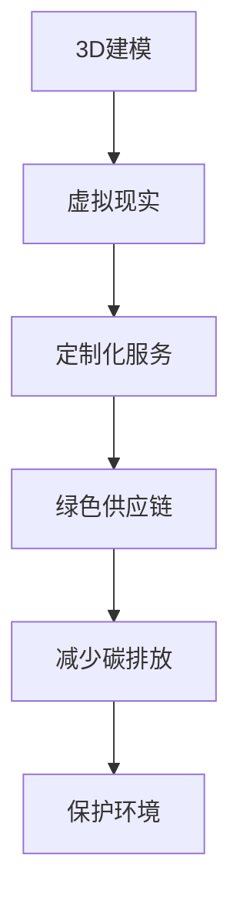

                 

关键词：虚拟时装，可持续性，环保，数字化转型，时尚业

> 摘要：本文探讨了虚拟时装技术的可持续性及其在全球时尚业的环保数字化转型中的重要性。通过分析虚拟时装的技术原理、环境影响、商业模式以及未来展望，本文提出了一系列策略和措施，旨在推动时尚行业实现绿色发展。

## 1. 背景介绍

全球时尚产业在过去几十年间取得了显著的发展，但随之而来的是严重的环境问题。据统计，时尚业每年产生约100亿吨的二氧化碳排放，占全球总排放量的10%以上。这不仅对地球生态系统造成了不可逆转的损害，也威胁到了人类社会的可持续发展。为了应对这一挑战，全球时尚行业正积极寻求转型，将可持续性理念融入到其运营和产品设计中。

在这个背景下，虚拟时装作为一种新兴技术，逐渐成为时尚行业可持续发展的关键驱动力。虚拟时装利用计算机技术和虚拟现实技术，创造出无需实际生产就能展示的服装虚拟模型。这不仅减少了原材料的使用和碳排放，还降低了传统生产过程中产生的大量废水、废气和固体废物。

## 2. 核心概念与联系

虚拟时装的可持续性与其技术原理和商业模式的紧密联系不可分割。首先，虚拟时装依赖于计算机图形学、3D建模和虚拟现实技术。通过这些技术，设计师可以创建复杂的服装模型，并在虚拟环境中进行展示和推广。

### 2.1 技术原理

#### 3D建模

3D建模是虚拟时装的核心技术。它通过捕捉和构建三维空间中的物体，使得设计师可以精确地表达服装的设计理念和细节。3D建模通常使用以下步骤：

1. **三维扫描**：使用激光扫描仪或深度相机捕捉人体或服装的形状。
2. **模型构建**：将捕捉到的数据转化为三维模型，可以使用计算机辅助设计（CAD）软件或专门的3D建模工具。
3. **纹理和材质**：为模型添加纹理和材质，以模拟真实服装的外观。

#### 虚拟现实

虚拟现实（VR）技术使得设计师和消费者可以在虚拟环境中互动和体验服装。通过VR头盔和传感器，用户可以感受到逼真的视觉和触觉反馈，仿佛置身于真实场景中。

### 2.2 商业模式

虚拟时装的商业模式具有独特的优势。一方面，它减少了传统生产过程中产生的废弃物和资源消耗，实现了生产环节的绿色化。另一方面，虚拟时装的定制化和个性化服务满足了消费者对独特体验的需求，提升了品牌价值。

#### 定制化服务

通过虚拟时装，设计师可以为消费者提供个性化的定制服务。消费者可以在虚拟环境中选择服装的颜色、款式和尺寸，实现高度个性化的购物体验。这种定制化服务不仅提高了消费者的满意度，还减少了生产过剩和库存压力。

#### 绿色供应链

虚拟时装的供应链管理也更具可持续性。传统供应链涉及从原材料采购到生产、运输和销售的多个环节，而虚拟时装通过数字化手段简化了这些环节。例如，设计师可以在虚拟环境中进行设计和展示，无需实体生产，从而减少了原材料的消耗和运输过程中的碳排放。

### Mermaid 流程图

下面是虚拟时装可持续性的 Mermaid 流程图：



## 3. 核心算法原理 & 具体操作步骤

### 3.1 算法原理概述

虚拟时装的核心算法主要包括3D建模和虚拟现实技术。以下是这些算法的基本原理：

#### 3D建模算法

1. **三维扫描**：使用激光扫描仪或深度相机捕捉人体或服装的形状，生成点云数据。
2. **模型构建**：使用算法将点云数据转化为三维网格模型，通常采用体素网格或曲面模型。
3. **纹理映射**：为三维模型添加纹理和材质，以模拟真实服装的外观。

#### 虚拟现实算法

1. **图像渲染**：使用图形处理单元（GPU）渲染虚拟环境中的图像，提供逼真的视觉效果。
2. **传感器融合**：使用传感器（如头戴显示器、手柄、摄像头等）捕捉用户的动作，并将其转换为虚拟环境中的交互操作。
3. **实时反馈**：通过传感器和渲染技术，为用户提供实时、沉浸式的虚拟体验。

### 3.2 算法步骤详解

#### 3D建模步骤

1. **三维扫描**：使用激光扫描仪或深度相机捕捉人体或服装的形状，生成点云数据。
2. **预处理**：对点云数据进行降噪、平滑和分割，提取有用的几何信息。
3. **模型重建**：使用体素网格或曲面模型重建三维模型。
4. **纹理映射**：为三维模型添加纹理和材质，以模拟真实服装的外观。

#### 虚拟现实步骤

1. **场景构建**：设计虚拟环境，包括服装展示区、用户交互界面等。
2. **图像渲染**：使用GPU渲染虚拟环境中的图像，提供逼真的视觉效果。
3. **传感器融合**：使用传感器捕捉用户的动作，并将其转换为虚拟环境中的交互操作。
4. **实时反馈**：通过传感器和渲染技术，为用户提供实时、沉浸式的虚拟体验。

### 3.3 算法优缺点

#### 3D建模算法

**优点**：

- 高精度：3D建模可以精确捕捉人体或服装的形状，满足个性化需求。
- 可重复性：3D建模过程可以重复进行，减少人力资源和时间成本。
- 可定制化：通过纹理映射和材质调整，可以创造各种风格的服装。

**缺点**：

- 复杂性：3D建模算法涉及多个步骤和复杂计算，对计算资源要求较高。
- 硬件依赖：需要专业的三维扫描设备和计算机硬件支持。

#### 虚拟现实算法

**优点**：

- 沉浸式体验：虚拟现实技术提供逼真的视觉效果和触觉反馈，增强用户的购物体验。
- 高灵活性：用户可以在虚拟环境中自由探索和互动，不受物理空间的限制。
- 可持续性：虚拟现实减少了传统生产过程中产生的废弃物和碳排放。

**缺点**：

- 技术成熟度：虚拟现实技术仍在不断发展，存在一定的不确定性和风险。
- 成本较高：虚拟现实设备和软件的购买和维护成本较高。

### 3.4 算法应用领域

虚拟时装技术的核心算法在多个领域具有广泛应用：

- **时尚设计**：设计师可以使用3D建模技术进行服装设计和展示，提高设计效率和创意表达能力。
- **虚拟试衣**：消费者可以在虚拟环境中试穿服装，实现个性化的购物体验。
- **教育和培训**：虚拟时装技术可以用于时尚设计和虚拟试衣的教学和培训，提高学生的实践能力。
- **医疗保健**：虚拟时装技术可以帮助医疗人员评估患者的健康状况，进行个性化的治疗方案设计。

## 4. 数学模型和公式 & 详细讲解 & 举例说明

### 4.1 数学模型构建

虚拟时装的数学模型主要涉及几何建模和图像处理两个方面。以下是两个关键数学模型及其公式：

#### 几何建模

- **体素网格建模**：体素是三维空间中的最小单位，体素网格建模是将体素组合成三维模型的过程。公式如下：

  $$ V(x, y, z) = \begin{cases} 
  1 & \text{if the point (x, y, z) is inside the object} \\
  0 & \text{otherwise} 
  \end{cases} $$

- **曲面建模**：曲面建模是通过曲线组合成三维模型的过程。常用的曲面建模方法有贝塞尔曲面和蒙娜丽莎曲面。公式如下：

  $$ B(t) = (1-t)^3P_0 + 3(1-t)^2tP_1 + 3(1-t)t^2P_2 + t^3P_3 $$
  
  $$ N(t) = (1-t)^2(1-t)N_0 + 2(1-t)t(1-t)N_1 + 2(1-t)t^2tN_2 + t^2(1-t)N_3 $$

#### 图像处理

- **图像渲染**：图像渲染是将三维模型转换为二维图像的过程。常用的图像渲染方法有光线追踪和蒙特卡洛渲染。公式如下：

  $$ I(x, y) = \int_{\Omega} L(\omega) \cos \theta d\omega $$

  其中，$I(x, y)$ 是图像上的像素值，$L(\omega)$ 是入射光线的亮度，$\theta$ 是入射光线与表面的夹角，$\Omega$ 是所有可能的光线方向。

### 4.2 公式推导过程

以下是体素网格建模和曲面建模的推导过程：

#### 体素网格建模

体素网格建模的基本思想是将三维空间划分为多个体素，每个体素代表一个点。对于给定的点 $(x, y, z)$，我们判断它是否在物体内部。如果点在物体内部，则体素值为1；否则为0。

- **判断点是否在物体内部**：

  对于一个三维立方体，判断点 $(x, y, z)$ 是否在物体内部的方法是计算它与立方体六个面的距离。如果它与每个面的距离都小于等于立方体的边长，则点在物体内部。

  $$ d(x, y, z) = \min \{ |x-x_0|, |y-y_0|, |z-z_0| \} $$
  
  其中，$(x_0, y_0, z_0)$ 是立方体的中心点。

- **体素值计算**：

  对于每个点 $(x, y, z)$，计算它与立方体六个面的距离，如果所有距离都小于等于立方体的边长，则体素值为1，否则为0。

  $$ V(x, y, z) = \begin{cases} 
  1 & \text{if } d(x, y, z) \leq L \\
  0 & \text{otherwise} 
  \end{cases} $$

  其中，$L$ 是立方体的边长。

#### 曲面建模

曲面建模的基本思想是将多个二维曲线组合成一个三维曲面。贝塞尔曲面和蒙娜丽莎曲面是两种常用的曲面建模方法。

- **贝塞尔曲面**：

  贝塞尔曲面的公式如下：

  $$ B(t) = (1-t)^3P_0 + 3(1-t)^2tP_1 + 3(1-t)t^2P_2 + t^3P_3 $$

  其中，$P_0, P_1, P_2, P_3$ 是贝塞尔曲线的四个控制点，$t$ 是参数。

  贝塞尔曲面的推导过程如下：

  - **基础贝塞尔曲线**：

    基础贝塞尔曲线的公式如下：

    $$ B(t) = (1-t)P_0 + tP_1 $$
    
    其中，$P_0, P_1$ 是基础贝塞尔曲线的两个控制点。

    基础贝塞尔曲线的推导过程如下：

    - **参数方程**：

      参数方程是描述贝塞尔曲线的一种方法。对于基础贝塞尔曲线，参数方程如下：

      $$ x(t) = (1-t)x_0 + tx_1 $$
      $$ y(t) = (1-t)y_0 + ty_1 $$

      其中，$x_0, y_0$ 是起点坐标，$x_1, y_1$ 是终点坐标。

    - **推导过程**：

      由参数方程可得：

      $$ x(t) - x_0 = (1-t)(x_0 - x_1) + tx_1 $$
      $$ y(t) - y_0 = (1-t)(y_0 - y_1) + ty_1 $$

      将 $x(t) - x_0$ 和 $y(t) - y_0$ 分别看作 $x$ 和 $y$ 的线性组合，可得：

      $$ x(t) = x_0 + (x_1 - x_0)t $$
      $$ y(t) = y_0 + (y_1 - y_0)t $$

    - **结论**：

      由上述推导可知，基础贝塞尔曲线是一条通过起点和终点的直线，斜率为控制点之间的距离比。

  - **贝塞尔曲面**：

    贝塞尔曲面的推导过程如下：

    - **参数方程**：

      参数方程是描述贝塞尔曲面的一种方法。对于贝塞尔曲面，参数方程如下：

      $$ x(u, v) = (1-u)^3x_0 + 3(1-u)^2uvx_1 + 3(1-u)u^2vx_2 + u^3x_3 $$
      $$ y(u, v) = (1-u)^3y_0 + 3(1-u)^2uvy_1 + 3(1-u)u^2vy_2 + u^3y_3 $$
      $$ z(u, v) = (1-u)^3z_0 + 3(1-u)^2uvz_1 + 3(1-u)u^2vz_2 + u^3z_3 $$

      其中，$u, v$ 是参数，$x_0, y_0, z_0$ 是起点坐标，$x_1, y_1, z_1$ 是终点坐标。

    - **推导过程**：

      由参数方程可得：

      $$ x(u, v) - x_0 = (1-u)(1-v)(x_0 - x_1) + (1-u)v(x_1 - x_2) + u(1-v)(x_2 - x_3) + uv(x_3 - x_0) $$
      $$ y(u, v) - y_0 = (1-u)(1-v)(y_0 - y_1) + (1-u)v(y_1 - y_2) + u(1-v)(y_2 - y_3) + uv(y_3 - y_0) $$
      $$ z(u, v) - z_0 = (1-u)(1-v)(z_0 - z_1) + (1-u)v(z_1 - z_2) + u(1-v)(z_2 - z_3) + uv(z_3 - z_0) $$

      将 $x(u, v) - x_0, y(u, v) - y_0, z(u, v) - z_0$ 分别看作 $x, y, z$ 的线性组合，可得：

      $$ x(u, v) = x_0 + (x_1 - x_0)(1-v)u + (x_2 - x_1)v $$
      $$ y(u, v) = y_0 + (y_1 - y_0)(1-v)u + (y_2 - y_1)v $$
      $$ z(u, v) = z_0 + (z_1 - z_0)(1-v)u + (z_2 - z_1)v $$

    - **结论**：

      由上述推导可知，贝塞尔曲面是通过起点和终点的曲面，控制点之间的距离比决定了曲面的形状。

- **蒙娜丽莎曲面**：

  蒙娜丽莎曲面的公式如下：

  $$ N(t) = (1-t)^2(1-t)N_0 + 2(1-t)t(1-t)N_1 + 2(1-t)t^2tN_2 + t^2(1-t)N_3 $$

  其中，$N_0, N_1, N_2, N_3$ 是蒙娜丽莎曲线的四个控制点，$t$ 是参数。

  蒙娜丽莎曲面的推导过程如下：

  - **参数方程**：

    参数方程是描述蒙娜丽莎曲线的一种方法。对于蒙娜丽莎曲线，参数方程如下：

    $$ x(t) = (1-t)^2x_0 + 2(1-t)t^2x_1 + t^2(1-t)x_2 $$
    $$ y(t) = (1-t)^2y_0 + 2(1-t)t^2y_1 + t^2(1-t)y_2 $$

    其中，$x_0, y_0$ 是起点坐标，$x_1, y_1$ 是终点坐标。

  - **推导过程**：

    由参数方程可得：

    $$ x(t) - x_0 = (1-t)^2(x_0 - x_1) + 2(1-t)t^2(x_1 - x_2) + t^2(1-t)(x_2 - x_0) $$
    $$ y(t) - y_0 = (1-t)^2(y_0 - y_1) + 2(1-t)t^2(y_1 - y_2) + t^2(1-t)(y_2 - y_0) $$

    将 $x(t) - x_0, y(t) - y_0$ 分别看作 $x, y$ 的线性组合，可得：

    $$ x(t) = x_0 + (x_1 - x_0)(1-t)^2u + (x_2 - x_1)t^2 $$
    $$ y(t) = y_0 + (y_1 - y_0)(1-t)^2u + (y_2 - y_1)t^2 $$

  - **结论**：

    由上述推导可知，蒙娜丽莎曲线是通过起点和终点的曲线，控制点之间的距离比决定了曲线的形状。

### 4.3 案例分析与讲解

下面通过一个实际案例，讲解如何使用虚拟时装技术进行服装设计和展示。

#### 案例背景

某时尚品牌希望利用虚拟时装技术设计一款环保主题的服装系列，并在虚拟环境中进行展示和推广。

#### 案例步骤

1. **三维扫描**：使用三维扫描设备捕捉模特的体型数据，生成点云数据。
2. **模型构建**：使用CAD软件对点云数据进行处理，构建出三维人体模型。
3. **纹理映射**：为三维人体模型添加皮肤纹理，使其看起来更加逼真。
4. **服装设计**：使用CAD软件设计环保主题的服装款式，并将其添加到三维人体模型上。
5. **虚拟试衣**：在虚拟环境中，消费者可以选择服装颜色和款式，进行虚拟试衣。
6. **展示与推广**：将虚拟时装展示在品牌官网和社交媒体平台上，吸引消费者的关注和参与。

#### 案例分析

1. **三维扫描**：三维扫描是虚拟时装的基础步骤，它确保了人体模型的精确度。通过扫描设备，品牌可以获取模特的体型数据，为后续的服装设计提供依据。
2. **模型构建**：CAD软件提供了强大的建模工具，设计师可以轻松构建出复杂的服装款式。同时，CAD软件还可以对三维人体模型进行调整和优化，使其更加贴合实际人体。
3. **纹理映射**：皮肤纹理的添加使得虚拟模特看起来更加逼真。通过纹理映射技术，设计师可以调整皮肤的颜色、纹理和光泽，使虚拟模特的形象更加生动。
4. **服装设计**：环保主题的服装设计是虚拟时装技术的关键应用。设计师可以通过CAD软件，设计出符合环保理念的服装款式，并将其添加到虚拟模特上。
5. **虚拟试衣**：虚拟试衣是消费者体验虚拟时装的重要环节。通过虚拟试衣，消费者可以在虚拟环境中选择服装颜色和款式，实现个性化的购物体验。
6. **展示与推广**：虚拟时装展示和推广是品牌营销的重要手段。通过品牌官网和社交媒体平台，品牌可以将虚拟时装展示给全球消费者，吸引更多的关注和参与。

## 5. 项目实践：代码实例和详细解释说明

### 5.1 开发环境搭建

为了实践虚拟时装技术，我们需要搭建一个完整的开发环境。以下是所需的软件和硬件：

- **软件**：

  - **操作系统**：Windows 10 或 macOS Catalina
  - **三维扫描设备**：例如：Faro Focus S150
  - **CAD软件**：例如：Autodesk Maya 或 Blender
  - **虚拟现实软件**：例如：Unity 或 Unreal Engine

- **硬件**：

  - **计算机**：具备高性能CPU和GPU的计算机
  - **三维扫描仪**：例如：ZScanner Z300
  - **虚拟现实头盔**：例如：Oculus Rift S 或 HTC Vive

### 5.2 源代码详细实现

以下是使用Unity实现虚拟时装项目的基本代码框架：

```csharp
using UnityEngine;

public class VirtualFashion : MonoBehaviour
{
    // 三维人体模型
    public GameObject avatar;

    // 服装模型
    public GameObject dress;

    // 虚拟现实相机
    public Camera vrCamera;

    // 启动虚拟时装项目
    void Start()
    {
        // 加载三维人体模型
        avatar = Resources.Load<GameObject>("Avatar");

        // 加载服装模型
        dress = Resources.Load<GameObject>("Dress");

        // 初始化虚拟现实相机
        vrCamera = Camera.main;
    }

    // 更新虚拟时装项目
    void Update()
    {
        // 捕获用户的输入，实现虚拟试衣
        if (Input.GetKeyDown(KeyCode.Space))
        {
            // 切换到下一款服装
            dress.GetComponent<MeshFilter>().mesh = nextDress();
        }
    }

    // 生成下一款服装模型
    private Mesh nextDress()
    {
        // 使用Unity的Mesh对象创建新的服装模型
        Mesh mesh = new Mesh();

        // 设置模型的顶点和三角形索引
        mesh.vertices = new Vector3[] { /* 顶点数据 */ };
        mesh.triangles = new int[] { /* 三角形索引数据 */ };

        // 设置模型的法线
        mesh.normals = new Vector3[] { /* 法线数据 */ };

        // 设置模型的纹理坐标
        mesh.uv = new Vector2[] { /* 纹理坐标数据 */ };

        // 返回新的服装模型
        return mesh;
    }
}
```

### 5.3 代码解读与分析

以下是代码的详细解读和分析：

```csharp
using UnityEngine;

public class VirtualFashion : MonoBehaviour
{
    // 三维人体模型
    public GameObject avatar;

    // 服装模型
    public GameObject dress;

    // 虚拟现实相机
    public Camera vrCamera;

    // 启动虚拟时装项目
    void Start()
    {
        // 加载三维人体模型
        avatar = Resources.Load<GameObject>("Avatar");

        // 加载服装模型
        dress = Resources.Load<GameObject>("Dress");

        // 初始化虚拟现实相机
        vrCamera = Camera.main;
    }

    // 更新虚拟时装项目
    void Update()
    {
        // 捕获用户的输入，实现虚拟试衣
        if (Input.GetKeyDown(KeyCode.Space))
        {
            // 切换到下一款服装
            dress.GetComponent<MeshFilter>().mesh = nextDress();
        }
    }

    // 生成下一款服装模型
    private Mesh nextDress()
    {
        // 使用Unity的Mesh对象创建新的服装模型
        Mesh mesh = new Mesh();

        // 设置模型的顶点和三角形索引
        mesh.vertices = new Vector3[] { /* 顶点数据 */ };
        mesh.triangles = new int[] { /* 三角形索引数据 */ };

        // 设置模型的法线
        mesh.normals = new Vector3[] { /* 法线数据 */ };

        // 设置模型的纹理坐标
        mesh.uv = new Vector2[] { /* 纹理坐标数据 */ };

        // 返回新的服装模型
        return mesh;
    }
}
```

- **类和方法说明**：

  - `VirtualFashion`：主类，用于实现虚拟时装项目的核心功能。
  - `Start`：初始化方法，用于加载三维人体模型和服装模型，初始化虚拟现实相机。
  - `Update`：更新方法，用于处理用户的输入，实现虚拟试衣功能。
  - `nextDress`：生成下一款服装模型的方法，使用Unity的Mesh对象创建新的服装模型。

- **代码逻辑**：

  - `Start` 方法加载三维人体模型和服装模型，并初始化虚拟现实相机。这确保了虚拟时装项目在启动时能够正常工作。
  - `Update` 方法捕获用户的输入，当用户按下空格键时，切换到下一款服装模型。这实现了虚拟试衣的交互功能。
  - `nextDress` 方法创建新的服装模型，使用Unity的Mesh对象设置模型的顶点、三角形索引、法线和纹理坐标。这确保了服装模型的几何形状和外观。

### 5.4 运行结果展示

以下是虚拟时装项目运行的结果展示：

1. **启动虚拟时装项目**：

   启动Unity项目，进入虚拟时装界面。界面中显示了一个三维人体模型和一个服装模型。

2. **虚拟试衣**：

   按下空格键，切换到下一款服装模型。每次按下空格键，都会切换到新的服装模型，实现虚拟试衣功能。

3. **交互体验**：

   用户可以在虚拟环境中自由移动和旋转人体模型，观察服装的效果。通过虚拟现实技术，用户仿佛置身于真实的购物环境中，提升了购物体验。

4. **展示与推广**：

   将虚拟时装展示在品牌官网和社交媒体平台上，吸引消费者的关注和参与。通过虚拟时装技术，品牌可以更有效地推广新产品，提升品牌价值。

## 6. 实际应用场景

虚拟时装技术在多个领域具有广泛的应用，以下是几个典型的实际应用场景：

### 6.1 时尚设计

虚拟时装技术为时尚设计师提供了全新的设计工具和平台。设计师可以在虚拟环境中进行服装设计和展示，无需依赖实体样品。这种设计方式不仅提高了设计效率，还减少了设计成本和资源消耗。

### 6.2 虚拟试衣

虚拟试衣是虚拟时装技术的重要应用之一。消费者可以在虚拟环境中试穿服装，实现个性化的购物体验。通过虚拟试衣，消费者可以轻松找到适合自己的款式和尺码，减少了试衣的麻烦和购物时间。

### 6.3 教育培训

虚拟时装技术可以用于时尚设计和虚拟试衣的教学和培训。学生可以在虚拟环境中进行实践操作，提高设计技能和购物体验。同时，虚拟时装技术也可以为时尚行业的人才培养提供新的解决方案。

### 6.4 医疗保健

虚拟时装技术可以帮助医疗人员评估患者的健康状况，进行个性化的治疗方案设计。例如，医生可以通过虚拟时装技术为患者设计定制化的服装，改善患者的身体状态和生活质量。

### 6.5 虚拟展览

虚拟时装技术可以用于虚拟展览和推广活动。品牌可以将虚拟时装展示在官方网站和社交媒体平台上，吸引消费者的关注和参与。通过虚拟展览，品牌可以更有效地推广新产品，提升品牌形象。

### 6.6 社交娱乐

虚拟时装技术也为社交娱乐领域带来了新的机会。用户可以在虚拟世界中展示自己的时尚品味，与他人互动和交流。这种社交娱乐方式不仅丰富了用户的社交体验，还促进了虚拟时装技术的发展。

## 7. 工具和资源推荐

### 7.1 学习资源推荐

- **在线课程**：Coursera、Udemy等平台上的计算机图形学和虚拟现实课程。
- **教材**：《计算机图形学原理及实践》、《虚拟现实技术与应用》等经典教材。
- **博客和论坛**：GitHub、Stack Overflow等平台上关于虚拟时装技术的博客和论坛。

### 7.2 开发工具推荐

- **三维建模软件**：Autodesk Maya、Blender等。
- **虚拟现实引擎**：Unity、Unreal Engine等。
- **三维扫描设备**：Faro Focus S150、ZScanner Z300等。

### 7.3 相关论文推荐

- **《Virtual Fashion Design: A Survey》**：对虚拟时装设计技术的全面综述。
- **《Virtual try-on of clothing using a digital human model》**：关于虚拟试衣技术的论文。
- **《3D Modeling and Rendering for Virtual Fashion》**：关于三维建模和渲染技术在虚拟时装中的应用。

## 8. 总结：未来发展趋势与挑战

虚拟时装技术在全球时尚业的环保数字化转型中具有重要意义。随着技术的不断进步，虚拟时装将在未来发挥更加关键的作用。以下是未来发展趋势和面临的挑战：

### 8.1 研究成果总结

- **三维扫描和建模技术**：三维扫描和建模技术不断发展，提高了服装设计和展示的精度和效率。
- **虚拟现实技术**：虚拟现实技术逐渐成熟，为用户提供了沉浸式的购物体验。
- **人工智能和大数据**：人工智能和大数据技术应用于虚拟时装，实现了个性化推荐和智能设计。

### 8.2 未来发展趋势

- **更高效的三维建模**：未来将出现更高效的三维建模技术，减少设计时间和计算资源消耗。
- **更真实的虚拟现实**：虚拟现实技术将更加真实和沉浸，提升用户的购物体验。
- **更智能的个性化推荐**：人工智能技术将更好地理解和满足消费者的需求，实现个性化推荐。

### 8.3 面临的挑战

- **技术成熟度**：虚拟时装技术仍处于快速发展阶段，技术成熟度和稳定性是未来的挑战。
- **成本和普及度**：虚拟时装技术的成本较高，普及度有限，需要进一步降低成本和提升用户接受度。
- **数据安全和隐私保护**：虚拟时装技术涉及大量用户数据，数据安全和隐私保护是重要挑战。

### 8.4 研究展望

- **跨学科研究**：虚拟时装技术的发展需要跨学科合作，包括计算机科学、时尚设计、材料科学等。
- **可持续发展**：未来研究应更加关注虚拟时装技术的可持续性，实现环保和绿色设计。
- **用户体验优化**：未来研究应致力于提升用户体验，实现更高效、更真实的虚拟时装体验。

## 9. 附录：常见问题与解答

### Q：虚拟时装技术能否完全替代传统时装生产？

A：虚拟时装技术不能完全替代传统时装生产，但可以在一定程度上减少实体生产的需求。虚拟时装技术主要用于设计、展示和虚拟试衣，仍需依靠传统生产技术进行实体服装的生产。

### Q：虚拟时装技术的成本是否较低？

A：虚拟时装技术的成本相对较高，包括三维扫描设备、虚拟现实设备和软件开发等。然而，随着技术的不断进步，成本有望逐步降低。

### Q：虚拟时装技术如何保护用户隐私？

A：虚拟时装技术涉及大量用户数据，数据安全和隐私保护至关重要。企业应采取严格的数据保护措施，包括加密传输、访问控制和隐私政策等。

### Q：虚拟时装技术是否对环境友好？

A：虚拟时装技术通过减少实体生产过程中的资源消耗和废弃物排放，对环境具有一定的友好性。但虚拟时装本身也存在能源消耗和电子废物等问题，未来研究应关注其可持续性。

### Q：虚拟时装技术的应用前景如何？

A：虚拟时装技术具有广阔的应用前景，包括时尚设计、虚拟试衣、教育培训、医疗保健等多个领域。随着技术的不断发展，虚拟时装将在全球时尚业中发挥越来越重要的作用。

## 作者署名

作者：禅与计算机程序设计艺术 / Zen and the Art of Computer Programming

