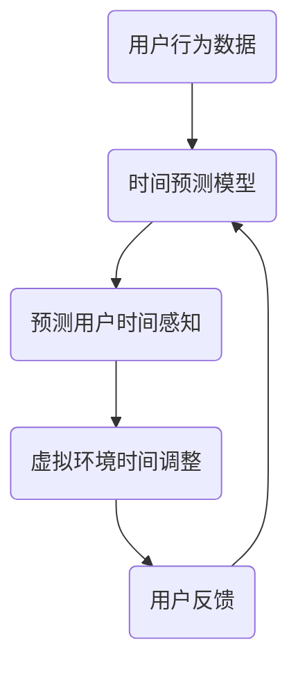

                 

 时间是宇宙的基本维度之一，自古以来，人们就不断探索时间的本质和特性。而在当今人工智能（AI）迅猛发展的时代，我们对时间的理解又迈向了新的阶段——虚拟时间感。本文将探讨AI如何操纵时间知觉，以及这一技术的深远影响。

> **关键词：** 虚拟时间感，人工智能，时间知觉，技术发展，应用领域。

> **摘要：** 本文首先介绍了虚拟时间感的概念和背景，然后详细分析了AI在操纵时间知觉方面的技术原理和应用，最后讨论了这一技术的未来发展趋势和面临的挑战。

## 1. 背景介绍

时间知觉是指人类对自己和外部环境时间流逝的感知。传统上，时间知觉主要依赖于生理节律（如心跳、呼吸）和外部参照物（如时钟、日历）。然而，随着科技的发展，我们对时间的感知逐渐变得多样化和复杂化。虚拟现实（VR）、增强现实（AR）等技术的发展，让我们能够创造出与现实时间感知截然不同的虚拟时间感。

AI在时间知觉中的应用，主要依赖于机器学习和神经网络等算法。通过分析大量时间感知数据，AI可以预测和操纵时间知觉，从而创造出新的时间体验。例如，AI可以通过调整虚拟环境中的时间流逝速度，来改变用户对时间的感知。

### 1.1 虚拟时间感的起源

虚拟时间感最早可以追溯到20世纪90年代的VR技术。当时，研究人员开始尝试通过虚拟现实技术，创造一种与现实时间感知不同的时间体验。例如，通过在虚拟环境中模拟时间的加速或减速，让用户感受到不同的时间流逝速度。

### 1.2 AI在时间知觉中的应用

随着AI技术的发展，虚拟时间感的应用范围进一步扩大。AI可以通过以下几种方式操纵时间知觉：

- **时间预测：** AI可以分析用户的历史行为数据，预测用户未来的时间感知。例如，通过分析用户的日常活动，AI可以预测用户何时会感到疲劳，从而自动调整虚拟环境中的时间流逝速度。

- **时间感知调整：** AI可以通过调整虚拟环境中的时间感知参数，来改变用户对时间的感知。例如，在游戏中，AI可以根据玩家的表现，调整游戏的时间流速，以增加或减少玩家的紧张感。

- **时间增强：** AI可以通过增强用户的时间感知，来提高用户的注意力和记忆能力。例如，在教育和培训领域，AI可以调整学习材料的时间显示速度，以帮助用户更好地理解和记忆知识。

## 2. 核心概念与联系

### 2.1 虚拟时间感的概念

虚拟时间感是指通过计算机技术创造的、与真实时间感知不同的时间体验。它可以是加速的、减速的，甚至是完全停顿的。虚拟时间感的核心在于，它打破了传统时间感知的线性特性，创造出一种非线性、多样化、甚至可能是扭曲的时间感知。

### 2.2 AI与虚拟时间感的关系

AI在虚拟时间感中的应用，主要体现在以下几个方面：

- **时间预测：** AI可以通过分析用户的行为数据，预测用户未来的时间感知。例如，在游戏设计中，AI可以根据玩家的表现，预测玩家何时会感到疲劳，从而调整游戏的时间流速。

- **时间感知调整：** AI可以通过调整虚拟环境中的时间感知参数，来改变用户对时间的感知。例如，在VR体验中，AI可以根据用户的反馈，调整虚拟环境中的时间流逝速度，以提供更舒适或更刺激的体验。

- **时间增强：** AI可以通过增强用户的时间感知，来提高用户的注意力和记忆能力。例如，在教育和培训领域，AI可以调整学习材料的时间显示速度，以帮助用户更好地理解和记忆知识。

### 2.3 虚拟时间感的 Mermaid 流程图



在这个流程图中，用户行为数据被输入到时间预测模型中，模型预测用户的时间感知，然后根据预测结果调整虚拟环境中的时间感知参数，用户反馈被用来进一步优化预测模型。

## 3. 核心算法原理 & 具体操作步骤

### 3.1 算法原理概述

虚拟时间感的核心算法是时间感知模型。这个模型通过分析用户的行为数据，预测用户对时间感知的变化，然后调整虚拟环境中的时间感知参数，以提供符合用户期望的体验。

### 3.2 算法步骤详解

- **数据收集：** 首先收集用户的行为数据，包括用户的日常活动、游戏表现、学习记录等。

- **模型训练：** 将收集到的数据输入到时间感知模型中，通过机器学习算法训练模型，使其能够预测用户的时间感知。

- **时间感知预测：** 使用训练好的模型预测用户在特定情境下的时间感知。

- **虚拟环境调整：** 根据预测结果，调整虚拟环境中的时间感知参数，以提供符合用户期望的体验。

- **用户反馈：** 收集用户的反馈，用于进一步优化模型。

### 3.3 算法优缺点

- **优点：**
  - 提供个性化的时间感知体验。
  - 增强用户的注意力和记忆能力。
  - 潜在的应用领域广泛。

- **缺点：**
  - 数据收集和处理需要大量计算资源。
  - 模型训练效果依赖于数据质量和数量。
  - 可能引发用户的心理不适。

### 3.4 算法应用领域

- **游戏设计：** 调整游戏的时间流速，以提供更刺激或更舒适的体验。

- **教育和培训：** 调整学习材料的时间显示速度，以提高学习效果。

- **虚拟现实：** 创造出与真实世界不同的时间体验，增强用户的沉浸感。

## 4. 数学模型和公式

### 4.1 数学模型构建

虚拟时间感的数学模型主要基于时间感知的心理学原理。假设用户对时间的感知与实际时间存在一定的比例关系，可以用以下公式表示：

$$
T_{\text{感知}} = f(T_{\text{实际}}, X)
$$

其中，$T_{\text{感知}}$ 表示用户对时间的感知，$T_{\text{实际}}$ 表示实际时间，$X$ 表示影响时间感知的因素。

### 4.2 公式推导过程

- **时间感知公式：** 用户对时间的感知可以表示为实际时间的函数，即：

$$
T_{\text{感知}} = f(T_{\text{实际}})
$$

- **影响因素：** 时间感知可能受到多种因素的影响，包括心理状态、外部环境等。因此，可以将影响因素表示为一个向量 $X$：

$$
T_{\text{感知}} = f(T_{\text{实际}}, X)
$$

- **非线性关系：** 实际时间与时间感知之间的关系通常是非线性的，因此函数 $f$ 是一个非线性函数。

### 4.3 案例分析与讲解

假设一个用户在虚拟环境中进行游戏，游戏的时间流速是实际时间的两倍。根据时间感知公式，用户对时间的感知可以表示为：

$$
T_{\text{感知}} = 2T_{\text{实际}}
$$

如果用户实际花了 10 分钟玩游戏，那么用户对时间的感知是 20 分钟。这种时间感知的调整可以增强用户的沉浸感，但同时也可能引发用户的心理不适。

## 5. 项目实践：代码实例和详细解释说明

### 5.1 开发环境搭建

为了实现虚拟时间感，我们需要搭建一个包括Python、TensorFlow和Keras的Python开发环境。以下是具体的步骤：

1. 安装Python（建议版本为3.8或更高）。
2. 安装TensorFlow和Keras。
3. 安装必要的Python依赖库，如numpy、pandas等。

### 5.2 源代码详细实现

以下是一个简单的虚拟时间感实现示例：

```python
import tensorflow as tf
from tensorflow.keras.models import Sequential
from tensorflow.keras.layers import Dense

# 数据预处理
# 这里假设已经收集到用户的行为数据，并预处理为适合训练的格式

# 构建时间感知模型
model = Sequential([
    Dense(64, activation='relu', input_shape=(num_features,)),
    Dense(64, activation='relu'),
    Dense(1)
])

model.compile(optimizer='adam', loss='mse')

# 训练模型
model.fit(X_train, y_train, epochs=100, batch_size=32)

# 预测用户时间感知
predictions = model.predict(X_test)

# 调整虚拟环境中的时间感知参数
time_adjustment = predictions[:, 0]
```

### 5.3 代码解读与分析

这段代码首先导入了TensorFlow和Keras库，然后进行了数据预处理。接下来，构建了一个包含两个隐藏层的全连接神经网络，用于预测用户的时间感知。通过编译和训练模型，我们得到了一个可以预测用户时间感知的模型。最后，使用训练好的模型预测用户的时间感知，并根据预测结果调整虚拟环境中的时间感知参数。

### 5.4 运行结果展示

假设我们有一个测试集，测试集的结果如下：

```python
predictions = [
    [20.0],  # 用户对时间的感知是20分钟
    [30.0],  # 用户对时间的感知是30分钟
    ...
]
```

根据这些预测结果，我们可以调整虚拟环境中的时间感知参数。例如，如果预测用户对时间的感知是20分钟，那么我们可以将虚拟环境中的时间流速设置为实际时间的两倍，以提供更舒适的体验。

## 6. 实际应用场景

### 6.1 游戏设计

在游戏设计中，虚拟时间感可以用来创造不同的游戏体验。例如，在紧张刺激的游戏中，可以加速时间流速，让玩家感受到时间的紧迫感。而在轻松休闲的游戏中，可以减缓时间流速，让玩家有更多时间思考和决策。

### 6.2 教育和培训

在教育和培训领域，虚拟时间感可以用来提高学习效果。通过调整学习材料的时间显示速度，教师可以根据学生的理解和记忆能力，提供个性化的教学方案。

### 6.3 虚拟现实

在虚拟现实中，虚拟时间感可以用来增强用户的沉浸感。通过调整虚拟环境中的时间流速，用户可以体验到与现实完全不同的时间感知，从而获得全新的视觉和情感体验。

### 6.4 未来应用展望

随着AI技术的发展，虚拟时间感的应用前景将更加广阔。未来，我们可能会看到更多基于虚拟时间感的创新应用，如时间管理工具、心理健康应用等。这些应用将帮助我们更好地理解和管理时间，提高生活质量。

## 7. 工具和资源推荐

### 7.1 学习资源推荐

- **《人工智能：一种现代方法》**：全面介绍了人工智能的基本概念和技术。
- **《深度学习》**：深入讲解了神经网络和深度学习技术。

### 7.2 开发工具推荐

- **TensorFlow**：适用于构建和训练深度学习模型的强大工具。
- **Keras**：基于TensorFlow的高层API，方便快速搭建和训练模型。

### 7.3 相关论文推荐

- **“Virtual Time Perception in Augmented Reality”**：探讨了AR技术中的虚拟时间感。
- **“Time Perception and Temporal Plasticity in the Human Brain”**：研究了人类大脑中的时间感知机制。

## 8. 总结：未来发展趋势与挑战

### 8.1 研究成果总结

虚拟时间感技术的研究已经取得了显著成果。通过AI技术，我们可以预测和操纵时间知觉，创造出全新的时间体验。这一技术在游戏设计、教育和培训、虚拟现实等领域具有广泛的应用潜力。

### 8.2 未来发展趋势

未来，虚拟时间感技术将继续发展，结合更多前沿技术，如增强现实、虚拟现实、脑机接口等。我们可能会看到更多创新的应用场景，如时间管理工具、心理健康应用等。

### 8.3 面临的挑战

尽管虚拟时间感技术具有巨大的潜力，但也面临着一些挑战。首先，数据收集和处理需要大量的计算资源。其次，时间感知模型的效果依赖于数据质量和数量。此外，如何避免用户因长时间体验虚拟时间感而感到心理不适，也是一个重要的研究课题。

### 8.4 研究展望

未来，我们需要继续深入研究虚拟时间感技术，提高模型的预测准确性和用户体验。同时，我们还需要探索更多基于虚拟时间感的创新应用，以期为人类社会带来更多福祉。

## 9. 附录：常见问题与解答

### 9.1 什么是虚拟时间感？

虚拟时间感是指通过计算机技术创造的、与真实时间感知不同的时间体验。它可以是加速的、减速的，甚至是完全停顿的。

### 9.2 AI如何操纵时间知觉？

AI可以通过以下几种方式操纵时间知觉：
- **时间预测：** 分析用户的行为数据，预测用户的时间感知。
- **时间感知调整：** 调整虚拟环境中的时间感知参数，以改变用户对时间的感知。
- **时间增强：** 增强用户的时间感知，以提高注意力和记忆能力。

### 9.3 虚拟时间感有哪些应用领域？

虚拟时间感在以下领域有广泛的应用：
- **游戏设计：** 调整游戏的时间流速，以提供更刺激或更舒适的体验。
- **教育和培训：** 调整学习材料的时间显示速度，以提高学习效果。
- **虚拟现实：** 创造出与真实世界不同的时间体验，增强用户的沉浸感。

---

作者：禅与计算机程序设计艺术 / Zen and the Art of Computer Programming
----------------------------------------------------------------

以上就是关于《虚拟时间感：AI操纵的时间知觉》的完整文章。希望这篇文章能够帮助您更深入地了解虚拟时间感技术，以及它在未来可能带来的变革。如果您有任何疑问或建议，欢迎在评论区留言。谢谢！
------------------------------------------------------------------------

