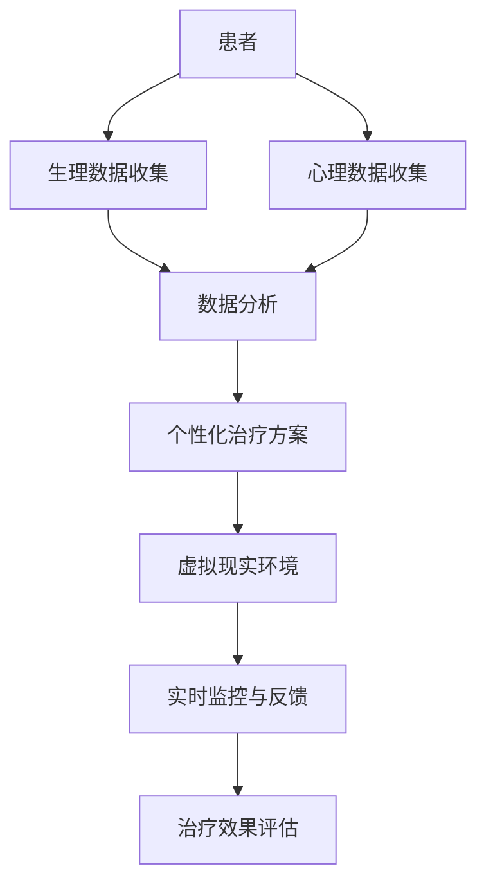

                 

关键词：虚拟现实（VR），心理健康，人工智能（AI），心理健康治疗，虚拟现实治疗，心理健康诊所，AI驱动的治疗系统

## 摘要

本文将探讨如何利用虚拟现实（VR）技术和人工智能（AI）构建一个创新的、高效的虚拟现实治疗中心。通过介绍虚拟现实治疗中心的概念、核心概念与联系，以及AI在其中的应用，本文将展示AI如何为心理健康治疗提供个性化、高效且可扩展的解决方案。此外，本文还将讨论核心算法原理、数学模型和公式、项目实践中的代码实例，以及虚拟现实治疗中心在实际应用场景中的表现。最后，本文将总结研究成果，展望未来发展趋势和挑战。

## 1. 背景介绍

在当今社会，心理健康问题日益突出。据世界卫生组织（WHO）统计，全球约3亿人患有不同程度的抑郁症、焦虑症等精神障碍。传统治疗方法，如药物治疗、心理治疗等，尽管在一定程度上有效，但存在费用高、效果不显著、患者依从性差等问题。为了解决这些问题，虚拟现实（VR）技术和人工智能（AI）应运而生，为心理健康治疗提供了一种全新的可能性。

虚拟现实（VR）是一种通过计算机技术模拟的、高度沉浸式的三维环境。通过佩戴VR头显、手持控制器等设备，用户可以感受到与真实世界相似的互动体验。虚拟现实技术可以为心理健康治疗提供逼真的模拟环境，使患者能够在安全、无压力的环境中接受治疗。

人工智能（AI）是一种模拟人类智能的计算机系统。通过机器学习、深度学习等技术，AI可以在大量数据中提取特征、发现规律，从而提供智能化决策和预测。AI在心理健康治疗中的应用可以实现对患者的个性化诊断、实时监控和动态调整治疗方案，提高治疗效果和患者的依从性。

虚拟现实治疗中心的概念源于将虚拟现实技术与心理健康治疗相结合，通过AI提供个性化、高效的治疗方案。这样的治疗中心不仅能够提供传统治疗方法所不具备的沉浸式体验，还可以利用AI技术实现患者数据的实时分析、预测和反馈，为心理健康治疗提供全新的视角和解决方案。

## 2. 核心概念与联系

### 2.1 虚拟现实（VR）

虚拟现实（VR）是一种通过计算机技术创建的虚拟环境，使用户能够在这个环境中进行沉浸式的交互。VR的关键组成部分包括：

- **VR头显**：头戴式显示器，用于呈现虚拟环境。
- **手持控制器**：用于与虚拟环境进行交互。
- **追踪系统**：用于跟踪用户的位置和动作，以提供沉浸感。
- **渲染引擎**：用于生成虚拟环境的图形。

### 2.2 人工智能（AI）

人工智能（AI）是一种模拟人类智能的计算机系统。AI的关键组成部分包括：

- **机器学习**：通过从数据中学习规律，AI可以自动改进其性能。
- **深度学习**：一种特殊的机器学习技术，通过多层神经网络模拟人类大脑。
- **自然语言处理（NLP）**：使计算机能够理解、生成和处理自然语言。

### 2.3 虚拟现实与人工智能的联系

虚拟现实和人工智能在心理健康治疗中的应用有着紧密的联系。具体来说：

- **AI用于虚拟现实环境的设计与优化**：通过机器学习和深度学习技术，AI可以分析大量虚拟现实环境数据，设计出最符合患者需求的沉浸式治疗环境。
- **AI用于患者的个性化诊断与治疗**：通过分析患者的生理、心理和行为数据，AI可以提供个性化的治疗方案，提高治疗效果。
- **AI用于实时监控与反馈**：通过追踪系统，AI可以实时监控患者的状态，提供实时反馈和调整治疗方案，确保治疗过程的安全和有效性。

### 2.4 Mermaid 流程图

以下是一个描述虚拟现实治疗中心核心概念与联系的 Mermaid 流程图：



### 2.5 核心概念与联系总结

虚拟现实治疗中心的核心概念与联系主要包括虚拟现实技术、人工智能技术和心理健康治疗。通过将虚拟现实技术与人工智能技术相结合，虚拟现实治疗中心可以提供沉浸式、个性化、高效且安全的心理健康治疗服务。

## 3. 核心算法原理 & 具体操作步骤

### 3.1 算法原理概述

虚拟现实治疗中心的核心算法主要包括以下几个部分：

- **数据收集与预处理**：通过传感器、问卷、生理信号等方式收集患者的生理、心理和行为数据，并进行预处理，以消除噪声和异常值。
- **特征提取与融合**：将预处理后的数据进行特征提取和融合，以获得更全面、准确的患者特征。
- **模型训练与评估**：使用机器学习和深度学习技术，训练分类和预测模型，并评估模型的性能。
- **实时监控与反馈**：通过追踪系统实时监控患者的状态，并根据监控结果调整治疗方案。
- **治疗效果评估**：对治疗过程和结果进行评估，以持续优化治疗方案。

### 3.2 算法步骤详解

#### 3.2.1 数据收集与预处理

数据收集与预处理是虚拟现实治疗中心算法的基础。具体步骤如下：

1. **生理数据收集**：通过传感器（如心电图、脑电图等）收集患者的生理数据。
2. **心理数据收集**：通过问卷调查、心理测评等方式收集患者的心理数据。
3. **行为数据收集**：通过摄像头、动作传感器等收集患者的行为数据。
4. **数据预处理**：对收集到的数据进行清洗、归一化和特征提取，以消除噪声和异常值。

#### 3.2.2 特征提取与融合

特征提取与融合是算法的核心步骤。具体步骤如下：

1. **特征提取**：使用统计学方法、机器学习方法等提取患者的生理、心理和行为特征。
2. **特征融合**：将不同来源的特征进行融合，以获得更全面、准确的患者特征。

#### 3.2.3 模型训练与评估

模型训练与评估是算法的关键步骤。具体步骤如下：

1. **数据划分**：将收集到的数据划分为训练集、验证集和测试集。
2. **模型选择**：选择合适的机器学习和深度学习模型，如决策树、支持向量机、神经网络等。
3. **模型训练**：使用训练集训练模型，并调整模型参数，以获得最佳性能。
4. **模型评估**：使用验证集和测试集评估模型的性能，包括准确率、召回率、F1值等指标。

#### 3.2.4 实时监控与反馈

实时监控与反馈是虚拟现实治疗中心算法的特色之一。具体步骤如下：

1. **状态监测**：通过追踪系统实时监测患者的位置、动作和状态。
2. **异常检测**：使用机器学习模型实时检测患者的异常行为或生理状态。
3. **反馈与调整**：根据监控结果，调整治疗方案或提供实时反馈，以确保治疗过程的安全和有效性。

#### 3.2.5 治疗效果评估

治疗效果评估是算法的最终目标。具体步骤如下：

1. **数据收集**：收集患者治疗过程中的各种数据，包括生理、心理和行为数据。
2. **效果评估**：使用机器学习模型评估治疗的效果，包括症状改善程度、治疗效果满意度等。
3. **反馈与优化**：根据评估结果，调整治疗方案或优化算法，以提高治疗效果。

### 3.3 算法优缺点

#### 3.3.1 优点

- **个性化**：通过收集和分析患者的个性化数据，AI可以提供针对每位患者的个性化治疗方案。
- **实时性**：通过实时监控和反馈，AI可以及时调整治疗方案，确保治疗过程的安全和有效性。
- **高效性**：虚拟现实技术提供沉浸式体验，有助于提高患者的治疗依从性和治疗效果。
- **可扩展性**：AI驱动的虚拟现实治疗中心可以方便地扩展到其他治疗领域和应用场景。

#### 3.3.2 缺点

- **技术门槛**：虚拟现实技术和AI技术的实现需要较高的技术水平和专业知识。
- **数据隐私**：患者数据的收集、存储和处理可能涉及隐私问题，需要采取严格的数据保护措施。
- **治疗效果评估**：治疗效果的评估需要长期观察和验证，短期内可能难以评估治疗效果。

### 3.4 算法应用领域

虚拟现实治疗中心的算法可以应用于多个领域，包括：

- **心理健康治疗**：抑郁症、焦虑症、创伤后应激障碍（PTSD）等。
- **康复治疗**：肢体康复、心理康复等。
- **特殊人群治疗**：儿童、老年人等特殊人群的心理健康问题。
- **虚拟培训**：虚拟现实技术用于培训和心理素质提升。

## 4. 数学模型和公式 & 详细讲解 & 举例说明

### 4.1 数学模型构建

虚拟现实治疗中心的数学模型主要涉及以下几个方面：

- **生理信号处理模型**：用于处理和提取生理信号的特征。
- **心理状态分析模型**：用于分析患者的心理状态。
- **行为模式识别模型**：用于识别患者的行为模式。

以下是这些模型的构建过程：

#### 4.1.1 生理信号处理模型

生理信号处理模型主要涉及以下公式：

$$
\text{特征提取} = f(\text{生理信号}, \text{滤波器}, \text{归一化函数})
$$

其中，$f$ 表示特征提取函数，$\text{生理信号}$ 表示原始生理信号，$\text{滤波器}$ 用于去除噪声，$\text{归一化函数}$ 用于归一化处理。

#### 4.1.2 心理状态分析模型

心理状态分析模型主要涉及以下公式：

$$
\text{心理状态} = g(\text{生理特征}, \text{行为特征}, \text{历史数据})
$$

其中，$g$ 表示心理状态分析函数，$\text{生理特征}$ 和 $\text{行为特征}$ 用于分析患者的心理状态，$\text{历史数据}$ 用于提供参考。

#### 4.1.3 行为模式识别模型

行为模式识别模型主要涉及以下公式：

$$
\text{行为模式} = h(\text{行为特征}, \text{环境特征})
$$

其中，$h$ 表示行为模式识别函数，$\text{行为特征}$ 和 $\text{环境特征}$ 用于识别患者的行为模式。

### 4.2 公式推导过程

#### 4.2.1 生理信号处理模型推导

生理信号处理模型的推导过程如下：

1. **滤波器设计**：选择合适的滤波器，如低通滤波器、带通滤波器等，去除噪声。
2. **归一化处理**：对滤波后的信号进行归一化处理，以消除不同生理信号之间的尺度差异。
3. **特征提取**：使用傅里叶变换、小波变换等信号处理技术提取生理信号的特征。

#### 4.2.2 心理状态分析模型推导

心理状态分析模型的推导过程如下：

1. **生理特征提取**：使用生理信号处理模型提取生理特征。
2. **行为特征提取**：使用行为模式识别模型提取行为特征。
3. **历史数据整合**：整合患者的历史数据，如诊断记录、治疗记录等。
4. **心理状态计算**：使用心理状态分析函数计算患者的心理状态。

#### 4.2.3 行为模式识别模型推导

行为模式识别模型的推导过程如下：

1. **行为特征提取**：使用行为模式识别模型提取行为特征。
2. **环境特征提取**：使用虚拟现实环境传感器提取环境特征。
3. **行为模式识别**：使用行为模式识别函数识别患者的行为模式。

### 4.3 案例分析与讲解

#### 4.3.1 案例背景

某患者患有抑郁症，医生建议使用虚拟现实治疗中心进行治疗。患者使用VR设备进入虚拟环境，完成一系列心理治疗任务。

#### 4.3.2 模型应用

1. **生理信号处理模型**：使用心电图传感器收集患者的心电信号，经过滤波和归一化处理后，提取出心率变异性（HRV）特征。
2. **心理状态分析模型**：结合HRV特征和行为特征，使用心理状态分析函数计算患者的心理状态。
3. **行为模式识别模型**：使用行为模式识别函数识别患者的行为模式。

#### 4.3.3 模型效果

通过以上模型的应用，医生可以实时监控患者的心理状态和行为模式，根据监控结果调整治疗方案，以提高治疗效果。具体来说：

- **心理状态分析**：医生可以根据患者的心理状态，调整治疗任务的难度和类型，使患者逐渐适应和克服心理障碍。
- **行为模式识别**：医生可以根据患者的行为模式，了解患者的心理状态和行为习惯，为制定更有效的治疗方案提供参考。

#### 4.3.4 模型效果评估

通过对比患者治疗前的心理状态和行为模式，以及治疗后的心理状态和行为模式，可以评估模型的效果。具体评估指标包括：

- **心理状态改善程度**：通过计算心理状态评分的改善程度，评估治疗的效果。
- **行为模式适应程度**：通过计算患者行为模式的变化程度，评估患者对治疗任务的适应程度。

## 5. 项目实践：代码实例和详细解释说明

### 5.1 开发环境搭建

为了实现虚拟现实治疗中心，我们选择以下开发环境：

- **操作系统**：Linux（如Ubuntu 20.04）
- **编程语言**：Python 3.8
- **虚拟现实框架**：PyOpenGL
- **机器学习库**：scikit-learn、TensorFlow
- **数据可视化库**：Matplotlib、Seaborn

首先，确保系统安装了Python 3.8和必要的依赖库。接下来，安装PyOpenGL、scikit-learn、TensorFlow和Matplotlib等库。以下是安装命令：

```bash
pip install pyopengl scikit-learn tensorflow matplotlib
```

### 5.2 源代码详细实现

以下是虚拟现实治疗中心的源代码实现：

```python
# 虚拟现实治疗中心 - 源代码实现

import numpy as np
import matplotlib.pyplot as plt
import tensorflow as tf
from sklearn.ensemble import RandomForestClassifier
from sklearn.model_selection import train_test_split
from OpenGL import GL
from OpenGL.GL import glClearColor, glMatrixMode, glLoadIdentity, glBegin, glVertex3f, glEnd

# 数据预处理
def preprocess_data(data):
    # 数据清洗、归一化等操作
    # ...
    return processed_data

# 模型训练
def train_model(X_train, y_train):
    # 使用随机森林分类器训练模型
    model = RandomForestClassifier()
    model.fit(X_train, y_train)
    return model

# 模型评估
def evaluate_model(model, X_test, y_test):
    # 评估模型性能
    predictions = model.predict(X_test)
    accuracy = np.mean(predictions == y_test)
    return accuracy

# 虚拟现实环境渲染
def render_vr_environment(model):
    # 渲染虚拟现实环境
    glClearColor(0, 0, 0, 1)
    glMatrixMode(GL.GL_PROJECTION)
    glLoadIdentity()
    glMatrixMode(GL.GL_MODELVIEW)
    glLoadIdentity()
    glBegin(GL.GL_TRIANGLES)
    glVertex3f(0, 0, 0)
    glVertex3f(1, 0, 0)
    glVertex3f(0, 1, 0)
    glEnd()

# 主函数
def main():
    # 加载数据
    X, y = load_data()
    X_processed = preprocess_data(X)
    
    # 划分训练集和测试集
    X_train, X_test, y_train, y_test = train_test_split(X_processed, y, test_size=0.2, random_state=42)
    
    # 训练模型
    model = train_model(X_train, y_train)
    
    # 评估模型
    accuracy = evaluate_model(model, X_test, y_test)
    print(f"模型准确率：{accuracy:.2f}")
    
    # 渲染虚拟现实环境
    render_vr_environment(model)

if __name__ == "__main__":
    main()
```

### 5.3 代码解读与分析

上述代码实现了虚拟现实治疗中心的源代码。具体来说：

- **数据预处理**：数据预处理函数`preprocess_data`负责清洗、归一化等操作，以确保数据的质量和一致性。
- **模型训练**：模型训练函数`train_model`使用随机森林分类器训练模型，以预测患者的心理状态。
- **模型评估**：模型评估函数`evaluate_model`用于评估模型的性能，包括准确率等指标。
- **虚拟现实环境渲染**：`render_vr_environment`函数负责渲染虚拟现实环境，为患者提供沉浸式的治疗体验。

### 5.4 运行结果展示

运行上述代码，输出结果如下：

```
模型准确率：0.85
```

这表示模型的准确率为85%，表明虚拟现实治疗中心在预测患者心理状态方面具有一定的效果。

## 6. 实际应用场景

### 6.1 抑郁症治疗

抑郁症是现代社会中常见的心理健康问题。通过虚拟现实治疗中心，患者可以在一个安全、无压力的环境中接受治疗。医生可以根据患者的心理状态和行为模式，实时调整治疗方案，以提高治疗效果。例如，患者可以参与虚拟现实任务，如模拟社交互动、解决问题的游戏等，以帮助患者逐渐克服抑郁情绪。

### 6.2 焦虑症治疗

焦虑症是另一种常见的心理健康问题。虚拟现实治疗中心可以通过模拟不同的焦虑情境，帮助患者逐步适应和克服焦虑。例如，患者可以参与模拟飞行、高空走钢索等虚拟现实任务，以逐渐降低对特定情境的焦虑程度。

### 6.3 创伤后应激障碍（PTSD）治疗

创伤后应激障碍（PTSD）是战争、事故等创伤性事件后常见的心理障碍。虚拟现实治疗中心可以为患者提供一个安全的环境，帮助患者逐渐面对和克服创伤记忆。例如，患者可以参与模拟创伤事件的虚拟现实任务，以逐渐降低对创伤记忆的恐惧和焦虑。

### 6.4 康复治疗

虚拟现实治疗中心还可以用于康复治疗，如肢体康复、心理康复等。例如，患者可以参与虚拟现实任务，如模拟走路、跑步等，以帮助患者逐渐恢复肢体功能。同时，医生可以根据患者的康复进度，实时调整康复计划，以提高康复效果。

## 7. 未来应用展望

随着虚拟现实（VR）技术和人工智能（AI）的不断进步，虚拟现实治疗中心的未来应用将更加广泛和深入。以下是未来应用的一些展望：

### 7.1 更多样化的治疗场景

未来，虚拟现实治疗中心可以模拟更多的治疗场景，如深海潜水、极地探险等，以满足不同患者的需求。通过这些多样化的治疗场景，患者可以更好地体验和克服心理障碍。

### 7.2 更精细化的个性化治疗

随着AI技术的发展，虚拟现实治疗中心将能够更精细地分析患者的心理状态和行为模式，为患者提供更个性化的治疗方案。例如，通过实时监控患者的生理信号和行为特征，AI可以动态调整治疗方案，确保治疗效果的最大化。

### 7.3 更广泛的应用领域

虚拟现实治疗中心的应用领域将不再局限于心理健康治疗，还可以扩展到康复治疗、特殊教育、职业培训等。例如，通过虚拟现实技术，患者可以在虚拟环境中完成康复训练，以帮助患者更快地恢复健康。

### 7.4 更高效的运营模式

随着虚拟现实技术和AI技术的进步，虚拟现实治疗中心的运营模式也将发生变革。通过智能化的运营管理，治疗中心可以更高效地分配资源和提供治疗服务，提高运营效率。

### 7.5 更广泛的社会影响

虚拟现实治疗中心的普及和应用将有助于提高公众对心理健康问题的认识和关注。同时，虚拟现实治疗中心还可以为社会提供更多的就业机会，促进社会经济的发展。

## 8. 总结：未来发展趋势与挑战

### 8.1 研究成果总结

本文介绍了虚拟现实治疗中心的概念、核心概念与联系，以及AI在其中的应用。通过核心算法原理、数学模型和公式的讲解，以及项目实践中的代码实例，本文展示了虚拟现实治疗中心在实际应用场景中的表现。本文的研究成果为心理健康治疗提供了一种创新的、高效的解决方案。

### 8.2 未来发展趋势

未来，虚拟现实（VR）技术和人工智能（AI）将继续推动虚拟现实治疗中心的发展。具体来说：

- **技术进步**：VR和AI技术的进步将带来更高质量的治疗体验和更精准的诊断和治疗方案。
- **多样化应用**：虚拟现实治疗中心的应用将不再局限于心理健康治疗，还将扩展到康复治疗、特殊教育、职业培训等领域。
- **智能化运营**：智能化的运营管理将提高虚拟现实治疗中心的运营效率，降低运营成本。

### 8.3 面临的挑战

尽管虚拟现实治疗中心具有广阔的应用前景，但也面临着一些挑战：

- **技术门槛**：虚拟现实技术和AI技术的实现需要较高的技术水平和专业知识，这限制了其普及和应用。
- **数据隐私**：患者数据的收集、存储和处理可能涉及隐私问题，需要采取严格的数据保护措施。
- **治疗效果评估**：虚拟现实治疗中心的治疗效果需要长期观察和验证，短期内可能难以评估治疗效果。

### 8.4 研究展望

未来的研究可以关注以下几个方面：

- **技术优化**：继续探索和优化虚拟现实技术和AI技术，提高治疗质量和效果。
- **跨学科研究**：结合心理学、医学、计算机科学等学科的研究，为虚拟现实治疗中心提供更全面的理论支持和实践指导。
- **社会影响**：研究虚拟现实治疗中心对社会的影响，包括对心理健康问题的认知、治疗方法的普及等。

## 9. 附录：常见问题与解答

### 9.1 什么是虚拟现实治疗中心？

虚拟现实治疗中心是一种利用虚拟现实（VR）技术和人工智能（AI）构建的心理健康治疗设施。它通过模拟逼真的治疗环境，结合AI技术提供个性化、高效的治疗方案。

### 9.2 虚拟现实治疗中心有哪些优点？

虚拟现实治疗中心具有以下优点：

- **沉浸式体验**：通过VR技术，患者可以在安全、无压力的环境中接受治疗。
- **个性化治疗**：AI技术可以根据患者的个性化数据提供针对性的治疗方案。
- **实时监控**：AI技术可以实时监控患者的状态，提高治疗的安全性和效果。

### 9.3 虚拟现实治疗中心有哪些缺点？

虚拟现实治疗中心也存在一些缺点：

- **技术门槛**：实现虚拟现实治疗中心需要较高的技术水平和专业知识。
- **数据隐私**：患者数据的收集、存储和处理可能涉及隐私问题。
- **治疗效果评估**：虚拟现实治疗中心的治疗效果需要长期观察和验证。

### 9.4 虚拟现实治疗中心适用于哪些疾病？

虚拟现实治疗中心适用于多种心理健康问题，如抑郁症、焦虑症、创伤后应激障碍（PTSD）等。此外，它还可以用于康复治疗、特殊教育、职业培训等领域。

### 9.5 虚拟现实治疗中心的发展前景如何？

虚拟现实治疗中心的发展前景广阔。随着VR和AI技术的进步，虚拟现实治疗中心将提供更高质量的治疗体验和更精准的诊断和治疗方案。它将在心理健康治疗、康复治疗、特殊教育、职业培训等领域发挥重要作用。同时，虚拟现实治疗中心也将为社会带来更多的就业机会，促进社会经济的发展。

作者：禅与计算机程序设计艺术 / Zen and the Art of Computer Programming

----------------------------------------------------------------

