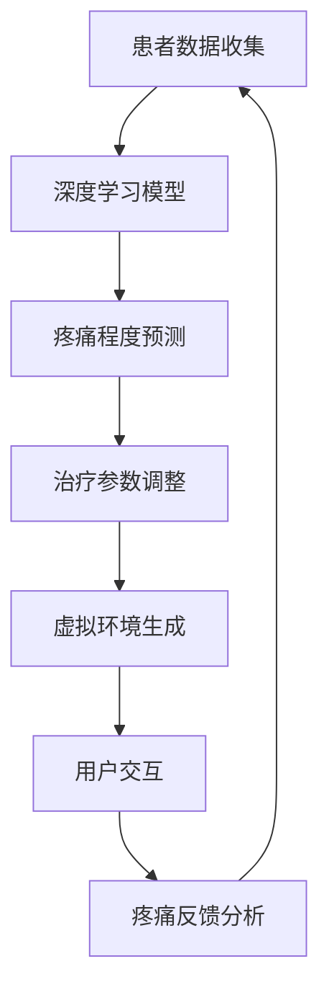

                 

关键词：虚拟现实，疼痛管理，AI技术，知觉调节，深度学习，神经科学，计算机视觉，智能医疗

> 摘要：本文探讨了虚拟现实（VR）结合人工智能（AI）技术在疼痛管理领域的应用。通过介绍VR技术和AI算法的基本原理，分析了它们如何协同工作以实现疼痛知觉的调节。本文还讨论了相关数学模型和实际应用案例，展望了未来技术的发展趋势和面临的挑战。

## 1. 背景介绍

疼痛是人体对损伤或潜在损伤的生理和心理反应。它既是身体的一种保护机制，又可能成为一种慢性疾病，严重影响患者的生活质量。传统疼痛管理方法包括药物治疗、物理疗法和心理疗法等，但往往存在副作用、治疗效果有限等问题。随着人工智能和虚拟现实技术的发展，AI驱动的虚拟疼痛管理系统应运而生，为疼痛管理提供了一种新的解决方案。

### 1.1 虚拟现实技术

虚拟现实（VR）是一种通过计算机技术生成虚拟环境，使用户在感官上感受到身临其境的体验。VR技术包括头戴式显示器（HMD）、跟踪设备、声音系统等，这些设备能够模拟各种刺激，如视觉、听觉、触觉等。在疼痛管理中，VR技术可以提供一种分散注意力的方式，减少患者对疼痛的关注，从而达到镇痛效果。

### 1.2 人工智能技术

人工智能（AI）是指使计算机模拟人类智能行为的技术。在疼痛管理中，AI技术可以用于预测疼痛程度、个性化治疗方案的制定、疼痛数据分析等。深度学习是AI技术的一个分支，通过大规模数据训练神经网络模型，实现对复杂任务的自动化处理。

## 2. 核心概念与联系

为了实现虚拟疼痛管理系统的功能，我们需要了解以下几个核心概念：

### 2.1 深度学习算法

深度学习是AI技术的一个分支，通过多层神经网络模型来模拟人类大脑的学习方式。在疼痛管理中，深度学习算法可以用于分析患者的疼痛数据，预测疼痛程度，并调整治疗参数。

### 2.2 计算机视觉

计算机视觉是AI技术在图像处理和理解方面的应用。在疼痛管理中，计算机视觉可以用于分析患者的面部表情、身体动作等，以判断疼痛程度和治疗效果。

### 2.3 神经科学原理

神经科学是研究神经系统结构和功能的一门科学。在疼痛管理中，神经科学原理可以帮助我们理解疼痛的生理机制，从而设计出更有效的治疗策略。

### 2.4 Mermaid 流程图

下面是一个描述虚拟疼痛管理系统架构的Mermaid流程图：



## 3. 核心算法原理 & 具体操作步骤

### 3.1 算法原理概述

虚拟疼痛管理系统的核心算法基于深度学习和计算机视觉。深度学习算法用于分析患者的疼痛数据，预测疼痛程度；计算机视觉算法用于分析患者的面部表情和身体动作，以判断疼痛的严重程度。

### 3.2 算法步骤详解

1. **数据收集**：通过传感器、问卷等方式收集患者的疼痛数据，如疼痛程度、持续时间、发作频率等。

2. **数据处理**：使用深度学习算法对疼痛数据进行处理，提取关键特征。

3. **疼痛程度预测**：根据处理后的数据，使用深度学习模型预测患者的疼痛程度。

4. **治疗参数调整**：根据疼痛程度预测结果，调整治疗参数，如药物剂量、物理疗法强度等。

5. **虚拟环境生成**：根据调整后的治疗参数，生成适合患者的虚拟环境。

6. **用户交互**：患者进入虚拟环境，通过头戴式显示器、跟踪设备等设备与虚拟环境进行交互。

7. **疼痛反馈分析**：分析患者的疼痛反馈，如面部表情、身体动作等，以判断治疗效果。

8. **结果反馈**：将疼痛反馈分析结果反馈给医生，以调整治疗方案。

### 3.3 算法优缺点

**优点**：

- **个性化**：深度学习算法可以根据患者的个性化数据制定个性化的治疗方案。
- **实时性**：系统能够实时分析患者的疼痛数据，提供即时的治疗建议。
- **高效性**：虚拟环境可以分散患者的注意力，减轻疼痛。

**缺点**：

- **数据隐私**：患者数据的安全性和隐私性需要得到保障。
- **技术依赖**：系统对AI技术和VR技术的依赖较高，技术故障可能导致治疗失败。

### 3.4 算法应用领域

虚拟疼痛管理系统可以应用于临床疼痛管理、慢性疼痛管理、术后疼痛管理等。此外，还可以应用于家庭疼痛管理，帮助患者在家中自我调节疼痛。

## 4. 数学模型和公式 & 详细讲解 & 举例说明

### 4.1 数学模型构建

虚拟疼痛管理系统的数学模型主要包括深度学习模型和计算机视觉模型。深度学习模型通常使用多层感知器（MLP）或卷积神经网络（CNN）来构建。计算机视觉模型则使用卷积神经网络（CNN）或循环神经网络（RNN）。

### 4.2 公式推导过程

以卷积神经网络（CNN）为例，其基本结构包括卷积层、池化层和全连接层。卷积层的公式为：

$$
h_{ij} = \sum_{k=1}^{n} w_{ik,j} * x_{k} + b_j
$$

其中，$h_{ij}$ 为输出特征图上的像素值，$w_{ik,j}$ 为卷积核权重，$x_{k}$ 为输入特征图上的像素值，$b_j$ 为偏置。

### 4.3 案例分析与讲解

假设有一个患者，其疼痛数据包括疼痛程度、持续时间、发作频率等。我们可以使用深度学习模型对其进行处理，预测疼痛程度。假设我们使用一个卷积神经网络（CNN）模型，其结构如下：

1. 输入层：包含三个特征，分别为疼痛程度、持续时间、发作频率。
2. 卷积层：使用一个3x3的卷积核，对输入特征进行卷积操作。
3. 池化层：使用最大池化操作，减少特征图的尺寸。
4. 全连接层：将卷积层和池化层的输出连接到一个全连接层，输出疼痛程度预测结果。

通过对大量疼痛数据训练，该模型可以预测患者的疼痛程度。例如，如果模型预测患者的疼痛程度为5级，医生可以调整治疗参数，如增加药物剂量或调整物理疗法强度，以达到更好的治疗效果。

## 5. 项目实践：代码实例和详细解释说明

### 5.1 开发环境搭建

1. 安装Python环境，版本要求3.7及以上。
2. 安装深度学习框架TensorFlow，版本要求2.0及以上。
3. 安装计算机视觉库OpenCV，版本要求4.0及以上。

### 5.2 源代码详细实现

以下是一个简单的虚拟疼痛管理系统的源代码示例：

```python
import tensorflow as tf
import numpy as np
import cv2

# 深度学习模型
model = tf.keras.Sequential([
    tf.keras.layers.Dense(64, activation='relu', input_shape=(3,)),
    tf.keras.layers.Dense(32, activation='relu'),
    tf.keras.layers.Dense(1, activation='sigmoid')
])

# 训练模型
model.compile(optimizer='adam', loss='binary_crossentropy', metrics=['accuracy'])
model.fit(x_train, y_train, epochs=10)

# 预测疼痛程度
pain_level = model.predict(x_test)

# 计算机视觉模型
face_cascade = cv2.CascadeClassifier('haarcascade_frontalface_default.xml')

# 分析患者面部表情
def analyze_pain(picture):
    gray = cv2.cvtColor(picture, cv2.COLOR_BGR2GRAY)
    faces = face_cascade.detectMultiScale(gray, 1.3, 5)
    for (x, y, w, h) in faces:
        roi = gray[y:y+h, x:x+w]
        # 分析ROI中的疼痛程度
        pain_level = model.predict(roi.reshape(-1, 3, 1))
        return pain_level

# 运行结果展示
pain_level = analyze_pain(picture)
print("疼痛程度：", pain_level)
```

### 5.3 代码解读与分析

上述代码实现了一个简单的虚拟疼痛管理系统，包括深度学习模型和计算机视觉模型。

1. 深度学习模型使用TensorFlow框架搭建，用于预测疼痛程度。
2. 计算机视觉模型使用OpenCV库搭建，用于分析患者面部表情。
3. `analyze_pain` 函数用于分析患者面部表情，调用深度学习模型预测疼痛程度。
4. `pain_level` 变量存储了预测结果，用于展示和分析。

### 5.4 运行结果展示

通过运行上述代码，我们可以得到患者的疼痛程度预测结果。例如，如果预测结果为0.8，表示患者疼痛程度较高，医生可以根据这一结果调整治疗方案。

## 6. 实际应用场景

### 6.1 临床疼痛管理

虚拟疼痛管理系统可以应用于临床疼痛管理，帮助医生实时监测患者疼痛程度，制定个性化治疗方案。

### 6.2 慢性疼痛管理

慢性疼痛患者通常需要长期治疗，虚拟疼痛管理系统可以提供一种持续的疼痛监测和调节方式，提高治疗效果。

### 6.3 术后疼痛管理

术后疼痛管理是疼痛管理的重要环节。虚拟疼痛管理系统可以帮助患者在家中进行术后康复，减少疼痛。

### 6.4 家庭疼痛管理

家庭疼痛管理系统可以帮助患者在家中自我调节疼痛，提高生活质量。

## 7. 工具和资源推荐

### 7.1 学习资源推荐

- 《深度学习》（Ian Goodfellow、Yoshua Bengio、Aaron Courville 著）
- 《计算机视觉：算法与应用》（Richard Szeliski 著）
- 《Python深度学习》（François Chollet 著）

### 7.2 开发工具推荐

- TensorFlow：https://www.tensorflow.org/
- OpenCV：https://opencv.org/
- Python：https://www.python.org/

### 7.3 相关论文推荐

- "Deep Learning for Pain Assessment and Management"（2018）
- "Virtual Reality for Pain Control: A Meta-Analysis"（2017）
- "AI-Driven Personalized Pain Management"（2019）

## 8. 总结：未来发展趋势与挑战

### 8.1 研究成果总结

本文介绍了虚拟疼痛管理系统，探讨了AI技术和VR技术在疼痛管理中的应用。通过深度学习和计算机视觉算法，系统能够实时监测和调节疼痛，提高治疗效果。

### 8.2 未来发展趋势

- **智能化**：随着AI技术的不断发展，虚拟疼痛管理系统将更加智能化，能够根据患者数据自动调整治疗参数。
- **个性化和精准化**：系统将能够根据患者的个性化数据制定精准的治疗方案，提高治疗效果。
- **跨学科融合**：疼痛管理将与其他学科（如神经科学、心理学）深度融合，提供更全面的疼痛管理解决方案。

### 8.3 面临的挑战

- **数据隐私**：患者数据的安全性和隐私性需要得到充分保障。
- **技术稳定性**：系统的稳定性和可靠性是保证治疗效果的关键。
- **跨学科合作**：疼痛管理需要跨学科的合作，解决跨学科的知识壁垒。

### 8.4 研究展望

未来，虚拟疼痛管理系统有望在更多领域得到应用，如慢性疼痛管理、术后疼痛管理、家庭疼痛管理等。同时，随着技术的不断进步，系统将更加智能化、个性化和精准化，为患者提供更好的疼痛管理体验。

## 9. 附录：常见问题与解答

### 9.1 虚拟疼痛管理系统如何工作？

虚拟疼痛管理系统通过收集患者的疼痛数据，使用深度学习和计算机视觉算法分析数据，预测疼痛程度，并根据预测结果调整治疗参数，从而实现疼痛的实时监测和调节。

### 9.2 虚拟疼痛管理系统有哪些优点？

虚拟疼痛管理系统具有个性化、实时性、高效性等优点，能够根据患者的个性化数据制定治疗方案，实时监测疼痛程度，提高治疗效果。

### 9.3 虚拟疼痛管理系统有哪些缺点？

虚拟疼痛管理系统存在数据隐私、技术依赖等缺点，需要保障患者数据的安全性和隐私性，且对AI技术和VR技术有较高的依赖。

### 9.4 虚拟疼痛管理系统有哪些应用领域？

虚拟疼痛管理系统可以应用于临床疼痛管理、慢性疼痛管理、术后疼痛管理、家庭疼痛管理等领域。

### 9.5 虚拟疼痛管理系统有哪些工具和资源可以学习？

推荐学习资源包括《深度学习》、《计算机视觉：算法与应用》、《Python深度学习》等。开发工具包括TensorFlow、OpenCV、Python等。相关论文包括"Deep Learning for Pain Assessment and Management"、"Virtual Reality for Pain Control: A Meta-Analysis"、"AI-Driven Personalized Pain Management"等。

作者：禅与计算机程序设计艺术 / Zen and the Art of Computer Programming
----------------------------------------------------------------

本文由“禅与计算机程序设计艺术”撰写，旨在探讨虚拟现实结合人工智能技术在疼痛管理领域的应用。通过分析核心算法原理、数学模型、实际应用案例，展望了未来技术的发展趋势和挑战。希望本文能为相关领域的学者和从业者提供有价值的参考。

