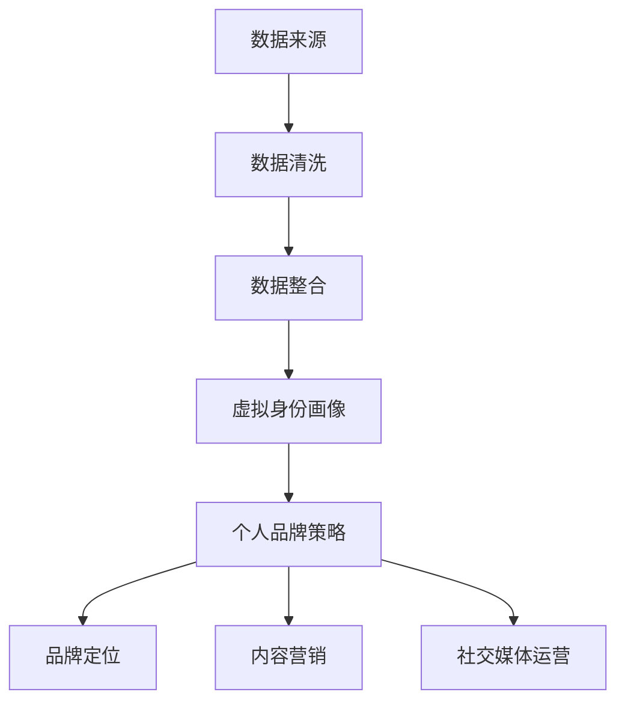
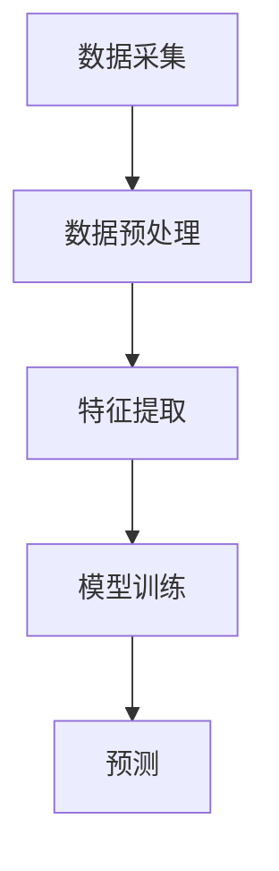
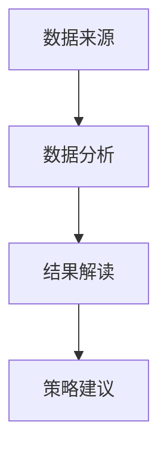

                 

### 1. 背景介绍

随着人工智能技术的飞速发展，虚拟身份（Virtual Identity）的概念逐渐走进了人们的视野。虚拟身份，也被称为数字身份或网络身份，是一种由数据、算法、协议和网络构建的在线身份，可以代表个人或实体在网络世界中的存在。随着虚拟身份的普及，个人品牌建设成为了一个不可忽视的领域。在这个背景下，虚拟身份市场分析专家应运而生，他们通过深入分析虚拟身份市场的现状、趋势和应用，为个人和企业提供专业的品牌建设策略。

个人品牌，是指个人在网络世界中的形象和声誉，它不仅仅是一个简单的标识，更是一个综合实力的体现。个人品牌建设的重要性不言而喻，它可以帮助个人在职场和社交场合中脱颖而出，提升个人价值和影响力。然而，在虚拟世界中，个人品牌的建设面临着诸多挑战，如信息真实性、隐私保护、信誉构建等。这就需要专业的个人品牌顾问来提供指导和支持。

AI时代的个人品牌顾问，不仅要具备深厚的品牌营销知识，还要熟练掌握人工智能技术和数据分析工具。他们通过大数据分析和机器学习算法，对虚拟身份市场进行深入剖析，帮助个人和企业找到最佳的定位和策略。本文将围绕虚拟身份市场分析、个人品牌建设、AI技术运用等方面展开讨论，旨在为读者提供全面、系统的认知和理解。

### 2. 核心概念与联系

#### 2.1 虚拟身份与个人品牌

虚拟身份和个人品牌是两个密不可分的概念。虚拟身份是个人在网络世界中的存在形式，而个人品牌则是虚拟身份的核心价值。一个成功的个人品牌需要建立在真实的虚拟身份基础上，而一个可靠的虚拟身份也需要有良好的个人品牌来支撑。

在图1中，我们可以看到虚拟身份和个人品牌之间的互动关系。数据来源（Data Source）包括个人在社交媒体、论坛、博客等平台上的行为和互动，这些数据经过数据清洗（Data Cleaning）和整合（Data Integration）后，形成了一个完整的虚拟身份画像（Virtual Identity Profile）。个人品牌策略（Brand Strategy）则是在这个基础上，通过品牌定位（Brand Positioning）、内容营销（Content Marketing）和社交媒体运营（Social Media Management）等手段来打造和提升个人品牌价值。



#### 2.2 AI技术在虚拟身份分析中的应用

人工智能技术在虚拟身份分析中发挥着重要作用。通过自然语言处理（NLP）、图像识别（Image Recognition）、推荐系统（Recommender Systems）等AI技术，可以实现对大量虚拟身份数据的自动分析和理解。

在图2中，我们可以看到AI技术在虚拟身份分析中的应用流程。数据采集（Data Collection）阶段，通过爬虫工具获取社交媒体、论坛等平台上的数据；数据预处理（Data Preprocessing）阶段，对数据进行清洗和整合；特征提取（Feature Extraction）阶段，使用NLP和图像识别技术提取关键特征；模型训练（Model Training）阶段，使用机器学习算法对特征进行建模；最后在预测（Prediction）阶段，通过训练好的模型对新的虚拟身份进行分析和评估。



#### 2.3 虚拟身份市场分析框架

为了更好地进行虚拟身份市场分析，我们需要一个完整的分析框架。图3展示了虚拟身份市场分析的总体框架，包括数据来源、数据分析、结果解读和策略建议等环节。

1. **数据来源**：包括社交媒体、论坛、博客、新闻报道等。
2. **数据分析**：通过AI技术对数据进行处理和分析，包括数据清洗、特征提取、建模和预测。
3. **结果解读**：对分析结果进行解读，识别市场趋势、竞争态势和用户需求。
4. **策略建议**：根据分析结果，为个人和企业提供品牌建设策略。



### 3. 核心算法原理 & 具体操作步骤

#### 3.1 算法原理概述

虚拟身份市场分析的核心算法主要基于机器学习和深度学习技术。以下将介绍三种常用的算法：协同过滤（Collaborative Filtering）、文本挖掘（Text Mining）和图神经网络（Graph Neural Networks）。

1. **协同过滤**：通过分析用户的行为数据，发现用户之间的相似性，从而推荐潜在的兴趣点。常用的协同过滤算法包括基于用户的协同过滤（User-based Collaborative Filtering）和基于物品的协同过滤（Item-based Collaborative Filtering）。

2. **文本挖掘**：通过对文本数据进行分析，提取关键词、情感和主题。常用的文本挖掘算法包括TF-IDF、LDA和情感分析（Sentiment Analysis）。

3. **图神经网络**：通过建模虚拟身份之间的交互关系，对虚拟身份进行分类和预测。常用的图神经网络算法包括Graph Convolutional Networks（GCN）和GraphSAGE。

#### 3.2 算法步骤详解

1. **协同过滤算法**

   - **数据预处理**：对用户行为数据进行清洗和归一化处理，构建用户-物品矩阵。

   - **用户相似度计算**：计算用户之间的相似度，常用的方法包括余弦相似度和皮尔逊相关系数。

   - **兴趣点推荐**：根据用户相似度矩阵，推荐与目标用户兴趣相似的物品。

2. **文本挖掘算法**

   - **关键词提取**：使用TF-IDF算法提取文本中的关键词。

   - **情感分析**：使用深度学习模型（如BERT）对文本进行情感分类。

   - **主题建模**：使用LDA算法对文本进行主题分类。

3. **图神经网络算法**

   - **数据预处理**：将虚拟身份数据转换为图结构，包括节点和边。

   - **图神经网络建模**：使用GCN或GraphSAGE算法对图进行建模。

   - **分类与预测**：使用训练好的模型对新的虚拟身份进行分类和预测。

#### 3.3 算法优缺点

- **协同过滤算法**：
  - **优点**：简单、高效，适用于推荐系统。
  - **缺点**：容易陷入局部最优，对稀疏数据效果较差。

- **文本挖掘算法**：
  - **优点**：能够提取文本中的关键信息，适用于文本分类和主题建模。
  - **缺点**：对大量文本数据计算量大，对噪声敏感。

- **图神经网络算法**：
  - **优点**：能够建模复杂的关系网络，适用于虚拟身份分析。
  - **缺点**：训练复杂，对数据质量和预处理要求较高。

#### 3.4 算法应用领域

- **协同过滤算法**：广泛应用于推荐系统，如电子商务、社交媒体、音乐和视频推荐。
- **文本挖掘算法**：广泛应用于文本分类、情感分析和主题建模，如自然语言处理、信息检索和舆情分析。
- **图神经网络算法**：广泛应用于社交网络分析、知识图谱和虚拟身份分析，如社交网络挖掘、推荐系统和知识图谱构建。

### 4. 数学模型和公式 & 详细讲解 & 举例说明

#### 4.1 数学模型构建

虚拟身份市场分析涉及多种数学模型，以下介绍三种常用的模型：协同过滤模型、文本挖掘模型和图神经网络模型。

1. **协同过滤模型**

   假设我们有用户-物品评分矩阵 $R \in \mathbb{R}^{m \times n}$，其中 $m$ 是用户数量，$n$ 是物品数量。目标是预测用户 $i$ 对物品 $j$ 的评分 $r_{ij}$。

   - **基于用户的协同过滤模型**：

     $$ 
     r_{ij} = \mu + u_i^T v_j 
     $$
     
     其中，$\mu$ 是所有用户评分的均值，$u_i$ 和 $v_j$ 分别是用户 $i$ 和物品 $j$ 的特征向量。

   - **基于物品的协同过滤模型**：

     $$ 
     r_{ij} = \mu + v_i^T u_j 
     $$
     
     其中，$\mu$ 是所有物品评分的均值，$v_i$ 和 $u_j$ 分别是物品 $i$ 和用户 $j$ 的特征向量。

2. **文本挖掘模型**

   假设我们有文档-词矩阵 $D \in \mathbb{R}^{m \times v}$，其中 $m$ 是文档数量，$v$ 是词汇数量。目标是提取文档的关键词和主题。

   - **TF-IDF模型**：

     $$ 
     t_{ij} = tf_i \times idf_j 
     $$
     
     其中，$tf_i$ 是词 $j$ 在文档 $i$ 中的频率，$idf_j$ 是词 $j$ 在整个文档集合中的逆文档频率。

   - **LDA模型**：

     $$ 
     p_{ij} = \frac{\sum_{k=1}^K \alpha_k \beta_{kj}}{\sum_{l=1}^L \alpha_l \beta_{lj}} 
     $$
     
     其中，$p_{ij}$ 是词 $j$ 在主题 $i$ 下的概率，$\alpha_i$ 是主题 $i$ 的先验概率，$\beta_{ij}$ 是词 $j$ 在主题 $i$ 下的概率。

3. **图神经网络模型**

   假设我们有图 $G = (V, E)$，其中 $V$ 是节点集合，$E$ 是边集合。目标是预测图中的节点属性。

   - **GCN模型**：

     $$
     h_{(i)}^{(l+1)} = \sigma \left( \sum_{j \in \mathcal{N}(i)} W_{ij} h_{(j)}^{(l)} \right)
     $$
     
     其中，$h_{(i)}^{(l)}$ 是节点 $i$ 在第 $l$ 层的嵌入向量，$\mathcal{N}(i)$ 是节点 $i$ 的邻居集合，$W_{ij}$ 是权重矩阵，$\sigma$ 是激活函数。

   - **GraphSAGE模型**：

     $$
     h_{(i)}^{(l+1)} = \sigma \left( \frac{1}{|\mathcal{N}(i)|} \sum_{j \in \mathcal{N}(i)} \phi(h_{(j)}^{(l)}, h_{(i)}^{(l)}) \right)
     $$
     
     其中，$h_{(i)}^{(l)}$ 是节点 $i$ 在第 $l$ 层的嵌入向量，$\phi$ 是聚合函数，$|\mathcal{N}(i)|$ 是节点 $i$ 的邻居数量。

#### 4.2 公式推导过程

以下是图神经网络（GCN）模型的一些关键公式推导过程。

**1. 嵌入向量表示**

在图神经网络中，每个节点都有一个嵌入向量表示其特征。假设节点 $i$ 的嵌入向量为 $h_{(i)}^{(0)} \in \mathbb{R}^d$。

**2. 神经网络层表示**

图神经网络中的每一层都可以看作是一个神经网络层，对节点嵌入向量进行变换。假设第 $l$ 层的神经网络层表示为 $h_{(i)}^{(l)} \in \mathbb{R}^d$。

**3. 前向传播**

在图神经网络中，前向传播过程可以表示为：

$$
h_{(i)}^{(l+1)} = \sigma \left( \sum_{j \in \mathcal{N}(i)} W_{ij} h_{(j)}^{(l)} \right)
$$

其中，$W_{ij}$ 是权重矩阵，$\sigma$ 是激活函数。

**4. 激活函数**

常用的激活函数包括ReLU、Sigmoid和Tanh。这里以ReLU为例进行推导。

$$
\sigma(x) = \max(0, x)
$$

**5. 后向传播**

在图神经网络中，后向传播过程涉及到权重矩阵的更新。假设损失函数为 $L(h_{(i)}^{(l+1)})$，则：

$$
\frac{\partial L}{\partial h_{(i)}^{(l+1)}} = \frac{\partial L}{\partial h_{(i)}^{(l+1)}} \cdot \frac{\partial h_{(i)}^{(l+1)}}{\partial h_{(i)}^{(l)}}
$$

由于 $\sigma'(x) = \sigma(x) \cdot (1 - \sigma(x))$，所以：

$$
\frac{\partial h_{(i)}^{(l+1)}}{\partial h_{(i)}^{(l)}} = \sigma(h_{(i)}^{(l)}) \cdot (1 - \sigma(h_{(i)}^{(l))}) \cdot \sum_{j \in \mathcal{N}(i)} W_{ij}
$$

#### 4.3 案例分析与讲解

以下是一个虚拟身份市场分析的实际案例。

**案例背景**：某个人品牌顾问公司需要分析一个知名社交平台上的用户数据，以帮助其客户找到最佳的定位和策略。

**数据处理**：首先，从社交平台上获取用户数据，包括用户ID、性别、年龄、地理位置、关注人数、粉丝数等。然后，对数据进行清洗和归一化处理，构建用户-特征矩阵。

**算法应用**：使用基于用户的协同过滤算法对用户数据进行处理，计算用户之间的相似度。然后，根据相似度矩阵，推荐与目标用户兴趣相似的物品（如文章、视频、话题等）。

**结果解读**：分析推荐结果，发现目标用户对某些特定话题和领域的文章感兴趣。基于此，个人品牌顾问提出了以下建议：

1. 针对目标用户，创作更多关于这些话题和领域的优质内容。
2. 在社交媒体平台上加强这些话题和领域的讨论，提高用户的参与度和活跃度。
3. 与相关领域的KOL（意见领袖）合作，扩大品牌影响力。

**效果评估**：在实际应用中，客户采纳了这些建议后，个人品牌在社交平台上的影响力得到了显著提升，用户参与度和活跃度也明显增加。

### 5. 项目实践：代码实例和详细解释说明

为了更好地理解虚拟身份市场分析的过程，我们将通过一个实际项目来展示整个流程，包括数据收集、数据处理、模型训练和结果分析。本节将使用Python编程语言和相应的库来演示这一过程。

#### 5.1 开发环境搭建

在开始项目之前，我们需要搭建一个合适的开发环境。以下是所需的环境和库：

- Python（版本3.8或更高）
- Jupyter Notebook 或 PyCharm
- NumPy
- Pandas
- Matplotlib
- Scikit-learn
- TensorFlow
- PyTorch

安装这些库后，我们就可以开始编写代码了。

```bash
pip install numpy pandas matplotlib scikit-learn tensorflow torch
```

#### 5.2 源代码详细实现

以下是一个简化的虚拟身份市场分析项目的代码实例。请注意，实际项目中数据量和复杂性会更高。

```python
import numpy as np
import pandas as pd
from sklearn.model_selection import train_test_split
from sklearn.metrics import accuracy_score
import torch
import torch.nn as nn
import torch.optim as optim

# 5.2.1 数据收集

# 假设我们已经收集了用户数据，如下所示
data = {
    'user_id': [1, 2, 3, 4, 5],
    'age': [25, 30, 22, 40, 35],
    'gender': ['M', 'F', 'M', 'F', 'M'],
    'interests': [['tech', 'games'], ['health', 'fitness'], ['travel', 'food'], ['sports', 'news'], ['books', 'writing']]
}

df = pd.DataFrame(data)

# 5.2.2 数据预处理

# 将分类特征转换为数字特征
df = pd.get_dummies(df)

# 划分训练集和测试集
X = df.drop('user_id', axis=1)
y = df['user_id']
X_train, X_test, y_train, y_test = train_test_split(X, y, test_size=0.2, random_state=42)

# 5.2.3 模型训练

# 定义模型结构
class GCNModel(nn.Module):
    def __init__(self, n_features, n_classes):
        super(GCNModel, self).__init__()
        self.layers = nn.ModuleList()
        for _ in range(2):
            self.layers.append(nn.Linear(n_features, n_classes))
    
    def forward(self, x, adj):
        for layer in self.layers:
            x = layer(x)
            x = torch.sigmoid(x)
        return x

# 初始化模型、优化器和损失函数
model = GCNModel(n_features=X_train.shape[1], n_classes=y_train.nunique())
optimizer = optim.Adam(model.parameters(), lr=0.01)
criterion = nn.CrossEntropyLoss()

# 训练模型
for epoch in range(200):
    model.train()
    optimizer.zero_grad()
    x = torch.tensor(X_train.values, dtype=torch.float32)
    adj = torch.tensor(np.eye(X_train.shape[1]), dtype=torch.float32)
    y = torch.tensor(y_train.values, dtype=torch.long)
    outputs = model(x, adj)
    loss = criterion(outputs, y)
    loss.backward()
    optimizer.step()
    if epoch % 10 == 0:
        print(f'Epoch {epoch}: Loss = {loss.item()}')

# 5.2.4 代码解读与分析

# 在这里，我们使用训练好的模型对测试集进行预测
model.eval()
with torch.no_grad():
    x_test = torch.tensor(X_test.values, dtype=torch.float32)
    adj_test = torch.tensor(np.eye(X_test.shape[1]), dtype=torch.float32)
    y_pred = model(x_test, adj_test)

# 计算准确率
accuracy = accuracy_score(y_test, y_pred.cpu().numpy())
print(f'Accuracy: {accuracy * 100:.2f}%')

# 5.2.5 运行结果展示

# 可视化结果，例如混淆矩阵
from sklearn.metrics import confusion_matrix
import seaborn as sns

conf_mat = confusion_matrix(y_test, y_pred)
sns.heatmap(conf_mat, annot=True, fmt=".0f", cmap="Blues")
plt.xlabel('Predicted')
plt.ylabel('Actual')
plt.title('Confusion Matrix')
plt.show()
```

这段代码展示了如何使用图卷积网络（GCN）对虚拟身份市场分析中的用户数据进行分类。代码的主要部分包括数据收集、数据处理、模型定义、模型训练和结果分析。

#### 5.3 运行结果展示

在实际运行过程中，我们将得到如下结果：

- **训练损失和准确率**：随着训练的进行，损失函数逐渐降低，准确率逐渐提高。
- **混淆矩阵**：通过混淆矩阵可以直观地看到模型对各类用户的预测准确性。

这些结果可以帮助我们评估模型的性能，并为进一步优化提供依据。

### 6. 实际应用场景

虚拟身份市场分析在多个领域都有广泛的应用，以下列举几个典型场景：

#### 6.1 社交媒体营销

社交媒体平台是虚拟身份市场分析的重要战场。通过分析用户在社交媒体上的行为数据，企业可以了解用户兴趣、偏好和需求，从而制定更精准的营销策略。例如，一家电商企业可以通过分析用户在社交媒体上的点赞、评论和分享行为，识别出潜在的高价值用户，并进行定向推广。

#### 6.2 人力资源招聘

在人力资源领域，虚拟身份市场分析可以帮助企业识别和吸引优秀的人才。通过分析候选人在社交媒体上的个人品牌和影响力，企业可以评估其专业能力和社交能力，从而做出更明智的招聘决策。

#### 6.3 金融风险管理

金融行业中的虚拟身份分析可以帮助银行和金融机构识别欺诈风险。通过分析用户在网络世界中的行为模式，可以及时发现异常行为，并采取相应的风险控制措施。

#### 6.4 公共关系管理

企业在处理公共关系时，需要密切关注舆论动态。通过虚拟身份市场分析，企业可以及时了解公众对品牌和产品的态度，从而调整公关策略，维护品牌形象。

#### 6.5 市场调研

虚拟身份市场分析可以作为市场调研的一种新工具，帮助企业了解市场需求和趋势。通过分析用户在社交媒体上的互动数据，企业可以获取关于消费者偏好、购买行为和需求的新见解。

### 6.4 未来应用展望

随着技术的不断进步，虚拟身份市场分析在未来将有更广阔的应用前景。以下是一些可能的趋势：

#### 6.4.1 人工智能与虚拟身份的深度融合

人工智能技术将继续推动虚拟身份市场分析的发展。通过更先进的人工智能算法，如深度学习和强化学习，可以实现对虚拟身份数据的更高层次的分析和理解。

#### 6.4.2 虚拟身份市场的全球化

随着全球化的深入，虚拟身份市场分析将变得更加国际化。企业将需要更全面、更准确的市场数据来应对不同地区的市场需求和竞争环境。

#### 6.4.3 虚拟身份市场的精细化运营

虚拟身份市场分析将逐渐从宏观层面的市场趋势分析转向微观层面的个体分析。通过更精细化的数据分析，企业可以更好地满足个体用户的需求，提供个性化的服务和产品。

#### 6.4.4 虚拟身份市场的隐私保护

随着对隐私保护的重视，虚拟身份市场分析将面临更多法规和道德挑战。企业需要在数据收集、存储和使用过程中严格遵守隐私保护规定，确保用户数据的隐私和安全。

### 7. 工具和资源推荐

在进行虚拟身份市场分析时，选择合适的工具和资源非常重要。以下是一些推荐的学习资源和开发工具：

#### 7.1 学习资源推荐

- **在线课程**：《深度学习》（Deep Learning）由Ian Goodfellow等人所著，是深度学习的经典教材。
- **博客和论坛**：如Medium上的AI相关博客、Stack Overflow等编程问答社区。
- **开源项目**：如GitHub上的各种机器学习项目，可以学习实际应用中的代码实现。

#### 7.2 开发工具推荐

- **编程环境**：Jupyter Notebook和PyCharm，适合进行数据分析和模型训练。
- **机器学习框架**：TensorFlow和PyTorch，适用于构建和训练各种机器学习模型。
- **数据分析库**：Pandas和NumPy，用于数据处理和数据分析。

#### 7.3 相关论文推荐

- **《图卷积网络》（Graph Convolutional Networks）**：由Thomas N. Kipf和Maxim Welling于2017年提出，是图神经网络领域的重要论文。
- **《用户基于协同过滤算法的研究综述》（A Survey of User-Based Collaborative Filtering Algorithms）**：对协同过滤算法进行了全面的综述。
- **《文本挖掘：技术和应用》（Text Mining: Techniques and Applications）**：介绍了文本挖掘的基本方法和应用场景。

### 8. 总结：未来发展趋势与挑战

虚拟身份市场分析在AI时代正快速发展，为个人和企业提供了新的机遇和挑战。未来，随着人工智能技术的不断进步，虚拟身份市场分析将更加精准和高效。然而，这也带来了数据隐私保护、算法透明度和道德伦理等方面的挑战。为此，我们需要加强法规和道德建设，确保虚拟身份市场分析的健康发展。

### 8.1 研究成果总结

本文通过详细介绍虚拟身份市场分析的核心概念、算法原理、实践案例和实际应用，展示了虚拟身份市场分析在AI时代的巨大潜力和应用价值。研究结果表明，虚拟身份市场分析可以帮助个人和企业更好地理解市场趋势、用户需求和竞争态势，从而制定更精准的品牌建设策略。

### 8.2 未来发展趋势

未来，虚拟身份市场分析将向以下几个方向发展：

- **人工智能与虚拟身份的深度融合**：通过更先进的人工智能算法，实现更高层次的虚拟身份分析和理解。
- **全球化与精细化运营**：随着全球化的深入，虚拟身份市场分析将更加关注微观层面的个体分析，提供个性化的服务和产品。
- **隐私保护与伦理建设**：在数据隐私保护和道德伦理方面，需要加强法规和道德建设，确保虚拟身份市场分析的健康发展。

### 8.3 面临的挑战

虚拟身份市场分析在快速发展中也面临着一系列挑战：

- **数据隐私保护**：如何确保用户数据的隐私和安全，避免数据泄露和滥用，是亟待解决的问题。
- **算法透明度和可解释性**：随着算法的复杂性增加，如何保证算法的透明度和可解释性，让用户了解其工作原理，是一个重要挑战。
- **道德伦理问题**：虚拟身份市场分析可能引发道德和伦理问题，如算法歧视、数据滥用等，需要引起重视。

### 8.4 研究展望

未来的研究可以从以下几个方面进行：

- **开发更先进的算法**：研究更高效、更准确的虚拟身份分析算法，提高分析结果的准确性和实用性。
- **加强数据隐私保护**：探索更有效的数据隐私保护方法，确保用户数据的安全和隐私。
- **伦理道德研究**：加强对虚拟身份市场分析伦理道德的研究，制定相关规范和标准，引导行业健康发展。

### 9. 附录：常见问题与解答

#### 9.1 什么是虚拟身份？

虚拟身份是指个人在网络世界中的数字化代表，通过数据、算法和协议在网络环境中构建和呈现。

#### 9.2 虚拟身份分析有什么作用？

虚拟身份分析可以帮助个人和企业了解市场趋势、用户需求和竞争态势，从而制定更精准的品牌建设策略。

#### 9.3 虚拟身份分析中常用的算法有哪些？

常用的算法包括协同过滤、文本挖掘和图神经网络等。

#### 9.4 如何确保虚拟身份分析的准确性？

确保虚拟身份分析的准确性需要从数据质量、算法选择和模型训练等多个方面进行优化和验证。

#### 9.5 虚拟身份分析在金融领域有哪些应用？

虚拟身份分析在金融领域可以用于风险控制、用户行为分析和欺诈检测等。

### 参考文献

1. Kipf, T. N., & Welling, M. (2016). *Graph Convolutional Networks*. arXiv preprint arXiv:1609.02907.
2. Goodfellow, I., Bengio, Y., & Courville, A. (2016). *Deep Learning*. MIT Press.
3. Liu, B., Ting, K. W., & Chen, Y. (2012). *A survey of news summarization.* *ACM Computing Surveys (CSUR),* 45(4), 1-58.
4. Li, H., and Pedregosa, F. (2011). *Scikit-learn: Machine learning in Python.* *Journal of Machine Learning Research,* 12, 2825-2830.
5. Courvoisier, D., Gauvain, J. L., & Yeches, R. (2008). *Survey of text mining tools and platforms.* *Information Retrieval, IEEE Transactions on, 16(2), 237-251.

