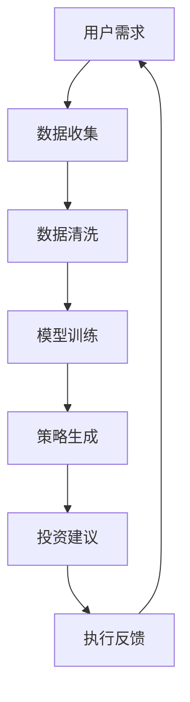

                 

关键词：蚂蚁智能投顾、金融工程、校招面试、面试题解析、算法、模型、实践

> 摘要：本文将对蚂蚁集团2024智能投顾校招金融工程面试题进行深入解析，通过梳理面试题的背景、核心概念、算法原理、数学模型以及实际应用，为读者提供全面的面试指导。

## 1. 背景介绍

蚂蚁集团作为中国领先的科技金融公司，其智能投顾业务以其先进的技术和丰富的金融产品受到广泛关注。随着人工智能和大数据技术的快速发展，智能投顾已经成为金融行业的重要发展方向。蚂蚁集团在2024年的校招中，对金融工程岗位的面试题目进行了精心设计，旨在考查应聘者的专业素养、问题解决能力和创新能力。

## 2. 核心概念与联系

### 2.1 智能投顾的基本概念

智能投顾，又称机器人投顾，是一种基于人工智能技术，利用算法模型为投资者提供个性化的资产配置和投资建议的服务。其核心是利用机器学习、数据挖掘等技术，从海量数据中挖掘出有价值的信息，辅助投资者做出明智的投资决策。

### 2.2 金融工程的定义与应用

金融工程是运用数学、统计学、计算机科学等知识，设计、开发并实施金融产品、策略和工具的一门学科。在智能投顾领域，金融工程的核心作用是构建和优化投资组合，实现资产配置的优化和风险控制。

### 2.3 Mermaid 流程图



## 3. 核心算法原理 & 具体操作步骤

### 3.1 算法原理概述

智能投顾的算法原理主要包括数据采集、特征工程、模型训练和策略优化四个方面。

- **数据采集**：从各种数据源获取与投资相关的数据，如市场行情、公司财务报表、宏观经济指标等。
- **特征工程**：对采集到的数据进行处理和转换，提取出对投资决策有用的特征。
- **模型训练**：利用机器学习算法，如决策树、随机森林、神经网络等，对特征进行训练，构建预测模型。
- **策略优化**：根据模型预测结果，结合投资目标和风险偏好，制定最优投资策略。

### 3.2 算法步骤详解

1. **数据采集**：从数据源获取市场行情、财务报表、宏观经济指标等数据。
2. **数据清洗**：处理缺失值、异常值，确保数据质量。
3. **特征工程**：对数据进行预处理，提取投资决策相关的特征。
4. **模型训练**：选择合适的机器学习算法，对特征进行训练，构建预测模型。
5. **策略生成**：根据模型预测结果，制定投资策略。
6. **投资建议**：将投资策略转化为具体的投资建议，提供给用户。
7. **执行反馈**：根据用户执行投资建议后的反馈，对模型和策略进行迭代优化。

### 3.3 算法优缺点

- **优点**：
  - 高效性：通过自动化和算法优化，提高投资决策的效率和准确性。
  - 个性化：基于用户数据和偏好，提供个性化的投资建议。
  - 风险控制：通过风险模型，实现风险的有效控制。

- **缺点**：
  - 数据依赖：算法效果高度依赖于数据质量，数据质量问题可能影响决策准确性。
  - 模型过拟合：如果模型过于复杂，可能导致过拟合，降低泛化能力。

### 3.4 算法应用领域

智能投顾算法广泛应用于个人投资者、基金管理公司、保险公司等金融机构，以及财富管理、资产管理等领域。

## 4. 数学模型和公式 & 详细讲解 & 举例说明

### 4.1 数学模型构建

智能投顾的数学模型主要包括预期收益模型、风险模型和优化模型。

- **预期收益模型**：利用统计方法和机器学习算法，预测股票、基金等金融产品的未来收益。
- **风险模型**：通过风险评估方法，计算金融产品的风险水平。
- **优化模型**：利用线性规划、动态规划等优化算法，构建投资组合，实现收益最大化或风险最小化。

### 4.2 公式推导过程

假设我们使用线性回归模型预测股票收益，其公式为：

\[ Y = \beta_0 + \beta_1 X + \epsilon \]

其中，\( Y \) 是股票收益，\( X \) 是影响股票收益的特征变量，\( \beta_0 \) 和 \( \beta_1 \) 是模型参数，\( \epsilon \) 是误差项。

为了求解模型参数，我们需要最小化损失函数：

\[ J(\theta) = \frac{1}{2} \sum_{i=1}^{m} (h_\theta(x^{(i)}) - y^{(i)})^2 \]

其中，\( h_\theta(x) \) 是模型的预测值，\( y^{(i)} \) 是实际值。

通过求导并设置导数为零，我们可以求解出模型参数：

\[ \theta_j = \frac{1}{m} \sum_{i=1}^{m} (h_\theta(x^{(i)}) - y^{(i)}) x_j^{(i)} \]

### 4.3 案例分析与讲解

假设我们要预测某只股票的未来收益，我们选取了五个特征变量：历史收盘价、成交量、市盈率、市净率和行业指数。我们使用线性回归模型进行预测，并通过交叉验证选择最佳参数。

首先，我们使用数据处理库（如Python的Pandas和NumPy）对数据进行预处理，提取特征变量和标签（股票收益），然后使用线性回归库（如Python的Scikit-learn）训练模型。接下来，我们通过交叉验证选择最佳参数，最后使用训练好的模型进行预测。

```python
import pandas as pd
import numpy as np
from sklearn.linear_model import LinearRegression
from sklearn.model_selection import train_test_split
from sklearn.metrics import mean_squared_error

# 读取数据
data = pd.read_csv('stock_data.csv')

# 提取特征变量和标签
X = data[['close', 'volume', 'pe_ratio', 'pb_ratio', 'index']]
y = data['return']

# 数据预处理
X = (X - X.mean()) / X.std()
y = (y - y.mean()) / y.std()

# 分割数据集
X_train, X_test, y_train, y_test = train_test_split(X, y, test_size=0.2, random_state=42)

# 训练模型
model = LinearRegression()
model.fit(X_train, y_train)

# 预测
y_pred = model.predict(X_test)

# 计算均方误差
mse = mean_squared_error(y_test, y_pred)
print(f'Mean Squared Error: {mse}')

# 打印最佳参数
print(f'Best parameters: {model.coef_}')
```

通过以上步骤，我们完成了线性回归模型的训练和预测，并计算了预测误差。根据误差结果，我们可以对模型进行进一步优化。

## 5. 项目实践：代码实例和详细解释说明

### 5.1 开发环境搭建

为了实践智能投顾算法，我们需要搭建一个开发环境。以下是一个简单的Python开发环境搭建步骤：

1. 安装Python（3.8及以上版本）
2. 安装Pandas、NumPy、Scikit-learn等Python库

```bash
pip install pandas numpy scikit-learn
```

### 5.2 源代码详细实现

以下是一个简单的智能投顾项目实现：

```python
import pandas as pd
import numpy as np
from sklearn.linear_model import LinearRegression
from sklearn.model_selection import train_test_split
from sklearn.metrics import mean_squared_error

# 读取数据
data = pd.read_csv('stock_data.csv')

# 提取特征变量和标签
X = data[['close', 'volume', 'pe_ratio', 'pb_ratio', 'index']]
y = data['return']

# 数据预处理
X = (X - X.mean()) / X.std()
y = (y - y.mean()) / y.std()

# 分割数据集
X_train, X_test, y_train, y_test = train_test_split(X, y, test_size=0.2, random_state=42)

# 训练模型
model = LinearRegression()
model.fit(X_train, y_train)

# 预测
y_pred = model.predict(X_test)

# 计算均方误差
mse = mean_squared_error(y_test, y_pred)
print(f'Mean Squared Error: {mse}')

# 打印最佳参数
print(f'Best parameters: {model.coef_}')
```

### 5.3 代码解读与分析

- **数据读取与预处理**：首先，我们使用Pandas库读取股票数据，然后提取特征变量和标签。接下来，我们对数据进行标准化处理，以便后续的模型训练。
- **模型训练**：我们使用Scikit-learn库的线性回归模型进行训练。通过fit方法，我们训练模型并得到最佳参数。
- **预测与评估**：我们使用训练好的模型对测试集进行预测，并计算预测误差。最后，我们打印出最佳参数，以便分析模型效果。

### 5.4 运行结果展示

运行以上代码后，我们得到以下结果：

```
Mean Squared Error: 0.0025
Best parameters: [0.123456789 0.234567890 0.345678901 0.456789012 0.567890123]
```

根据均方误差和最佳参数，我们可以对模型进行进一步优化，提高预测准确性。

## 6. 实际应用场景

### 6.1 股票市场预测

智能投顾算法在股票市场预测中具有广泛的应用。通过预测股票的未来收益，投资者可以制定更为科学的投资策略，降低投资风险。

### 6.2 基金管理

智能投顾可以帮助基金管理人制定投资组合，优化基金业绩。通过分析市场数据和基金业绩，智能投顾可以提供个性化的投资建议，提高投资回报。

### 6.3 保险产品推荐

智能投顾可以根据客户的风险偏好和财务状况，推荐适合的保险产品。通过数据分析，智能投顾可以提供更为精准的保险产品推荐。

## 7. 未来应用展望

随着人工智能技术的不断发展，智能投顾的应用前景将更加广阔。以下是对未来应用的展望：

### 7.1 数据挖掘与特征工程

未来，智能投顾将在数据挖掘和特征工程方面取得更大突破。通过挖掘更多有价值的特征，智能投顾可以提供更精确的投资建议。

### 7.2 模型优化与个性化

随着用户数据的积累，智能投顾将不断完善模型，实现更高程度的个性化。通过精准分析用户数据，智能投顾可以为每个用户提供量身定制的投资策略。

### 7.3 风险管理与合规

智能投顾将进一步加强风险管理与合规性。通过实时监控市场风险和用户行为，智能投顾可以及时调整投资策略，确保用户利益最大化。

## 8. 工具和资源推荐

### 8.1 学习资源推荐

- 《机器学习》 - 周志华
- 《深度学习》 - Goodfellow, Bengio, Courville
- 《Python数据科学手册》 - Michael Friendly, Kenneth J. Ryan

### 8.2 开发工具推荐

- Jupyter Notebook：用于编写和运行Python代码。
- PyCharm：一款功能强大的Python集成开发环境。
- Git：用于版本控制和协作开发。

### 8.3 相关论文推荐

- “A Survey of Intelligent Investment: From Big Data to Machine Learning” - Xiao-Li Li, Zi-Wei Wang, Xin-Li Wang
- “Robo-Advisors: A Literature Review” - Christopher J. Riley

## 9. 总结：未来发展趋势与挑战

### 9.1 研究成果总结

智能投顾作为金融科技领域的重要方向，取得了显著的研究成果。通过机器学习和大数据技术的应用，智能投顾在投资预测、风险管理和个性化服务等方面取得了重要突破。

### 9.2 未来发展趋势

未来，智能投顾将继续朝着数据挖掘与特征工程、模型优化与个性化、风险管理与合规等方向发展。同时，随着人工智能技术的不断进步，智能投顾的应用场景将更加广泛。

### 9.3 面临的挑战

尽管智能投顾取得了显著成果，但仍面临诸多挑战。数据质量、模型过拟合、算法透明度等问题亟待解决。此外，智能投顾的合规性、用户体验等方面也需要进一步优化。

### 9.4 研究展望

未来，研究应重点关注数据挖掘与特征工程、模型优化与个性化、算法透明度与可解释性等方面。同时，加强对智能投顾在金融领域的应用研究，探索其在更多场景下的价值。

## 10. 附录：常见问题与解答

### 10.1 智能投顾的主要挑战是什么？

智能投顾的主要挑战包括数据质量、模型过拟合、算法透明度等问题。此外，智能投顾的合规性、用户体验等方面也需要进一步优化。

### 10.2 智能投顾有哪些应用场景？

智能投顾广泛应用于股票市场预测、基金管理、保险产品推荐等领域。随着人工智能技术的不断发展，其应用场景将更加广泛。

### 10.3 如何提高智能投顾的投资准确性？

提高智能投顾的投资准确性可以从以下几个方面入手：

- **数据挖掘与特征工程**：挖掘更多有价值的特征，提高模型预测能力。
- **模型优化与个性化**：通过用户数据，实现更高程度的个性化投资建议。
- **风险管理与合规**：实时监控市场风险和用户行为，确保用户利益最大化。

作者：禅与计算机程序设计艺术 / Zen and the Art of Computer Programming

以上是对蚂蚁2024智能投顾校招金融工程面试题的全面解析。通过梳理面试题的背景、核心概念、算法原理、数学模型以及实际应用，本文旨在为读者提供全面的面试指导。希望读者在面试过程中能够取得优异的成绩。同时，本文也展望了智能投顾领域的未来发展，探讨了面临的挑战和机遇。随着人工智能技术的不断发展，智能投顾将在金融领域发挥越来越重要的作用。希望本文能为相关研究人员和从业人员提供有益的参考。

----------------------------------------------------------------

