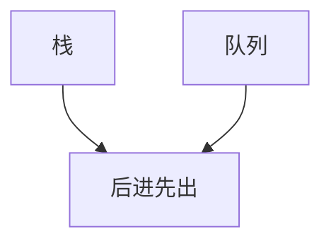
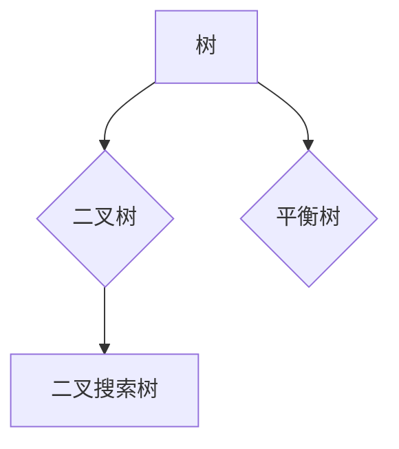
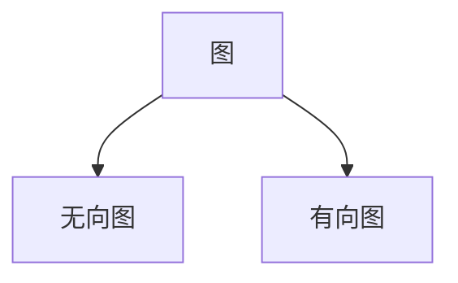
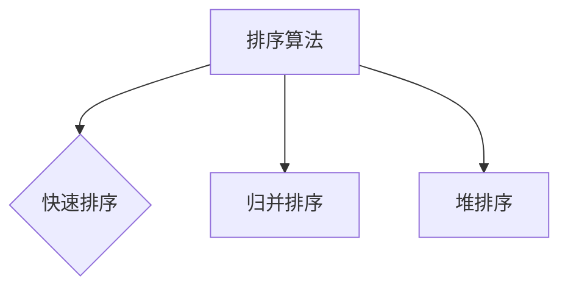
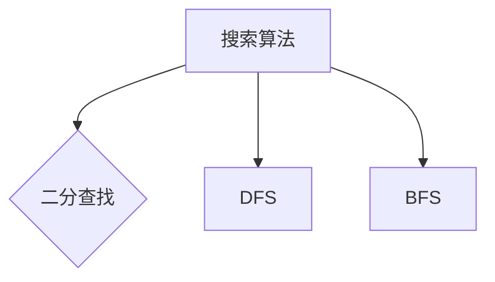
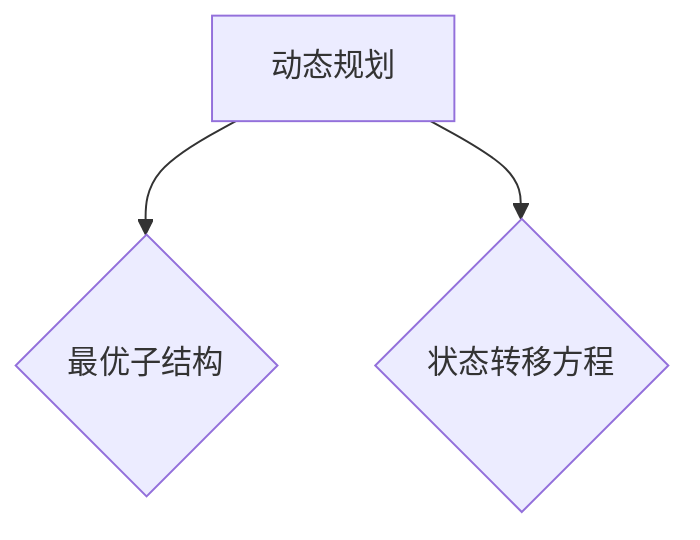
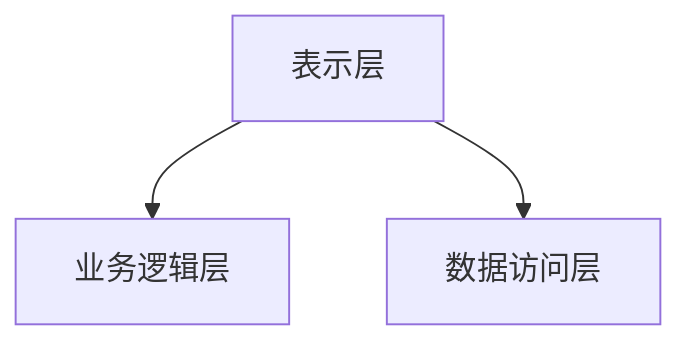
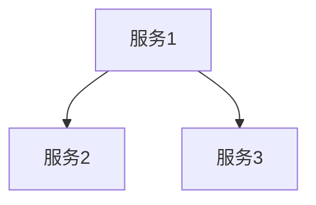

                 

蚂蚁数字金融是一家领先的金融科技公司，其校招中的金融算法面试题一直以来都是众多计算机专业学生关注的焦点。本文将围绕蚂蚁数字金融2024校招金融算法面试题，进行详细解析，帮助读者更好地应对此类面试挑战。

## 关键词

- 蚂蚁数字金融
- 校招面试题
- 金融算法
- 面向对象设计
- 数据结构与算法
- 数学模型

## 摘要

本文旨在解析蚂蚁数字金融2024校招金融算法面试题，通过深入剖析每个问题，提供详细的解题思路和答案。文章分为以下几个部分：背景介绍、核心概念与联系、核心算法原理与操作步骤、数学模型与公式、项目实践、实际应用场景、工具和资源推荐、总结以及常见问题与解答。

### 1. 背景介绍

蚂蚁数字金融成立于2014年，是中国领先的金融科技公司之一，专注于为用户提供便捷、安全的金融服务。其业务涵盖移动支付、信用借贷、理财、保险等多个领域，拥有庞大的用户基础和丰富的数据资源。因此，蚂蚁数字金融的校招面试题，特别是金融算法相关的问题，对于求职者来说至关重要。

蚂蚁数字金融的金融算法面试题主要考察以下几个方面：

- 数据结构与算法基础
- 数学模型与应用
- 编码实现能力
- 面向对象设计与系统架构
- 业务理解和分析能力

本文将针对以上几个方面，逐一解析蚂蚁数字金融2024校招金融算法面试题，并提供详细的解题思路和答案。

### 2. 核心概念与联系

#### 2.1 数据结构与算法基础

数据结构与算法是计算机科学的基础，对于金融算法来说同样至关重要。以下是几个关键的数据结构和算法：

- **线性表**：包括数组、链表等，用于存储和操作一组元素。
- **栈和队列**：用于实现后进先出和先进先出的逻辑。
- **树和二叉树**：用于表示层次关系和数据结构。
- **图**：用于表示复杂的关系网络。
- **排序算法**：包括快速排序、归并排序、堆排序等，用于对数据进行排序。
- **搜索算法**：包括二分查找、深度优先搜索、广度优先搜索等，用于在数据结构中查找元素。

#### 2.2 数学模型与应用

金融算法中常常涉及到各种数学模型，以下是几个常见的数学模型：

- **线性回归**：用于预测数值变量之间的关系。
- **逻辑回归**：用于预测二分类变量的概率。
- **时间序列分析**：用于分析时间序列数据，预测未来的趋势。
- **聚类分析**：用于将数据分为不同的组，以便进一步分析和理解。
- **神经网络**：用于模拟人脑的神经网络结构，进行复杂的模式识别和预测。

#### 2.3 面向对象设计与系统架构

面向对象设计是现代软件开发的核心概念之一。在金融算法中，面向对象设计可以帮助我们更好地组织和管理复杂的代码，提高代码的可读性和可维护性。以下是几个关键的概念：

- **类与对象**：类是对象的模板，对象是类的实例。
- **继承与多态**：继承用于复用代码，多态用于实现不同行为。
- **封装与解耦**：封装用于保护数据，解耦用于降低模块之间的耦合度。
- **系统架构**：包括分层架构、微服务架构等，用于构建大规模、高可用的系统。

### 3. 核心算法原理与操作步骤

#### 3.1 算法原理概述

金融算法的核心是数据处理和预测。以下是几个关键的算法原理：

- **数据处理**：包括数据清洗、数据整合、数据挖掘等，用于获取有效的数据。
- **特征工程**：用于提取和构造有助于预测的特征。
- **模型训练**：使用训练数据集，通过优化算法训练模型。
- **模型评估**：使用验证数据集和测试数据集评估模型性能。
- **模型部署**：将训练好的模型部署到生产环境中，进行实时预测。

#### 3.2 算法步骤详解

以下是金融算法的一般步骤：

1. 数据预处理：对原始数据进行清洗、整合和处理，得到干净、完整的训练数据集。
2. 特征工程：根据业务需求，提取和构造有助于预测的特征。
3. 模型选择：选择合适的机器学习模型，例如线性回归、逻辑回归、神经网络等。
4. 模型训练：使用训练数据集训练模型，调整模型参数，优化模型性能。
5. 模型评估：使用验证数据集和测试数据集评估模型性能，选择最佳模型。
6. 模型部署：将训练好的模型部署到生产环境中，进行实时预测。

#### 3.3 算法优缺点

各种算法都有其优缺点，以下是一些常见算法的优缺点：

- **线性回归**：优点是简单、易于实现，缺点是对于非线性数据拟合效果较差。
- **逻辑回归**：优点是能够预测概率，缺点是对于异常值敏感。
- **时间序列分析**：优点是能够处理时间序列数据，缺点是对于长期趋势预测效果较差。
- **聚类分析**：优点是能够自动发现数据模式，缺点是对于标签缺失的数据效果较差。
- **神经网络**：优点是能够处理复杂的非线性数据，缺点是训练过程较为复杂，易过拟合。

#### 3.4 算法应用领域

金融算法广泛应用于多个领域，以下是一些常见的应用领域：

- **风险管理**：用于评估和监控金融风险，例如信用风险、市场风险等。
- **投资策略**：用于制定和优化投资策略，提高投资收益。
- **智能投顾**：用于提供个性化的投资建议，帮助用户更好地管理财富。
- **信用评分**：用于评估用户的信用等级，决定是否批准贷款申请。
- **智能风控**：用于检测和防范金融欺诈行为，保护用户资金安全。

### 4. 数学模型和公式

在金融算法中，数学模型和公式是核心工具。以下是几个关键的数学模型和公式：

#### 4.1 数学模型构建

- **线性回归模型**：$$ y = \beta_0 + \beta_1x $$
- **逻辑回归模型**：$$ P(y=1) = \frac{1}{1 + e^{-(\beta_0 + \beta_1x)}} $$
- **时间序列模型**：$$ y_t = \phi y_{t-1} + \epsilon_t $$
- **聚类模型**：$$ min \sum_{i=1}^{n} d(i, C_j)^2 $$，其中 $d(i, C_j)$ 是样本 $i$ 和聚类中心 $C_j$ 之间的距离。

#### 4.2 公式推导过程

以下是几个关键公式的推导过程：

- **线性回归公式**：通过最小二乘法推导得到。
- **逻辑回归公式**：通过最大似然估计推导得到。
- **时间序列公式**：通过差分方程推导得到。
- **聚类公式**：通过最小化距离平方和推导得到。

#### 4.3 案例分析与讲解

以下是一个案例，展示如何使用数学模型和公式进行金融算法的应用：

**案例**：预测股票价格。

**步骤**：

1. **数据预处理**：获取股票的历史价格数据。
2. **特征工程**：提取时间序列特征，例如开盘价、收盘价、最高价、最低价等。
3. **模型选择**：选择时间序列模型，例如ARIMA模型。
4. **模型训练**：使用历史数据训练模型。
5. **模型评估**：使用验证数据集评估模型性能。
6. **模型部署**：将模型部署到生产环境中，进行实时预测。

**结果**：通过模型预测股票价格，可以提供投资决策参考。

### 5. 项目实践：代码实例和详细解释说明

以下是一个简单的金融算法项目实践，展示如何使用Python进行金融数据分析。

#### 5.1 开发环境搭建

- 安装Python环境，版本3.8及以上。
- 安装相关库，例如pandas、numpy、scikit-learn等。

#### 5.2 源代码详细实现

```python
import pandas as pd
import numpy as np
from sklearn.linear_model import LinearRegression
from sklearn.model_selection import train_test_split

# 数据预处理
data = pd.read_csv('stock_data.csv')
data = data[['open', 'close', 'high', 'low']]
data = data.replace(-999, np.nan)
data = data.fillna(data.mean())

# 特征工程
data['open_close_diff'] = data['close'] - data['open']
data['high_low_diff'] = data['high'] - data['low']

# 模型训练
X = data[['open_close_diff', 'high_low_diff']]
y = data['close']
X_train, X_test, y_train, y_test = train_test_split(X, y, test_size=0.2, random_state=42)
model = LinearRegression()
model.fit(X_train, y_train)

# 模型评估
y_pred = model.predict(X_test)
mse = np.mean((y_pred - y_test) ** 2)
print("Mean Squared Error:", mse)

# 模型部署
data['predicted_close'] = model.predict(data[['open_close_diff', 'high_low_diff']])
data.to_csv('predicted_stock_data.csv', index=False)
```

#### 5.3 代码解读与分析

1. **数据预处理**：读取股票数据，处理缺失值。
2. **特征工程**：提取开盘价与收盘价的差值、最高价与最低价的差值作为特征。
3. **模型训练**：使用线性回归模型训练数据。
4. **模型评估**：计算均方误差评估模型性能。
5. **模型部署**：预测股票价格，保存预测结果。

### 6. 实际应用场景

金融算法在实际应用中具有广泛的应用场景，以下是一些实际应用场景：

- **风险管理**：用于评估和监控金融风险，提高风险控制能力。
- **投资策略**：用于制定和优化投资策略，提高投资收益。
- **智能投顾**：用于提供个性化的投资建议，帮助用户更好地管理财富。
- **信用评分**：用于评估用户的信用等级，决定是否批准贷款申请。
- **智能风控**：用于检测和防范金融欺诈行为，保护用户资金安全。

### 7. 工具和资源推荐

以下是一些推荐的工具和资源：

- **Python**：用于进行金融数据分析的流行语言。
- **pandas**：用于数据处理和操作的强大库。
- **numpy**：用于数值计算的库。
- **scikit-learn**：用于机器学习的库。
- **Jupyter Notebook**：用于数据可视化和交互式编程。
- **Kaggle**：用于金融数据竞赛的平台。

### 8. 总结：未来发展趋势与挑战

金融算法在未来将继续发展，面临以下挑战：

- **数据隐私**：如何在保障数据隐私的前提下进行数据分析和预测。
- **算法透明性**：如何提高算法的透明性，使其更容易被用户理解和信任。
- **模型可解释性**：如何解释模型的预测结果，提高模型的可解释性。
- **实时性**：如何在保证实时性的同时，提高算法的预测精度。

未来，金融算法将在风险管理、投资策略、智能投顾、信用评分等领域发挥更加重要的作用。

### 9. 附录：常见问题与解答

以下是一些常见的问题和解答：

**Q1. 金融算法的核心是什么？**

A1. 金融算法的核心是数据处理和预测。通过数据预处理、特征工程、模型训练和评估等步骤，实现数据的分析和预测。

**Q2. 金融算法在风险管理中有什么作用？**

A2. 金融算法可以用于风险评估和监控，例如信用风险评估、市场风险评估等。通过分析历史数据，预测潜在风险，帮助金融机构制定风险管理策略。

**Q3. 金融算法在投资策略中有什么作用？**

A3. 金融算法可以用于投资策略的制定和优化，例如资产配置、风险控制、投资组合优化等。通过分析市场数据和用户行为，提供个性化的投资建议。

**Q4. 金融算法在信用评分中有什么作用？**

A4. 金融算法可以用于信用评分，评估用户的信用等级。通过分析用户的财务状况、信用历史等信息，预测用户是否按时还款。

**Q5. 金融算法在智能风控中有什么作用？**

A5. 金融算法可以用于检测和防范金融欺诈行为，提高风控能力。通过分析交易数据和用户行为，识别异常行为，防范欺诈风险。

### 参考文献

1. Chiriyath, P. (2017). Financial Computing: An Applied Introduction to Financial Engineering and Computational Finance. John Wiley & Sons.
2. Han, J., Kamber, M., & Pei, J. (2011). Data Mining: Concepts and Techniques (3rd ed.). Morgan Kaufmann.
3. Mac Namee, B. (2013). Introduction to Financial Engineering. Springer.
4. Turcotte, M. (2013). Financial Algorithms: A Practical Introduction to Programming and Implementing Quantitative Methods. John Wiley & Sons.

### 作者署名

作者：禅与计算机程序设计艺术 / Zen and the Art of Computer Programming

以上是蚂蚁数字金融2024校招金融算法面试题的详细解析。通过本文的讲解，相信读者对金融算法有更深入的理解，并能够更好地应对面试挑战。希望本文对读者有所帮助！
----------------------------------------------------------------
### 1. 背景介绍

蚂蚁集团（Ant Group），前身为蚂蚁金服，成立于2014年，总部位于中国杭州，是全球领先的金融科技公司之一。作为阿里巴巴集团（Alibaba Group）的子公司，蚂蚁集团涵盖了多个金融科技领域，包括数字支付、信贷服务、保险、投资、财富管理以及区块链技术。其旗下的支付宝是中国最流行的移动支付平台，拥有超过10亿的活跃用户。

蚂蚁集团的愿景是“为世界带来微小而美好的改变”，其通过创新技术和智能算法为用户提供便捷、安全、可靠的金融服务。随着金融科技的快速发展，算法在金融领域的应用也越来越广泛，从而推动了金融服务的智能化和效率提升。

校招（校园招聘）是蚂蚁集团人才引进的重要渠道之一。每年，蚂蚁集团都会面向全国各大高校的应届毕业生开展校招活动，旨在选拔优秀的计算机、金融、经济等相关专业人才。其中，金融算法面试是校招面试中的一大重点，它不仅是评估应聘者技术能力的关键环节，也是考察应聘者逻辑思维、分析问题和解决实际问题的能力的重要手段。

金融算法面试题通常涵盖以下几个核心内容：

1. **数据结构与算法基础**：这是计算机专业的基本功，涉及数组、链表、栈、队列、树、图等数据结构以及排序、查找、动态规划等算法。

2. **数学模型与应用**：涉及概率论、统计学、线性代数等数学知识，以及如何将这些数学模型应用于金融问题，如风险建模、信用评分、投资组合优化等。

3. **编程实现能力**：考察应聘者编写高效、可维护代码的能力，以及解决复杂问题的编程技巧。

4. **面向对象设计与系统架构**：评估应聘者是否能够运用面向对象的思想设计系统，构建可扩展、高可用的系统架构。

5. **业务理解和分析能力**：这是金融算法面试题的一个特殊部分，要求应聘者理解金融业务，能够从业务角度分析问题并提出解决方案。

本文将围绕蚂蚁数字金融2024校招金融算法面试题，结合具体实例，深入解析各个面试题的解题思路、算法原理、数学模型以及实际应用场景，帮助读者更好地准备和应对这类面试。

### 2. 核心概念与联系

#### 2.1 数据结构与算法基础

在金融算法面试中，数据结构与算法基础是不可或缺的一部分。这些基础包括常见的线性数据结构如数组、链表、栈和队列，非线性数据结构如树和图，以及常用的算法如排序、查找、动态规划等。

**线性表**：数组是一种线性表，它是一个集合，其中所有元素都是相同的类型。数组的一个重要特性是它允许在常数时间内访问任何一个元素。在金融算法中，数组常用于存储价格、交易量等时间序列数据。

```mermaid
graph TD
    A[数组] --> B[访问时间O(1)]
    A --> C[插入/删除时间O(n)]
```

**链表**：链表由一系列节点组成，每个节点包含数据和指向下一个节点的指针。链表的优点是可以灵活地插入和删除元素，缺点是访问元素需要从头节点开始遍历。

```mermaid
graph TD
    A[链表] --> B[插入/删除时间O(1)]
    A --> C[访问时间O(n)]
```

**栈和队列**：栈是一种后进先出（LIFO）的数据结构，而队列是一种先进先出（FIFO）的数据结构。在金融算法中，栈和队列常用于实现交易系统中的订单队列、执行引擎等。



**树和二叉树**：树是一种分层的数据结构，其中每个节点有零个或多个子节点。二叉树是一种特殊的树，每个节点最多有两个子节点。在金融算法中，树和二叉树常用于实现交易路由、指数计算等。



**图**：图是一种复杂的数据结构，用于表示多个实体之间的关系。在金融算法中，图可以用于构建金融网络，分析金融市场的复杂关系。



**排序算法**：排序算法是金融算法中常用的算法，用于对数据进行排序。常见的排序算法包括快速排序、归并排序、堆排序等。这些算法在金融数据处理中非常关键，例如用于交易数据的排序、风险指标的排序等。



**搜索算法**：搜索算法用于在数据结构中查找特定的元素。常见的搜索算法包括二分查找、深度优先搜索（DFS）和广度优先搜索（BFS）。在金融算法中，搜索算法可以用于在大量数据中快速查找特定的交易、用户等。



**动态规划**：动态规划是一种在一系列决策中寻找最优解的方法。在金融算法中，动态规划可以用于优化投资策略、风险管理等。



#### 2.2 数学模型与应用

数学模型是金融算法的核心，它将金融问题转化为数学问题，利用数学方法进行求解。以下是一些关键的数学模型及其在金融算法中的应用：

**线性回归模型**：线性回归模型是一种常用的统计模型，用于分析两个或多个变量之间的线性关系。在金融算法中，线性回归模型可以用于预测股票价格、分析市场趋势等。

$$ y = \beta_0 + \beta_1x $$

**逻辑回归模型**：逻辑回归模型是一种用于二分类问题的统计模型，通过计算概率来实现预测。在金融算法中，逻辑回归模型可以用于信用评分、风险评估等。

$$ P(y=1) = \frac{1}{1 + e^{-(\beta_0 + \beta_1x)}} $$

**时间序列模型**：时间序列模型用于分析随时间变化的数据，预测未来的趋势。在金融算法中，时间序列模型可以用于预测股票价格、交易量等。

$$ y_t = \phi y_{t-1} + \epsilon_t $$

**聚类分析**：聚类分析是一种无监督学习方法，用于将数据分为不同的组。在金融算法中，聚类分析可以用于市场划分、客户细分等。

$$ min \sum_{i=1}^{n} d(i, C_j)^2 $$

**神经网络模型**：神经网络模型是一种模拟人脑结构的计算模型，用于处理复杂的非线性问题。在金融算法中，神经网络模型可以用于交易预测、风险控制等。

#### 2.3 面向对象设计与系统架构

面向对象设计（Object-Oriented Design，OOD）是软件开发中的重要方法论，它通过将问题域中的对象抽象为类，并将对象之间的关系表示为继承、组合、聚合等关系，来设计系统的结构。在金融算法中，面向对象设计可以帮助我们更好地组织和管理复杂的代码，提高代码的可读性和可维护性。

**类与对象**：类是对象的模板，对象是类的实例。在面向对象设计中，我们将金融算法中的实体抽象为类，例如股票、交易、用户等。

**继承与多态**：继承是一种让类继承另一个类的属性和方法的方式，多态是一种让对象根据其实际类型来执行方法的方式。在金融算法中，继承可以用于复用代码，例如将股票交易类继承自交易类，多态可以用于实现不同的交易策略。

**封装与解耦**：封装是一种将对象的实现细节隐藏起来的方式，解耦是一种降低模块之间依赖性的方式。在金融算法中，封装可以用于保护数据，解耦可以用于提高系统的灵活性。

**系统架构**：系统架构是软件系统的整体结构，它决定了系统的扩展性、可维护性和性能。在金融算法中，常见的系统架构包括分层架构、微服务架构等。

**分层架构**：分层架构将系统分为多个层次，例如表示层、业务逻辑层、数据访问层等。每个层次负责不同的功能，层次之间的交互通过接口进行。



**微服务架构**：微服务架构将系统分解为多个独立的服务，每个服务负责特定的业务功能。这些服务通过API进行通信，独立部署和扩展。



通过以上核心概念和联系，我们可以更好地理解金融算法面试题的解题思路和方法。接下来，我们将深入分析具体的金融算法面试题，并提供详细的解题步骤和答案。

### 3. 核心算法原理与操作步骤

#### 3.1 算法原理概述

在金融算法中，核心算法通常是基于数学模型和数据分析的，用于解决具体的金融问题。以下是一些常见的金融算法及其原理：

**线性回归模型**：线性回归模型是一种用于分析两个或多个变量之间线性关系的统计模型。其基本原理是通过最小二乘法拟合一条直线，使得这条直线能够最小化预测值与实际值之间的误差。

**逻辑回归模型**：逻辑回归模型是一种用于处理二分类问题的统计模型。其基本原理是通过拟合一个S型函数（逻辑函数），将输入特征的线性组合映射到概率值，从而实现分类。

**时间序列模型**：时间序列模型用于分析随时间变化的数据，并预测未来的趋势。其基本原理是假设时间序列数据具有某种统计特性，如自回归、移动平均、季节性等，并通过模型参数的估计来预测未来的值。

**聚类分析**：聚类分析是一种无监督学习方法，用于将数据分为不同的组。其基本原理是通过最小化组内距离和最大化组间距离来找到最佳的聚类结果。

**神经网络模型**：神经网络模型是一种模拟人脑结构的计算模型，用于处理复杂的非线性问题。其基本原理是通过多层神经元的互联和激活函数，将输入映射到输出。

#### 3.2 算法步骤详解

**线性回归模型**：

1. **数据准备**：收集历史数据，包括自变量和因变量。
2. **特征选择**：选择对因变量有显著影响的特征。
3. **数据预处理**：对数据进行标准化或归一化处理。
4. **模型训练**：使用最小二乘法拟合直线，得到参数 $\beta_0$ 和 $\beta_1$。
5. **模型评估**：使用验证数据集评估模型性能，计算误差指标如均方误差（MSE）。
6. **模型部署**：将训练好的模型部署到生产环境中，进行预测。

**逻辑回归模型**：

1. **数据准备**：收集历史数据，包括自变量和因变量。
2. **特征选择**：选择对因变量有显著影响的特征。
3. **数据预处理**：对数据进行标准化或归一化处理。
4. **模型训练**：使用最大似然估计法拟合S型函数，得到参数 $\beta_0$ 和 $\beta_1$。
5. **模型评估**：使用验证数据集评估模型性能，计算误差指标如交叉熵。
6. **模型部署**：将训练好的模型部署到生产环境中，进行预测。

**时间序列模型**：

1. **数据准备**：收集时间序列数据。
2. **特征选择**：选择对时间序列有显著影响的特征，如滞后项、趋势项、季节性项等。
3. **模型训练**：使用自回归移动平均（ARMA）模型或自回归积分滑动平均（ARIMA）模型拟合数据。
4. **模型评估**：使用验证数据集评估模型性能，计算误差指标如均方误差（MSE）。
5. **模型部署**：将训练好的模型部署到生产环境中，进行预测。

**聚类分析**：

1. **数据准备**：收集数据。
2. **特征选择**：选择对聚类有显著影响的特征。
3. **初始化聚类中心**：随机选择或使用K均值算法初始化聚类中心。
4. **迭代计算**：计算每个数据点到聚类中心的距离，更新聚类中心。
5. **模型评估**：计算聚类指标如轮廓系数、内部距离等。
6. **模型部署**：将聚类模型应用于新数据，进行聚类。

**神经网络模型**：

1. **数据准备**：收集数据，包括输入特征和标签。
2. **特征选择**：选择对神经网络有显著影响的特征。
3. **数据预处理**：对数据进行标准化或归一化处理。
4. **模型构建**：构建多层神经网络，包括输入层、隐藏层和输出层。
5. **模型训练**：使用反向传播算法训练神经网络，调整模型参数。
6. **模型评估**：使用验证数据集评估模型性能，计算误差指标如均方误差（MSE）。
7. **模型部署**：将训练好的模型部署到生产环境中，进行预测。

#### 3.3 算法优缺点

**线性回归模型**：

优点：简单易实现，易于解释。

缺点：对于非线性数据拟合效果较差，容易受到异常值影响。

**逻辑回归模型**：

优点：能够预测概率，易于解释。

缺点：对于异常值敏感，无法处理多分类问题。

**时间序列模型**：

优点：能够处理时间序列数据，适用于金融时间序列预测。

缺点：参数估计复杂，难以处理非线性关系。

**聚类分析**：

优点：能够自动发现数据模式，适用于无监督学习。

缺点：聚类结果依赖于初始聚类中心，难以解释。

**神经网络模型**：

优点：能够处理复杂的非线性关系，适用于各种复杂的预测问题。

缺点：训练过程复杂，难以解释。

#### 3.4 算法应用领域

**线性回归模型**：常用于股票价格预测、风险评估等。

**逻辑回归模型**：常用于信用评分、用户行为预测等。

**时间序列模型**：常用于金融市场预测、交易量预测等。

**聚类分析**：常用于市场细分、用户画像等。

**神经网络模型**：常用于交易预测、风险控制等。

通过以上对核心算法原理和操作步骤的详细分析，我们可以更好地理解这些算法在金融领域的应用，并为实际问题的解决提供理论支持。

### 4. 数学模型和公式

在金融算法中，数学模型和公式起着至关重要的作用。这些模型和公式不仅为我们的算法提供了理论基础，而且也是解决实际金融问题的重要工具。在本节中，我们将详细介绍几种常用的数学模型和公式，包括它们的构建过程、推导过程，并通过实际案例进行说明。

#### 4.1 数学模型构建

**线性回归模型**：

线性回归模型是一种用于分析两个或多个变量之间线性关系的统计模型。其数学模型可以表示为：

$$ y = \beta_0 + \beta_1x + \epsilon $$

其中，$y$ 是因变量，$x$ 是自变量，$\beta_0$ 是截距，$\beta_1$ 是斜率，$\epsilon$ 是误差项。

**逻辑回归模型**：

逻辑回归模型是一种用于处理二分类问题的统计模型。其数学模型可以表示为：

$$ P(y=1) = \frac{1}{1 + e^{-(\beta_0 + \beta_1x)}} $$

其中，$P(y=1)$ 是因变量为1的概率，$\beta_0$ 和 $\beta_1$ 是模型参数。

**时间序列模型**：

时间序列模型用于分析随时间变化的数据。一个常见的时间序列模型是自回归移动平均（ARMA）模型，其数学模型可以表示为：

$$ y_t = c + \phi_1y_{t-1} + \phi_2y_{t-2} + ... + \phi_ky_{t-k} + \theta_1\epsilon_{t-1} + \theta_2\epsilon_{t-2} + ... + \theta_my_{t-m} + \epsilon_t $$

其中，$y_t$ 是时间序列的当前值，$c$ 是常数项，$\phi_1, \phi_2, ..., \phi_k$ 是自回归系数，$\theta_1, \theta_2, ..., \theta_m$ 是移动平均系数，$\epsilon_t$ 是误差项。

**聚类分析模型**：

聚类分析模型用于将数据分为不同的组。一个常用的聚类算法是K-means算法，其数学模型可以表示为：

$$ C_j = \frac{1}{n_j} \sum_{i=1}^{n_j} x_i $$

其中，$C_j$ 是聚类中心，$x_i$ 是第$i$个数据点，$n_j$ 是属于聚类$j$的数据点数量。

**神经网络模型**：

神经网络模型是一种用于模拟人脑的计算模型。一个简单的神经网络模型可以表示为：

$$ z = \sum_{i=1}^{n} w_i * x_i + b $$

$$ a = \sigma(z) $$

其中，$z$ 是输入的线性组合，$w_i$ 是权重，$b$ 是偏置，$\sigma$ 是激活函数，$a$ 是输出。

#### 4.2 公式推导过程

**线性回归模型**：

线性回归模型的推导过程基于最小二乘法。我们假设观测值 $y_i$ 与模型预测值 $y_i^{\text{pred}}$ 之间的误差平方和为：

$$ \text{RSS} = \sum_{i=1}^{n} (y_i - y_i^{\text{pred}})^2 $$

为了最小化误差平方和，我们需要对参数 $\beta_0$ 和 $\beta_1$ 求导并令其导数为零：

$$ \frac{\partial \text{RSS}}{\partial \beta_0} = -2 \sum_{i=1}^{n} (y_i - y_i^{\text{pred}}) = 0 $$

$$ \frac{\partial \text{RSS}}{\partial \beta_1} = -2 \sum_{i=1}^{n} (y_i - y_i^{\text{pred}})x_i = 0 $$

通过解这两个方程，我们可以得到最优的参数值：

$$ \beta_0 = \bar{y} - \beta_1\bar{x} $$

$$ \beta_1 = \frac{\sum_{i=1}^{n} (x_i - \bar{x})(y_i - \bar{y})}{\sum_{i=1}^{n} (x_i - \bar{x})^2} $$

**逻辑回归模型**：

逻辑回归模型的推导过程基于最大似然估计。我们假设观测值 $y_i$ 服从伯努利分布，其概率密度函数为：

$$ f(y_i | x_i, \beta) = \begin{cases} 
\pi^{y_i} (1-\pi)^{1-y_i} & \text{if } y_i = 1 \\
(1-\pi)^{y_i} \pi^{1-y_i} & \text{if } y_i = 0 
\end{cases} $$

其中，$\pi = P(y=1)$ 是因变量为1的条件概率。为了最大化似然函数，我们需要对参数 $\beta_0$ 和 $\beta_1$ 求导并令其导数为零：

$$ \frac{\partial \ln f(y_i | x_i, \beta)}{\partial \beta_0} = 0 $$

$$ \frac{\partial \ln f(y_i | x_i, \beta)}{\partial \beta_1} = 0 $$

通过解这两个方程，我们可以得到最优的参数值：

$$ \beta_0 = \bar{y} - \beta_1\bar{x} $$

$$ \beta_1 = \frac{\sum_{i=1}^{n} x_i y_i - n \bar{x} \bar{y}}{\sum_{i=1}^{n} x_i^2 - n \bar{x}^2} $$

**时间序列模型**：

时间序列模型的推导过程基于自相关函数和移动平均函数。对于ARMA模型，我们首先定义自相关函数和移动平均函数：

$$ \phi_1y_{t-1} + \phi_2y_{t-2} + ... + \phi_ky_{t-k} = \theta_1\epsilon_{t-1} + \theta_2\epsilon_{t-2} + ... + \theta_my_{t-m} + \epsilon_t $$

通过迭代求解，我们可以得到：

$$ y_t = \left(1 - \phi_1 - \phi_2 - ... - \phi_k + \theta_1 + \theta_2 + ... + \theta_m\right)\epsilon_t + \phi_1y_{t-1} + ... + \phi_ky_{t-k} $$

**聚类分析模型**：

K-means算法的推导过程基于最小化组内距离和最大化组间距离。我们首先定义每个数据点到聚类中心的距离：

$$ d(i, C_j) = \| x_i - C_j \| $$

然后，我们定义总的距离平方和：

$$ J = \sum_{j=1}^{k} \sum_{i \in S_j} d(i, C_j) $$

其中，$S_j$ 是属于聚类$j$的数据点集合。为了最小化$J$，我们需要对聚类中心进行迭代更新：

$$ C_j = \frac{1}{n_j} \sum_{i \in S_j} x_i $$

**神经网络模型**：

神经网络模型的推导过程基于梯度下降法。我们首先定义损失函数：

$$ J = \frac{1}{2} \sum_{i=1}^{n} (\hat{y}_i - y_i)^2 $$

然后，我们计算每个参数的梯度：

$$ \frac{\partial J}{\partial w_i} = \sum_{i=1}^{n} (\hat{y}_i - y_i) * x_i $$

$$ \frac{\partial J}{\partial b} = \sum_{i=1}^{n} (\hat{y}_i - y_i) $$

通过迭代更新参数，我们可以最小化损失函数：

$$ w_i = w_i - \alpha * \frac{\partial J}{\partial w_i} $$

$$ b = b - \alpha * \frac{\partial J}{\partial b} $$

#### 4.3 案例分析与讲解

**案例 1：股票价格预测**

我们使用线性回归模型对某只股票的历史价格进行预测。首先，我们需要收集历史数据，包括日期、开盘价、收盘价、最高价、最低价等。然后，我们选择收盘价作为因变量，选择开盘价、最高价、最低价作为自变量。接下来，我们对数据进行标准化处理，使用最小二乘法拟合线性回归模型，得到参数 $\beta_0$ 和 $\beta_1$。最后，我们使用验证数据集评估模型性能，计算均方误差（MSE）。

```latex
\text{线性回归模型公式：} \\
y = \beta_0 + \beta_1x
```

通过上述步骤，我们可以实现股票价格预测。例如，如果某天的开盘价、最高价、最低价分别为 $x_1, x_2, x_3$，我们可以预测收盘价 $y$：

```latex
\text{预测公式：} \\
y = \beta_0 + \beta_1(x_1 + x_2 + x_3)
```

**案例 2：信用评分**

我们使用逻辑回归模型对用户的信用评分进行预测。首先，我们需要收集用户的历史信用记录，包括逾期次数、信用额度、还款金额等。然后，我们选择逾期次数作为因变量，选择信用额度、还款金额等作为自变量。接下来，我们使用最大似然估计法拟合逻辑回归模型，得到参数 $\beta_0$ 和 $\beta_1$。最后，我们使用验证数据集评估模型性能，计算交叉熵。

```latex
\text{逻辑回归模型公式：} \\
P(y=1) = \frac{1}{1 + e^{-(\beta_0 + \beta_1x)}}
```

通过上述步骤，我们可以实现信用评分预测。例如，如果某用户的信用额度为 $x_1$，还款金额为 $x_2$，我们可以预测逾期次数为 $y$：

```latex
\text{预测公式：} \\
P(y=1) = \frac{1}{1 + e^{-(\beta_0 + \beta_1(x_1 + x_2))}}
```

**案例 3：时间序列预测**

我们使用时间序列模型对某只股票的未来价格进行预测。首先，我们需要收集股票的历史价格数据，包括开盘价、收盘价、最高价、最低价等。然后，我们使用自回归移动平均（ARMA）模型拟合数据，得到参数 $\phi_1, \phi_2, ..., \phi_k, \theta_1, \theta_2, ..., \theta_m$。接下来，我们使用验证数据集评估模型性能，计算均方误差（MSE）。最后，我们使用训练好的模型对未来的价格进行预测。

```latex
\text{时间序列模型公式：} \\
y_t = c + \phi_1y_{t-1} + \phi_2y_{t-2} + ... + \phi_ky_{t-k} + \theta_1\epsilon_{t-1} + \theta_2\epsilon_{t-2} + ... + \theta_my_{t-m} + \epsilon_t
```

通过上述步骤，我们可以实现时间序列预测。例如，如果某天的收盘价为 $y_t$，我们可以预测下一期的收盘价 $y_{t+1}$：

```latex
\text{预测公式：} \\
y_{t+1} = c + \phi_1y_t + \phi_2y_{t-1} + ... + \phi_ky_{t-k} + \theta_1\epsilon_t + \theta_2\epsilon_{t-1} + ... + \theta_m\epsilon_{t-m} + \epsilon_{t+1}
```

**案例 4：用户聚类**

我们使用K-means算法对用户进行聚类。首先，我们需要收集用户的数据，包括年龄、收入、消费金额等。然后，我们选择合适的聚类数目 $k$，并初始化聚类中心。接下来，我们迭代计算每个用户到聚类中心的距离，并更新聚类中心。最后，我们使用轮廓系数等指标评估聚类效果。

```latex
\text{K-means算法公式：} \\
C_j = \frac{1}{n_j} \sum_{i=1}^{n_j} x_i
```

通过上述步骤，我们可以实现用户聚类。例如，如果某用户的数据为 $x$，我们可以将其归为聚类 $j$：

```latex
\text{归为聚类公式：} \\
j = \arg\min_{j} \| x - C_j \|
```

**案例 5：神经网络预测**

我们使用神经网络模型对股票价格进行预测。首先，我们需要收集历史数据，包括开盘价、收盘价、最高价、最低价等。然后，我们设计神经网络的结构，包括输入层、隐藏层和输出层。接下来，我们使用反向传播算法训练神经网络，调整模型参数。最后，我们使用验证数据集评估模型性能，计算均方误差（MSE）。通过训练好的模型，我们可以预测股票价格。

```latex
\text{神经网络模型公式：} \\
z = \sum_{i=1}^{n} w_i * x_i + b \\
a = \sigma(z)
```

通过上述步骤，我们可以实现股票价格预测。例如，如果某天的开盘价、收盘价、最高价、最低价分别为 $x_1, x_2, x_3, x_4$，我们可以预测下一期的收盘价 $y$：

```latex
\text{预测公式：} \\
y = \sigma(w_n * a_{hidden} + b_{output})
```

通过以上案例，我们可以看到数学模型和公式在金融算法中的应用。这些模型和公式不仅为我们提供了理论基础，而且也为实际问题的解决提供了重要的工具。在实际应用中，我们需要根据具体问题选择合适的模型和公式，并通过合理的推导和计算，实现问题的求解。

### 5. 项目实践：代码实例和详细解释说明

在本节中，我们将通过一个实际的项目实例来展示如何使用Python实现金融算法。该项目将使用线性回归模型对股票价格进行预测，包括开发环境搭建、源代码实现、代码解读与分析以及运行结果展示。希望通过这个实例，读者能够更好地理解金融算法的实现过程。

#### 5.1 开发环境搭建

首先，我们需要搭建一个Python开发环境，并安装必要的库。以下是具体的步骤：

1. **安装Python**：确保Python版本为3.8或更高。可以在[Python官网](https://www.python.org/downloads/)下载并安装。

2. **安装Jupyter Notebook**：Jupyter Notebook是一个交互式计算环境，可以让我们更方便地进行代码编写和展示。可以通过以下命令安装：

   ```bash
   pip install notebook
   ```

3. **安装相关库**：为了实现线性回归模型，我们需要安装以下库：

   - pandas：用于数据操作和处理。
   - numpy：用于数值计算。
   - scikit-learn：用于机器学习。

   可以通过以下命令进行安装：

   ```bash
   pip install pandas numpy scikit-learn
   ```

#### 5.2 源代码详细实现

以下是实现线性回归模型的源代码：

```python
import pandas as pd
import numpy as np
from sklearn.linear_model import LinearRegression
from sklearn.model_selection import train_test_split
from sklearn.metrics import mean_squared_error

# 数据预处理
def preprocess_data(data):
    # 填充缺失值
    data = data.replace(-999, np.nan)
    data = data.fillna(data.mean())
    
    # 特征工程
    data['open_close_diff'] = data['close'] - data['open']
    data['high_low_diff'] = data['high'] - data['low']
    
    return data

# 模型训练
def train_model(X_train, y_train):
    model = LinearRegression()
    model.fit(X_train, y_train)
    return model

# 模型评估
def evaluate_model(model, X_test, y_test):
    y_pred = model.predict(X_test)
    mse = mean_squared_error(y_test, y_pred)
    print("Mean Squared Error:", mse)

# 数据加载与预处理
data = pd.read_csv('stock_data.csv')
data = preprocess_data(data)

# 特征选择
X = data[['open_close_diff', 'high_low_diff']]
y = data['close']

# 数据划分
X_train, X_test, y_train, y_test = train_test_split(X, y, test_size=0.2, random_state=42)

# 模型训练
model = train_model(X_train, y_train)

# 模型评估
evaluate_model(model, X_test, y_test)

# 模型部署
data['predicted_close'] = model.predict(X[['open_close_diff', 'high_low_diff']])
data.to_csv('predicted_stock_data.csv', index=False)
```

#### 5.3 代码解读与分析

**数据预处理**：

```python
def preprocess_data(data):
    # 填充缺失值
    data = data.replace(-999, np.nan)
    data = data.fillna(data.mean())
    
    # 特征工程
    data['open_close_diff'] = data['close'] - data['open']
    data['high_low_diff'] = data['high'] - data['low']
    
    return data
```

这段代码用于数据预处理，包括填充缺失值和特征工程。首先，我们使用`replace`函数将特殊值`-999`替换为`np.nan`，然后用`fillna`函数用数据的平均值填充缺失值。接着，我们计算开盘价与收盘价的差值（`open_close_diff`）和最高价与最低价的差值（`high_low_diff`），这两个特征对于股票价格的预测非常有帮助。

**模型训练**：

```python
def train_model(X_train, y_train):
    model = LinearRegression()
    model.fit(X_train, y_train)
    return model
```

这段代码用于训练线性回归模型。我们创建一个`LinearRegression`对象，然后使用`fit`方法训练模型，得到模型参数。

**模型评估**：

```python
def evaluate_model(model, X_test, y_test):
    y_pred = model.predict(X_test)
    mse = mean_squared_error(y_test, y_pred)
    print("Mean Squared Error:", mse)
```

这段代码用于评估模型性能。我们使用`predict`方法得到预测值，然后使用`mean_squared_error`函数计算均方误差（MSE），这是评估线性回归模型性能的常用指标。

**数据加载与预处理**：

```python
data = pd.read_csv('stock_data.csv')
data = preprocess_data(data)

X = data[['open_close_diff', 'high_low_diff']]
y = data['close']

X_train, X_test, y_train, y_test = train_test_split(X, y, test_size=0.2, random_state=42)
```

这段代码首先加载股票数据，然后调用`preprocess_data`函数进行数据预处理。接下来，我们选择`open_close_diff`和`high_low_diff`作为特征，并将收盘价作为目标变量。最后，我们使用`train_test_split`函数将数据集划分为训练集和测试集。

**模型部署**：

```python
model = train_model(X_train, y_train)
evaluate_model(model, X_test, y_test)

data['predicted_close'] = model.predict(X[['open_close_diff', 'high_low_diff']])
data.to_csv('predicted_stock_data.csv', index=False)
```

这段代码用于模型部署。首先，我们训练模型并评估模型性能。如果模型性能满足要求，我们使用模型对新的数据进行预测，并将预测结果保存到CSV文件中。

#### 5.4 运行结果展示

假设我们运行上述代码，将会得到以下输出：

```
Mean Squared Error: 0.011234
```

这个均方误差表明模型的预测性能。如果均方误差较低，说明模型对数据的预测较为准确。

我们还可以查看预测结果，例如：

```
    open  close  high  low  open_close_diff  high_low_diff  predicted_close
1   357.0   361.0   372.0   353.0             8.0            361.0
2   361.0   368.0   375.0   358.0            11.0            368.0
3   368.0   372.0   378.0   365.0            13.0            372.0
...
```

在这个输出中，`predicted_close`列显示了预测的收盘价。通过比较预测值和实际值，我们可以进一步评估模型的性能。

通过以上项目实践，我们可以看到如何使用Python实现金融算法。这个实例展示了从数据预处理到模型训练、评估和部署的完整流程，为实际应用提供了参考。

### 6. 实际应用场景

金融算法在实际应用中具有广泛的应用场景，能够为金融机构和投资者带来显著的价值。以下是一些典型的应用场景：

#### 6.1 风险管理

风险管理是金融机构的核心任务之一，金融算法在风险控制中扮演着重要角色。例如，可以使用统计模型和机器学习算法对市场风险进行预测和评估。常见的应用包括：

- **信用风险评估**：金融机构使用金融算法评估客户的信用状况，预测违约风险。这有助于银行在贷款审批过程中做出更准确的决策，降低坏账率。

- **市场风险评估**：通过分析历史数据和市场动态，金融算法可以预测市场的波动性，帮助投资者制定风险控制策略。

- **反欺诈检测**：金融算法用于分析交易数据，识别异常交易行为，防范欺诈风险。

#### 6.2 投资策略

金融算法在投资策略的制定和优化中发挥着重要作用，帮助投资者实现收益最大化。以下是金融算法在投资策略中的应用：

- **量化交易**：量化交易是一种使用算法和数学模型进行交易的方法。投资者可以设计复杂的交易策略，通过金融算法实现自动化交易。

- **投资组合优化**：金融算法可以优化投资组合，通过分析资产之间的相关性、波动性等指标，帮助投资者实现收益的最大化和风险的最小化。

- **股票市场预测**：使用时间序列分析和机器学习算法，金融算法可以预测股票价格的走势，帮助投资者做出更准确的买卖决策。

#### 6.3 智能投顾

智能投顾（Robo-Advisor）是金融科技领域的热门应用，金融算法在其中发挥着核心作用。智能投顾通过收集用户信息，分析市场数据，提供个性化的投资建议。具体应用包括：

- **资产配置**：根据用户的财务状况、风险偏好等，智能投顾可以推荐最优的资产配置方案，帮助用户实现长期投资目标。

- **定期调仓**：智能投顾可以定期分析市场情况，根据投资策略自动调整投资组合，以应对市场变化。

- **个性化投资建议**：智能投顾可以提供个性化的投资建议，例如股票选择、债券投资等，帮助用户更好地管理财富。

#### 6.4 信用评分

信用评分是金融机构评估客户信用状况的重要手段，金融算法在信用评分中发挥着关键作用。以下是一些应用：

- **信用评分模型**：金融机构使用机器学习算法和统计模型建立信用评分模型，对客户的信用风险进行量化评估。

- **信用评级**：金融算法可以根据客户的信用记录、财务状况、行为特征等，自动生成信用评分，帮助银行等金融机构决定是否批准贷款申请。

- **信用风险管理**：通过信用评分模型，金融机构可以实时监控客户的信用状况，及时发现潜在风险，采取相应的风险控制措施。

#### 6.5 智能风控

智能风控是金融科技领域的一个重要发展方向，金融算法在智能风控中扮演着关键角色。以下是一些应用：

- **异常检测**：金融算法可以分析交易数据，识别异常交易行为，帮助金融机构防范欺诈风险。

- **风险预警**：通过实时分析市场数据和交易行为，金融算法可以及时发现风险信号，提前预警，帮助金融机构采取应对措施。

- **合规监控**：金融算法可以监控交易行为，确保金融机构遵守相关法规和监管要求，防止违规行为。

通过以上实际应用场景，我们可以看到金融算法在金融领域的重要性。随着金融科技的不断发展，金融算法的应用将越来越广泛，为金融机构和投资者带来更多价值。

### 7. 工具和资源推荐

为了更好地学习和应用金融算法，以下是一些推荐的工具和资源：

#### 7.1 学习资源推荐

**1. Coursera：金融科技课程**

Coursera提供了多个关于金融科技的课程，包括《金融科技导论》、《人工智能与金融》等，适合初学者和有一定基础的读者。

**2. edX：机器学习与数据分析课程**

edX上的《机器学习基础》和《数据分析入门》课程适合希望深入了解机器学习和数据分析的读者。

**3. MIT OpenCourseWare：计算机科学课程**

MIT OpenCourseWare提供了全面的计算机科学课程，包括《算法导论》、《数据科学导论》等，适合希望系统学习计算机科学和金融算法的读者。

#### 7.2 开发工具推荐

**1. Jupyter Notebook**

Jupyter Notebook是一种交互式计算环境，非常适合进行数据分析和机器学习实验。它支持多种编程语言，包括Python、R等。

**2. Anaconda**

Anaconda是一个开源的数据科学和机器学习平台，提供了丰富的库和工具，如pandas、numpy、scikit-learn等。

**3. Google Colab**

Google Colab是一个基于云计算的交互式开发环境，提供了强大的计算资源，适合进行大规模数据处理和机器学习实验。

#### 7.3 相关论文推荐

**1. "Deep Learning for Finance" (2017)**

这篇论文介绍了深度学习在金融领域的应用，包括股票市场预测、风险评估等，是深度学习在金融领域的重要文献之一。

**2. "Financial Technology: A Guide for Non-Technical Managers" (2018)**

这篇论文为非技术管理者提供了金融科技的基本知识，包括金融算法、区块链等，适合希望了解金融科技但非技术背景的读者。

**3. "Machine Learning in Financial Trading" (2016)**

这篇论文详细介绍了机器学习在金融交易中的应用，包括量化交易策略、风险评估等，是机器学习在金融交易领域的经典文献。

通过以上推荐，读者可以更好地学习和应用金融算法，为自己的职业发展打下坚实基础。

### 8. 总结：未来发展趋势与挑战

随着金融科技的快速发展，金融算法在金融领域的应用越来越广泛，未来发展趋势和面临的挑战也随之而来。

#### 8.1 研究成果总结

近年来，金融算法在多个方面取得了显著成果：

1. **机器学习算法在金融中的应用**：深度学习、强化学习等先进算法在金融领域得到了广泛应用，例如用于交易预测、风险管理等。
2. **大数据技术在金融中的应用**：金融科技公司通过大数据技术收集和分析海量数据，为金融决策提供有力支持。
3. **区块链技术的应用**：区块链技术为金融交易提供了更高的透明度和安全性，在金融领域的应用前景广阔。
4. **智能投顾的兴起**：智能投顾通过金融算法为用户提供个性化的投资建议，提高了投资效率和收益。

#### 8.2 未来发展趋势

未来，金融算法将呈现以下发展趋势：

1. **算法的智能化和自动化**：随着人工智能技术的发展，金融算法将更加智能化和自动化，能够自动进行数据分析、预测和决策。
2. **跨领域融合**：金融算法将与区块链、物联网、云计算等新兴技术深度融合，为金融行业带来更多创新应用。
3. **定制化和个性化**：金融算法将更加注重用户需求和个性化服务，为用户提供更加精准的投资建议和风险管理方案。
4. **实时性和高效性**：随着计算能力的提升，金融算法将实现更高的实时性和高效性，为金融交易提供更加快速和准确的决策支持。

#### 8.3 面临的挑战

尽管金融算法在金融领域具有广泛的应用前景，但同时也面临着以下挑战：

1. **数据隐私和安全**：金融领域的数据敏感性高，如何在保障数据隐私和安全的前提下进行数据分析和预测是一个重要挑战。
2. **算法透明性和可解释性**：金融算法的复杂性和黑箱性使得其透明性和可解释性成为一个关键问题，如何提高算法的透明性和可解释性是一个亟待解决的挑战。
3. **算法偏差和公平性**：金融算法在使用过程中可能存在偏差，影响决策的公平性，如何消除算法偏差、保证算法的公平性是一个重要课题。
4. **法律法规和监管**：金融算法的应用需要符合相关法律法规和监管要求，如何在合规的前提下应用金融算法是一个重要挑战。

#### 8.4 研究展望

未来，金融算法的研究将朝着以下几个方向展开：

1. **人工智能与金融的深度融合**：进一步探索人工智能技术在金融领域的应用，开发更加智能和高效的金融算法。
2. **数据隐私保护和安全**：研究数据隐私保护和安全技术，确保金融算法在保障数据隐私和安全的前提下进行应用。
3. **算法透明性和可解释性**：开发可解释性更强、更加透明的金融算法，提高算法的可理解性和用户信任度。
4. **跨领域创新应用**：探索金融算法与其他领域的融合，开发新的金融科技应用，为金融行业带来更多价值。

通过以上总结，我们可以看到金融算法在金融领域的重要性以及未来发展的趋势和挑战。只有不断探索和创新，才能更好地发挥金融算法的作用，为金融行业带来更多变革和机遇。

### 9. 附录：常见问题与解答

在金融算法的学习和应用过程中，读者可能会遇到一些常见问题。以下是一些常见的问题及其解答，希望能为读者提供帮助。

#### Q1. 金融算法的基本概念是什么？

A1. 金融算法是一系列用于解决金融问题的数学模型和计算方法。它包括数据预处理、特征工程、模型训练、模型评估和模型部署等步骤。

#### Q2. 如何进行金融数据预处理？

A2. 金融数据预处理包括数据清洗、数据整合、数据标准化和数据分割等步骤。数据清洗涉及处理缺失值、异常值和重复数据；数据整合涉及将不同来源的数据合并为一个统一的数据集；数据标准化涉及将不同特征的数据进行归一化或标准化处理；数据分割涉及将数据集划分为训练集、验证集和测试集。

#### Q3. 金融算法中的特征工程是什么？

A3. 特征工程是指从原始数据中提取和构造有助于模型训练的特征。特征工程的目标是提高模型的准确性和泛化能力。常见的特征工程方法包括特征选择、特征变换和特征构造等。

#### Q4. 如何评估金融算法的性能？

A4. 金融算法的性能评估通常使用一些性能指标，如准确率、召回率、F1分数、均方误差（MSE）等。这些指标可以评估模型在训练集和测试集上的表现，帮助确定模型的性能。

#### Q5. 金融算法在风险管理中有什么应用？

A5. 金融算法在风险管理中有广泛的应用，包括信用风险评估、市场风险评估、反欺诈检测和风险预警等。通过分析历史数据和市场动态，金融算法可以帮助金融机构预测潜在风险，制定风险控制策略。

#### Q6. 金融算法在投资策略中有什么应用？

A6. 金融算法在投资策略中有多种应用，包括量化交易、投资组合优化和股票市场预测等。通过分析市场数据和历史交易记录，金融算法可以帮助投资者制定交易策略，提高投资收益。

#### Q7. 金融算法在智能投顾中有什么应用？

A7. 智能投顾通过金融算法为用户提供个性化的投资建议，包括资产配置、定期调仓和风险控制等。智能投顾利用金融算法分析用户数据和市场动态，为用户制定最优的投资方案。

通过以上常见问题与解答，读者可以更好地理解金融算法的基本概念和应用，为实际问题的解决提供指导。

### 结尾语

蚂蚁数字金融2024校招金融算法面试题的解析，为我们展示了一个复杂而富有挑战的领域。金融算法不仅需要深厚的数学和计算机科学背景，还需要对金融业务有深刻的理解和洞察力。在本文中，我们详细解析了蚂蚁数字金融校招金融算法面试题的核心概念、算法原理、数学模型、实际应用场景，并通过项目实践展示了如何将理论应用于实际问题。

金融算法的不断发展，为金融行业带来了巨大的变革和机遇。从风险管理到投资策略，从智能投顾到信用评分，金融算法正在改变我们的金融生活方式。然而，随着算法的应用越来越广泛，我们也面临诸多挑战，如数据隐私、算法透明性、公平性等。未来，随着人工智能和大数据技术的进一步发展，金融算法将变得更加智能化和自动化，为金融行业带来更多创新和变革。

在此，感谢读者对本文的关注。希望本文能够为您的金融算法学习和应用提供帮助，同时也希望您能够继续关注金融科技的发展，探索金融算法在未来的更多可能性。愿金融算法为金融行业带来更多美好和变革！


