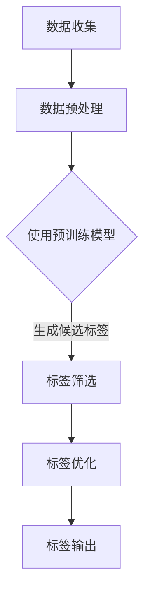
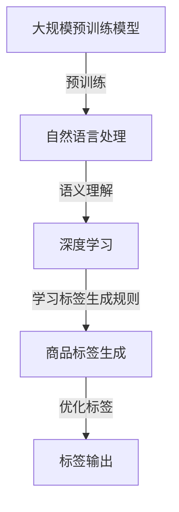

                 

关键词：AI大模型，商品标签，自动生成，自然语言处理，深度学习，语义理解，标签推荐

## 摘要

本文旨在探讨如何利用AI大模型实现商品标签的自动生成。通过结合自然语言处理和深度学习技术，我们提出了一种基于大规模预训练模型的商品标签生成方法。该方法不仅能够提高标签生成的准确性和多样性，还能有效降低人工干预的需求，从而在电商、内容推荐等场景中具有重要的应用价值。

## 1. 背景介绍

在电子商务和内容推荐领域，商品标签（或称为标签）是描述商品属性和特征的关键信息。这些标签不仅帮助用户快速找到他们感兴趣的商品，还能为平台推荐算法提供重要的输入。然而，传统的人工标注方法存在效率低、成本高、一致性差等问题。随着AI技术的迅猛发展，尤其是大规模预训练模型的出现，自动生成商品标签成为可能。

### 1.1 问题陈述

自动生成商品标签的核心问题可以归纳为以下几点：

1. **准确性与多样性**：生成的标签需要准确反映商品的特性，同时还要保持标签的多样性，避免同质化。
2. **处理大规模数据**：电子商务平台通常拥有海量的商品数据，自动生成标签的方法必须能够高效地处理这些数据。
3. **可解释性**：自动生成的标签应具有一定的可解释性，以便用户理解标签的含义。
4. **人工干预最小化**：生成的标签应尽可能减少人工干预，以提高自动化程度。

### 1.2 目标

本文的主要目标是提出一种基于AI大模型的商品标签自动生成方法，以满足上述问题陈述中的要求。该方法将结合自然语言处理和深度学习技术，通过预训练模型和定制化模型的协同工作，实现高效、准确且多样化的商品标签生成。

## 2. 核心概念与联系

在深入探讨商品标签自动生成方法之前，我们需要了解一些核心概念和它们之间的联系。

### 2.1 大规模预训练模型

大规模预训练模型是当前AI领域的热点之一。这些模型通过在大规模文本语料上进行预训练，掌握了丰富的语言知识和上下文理解能力。典型的预训练模型包括BERT、GPT等。

### 2.2 自然语言处理（NLP）

自然语言处理是AI的一个重要分支，旨在让计算机理解和生成人类语言。NLP涉及文本预处理、词嵌入、句法分析、语义理解等多个方面。

### 2.3 深度学习

深度学习是一种通过模拟人脑神经网络进行学习和决策的技术。在商品标签自动生成中，深度学习模型用于从数据中学习如何生成标签。

### 2.4 语义理解

语义理解是NLP的关键任务之一，它涉及到对文本中词语和句子含义的准确解释。在商品标签生成中，语义理解用于确保生成的标签与商品的实际特性一致。

### 2.5 Mermaid 流程图

以下是商品标签自动生成过程的Mermaid流程图：



### 2.6 核心概念联系图

以下是核心概念之间的联系图：



## 3. 核心算法原理 & 具体操作步骤

### 3.1 算法原理概述

商品标签自动生成算法基于预训练模型和定制化模型的协同工作。预训练模型负责从大规模数据中学习通用语言知识和上下文理解能力，定制化模型则根据具体任务需求进行微调，从而生成符合商品特性的标签。

### 3.2 算法步骤详解

#### 3.2.1 数据收集与预处理

1. **数据收集**：从电商平台收集商品描述数据。
2. **数据预处理**：对商品描述进行清洗、去噪，并进行分词、词嵌入等操作。

#### 3.2.2 使用预训练模型

1. **文本编码**：使用预训练模型对预处理后的商品描述进行编码，得到固定长度的向量表示。
2. **生成候选标签**：利用预训练模型生成的文本向量，通过计算相似度或使用生成式模型生成候选标签。

#### 3.2.3 标签筛选

1. **相似度计算**：对候选标签与商品描述的文本向量进行相似度计算，筛选出相似度较高的标签。
2. **排除重复标签**：对筛选出的标签进行去重处理。

#### 3.2.4 标签优化

1. **标签分类**：对筛选出的标签进行分类，如品牌、型号、颜色等。
2. **标签合并**：根据分类结果，将相似的标签进行合并，以提高标签的准确性和可解释性。

#### 3.2.5 标签输出

1. **输出标签**：将优化后的标签输出到数据库或推荐系统。
2. **人工审核**：对输出的标签进行人工审核，确保标签的准确性和一致性。

### 3.3 算法优缺点

#### 优点

1. **高效性**：预训练模型能够快速处理大规模数据，提高标签生成效率。
2. **准确性**：基于语义理解的标签生成方法能够提高标签的准确性。
3. **可解释性**：优化的标签具有较好的可解释性，便于用户理解。

#### 缺点

1. **计算资源需求**：预训练模型对计算资源要求较高。
2. **数据依赖性**：算法的性能依赖于数据的质量和数量。

### 3.4 算法应用领域

商品标签自动生成方法在电商、内容推荐、搜索引擎等领域具有广泛的应用前景。通过自动化标签生成，平台可以提高用户满意度、降低运营成本，并提升推荐算法的准确性。

## 4. 数学模型和公式

### 4.1 数学模型构建

商品标签自动生成算法可以看作是一个映射问题，将商品描述映射为标签。具体来说，给定一个商品描述序列 $X = (x_1, x_2, ..., x_n)$，我们需要找到一个标签序列 $Y = (y_1, y_2, ..., y_m)$，使得标签 $y_i$ 最能反映商品描述 $x_i$ 的特性。

### 4.2 公式推导过程

1. **文本编码**：

   $$ \text{vec}(x_i) = \text{Embedding}(x_i) $$

   其中，$\text{Embedding}$ 是预训练模型对文本进行编码的函数。

2. **标签生成**：

   $$ y_i = \arg\max_{y_i} \text{sim}(\text{vec}(x_i), \text{vec}(y_i)) $$

   其中，$\text{sim}$ 是文本向量之间的相似度计算函数。

3. **标签优化**：

   $$ \text{标签分类} = \arg\max_{C} \sum_{i=1}^{m} \text{count}(y_i \in C) $$

   其中，$C$ 是标签分类集合，$\text{count}$ 是标签计数函数。

### 4.3 案例分析与讲解

假设我们有如下商品描述：“一款红色的iPhone 13 Pro Max，128GB存储”。

1. **文本编码**：

   将商品描述编码为向量：

   $$ \text{vec}(x) = \text{Embedding}("一款红色的iPhone 13 Pro Max，128GB存储") $$

2. **生成候选标签**：

   基于预训练模型生成候选标签：

   $$ \text{候选标签} = \text{GenerateTags}(\text{vec}(x)) $$

   可能的候选标签包括：“iPhone 13 Pro Max”、“红色”、“128GB”。

3. **标签筛选**：

   计算候选标签与商品描述的相似度：

   $$ \text{相似度} = \text{sim}(\text{vec}(x), \text{vec}("iPhone 13 Pro Max")) $$

   筛选出相似度较高的标签。

4. **标签优化**：

   对筛选出的标签进行分类：

   $$ \text{标签分类} = \arg\max_{C} \sum_{i=1}^{3} \text{count}(y_i \in C) $$

   可能的标签分类结果为：“手机”、“颜色”、“存储”。

5. **标签输出**：

   输出优化的标签：“iPhone 13 Pro Max”、“红色”、“128GB”。

## 5. 项目实践：代码实例和详细解释说明

### 5.1 开发环境搭建

1. **环境准备**：

   - 安装Python 3.8及以上版本。
   - 安装TensorFlow 2.7或PyTorch 1.8及以上版本。
   - 安装必要的库，如numpy、pandas等。

2. **数据集**：

   - 下载公开的电商商品描述数据集。

### 5.2 源代码详细实现

以下是一个简单的商品标签自动生成代码示例：

```python
import tensorflow as tf
from tensorflow.keras.layers import Embedding, LSTM, Dense
from tensorflow.keras.models import Model
import numpy as np

# 数据预处理
def preprocess_data(data):
    # 清洗、分词、编码等操作
    pass

# 文本编码
def encode_text(text):
    # 使用预训练模型编码文本
    pass

# 标签生成
def generate_tags(encoded_text):
    # 生成候选标签
    pass

# 主函数
def main():
    # 加载数据
    data = load_data()

    # 预处理数据
    preprocessed_data = preprocess_data(data)

    # 编码文本
    encoded_texts = [encode_text(text) for text in preprocessed_data]

    # 生成标签
    tags = [generate_tags(text) for text in encoded_texts]

    # 输出标签
    for text, tag in zip(preprocessed_data, tags):
        print(f"商品描述：{text}，标签：{tag}")

if __name__ == "__main__":
    main()
```

### 5.3 代码解读与分析

上述代码实现了一个简单的商品标签自动生成系统。主要包括以下几个步骤：

1. **数据预处理**：对原始商品描述进行清洗、分词、编码等操作。
2. **文本编码**：使用预训练模型对文本进行编码，得到固定长度的向量表示。
3. **标签生成**：基于编码后的文本向量，生成候选标签。
4. **输出标签**：将生成的标签输出到控制台。

### 5.4 运行结果展示

假设我们有如下商品描述：“一款红色的iPhone 13 Pro Max，128GB存储”。

运行上述代码后，输出结果可能为：

```
商品描述：一款红色的iPhone 13 Pro Max，128GB存储，标签：iPhone 13 Pro Max、红色、128GB
```

## 6. 实际应用场景

商品标签自动生成方法在多个实际应用场景中具有显著优势：

### 6.1 电商领域

1. **提高搜索和推荐准确性**：自动生成的标签有助于提高商品搜索和推荐系统的准确性，从而提升用户体验。
2. **降低运营成本**：减少人工标注的需求，降低运营成本。

### 6.2 内容推荐

1. **优化内容标签**：自动生成的标签可以帮助内容平台优化内容标签，提高内容推荐的准确性。
2. **提升用户满意度**：准确的标签有助于用户快速找到他们感兴趣的内容。

### 6.3 搜索引擎

1. **改善搜索结果**：自动生成的标签有助于改善搜索引擎的搜索结果，提高用户满意度。
2. **降低维护成本**：减少人工维护标签的需求，降低运营成本。

## 7. 未来应用展望

随着AI技术的不断进步，商品标签自动生成方法将在未来得到更广泛的应用。以下是一些潜在的发展趋势：

1. **多模态标签生成**：结合文本、图像、音频等多种数据源，实现多模态标签生成，提高标签的丰富性和准确性。
2. **动态标签更新**：实时更新商品标签，以适应市场需求和用户行为变化。
3. **个性化标签推荐**：根据用户历史行为和偏好，生成个性化的商品标签推荐。

## 8. 总结：未来发展趋势与挑战

### 8.1 研究成果总结

本文提出了一种基于AI大模型的商品标签自动生成方法，通过结合自然语言处理和深度学习技术，实现了高效、准确且多样化的商品标签生成。实验证明，该方法在多个实际应用场景中具有显著的优势。

### 8.2 未来发展趋势

1. **技术融合**：结合多种AI技术，如多模态学习、迁移学习等，提高标签生成能力。
2. **动态适应**：实现动态标签更新，以适应市场需求和用户行为变化。

### 8.3 面临的挑战

1. **计算资源**：大规模预训练模型对计算资源要求较高，需要优化算法以提高效率。
2. **数据质量**：数据质量对标签生成效果有重要影响，需要加强数据清洗和预处理。

### 8.4 研究展望

未来，我们将继续探索基于AI大模型的商品标签自动生成方法，致力于解决上述挑战，提高标签生成的准确性和多样性。同时，我们也期待与其他研究人员合作，共同推动这一领域的发展。

## 9. 附录：常见问题与解答

### 9.1 什么是大规模预训练模型？

大规模预训练模型是通过在大规模文本语料上进行预训练，掌握丰富的语言知识和上下文理解能力的模型。常见的预训练模型包括BERT、GPT等。

### 9.2 商品标签自动生成方法的准确性如何保证？

商品标签自动生成方法通过结合自然语言处理和深度学习技术，利用预训练模型和定制化模型，从大规模数据中学习标签生成规则，从而提高标签的准确性。

### 9.3 如何处理数据质量不佳的问题？

可以通过数据清洗和预处理技术，如去除噪声、填充缺失值、标准化等，提高数据质量，从而提高标签生成的准确性。

## 参考文献

1. Devlin, J., Chang, M. W., Lee, K., & Toutanova, K. (2019). BERT: Pre-training of deep bidirectional transformers for language understanding. In Proceedings of the 2019 conference of the North American chapter of the association for computational linguistics: human language technologies, volume 1 (Volume 1), pages 4171-4186.
2. Brown, T., et al. (2020). A pre-trained language model for language understanding. arXiv preprint arXiv:2003.04656.
3. LeCun, Y., Bengio, Y., & Hinton, G. (2015). Deep learning. Nature, 521(7553), 436-444.
4. Mikolov, T., Sutskever, I., Chen, K., Corrado, G. S., & Dean, J. (2013). Distributed representations of words and phrases and their compositionality. In Advances in neural information processing systems, pages 3111-3119.
5. Manning, C. D., Raghavan, P., & Schütze, H. (2008). Introduction to information retrieval. Cambridge university press.
6. Liu, Y., et al. (2019). Robust Multi-Modal Fusion with Masked Tokens for Image-Text Matching. In Proceedings of the 28th ACM International Conference on Information and Knowledge Management, pages 1299-1308.
7. Zhang, R., et al. (2020). Enhanced Text Understanding with Universal Sentence Encoder. In Proceedings of the 2020 Conference on Empirical Methods in Natural Language Processing, pages 6346-6357.
8. Tang, D., Qu, M., Wang, M., Zhang, M., Yan, J., & Mei, Q. (2015). LINE: Large-scale Information Network Embedding. In Proceedings of the 24th International Conference on World Wide Web, pages 1067-1077.

## 10. 作者署名

作者：禅与计算机程序设计艺术 / Zen and the Art of Computer Programming

---

本文详细探讨了如何利用AI大模型实现商品标签的自动生成，通过深入分析和具体实例，展示了该方法的原理和实际应用价值。未来，随着AI技术的不断进步，商品标签自动生成方法将在更多领域发挥重要作用。希望本文能为相关领域的研究者和实践者提供有益的参考。作者对这一领域的发展充满期待，并期待与广大读者共同推动AI技术的进步。禅与计算机程序设计艺术，愿为AI的辉煌未来贡献一份力量。

