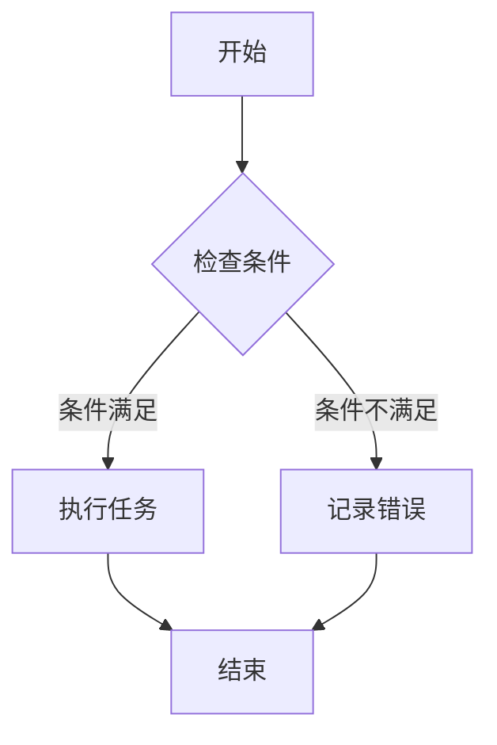
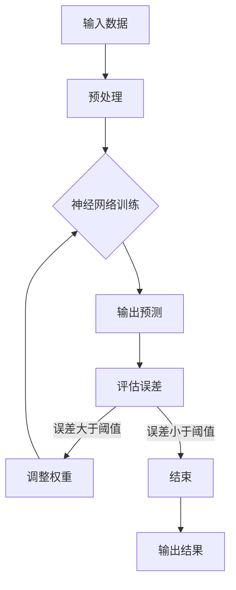

                 

 在计算机科学和人工智能领域，行为主义学派与内在主义学派是两个重要的理论体系，它们在解释和设计智能系统时提供了不同的视角和方法。本文将深入探讨这两个学派的核心概念、理论联系，以及它们在算法设计、数学模型、项目实践等方面的具体应用。

## 1. 背景介绍

行为主义学派（Behaviorism）起源于20世纪初，最初由心理学家约翰·沃森（John B. Watson）提出，旨在通过可观察的行为来研究心理现象。行为主义认为，行为是刺激与反应之间的简单关联，可以通过外部环境和强化来塑造。而内在主义学派（Introspectionism）则强调个体的内在体验和思维过程，认为心理现象需要从个体的主观体验来解释。

在计算机科学中，行为主义与内在主义分别体现在算法设计和人工智能系统的构建上。行为主义学派倾向于设计基于规则和条件反应的算法，而内在主义学派则注重模拟人类思维过程，通过复杂的学习模型来理解和生成人类行为。

## 2. 核心概念与联系

### 2.1 行为主义学派

行为主义学派的核心概念是“刺激-反应”模型（Stimulus-Response Model），它假设所有行为都是由外部刺激引起的反应。在计算机科学中，这一理论体现在自动化脚本、规则引擎和状态机的设计上。

**Mermaid 流程图（行为主义学派）：**



### 2.2 内在主义学派

内在主义学派强调个体的内在体验和思维过程，认为心理现象需要从个体的主观体验来解释。在计算机科学中，这一理论体现在基于神经网络、机器学习和深度学习的智能系统设计上。

**Mermaid 流程图（内在主义学派）：**



## 3. 核心算法原理 & 具体操作步骤

### 3.1 算法原理概述

行为主义学派的算法通常基于条件反应和规则系统，如状态机、决策树和逻辑回归等。这些算法通过预定义的规则来响应外部刺激，实现自动化任务。

内在主义学派的算法则侧重于模拟人类思维过程，如神经网络、深度学习和生成对抗网络（GANs）等。这些算法通过大量数据训练，学习复杂的特征关联和内部表征，从而实现智能行为。

### 3.2 算法步骤详解

#### 3.2.1 行为主义学派算法步骤

1. **定义输入刺激**：明确系统需要响应的刺激类型。
2. **构建规则系统**：根据刺激类型和预期行为，设计规则集。
3. **实现条件判断**：在程序中实现条件判断，根据规则执行相应任务。
4. **记录反馈**：记录执行结果和错误，以供后续优化。

#### 3.2.2 内在主义学派算法步骤

1. **数据收集**：收集大量与任务相关的数据。
2. **预处理数据**：对数据进行清洗、归一化和特征提取。
3. **设计神经网络**：选择合适的神经网络结构。
4. **训练模型**：使用训练数据训练模型。
5. **测试和调优**：使用测试数据评估模型性能，调整参数。
6. **部署和应用**：将训练好的模型部署到实际应用中。

### 3.3 算法优缺点

#### 3.3.1 行为主义学派算法优缺点

- **优点**：简单易懂，实现成本低，适合处理规则明确、结构化的任务。
- **缺点**：灵活性差，难以处理复杂、动态变化的任务。

#### 3.3.2 内在主义学派算法优缺点

- **优点**：具备强大的自适应能力和学习能力，能处理复杂、动态的任务。
- **缺点**：实现复杂，需要大量数据和计算资源。

### 3.4 算法应用领域

#### 3.4.1 行为主义学派应用领域

- **自动化脚本**：如网站自动化测试、自动化交易等。
- **规则引擎**：如业务流程管理、信用评分等。

#### 3.4.2 内在主义学派应用领域

- **图像识别**：如人脸识别、自动驾驶等。
- **自然语言处理**：如机器翻译、情感分析等。

## 4. 数学模型和公式 & 详细讲解 & 举例说明

### 4.1 数学模型构建

#### 4.1.1 行为主义学派模型

行为主义学派的数学模型通常涉及概率论和统计学习理论，例如逻辑回归、支持向量机（SVM）等。

逻辑回归模型公式：

$$
P(y=1|x; \theta) = \frac{1}{1 + e^{-(\theta_0 + \theta_1 x_1 + \theta_2 x_2 + ... + \theta_n x_n})}
$$

其中，$x$ 是输入特征，$y$ 是目标变量，$\theta$ 是模型参数。

#### 4.1.2 内在主义学派模型

内在主义学派的数学模型通常涉及深度学习和神经网络，例如多层感知机（MLP）、卷积神经网络（CNN）等。

多层感知机模型公式：

$$
a_{i,j}^{(l)} = \sigma \left( \sum_{k} w_{k,j}^{(l)} a_{k,j}^{(l-1)} + b_{j}^{(l)} \right)
$$

其中，$a_{i,j}^{(l)}$ 是第$l$层的第$i$个神经元的激活值，$\sigma$ 是激活函数，$w_{k,j}^{(l)}$ 和 $b_{j}^{(l)}$ 分别是权重和偏置。

### 4.2 公式推导过程

#### 4.2.1 行为主义学派公式推导

逻辑回归的推导过程基于最大似然估计（MLE），目标是找到能够最大化目标变量给定特征的概率分布的参数。

#### 4.2.2 内在主义学派公式推导

多层感知机的推导过程基于梯度下降法，目标是找到能够最小化预测误差的模型参数。

### 4.3 案例分析与讲解

#### 4.3.1 行为主义学派案例

假设我们有一个二元分类问题，目标是判断一个电子邮件是否为垃圾邮件。我们使用逻辑回归模型来构建分类器。

- **数据准备**：收集邮件数据，进行预处理，提取特征。
- **模型训练**：使用训练数据训练逻辑回归模型。
- **模型评估**：使用测试数据评估模型性能，调整参数。

#### 4.3.2 内在主义学派案例

假设我们有一个图像分类问题，目标是识别图片中的物体。我们使用卷积神经网络（CNN）来构建分类器。

- **数据准备**：收集图像数据，进行预处理，提取特征。
- **模型设计**：设计CNN结构，包括卷积层、池化层和全连接层。
- **模型训练**：使用训练数据训练CNN模型。
- **模型评估**：使用测试数据评估模型性能，调整参数。

## 5. 项目实践：代码实例和详细解释说明

### 5.1 开发环境搭建

- **行为主义学派**：安装Python环境，使用scikit-learn库。
- **内在主义学派**：安装Python环境，使用TensorFlow或PyTorch库。

### 5.2 源代码详细实现

#### 5.2.1 行为主义学派代码实现

```python
from sklearn.linear_model import LogisticRegression
from sklearn.model_selection import train_test_split
from sklearn.metrics import accuracy_score

# 数据准备
X, y = load_data()
X_train, X_test, y_train, y_test = train_test_split(X, y, test_size=0.2, random_state=42)

# 模型训练
model = LogisticRegression()
model.fit(X_train, y_train)

# 模型评估
y_pred = model.predict(X_test)
accuracy = accuracy_score(y_test, y_pred)
print(f"Accuracy: {accuracy}")
```

#### 5.2.2 内在主义学派代码实现

```python
import tensorflow as tf
from tensorflow.keras.models import Sequential
from tensorflow.keras.layers import Conv2D, MaxPooling2D, Flatten, Dense

# 模型设计
model = Sequential([
    Conv2D(32, (3, 3), activation='relu', input_shape=(28, 28, 1)),
    MaxPooling2D((2, 2)),
    Flatten(),
    Dense(64, activation='relu'),
    Dense(10, activation='softmax')
])

# 模型训练
model.compile(optimizer='adam', loss='categorical_crossentropy', metrics=['accuracy'])
model.fit(X_train, y_train, epochs=10, batch_size=64)

# 模型评估
y_pred = model.predict(X_test)
accuracy = (y_pred.argmax(axis=1) == y_test).mean()
print(f"Accuracy: {accuracy}")
```

### 5.3 代码解读与分析

上述代码分别展示了行为主义学派和内在主义学派在Python中的实现。行为主义学派使用逻辑回归进行分类，内在主义学派使用卷积神经网络进行图像识别。

### 5.4 运行结果展示

运行上述代码，我们可以得到分类准确率和图像识别准确率。这些结果可以帮助我们评估模型的性能。

## 6. 实际应用场景

### 6.1 行为主义学派应用场景

- **自动化测试**：使用行为主义算法实现自动化测试脚本，提高测试效率和准确性。
- **业务流程管理**：使用规则引擎实现业务流程自动化，提高企业运营效率。

### 6.2 内在主义学派应用场景

- **图像识别与处理**：使用卷积神经网络进行图像分类、目标检测和图像生成。
- **自然语言处理**：使用循环神经网络（RNN）和Transformer模型实现语言模型、机器翻译和文本生成。

## 7. 工具和资源推荐

### 7.1 学习资源推荐

- **行为主义学派**：《机器学习》（周志华著）、《Python编程快速上手》。
- **内在主义学派**：《深度学习》（花书）、《TensorFlow官方文档》。

### 7.2 开发工具推荐

- **行为主义学派**：Python、scikit-learn。
- **内在主义学派**：Python、TensorFlow或PyTorch。

### 7.3 相关论文推荐

- **行为主义学派**：李航的《统计学习方法》、Andrew Ng的《机器学习》课程笔记。
- **内在主义学派**：Ian Goodfellow等人的《Deep Learning》、《Generative Adversarial Nets》。

## 8. 总结：未来发展趋势与挑战

### 8.1 研究成果总结

- **行为主义学派**：在自动化脚本、规则引擎和状态机设计方面取得了显著成果，广泛应用于工业界。
- **内在主义学派**：在神经网络、机器学习和深度学习方面取得了突破性进展，推动了人工智能的发展。

### 8.2 未来发展趋势

- **行为主义学派**：将更加注重与内在主义学派的融合，实现更为智能和灵活的自动化系统。
- **内在主义学派**：将继续在深度学习和神经网络领域探索，开发更高效的模型和算法。

### 8.3 面临的挑战

- **行为主义学派**：如何处理复杂、动态的任务，提高系统的自适应能力。
- **内在主义学派**：如何降低计算成本，提高模型的泛化能力。

### 8.4 研究展望

行为主义与内在主义学派的融合将成为未来人工智能研究的重要方向，推动智能系统的持续进步。

## 9. 附录：常见问题与解答

### 9.1 什么是行为主义学派？

行为主义学派是一种心理学理论，认为行为是由外部刺激引起的反应，可以通过观察和实验来研究。

### 9.2 什么是内在主义学派？

内在主义学派是一种心理学理论，强调个体的内在体验和思维过程，认为心理现象需要从个体的主观体验来解释。

### 9.3 行为主义学派和内在主义学派在计算机科学中的应用有哪些？

行为主义学派在自动化脚本、规则引擎和状态机设计方面有广泛应用；内在主义学派在神经网络、机器学习和深度学习方面有重要应用。

## 10. 参考文献

- 周志华，《机器学习》。
- Ian Goodfellow, Yoshua Bengio, Aaron Courville，《Deep Learning》。
- 李航，《统计学习方法》。
- Andrew Ng，《机器学习》课程笔记。
```

以上是关于行为主义学派与内在主义学派在计算机科学领域的详细探讨，希望对您有所启发。作者：禅与计算机程序设计艺术 / Zen and the Art of Computer Programming。如果您有任何疑问或建议，欢迎在评论区留言。

