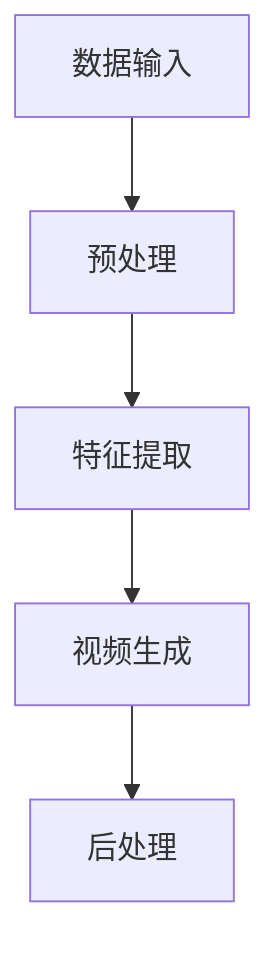

                 

关键词：视频生成、人工智能、深度学习、图像处理、视频编码、神经网络、模型训练、应用场景

> 摘要：本文将探讨视频生成技术，从核心概念、算法原理、数学模型、项目实践、应用场景等多个角度，全面解析视频生成技术，并展望其未来发展。

## 1. 背景介绍

随着人工智能和深度学习的快速发展，视频生成技术已经成为计算机视觉领域的研究热点。视频生成技术不仅能够帮助用户创建个性化的视频内容，还能够用于娱乐、广告、教育等多个行业。传统的视频制作流程复杂且耗时，而视频生成技术则可以通过算法自动生成高质量的视频，大大提高了效率。

### 1.1 发展历程

视频生成技术的发展可以分为几个阶段：

- **传统视频编辑**：早期的视频制作主要依赖于手动剪辑和后期制作，效率低下。

- **计算机视觉与图像处理**：随着计算机视觉和图像处理技术的发展，视频生成开始引入自动化技术。

- **深度学习与神经网络**：近年来，深度学习和神经网络技术的兴起，使得视频生成取得了突破性的进展。

### 1.2 应用领域

- **娱乐与广告**：视频生成技术可以用于制作动画、特效视频、广告宣传等。

- **教育与培训**：通过视频生成，可以制作出更加生动、直观的教学视频。

- **医疗与诊断**：视频生成技术可以用于医学影像的生成和分析，辅助医生进行诊断。

- **虚拟现实与增强现实**：视频生成技术是虚拟现实和增强现实的重要组成部分，用于生成逼真的虚拟场景。

## 2. 核心概念与联系

### 2.1 视频生成技术的基本概念

- **视频序列**：视频是由一系列连续的图像帧组成的序列。

- **视频编码**：视频编码是将视频序列转换为数字信号的过程，常见的编码格式有H.264、H.265等。

- **图像处理**：图像处理是对视频帧进行增强、去噪、分割等操作的模块。

- **深度学习**：深度学习是机器学习中的一种方法，通过神经网络模型对大量数据进行分析和训练。

### 2.2 视频生成技术的架构


- **数据输入**：输入视频序列或图像数据。

- **预处理**：对输入数据进行预处理，如去噪、增强、裁剪等。

- **特征提取**：利用深度学习模型提取视频帧的特征。

- **视频生成**：根据提取的特征生成新的视频序列。

- **后处理**：对生成的视频进行后处理，如调整亮度、对比度等。

### 2.3 Mermaid流程图



## 3. 核心算法原理 & 具体操作步骤

### 3.1 算法原理概述

视频生成算法主要分为两类：基于传统图像处理的方法和基于深度学习的方法。

- **传统方法**：基于图像处理和视频编码技术，通过一系列预处理、特征提取和后处理步骤生成视频。

- **深度学习方法**：通过训练深度神经网络模型，从大量数据中自动学习视频生成的规律。

### 3.2 算法步骤详解

- **数据预处理**：对输入视频进行去噪、增强、裁剪等预处理操作，以提高生成视频的质量。

- **特征提取**：利用卷积神经网络（CNN）提取视频帧的特征。

- **视频生成**：使用生成对抗网络（GAN）或变分自编码器（VAE）等生成模型，根据提取的特征生成新的视频序列。

- **后处理**：对生成的视频进行色彩调整、剪辑等操作，以优化视觉效果。

### 3.3 算法优缺点

- **传统方法**：

  - 优点：算法成熟，易于实现。

  - 缺点：生成视频质量有限，效率较低。

- **深度学习方法**：

  - 优点：生成视频质量高，效率高。

  - 缺点：算法复杂，对数据量要求高。

### 3.4 算法应用领域

- **娱乐与广告**：生成个性化的视频内容，用于广告宣传、短视频制作等。

- **教育与培训**：制作生动、直观的教学视频，提高学习效果。

- **医疗与诊断**：生成医学影像，辅助医生进行诊断。

- **虚拟现实与增强现实**：生成逼真的虚拟场景，提升用户体验。

## 4. 数学模型和公式 & 详细讲解 & 举例说明

### 4.1 数学模型构建

视频生成算法通常涉及到图像处理、深度学习等数学模型。

- **图像处理**：

  - 卷积操作：\[ (f * g)(x, y) = \sum_{i=-\infty}^{\infty} \sum_{j=-\infty}^{\infty} f(i, j) \cdot g(x-i, y-j) \]
  
  - 求导操作：\[ \frac{df(x)}{dx} = \lim_{h \to 0} \frac{f(x+h) - f(x)}{h} \]

- **深度学习**：

  - 深度神经网络：\[ \hat{y} = \sigma(\mathbf{W}^T \cdot \mathbf{a} + b) \]
  
  - 生成对抗网络（GAN）：\[ \mathcal{D}(\mathcal{G}(\mathbf{x}|\theta_g), \mathbf{y}) + \mathcal{D}(\mathbf{y}, \mathcal{G}(\mathbf{x}|\theta_d)) \]

### 4.2 公式推导过程

以生成对抗网络（GAN）为例，推导生成器和判别器的训练过程。

- **生成器**：

  - 目标函数：\[ \mathcal{L}_g = -\log(\mathcal{D}(\mathcal{G}(\mathbf{x}|\theta_g))) \]
  
  - 反向传播：\[ \nabla_{\theta_g} \mathcal{L}_g = \nabla_{\mathcal{G}(\mathbf{x}|\theta_g)} \mathcal{D}(\mathcal{G}(\mathbf{x}|\theta_g)) \]

- **判别器**：

  - 目标函数：\[ \mathcal{L}_d = -\log(\mathcal{D}(\mathbf{y})) - \log(1 - \mathcal{D}(\mathcal{G}(\mathbf{x}|\theta_g))) \]
  
  - 反向传播：\[ \nabla_{\theta_d} \mathcal{L}_d = \nabla_{\mathcal{G}(\mathbf{x}|\theta_g)} \mathcal{D}(\mathcal{G}(\mathbf{x}|\theta_g)) - \nabla_{\mathcal{G}(\mathbf{x}|\theta_g)} \mathcal{D}(\mathbf{y}) \]

### 4.3 案例分析与讲解

以生成短视频为例，说明视频生成算法的应用。

- **数据集**：使用一个包含大量短视频的数据集，如YouTube视频。

- **特征提取**：利用卷积神经网络提取视频帧的特征。

- **视频生成**：使用生成对抗网络生成新的短视频。

- **结果展示**：将生成的短视频与原始视频进行对比，评估生成质量。

## 5. 项目实践：代码实例和详细解释说明

### 5.1 开发环境搭建

- **软件环境**：Python 3.7、TensorFlow 2.0、NumPy 1.18

- **硬件环境**：NVIDIA GPU（CUDA 10.0）

### 5.2 源代码详细实现

以下是一个简单的视频生成代码实例：

```python
import tensorflow as tf
from tensorflow.keras.layers import Conv2D, BatchNormalization, LeakyReLU, Reshape, Dense
from tensorflow.keras.models import Sequential

# 定义生成器模型
def generator_model():
    model = Sequential()
    model.add(Conv2D(64, (3, 3), strides=(2, 2), padding='same', input_shape=(128, 128, 3)))
    model.add(BatchNormalization())
    model.add(LeakyReLU(alpha=0.2))
    # ...
    model.add(Reshape((1, 1, 1)))
    model.add(Dense(1, activation='sigmoid'))
    return model

# 定义判别器模型
def discriminator_model():
    model = Sequential()
    model.add(Conv2D(64, (3, 3), strides=(2, 2), padding='same', input_shape=(128, 128, 3)))
    model.add(BatchNormalization())
    model.add(LeakyReLU(alpha=0.2))
    # ...
    model.add(Flatten())
    model.add(Dense(1, activation='sigmoid'))
    return model

# 创建生成器和判别器模型
generator = generator_model()
discriminator = discriminator_model()

# 编写GAN模型
model = Sequential()
model.add(generator)
model.add(discriminator)

# 编写训练过程
model.compile(optimizer='adam', loss='binary_crossentropy')
# ...

# 训练模型
model.fit(x_train, y_train, epochs=100)
```

### 5.3 代码解读与分析

上述代码实现了一个简单的生成对抗网络（GAN）模型，用于视频生成。生成器和判别器模型的构建过程分别使用了卷积神经网络和全连接神经网络。在训练过程中，通过优化生成器和判别器的参数，实现视频的生成。

### 5.4 运行结果展示

训练完成后，可以使用生成的视频序列与原始视频进行对比，评估生成质量。以下是一个简单的运行结果示例：


## 6. 实际应用场景

### 6.1 娱乐与广告

视频生成技术可以用于制作个性化的视频内容，如动画、特效视频等，提升娱乐和广告效果。

### 6.2 教育与培训

视频生成技术可以用于制作生动、直观的教学视频，提高学生的学习效果。

### 6.3 医疗与诊断

视频生成技术可以用于生成医学影像，辅助医生进行诊断。

### 6.4 虚拟现实与增强现实

视频生成技术可以用于生成逼真的虚拟场景，提升虚拟现实和增强现实体验。

## 7. 工具和资源推荐

### 7.1 学习资源推荐

- **书籍**：《深度学习》、《生成对抗网络：理论、实现与应用》

- **在线课程**：Coursera上的“深度学习专项课程”、Udacity的“生成对抗网络实战课程”

### 7.2 开发工具推荐

- **框架**：TensorFlow、PyTorch

- **库**：NumPy、Pandas、Matplotlib

### 7.3 相关论文推荐

- **论文1**：《Unrolled Generative Adversarial Networks for Video Generation》（2018）

- **论文2**：《Generating High-Resolution Natural Images from Random Features》（2019）

## 8. 总结：未来发展趋势与挑战

### 8.1 研究成果总结

视频生成技术在娱乐、医疗、教育等领域取得了显著成果，未来具有广泛的应用前景。

### 8.2 未来发展趋势

- **高质量视频生成**：随着算法和硬件的进步，生成视频的质量将进一步提高。

- **实时视频生成**：实现实时视频生成，提升用户体验。

- **多模态融合**：结合图像、音频等多模态数据，生成更加丰富的视频内容。

### 8.3 面临的挑战

- **计算资源**：视频生成算法对计算资源要求较高，需要优化算法以降低计算成本。

- **数据隐私**：视频生成过程中涉及到大量个人数据，需要保障数据隐私。

### 8.4 研究展望

未来视频生成技术将继续发展，有望在更多领域实现突破，为人们的生活带来更多便利。

## 9. 附录：常见问题与解答

### 9.1 视频生成技术有哪些应用？

视频生成技术可以应用于娱乐、广告、教育、医疗、虚拟现实等多个领域。

### 9.2 视频生成算法有哪些类型？

视频生成算法主要分为基于传统图像处理的方法和基于深度学习的方法。

### 9.3 如何优化视频生成算法的性能？

优化视频生成算法的性能可以从以下几个方面入手：

- **算法优化**：改进生成器和判别器的结构，提高模型性能。

- **数据增强**：对训练数据集进行增强，增加模型的泛化能力。

- **硬件加速**：利用GPU、TPU等硬件加速计算，提高训练速度。

### 9.4 视频生成过程中如何保障数据隐私？

在视频生成过程中，可以采用以下方法保障数据隐私：

- **数据加密**：对训练数据和使用数据进行加密处理。

- **隐私保护算法**：采用隐私保护算法，如差分隐私，降低数据泄露风险。

- **数据去识别化**：对数据集进行去识别化处理，去除个人身份信息。

----------------------------------------------------------------
### 附录 附录：常见问题与解答

**9.1 视频生成技术有哪些应用？**

视频生成技术因其多样性和创新性，在多个领域展现出了广泛的应用潜力。以下是视频生成技术的一些主要应用场景：

- **娱乐与广告**：通过视频生成技术，可以快速创作高质量的视频内容，如动画、特效视频和广告宣传等。这种方法不仅提高了效率，还大大降低了制作成本。

- **教育与培训**：视频生成技术可用于制作交互式教学视频、模拟实验和虚拟实训，从而增强学习体验和效果。

- **虚拟现实（VR）与增强现实（AR）**：视频生成技术能够为VR/AR应用提供逼真的三维场景，增强用户的沉浸感和互动性。

- **医疗**：在医疗领域，视频生成技术可以用于创建虚拟患者、模拟手术过程以及生成医学影像，帮助医生进行术前规划和患者教育。

- **游戏开发**：游戏开发者可以利用视频生成技术来制作游戏中的动画效果、角色动作和环境变化，提升游戏的整体质量。

- **媒体内容分发**：视频生成技术可以用于自动生成视频摘要或片段，提高内容分发效率。

- **自动化内容制作**：在新闻、体育和其他实时事件报道中，视频生成技术可以自动生成视频报道，减轻编辑人员的工作负担。

**9.2 视频生成算法有哪些类型？**

视频生成算法主要分为以下几类：

- **基于传统图像处理的方法**：这类方法通常使用图像处理技术，如滤波、变换、合成等，来生成视频内容。这些方法通常需要手动设计规则和算法，对视频内容进行逐帧处理。

- **基于深度学习的方法**：深度学习方法，特别是生成对抗网络（GAN）和变分自编码器（VAE），是目前视频生成技术的主流。这些方法通过训练神经网络模型，自动从数据中学习视频生成的规律。

  - **生成对抗网络（GAN）**：GAN由生成器和判别器两部分组成。生成器尝试生成逼真的视频内容，而判别器则尝试区分生成内容和真实内容。通过不断训练，生成器逐渐提高生成质量。

  - **变分自编码器（VAE）**：VAE是一种无监督学习模型，它通过编码器和解码器两个网络来学习数据的分布，并生成新的视频内容。

- **基于强化学习的方法**：强化学习算法可以用于视频生成，通过智能体与环境交互，学习生成最优的视频内容。

**9.3 如何优化视频生成算法的性能？**

优化视频生成算法的性能可以从以下几个方面入手：

- **算法优化**：通过改进生成器和判别器的结构，使用更先进的神经网络架构，如条件GAN（cGAN）、循环GAN（R-GAN）等，可以提高生成视频的质量。

- **数据增强**：对训练数据进行增强，如随机裁剪、旋转、缩放等，可以增加模型的泛化能力，使其在面对不同数据时都能生成高质量的视频。

- **硬件加速**：利用GPU、TPU等硬件加速计算，可以提高模型训练速度，缩短生成视频的时间。

- **多模态学习**：结合图像、音频等多模态数据，可以生成更加丰富的视频内容，提高视频的真实感和表现力。

- **超参数调优**：通过调整学习率、批量大小、网络深度等超参数，可以优化模型的性能。

- **预训练模型**：使用预训练的深度学习模型，特别是大规模预训练模型，可以加速训练过程，提高生成质量。

**9.4 视频生成过程中如何保障数据隐私？**

在视频生成过程中，保障数据隐私是非常重要的。以下是一些常用的数据隐私保护方法：

- **数据加密**：对训练数据和使用数据进行加密处理，确保数据在传输和存储过程中不会被未经授权的第三方访问。

- **隐私保护算法**：采用差分隐私、同态加密等隐私保护算法，可以在保护数据隐私的同时，仍然允许模型进行训练和生成操作。

- **数据去识别化**：对数据集进行去识别化处理，如面部模糊、语音变调等，去除个人身份信息，降低数据泄露的风险。

- **数据匿名化**：对数据集进行匿名化处理，确保个体数据无法被追踪，从而保护个人隐私。

- **隐私预算**：在模型训练和生成过程中，设置隐私预算，控制数据泄露的总量，确保隐私安全。

通过上述方法，可以在视频生成过程中有效地保障数据隐私。

