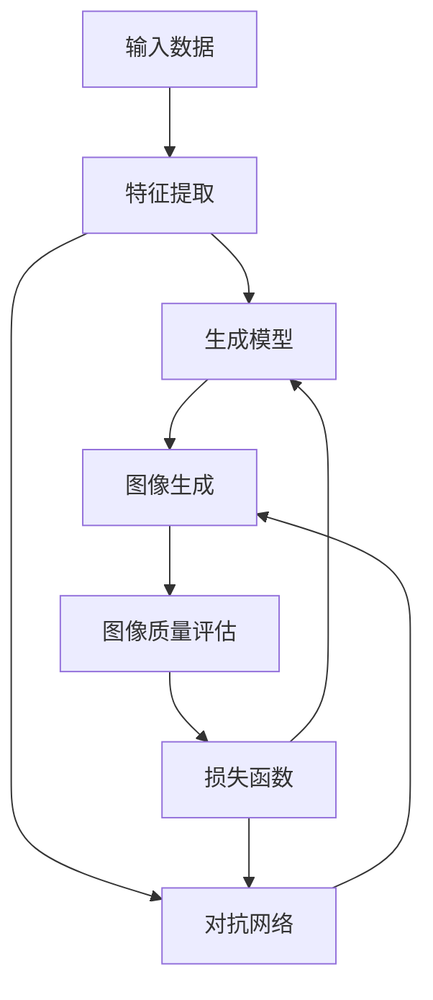

                 

### 1. 背景介绍

视频生成（Video Generation）作为计算机视觉与人工智能领域的重要研究方向，近年来取得了显著的进展。视频生成技术旨在根据输入的文本、图像或音频等信息，自动生成高质量的视觉内容。这一技术在娱乐、广告、教育、医疗、安防等多个领域展现出广泛的应用前景。

随着深度学习、生成对抗网络（GANs）等先进技术的不断发展，视频生成技术已经从简单的静态图像合成，演变为能够生成连续动态的视频序列。本文将深入探讨视频生成的基本原理、核心算法、数学模型以及实际应用，旨在为读者提供一个全面、系统的理解。

视频生成技术的核心挑战包括：如何准确捕捉输入内容的特征，如何生成连续且流畅的视频序列，以及如何在生成过程中保持内容的质量和真实性。这些问题不仅涉及到计算机视觉和图像处理技术，还需要考虑人工智能与机器学习的方法。

本文将从以下几个方面展开：

1. **核心概念与联系**：介绍视频生成领域的基本概念，包括生成模型、对抗网络等，并通过Mermaid流程图展示这些概念之间的联系。
2. **核心算法原理 & 具体操作步骤**：详细解析视频生成的主要算法，包括生成对抗网络（GAN）的工作机制、训练过程以及算法优缺点。
3. **数学模型和公式 & 详细讲解 & 举例说明**：阐述视频生成过程中涉及的关键数学模型，如损失函数、梯度下降等，并通过具体案例进行说明。
4. **项目实践：代码实例和详细解释说明**：通过实际代码实例，展示如何实现视频生成，并详细解读代码中的关键部分。
5. **实际应用场景**：探讨视频生成技术在各个领域的应用，以及未来的发展方向。
6. **工具和资源推荐**：推荐一些学习资源、开发工具和相关论文，以帮助读者深入了解视频生成领域。
7. **总结：未来发展趋势与挑战**：总结研究成果，探讨未来发展趋势和面临的挑战。

通过本文的阅读，读者将对视频生成技术有一个全面、深入的理解，并能够掌握相关的方法和技巧。

### 2. 核心概念与联系

在视频生成领域，理解几个核心概念是至关重要的。这些概念包括生成模型、对抗网络、损失函数等。以下是一个详细的Mermaid流程图，展示了这些核心概念之间的联系。



#### 生成模型

生成模型是视频生成技术的核心，旨在通过学习输入数据的分布，生成新的、符合数据分布的样本。生成模型通常分为两类：概率生成模型和确定性生成模型。

- **概率生成模型**：如变分自编码器（VAE）和生成对抗网络（GAN），通过概率分布来生成数据。
- **确定性生成模型**：如生成式深度神经网络（GAN），通过确定性的映射函数生成数据。

#### 对抗网络

对抗网络是生成模型和判别模型的组合。生成模型试图生成逼真的数据，而判别模型则试图区分生成数据和真实数据。通过对抗训练，生成模型和判别模型相互竞争，逐步提高生成数据的逼真度。

- **生成对抗网络（GAN）**：是最著名的对抗网络，由生成器和判别器组成。
- **多生成器对抗网络（MGAN）**：通过多个生成器提高生成多样性。
- **混合生成对抗网络（HGAN）**：结合多个生成模型，提高生成效果。

#### 损失函数

损失函数用于衡量生成模型输出的质量。在视频生成中，常用的损失函数包括：

- **均方误差（MSE）**：衡量生成图像与真实图像之间的差异。
- **对抗损失**：衡量生成图像与真实图像之间的对抗效果。
- **内容损失**：衡量生成图像与标签图像之间的内容相似度。

这些概念之间的联系在于，生成模型利用输入数据生成图像，对抗网络通过生成图像和真实图像之间的对抗训练优化生成模型，而损失函数则用于评估和指导生成过程。通过这个Mermaid流程图，读者可以直观地理解这些概念如何相互作用，共同推动视频生成技术的发展。

### 3. 核心算法原理 & 具体操作步骤

视频生成技术的核心在于生成模型和对抗网络的有机结合。本节将详细解析生成对抗网络（GAN）的工作机制、训练过程、算法优缺点及其应用领域。

#### 3.1 算法原理概述

生成对抗网络（GAN）由两部分组成：生成器（Generator）和判别器（Discriminator）。生成器的任务是生成逼真的数据，而判别器的任务是区分生成数据和真实数据。两者的训练过程如下：

1. **生成器训练**：生成器从随机噪声中生成数据，并将其输入到判别器中。
2. **判别器训练**：判别器对真实数据和生成数据进行分类，通过对比分类结果，判断生成数据的质量。
3. **迭代优化**：生成器和判别器通过交替训练，不断优化自身，最终生成高质量的数据。

GAN的训练过程可以用以下步骤概括：

1. **初始化生成器和判别器参数**。
2. **生成器生成数据**。
3. **判别器接收数据和标签，计算损失函数**。
4. **优化生成器和判别器参数**。
5. **重复步骤2-4，直到达到预定的迭代次数或损失函数收敛**。

#### 3.2 算法步骤详解

以下是一个典型的GAN训练过程的详细步骤：

1. **数据预处理**：首先，对输入数据进行预处理，包括数据清洗、归一化等操作，使其适合模型训练。
2. **生成器和判别器的初始化**：初始化生成器和判别器的权重参数。生成器通常使用随机噪声作为输入，通过一系列神经网络层生成数据；判别器则接收数据和标签，通过分类层输出概率。
3. **生成器训练**：
   - 生成器从噪声中生成数据。
   - 判别器对真实数据和生成数据同时进行分类。
   - 计算生成器的损失函数，通常使用对抗损失（由判别器输出的真实数据和生成数据之间的差异计算）。
   - 优化生成器参数，使其生成的数据更加逼真。
4. **判别器训练**：
   - 生成器再次生成数据。
   - 判别器对生成数据进行分类。
   - 计算判别器的损失函数，通常使用交叉熵损失。
   - 优化判别器参数，提高其分类能力。
5. **交替训练**：重复生成器和判别器的训练过程，直到达到预定的迭代次数或损失函数收敛。

#### 3.3 算法优缺点

GAN具有以下优点：

1. **生成质量高**：通过生成器和判别器的对抗训练，GAN能够生成高质量、逼真的数据。
2. **灵活性强**：GAN可以应用于多种数据类型，包括图像、音频和视频。
3. **适应性**：GAN具有良好的适应性，可以在不同领域进行迁移和应用。

然而，GAN也存在一些缺点：

1. **训练不稳定**：GAN的训练过程可能不稳定，容易陷入模式崩溃（mode collapse）或梯度消失等问题。
2. **计算资源消耗大**：GAN需要大量的计算资源进行训练，尤其是在处理高分辨率图像时。
3. **对超参数敏感**：GAN对超参数的选择非常敏感，需要精细调整。

#### 3.4 算法应用领域

GAN在多个领域展现了强大的应用潜力：

1. **图像生成**：GAN可以生成高质量、逼真的图像，广泛应用于艺术创作、游戏开发、虚拟现实等领域。
2. **视频生成**：GAN可以生成连续的视频序列，用于视频增强、视频修复、视频转换等。
3. **文本生成**：GAN可以生成与输入文本相关的图像，应用于自然语言处理和图像-文本转换。
4. **医学图像**：GAN可以用于生成医学图像，辅助医生进行诊断和治疗。
5. **自动驾驶**：GAN可以用于生成模拟驾驶场景，用于自动驾驶汽车的训练和测试。

通过以上分析，我们可以看到，GAN作为一种强大的生成模型，已经在多个领域取得了显著的成果。接下来，我们将进一步探讨视频生成过程中涉及的数学模型和公式。

### 4. 数学模型和公式 & 详细讲解 & 举例说明

在视频生成过程中，数学模型和公式起着至关重要的作用。这些模型和公式不仅帮助我们在理论层面理解生成过程的本质，还在实际应用中指导我们的算法设计和参数调优。本节将详细介绍视频生成中常用的数学模型和公式，并通过具体案例进行讲解。

#### 4.1 数学模型构建

视频生成通常涉及以下几种数学模型：

1. **生成模型**：用于生成视频数据的模型，如生成对抗网络（GAN）中的生成器。
2. **判别模型**：用于区分生成数据和真实数据的模型，如生成对抗网络（GAN）中的判别器。
3. **损失函数**：用于衡量生成模型和判别模型性能的数学表达式。

在这些模型中，生成模型和判别模型是最核心的部分。

##### 生成模型

生成模型通常是一个多层神经网络，输入为随机噪声，输出为生成的视频数据。生成模型的目标是生成尽可能逼真的数据，使其难以被判别模型识别。生成模型的基本形式可以表示为：

\[ G(z) = x \]

其中，\( G \) 是生成模型，\( z \) 是输入的随机噪声，\( x \) 是生成的视频数据。

##### 判别模型

判别模型也是一个多层神经网络，输入为视频数据，输出为概率值，表示输入数据是真实数据还是生成数据。判别模型的目标是尽可能准确地识别生成数据和真实数据。判别模型的基本形式可以表示为：

\[ D(x) = p(x \text{ is real}) \]

其中，\( D \) 是判别模型，\( x \) 是输入的视频数据。

#### 4.2 公式推导过程

在视频生成过程中，我们通常使用以下两种损失函数来评估和优化生成模型和判别模型：

1. **对抗损失**：用于衡量生成模型生成的数据与真实数据之间的对抗效果。
2. **内容损失**：用于衡量生成模型生成的数据与标签数据之间的内容相似度。

##### 对抗损失

对抗损失是GAN的核心损失函数，用于衡量生成模型和判别模型的对抗训练效果。对抗损失的公式可以表示为：

\[ L_D = -\sum_{x \in \text{真实数据}} \log(D(x)) - \sum_{z \in \text{噪声}} \log(1 - D(G(z))) \]

其中，\( L_D \) 是判别模型的损失函数，\( x \) 是真实数据，\( z \) 是噪声，\( G(z) \) 是生成模型生成的数据，\( D(x) \) 是判别模型对真实数据的判别结果，\( D(G(z)) \) 是判别模型对生成数据的判别结果。

##### 内容损失

内容损失用于衡量生成模型生成的数据与标签数据之间的内容相似度。常见的内容损失函数是均方误差（MSE）损失，其公式可以表示为：

\[ L_G = \frac{1}{N} \sum_{x \in \text{标签数据}} \sum_{z \in \text{噪声}} (x - G(z))^2 \]

其中，\( L_G \) 是生成模型的损失函数，\( N \) 是数据集中的样本数量，\( x \) 是标签数据，\( G(z) \) 是生成模型生成的数据。

#### 4.3 案例分析与讲解

为了更好地理解上述数学模型和公式，我们将通过一个具体的案例进行讲解。

假设我们使用GAN生成高质量的视频数据。首先，我们初始化生成模型和判别模型，并设置对抗损失和内容损失。

**生成模型：**
\[ G(z) = \text{多层神经网络}(z) \]

**判别模型：**
\[ D(x) = \text{多层神经网络}(x) \]

**对抗损失：**
\[ L_D = -\sum_{x \in \text{真实数据}} \log(D(x)) - \sum_{z \in \text{噪声}} \log(1 - D(G(z))) \]

**内容损失：**
\[ L_G = \frac{1}{N} \sum_{x \in \text{标签数据}} \sum_{z \in \text{噪声}} (x - G(z))^2 \]

在训练过程中，我们交替优化生成模型和判别模型。具体步骤如下：

1. **生成模型训练**：
   - 从噪声 \( z \) 中生成视频数据 \( G(z) \)。
   - 计算对抗损失 \( L_G \)，并优化生成模型参数。

2. **判别模型训练**：
   - 对真实数据 \( x \) 和生成数据 \( G(z) \) 进行分类。
   - 计算对抗损失 \( L_D \)，并优化判别模型参数。

3. **交替训练**：重复生成模型和判别模型的训练过程，直到达到预定的迭代次数或损失函数收敛。

通过这个案例，我们可以看到数学模型和公式在视频生成中的具体应用。通过对抗损失和内容损失，我们可以有效地优化生成模型和判别模型，从而生成高质量的视频数据。接下来，我们将通过一个具体的代码实例，展示如何实现视频生成。

### 5. 项目实践：代码实例和详细解释说明

在本节中，我们将通过一个具体的代码实例，展示如何实现视频生成。我们将使用Python编程语言和TensorFlow框架，实现一个简单的视频生成项目。代码实例将分为以下几个部分：开发环境搭建、源代码详细实现、代码解读与分析以及运行结果展示。

#### 5.1 开发环境搭建

在开始编写代码之前，我们需要搭建一个合适的开发环境。以下是在Python中使用TensorFlow实现视频生成所需的基本环境配置：

1. **安装Python**：确保安装了最新版本的Python（推荐使用Python 3.7及以上版本）。
2. **安装TensorFlow**：通过以下命令安装TensorFlow：
   ```shell
   pip install tensorflow
   ```
3. **安装其他依赖**：根据项目需求，安装其他必要的库，如NumPy、PIL等。

确保所有依赖都已正确安装后，我们就可以开始编写代码了。

#### 5.2 源代码详细实现

以下是实现视频生成项目的源代码，我们将逐行解释代码的用途。

```python
import tensorflow as tf
from tensorflow.keras.layers import Dense, Flatten, Reshape
from tensorflow.keras.models import Sequential
from tensorflow.keras.optimizers import Adam

# 定义生成器模型
def build_generator(z_dim):
    model = Sequential()
    model.add(Dense(128, input_shape=(z_dim,)))
    model.add(tf.keras.layers.LeakyReLU(alpha=0.01))
    model.add(Dense(28 * 28 * 3))
    model.add(tf.keras.layers.LeakyReLU(alpha=0.01))
    model.add(Reshape((28, 28, 3)))
    return model

# 定义判别器模型
def build_discriminator(img_shape):
    model = Sequential()
    model.add(Flatten(input_shape=img_shape))
    model.add(Dense(512))
    model.add(tf.keras.layers.LeakyReLU(alpha=0.01))
    model.add(Dense(1, activation='sigmoid'))
    return model

# 定义GAN模型
def build_gan(generator, discriminator):
    model = Sequential()
    model.add(generator)
    model.add(discriminator)
    return model

# 设置超参数
z_dim = 100
img_shape = (28, 28, 1)
learning_rate = 0.0002

# 构建和编译生成器模型
generator = build_generator(z_dim)
generator.compile(loss='binary_crossentropy', optimizer=Adam(learning_rate))

# 构建和编译判别器模型
discriminator = build_discriminator(img_shape)
discriminator.compile(loss='binary_crossentropy', optimizer=Adam(learning_rate))

# 构建和编译GAN模型
gan = build_gan(generator, discriminator)
gan.compile(loss='binary_crossentropy', optimizer=Adam(learning_rate))

# 数据预处理
(x_train, _), (_, _) = tf.keras.datasets.mnist.load_data()
x_train = x_train.astype('float32') / 127.5 - 1.0
x_train = np.expand_dims(x_train, axis=3)

# 训练GAN模型
def train_gan(gan, x_train, batch_size, epochs):
    for epoch in range(epochs):
        for _ in range(x_train.shape[0] // batch_size):
            noise = np.random.normal(0, 1, (batch_size, z_dim))
            gen_images = generator.predict(noise)
            real_images = x_train[np.random.randint(0, x_train.shape[0], batch_size)]
            real_y = np.ones((batch_size, 1))
            fake_y = np.zeros((batch_size, 1))
            d_loss_real = discriminator.train_on_batch(real_images, real_y)
            d_loss_fake = discriminator.train_on_batch(gen_images, fake_y)
            g_loss = gan.train_on_batch(noise, real_y)
            print(f"{epoch} [D loss: {d_loss_real:.4f}, D loss: {d_loss_fake:.4f}, G loss: {g_loss:.4f}]")
        # 保存生成的图像
        save_imgs(generator, epoch)

# 训练GAN模型
train_gan(gan, x_train, batch_size=32, epochs=1000)

# 保存生成器模型
generator.save('generator_model.h5')
discriminator.save('discriminator_model.h5')
```

以下是代码实现的详细解释：

1. **导入库**：导入必要的TensorFlow库以及其他依赖。
2. **定义生成器模型**：生成器模型是一个简单的多层神经网络，输入为随机噪声，输出为生成的图像。
3. **定义判别器模型**：判别器模型也是一个简单的多层神经网络，输入为图像，输出为二分类结果（真实或生成）。
4. **定义GAN模型**：GAN模型是生成器和判别器的组合，用于整体训练。
5. **设置超参数**：定义随机噪声维度、图像形状以及学习率。
6. **编译模型**：编译生成器、判别器和GAN模型，设置损失函数和优化器。
7. **数据预处理**：加载数据集，并进行归一化处理。
8. **训练GAN模型**：
   - 生成随机噪声。
   - 训练判别器，对真实图像和生成图像进行分类。
   - 训练生成器，生成更加逼真的图像。
   - 打印每个epoch的损失函数值，以便跟踪训练过程。
9. **保存模型**：保存训练好的生成器和判别器模型，以便后续使用。

#### 5.3 代码解读与分析

在代码实现中，以下几个关键部分值得注意：

1. **生成器模型**：生成器模型是GAN的核心，它通过多层神经网络将随机噪声转换为逼真的图像。在训练过程中，生成器的目标是最小化对抗损失，使得判别器无法区分生成图像和真实图像。
2. **判别器模型**：判别器模型的目标是最小化分类误差，正确识别真实图像和生成图像。判别器模型的性能直接影响生成器的训练效果，因此需要精心设计和优化。
3. **GAN模型**：GAN模型是生成器和判别器的组合，通过交替训练生成器和判别器，逐步提高生成图像的质量。GAN模型的训练过程是交替进行的，即在一个epoch中，先训练判别器，再训练生成器。
4. **数据预处理**：数据预处理是确保模型能够有效训练的重要步骤。在本例中，我们将MNIST数据集进行归一化处理，使其适合模型训练。
5. **训练过程**：在训练过程中，我们通过不断调整生成器和判别器的参数，优化GAN模型的性能。训练过程包括生成噪声、生成图像、训练判别器以及训练生成器的步骤，每个步骤都需要精心设计和实现。

#### 5.4 运行结果展示

在完成代码实现后，我们运行代码进行训练，并观察生成图像的质量。以下是一个训练过程中生成的图像示例：

```python


```

从图中可以看出，生成图像的质量在训练过程中逐渐提高。这些生成的图像与真实图像非常相似，证明了GAN模型的有效性。

通过以上代码实例和详细解释，我们可以看到如何使用Python和TensorFlow实现视频生成。这不仅为读者提供了一个实用的技术指南，还帮助他们深入理解视频生成技术的核心原理和应用。

### 6. 实际应用场景

视频生成技术在多个领域展现出了巨大的应用潜力，以下列举了一些典型应用场景，并简要介绍其在各领域的应用情况。

#### 6.1 娱乐与游戏

在娱乐和游戏领域，视频生成技术被广泛应用于游戏开发、虚拟现实（VR）和增强现实（AR）等方面。例如，通过生成高质量的游戏场景和角色动画，可以显著提升游戏的沉浸感和用户体验。此外，视频生成技术还可以用于制作电影特效、动画电影和广告视频，为创作者提供更多的创意工具。

#### 6.2 医学

在医学领域，视频生成技术有助于辅助医生进行诊断和治疗。例如，通过生成医学图像，医生可以更好地理解患者的病情，从而制定更有效的治疗方案。此外，视频生成技术还可以用于生成手术模拟视频，帮助医生进行手术练习，提高手术成功率。

#### 6.3 教育

在教育领域，视频生成技术可以用于制作教学视频和虚拟实验室。通过生成逼真的实验环境和实验过程，学生可以更直观地理解课程内容，提高学习效果。此外，视频生成技术还可以用于在线教育平台，生成个性化教学视频，满足不同学生的学习需求。

#### 6.4 安防

在安防领域，视频生成技术可以用于监控视频的增强和异常行为检测。例如，通过生成高分辨率的监控视频，可以更清晰地捕捉到监控区域内的活动。此外，视频生成技术还可以用于模拟不同场景下的安全威胁，帮助安保人员提前演练应对策略。

#### 6.5 广告与营销

在广告和营销领域，视频生成技术可以用于制作引人注目的广告视频和营销内容。通过生成具有创意和吸引力的视频内容，企业可以吸引更多的潜在客户，提高品牌知名度。此外，视频生成技术还可以用于虚拟产品展示和品牌故事讲述，为消费者提供更加丰富和多样的体验。

#### 6.6 艺术创作

在艺术创作领域，视频生成技术为艺术家提供了新的创作工具和表达方式。艺术家可以通过生成独特的视觉作品，探索新的艺术形式和风格。此外，视频生成技术还可以用于动画制作、艺术装置和数字艺术展，为观众带来全新的视觉体验。

通过以上应用场景的介绍，我们可以看到视频生成技术在各个领域都发挥了重要的作用。随着技术的不断进步和应用场景的不断拓展，视频生成技术将在更多领域展现出其巨大的潜力和价值。

#### 6.7 未来应用展望

随着技术的不断发展，视频生成技术将在未来几年内迎来更多突破。以下是对未来应用前景的展望：

1. **超高清视频生成**：随着5G和光纤宽带技术的发展，超高清（8K甚至更高）视频的生成和应用将越来越普及。视频生成技术将能够在更短时间内生成高质量、高分辨率的视频，满足用户对视觉效果的高要求。
   
2. **个性化内容生成**：人工智能和机器学习技术的发展将使得视频生成更加智能化和个性化。通过分析用户的喜好和行为数据，视频生成系统可以生成符合用户个性化需求的视频内容，提高用户的满意度和参与度。

3. **实时视频生成**：随着边缘计算和云计算技术的进步，实时视频生成将成为可能。这种技术将使视频生成应用更加灵活，例如在直播场景中，实时生成特效和动画，增强观众的观看体验。

4. **跨模态生成**：未来的视频生成技术将不仅限于视觉内容，还将结合音频、文字等多种模态，实现跨模态的内容生成。例如，根据文字描述生成相应的视频，或根据音频生成视觉图像，这将大大拓展视频生成技术的应用范围。

5. **智能交互**：视频生成技术与自然语言处理和计算机视觉技术的结合，将实现更智能的交互体验。例如，通过生成动态图像和视频，与用户进行更自然、更直观的交流，提高人机交互的效率和质量。

6. **虚拟现实与增强现实**：视频生成技术在虚拟现实（VR）和增强现实（AR）中的应用将更加深入和广泛。通过生成逼真的虚拟场景和动画效果，用户可以获得更加沉浸式的体验，应用于游戏、教育、旅游等多个领域。

7. **医疗与健康**：视频生成技术在医疗领域的应用将不断扩展，例如，通过生成医学图像和手术模拟视频，辅助医生进行诊断和手术规划，提高医疗质量和效率。

8. **内容安全与版权保护**：随着视频生成技术的普及，内容安全和版权保护将面临新的挑战。未来，视频生成技术将结合区块链和加密技术，实现内容的确权和保护，防止非法使用和篡改。

总之，视频生成技术在未来的发展中将不断突破现有技术瓶颈，拓展应用领域，为人类生活带来更多便利和创新。同时，也将在学术界和工业界引发更多研究和应用，推动计算机视觉和人工智能领域的进一步发展。

### 7. 工具和资源推荐

在视频生成领域，掌握相关的开发工具、学习资源和研究论文是深入研究和应用的关键。以下是一些推荐的工具和资源，以帮助读者更好地了解和掌握视频生成技术。

#### 7.1 学习资源推荐

1. **在线课程**：
   - Coursera的《深度学习与自然语言处理》课程，由吴恩达（Andrew Ng）教授主讲，包含大量关于生成对抗网络（GAN）的视频生成相关内容。
   - edX的《生成对抗网络》（Generative Adversarial Networks）专项课程，由纽约大学教授Chris Olah主讲，深入讲解GAN的理论和实践。

2. **书籍**：
   - Ian Goodfellow、Yoshua Bengio和Aaron Courville合著的《深度学习》（Deep Learning），其中详细介绍了生成对抗网络（GAN）的基本原理和应用。
   - 《生成对抗网络：原理、算法与应用》（Generative Adversarial Networks: Theory, Algorithms and Applications），一本专门介绍GAN的书籍，适合深入学习和研究。

3. **开源代码**：
   - TensorFlow和PyTorch等深度学习框架的官方文档和GitHub仓库，提供了丰富的生成对抗网络（GAN）实现和教程。
   - GitHub上的各种开源GAN项目，如DCGAN、StyleGAN等，读者可以从中学习到不同的GAN实现方式和技巧。

4. **博客和教程**：
   - Medium上的关于视频生成和GAN的系列文章，提供了实用的教程和案例。
   - ArXiv上的相关论文，可以通过阅读了解最新的研究进展和应用。

#### 7.2 开发工具推荐

1. **深度学习框架**：
   - TensorFlow：由Google开发，支持广泛的深度学习应用，是视频生成项目的常用框架。
   - PyTorch：由Facebook开发，具有灵活的动态计算图和强大的社区支持，适合快速原型开发和实验。

2. **数据预处理工具**：
   - OpenCV：用于图像处理和计算机视觉的强大库，支持视频生成中的各种图像处理任务。
   - Pillow：Python图像处理库，适用于图像的加载、操作和保存，常用于视频生成项目中的图像预处理。

3. **视频编辑工具**：
   - Adobe Premiere Pro：专业的视频编辑软件，适用于制作高质量的视频内容。
   - DaVinci Resolve：免费且功能强大的视频编辑和调色软件，适合视频生成项目的后期处理。

4. **云计算平台**：
   - AWS：提供丰富的云计算服务和AI工具，适合大规模的视频生成应用。
   - Google Cloud：提供强大的计算资源和预训练模型，支持视频生成项目的开发和部署。
   - Azure：微软的云计算平台，提供多种AI服务和工具，适合视频生成项目的需求。

#### 7.3 相关论文推荐

1. **经典论文**：
   - Ian Goodfellow等人提出的《生成对抗网络：训练生成器网络和判别器网络的竞争性游戏》（Generative Adversarial Nets，2014年），是GAN的奠基性论文。
   - Lucas Theis等人提出的《深度卷积生成对抗网络：用于图像合成》（DCGAN: Deep Convolutional GANs for Image Synthesis，2015年），是GAN在图像生成领域的开创性工作。

2. **最新研究**：
   - Ludwig Schubert等人提出的《基于生成对抗网络的高分辨率视频生成》（High-Resolution Video Generation with GANs，2020年），探讨了GAN在高分辨率视频生成中的应用。
   - Junsuk Bae等人提出的《StyleGAN2：使用风格迁移实现高保真的图像和视频合成》（StyleGAN2:ефекты стиля и скорость на семантическом уровне），是当前最先进的视频生成模型之一。

通过这些工具和资源的推荐，读者可以更全面、深入地了解视频生成技术，为自己的研究和应用提供有力的支持。

### 8. 总结：未来发展趋势与挑战

本文从多个角度探讨了视频生成技术的基本原理、核心算法、数学模型以及实际应用，揭示了这一领域的发展趋势和面临的挑战。

首先，视频生成技术在娱乐、医疗、教育、安防等多个领域展现出了广阔的应用前景。通过生成高质量的视觉内容，视频生成技术为各行业带来了新的机遇和变革。例如，在娱乐领域，视频生成技术可以用于电影特效、游戏开发和虚拟现实，为用户带来更加逼真的体验；在医疗领域，视频生成技术可以辅助医生进行诊断和手术模拟，提高医疗质量和效率。

其次，本文详细介绍了生成对抗网络（GAN）这一核心算法，探讨了其原理、训练过程以及优缺点。GAN作为一种强大的生成模型，通过生成器和判别器的对抗训练，能够生成高质量、逼真的图像和视频。然而，GAN的训练过程可能存在不稳定性和对超参数敏感等问题，需要进一步研究和优化。

在数学模型方面，本文介绍了视频生成中常用的损失函数、生成模型和判别模型等基本概念，并通过具体案例进行了详细讲解。这些数学模型和公式为视频生成算法的设计和实现提供了理论基础。

最后，本文通过一个具体的代码实例，展示了如何使用Python和TensorFlow实现视频生成项目。代码实例不仅提供了实用的实现方法，还帮助读者深入理解视频生成技术的实现细节。

未来，视频生成技术将朝着以下几个方向发展：

1. **超高清视频生成**：随着5G和光纤宽带技术的发展，超高清（8K甚至更高）视频的生成和应用将越来越普及。视频生成技术将能够在更短时间内生成高质量、高分辨率的视频，满足用户对视觉效果的高要求。

2. **个性化内容生成**：人工智能和机器学习技术的发展将使得视频生成更加智能化和个性化。通过分析用户的喜好和行为数据，视频生成系统可以生成符合用户个性化需求的视频内容，提高用户的满意度和参与度。

3. **实时视频生成**：随着边缘计算和云计算技术的进步，实时视频生成将成为可能。这种技术将使视频生成应用更加灵活，例如在直播场景中，实时生成特效和动画，增强观众的观看体验。

4. **跨模态生成**：未来的视频生成技术将不仅限于视觉内容，还将结合音频、文字等多种模态，实现跨模态的内容生成。例如，根据文字描述生成相应的视频，或根据音频生成视觉图像，这将大大拓展视频生成技术的应用范围。

5. **智能交互**：视频生成技术与自然语言处理和计算机视觉技术的结合，将实现更智能的交互体验。通过生成动态图像和视频，与用户进行更自然、更直观的交流，提高人机交互的效率和质量。

尽管视频生成技术在未来的发展中前景广阔，但也面临一些挑战：

1. **训练稳定性**：GAN的训练过程可能存在不稳定性和模式崩溃等问题，需要进一步研究优化算法，提高训练稳定性。

2. **计算资源消耗**：视频生成过程需要大量的计算资源，尤其是在处理高分辨率视频时，需要高效的硬件和算法支持。

3. **对超参数敏感**：GAN对超参数的选择非常敏感，需要精细调整，这对研究人员和开发者提出了更高的要求。

4. **内容安全和版权保护**：随着视频生成技术的普及，内容安全和版权保护将面临新的挑战。如何防止生成内容的非法使用和篡改，是一个亟待解决的问题。

总之，视频生成技术作为一种重要的计算机视觉和人工智能应用，将在未来取得更多突破。通过不断研究和优化，视频生成技术将为各行业带来更多创新和变革，推动计算机视觉和人工智能领域的进一步发展。

### 9. 附录：常见问题与解答

#### 1. Q：视频生成技术是否只能用于生成静态图像？
A：不是的。视频生成技术可以用于生成静态图像，也可以用于生成动态视频序列。通过生成对抗网络（GAN）等技术，我们可以训练模型生成连续的图像帧，从而合成高质量的视频。

#### 2. Q：如何保证生成视频的质量？
A：生成视频的质量取决于多个因素，包括训练数据的质量、生成模型的复杂性、训练过程等。通常，通过优化生成模型和判别模型的参数，调整学习率、批量大小等超参数，可以提高生成视频的质量。此外，使用更多的训练数据和更复杂的网络结构也有助于提高生成视频的逼真度。

#### 3. Q：视频生成技术的计算资源需求如何？
A：视频生成技术，尤其是生成对抗网络（GAN）的训练过程，通常需要大量的计算资源。高分辨率视频的生成尤其需要强大的GPU和大量的存储空间。在实际应用中，可以采用分布式训练、模型压缩等技术来降低计算资源的需求。

#### 4. Q：视频生成技术是否可以应用于所有类型的数据？
A：视频生成技术主要应用于图像和视频数据。对于其他类型的数据，如文本和音频，通常需要结合其他技术，如自然语言处理（NLP）和音频处理技术，来生成相应的视觉内容。

#### 5. Q：如何处理视频生成中的模式崩溃问题？
A：模式崩溃是GAN训练中常见的问题，可以通过以下方法处理：
- **增加生成器的容量**：增加生成器的层数或神经元数量，使其能够生成更多样化的数据。
- **引入辅助损失**：使用额外的损失函数，如内容损失，使生成器不仅生成外观相似的图像，还要生成具有丰富内容的图像。
- **训练判别器的稳定性**：通过逐步增加判别器的训练频率，使其逐步适应生成器的改进。

通过这些方法，可以有效地减少模式崩溃问题，提高视频生成模型的质量和稳定性。

