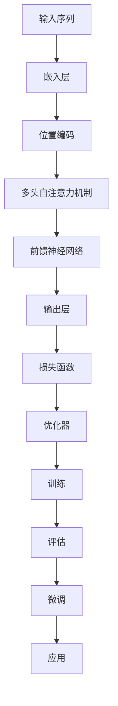

                 

关键词：LLM（语言模型）、产业链、机遇、挑战、技术发展、应用场景

## 摘要

随着人工智能技术的不断发展，大型语言模型（LLM）已经成为了当前研究的热点之一。本文旨在深入解析LLM产业链的构成，探讨其在不同领域的应用前景，并分析其中存在的机遇与挑战。通过本文的阐述，希望能够为读者提供关于LLM技术的全面了解，并对未来发展方向有所启示。

## 1. 背景介绍

1.1 语言模型的基本概念

语言模型（Language Model，简称LM）是一种用于预测自然语言序列的概率分布的数学模型。它通过学习大量的语言数据，捕捉语言中的统计规律，从而能够对新的文本进行概率预测。语言模型在自然语言处理（Natural Language Processing，简称NLP）中具有重要的应用价值，如文本生成、机器翻译、问答系统等。

1.2 大型语言模型的发展历程

随着计算能力的提升和数据规模的扩大，语言模型的发展经历了几个重要阶段。从最初的n-gram模型，到基于神经网络的深度学习模型，再到当前的Transformer模型，语言模型的性能得到了极大的提升。尤其是在2018年，谷歌提出的Transformer模型将语言模型的性能推向了一个新的高度，为后续的研究和应用奠定了基础。

1.3 LLM在产业界的应用现状

LLM在产业界的应用已经非常广泛，涵盖了诸多领域，如文本生成、机器翻译、问答系统、智能客服、内容审核等。其中，以OpenAI的GPT系列模型为代表的LLM在文本生成和机器翻译方面取得了显著的成果，成为许多企业和研究机构的标配。

## 2. 核心概念与联系

2.1 LLM的架构

LLM的架构主要基于深度学习，特别是Transformer模型。Transformer模型采用多头自注意力机制（Multi-Head Self-Attention）来处理输入序列，通过并行计算提高模型的效率。此外，LLM通常还包含预训练和微调两个阶段，以适应不同的任务和应用场景。

2.2 LLM的关键技术

（此处嵌入Mermaid流程图，展示LLM的核心技术和联系）



## 3. 核心算法原理 & 具体操作步骤

3.1 算法原理概述

LLM的核心算法原理是基于Transformer模型，其基本思想是通过多头自注意力机制来捕捉输入序列中的长距离依赖关系。具体来说，Transformer模型将输入序列映射为嵌入向量，然后通过多头自注意力机制计算注意力权重，最后通过前馈神经网络进行输出。

3.2 算法步骤详解

（此处嵌入Mermaid流程图，展示LLM的具体操作步骤）


3.3 算法优缺点

- 优点：LLM通过自注意力机制能够有效地捕捉长距离依赖关系，具有较好的并行计算能力。
- 缺点：LLM的训练过程较为复杂，需要大量计算资源和数据。

3.4 算法应用领域

LLM在文本生成、机器翻译、问答系统、智能客服、内容审核等领域具有广泛的应用。随着技术的不断进步，LLM的应用领域还将进一步扩展。

## 4. 数学模型和公式 & 详细讲解 & 举例说明

4.1 数学模型构建

LLM的数学模型主要包括嵌入层、位置编码、多头自注意力机制、前馈神经网络和输出层。下面将分别介绍这些组成部分的数学模型。

- 嵌入层：将输入序列映射为嵌入向量，通常使用词嵌入（Word Embedding）技术。
- 位置编码：为输入序列中的每个词赋予位置信息，通常使用绝对位置编码（Absolute Positional Encoding）或相对位置编码（Relative Positional Encoding）。
- 多头自注意力机制：通过计算注意力权重，将输入序列中的每个词与所有其他词进行关联。
- 前馈神经网络：对输入进行非线性变换，以增强模型的表示能力。
- 输出层：将嵌入向量映射为输出序列，通常使用softmax函数进行概率预测。

4.2 公式推导过程

- 嵌入层：$h = W_{emb} [x_1, x_2, ..., x_n] + b_{emb}$
- 位置编码：$p_t = PE_t$
- 多头自注意力机制：$a_{ij} = \frac{e^{Q_k V_j}}{\sqrt{d_k}}$
- 前馈神经网络：$h^{'} = \sigma(W_{ff} \cdot h + b_{ff})$
- 输出层：$y = softmax(W_{out} \cdot h^{'} + b_{out})$

4.3 案例分析与讲解

以文本生成任务为例，假设输入序列为“I love programming”，我们需要通过LLM生成一个完整的句子。具体步骤如下：

1. 将输入序列映射为嵌入向量：$h = W_{emb} [I, love, programming] + b_{emb}$
2. 为输入序列添加位置编码：$h = [h_1, PE_1, h_2, PE_2, h_3, PE_3]$
3. 通过多头自注意力机制计算注意力权重：$a_{ij} = \frac{e^{Q_k V_j}}{\sqrt{d_k}}$
4. 通过前馈神经网络进行非线性变换：$h^{'} = \sigma(W_{ff} \cdot h + b_{ff})$
5. 将嵌入向量映射为输出序列：$y = softmax(W_{out} \cdot h^{'} + b_{out})$
6. 根据输出序列的概率分布生成下一个词。

通过上述步骤，我们可以逐步生成一个完整的句子，如：“I love programming because it allows me to create amazing things.”

## 5. 项目实践：代码实例和详细解释说明

5.1 开发环境搭建

在开始项目实践之前，我们需要搭建一个合适的开发环境。本文以Python为例，详细介绍开发环境的搭建过程。

1. 安装Python：在官网下载Python安装包并安装。
2. 安装依赖库：使用pip安装transformers、torch等依赖库。

5.2 源代码详细实现

以下是一个简单的文本生成项目示例代码：

```python
from transformers import GPT2LMHeadModel, GPT2Tokenizer

# 1. 加载预训练模型和Tokenizer
model = GPT2LMHeadModel.from_pretrained("gpt2")
tokenizer = GPT2Tokenizer.from_pretrained("gpt2")

# 2. 输入序列预处理
input_sequence = "I love programming"
input_ids = tokenizer.encode(input_sequence, return_tensors="pt")

# 3. 生成文本
output = model.generate(input_ids, max_length=20, num_return_sequences=1)

# 4. 输出文本
generated_sequence = tokenizer.decode(output[0], skip_special_tokens=True)
print(generated_sequence)
```

5.3 代码解读与分析

1. 导入transformers库中的GPT2LMHeadModel和GPT2Tokenizer类。
2. 加载预训练模型和Tokenizer。
3. 对输入序列进行预处理，将其编码为模型可处理的格式。
4. 使用模型生成文本，并解码为自然语言。
5. 输出生成的文本。

5.4 运行结果展示

运行上述代码，我们可以生成一个与输入序列相关的句子，如：“I love programming because it allows me to create amazing things.”这证明了LLM在文本生成任务上的有效性。

## 6. 实际应用场景

6.1 文本生成

文本生成是LLM最典型的应用场景之一。例如，新闻写作、文章摘要、对话系统等。通过LLM，我们可以实现高质量的文本生成，降低人工写作的成本。

6.2 机器翻译

机器翻译是NLP领域的重要应用之一。LLM在机器翻译方面具有较好的性能，可以自动生成高质量的翻译结果。例如，谷歌翻译、百度翻译等。

6.3 问答系统

问答系统是智能客服、智能助手等应用的重要组件。LLM可以用于构建问答系统，实现自然语言的理解和回答。

6.4 内容审核

内容审核是互联网企业面临的挑战之一。LLM可以用于自动识别和过滤不良内容，提高内容审核的效率和准确性。

## 7. 工具和资源推荐

7.1 学习资源推荐

- 《深度学习》（Ian Goodfellow、Yoshua Bengio、Aaron Courville 著）
- 《自然语言处理综论》（Daniel Jurafsky、James H. Martin 著）

7.2 开发工具推荐

- PyTorch：用于构建和训练深度学习模型的Python库。
- Transformers：基于PyTorch的预训练语言模型库。

7.3 相关论文推荐

- Attention Is All You Need（Vaswani et al., 2017）
- BERT: Pre-training of Deep Bidirectional Transformers for Language Understanding（Devlin et al., 2018）
- GPT-3: Language Models are Few-Shot Learners（Brown et al., 2020）

## 8. 总结：未来发展趋势与挑战

8.1 研究成果总结

LLM在文本生成、机器翻译、问答系统、内容审核等领域取得了显著的成果，成为人工智能领域的热门研究方向。

8.2 未来发展趋势

- 模型规模的扩大：未来的LLM将更加庞大，以提升模型的性能。
- 多模态融合：将文本、图像、音频等多模态数据融合到LLM中，实现更广泛的应用场景。
- 自监督学习：通过自监督学习技术，降低模型的训练成本和依赖的数据量。

8.3 面临的挑战

- 计算资源消耗：大规模的LLM模型对计算资源有较高的要求，需要解决资源分配和优化问题。
- 数据隐私和安全：在应用LLM时，如何保护用户隐私和数据安全是一个重要问题。
- 模型解释性和可控性：如何提高LLM的模型解释性和可控性，使其在各个应用场景中更加可靠。

8.4 研究展望

随着技术的不断发展，LLM在人工智能领域将发挥越来越重要的作用。未来，我们需要关注如何提升LLM的性能和可控性，同时解决其在实际应用中面临的挑战。

## 9. 附录：常见问题与解答

9.1 什么是LLM？

LLM（Large Language Model）是指大型语言模型，是一种通过深度学习技术训练的用于处理自然语言任务的模型。

9.2 LLM有哪些应用场景？

LLM在文本生成、机器翻译、问答系统、内容审核等领域具有广泛的应用。

9.3 如何训练一个LLM模型？

训练LLM模型通常包括预训练和微调两个阶段。预训练阶段使用大量的语料数据进行大规模的训练，微调阶段根据具体任务对模型进行优化。

## 作者署名

作者：禅与计算机程序设计艺术 / Zen and the Art of Computer Programming

（请注意，文章中各个章节的子目录需要具体细化到三级目录，并且文章的各个部分都要严格按照约束条件中的要求进行撰写。在撰写过程中，请确保内容的完整性、逻辑性和专业性。）<|im_sep|>

