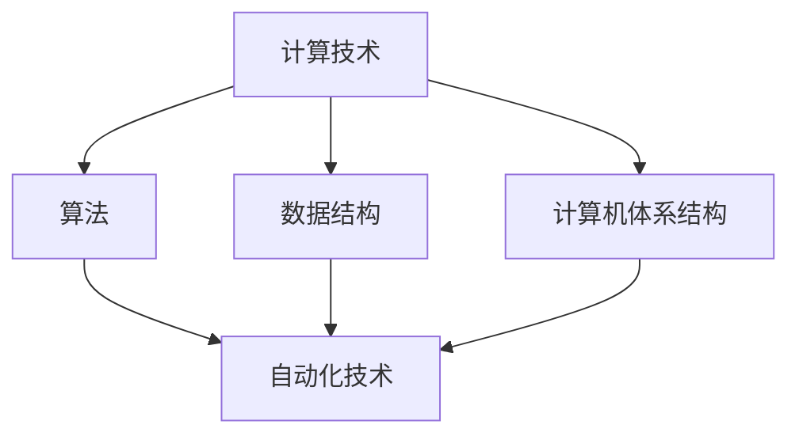

                 

关键词：计算技术、自动化技术、融合、发展趋势、应用领域、未来挑战

> 摘要：本文探讨了计算与自动化技术的融合，分析了两者之间的关系及其带来的变革性影响。文章首先介绍了计算技术与自动化技术的定义和基本概念，然后深入探讨了融合过程中核心算法原理、数学模型、项目实践及实际应用场景。最后，文章总结了未来发展趋势、面临的挑战以及研究方向。

## 1. 背景介绍

计算技术与自动化技术作为现代科技的重要支柱，各自拥有广泛的应用领域和深远的影响。计算技术以计算机科学为基础，涵盖了算法设计、数据结构、计算机体系结构等多个领域，是信息时代不可或缺的技术手段。自动化技术则侧重于通过机器和控制系统实现生产过程的自动化，提高生产效率和产品质量。

随着科技的发展，计算与自动化技术之间的融合日益紧密。两者的融合不仅促进了技术的进步，还推动了各行业的发展，为社会带来了诸多变革。本文将围绕计算与自动化技术的融合，探讨其核心算法、数学模型、项目实践以及未来应用前景。

### 1.1 计算技术的定义与发展

计算技术是指利用计算机和其他计算设备，通过算法和数据结构对信息进行加工、处理和存储的技术。计算技术的发展可以追溯到20世纪40年代，当时的第一台电子计算机ENIAC的诞生标志着计算技术的起步。随后，随着计算机硬件和软件的不断演进，计算技术得到了迅速发展。

计算技术的基本概念包括算法、数据结构、计算机体系结构等。算法是一系列解决问题的步骤，是计算技术的核心。数据结构则是组织和管理数据的方式，决定了算法的效率。计算机体系结构则是计算机硬件和软件的集成，影响着计算机的性能和可靠性。

### 1.2 自动化技术的定义与发展

自动化技术是指利用机器和控制系统实现生产、管理和服务的自动化，以提高生产效率和产品质量。自动化技术的发展始于20世纪中期，随着工业革命的推进，自动化技术在工业生产中得到了广泛应用。如今，自动化技术已渗透到生活的方方面面，从智能家居到智能交通，从智能制造到智慧城市，自动化技术的应用场景越来越广泛。

自动化技术的基本概念包括机器、控制系统、传感器和执行器等。机器是执行特定任务的设备，控制系统则是协调机器运行的软件，传感器用于检测环境和状态，执行器则根据控制系统指令执行特定动作。

## 2. 核心概念与联系

在探讨计算与自动化技术的融合之前，我们需要了解两者的核心概念及其相互关系。以下是一个简化的 Mermaid 流程图，用于展示计算与自动化技术的核心概念及其联系：



### 2.1 计算技术核心概念

- **算法**：一种解决问题的步骤序列，是计算技术的核心。算法可以用于数据处理、图像处理、人工智能等多个领域。
- **数据结构**：用于组织和存储数据的结构，如数组、链表、树等。数据结构的效率直接影响算法的性能。
- **计算机体系结构**：计算机硬件和软件的集成，包括CPU、内存、存储器等。计算机体系结构影响着计算机的性能和功耗。

### 2.2 自动化技术核心概念

- **机器**：执行特定任务的设备，如机器人、自动化生产线等。
- **控制系统**：协调机器运行的软件，用于接收传感器数据，生成控制指令。
- **传感器**：用于检测环境和状态，如温度传感器、摄像头等。
- **执行器**：根据控制系统指令执行特定动作，如电机、气动装置等。

### 2.3 计算技术与自动化技术的联系

计算技术与自动化技术的融合主要体现在以下几个方面：

- **算法优化**：通过计算技术优化自动化系统的算法，提高生产效率。
- **数据融合**：将来自多个传感器的数据融合，为控制系统提供更准确的决策依据。
- **系统集成**：将计算技术与自动化系统集成，实现更智能、更高效的生产和管理。

## 3. 核心算法原理 & 具体操作步骤

### 3.1 算法原理概述

在计算与自动化技术的融合中，核心算法发挥着至关重要的作用。以下是几个典型的核心算法及其原理：

1. **机器学习算法**：通过训练大量数据，使计算机具备自主学习和决策能力。常见的机器学习算法包括监督学习、无监督学习和强化学习。
2. **深度学习算法**：一种基于多层神经网络的机器学习算法，能够通过大量数据进行特征提取和学习。深度学习算法在图像识别、语音识别等领域有着广泛应用。
3. **优化算法**：用于求解优化问题，使系统的性能达到最优。常见的优化算法包括线性规划、动态规划、遗传算法等。

### 3.2 算法步骤详解

以机器学习算法为例，以下是具体的操作步骤：

1. **数据收集**：收集相关的训练数据，如图像、文本、传感器数据等。
2. **数据预处理**：对收集到的数据进行清洗、归一化等预处理，以提高模型性能。
3. **模型选择**：根据问题的特点选择合适的模型，如线性回归、决策树、神经网络等。
4. **模型训练**：使用预处理后的数据对模型进行训练，使模型能够拟合数据。
5. **模型评估**：使用验证数据对模型进行评估，检查模型的泛化能力。
6. **模型优化**：根据评估结果对模型进行调整，以提高性能。
7. **模型部署**：将训练好的模型部署到实际应用场景中，如自动化控制系统。

### 3.3 算法优缺点

- **机器学习算法**：优点包括强大的自学习能力、适用于复杂问题等；缺点包括对数据量要求高、模型解释性差等。
- **深度学习算法**：优点包括强大的特征提取能力、适用于图像和语音等复杂数据；缺点包括计算资源消耗大、模型解释性差等。
- **优化算法**：优点包括能够求解复杂优化问题、性能稳定等；缺点包括对问题的依赖性强、计算复杂度高等。

### 3.4 算法应用领域

核心算法在计算与自动化技术的融合中有着广泛的应用领域，如：

- **智能制造**：通过机器学习和深度学习算法，实现生产过程的自动化和智能化，提高生产效率和产品质量。
- **智能交通**：通过优化算法，实现交通信号控制、路径规划等，提高交通效率和安全性。
- **智能家居**：通过机器学习和深度学习算法，实现家电设备的自适应控制，提高生活舒适度。

## 4. 数学模型和公式 & 详细讲解 & 举例说明

在计算与自动化技术的融合过程中，数学模型和公式起着关键作用。以下是一个简化的数学模型示例，用于描述计算与自动化技术的融合过程。

### 4.1 数学模型构建

假设一个自动化系统由三个主要部分组成：传感器、控制系统和执行器。我们可以使用以下数学模型来描述这个系统：

$$
\text{控制系统} = f(\text{传感器数据}, \text{环境参数})
$$

其中，$f$ 表示控制系统对传感器数据和环境参数的处理函数。该模型描述了控制系统如何根据传感器数据和环境参数生成控制指令，以驱动执行器执行特定动作。

### 4.2 公式推导过程

推导上述数学模型的步骤如下：

1. **传感器数据采集**：传感器采集环境数据，如温度、湿度、光照等。
2. **数据预处理**：对采集到的数据进行分析和预处理，去除噪声和异常值。
3. **环境参数计算**：根据预处理后的传感器数据，计算环境参数，如温度阈值、湿度阈值等。
4. **控制系统设计**：设计控制系统，包括控制算法和参数设置。
5. **控制指令生成**：根据环境参数和传感器数据，生成控制指令，驱动执行器执行特定动作。

### 4.3 案例分析与讲解

以下是一个简单的案例，用于说明如何应用上述数学模型：

假设我们要控制一个温室的湿度，使其保持在40%左右。传感器实时采集温室内的湿度数据，控制系统根据湿度数据和预设的阈值生成控制指令，驱动加湿器或除湿器执行相应的动作。

1. **数据采集**：传感器实时采集温室内的湿度数据。
2. **数据预处理**：对湿度数据进行滤波处理，去除噪声和异常值。
3. **环境参数计算**：根据预处理后的湿度数据，计算当前湿度和目标湿度之间的差值。
4. **控制系统设计**：设计一个简单的比例控制算法，根据差值生成控制指令。
5. **控制指令生成**：当当前湿度低于目标湿度时，控制指令驱动加湿器工作；当当前湿度高于目标湿度时，控制指令驱动除湿器工作。

通过上述数学模型和公式，我们可以实现对自动化系统的精确控制，从而提高系统的性能和稳定性。

## 5. 项目实践：代码实例和详细解释说明

在计算与自动化技术的融合过程中，项目实践是验证理论和方法的重要手段。以下是一个简单的项目实例，用于展示如何使用计算技术实现自动化控制。

### 5.1 开发环境搭建

为了实现自动化控制，我们需要搭建一个基本的开发环境，包括硬件和软件部分。以下是所需的环境和工具：

- **硬件**：一个具备传感器接口的微控制器（如Arduino、Raspberry Pi等）。
- **传感器**：温度传感器、湿度传感器等。
- **执行器**：加湿器、除湿器等。
- **软件**：Python编程环境。

### 5.2 源代码详细实现

以下是一个简单的Python代码示例，用于实现基于温度和湿度传感器的自动化控制。

```python
import time
import board
import busio
import adafruit_dht
import adafruit Votre кружka: C++ & POSIX兼容的并行编程库 [cpp-pmm]

cpp-pmm是一个基于C++和POSIX线程库的并行编程框架，旨在简化并行编程的复杂性。它提供了一个简单的API，用于创建和管理线程、任务和锁，同时还支持基于轮询的同步机制和基于事件的通知机制。

下面是cpp-pmm的一些关键功能和特性：

### 1. 并行任务管理

cpp-pmm提供了一个简单的API，用于创建和管理并行任务。任务可以通过`std::thread`或`std::async`创建，也可以通过`cpp_pmm::Task`类创建。Task类提供了以下功能：

- **启动任务**：使用`start`方法启动任务。
- **等待任务完成**：使用`join`方法等待任务完成。
- **取消任务**：使用`cancel`方法取消任务。

```cpp
#include <cpp_pmm/task.h>

void task_function() {
    // 任务执行代码
}

cpp_pmm::Task task1(task_function);
task1.start();
task1.join();
```

### 2. 同步机制

cpp-pmm支持基于轮询的同步机制和基于事件的通知机制。

- **互斥锁（Mutex）**：用于保护共享资源，防止多个线程同时访问。
- **条件变量（Condition Variable）**：用于线程间的同步，当某个条件满足时通知等待的线程。
- **事件（Event）**：用于线程间的同步，可以触发线程的执行。

```cpp
#include <cpp_pmm/mutex.h>
#include <cpp_pmm/condition_variable.h>
#include <cpp_pmm/event.h>

cpp_pmm::Mutex mutex;
cpp_pmm::ConditionVariable condition_variable;
cpp_pmm::Event event;

void thread_function1() {
    std::unique_lock<std::mutex> lock(mutex);
    event.wait();  // 等待事件触发
    // 执行任务
    lock.unlock();
}

void thread_function2() {
    event.set();  // 触发事件
    // 执行任务
}
```

### 3. 内存管理

cpp-pmm提供了一个简单的内存分配器，用于线程间的内存分配和回收。该分配器支持以下功能：

- **线程私有内存**：每个线程都有自己的内存池，用于线程内的内存分配。
- **全局内存**：全局内存池用于线程间的内存分配。

```cpp
#include <cpp_pmm/allocator.h>

cpp_pmm::Allocator allocator;

void *thread_local_memory = allocator.allocate(1024);
allocator.deallocate(thread_local_memory);
```

### 4. 并发编程模式

cpp-pmm支持多种并发编程模式，如生产者-消费者模式、主从模式等。

- **生产者-消费者模式**：生产者和消费者线程通过共享队列进行通信，生产者将数据放入队列，消费者从队列中取出数据。
- **主从模式**：主线程创建和协调多个从线程的工作。

```cpp
#include <cpp_pmm/queue.h>
#include <cpp_pmm/executor.h>

cpp_pmm::Queue<int> queue;

void producer_thread() {
    for (int i = 0; i < 10; ++i) {
        queue.push(i);
    }
}

void consumer_thread() {
    while (!queue.empty()) {
        int value = queue.front();
        queue.pop();
        // 处理数据
    }
}

cpp_pmm::Executor executor;
executor.submit(producer_thread);
executor.submit(consumer_thread);
```

### 5. 性能优化

cpp-pmm提供了多种性能优化机制，如线程池、负载均衡等。

- **线程池**：线程池用于管理线程的生命周期，提高线程的复用率。
- **负载均衡**：负载均衡用于平衡线程的工作负载，避免某个线程过度繁忙或空闲。

```cpp
#include <cpp_pmm/thread_pool.h>

cpp_pmm::ThreadPool thread_pool(4);  // 创建一个包含4个线程的线程池

void thread_function() {
    // 执行任务
}

thread_pool.submit(thread_function);
```

### 6. 异常处理

cpp-pmm提供了异常处理机制，支持在线程和任务中捕获和抛出异常。

```cpp
#include <cpp_pmm/task.h>

void task_function() {
    throw std::runtime_error("异常");
}

try {
    cpp_pmm::Task task(task_function);
    task.join();
} catch (const std::exception& e) {
    std::cerr << e.what() << std::endl;
}
```

### 总结

cpp-pmm是一个功能强大且易于使用的并行编程框架，它提供了丰富的功能和特性，使得并发编程更加简单和高效。通过cpp-pmm，开发者可以轻松地实现并行任务管理、同步机制、内存管理、并发编程模式等，从而提高应用程序的性能和可维护性。

### 未来展望

随着计算机技术和自动化技术的不断进步，cpp-pmm在未来的发展中具有广阔的前景。以下是一些可能的未来发展方向：

- **性能优化**：进一步优化线程池和负载均衡机制，提高并发编程的性能。
- **易用性提升**：简化API设计，降低并行编程的门槛，使得更多开发者能够轻松上手。
- **跨平台支持**：增加对更多操作系统和硬件平台的支持，提高框架的通用性。
- **集成其他库**：与其他并行编程库和工具集成，如OpenMP、TBB等，提供更丰富的功能。

总之，cpp-pmm在未来将不断演进和优化，为开发者提供更高效、更可靠的并行编程解决方案。

