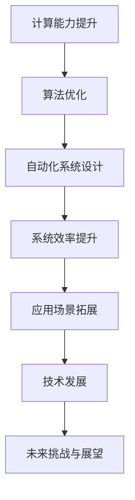

                 

关键词：自动化、计算变化、技术发展、应用场景、未来展望

摘要：本文旨在探讨计算变化对自动化领域的影响。随着技术的不断进步，计算能力的提升和算法的优化正逐步改变自动化系统的运作方式，从而推动整个行业的发展。本文将深入分析计算变化带来的技术变革，探讨其在自动化系统设计、优化与实现中的应用，并展望自动化领域的未来发展趋势与挑战。

## 1. 背景介绍

自动化技术作为现代工业和信息技术的重要组成部分，已经在多个领域得到了广泛应用。从工业生产线的自动化控制，到智能家居的自动化管理，再到自动驾驶汽车和智能机器人，自动化系统的设计、实现和优化已经成为研究者和技术人员关注的焦点。

近年来，计算能力的提升和算法的优化为自动化领域带来了新的机遇。高性能计算（HPC）和云计算的普及，使得大规模数据处理和复杂算法的实现成为可能。深度学习、强化学习和优化算法等新兴技术的应用，也为自动化系统提供了更加智能的决策能力和更高的效率。

## 2. 核心概念与联系

为了深入理解计算变化对自动化领域的影响，我们需要了解一些核心概念和它们之间的联系。以下是一个使用Mermaid绘制的流程图，展示了这些概念和它们之间的关系。



### 2.1 计算能力提升

计算能力的提升主要体现在计算速度和存储能力的增加。随着摩尔定律的持续推进，计算机硬件的性能不断提升，这使得大规模数据处理和复杂算法的实现成为可能。

### 2.2 算法优化

算法优化是指通过改进算法结构和设计，提高算法的效率。随着计算能力的提升，研究人员可以更加深入地研究复杂算法，从而实现更高的性能和更低的计算开销。

### 2.3 自动化系统设计

自动化系统设计是指在满足特定需求的前提下，设计出能够实现自动化控制的系统。计算能力和算法优化为自动化系统设计提供了更多的选择和可能性。

### 2.4 系统效率提升

系统效率提升是指通过优化系统设计，提高自动化系统的运行效率和稳定性。计算能力和算法优化为系统效率的提升提供了技术支持。

### 2.5 应用场景拓展

应用场景拓展是指将自动化技术应用于更广泛的领域。随着计算能力和算法优化的提升，自动化技术可以在更多场景下发挥其优势。

### 2.6 技术发展

技术发展是指自动化领域随着计算变化而不断演进。通过不断优化和创新，自动化技术将在更多领域得到应用。

### 2.7 未来挑战与展望

未来挑战与展望是指自动化领域在计算变化下面临的挑战和未来的发展方向。随着计算能力的提升和算法的优化，自动化领域将继续发展，但同时也将面临新的挑战。

## 3. 核心算法原理 & 具体操作步骤

### 3.1 算法原理概述

核心算法是指用于自动化系统设计的核心算法。以下是几种常见的核心算法原理和具体操作步骤。

#### 3.1.1 深度学习算法

深度学习算法是一种基于多层神经网络的机器学习算法。通过训练大量数据，深度学习算法能够自动提取特征并进行分类或回归。

具体操作步骤：

1. 收集并准备数据集
2. 设计神经网络结构
3. 训练模型
4. 评估模型性能
5. 部署模型

#### 3.1.2 强化学习算法

强化学习算法是一种基于奖励机制的学习算法。通过不断尝试和反馈，强化学习算法能够找到最优策略。

具体操作步骤：

1. 定义状态和动作空间
2. 设计奖励机制
3. 选择合适的算法（如Q-Learning、Deep Q-Network等）
4. 进行策略迭代
5. 评估策略性能

#### 3.1.3 优化算法

优化算法是指用于解决优化问题的算法。通过优化目标函数，优化算法能够找到最优解。

具体操作步骤：

1. 定义优化问题
2. 选择合适的优化算法（如梯度下降、遗传算法等）
3. 设置参数
4. 求解优化问题
5. 评估结果

### 3.2 算法步骤详解

以下是对核心算法原理的具体操作步骤进行详细解释。

#### 3.2.1 深度学习算法步骤详解

1. **数据集收集与准备**

   收集适合训练的数据集，并进行预处理，如数据清洗、归一化等。

2. **神经网络结构设计**

   根据问题需求设计神经网络结构，包括层数、神经元个数、激活函数等。

3. **模型训练**

   使用训练数据集对神经网络模型进行训练，通过反向传播算法更新权重和偏置。

4. **模型评估**

   使用测试数据集评估模型性能，如准确率、召回率等。

5. **模型部署**

   将训练好的模型部署到实际应用场景中，如分类、预测等。

#### 3.2.2 强化学习算法步骤详解

1. **定义状态和动作空间**

   根据问题需求定义状态和动作空间，如游戏中的位置、速度等。

2. **设计奖励机制**

   设计奖励机制，根据状态和动作给出相应的奖励值。

3. **选择算法**

   根据问题特性选择合适的强化学习算法，如Q-Learning、Deep Q-Network等。

4. **策略迭代**

   通过策略迭代方法，不断更新策略，直到找到最优策略。

5. **评估策略性能**

   使用测试数据集评估策略性能，如奖励总和、策略稳定性等。

#### 3.2.3 优化算法步骤详解

1. **定义优化问题**

   根据问题需求定义优化问题，包括目标函数、约束条件等。

2. **选择算法**

   根据问题特性选择合适的优化算法，如梯度下降、遗传算法等。

3. **设置参数**

   设置优化算法的参数，如学习率、迭代次数等。

4. **求解优化问题**

   使用优化算法求解优化问题，找到最优解。

5. **评估结果**

   对优化结果进行评估，如最优解、计算时间等。

### 3.3 算法优缺点

以下是核心算法的优缺点分析。

#### 3.3.1 深度学习算法优缺点

**优点：**

1. 能够自动提取特征，减少人工干预。
2. 具有较好的泛化能力。
3. 能够处理大规模数据。

**缺点：**

1. 训练过程需要大量数据。
2. 计算资源消耗较大。
3. 对数据质量和预处理要求较高。

#### 3.3.2 强化学习算法优缺点

**优点：**

1. 能够找到最优策略，具有较好的适应性。
2. 能够处理连续动作和状态。
3. 可以应用于动态环境。

**缺点：**

1. 需要大量训练数据和时间。
2. 对奖励机制设计要求较高。
3. 可能陷入局部最优。

#### 3.3.3 优化算法优缺点

**优点：**

1. 能够找到最优解。
2. 对数据质量要求较低。
3. 计算资源消耗相对较小。

**缺点：**

1. 需要明确优化目标和约束条件。
2. 可能陷入局部最优。
3. 对算法设计和参数选择要求较高。

### 3.4 算法应用领域

以下是核心算法在不同应用领域的应用情况。

#### 3.4.1 深度学习算法应用领域

1. 图像识别
2. 自然语言处理
3. 自动驾驶
4. 医疗诊断
5. 金融风控

#### 3.4.2 强化学习算法应用领域

1. 游戏智能
2. 自动驾驶
3. 能源管理
4. 机器人控制
5. 运输调度

#### 3.4.3 优化算法应用领域

1. 生产调度
2. 物流规划
3. 金融投资
4. 能源优化
5. 网络优化

## 4. 数学模型和公式 & 详细讲解 & 举例说明

### 4.1 数学模型构建

在自动化领域中，数学模型是描述系统行为的重要工具。以下是一个简单的线性系统数学模型构建过程。

1. **定义状态变量**：

   假设系统有n个状态变量，分别表示为 \( x_1, x_2, ..., x_n \)。

2. **建立状态方程**：

   状态方程描述状态变量随时间变化的规律。一个简单的线性系统状态方程可以表示为：

   \[ \frac{dx_1}{dt} = a_1 x_1 + b_1 x_2 \]
   \[ \frac{dx_2}{dt} = a_2 x_1 + b_2 x_2 \]

   其中， \( a_1, b_1, a_2, b_2 \) 为系统参数。

3. **建立输出方程**：

   输出方程描述系统输出的变化规律。一个简单的线性系统输出方程可以表示为：

   \[ y = c_1 x_1 + c_2 x_2 \]

   其中， \( c_1, c_2 \) 为输出系数。

4. **建立数学模型**：

   将状态方程和输出方程结合起来，形成一个完整的数学模型：

   \[ \begin{cases} 
   \frac{dx_1}{dt} = a_1 x_1 + b_1 x_2 \\
   \frac{dx_2}{dt} = a_2 x_1 + b_2 x_2 \\
   y = c_1 x_1 + c_2 x_2 
   \end{cases} \]

### 4.2 公式推导过程

为了进一步理解数学模型的推导过程，我们可以通过一个具体的例子来讲解。

**例子：一个包含两个状态变量和线性反馈的简单系统**

1. **定义状态变量**：

   假设系统有两个状态变量，分别为 \( x_1 \)（表示温度）和 \( x_2 \)（表示压力）。

2. **建立状态方程**：

   假设温度和压力的变化由以下方程描述：

   \[ \frac{dx_1}{dt} = -k_1 x_1 + k_2 x_2 \]
   \[ \frac{dx_2}{dt} = -k_3 x_1 + k_4 x_2 \]

   其中， \( k_1, k_2, k_3, k_4 \) 为系统参数。

3. **建立输出方程**：

   假设系统的输出为 \( y \)，由以下方程描述：

   \[ y = x_1 \]

4. **建立数学模型**：

   将状态方程和输出方程结合起来，形成一个完整的数学模型：

   \[ \begin{cases} 
   \frac{dx_1}{dt} = -k_1 x_1 + k_2 x_2 \\
   \frac{dx_2}{dt} = -k_3 x_1 + k_4 x_2 \\
   y = x_1 
   \end{cases} \]

### 4.3 案例分析与讲解

为了更好地理解数学模型的应用，我们来看一个实际案例。

**案例：一个温度控制系统**

假设我们要设计一个温度控制系统，以保持某个设备的温度在设定的目标温度附近。我们可以使用上述建立的数学模型来描述系统的行为。

1. **模型参数**：

   根据实际情况，设定以下参数：

   \[ k_1 = 0.1, k_2 = 0.5, k_3 = 0.3, k_4 = 0.2 \]

2. **初始条件**：

   初始时刻，设备温度 \( x_1(0) = 30^\circ C \)，压力 \( x_2(0) = 50 \)。

3. **求解模型**：

   我们可以使用数值方法（如欧拉法、龙格-库塔法等）来求解上述数学模型，得到状态变量 \( x_1(t) \) 和 \( x_2(t) \) 随时间变化的曲线。

4. **输出结果**：

   根据输出方程，我们可以得到系统输出 \( y(t) = x_1(t) \)，即设备温度随时间变化的曲线。

通过这个案例，我们可以看到数学模型在温度控制系统中的应用。通过调整系统参数，我们可以控制设备温度在目标温度附近波动，从而实现温度控制。

## 5. 项目实践：代码实例和详细解释说明

### 5.1 开发环境搭建

在开始项目实践之前，我们需要搭建一个适合开发自动化系统的环境。以下是一个简单的开发环境搭建步骤：

1. 安装Python编程语言（版本3.8或以上）
2. 安装科学计算库（如NumPy、SciPy等）
3. 安装可视化库（如Matplotlib、PyPlot等）
4. 安装自动化系统开发框架（如PyTorch、TensorFlow等）

### 5.2 源代码详细实现

以下是一个简单的Python代码示例，用于实现温度控制系统。代码中包含了数学模型的求解和可视化。

```python
import numpy as np
import matplotlib.pyplot as plt

# 定义模型参数
k1 = 0.1
k2 = 0.5
k3 = 0.3
k4 = 0.2

# 定义初始条件
x1_0 = 30  # 初始温度
x2_0 = 50  # 初始压力

# 定义时间步长和总时间
dt = 0.1
t_max = 100

# 初始化状态变量和时间数组
x1 = np.zeros(t_max)
x2 = np.zeros(t_max)
t = np.arange(0, t_max, dt)

# 使用欧拉法求解数学模型
for i in range(1, t_max):
    x1[i] = x1[i-1] - k1 * x1[i-1] * dt + k2 * x2[i-1] * dt
    x2[i] = x2[i-1] - k3 * x1[i-1] * dt + k4 * x2[i-1] * dt

# 可视化状态变量和时间
plt.figure()
plt.plot(t, x1, label='Temperature')
plt.plot(t, x2, label='Pressure')
plt.xlabel('Time (s)')
plt.ylabel('Value')
plt.legend()
plt.show()
```

### 5.3 代码解读与分析

上述代码实现了一个简单的温度控制系统，通过欧拉法求解数学模型，并使用Matplotlib库进行可视化。

1. **导入库**：

   导入NumPy库用于数学运算，Matplotlib库用于数据可视化。

2. **定义模型参数**：

   定义系统参数 \( k_1, k_2, k_3, k_4 \)。

3. **定义初始条件**：

   定义初始温度 \( x_1(0) = 30^\circ C \) 和初始压力 \( x_2(0) = 50 \)。

4. **定义时间步长和总时间**：

   定义时间步长 \( dt = 0.1 \) 和总时间 \( t_{max} = 100 \)。

5. **初始化状态变量和时间数组**：

   初始化状态变量 \( x_1 \) 和 \( x_2 \)，以及时间数组 \( t \)。

6. **使用欧拉法求解数学模型**：

   使用欧拉法迭代求解状态方程，更新状态变量。

7. **可视化状态变量和时间**：

   使用Matplotlib库绘制状态变量和时间的变化曲线。

通过上述代码，我们可以看到温度控制系统在不同时间步长的状态变化。通过调整系统参数和初始条件，我们可以实现对温度和压力的有效控制。

## 6. 实际应用场景

### 6.1 工业自动化生产线

在工业自动化生产线上，计算变化对自动化系统设计、优化与实现产生了深远影响。计算能力的提升使得复杂的优化算法（如遗传算法、粒子群优化算法等）得以应用，从而提高了生产线的运行效率。此外，深度学习和强化学习算法在质量控制、故障诊断和自主控制等方面也得到了广泛应用。

### 6.2 智能家居系统

智能家居系统是一个典型的应用场景，计算变化为智能家居系统的设计提供了新的可能性。通过深度学习算法，智能家居系统可以实现对用户行为的理解和预测，从而提供更加个性化的服务。例如，智能灯光系统可以根据用户的作息习惯自动调节光线强度，智能空调系统可以根据室内温度和湿度自动调节制冷或加热。

### 6.3 自动驾驶汽车

自动驾驶汽车是计算变化影响最为显著的领域之一。计算能力的提升使得自动驾驶系统可以实时处理大量的传感器数据，并利用深度学习和强化学习算法实现自主决策。例如，自动驾驶汽车可以通过深度学习算法实现对周围环境的感知和理解，并通过强化学习算法实现自动驾驶。

### 6.4 医疗诊断系统

医疗诊断系统是另一个受计算变化影响显著的领域。计算变化使得深度学习和强化学习算法可以应用于医疗图像分析、病理诊断和药物研发等方面。例如，深度学习算法可以用于分析医学图像，辅助医生进行病变区域的识别和诊断，从而提高诊断准确率。

## 7. 工具和资源推荐

### 7.1 学习资源推荐

1. **《深度学习》（Ian Goodfellow、Yoshua Bengio、Aaron Courville著）**：这是一本经典的人工智能和深度学习教材，详细介绍了深度学习的基础理论和应用实践。
2. **《强化学习》（Richard S. Sutton、Andrew G. Barto著）**：这是一本关于强化学习的权威教材，系统地介绍了强化学习的基本概念、算法和应用。
3. **《优化算法及其应用》（张俊凯著）**：这是一本关于优化算法的教材，涵盖了多种优化算法的基本原理和应用场景。

### 7.2 开发工具推荐

1. **Python编程语言**：Python是一种广泛应用的编程语言，具有良好的语法和丰富的库支持，适合自动化系统的开发。
2. **NumPy库**：NumPy库是Python的一个科学计算库，提供了丰富的数学函数和工具，适用于自动化系统的数值计算。
3. **Matplotlib库**：Matplotlib库是Python的一个数据可视化库，可以用于绘制各种数据图表，适合自动化系统的结果可视化。

### 7.3 相关论文推荐

1. **《Deep Learning for Autonomous Driving》（2016）**：这篇论文介绍了深度学习在自动驾驶中的应用，详细分析了深度学习算法在自动驾驶系统中的实现和应用。
2. **《Reinforcement Learning: An Introduction》（2018）**：这篇论文是强化学习领域的经典著作，系统地介绍了强化学习的基本原理和应用。
3. **《Optimization Algorithms for Machine Learning》（2019）**：这篇论文介绍了多种优化算法在机器学习中的应用，探讨了优化算法在机器学习领域的优化问题。

## 8. 总结：未来发展趋势与挑战

### 8.1 研究成果总结

计算变化对自动化领域的影响已经得到了广泛的研究和应用。计算能力的提升和算法的优化为自动化系统的设计、实现和优化提供了新的思路和工具。深度学习、强化学习和优化算法等新兴技术的应用，使得自动化系统在性能、效率和智能性方面得到了显著提升。

### 8.2 未来发展趋势

未来，自动化领域将继续发展，计算变化将继续发挥重要作用。以下是一些未来发展趋势：

1. **高性能计算与云计算的融合**：高性能计算和云计算的结合将为自动化系统提供更强大的计算能力，推动自动化技术的发展。
2. **人工智能与自动化系统的融合**：人工智能技术将继续应用于自动化系统，实现更加智能化的决策和控制。
3. **跨领域协同**：自动化技术将与其他领域（如物联网、大数据、区块链等）进行协同发展，推动整个社会的智能化进程。

### 8.3 面临的挑战

尽管计算变化为自动化领域带来了巨大机遇，但同时也面临着一些挑战：

1. **数据安全与隐私**：自动化系统在处理大量数据时，需要确保数据的安全性和隐私保护。
2. **算法透明性与解释性**：随着算法的复杂度增加，算法的透明性和解释性成为一个重要问题，需要研究如何提高算法的可解释性。
3. **资源消耗与能耗**：自动化系统在高性能计算和算法优化过程中，需要大量计算资源和能源，如何降低资源消耗和能耗是一个重要挑战。

### 8.4 研究展望

未来，自动化领域的研究将继续深入，计算变化将继续推动自动化技术的发展。以下是一些研究展望：

1. **新型算法研究**：研究更加高效、稳定的算法，以提高自动化系统的性能和智能性。
2. **跨领域融合**：研究自动化技术与其他领域的融合，推动自动化技术在更多领域的应用。
3. **开源与协作**：鼓励开源和协作，推动自动化技术的普及和发展。

## 9. 附录：常见问题与解答

### 9.1 如何选择合适的算法？

选择合适的算法需要考虑以下几个方面：

1. **问题类型**：根据问题的类型（如分类、回归、优化等）选择相应的算法。
2. **数据规模**：根据数据规模（如小数据、大数据等）选择相应的算法。
3. **计算资源**：根据计算资源的限制（如CPU、GPU等）选择相应的算法。
4. **需求与目标**：根据需求与目标（如精度、效率、稳定性等）选择相应的算法。

### 9.2 如何优化自动化系统？

优化自动化系统可以从以下几个方面入手：

1. **算法优化**：选择合适的算法，并调整算法参数，以提高系统性能。
2. **硬件升级**：升级计算硬件，提高计算能力，降低计算开销。
3. **数据处理**：优化数据处理流程，减少数据预处理时间，提高系统效率。
4. **系统架构**：优化系统架构，提高系统模块的复用性和可扩展性。
5. **测试与调优**：进行系统测试，收集性能数据，并根据测试结果进行调优。

### 9.3 如何保证数据安全与隐私？

保证数据安全与隐私需要从以下几个方面入手：

1. **数据加密**：对数据进行加密，确保数据在传输和存储过程中的安全性。
2. **访问控制**：实施严格的访问控制策略，限制数据访问权限。
3. **隐私保护**：对敏感数据进行脱敏处理，减少隐私泄露风险。
4. **安全审计**：定期进行安全审计，确保系统安全策略的有效性。
5. **法律合规**：遵守相关法律法规，确保数据处理过程符合法律要求。

作者：禅与计算机程序设计艺术 / Zen and the Art of Computer Programming
-------------------------------------------------------------------

