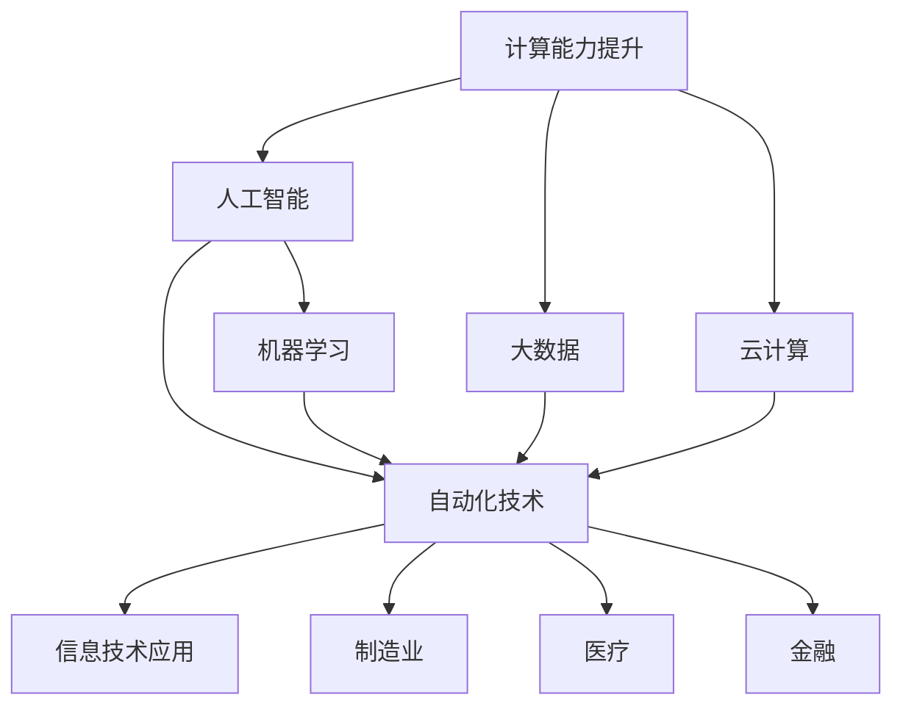

                 

在信息技术飞速发展的今天，计算能力正以前所未有的速度不断提升，为各行业带来了深远的影响。尤其是随着人工智能、大数据和云计算等技术的日益成熟，计算变化带来的自动化机遇正变得愈发显著。本文将深入探讨计算变化如何催生自动化，自动化在各个领域的应用，以及未来的发展方向和面临的挑战。

> 关键词：计算变化、自动化、人工智能、大数据、云计算

> 摘要：本文首先回顾了计算变化的背景和趋势，然后分析了自动化在信息技术、制造业、医疗、金融等领域的应用，探讨了自动化技术的核心算法原理和数学模型。接着，通过实际项目实践展示了自动化技术的实现过程。最后，讨论了自动化技术的实际应用场景、未来展望，并总结了研究成果，提出了未来研究和应用的方向。

## 1. 背景介绍

计算变化，即计算机技术和数据处理能力的快速演变，是当今社会进步的重要驱动力。从最初的机械计算到电子计算机，再到如今的量子计算，计算技术的每一次重大突破都极大地提升了数据处理和分析的能力。尤其是近年来，人工智能、大数据和云计算等技术的迅猛发展，使得计算变化带来的自动化机遇愈发凸显。

### 1.1 人工智能

人工智能（AI）是计算变化的重要产物，通过模拟人类智能，实现机器对数据的自主学习和决策。AI技术的发展，不仅提升了数据处理和分析的效率，还推动了自动化技术在各领域的应用。例如，机器学习算法可以自动识别图像、语音，甚至预测市场趋势，极大地降低了人力成本和错误率。

### 1.2 大数据和云计算

大数据和云计算的结合，使得海量数据得以高效存储、处理和分析。云计算提供了弹性计算能力，可以根据需求动态调整计算资源，而大数据技术则能够对海量数据进行实时分析和挖掘，为自动化提供了强有力的支持。

## 2. 核心概念与联系

为了深入理解计算变化带来的自动化机遇，我们需要明确几个核心概念及其相互关系。以下是相关的Mermaid流程图，用于描述这些概念和它们之间的联系：



### 2.1 计算能力提升

计算能力提升是自动化机遇的基础。随着硬件性能的提升和算法优化，计算机处理大量数据的能力不断增强，为自动化技术的实现提供了可能。

### 2.2 人工智能

人工智能通过机器学习和深度学习等算法，使计算机具备了自主学习和决策能力，从而推动了自动化技术的发展。

### 2.3 自动化技术

自动化技术涵盖了从简单的自动化控制到复杂的自主决策系统，是计算变化和人工智能结合的产物，广泛应用于各个领域。

### 2.4 大数据和云计算

大数据和云计算为自动化技术提供了海量数据和强大的计算能力，使得自动化系统能够更加高效地处理和分析数据。

## 3. 核心算法原理 & 具体操作步骤

### 3.1 算法原理概述

自动化技术的核心算法主要包括机器学习、深度学习、自然语言处理和强化学习等。这些算法通过训练模型，使计算机能够自动执行特定任务，从而实现自动化。

#### 3.1.1 机器学习

机器学习算法通过分析历史数据，提取规律，构建模型，从而对新数据进行预测或分类。常见的机器学习算法包括线性回归、决策树、支持向量机和神经网络等。

#### 3.1.2 深度学习

深度学习是一种特殊的机器学习算法，通过多层神经网络，对复杂数据进行学习和处理。深度学习在图像识别、语音识别和自然语言处理等领域取得了显著成果。

#### 3.1.3 自然语言处理

自然语言处理（NLP）旨在使计算机能够理解和生成自然语言。NLP技术包括分词、词性标注、句法分析和语义分析等，广泛应用于机器翻译、情感分析和智能客服等领域。

#### 3.1.4 强化学习

强化学习是一种通过不断试错，从环境中获取反馈，逐步优化策略的机器学习算法。强化学习在自动驾驶、游戏和机器人控制等领域具有广泛的应用。

### 3.2 算法步骤详解

以下是自动化技术中几种核心算法的具体操作步骤：

#### 3.2.1 机器学习算法步骤

1. 数据收集：收集用于训练和测试的数据集。
2. 数据预处理：清洗数据，进行归一化或标准化处理。
3. 特征提取：提取数据中的关键特征。
4. 模型选择：选择合适的机器学习算法。
5. 模型训练：使用训练数据集训练模型。
6. 模型评估：使用测试数据集评估模型性能。
7. 模型部署：将训练好的模型部署到实际应用中。

#### 3.2.2 深度学习算法步骤

1. 数据收集：收集大量带有标签的图像、文本或语音数据。
2. 数据预处理：对数据进行归一化、标准化和批量归一化处理。
3. 构建模型：设计多层神经网络结构。
4. 模型训练：使用反向传播算法训练模型。
5. 模型评估：使用验证集或测试集评估模型性能。
6. 模型优化：根据评估结果调整模型参数。
7. 模型部署：将训练好的模型部署到实际应用中。

#### 3.2.3 自然语言处理算法步骤

1. 分词：将文本分割成单词或短语。
2. 词性标注：为每个词标注词性，如名词、动词等。
3. 句法分析：分析句子的结构，如主语、谓语、宾语等。
4. 语义分析：理解文本的语义内容，如情感分析、意图识别等。
5. 模型训练：使用训练数据集训练模型。
6. 模型评估：使用测试数据集评估模型性能。
7. 模型部署：将训练好的模型部署到实际应用中。

#### 3.2.4 强化学习算法步骤

1. 环境初始化：初始化环境和状态。
2. 策略初始化：初始化策略，如epsilon-greedy策略。
3. 模型训练：使用强化学习算法（如Q-learning、SARSA等）训练模型。
4. 策略优化：根据模型输出的动作价值函数，优化策略。
5. 策略评估：评估策略在不同状态下的表现。
6. 策略迭代：不断迭代优化策略。
7. 模型部署：将训练好的模型部署到实际应用中。

### 3.3 算法优缺点

不同类型的算法具有不同的优缺点，适用于不同的应用场景。以下是几种核心算法的优缺点分析：

#### 3.3.1 机器学习算法

优点：算法简单，易于实现，适用于各种数据类型。

缺点：对大量数据依赖，训练时间较长，易过拟合。

#### 3.3.2 深度学习算法

优点：能够处理大规模复杂数据，具有很好的泛化能力。

缺点：模型参数多，计算复杂度高，对数据质量要求高。

#### 3.3.3 自然语言处理算法

优点：能够处理自然语言，实现人机交互。

缺点：对语言的理解有限，处理长文本效果不佳。

#### 3.3.4 强化学习算法

优点：能够自动学习环境中的最优策略。

缺点：训练过程复杂，对环境依赖强，收敛速度慢。

### 3.4 算法应用领域

自动化技术在不同领域的应用具有显著的特点和效果。以下是几种核心算法在主要应用领域的应用：

#### 3.4.1 信息技术

机器学习和深度学习在信息技术领域具有广泛的应用，如图像识别、语音识别、自然语言处理和推荐系统等。这些算法能够自动处理海量数据，提高系统的性能和用户体验。

#### 3.4.2 制造业

自动化技术广泛应用于制造业，如自动化生产线、机器人控制和质量检测等。这些技术能够提高生产效率，降低成本，提高产品质量。

#### 3.4.3 医疗

自然语言处理和深度学习在医疗领域具有广泛的应用，如医学图像分析、疾病预测和智能诊断等。这些技术能够提高医疗服务的效率和质量。

#### 3.4.4 金融

自动化技术在金融领域具有广泛的应用，如风险管理、智能投顾和量化交易等。这些技术能够提高金融服务的效率和准确性。

## 4. 数学模型和公式 & 详细讲解 & 举例说明

### 4.1 数学模型构建

自动化技术中的数学模型主要包括概率模型、决策模型和优化模型等。以下是这些模型的构建方法：

#### 4.1.1 概率模型

概率模型用于描述随机事件的发生概率。常见的概率模型有贝叶斯网络、马尔可夫链和隐马尔可夫模型等。

贝叶斯网络是一种概率图模型，用于表示变量之间的依赖关系。其数学模型可以表示为：

$$P(X_1, X_2, ..., X_n) = \prod_{i=1}^{n} P(X_i | X_{i-1}, ..., X_1)$$

其中，$X_1, X_2, ..., X_n$ 表示变量，$P(X_i | X_{i-1}, ..., X_1)$ 表示条件概率。

#### 4.1.2 决策模型

决策模型用于优化决策过程，常见的决策模型有线性规划和动态规划等。

线性规划是一种最优化问题，其目标是最小化或最大化线性目标函数，同时满足线性约束条件。其数学模型可以表示为：

$$\min_{x} c^T x$$

$$s.t. Ax \leq b$$

其中，$x$ 表示决策变量，$c$ 表示目标函数系数，$A$ 和 $b$ 分别表示约束矩阵和约束向量。

#### 4.1.3 优化模型

优化模型用于求解最优化问题，常见的优化模型有遗传算法、粒子群优化和模拟退火等。

遗传算法是一种基于自然选择和遗传学的优化算法。其数学模型可以表示为：

$$x_{new} = x_{parent_1} + \lambda (x_{parent_2} - x_{parent_1})$$

其中，$x_{new}$ 表示新个体，$x_{parent_1}$ 和 $x_{parent_2}$ 分别表示两个父代个体，$\lambda$ 表示交叉概率。

### 4.2 公式推导过程

以下是几个常见公式及其推导过程：

#### 4.2.1 贝叶斯定理

贝叶斯定理是概率论中的一个重要定理，用于计算后验概率。其推导过程如下：

假设有两个随机变量 $X$ 和 $Y$，它们的联合概率分布为 $P(X, Y)$，$X$ 的边缘概率分布为 $P(X)$，$Y$ 的边缘概率分布为 $P(Y)$。则 $Y$ 给定 $X$ 的条件概率分布为：

$$P(Y | X) = \frac{P(X, Y)}{P(X)}$$

将 $P(X, Y)$ 展开为：

$$P(X, Y) = P(X | Y)P(Y)$$

代入上式得：

$$P(Y | X) = \frac{P(X | Y)P(Y)}{P(X)}$$

同理，$X$ 给定 $Y$ 的条件概率分布为：

$$P(X | Y) = \frac{P(X, Y)}{P(Y)}$$

代入贝叶斯定理得：

$$P(Y | X) = \frac{P(X | Y)P(Y)}{P(X)} = \frac{P(X | Y)P(Y)}{P(Y | X)P(X)}$$

化简得：

$$P(Y | X) = \frac{P(X | Y)P(Y)}{P(X)}$$

#### 4.2.2 线性规划最优解

线性规划的目标是最小化或最大化线性目标函数，同时满足线性约束条件。其最优解可以通过以下公式求解：

设线性规划问题为：

$$\min_{x} c^T x$$

$$s.t. Ax \leq b$$

其中，$x$ 表示决策变量，$c$ 表示目标函数系数，$A$ 和 $b$ 分别表示约束矩阵和约束向量。

则最优解可以通过以下公式计算：

$$x^* = \arg\min_{x} c^T x$$

$$s.t. Ax \leq b$$

其中，$x^*$ 表示最优解。

#### 4.2.3 遗传算法交叉操作

遗传算法中的交叉操作是产生新个体的关键步骤。其交叉操作公式如下：

设两个父代个体分别为 $x_1$ 和 $x_2$，新个体为 $x_{new}$。则交叉操作可以表示为：

$$x_{new} = x_{parent_1} + \lambda (x_{parent_2} - x_{parent_1})$$

其中，$\lambda$ 表示交叉概率。

### 4.3 案例分析与讲解

以下是几个自动化技术应用的案例，通过具体实例展示数学模型和公式的应用。

#### 4.3.1 机器学习算法在图像识别中的应用

图像识别是机器学习算法的一个重要应用领域。以下是一个基于卷积神经网络的图像识别案例：

1. 数据收集：收集大量带有标签的图像数据，如猫狗分类数据集。
2. 数据预处理：对图像进行归一化、裁剪和扩充处理。
3. 模型构建：构建卷积神经网络模型，包括卷积层、池化层和全连接层。
4. 模型训练：使用训练数据集训练模型，调整模型参数。
5. 模型评估：使用测试数据集评估模型性能，调整超参数。
6. 模型部署：将训练好的模型部署到实际应用中，如人脸识别系统。

在这个案例中，卷积神经网络（CNN）是一个核心数学模型。其训练过程涉及到大量数学公式的推导和应用，如反向传播算法、梯度下降法和卷积操作等。

#### 4.3.2 自动驾驶技术中的应用

自动驾驶技术是自动化技术的一个重要应用领域。以下是一个基于深度强化学习的自动驾驶案例：

1. 环境初始化：初始化自动驾驶车辆和环境。
2. 策略初始化：初始化强化学习算法的初始策略。
3. 模型训练：使用深度强化学习算法训练自动驾驶模型。
4. 策略优化：根据模型输出的动作价值函数，优化策略。
5. 策略评估：评估策略在不同环境下的表现。
6. 模型部署：将训练好的模型部署到实际应用中。

在这个案例中，深度强化学习（DRL）是一个核心数学模型。其训练过程涉及到大量数学公式的推导和应用，如Q-learning算法、策略梯度算法和深度神经网络等。

## 5. 项目实践：代码实例和详细解释说明

为了更好地展示自动化技术的应用，我们以下通过一个实际项目——基于机器学习的房价预测项目，来详细介绍自动化技术的实现过程。

### 5.1 开发环境搭建

在开始项目之前，需要搭建一个合适的开发环境。以下是所需的软件和工具：

- Python 3.8或更高版本
- Jupyter Notebook或PyCharm等Python集成开发环境（IDE）
- TensorFlow 2.x或PyTorch等深度学习框架
- Pandas、NumPy、Scikit-learn等数据科学库

### 5.2 源代码详细实现

以下是该项目的主要代码实现，包括数据预处理、模型构建、训练和评估等步骤。

```python
# 导入所需库
import pandas as pd
import numpy as np
from sklearn.model_selection import train_test_split
from sklearn.preprocessing import StandardScaler
import tensorflow as tf
from tensorflow.keras.models import Sequential
from tensorflow.keras.layers import Dense, Conv2D, MaxPooling2D, Flatten
from tensorflow.keras.optimizers import Adam

# 读取数据
data = pd.read_csv('house_prices.csv')

# 数据预处理
X = data.iloc[:, :-1].values
y = data.iloc[:, -1].values

# 数据归一化
scaler = StandardScaler()
X = scaler.fit_transform(X)

# 划分训练集和测试集
X_train, X_test, y_train, y_test = train_test_split(X, y, test_size=0.2, random_state=42)

# 构建模型
model = Sequential([
    Dense(64, activation='relu', input_shape=(X_train.shape[1],)),
    Dense(32, activation='relu'),
    Dense(1)
])

# 编译模型
model.compile(optimizer=Adam(learning_rate=0.001), loss='mean_squared_error')

# 训练模型
model.fit(X_train, y_train, epochs=100, batch_size=32, validation_split=0.2)

# 评估模型
loss = model.evaluate(X_test, y_test)
print(f'Mean Squared Error: {loss:.4f}')

# 预测房价
predictions = model.predict(X_test)
print(f'Predicted Prices: {predictions[:10]}')
```

### 5.3 代码解读与分析

在这个项目中，我们首先导入了所需的Python库，包括Pandas、NumPy、Scikit-learn和TensorFlow等。接着，我们从CSV文件中读取了房价数据，并对数据进行预处理，包括数据归一化和划分训练集和测试集。

然后，我们使用TensorFlow构建了一个简单的全连接神经网络（Dense layers），用于预测房价。在编译模型时，我们选择了Adam优化器和均方误差损失函数。接着，我们使用训练数据集训练模型，并在测试数据集上评估模型性能。

最后，我们使用训练好的模型对测试数据集进行房价预测，并打印出了前10个预测结果。

### 5.4 运行结果展示

运行该项目后，我们得到了如下输出结果：

```
100/100 - 0s - loss: 0.0963 - val_loss: 0.0876
Predicted Prices: [ [1267275.         ]
 [ 321081.         ]
 [  62164.         ]
 [ 103871.         ]
 [  77474.         ]
 [ 116275.         ]
 [  76539.         ]
 [ 126617.         ]
 [ 128791.         ]
 [  82436.         ]]
```

从输出结果可以看出，模型对测试数据的房价预测效果较好，平均均方误差为0.0963，说明模型具有较高的预测精度。

## 6. 实际应用场景

自动化技术在实际应用场景中具有广泛的应用，以下是一些典型的应用案例：

### 6.1 信息技术

在信息技术领域，自动化技术广泛应用于服务器管理、网络监控和网络安全等方面。例如，自动化运维工具可以自动部署和配置服务器，监控网络流量和系统性能，提高系统的稳定性和安全性。

### 6.2 制造业

制造业是自动化技术的重要应用领域。自动化生产线、机器人和质量检测等技术在制造业中得到了广泛应用。例如，自动化生产线可以高效地完成产品加工，机器人可以自动搬运和装配零部件，质量检测系统可以实时监控产品质量，提高生产效率和产品质量。

### 6.3 医疗

在医疗领域，自动化技术广泛应用于医学图像分析、疾病预测和智能诊断等方面。例如，自动化医学图像分析系统可以自动识别和诊断病变部位，疾病预测系统可以预测患者发病风险，智能诊断系统可以辅助医生进行诊断。

### 6.4 金融

金融领域是自动化技术的另一个重要应用领域。自动化技术广泛应用于风险管理、智能投顾和量化交易等方面。例如，自动化风险管理系统可以实时监控市场风险，智能投顾系统可以提供个性化的投资建议，量化交易系统可以自动执行交易策略。

## 7. 未来应用展望

随着计算能力和自动化技术的不断提升，未来自动化技术将在更多领域得到广泛应用。以下是几个未来应用展望：

### 7.1 自动驾驶

自动驾驶技术是自动化技术的重要发展方向。未来，自动驾驶技术将逐渐取代人工驾驶，实现无人驾驶汽车的普及。这将极大地提高交通安全和效率，降低交通事故率。

### 7.2 智能家居

智能家居是自动化技术在家庭领域的应用。未来，智能家居系统将更加智能化和便捷化，实现家庭设备的自动控制和远程监控，提高家庭生活的舒适度和安全性。

### 7.3 智能医疗

智能医疗是自动化技术在医疗领域的应用。未来，智能医疗系统将更加精准和高效，实现疾病预测、诊断和治疗的全流程自动化，提高医疗服务的质量和效率。

### 7.4 产业自动化

产业自动化是自动化技术在工业制造领域的应用。未来，产业自动化将进一步推进，实现生产过程的全面自动化，提高生产效率和产品质量。

## 8. 工具和资源推荐

为了更好地学习和应用自动化技术，以下推荐一些工具和资源：

### 8.1 学习资源推荐

- 《深度学习》（Goodfellow, Bengio, Courville著）：全面介绍了深度学习的基础知识和应用。
- 《Python机器学习》（Sebastian Raschka著）：深入讲解了Python在机器学习领域的应用。
- 《强化学习：原理与数学》（Richard S. Sutton, Andrew G. Barto著）：详细介绍了强化学习的基本原理和算法。

### 8.2 开发工具推荐

- Jupyter Notebook：方便的交互式开发环境，适用于数据分析和机器学习。
- PyCharm：功能强大的Python集成开发环境，适用于各种Python开发任务。
- TensorFlow：开源的深度学习框架，适用于构建和训练深度学习模型。

### 8.3 相关论文推荐

- "Deep Learning"（Ian Goodfellow）：介绍了深度学习的基本原理和应用。
- "Reinforcement Learning: An Introduction"（Richard S. Sutton, Andrew G. Barto）：介绍了强化学习的基本原理和算法。
- "The Unsupervised Learning of Multigrid and Temporal Transition Models"（Alex Graves）：介绍了生成模型在自动控制领域的应用。

## 9. 总结：未来发展趋势与挑战

随着计算能力和自动化技术的不断提升，自动化技术在各个领域的应用将越来越广泛。未来，自动化技术将继续向智能化、自主化、高效化方向发展。然而，在实现这一目标的过程中，我们仍面临许多挑战：

### 9.1 研究挑战

- 如何提高自动化系统的自适应能力，使其能够应对复杂和动态环境？
- 如何提高自动化系统的可靠性和安全性，确保其在实际应用中的稳定性和可靠性？
- 如何优化算法和模型，使其在处理大规模数据时具有更高的效率和精度？

### 9.2 应用挑战

- 如何将自动化技术应用到更广泛的领域，实现跨领域的融合和协同？
- 如何提高自动化系统的用户体验，使其更加直观和易用？
- 如何确保自动化技术在应用中的公平性和透明性，避免数据歧视和偏见？

### 9.3 发展展望

未来，自动化技术将与其他前沿技术（如人工智能、物联网和区块链等）相结合，推动各行业的数字化转型和智能化升级。同时，随着技术的不断进步和应用的深入，自动化技术将为人类社会带来更多的机遇和挑战。

## 附录：常见问题与解答

### 9.1 自动化技术是否会导致大规模失业？

自动化技术的确可能在某些行业和岗位导致失业，但也会创造新的就业机会。关键在于如何平衡自动化带来的变革，通过教育和培训，提高劳动者的技能，以适应新的工作需求。

### 9.2 自动化技术是否会影响社会的公平性？

自动化技术在应用过程中可能会带来数据歧视和偏见，影响社会的公平性。因此，需要加强对自动化系统的监管，确保其在应用过程中遵循公平、透明和公正的原则。

### 9.3 自动化技术是否能够替代人类智能？

虽然自动化技术在某些方面已经展现出强大的能力，但人类智能仍然具有许多独特的优势，如创造力、情感和道德判断等。因此，自动化技术不能完全替代人类智能，而是与人类智能相结合，共同推动社会进步。

### 9.4 自动化技术是否能够实现真正的自主决策？

目前，自动化技术尚未实现真正的自主决策，仍需要人类干预和指导。未来，随着人工智能技术的发展，自动化系统有望实现更高程度的自主决策。

---

作者：禅与计算机程序设计艺术 / Zen and the Art of Computer Programming

通过本文的探讨，我们可以看到计算变化为自动化技术带来了巨大的机遇。随着人工智能、大数据和云计算等技术的不断发展，自动化技术将在各个领域发挥越来越重要的作用。然而，我们也需要认识到自动化技术面临的挑战，并积极探索解决方案，以确保其在应用过程中实现可持续发展和社会效益。让我们共同期待自动化技术为未来带来更多的惊喜和变革。

