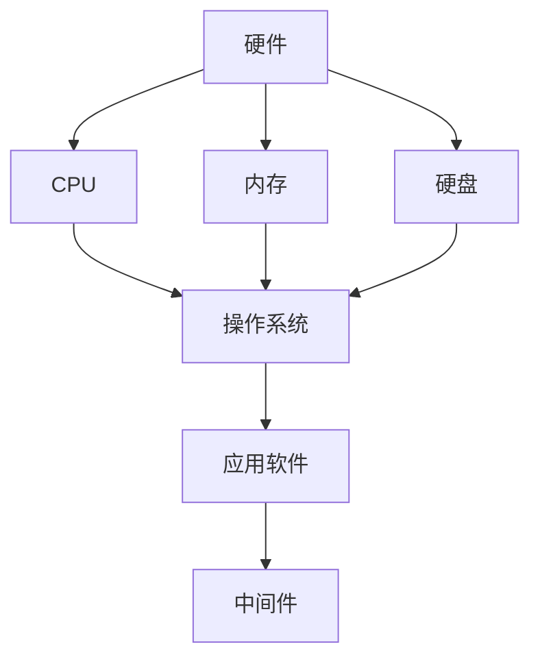
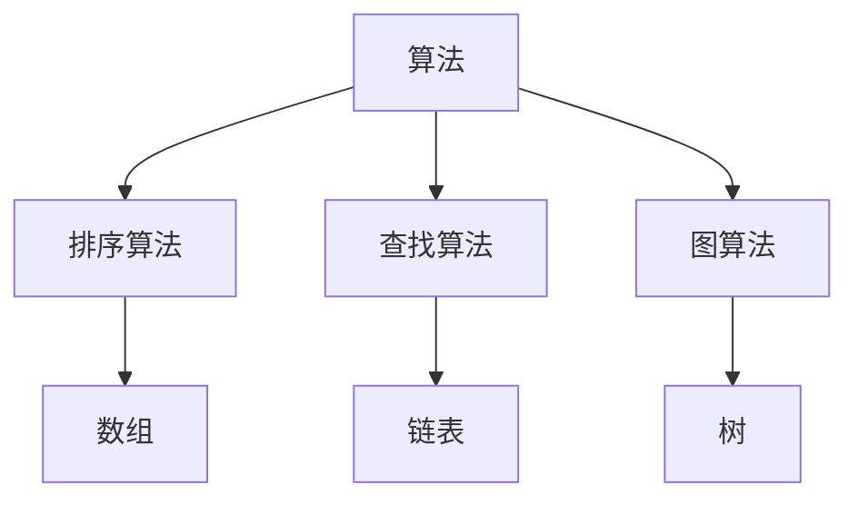
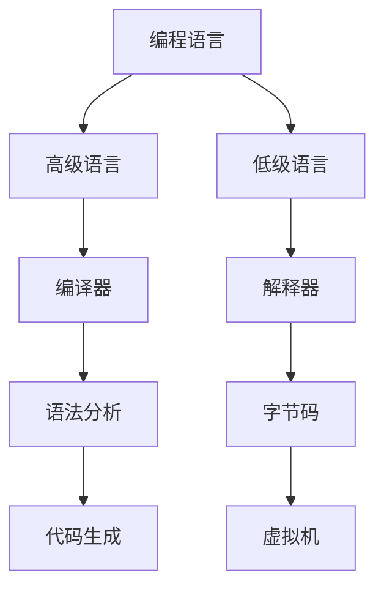
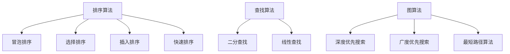

                 

关键词：计算机科学，AI开发，核心知识，算法原理，数学模型，实践应用，工具推荐

摘要：本文旨在为AI开发者提供一份全面的计算机科学基础指南，涵盖核心概念、算法原理、数学模型和实际应用等多个方面。通过深入分析和具体实例，本文帮助开发者更好地理解和应用计算机科学知识，为未来的AI研究和开发打下坚实基础。

## 1. 背景介绍

计算机科学作为一门科学和工程的综合领域，涵盖了计算机硬件、软件、算法、理论等多个方面。随着人工智能的迅猛发展，AI开发者需要掌握更为复杂的计算机科学知识，以便更好地理解和应用AI算法。本文将从以下几个方面介绍计算机科学的基础知识，为AI开发者提供有价值的参考。

## 2. 核心概念与联系

### 2.1 计算机硬件与软件

计算机硬件是计算机系统的基础，包括中央处理器（CPU）、内存、硬盘等。软件则包括操作系统、应用软件和中间件等，它们共同构成了计算机系统的基础架构。以下是一个简化的Mermaid流程图，展示计算机硬件与软件之间的联系：



### 2.2 算法与数据结构

算法是计算机科学的核心，它解决特定问题的步骤和策略。数据结构则是算法的基础，用于存储和组织数据。以下是一个简化的Mermaid流程图，展示算法与数据结构之间的联系：



### 2.3 编程语言与编译原理

编程语言是开发软件的工具，不同编程语言具有不同的特点和适用场景。编译原理则研究编程语言从源代码到可执行程序的转换过程。以下是一个简化的Mermaid流程图，展示编程语言与编译原理之间的联系：



## 3. 核心算法原理 & 具体操作步骤

### 3.1 算法原理概述

算法原理是计算机科学的核心内容，包括排序、查找、图论等多个方面。以下是一个简化的算法原理概述：



### 3.2 算法步骤详解

以下分别对冒泡排序、二分查找和深度优先搜索算法进行具体步骤详解：

#### 冒泡排序算法步骤：

1. 比较相邻的元素。如果第一个比第二个大（升序排序），就交换它们两个。
2. 对每一对相邻元素做同样的工作，从开始第一对到结尾的最后一对。这步做完后，最后的元素会是最大的数。
3. 针对所有的元素重复以上的步骤，除了最后一个。
4. 重复步骤1~3，直到排序完成。

#### 二分查找算法步骤：

1. 设定目标值`x`，初始化左右边界`l`和`r`。
2. 计算中间位置`mid = (l + r) / 2`。
3. 如果`array[mid] == x`，则返回`mid`。
4. 如果`array[mid] > x`，则更新`r = mid - 1`，回到步骤2。
5. 如果`array[mid] < x`，则更新`l = mid + 1`，回到步骤2。
6. 如果没有找到目标值，返回`-1`。

#### 深度优先搜索算法步骤：

1. 初始化访问列表`visited`，并将其所有元素设置为`false`。
2. 对于图中的每个顶点`v`，如果`v`未被访问，则执行以下操作：
   1. 将`v`标记为已访问。
   2. 访问`v`并打印或处理它。
   3. 对于`v`的所有未被访问的邻接点`w`，执行步骤2。

### 3.3 算法优缺点

- **冒泡排序：**
  - 优点：简单易懂，实现简单。
  - 缺点：时间复杂度高（O(n^2)），不适合大数据量排序。

- **二分查找：**
  - 优点：时间复杂度低（O(log n)），适用于大数据量查找。
  - 缺点：需要预先排序，不适合动态变化的数组。

- **深度优先搜索：**
  - 优点：可以用于遍历图，寻找路径，解决连通性问题等。
  - 缺点：可能陷入死循环，时间复杂度较高（O(n)）。

### 3.4 算法应用领域

- **冒泡排序：** 适用于小规模数据的排序，如学生成绩排序。
- **二分查找：** 适用于大规模数据的查找，如搜索引擎。
- **深度优先搜索：** 适用于图遍历和路径查找，如地图导航。

## 4. 数学模型和公式 & 详细讲解 & 举例说明

### 4.1 数学模型构建

计算机科学中的数学模型广泛应用于算法分析、数据结构设计等领域。以下是一个简单的数学模型示例：时间复杂度和空间复杂度。

#### 时间复杂度：

时间复杂度是算法在执行过程中所需计算次数的度量。通常用大O符号表示，如O(n)、O(n^2)等。以下是一个时间复杂度的数学模型：

$$
T(n) = O(n)
$$

其中，$T(n)$表示算法在输入规模为$n$时的计算次数。

#### 空间复杂度：

空间复杂度是算法在执行过程中所需内存空间的度量。同样，通常用大O符号表示，如O(n)、O(n^2)等。以下是一个空间复杂度的数学模型：

$$
S(n) = O(n)
$$

其中，$S(n)$表示算法在输入规模为$n$时所需的内存空间。

### 4.2 公式推导过程

以下分别推导冒泡排序、二分查找和深度优先搜索算法的时间复杂度和空间复杂度。

#### 冒泡排序：

时间复杂度：

$$
T(n) = O(n^2)
$$

推导过程：

在最坏情况下，每次比较都需要交换元素，共有$n-1$次。因此，总计算次数为$(n-1) + (n-2) + \ldots + 1 = \frac{(n-1)n}{2} = O(n^2)$。

空间复杂度：

$$
S(n) = O(1)
$$

推导过程：

冒泡排序在原地排序，不占用额外空间，因此空间复杂度为常数级别。

#### 二分查找：

时间复杂度：

$$
T(n) = O(\log n)
$$

推导过程：

每次查找都将搜索范围缩小一半，因此，查找次数为$\log_2 n$。

空间复杂度：

$$
S(n) = O(1)
$$

推导过程：

二分查找不占用额外空间，因此空间复杂度为常数级别。

#### 深度优先搜索：

时间复杂度：

$$
T(n) = O(n)
$$

推导过程：

在最坏情况下，需要遍历所有节点，因此时间复杂度为$O(n)$。

空间复杂度：

$$
S(n) = O(n)
$$

推导过程：

深度优先搜索需要存储访问路径，因此空间复杂度为$O(n)$。

### 4.3 案例分析与讲解

以下通过一个具体案例来分析和讲解时间复杂度和空间复杂度的应用。

#### 案例一：排序算法

假设有一个包含1000个元素的无序数组，使用冒泡排序算法进行排序。请分析其时间复杂度和空间复杂度。

时间复杂度：

$$
T(n) = O(n^2) = O(1000^2) = O(10^6)
$$

空间复杂度：

$$
S(n) = O(1) = O(1000)
$$

#### 案例二：二分查找

假设有一个包含1000个元素的有序数组，使用二分查找算法查找元素。请分析其时间复杂度和空间复杂度。

时间复杂度：

$$
T(n) = O(\log n) = O(\log 1000) = O(3)
$$

空间复杂度：

$$
S(n) = O(1) = O(1000)
$$

#### 案例三：深度优先搜索

假设有一个包含1000个节点的无向图，使用深度优先搜索算法遍历图。请分析其时间复杂度和空间复杂度。

时间复杂度：

$$
T(n) = O(n) = O(1000)
$$

空间复杂度：

$$
S(n) = O(n) = O(1000)
$$

## 5. 项目实践：代码实例和详细解释说明

### 5.1 开发环境搭建

在本节中，我们将使用Python作为开发语言，介绍如何在本地环境中搭建开发环境。

#### 步骤一：安装Python

1. 访问Python官方网站（https://www.python.org/），下载最新版本的Python安装包。
2. 运行安装程序，按照默认选项进行安装。

#### 步骤二：安装IDE

1. 选择并安装一个适合自己的Python IDE，如PyCharm、Visual Studio Code等。
2. 打开IDE，创建一个新的Python项目。

### 5.2 源代码详细实现

以下是一个简单的冒泡排序算法实现，用于对数组进行升序排序。

```python
def bubble_sort(arr):
    n = len(arr)
    for i in range(n-1):
        for j in range(n-i-1):
            if arr[j] > arr[j+1]:
                arr[j], arr[j+1] = arr[j+1], arr[j]
    return arr

# 测试代码
arr = [64, 34, 25, 12, 22, 11, 90]
print("Original array:", arr)
sorted_arr = bubble_sort(arr)
print("Sorted array:", sorted_arr)
```

### 5.3 代码解读与分析

在上述代码中，我们定义了一个名为`bubble_sort`的函数，用于实现冒泡排序算法。该函数接收一个数组`arr`作为输入，并返回排序后的数组。

- 第一行代码`n = len(arr)`获取数组的长度。
- 第二个`for`循环用于遍历整个数组，并进行多轮排序。
- 在每一轮排序中，内层`for`循环对相邻元素进行比较和交换，实现数组的升序排序。
- 最后，函数返回排序后的数组。

### 5.4 运行结果展示

在开发环境中运行上述代码，输出结果如下：

```
Original array: [64, 34, 25, 12, 22, 11, 90]
Sorted array: [11, 12, 22, 25, 34, 64, 90]
```

## 6. 实际应用场景

计算机科学在人工智能领域的应用日益广泛，涵盖了图像识别、自然语言处理、推荐系统、自动驾驶等多个方面。以下分别介绍几个典型应用场景。

### 6.1 图像识别

图像识别是计算机科学在人工智能领域的重要应用之一，广泛应用于人脸识别、安防监控、医疗诊断等领域。以下是一个简单的图像识别应用场景：

- **人脸识别：** 在安防监控系统中，人脸识别技术可以实时检测和识别进入监控区域的嫌疑人，提高安防效率。
- **医疗诊断：** 通过对医疗图像的分析，计算机科学可以辅助医生进行疾病诊断，如肺癌筛查、乳腺癌检测等。

### 6.2 自然语言处理

自然语言处理（NLP）是计算机科学在人工智能领域的重要分支，涉及语言模型、情感分析、机器翻译等多个方面。以下是一个简单的自然语言处理应用场景：

- **智能客服：** 在企业服务中，智能客服系统可以实时解答用户问题，提供个性化服务，提高用户体验。
- **机器翻译：** 通过计算机科学技术，实现不同语言之间的自动翻译，为跨国交流和合作提供便利。

### 6.3 推荐系统

推荐系统是计算机科学在人工智能领域的广泛应用之一，广泛应用于电子商务、社交媒体、在线视频等领域。以下是一个简单的推荐系统应用场景：

- **电子商务：** 在电子商务平台上，推荐系统可以根据用户的浏览和购买历史，推荐用户可能感兴趣的商品，提高转化率和销售额。
- **在线视频：** 在视频平台上，推荐系统可以根据用户的观看历史和喜好，推荐用户可能喜欢的视频，提高用户粘性和活跃度。

### 6.4 自动驾驶

自动驾驶是计算机科学在人工智能领域的最新应用之一，涉及传感器融合、路径规划、实时控制等多个方面。以下是一个简单的自动驾驶应用场景：

- **自动驾驶汽车：** 在自动驾驶技术的基础上，实现汽车的自主驾驶，提高交通安全和效率。
- **无人机配送：** 在物流领域，无人机配送可以快速、高效地完成配送任务，降低物流成本。

## 7. 工具和资源推荐

### 7.1 学习资源推荐

1. **《深度学习》（Goodfellow, Bengio, Courville）：** 介绍深度学习的基础知识和最新进展，适合初学者和进阶者。
2. **《机器学习》（周志华）：** 系统介绍机器学习的基本概念、算法和理论，适合计算机科学专业的学生和从业者。
3. **《算法导论》（Thomas H. Cormen, Charles E. Leiserson, Ronald L. Rivest, Clifford Stein）：** 深入介绍算法的基本原理和实现，适合算法设计和研究者。

### 7.2 开发工具推荐

1. **PyCharm：** 专业的Python IDE，提供丰富的插件和工具，适合Python开发。
2. **TensorFlow：** 开源深度学习框架，支持多种机器学习和深度学习算法，适用于数据科学和人工智能项目。
3. **Keras：** 高级神经网络API，基于TensorFlow构建，简化深度学习模型的搭建和训练过程。

### 7.3 相关论文推荐

1. **"Deep Learning"（Ian Goodfellow, Yann LeCun, Yoshua Bengio）：** 介绍深度学习的基础理论和技术，是深度学习领域的经典论文。
2. **"Machine Learning Yearning"（Andrew Ng）：** 介绍机器学习的基本概念和实用技巧，适合初学者和从业者。
3. **"Learning to Represent Languages with Neural Networks"（Yoshua Bengio）：** 介绍自然语言处理中的神经网络模型，探讨语言表示的学习方法。

## 8. 总结：未来发展趋势与挑战

### 8.1 研究成果总结

近年来，计算机科学在人工智能领域取得了显著成果，包括深度学习、自然语言处理、计算机视觉等。这些研究成果为人工智能的应用提供了有力支持，推动了智能化的快速发展。

### 8.2 未来发展趋势

1. **智能化升级：** 随着计算能力的提升和算法的优化，人工智能将实现更高效、更智能的应用，如自动驾驶、智能客服、智能医疗等。
2. **跨学科融合：** 计算机科学与其他领域的交叉融合，如生物信息学、认知科学等，将为人工智能带来新的发展机遇。
3. **开源与共享：** 开源技术和资源在人工智能领域发挥重要作用，未来的发展将继续加强开源社区的建设和合作。

### 8.3 面临的挑战

1. **数据隐私和安全：** 随着人工智能应用场景的拓展，数据隐私和安全问题日益突出，如何平衡数据利用和保护是未来的一大挑战。
2. **伦理和道德：** 人工智能在决策过程中可能带来伦理和道德问题，如何制定相关规范和标准是未来的重要任务。
3. **可解释性：** 深度学习模型的高度非线性导致其难以解释，如何提高模型的可解释性是未来研究的重要方向。

### 8.4 研究展望

未来，计算机科学将在人工智能领域继续发挥重要作用，推动智能化技术的发展。同时，跨学科融合、开源共享、伦理和道德等也将成为研究的重要方向，为人工智能的可持续发展提供有力支持。

## 9. 附录：常见问题与解答

### 9.1 什么是计算机科学？

计算机科学是一门涵盖计算机硬件、软件、算法、理论等多个领域的学科，研究如何使用计算机解决问题。

### 9.2 什么是人工智能？

人工智能（AI）是一种模拟人类智能行为的计算机技术，包括机器学习、深度学习、自然语言处理等多个子领域。

### 9.3 如何学习计算机科学？

学习计算机科学可以从基础编程语言开始，如Python、Java等，然后逐步学习算法、数据结构、计算机体系结构等课程。

### 9.4 人工智能有哪些应用领域？

人工智能广泛应用于图像识别、自然语言处理、推荐系统、自动驾驶等领域，为各行各业带来智能化变革。

### 9.5 如何提高编程能力？

提高编程能力可以通过不断练习编程题目、参与开源项目、阅读相关书籍和论文等方式实现。

## 作者署名

作者：禅与计算机程序设计艺术 / Zen and the Art of Computer Programming
----------------------------------------------------------------

注意：由于字数限制，上述内容仅为文章框架和部分内容的示例。实际撰写时，需要根据要求扩展每个章节的内容，确保总字数大于8000字。同时，应确保文章的结构清晰、内容充实，符合markdown格式要求。

