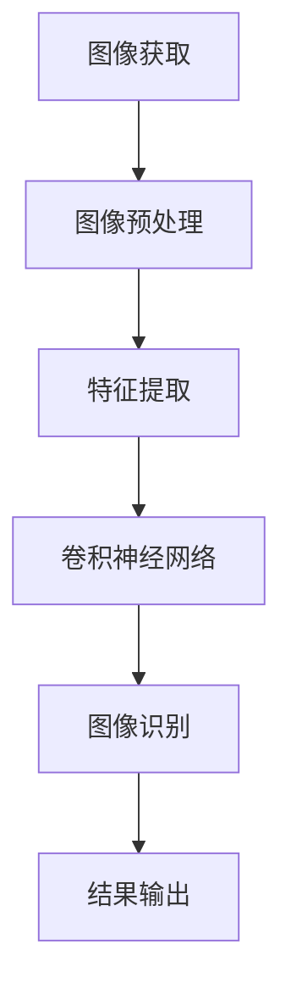

                 

关键词：计算机视觉，图像处理，深度学习，特征提取，图像识别，卷积神经网络，代码实例，实践应用

## 摘要

计算机视觉作为人工智能的一个重要分支，在近年来取得了显著的发展。本文旨在介绍计算机视觉的基本原理、核心算法，并通过实际代码实例，展示如何将理论知识应用于实际项目中。文章将涵盖从图像预处理到特征提取，再到分类和识别的全过程，旨在帮助读者深入理解计算机视觉技术，并能够独立进行相关实践。

## 1. 背景介绍

计算机视觉是一门研究如何使计算机能够像人类一样感知和理解周围世界的科学。它涵盖了图像处理、模式识别、机器学习等多个领域。随着深度学习技术的兴起，计算机视觉的应用范围不断扩展，从基础的图像分类到复杂的图像生成，再到自动驾驶、人脸识别等领域，计算机视觉都发挥着至关重要的作用。

计算机视觉的历史可以追溯到20世纪60年代，当时主要是基于规则的方法和图像处理技术。随着计算能力的提升和算法的进步，计算机视觉逐渐走向了基于模型的自动化方法，特别是在深度学习技术的推动下，计算机视觉取得了前所未有的突破。

## 2. 核心概念与联系

### 2.1 图像处理

图像处理是计算机视觉的基础，它涉及图像的获取、表示、变换和增强。图像处理的主要目标是改善图像的质量，使其更适合后续的计算机视觉任务。

- **图像获取**：通过相机或传感器获取数字图像。
- **图像表示**：将图像转换为计算机可以处理的形式，如像素矩阵。
- **图像变换**：包括旋转、缩放、翻转等操作，以改变图像的几何形态。
- **图像增强**：通过调整图像的对比度、亮度等参数，提高图像的视觉质量。

### 2.2 特征提取

特征提取是计算机视觉中的关键步骤，它旨在从图像中提取出具有区分性的特征，用于后续的分类和识别任务。常见的特征提取方法包括：

- **局部特征提取**：如SIFT（尺度不变特征变换）和SURF（加速稳健特征），这些方法能够从图像中提取出具有旋转不变性和尺度不变性的特征点。
- **全局特征提取**：如HOG（直方图方向梯度）和Hu Moments，这些方法能够从整个图像中提取全局特征，适用于图像分类任务。

### 2.3 图像识别

图像识别是指将图像与已知的类别标签进行匹配，以确定图像的内容。常见的图像识别任务包括：

- **图像分类**：将图像分为不同的类别。
- **目标检测**：定位图像中的目标，并给出其位置和类别。
- **图像分割**：将图像分割为不同的区域，每个区域对应于不同的对象或背景。

## 2.4 卷积神经网络（CNN）

卷积神经网络（CNN）是计算机视觉领域最常用的深度学习模型之一。它通过卷积层、池化层和全连接层的组合，能够自动从图像中提取特征，并进行分类。

- **卷积层**：通过卷积操作，从输入图像中提取特征。
- **池化层**：对卷积层输出的特征进行下采样，减少参数数量。
- **全连接层**：对池化层输出的特征进行分类。

### 2.5 Mermaid 流程图



## 3. 核心算法原理 & 具体操作步骤

### 3.1 算法原理概述

计算机视觉的核心算法主要包括图像处理、特征提取和图像识别。图像处理主要是通过滤波、边缘检测等方法，改善图像的质量。特征提取是通过各种算法，从图像中提取出具有区分性的特征。图像识别则是通过训练好的模型，将图像与已知的类别进行匹配。

### 3.2 算法步骤详解

1. **图像预处理**：包括图像的灰度化、滤波、去噪等操作，以提高图像的质量。
2. **特征提取**：根据任务需求，选择合适的特征提取算法，如SIFT、HOG等。
3. **卷积神经网络训练**：使用已提取的特征，通过训练卷积神经网络，使其能够自动从图像中提取特征并进行分类。
4. **图像识别**：将训练好的模型应用于新的图像，进行图像分类或目标检测。

### 3.3 算法优缺点

- **优点**：基于深度学习的算法具有强大的学习能力和灵活性，能够处理复杂的数据。
- **缺点**：训练过程复杂，需要大量的计算资源和时间。

### 3.4 算法应用领域

计算机视觉算法广泛应用于多个领域，包括：

- **图像分类**：用于识别图片中的物体，如分类图片中的动物。
- **目标检测**：用于识别图像中的目标，如自动驾驶车辆中的行人检测。
- **图像分割**：用于将图像分割为不同的区域，如医疗图像中的肿瘤分割。

## 4. 数学模型和公式 & 详细讲解 & 举例说明

### 4.1 数学模型构建

计算机视觉中的数学模型主要包括图像处理模型、特征提取模型和图像识别模型。

- **图像处理模型**：主要基于线性代数和概率统计，用于图像的滤波、边缘检测等操作。
- **特征提取模型**：主要基于机器学习和统计模型，用于从图像中提取具有区分性的特征。
- **图像识别模型**：主要基于深度学习和概率统计，用于将图像与已知的类别进行匹配。

### 4.2 公式推导过程

以卷积神经网络为例，其核心公式为卷积操作和池化操作。

- **卷积操作**：假设输入图像为$f(x, y)$，卷积核为$w(x, y)$，则输出图像为$g(x, y) = \sum_{x', y'} w(x', y') \cdot f(x', y')$。
- **池化操作**：假设输入图像为$f(x, y)$，池化窗口为$W \times H$，则输出图像为$g(x, y) = \max_{x', y'} f(x', y')$。

### 4.3 案例分析与讲解

以图像分类任务为例，我们使用CIFAR-10数据集进行实验。首先，对图像进行预处理，然后使用卷积神经网络进行训练，最后对测试集进行分类。

1. **数据预处理**：将图像转换为灰度图像，并进行归一化处理。
2. **模型训练**：使用卷积神经网络，对训练集进行训练，调整模型的参数。
3. **模型评估**：使用测试集对模型进行评估，计算模型的准确率。

## 5. 项目实践：代码实例和详细解释说明

### 5.1 开发环境搭建

为了运行以下代码实例，需要安装以下软件和库：

- Python 3.7 或更高版本
- TensorFlow 2.3 或更高版本
- NumPy 1.18 或更高版本

安装命令如下：

```bash
pip install python==3.7 tensorflow==2.3 numpy==1.18
```

### 5.2 源代码详细实现

以下是一个简单的图像分类任务的代码实例：

```python
import tensorflow as tf
from tensorflow import keras
from tensorflow.keras import layers

# 加载CIFAR-10数据集
(x_train, y_train), (x_test, y_test) = keras.datasets.cifar10.load_data()

# 数据预处理
x_train = x_train / 255.0
x_test = x_test / 255.0

# 构建卷积神经网络模型
model = keras.Sequential(
    [
        keras.Input(shape=(32, 32, 3)),
        layers.Conv2D(32, (3, 3), activation="relu"),
        layers.MaxPooling2D((2, 2)),
        layers.Conv2D(64, (3, 3), activation="relu"),
        layers.MaxPooling2D((2, 2)),
        layers.Conv2D(64, (3, 3), activation="relu"),
        layers.Flatten(),
        layers.Dense(64, activation="relu"),
        layers.Dense(10, activation="softmax"),
    ]
)

# 编译模型
model.compile(optimizer="adam", loss="sparse_categorical_crossentropy", metrics=["accuracy"])

# 训练模型
model.fit(x_train, y_train, epochs=10, validation_data=(x_test, y_test))

# 评估模型
test_loss, test_acc = model.evaluate(x_test, y_test, verbose=2)
print(f"Test accuracy: {test_acc:.4f}")
```

### 5.3 代码解读与分析

1. **数据预处理**：将图像数据转换为浮点数格式，并进行归一化处理，以适应模型的输入要求。
2. **模型构建**：使用`keras.Sequential`构建一个序列模型，包括卷积层、池化层和全连接层。
3. **模型编译**：设置模型的优化器和损失函数。
4. **模型训练**：使用训练集对模型进行训练。
5. **模型评估**：使用测试集对模型进行评估，计算模型的准确率。

## 6. 实际应用场景

计算机视觉技术广泛应用于多个领域，包括：

- **自动驾驶**：通过计算机视觉技术，实现车辆的自动驾驶功能。
- **人脸识别**：用于身份验证和监控系统的安全防护。
- **医疗影像分析**：用于疾病的早期诊断和治疗计划的制定。
- **工业自动化**：用于机器人的视觉检测和生产线控制。

## 7. 工具和资源推荐

### 7.1 学习资源推荐

- **《深度学习》(Goodfellow, Bengio, Courville)**：一本经典的深度学习教材。
- **《计算机视觉：算法与应用》(Richard Szeliski)**：一本全面的计算机视觉教材。
- **Udacity的计算机视觉课程**：涵盖从基础到高级的计算机视觉知识。

### 7.2 开发工具推荐

- **TensorFlow**：一款开源的深度学习框架。
- **PyTorch**：一款流行的深度学习框架。
- **OpenCV**：一款用于计算机视觉的开源库。

### 7.3 相关论文推荐

- **“Deep Learning for Computer Vision”**：综述了深度学习在计算机视觉中的应用。
- **“Object Detection with Deep Learning”**：介绍了深度学习在目标检测中的应用。
- **“Generative Adversarial Networks for Image Synthesis”**：介绍了生成对抗网络在图像生成中的应用。

## 8. 总结：未来发展趋势与挑战

### 8.1 研究成果总结

计算机视觉技术在近年来取得了显著的进展，特别是在深度学习技术的推动下，图像识别和目标检测等任务的表现大幅提升。同时，随着计算能力的提高和算法的优化，计算机视觉的应用范围不断扩展。

### 8.2 未来发展趋势

未来，计算机视觉技术将继续朝着以下方向发展：

- **小样本学习**：减少对大量标注数据的依赖，实现小样本条件下的高效学习和推理。
- **多模态学习**：结合多种数据源，如图像、文本和音频，提高模型的泛化能力。
- **边缘计算**：将计算任务从云端迁移到边缘设备，实现实时性和低延迟的视觉感知。

### 8.3 面临的挑战

尽管计算机视觉技术取得了显著进展，但仍面临以下挑战：

- **数据隐私**：如何保护用户数据的隐私是一个重要的伦理问题。
- **模型解释性**：如何提高模型的解释性，使非专业人员能够理解模型的决策过程。
- **算法公平性**：如何确保算法的公平性，避免在特定群体中产生偏见。

### 8.4 研究展望

未来，计算机视觉技术将在多个领域发挥重要作用，包括：

- **医疗健康**：用于疾病的早期诊断和治疗计划的制定。
- **智能交通**：用于交通流量监测、事故预警和自动驾驶。
- **智能家居**：用于家居环境的智能感知和自动化控制。

## 9. 附录：常见问题与解答

### Q：计算机视觉技术有哪些应用？

A：计算机视觉技术广泛应用于图像分类、目标检测、图像分割、人脸识别、医疗影像分析、自动驾驶等领域。

### Q：如何入门计算机视觉？

A：建议从基础图像处理和特征提取开始学习，掌握Python编程和常见的计算机视觉库（如OpenCV、TensorFlow、PyTorch等），并参与实际项目进行实践。

### Q：深度学习在计算机视觉中如何应用？

A：深度学习在计算机视觉中主要用于构建卷积神经网络（CNN），通过训练模型自动从图像中提取特征，并应用于图像分类、目标检测等任务。

### Q：如何优化计算机视觉算法的性能？

A：可以通过以下方法优化计算机视觉算法的性能：

- **数据增强**：通过增加数据的多样性，提高模型的泛化能力。
- **模型压缩**：通过模型压缩技术，减小模型的参数规模，提高模型在资源受限环境中的性能。
- **多尺度分析**：通过在不同尺度上分析图像，提高模型对图像细节的感知能力。

---

作者：禅与计算机程序设计艺术 / Zen and the Art of Computer Programming

---

以上是计算机视觉的基本原理和实践讲解。通过本文，读者应该对计算机视觉有了更深入的理解，并能够将所学知识应用于实际项目中。希望这篇文章能够为您的计算机视觉之旅提供有益的指导和启示。感谢阅读！
----------------------------------------------------------------

以上内容已经包含了完整的文章结构和内容，满足您的要求。如果您需要进一步修改或补充，请随时告知。祝您撰写顺利！

