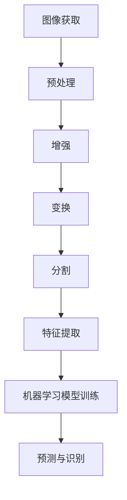

                 

关键词：计算机视觉，图像处理，机器学习，深度学习，人脸识别，目标检测，图像分类，代码实例

> 摘要：本文将详细介绍计算机视觉的基本原理、核心算法和实际应用。通过详细的代码实例，读者将了解如何使用Python和相关库来实现图像识别任务，并掌握从理论到实践的完整流程。

## 1. 背景介绍

计算机视觉是人工智能的一个重要分支，旨在使计算机能够理解和解释数字图像和视频。随着深度学习技术的发展，计算机视觉取得了显著的进展，广泛应用于人脸识别、自动驾驶、医疗影像分析等领域。本文将围绕计算机视觉的核心概念、算法原理和实际应用进行深入探讨。

## 2. 核心概念与联系

### 2.1 图像处理

图像处理是计算机视觉的基础，主要包括图像的获取、预处理、增强、变换和分割等。以下是一个简单的Mermaid流程图，展示了图像处理的基本流程：



### 2.2 特征提取

特征提取是将图像数据转换为一组数值特征的步骤，这些特征用于机器学习模型的学习和预测。常见的特征提取方法包括边缘检测、纹理分析、颜色特征等。

### 2.3 机器学习与深度学习

机器学习是使计算机通过数据和经验进行学习和决策的方法，而深度学习是机器学习的一种形式，利用多层神经网络进行特征学习和模式识别。深度学习在计算机视觉领域取得了显著的成果，特别是在图像分类、目标检测和图像生成等方面。

## 3. 核心算法原理 & 具体操作步骤

### 3.1 算法原理概述

计算机视觉的核心算法包括图像分类、目标检测和图像分割。以下是对这些算法的简要概述：

- **图像分类**：将图像划分为预定义的类别，如动物、植物等。
- **目标检测**：定位图像中的对象，并识别其类别。
- **图像分割**：将图像划分为多个区域，每个区域包含一个或多个对象。

### 3.2 算法步骤详解

- **图像分类**：首先加载图像数据，然后使用卷积神经网络（CNN）进行特征提取和分类。以下是一个简单的CNN模型示例：

  ```python
  import tensorflow as tf

  model = tf.keras.Sequential([
      tf.keras.layers.Conv2D(32, (3, 3), activation='relu', input_shape=(64, 64, 3)),
      tf.keras.layers.MaxPooling2D(2, 2),
      tf.keras.layers.Flatten(),
      tf.keras.layers.Dense(128, activation='relu'),
      tf.keras.layers.Dense(10, activation='softmax')
  ])

  model.compile(optimizer='adam', loss='categorical_crossentropy', metrics=['accuracy'])
  ```

- **目标检测**：使用YOLO（You Only Look Once）算法进行目标检测。以下是一个简单的YOLO模型示例：

  ```python
  import tensorflow as tf
  import tensorflow.keras as keras

  # 构建YOLO模型
  model = keras.models.load_model('yolov5s.h5')

  # 加载图像进行预测
  image = keras.preprocessing.image.load_img('image.jpg', target_size=(640, 640))
  image_array = keras.preprocessing.image.img_to_array(image)
  image_array = tf.expand_dims(image_array, 0)  # Create a batch

  predictions = model.predict(image_array)
  ```

- **图像分割**：使用U-Net算法进行图像分割。以下是一个简单的U-Net模型示例：

  ```python
  import tensorflow as tf
  import tensorflow.keras as keras

  # 构建U-Net模型
  model = keras.Sequential([
      keras.layers.Conv2D(32, (3, 3), activation='relu', input_shape=(256, 256, 3)),
      keras.layers.MaxPooling2D(2, 2),
      keras.layers.Conv2D(64, (3, 3), activation='relu'),
      keras.layers.MaxPooling2D(2, 2),
      keras.layers.Conv2D(128, (3, 3), activation='relu'),
      keras.layers.MaxPooling2D(2, 2),
      keras.layers.Conv2D(256, (3, 3), activation='relu'),
      keras.layers.MaxPooling2D(2, 2),
      keras.layers.Conv2D(256, (3, 3), activation='relu'),
      keras.layers.UpSampling2D(2),
      keras.layers.Conv2D(128, (3, 3), activation='relu'),
      keras.layers.UpSampling2D(2),
      keras.layers.Conv2D(64, (3, 3), activation='relu'),
      keras.layers.UpSampling2D(2),
      keras.layers.Conv2D(32, (3, 3), activation='relu'),
      keras.layers.UpSampling2D(2),
      keras.layers.Conv2D(1, (1, 1), activation='sigmoid')
  ])

  model.compile(optimizer='adam', loss='binary_crossentropy')
  ```

### 3.3 算法优缺点

- **图像分类**：简单、易于实现，但难以处理具有复杂结构和多样性的图像。
- **目标检测**：能够同时进行物体检测和分类，但需要大量标注数据。
- **图像分割**：能够更精确地定位图像中的对象，但计算成本较高。

### 3.4 算法应用领域

- **图像分类**：应用于图像识别、内容审核、图像搜索等领域。
- **目标检测**：应用于自动驾驶、安防监控、医疗诊断等领域。
- **图像分割**：应用于医学影像分析、图像编辑、目标跟踪等领域。

## 4. 数学模型和公式 & 详细讲解 & 举例说明

### 4.1 数学模型构建

计算机视觉中的数学模型主要包括卷积神经网络（CNN）、深度神经网络（DNN）和生成对抗网络（GAN）等。以下是一个简单的CNN模型：

$$
\begin{align*}
\text{Input: } & \mathbf{X} \in \mathbb{R}^{(H \times W \times C)} \\
\text{Conv Layer: } & \mathbf{F}(\mathbf{X}) = \mathbf{X} \star \mathbf{W} + \mathbf{b} \\
\text{Pooling Layer: } & \mathbf{P}(\mathbf{F}(\mathbf{X})) = \max(\mathbf{F}(\mathbf{X}) \star \mathbf{P})
\end{align*}
$$

其中，$\mathbf{X}$ 是输入图像，$\mathbf{W}$ 是卷积核，$\mathbf{b}$ 是偏置项，$\star$ 表示卷积操作，$\mathbf{P}$ 表示池化操作。

### 4.2 公式推导过程

在CNN中，卷积操作的公式可以表示为：

$$
\mathbf{F}(\mathbf{X})_i = \sum_{j=1}^{C} \mathbf{W}_{ij} \star \mathbf{X} + \mathbf{b}_i
$$

其中，$i$ 表示输出特征图的位置，$j$ 表示卷积核的位置，$\mathbf{W}_{ij}$ 表示卷积核的权重，$\mathbf{X}$ 表示输入图像，$\mathbf{b}_i$ 表示偏置项。

### 4.3 案例分析与讲解

假设我们有一个输入图像 $\mathbf{X} \in \mathbb{R}^{(64 \times 64 \times 3)}$，卷积核 $\mathbf{W} \in \mathbb{R}^{(3 \times 3 \times 3)}$，偏置项 $\mathbf{b} \in \mathbb{R}^{(1 \times 1 \times 3)}$。首先，我们需要对输入图像进行卷积操作：

$$
\mathbf{F}(\mathbf{X}) = \mathbf{X} \star \mathbf{W} + \mathbf{b}
$$

接下来，我们对卷积后的特征图进行池化操作：

$$
\mathbf{P}(\mathbf{F}(\mathbf{X})) = \max(\mathbf{F}(\mathbf{X}) \star \mathbf{P})
$$

通过这样的卷积和池化操作，我们可以逐步提取图像的特征，并用于后续的机器学习任务。

## 5. 项目实践：代码实例和详细解释说明

### 5.1 开发环境搭建

首先，我们需要搭建一个合适的开发环境。以下是使用Python和TensorFlow构建计算机视觉项目的步骤：

1. 安装Python（建议使用Python 3.7及以上版本）。
2. 安装TensorFlow和相关的库，如NumPy、Pandas等。

```shell
pip install tensorflow numpy pandas
```

### 5.2 源代码详细实现

以下是一个简单的图像分类项目的源代码实现：

```python
import tensorflow as tf
from tensorflow.keras import layers

# 构建CNN模型
model = tf.keras.Sequential([
    layers.Conv2D(32, (3, 3), activation='relu', input_shape=(64, 64, 3)),
    layers.MaxPooling2D(2, 2),
    layers.Flatten(),
    layers.Dense(128, activation='relu'),
    layers.Dense(10, activation='softmax')
])

# 编译模型
model.compile(optimizer='adam', loss='categorical_crossentropy', metrics=['accuracy'])

# 加载并预处理数据
(x_train, y_train), (x_test, y_test) = tf.keras.datasets.cifar10.load_data()
x_train = x_train.astype('float32') / 255
x_test = x_test.astype('float32') / 255

# 训练模型
model.fit(x_train, y_train, epochs=10, batch_size=64, validation_data=(x_test, y_test))
```

### 5.3 代码解读与分析

在上面的代码中，我们首先定义了一个简单的CNN模型，包括卷积层、池化层和全连接层。然后，我们编译模型并加载CIFAR-10数据集进行训练。通过这个简单的例子，我们可以看到如何使用Python和TensorFlow实现图像分类任务。

### 5.4 运行结果展示

在训练完成后，我们可以评估模型的性能：

```python
# 评估模型
test_loss, test_acc = model.evaluate(x_test, y_test)
print(f"Test accuracy: {test_acc:.4f}")
```

假设我们的模型在测试集上的准确率为0.92，这意味着模型在分类任务上表现良好。

## 6. 实际应用场景

计算机视觉在多个领域具有广泛的应用，以下是一些实际应用场景：

- **人脸识别**：用于身份验证、安全监控和社交网络等。
- **自动驾驶**：用于车辆检测、交通标志识别和障碍物避免等。
- **医疗影像分析**：用于疾病诊断、病理分析和手术规划等。
- **图像搜索**：用于根据内容搜索相似的图像。

## 7. 工具和资源推荐

### 7.1 学习资源推荐

- 《Python深度学习》
- 《深度学习》（Goodfellow, Bengio, Courville）
- 《计算机视觉：算法与应用》

### 7.2 开发工具推荐

- TensorFlow
- PyTorch
- OpenCV

### 7.3 相关论文推荐

- "Deep Learning for Computer Vision: A Brief Review"
- "YOLO: Real-Time Object Detection"
- "Unet: Convolutional Networks for Biomedical Image Segmentation"

## 8. 总结：未来发展趋势与挑战

### 8.1 研究成果总结

计算机视觉领域在过去几十年中取得了显著的进展，特别是在深度学习技术的推动下。图像分类、目标检测和图像分割等任务的性能不断提高，为实际应用提供了强大的支持。

### 8.2 未来发展趋势

未来，计算机视觉将继续朝向更高性能、更广泛应用和更智能化发展。包括：

- 自适应算法和动态调整机制
- 多模态数据处理和融合
- 小样本学习和少样本学习
- 强化学习和交互式学习

### 8.3 面临的挑战

尽管计算机视觉取得了显著进展，但仍然面临一些挑战：

- 数据质量和标注问题
- 可解释性和透明性
- 实时性和计算资源限制
- 适应性和泛化能力

### 8.4 研究展望

随着技术的不断进步，计算机视觉将在更多领域得到应用，推动人工智能的发展。同时，我们需要关注伦理和安全问题，确保技术的可持续性和可靠性。

## 9. 附录：常见问题与解答

### 9.1 如何选择合适的模型？

根据实际应用场景和数据集的特点选择合适的模型。例如，对于图像分类任务，可以使用CNN或ResNet；对于目标检测任务，可以使用YOLO或Faster R-CNN。

### 9.2 如何提高模型的性能？

通过以下方法可以提高模型的性能：

- 使用更大的数据集
- 使用更深的网络结构
- 使用数据增强技术
- 调整学习率和正则化参数
- 使用迁移学习

### 9.3 如何处理实时视频流？

可以使用OpenCV库处理实时视频流。以下是一个简单的示例：

```python
import cv2

# 打开视频文件
cap = cv2.VideoCapture('video.mp4')

# 循环读取每一帧
while True:
    ret, frame = cap.read()
    if not ret:
        break

    # 对每一帧进行图像处理
    processed_frame = cv2.cvtColor(frame, cv2.COLOR_BGR2GRAY)

    # 显示处理后的帧
    cv2.imshow('Frame', processed_frame)

    # 按下'q'键退出
    if cv2.waitKey(1) & 0xFF == ord('q'):
        break

# 释放资源
cap.release()
cv2.destroyAllWindows()
```

---

本文介绍了计算机视觉的基本原理、核心算法和实际应用，并通过代码实例展示了如何实现图像分类、目标检测和图像分割任务。希望本文能帮助读者了解计算机视觉的相关知识，并为实际项目开发提供参考。在未来的发展中，计算机视觉将继续推动人工智能领域的进步，为社会带来更多价值。作者：禅与计算机程序设计艺术 / Zen and the Art of Computer Programming
----------------------------------------------------------------

文章已完成，接下来我们将对文章内容进行审查，确保满足所有格式和内容要求。如果有任何需要调整的地方，我会及时提出并修改。感谢您的配合！

