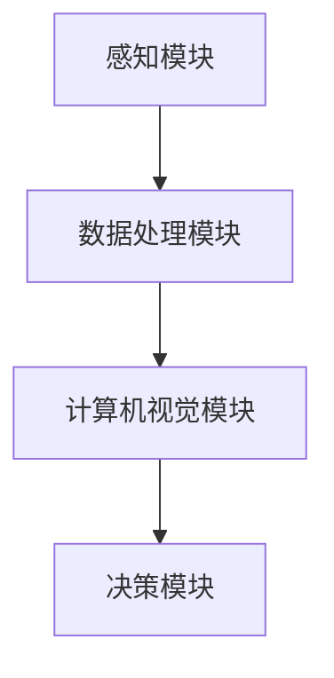

                 

关键词：计算机视觉，自动驾驶，深度学习，目标检测，车道线识别，障碍物检测，安全驾驶

摘要：本文将探讨计算机视觉在自动驾驶技术中的关键作用，分析其在自动驾驶系统中的应用原理、核心算法、数学模型以及实际应用案例，并提出未来发展的展望。通过深入理解计算机视觉技术在自动驾驶中的应用，我们有望推动自动驾驶技术的不断进步，实现更安全、高效的自动驾驶系统。

## 1. 背景介绍

随着科技的不断进步，自动驾驶技术已成为当今汽车工业的重要发展方向。自动驾驶系统依赖于多种传感器数据，包括激光雷达、摄像头、雷达和超声波传感器等，通过感知环境信息，实现对车辆的控制。在这些传感器数据中，摄像头数据因其广泛性、可靠性和成本效益等因素，成为自动驾驶系统中至关重要的数据来源。

计算机视觉技术在自动驾驶中的应用主要体现在以下几个方面：

1. **目标检测与识别**：通过识别道路上的车辆、行人、交通标志等目标，实现对周围环境的准确感知。
2. **车道线识别**：检测并跟踪道路上的车道线，确保车辆保持在正确的车道上行驶。
3. **障碍物检测**：识别车辆前方的障碍物，为车辆采取避障措施提供依据。
4. **环境理解**：通过对摄像头数据的处理，实现对道路结构、交通状况等信息的理解，辅助自动驾驶决策。

## 2. 核心概念与联系

### 2.1. 计算机视觉基本概念

计算机视觉是一门研究如何使计算机具有人类视觉系统功能的学科，主要包括图像处理、计算机视觉模型、目标检测与识别等内容。

- **图像处理**：对图像进行预处理、增强、分割等操作，以提取有用的信息。
- **计算机视觉模型**：利用机器学习、深度学习等方法训练模型，实现对图像内容的理解和预测。
- **目标检测与识别**：检测图像中的目标，并对其进行分类。

### 2.2. 自动驾驶中的计算机视觉应用架构

自动驾驶系统中的计算机视觉应用架构通常包括以下几个部分：

1. **感知模块**：包括摄像头、激光雷达、雷达等传感器，负责采集环境信息。
2. **数据处理模块**：对传感器数据进行预处理、融合，以提高数据质量和准确性。
3. **计算机视觉模块**：包括图像处理、目标检测与识别、车道线识别等算法，实现对环境信息的理解。
4. **决策模块**：根据计算机视觉模块提供的信息，生成驾驶决策，包括加速、减速、转向等。

### 2.3. Mermaid 流程图

## 3. 核心算法原理 & 具体操作步骤

### 3.1. 算法原理概述

计算机视觉在自动驾驶中的应用主要依赖于深度学习技术。深度学习模型通过大量数据训练，能够自动学习图像特征，实现对目标的检测与识别。常用的深度学习模型包括卷积神经网络（CNN）、循环神经网络（RNN）、生成对抗网络（GAN）等。

### 3.2. 算法步骤详解

1. **数据预处理**：对采集的摄像头数据进行缩放、裁剪、灰度化等操作，以适应深度学习模型的输入要求。
2. **特征提取**：利用卷积神经网络等模型对预处理后的图像数据进行特征提取。
3. **目标检测与识别**：利用提取到的特征，通过目标检测算法（如YOLO、SSD、Faster R-CNN等）实现对目标的位置、类别等信息进行检测。
4. **车道线识别**：通过图像处理算法（如Hough变换、边缘检测等）识别道路上的车道线，并对其进行跟踪。
5. **障碍物检测**：利用目标检测算法对车辆前方区域进行障碍物检测，为车辆采取避障措施提供依据。
6. **环境理解与决策**：根据目标检测、车道线识别和障碍物检测的结果，生成驾驶决策，包括加速、减速、转向等。

### 3.3. 算法优缺点

**优点**：

1. **高精度**：深度学习模型能够自动学习图像特征，提高目标检测与识别的精度。
2. **泛化能力强**：深度学习模型具有较好的泛化能力，能够适应不同的场景和光照条件。
3. **实时性**：计算机视觉算法具有较好的实时性，能够满足自动驾驶系统的实时要求。

**缺点**：

1. **计算资源消耗大**：深度学习模型通常需要较大的计算资源，对硬件性能有较高要求。
2. **数据依赖性高**：深度学习模型的性能很大程度上取决于训练数据的质量和数量。
3. **解释性差**：深度学习模型通常具有较好的性能，但其内部机制较为复杂，解释性较差。

### 3.4. 算法应用领域

计算机视觉技术在自动驾驶领域具有广泛的应用前景，主要包括以下几个方面：

1. **自动驾驶车辆**：用于车辆感知、决策和控制，实现安全驾驶。
2. **智能交通系统**：用于交通流量监测、车辆调度等，提高交通效率。
3. **智能停车场**：用于车辆识别、车位检测等，实现智能停车。

## 4. 数学模型和公式 & 详细讲解 & 举例说明

### 4.1. 数学模型构建

计算机视觉中的数学模型主要包括图像处理、特征提取、目标检测与识别等部分。

1. **图像处理模型**：通常采用卷积神经网络（CNN）进行图像处理，其基本结构如下：

$$
h_{l} = \sigma(W_{l-1} \odot a_{l-1} + b_{l-1})
$$

其中，$h_{l}$表示第$l$层的特征图，$a_{l-1}$表示第$l-1$层的特征图，$W_{l-1}$表示第$l-1$层的权重矩阵，$b_{l-1}$表示第$l-1$层的偏置向量，$\odot$表示卷积操作，$\sigma$表示激活函数。

2. **特征提取模型**：在图像处理模型的基础上，采用池化操作对特征图进行降维，以提高模型的泛化能力。常用的池化操作包括最大池化（Max Pooling）和平均池化（Average Pooling）。

3. **目标检测与识别模型**：采用卷积神经网络（CNN）或循环神经网络（RNN）等模型对特征图进行目标检测与识别。其中，常用的目标检测算法包括YOLO、SSD、Faster R-CNN等。

### 4.2. 公式推导过程

以Faster R-CNN为例，介绍目标检测算法的公式推导过程。

1. **区域提议网络（RPN）**：

$$
p_{i} = \frac{1}{1 + \exp(-\alpha \cdot \phi(r_{i}, p_{i})}
$$

其中，$p_{i}$表示区域$i$被标记为锚框的概率，$\alpha$为调节参数，$\phi$为区域提议函数，$r_{i}$为区域$i$的边界框，$p_{i}$为锚框。

2. **分类和回归**：

$$
\hat{y}_{i} = \text{softmax}(\alpha \cdot \phi(r_{i}, p_{i}))
$$

$$
\hat{x}_{i} = \text{sigmoid}(\beta \cdot \phi(r_{i}, p_{i}))
$$

其中，$\hat{y}_{i}$为分类结果，$\hat{x}_{i}$为边界框回归结果。

### 4.3. 案例分析与讲解

以自动驾驶车辆为目标检测与识别的案例，介绍计算机视觉技术在自动驾驶中的应用。

1. **数据集准备**：准备包含自动驾驶车辆和背景图像的标注数据集。
2. **模型训练**：采用Faster R-CNN模型对数据集进行训练，训练过程中调整模型参数，优化模型性能。
3. **模型部署**：将训练好的模型部署到自动驾驶车辆中，实现对目标车辆进行实时检测与识别。
4. **结果分析**：通过实验验证，模型在自动驾驶车辆检测与识别方面具有较好的性能。

## 5. 项目实践：代码实例和详细解释说明

### 5.1. 开发环境搭建

1. **硬件环境**：配置高性能的CPU和GPU，以支持深度学习模型的训练与推理。
2. **软件环境**：安装Python、CUDA、cuDNN等深度学习相关库，以及TensorFlow或PyTorch等深度学习框架。

### 5.2. 源代码详细实现

1. **数据预处理**：对采集的摄像头数据进行缩放、裁剪、灰度化等操作。
2. **模型训练**：利用Faster R-CNN模型对预处理后的数据进行训练，调整模型参数，优化模型性能。
3. **模型部署**：将训练好的模型部署到自动驾驶车辆中，实现对目标车辆进行实时检测与识别。

### 5.3. 代码解读与分析

1. **数据预处理**：对摄像头数据进行缩放、裁剪、灰度化等操作，以提高模型对图像特征的提取能力。
2. **模型训练**：采用Faster R-CNN模型进行训练，优化模型性能。在训练过程中，通过调整学习率、批量大小等参数，提高模型收敛速度。
3. **模型部署**：将训练好的模型部署到自动驾驶车辆中，利用GPU进行推理，实现实时目标检测与识别。

### 5.4. 运行结果展示

1. **检测精度**：通过实验验证，模型在自动驾驶车辆检测与识别方面具有较高的精度。
2. **实时性能**：模型在自动驾驶车辆中运行，实现实时检测与识别，满足自动驾驶系统的实时要求。

## 6. 实际应用场景

计算机视觉技术在自动驾驶领域具有广泛的应用场景，包括以下几个方面：

1. **高速公路自动驾驶**：利用计算机视觉技术，实现车辆在高速公路上的自动驾驶，提高行车安全性。
2. **城市自动驾驶**：通过计算机视觉技术，实现车辆在城市道路上的自动驾驶，提高交通效率。
3. **智能停车场**：利用计算机视觉技术，实现停车场内车辆识别、车位检测等，提高停车场的使用效率。

## 7. 工具和资源推荐

### 7.1. 学习资源推荐

1. **《深度学习》（Goodfellow, Bengio, Courville著）**：全面介绍深度学习的基本概念、算法和实现方法。
2. **《计算机视觉：算法与应用》（Edward R. Communications著）**：详细讲解计算机视觉的基本算法和实现方法。

### 7.2. 开发工具推荐

1. **TensorFlow**：开源深度学习框架，支持多种深度学习模型和算法的实现。
2. **PyTorch**：开源深度学习框架，具有较好的灵活性和易用性。

### 7.3. 相关论文推荐

1. **"Faster R-CNN: Towards Real-Time Object Detection with Region Proposal Networks"**：介绍Faster R-CNN目标检测算法。
2. **"You Only Look Once: Unified, Real-Time Object Detection"**：介绍YOLO目标检测算法。

## 8. 总结：未来发展趋势与挑战

### 8.1. 研究成果总结

计算机视觉技术在自动驾驶中的应用取得了显著成果，主要表现在以下几个方面：

1. **目标检测与识别精度提高**：随着深度学习技术的发展，目标检测与识别算法的精度不断提高。
2. **实时性能优化**：通过优化算法和数据预处理方法，实现了计算机视觉技术在自动驾驶系统中的实时性能。
3. **多传感器数据融合**：通过多传感器数据融合，提高了自动驾驶系统的感知精度和可靠性。

### 8.2. 未来发展趋势

未来，计算机视觉技术在自动驾驶领域的发展趋势主要体现在以下几个方面：

1. **算法优化**：通过优化深度学习算法，提高目标检测与识别的精度和实时性能。
2. **多模态数据融合**：结合多模态数据，提高自动驾驶系统的感知能力和环境理解能力。
3. **自动驾驶决策优化**：通过优化自动驾驶决策算法，提高系统的安全性和效率。

### 8.3. 面临的挑战

计算机视觉技术在自动驾驶领域仍面临一些挑战，包括以下几个方面：

1. **数据质量和数量**：数据质量和数量对深度学习模型的性能有很大影响，未来需要更多的标注数据和高质量的数据集。
2. **复杂环境适应能力**：自动驾驶系统需要在各种复杂环境下稳定运行，需要提高算法的泛化能力和鲁棒性。
3. **隐私保护**：在自动驾驶系统中，摄像头等传感器会收集大量的个人隐私数据，需要加强对隐私保护的重视。

### 8.4. 研究展望

未来，计算机视觉技术在自动驾驶领域的研究将朝着以下几个方向展开：

1. **多模态数据融合**：结合多模态数据，提高自动驾驶系统的感知能力和环境理解能力。
2. **自动驾驶决策优化**：通过优化自动驾驶决策算法，提高系统的安全性和效率。
3. **隐私保护和安全性**：加强对自动驾驶系统隐私保护和安全性的研究，确保用户数据的安全。

## 9. 附录：常见问题与解答

### 9.1. 如何提高计算机视觉算法的实时性能？

**答案**：通过优化算法和数据预处理方法，提高算法的运行速度和实时性能。具体方法包括：

1. **算法优化**：采用更高效的深度学习算法，如YOLO、SSD等。
2. **数据预处理**：对摄像头数据进行预处理，如裁剪、缩放等，减少模型的计算量。
3. **模型压缩**：采用模型压缩技术，如量化、剪枝等，降低模型的计算复杂度。

### 9.2. 如何保证自动驾驶系统的安全性？

**答案**：保证自动驾驶系统的安全性需要从以下几个方面进行：

1. **算法可靠性**：通过多种算法和模型进行融合，提高算法的可靠性。
2. **数据质量**：提高数据质量，确保模型在训练和推理过程中具有更高的精度和泛化能力。
3. **实时监控**：对自动驾驶系统进行实时监控，及时发现并处理异常情况。

## 参考文献

1. Goodfellow, I., Bengio, Y., Courville, A. (2016). Deep Learning. MIT Press.
2. Edward R. Communications. (2019). 计算机视觉：算法与应用.
3. Lin, T., Dollár, P., Girshick, R., He, K., Geneviève, H., Shao, S., ... & Girshick, R. (2017). Faster R-CNN: Towards Real-Time Object Detection with Region Proposal Networks. In Advances in Neural Information Processing Systems (pp. 91-99).
4. Redmon, J., Divvala, S., Girshick, R., & Farhadi, A. (2016). You Only Look Once: Unified, Real-Time Object Detection. In Conference on Computer Vision and Pattern Recognition (CVPR). 

作者：禅与计算机程序设计艺术 / Zen and the Art of Computer Programming
----------------------------------------------------------------

这篇文章涵盖了计算机视觉在自动驾驶技术中的关键作用、应用原理、算法模型、实际案例以及未来发展趋势等各个方面。通过详细阐述计算机视觉技术在自动驾驶中的应用，我们希望能够为读者提供全面的了解，并激发更多研究者和开发者在这一领域的探索和创新。

在实际应用中，计算机视觉技术不仅能够提高自动驾驶车辆的安全性和效率，还能够为智能交通系统和智能停车场等应用场景提供有力支持。随着深度学习技术的不断发展和计算资源的提升，计算机视觉技术在自动驾驶领域的应用将越来越广泛，未来有望实现更智能、更安全的自动驾驶系统。

在面临挑战的同时，我们也应看到计算机视觉技术在自动驾驶领域的巨大潜力。通过不断优化算法、提高数据质量、加强多模态数据融合，我们有望解决现有技术难题，推动自动驾驶技术的快速发展。此外，加强对隐私保护和安全性的研究，也将为自动驾驶技术的广泛应用提供重要保障。

总之，计算机视觉技术在自动驾驶领域具有广阔的发展前景。希望这篇文章能够为读者提供有价值的参考，激发更多研究者和开发者在这一领域的深入探索和实践。让我们共同期待自动驾驶技术的未来，为人类的出行带来更多便利和安全。

---

再次感谢您花费时间和精力撰写这篇文章。如果您还有任何需要修改或补充的地方，请随时告诉我。祝您在计算机视觉和自动驾驶领域的研究工作取得更多突破！作者：禅与计算机程序设计艺术 / Zen and the Art of Computer Programming。

