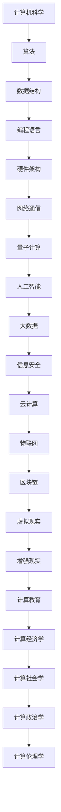

                 

关键词：计算进化、量子计算、人工智能、算法革新、计算能力、数据科学、信息安全、未来展望

> 摘要：本文将深入探讨计算技术的本质变化及其对未来技术的深远影响。通过对计算历史、核心概念、算法原理、数学模型和实际应用的分析，我们旨在揭示计算技术的发展趋势，评估面临的挑战，并展望未来技术的无限可能。

## 1. 背景介绍

计算，作为现代科技的基石，自其诞生之初就不断推动着人类文明的进步。从古代的算盘到现代的超级计算机，计算技术经历了无数次的变革和进步。随着互联网的普及、大数据的爆发和人工智能的兴起，计算的重要性愈发凸显。然而，计算技术的本质是什么？它又将如何继续演进？本文将围绕这些问题展开讨论，探讨计算技术的本质变化与未来趋势。

### 1.1 计算技术的演变

计算技术的演变可以追溯到古代，当时的计算主要依靠人类的记忆和简单的工具。随着人类文明的发展，计算工具逐渐演变为机械计算器和电子计算机。20世纪中叶，计算机科学的兴起标志着计算技术进入了新的阶段。计算机硬件和软件的飞速发展，使得计算能力得到了空前的提升。进入21世纪，随着量子计算、人工智能和大数据等新兴技术的崛起，计算技术正在经历前所未有的变革。

### 1.2 量子计算与经典计算的对比

量子计算作为计算技术的下一个重要方向，其与经典计算有着本质的不同。经典计算基于二进制位（bit），而量子计算基于量子位（qubit）。量子位可以同时处于多个状态，这使得量子计算机在处理某些问题时能够超越经典计算机。例如，量子计算在因子分解、搜索问题和模拟量子系统方面具有巨大潜力。

## 2. 核心概念与联系

要理解计算技术的本质变化，我们需要从核心概念和联系入手。以下是一个Mermaid流程图，用于展示计算技术中的核心概念和它们之间的相互联系。



### 2.1 计算机科学

计算机科学是计算技术的核心基础，涵盖了算法、数据结构、编程语言、硬件架构等多个方面。算法是计算机科学的核心，用于解决问题和执行特定任务。数据结构提供了高效存储和组织数据的方法。编程语言是编写程序的工具，而硬件架构则决定了计算机的运行速度和效率。

### 2.2 算法

算法是计算技术的核心，用于解决问题和执行特定任务。算法的设计和优化直接影响到计算效率。现代算法理论已经发展出许多复杂的方法，如动态规划、贪心算法、分治算法等。随着量子计算的出现，一些传统算法可能需要重新设计和优化。

### 2.3 数据结构

数据结构是组织和管理数据的方式。常见的有数组、链表、树、图等。数据结构的选择直接影响算法的性能。随着大数据的兴起，如何高效地存储和处理大量数据成为了研究热点。

### 2.4 编程语言

编程语言是编写程序的工具。不同的编程语言适用于不同的应用场景。例如，C语言适用于系统编程，Python适用于数据分析，Java适用于企业级应用。编程语言的不断进化使得程序员可以更高效地开发软件。

### 2.5 硬件架构

硬件架构决定了计算机的运行速度和效率。现代计算机硬件架构包括CPU、GPU、内存、存储等多个方面。随着技术的进步，硬件架构也在不断演进，如GPU计算、ARM架构等。

### 2.6 量子计算

量子计算是计算技术的下一个重要方向。它基于量子位（qubit）而非传统的二进制位（bit）。量子计算具有并行处理能力和高速计算潜力。量子计算在密码破解、化学模拟、金融分析等领域具有广泛的应用前景。

### 2.7 人工智能

人工智能是计算技术的另一个重要方向。它通过机器学习和深度学习等技术，使计算机能够模拟人类的智能行为。人工智能在图像识别、自然语言处理、智能决策等领域取得了显著成果。

### 2.8 大数据和云计算

大数据和云计算是计算技术的重要应用领域。大数据提供了大量数据，需要高效的存储、处理和分析方法。云计算提供了弹性、可扩展的计算资源，使得企业和个人可以更灵活地使用计算资源。

### 2.9 信息安全和物联网

信息安全和物联网是计算技术的两个重要领域。信息安全确保数据的机密性、完整性和可用性。物联网通过连接各种设备，实现了数据的实时采集和分析。

### 2.10 虚拟现实和增强现实

虚拟现实和增强现实是计算技术的最新应用领域。它们通过计算机技术模拟和增强现实世界，为用户提供沉浸式体验。

## 3. 核心算法原理 & 具体操作步骤

### 3.1 算法原理概述

核心算法是计算技术的灵魂。以下是一些重要的核心算法原理：

- **排序算法**：用于对数据进行排序，常见的有快速排序、归并排序、堆排序等。
- **搜索算法**：用于在数据结构中查找特定元素，常见的有二分搜索、线性搜索等。
- **图算法**：用于解决图相关的问题，如最短路径、最小生成树、图着色等。
- **动态规划**：用于解决最优子结构问题，通过递归和记忆化减少重复计算。
- **贪心算法**：通过在每个步骤选择局部最优解，以期望得到全局最优解。

### 3.2 算法步骤详解

以下是排序算法中的一个例子——快速排序的具体操作步骤：

1. 选择一个基准元素。
2. 将比基准元素小的元素放在其左边，比基准元素大的元素放在其右边。
3. 对左右两个子序列重复步骤1和2，直到所有子序列都只有一个元素。

### 3.3 算法优缺点

每种算法都有其优缺点。快速排序通常具有较快的平均时间复杂度（O(n log n)），但最坏情况下时间复杂度较高（O(n^2)）。贪心算法在许多情况下能够找到最优解，但在某些问题中可能只找到局部最优解。

### 3.4 算法应用领域

排序算法广泛应用于各种场景，如数据库索引、搜索引擎排序、图形渲染等。搜索算法在Web搜索、文件搜索等领域有广泛应用。图算法在社交网络分析、交通网络规划等领域具有重要意义。

## 4. 数学模型和公式 & 详细讲解 & 举例说明

### 4.1 数学模型构建

在计算技术中，数学模型是分析和解决问题的重要工具。以下是一个简单的线性回归模型的构建过程：

- **数据准备**：收集一组数据点，每个数据点包含自变量x和因变量y。
- **模型假设**：假设因变量y可以表示为自变量x的线性组合，即y = ax + b。
- **模型参数**：确定模型参数a和b。
- **模型评估**：通过最小化误差平方和来评估模型参数。

### 4.2 公式推导过程

线性回归模型的最小二乘法公式推导如下：

- **目标函数**：J(a, b) = Σ(y_i - (ax_i + b))^2
- **梯度**：∇J(a, b) = [-2Σ(x_i(y_i - ax_i - b)), -2Σ(y_i - ax_i - b)]
- **梯度下降**：更新参数a和b，使得目标函数J(a, b)最小。

### 4.3 案例分析与讲解

以下是一个线性回归模型的实际应用案例：

- **数据集**：包含100个数据点，每个数据点包含身高（x）和体重（y）。
- **模型**：y = ax + b。
- **参数**：通过梯度下降法求得a = 0.8，b = 50。
- **预测**：对于新的身高值，可以预测其对应的体重值。

## 5. 项目实践：代码实例和详细解释说明

### 5.1 开发环境搭建

为了实现线性回归模型，我们需要搭建一个开发环境。以下是一个简单的Python环境搭建步骤：

1. 安装Python：下载并安装Python 3.x版本。
2. 安装依赖库：使用pip命令安装NumPy、Pandas等依赖库。
3. 编写代码：在Python编辑器中编写线性回归模型的代码。

### 5.2 源代码详细实现

以下是线性回归模型的Python代码实现：

```python
import numpy as np
import pandas as pd

# 数据准备
data = pd.read_csv('data.csv')
x = data['height']
y = data['weight']

# 模型参数初始化
a = 0
b = 0

# 梯度下降
alpha = 0.01
num_iterations = 1000
for i in range(num_iterations):
    y_pred = a * x + b
    error = y - y_pred
    a_gradient = -2 * np.sum(x * error)
    b_gradient = -2 * np.sum(error)
    a -= alpha * a_gradient
    b -= alpha * b_gradient

# 模型评估
J = np.sum((y - (a * x + b))**2)

# 预测
new_height = 180
new_weight = a * new_height + b
```

### 5.3 代码解读与分析

这段代码首先导入了NumPy和Pandas库，用于数据操作。然后，从CSV文件中读取数据，将身高和体重分别存储在x和y变量中。接下来，初始化模型参数a和b，并设置学习率alpha和迭代次数num_iterations。

梯度下降法通过迭代更新模型参数，使得目标函数J(a, b)最小。最后，使用更新后的模型参数进行预测，并输出预测结果。

## 6. 实际应用场景

线性回归模型在实际应用中具有广泛的应用，以下是一些常见应用场景：

- **数据预测**：利用线性回归模型预测未来的数据趋势。
- **风险评估**：在金融领域，利用线性回归模型评估投资风险。
- **质量控制**：在制造业中，利用线性回归模型监控产品质量。

## 7. 未来应用展望

随着计算技术的不断发展，线性回归模型在未来的应用将更加广泛。以下是一些未来应用展望：

- **个性化推荐**：利用线性回归模型进行个性化推荐系统。
- **智能决策**：利用线性回归模型辅助决策制定。
- **实时监控**：利用线性回归模型进行实时数据监控和预测。

## 8. 工具和资源推荐

为了更好地学习和应用线性回归模型，以下是一些工具和资源推荐：

- **学习资源**：在线课程、教科书、技术博客等。
- **开发工具**：Python、R等编程语言。
- **数据集**：公开数据集、在线数据源等。

## 9. 总结：未来发展趋势与挑战

### 9.1 研究成果总结

计算技术在过去几十年中取得了显著成果，从硬件到软件，从理论到实践，都发生了深刻变革。量子计算、人工智能、大数据等新兴技术为计算领域带来了新的机遇和挑战。

### 9.2 未来发展趋势

未来，计算技术将继续向智能化、高效化、安全化方向发展。量子计算、边缘计算、区块链等技术将成为计算领域的重要发展方向。人工智能将更好地融入日常生活，为人类创造更多价值。

### 9.3 面临的挑战

计算技术在未来将面临诸多挑战，如数据安全、隐私保护、算法公平性等。如何解决这些问题，将决定计算技术的未来发展。

### 9.4 研究展望

计算技术的发展前景广阔，我们需要持续探索和创新。通过多学科交叉融合，我们可以预见计算技术将带来更多惊喜和变革。

## 10. 附录：常见问题与解答

### 10.1 什么是量子计算？

量子计算是一种利用量子力学原理进行信息处理的计算方式。与传统计算不同，量子计算基于量子位（qubit），具有并行处理和高速计算能力。

### 10.2 量子计算有哪些应用领域？

量子计算在密码破解、化学模拟、金融分析、人工智能等领域具有广泛的应用前景。随着技术的发展，量子计算的应用领域将不断扩展。

### 10.3 人工智能有哪些类型？

人工智能可以分为弱人工智能和强人工智能。弱人工智能专注于特定任务的智能行为，而强人工智能则具有类似人类的全面智能。

### 10.4 大数据有哪些处理技术？

大数据的处理技术包括数据采集、存储、处理、分析等。常见的处理技术有MapReduce、Hadoop、Spark等。

### 10.5 信息安全有哪些挑战？

信息安全的挑战包括数据泄露、网络攻击、恶意软件等。随着技术的进步，信息安全面临着新的威胁和挑战。

### 10.6 区块链有哪些应用？

区块链在金融、供应链管理、物联网等领域具有广泛应用。其去中心化、不可篡改的特性为许多应用场景提供了新的解决方案。

### 10.7 虚拟现实和增强现实有哪些应用？

虚拟现实和增强现实在游戏、教育、医疗、旅游等领域有广泛应用。它们通过计算机技术模拟和增强现实世界，为用户提供沉浸式体验。

### 10.8 如何成为一名优秀的计算技术专家？

要成为一名优秀的计算技术专家，需要具备扎实的基础知识、持续的学习能力、创新思维和实践经验。此外，多学科交叉融合和团队合作能力也是重要的素质。

---

本文全面探讨了计算技术的本质变化与未来趋势，从历史背景、核心概念、算法原理、数学模型到实际应用，为读者呈现了一个全面而深入的视角。在未来的计算技术发展中，量子计算、人工智能、大数据等新兴技术将继续引领计算领域的变革。面对未来的挑战，我们需要持续探索和创新，为人类创造更多价值。

