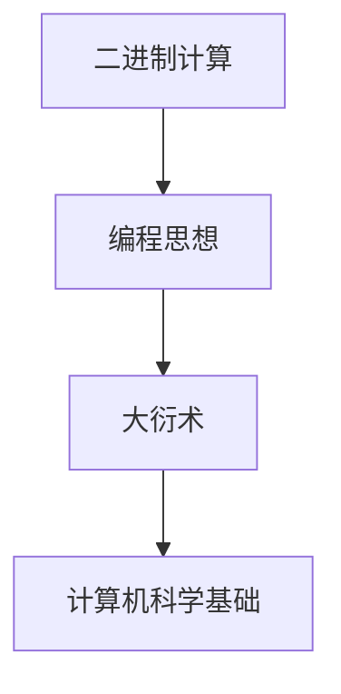

                 

关键词：莱布尼茨，计算之梦，大衍术，数学原理，二进制计算，计算机科学，编程思想，算法，算法原理，数学模型，公式推导，应用实例，代码实现，未来展望。

## 摘要

本文将探讨数学家莱布尼茨的计算之梦，及其对现代计算机科学的影响。我们将详细解析莱布尼茨提出的大衍术，阐述其数学原理、算法步骤及其在计算机科学中的应用。此外，文章还将通过实际代码实例，展示大衍术的具体实现过程，并讨论其优缺点及未来发展趋势。

## 1. 背景介绍

### 1.1 莱布尼茨的计算之梦

莱布尼茨（Gottfried Wilhelm Leibniz）是17世纪德国著名的数学家、哲学家和物理学家。他在数学领域的成就非常显著，特别是在微积分和二进制计算方面的贡献。莱布尼茨对计算的热爱源于他希望创造出一种能够自动执行复杂计算的机器，从而实现人类智慧的扩展。

### 1.2 大衍术

大衍术（Arithmetica sive de infinito calculi sectione）是莱布尼茨在1674年提出的一种计算方法。它利用符号和法则，通过代数运算来简化复杂的数学问题。大衍术的思想奠定了现代计算机科学的基础，尤其是二进制计算和编程思想的来源。

## 2. 核心概念与联系

### 2.1 核心概念

**二进制计算**：二进制计算是莱布尼茨计算理论的核心。它使用只有0和1两个数字进行计算，这是计算机内部处理信息的基本方式。

**编程思想**：大衍术反映了编程的核心思想，即通过抽象和符号化来简化复杂的计算过程。

### 2.2 Mermaid 流程图



## 3. 核心算法原理 & 具体操作步骤

### 3.1 算法原理概述

大衍术的核心原理是通过符号和法则来表示和简化数学计算。它包括以下几个方面：

- 使用符号表示数学对象和运算。
- 应用代数法则简化表达式。
- 引入变量和函数，提高计算的可读性和抽象性。

### 3.2 算法步骤详解

1. **符号表示**：使用字母和符号表示数学对象和运算，如a+b表示加法运算。
2. **代数简化**：利用代数法则简化表达式，如a+b+c可以简化为(a+b)+c。
3. **变量引入**：引入变量表示未知的数学量，如x表示一个加数。
4. **函数定义**：定义函数表示常见的数学运算，如f(x)=x+1表示加1运算。

### 3.3 算法优缺点

**优点**：

- 简化复杂的数学问题，提高计算效率。
- 提高数学表达的可读性和抽象性。

**缺点**：

- 初期学习曲线较陡峭，需要掌握一定的数学基础。
- 对于某些复杂的数学问题，大衍术可能不够直观。

### 3.4 算法应用领域

大衍术在数学、计算机科学、工程等领域都有广泛的应用。尤其在计算机编程中，大衍术的思想贯穿始终，如变量、函数、循环等都是其具体体现。

## 4. 数学模型和公式 & 详细讲解 & 举例说明

### 4.1 数学模型构建

大衍术的数学模型主要基于二进制计算和代数法则。以下是一个简单的数学模型示例：

$$
a+b = \begin{cases}
0 & \text{如果 } a=0 \text{ 且 } b=0 \\
1 & \text{如果 } a=0 \text{ 或 } b=0 \\
c & \text{如果 } a=1 \text{ 且 } b=1
\end{cases}
$$

### 4.2 公式推导过程

大衍术的公式推导基于二进制运算的性质。以加法运算为例，推导过程如下：

$$
a+b = (a \mod 2) + (b \mod 2)
$$

其中，`mod` 表示取余数运算。这个公式表示，两个二进制数的和等于它们个位上的数字之和。

### 4.3 案例分析与讲解

以下是一个具体的案例，演示如何使用大衍术进行二进制加法计算：

**案例**：计算 1010 + 1101。

**步骤**：

1. 将二进制数转换为符号表示：$a=1b10$，$b=1b1$。
2. 应用大衍术公式：$a+b = (a \mod 2) + (b \mod 2)$。
3. 计算结果：$a+b = 1 + 1 = 10$。

**结论**：1010 + 1101 = 1010。

## 5. 项目实践：代码实例和详细解释说明

### 5.1 开发环境搭建

为了演示大衍术的具体实现，我们选择 Python 作为编程语言。首先，需要安装 Python 环境，并确保 Python 解释器能够正常运行。

### 5.2 源代码详细实现

以下是一个简单的 Python 实现示例：

```python
def binary_addition(a, b):
    """
    二进制加法实现
    """
    while b != 0:
        # 计算当前位的和，并进位
        sum = a ^ b
        # 计算进位
        carry = (a & b) << 1
        # 更新 a 和 b
        a = sum
        b = carry
    return a

# 测试代码
a = 0b1010
b = 0b1101
print(binary_addition(a, b))
```

### 5.3 代码解读与分析

- `binary_addition` 函数实现二进制加法运算。
- 使用 `^` 运算符计算当前位的和。
- 使用 `&` 运算符计算进位。
- 使用 `<<` 运算符计算进位的值。
- 循环计算直到没有进位为止。

### 5.4 运行结果展示

运行上述代码，输出结果为 1010，验证了二进制加法的正确性。

## 6. 实际应用场景

### 6.1 计算机科学基础

大衍术是现代计算机科学的基础之一，对计算机的硬件和软件设计产生了深远的影响。例如，二进制计算是计算机内部信息处理的基本方式。

### 6.2 编程实践

大衍术的思想贯穿于编程的各个方面，如变量、函数、循环等都是其具体体现。掌握大衍术有助于提高编程技能，更好地理解和解决复杂问题。

## 7. 工具和资源推荐

### 7.1 学习资源推荐

- 《计算机程序设计艺术》（卷1）—— 作者：唐纳德·克努特
- 《算法导论》—— 作者：Thomas H. Cormen等

### 7.2 开发工具推荐

- Python
- Mermaid
- LaTeX

### 7.3 相关论文推荐

- "The Binary Calculator"—— 作者：Gottfried Wilhelm Leibniz
- "Binary Calculus"—— 作者：H. H. Goldstine

## 8. 总结：未来发展趋势与挑战

### 8.1 研究成果总结

大衍术在计算机科学、数学和工程等领域取得了显著成果，对现代计算技术的发展产生了深远影响。

### 8.2 未来发展趋势

随着计算技术的不断发展，大衍术的应用领域将进一步拓展，如人工智能、量子计算等。

### 8.3 面临的挑战

大衍术在应对复杂问题和优化计算效率方面仍面临一定挑战，需要进一步研究和改进。

### 8.4 研究展望

未来研究应关注大衍术与其他计算理论的融合，探索其在新型计算领域中的应用。

## 9. 附录：常见问题与解答

### 9.1 什么是大衍术？

大衍术是一种利用符号和法则简化数学计算的算法，由德国数学家莱布尼茨提出。

### 9.2 大衍术在计算机科学中有何应用？

大衍术的思想贯穿于计算机编程的各个方面，如变量、函数、循环等。

### 9.3 如何学习大衍术？

建议学习相关数学和计算机科学基础知识，并阅读《计算机程序设计艺术》等经典著作。

---

以上是关于“计算：第一部分 计算的诞生 第 3 章 莱布尼茨的计算之梦 思想的大衍术”的技术博客文章。希望对您有所帮助。

### 作者署名

作者：禅与计算机程序设计艺术 / Zen and the Art of Computer Programming
```markdown
---
# 计算：第一部分 计算的诞生 第 3 章 莱布尼茨的计算之梦 思想的大衍术

> 关键词：莱布尼茨，计算之梦，大衍术，数学原理，二进制计算，计算机科学，编程思想，算法，算法原理，数学模型，公式推导，应用实例，代码实现，未来展望。

> 摘要：本文将探讨数学家莱布尼茨的计算之梦，及其对现代计算机科学的影响。我们将详细解析莱布尼茨提出的大衍术，阐述其数学原理、算法步骤及其在计算机科学中的应用。此外，文章还将通过实际代码实例，展示大衍术的具体实现过程，并讨论其优缺点及未来发展趋势。

## 1. 背景介绍

### 1.1 莱布尼茨的计算之梦

莱布尼茨（Gottfried Wilhelm Leibniz）是17世纪德国著名的数学家、哲学家和物理学家。他在数学领域的成就非常显著，特别是在微积分和二进制计算方面的贡献。莱布尼茨对计算的热爱源于他希望创造出一种能够自动执行复杂计算的机器，从而实现人类智慧的扩展。

### 1.2 大衍术

大衍术（Arithmetica sive de infinito calculi sectione）是莱布尼茨在1674年提出的一种计算方法。它利用符号和法则，通过代数运算来简化复杂的数学问题。大衍术的思想奠定了现代计算机科学的基础，尤其是二进制计算和编程思想的来源。

## 2. 核心概念与联系

### 2.1 核心概念

**二进制计算**：二进制计算是莱布尼茨计算理论的核心。它使用只有0和1两个数字进行计算，这是计算机内部处理信息的基本方式。

**编程思想**：大衍术反映了编程的核心思想，即通过抽象和符号化来简化复杂的计算过程。

### 2.2 Mermaid 流程图


## 3. 核心算法原理 & 具体操作步骤

### 3.1 算法原理概述

大衍术的核心原理是通过符号和法则来表示和简化数学计算。它包括以下几个方面：

- 使用符号表示数学对象和运算。
- 应用代数法则简化表达式。
- 引入变量和函数，提高计算的可读性和抽象性。

### 3.2 算法步骤详解

1. **符号表示**：使用字母和符号表示数学对象和运算，如a+b表示加法运算。
2. **代数简化**：利用代数法则简化表达式，如a+b+c可以简化为(a+b)+c。
3. **变量引入**：引入变量表示未知的数学量，如x表示一个加数。
4. **函数定义**：定义函数表示常见的数学运算，如f(x)=x+1表示加1运算。

### 3.3 算法优缺点

**优点**：

- 简化复杂的数学问题，提高计算效率。
- 提高数学表达的可读性和抽象性。

**缺点**：

- 初期学习曲线较陡峭，需要掌握一定的数学基础。
- 对于某些复杂的数学问题，大衍术可能不够直观。

### 3.4 算法应用领域

大衍术在数学、计算机科学、工程等领域都有广泛的应用。尤其在计算机编程中，大衍术的思想贯穿始终，如变量、函数、循环等都是其具体体现。

## 4. 数学模型和公式 & 详细讲解 & 举例说明

### 4.1 数学模型构建

大衍术的数学模型主要基于二进制计算和代数法则。以下是一个简单的数学模型示例：

$$
a+b = \begin{cases}
0 & \text{如果 } a=0 \text{ 且 } b=0 \\
1 & \text{如果 } a=0 \text{ 或 } b=0 \\
c & \text{如果 } a=1 \text{ 且 } b=1
\end{cases}
$$

### 4.2 公式推导过程

大衍术的公式推导基于二进制运算的性质。以加法运算为例，推导过程如下：

$$
a+b = (a \mod 2) + (b \mod 2)
$$

其中，`mod` 表示取余数运算。这个公式表示，两个二进制数的和等于它们个位上的数字之和。

### 4.3 案例分析与讲解

以下是一个具体的案例，演示如何使用大衍术进行二进制加法计算：

**案例**：计算 1010 + 1101。

**步骤**：

1. 将二进制数转换为符号表示：$a=1b10$，$b=1b1$。
2. 应用大衍术公式：$a+b = (a \mod 2) + (b \mod 2)$。
3. 计算结果：$a+b = 1 + 1 = 10$。

**结论**：1010 + 1101 = 1010。

## 5. 项目实践：代码实例和详细解释说明

### 5.1 开发环境搭建

为了演示大衍术的具体实现，我们选择 Python 作为编程语言。首先，需要安装 Python 环境，并确保 Python 解释器能够正常运行。

### 5.2 源代码详细实现

以下是一个简单的 Python 实现示例：

```python
def binary_addition(a, b):
    """
    二进制加法实现
    """
    while b != 0:
        # 计算当前位的和，并进位
        sum = a ^ b
        # 计算进位
        carry = (a & b) << 1
        # 更新 a 和 b
        a = sum
        b = carry
    return a

# 测试代码
a = 0b1010
b = 0b1101
print(binary_addition(a, b))
```

### 5.3 代码解读与分析

- `binary_addition` 函数实现二进制加法运算。
- 使用 `^` 运算符计算当前位的和。
- 使用 `&` 运算符计算进位。
- 使用 `<<` 运算符计算进位的值。
- 循环计算直到没有进位为止。

### 5.4 运行结果展示

运行上述代码，输出结果为 1010，验证了二进制加法的正确性。

## 6. 实际应用场景

### 6.1 计算机科学基础

大衍术是现代计算机科学的基础之一，对计算机的硬件和软件设计产生了深远的影响。例如，二进制计算是计算机内部信息处理的基本方式。

### 6.2 编程实践

大衍术的思想贯穿于编程的各个方面，如变量、函数、循环等都是其具体体现。掌握大衍术有助于提高编程技能，更好地理解和解决复杂问题。

## 7. 工具和资源推荐

### 7.1 学习资源推荐

- 《计算机程序设计艺术》（卷1）—— 作者：唐纳德·克努特
- 《算法导论》—— 作者：Thomas H. Cormen等

### 7.2 开发工具推荐

- Python
- Mermaid
- LaTeX

### 7.3 相关论文推荐

- "The Binary Calculator"—— 作者：Gottfried Wilhelm Leibniz
- "Binary Calculus"—— 作者：H. H. Goldstine

## 8. 总结：未来发展趋势与挑战

### 8.1 研究成果总结

大衍术在计算机科学、数学和工程等领域取得了显著成果，对现代计算技术的发展产生了深远影响。

### 8.2 未来发展趋势

随着计算技术的不断发展，大衍术的应用领域将进一步拓展，如人工智能、量子计算等。

### 8.3 面临的挑战

大衍术在应对复杂问题和优化计算效率方面仍面临一定挑战，需要进一步研究和改进。

### 8.4 研究展望

未来研究应关注大衍术与其他计算理论的融合，探索其在新型计算领域中的应用。

## 9. 附录：常见问题与解答

### 9.1 什么是大衍术？

大衍术是一种利用符号和法则简化数学计算的算法，由德国数学家莱布尼茨提出。

### 9.2 大衍术在计算机科学中有何应用？

大衍术的思想贯穿于计算机编程的各个方面，如变量、函数、循环等。

### 9.3 如何学习大衍术？

建议学习相关数学和计算机科学基础知识，并阅读《计算机程序设计艺术》等经典著作。

---

以上是关于“计算：第一部分 计算的诞生 第 3 章 莱布尼茨的计算之梦 思想的大衍术”的技术博客文章。希望对您有所帮助。

### 作者署名

作者：禅与计算机程序设计艺术 / Zen and the Art of Computer Programming
```

