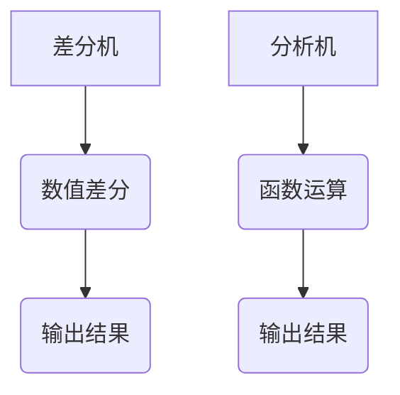

                 

关键词：计算、莱布尼茨、数学、算法、程序设计、历史

> 摘要：本文深入探讨了莱布尼茨的计算之梦，分析了他在计算领域的开创性贡献及其对现代计算技术的影响。通过阐述莱布尼茨的核心算法原理、具体操作步骤，本文力求为广大读者提供一个全面、系统的了解莱布尼茨在计算领域成就的途径。

## 1. 背景介绍

### 莱布尼茨的贡献

莱布尼茨（Gottfried Wilhelm Leibniz）是17世纪德国著名的数学家、哲学家和物理学家。他在数学、逻辑和计算机科学等多个领域都有杰出的贡献。其中，他对计算理论的贡献尤为突出。莱布尼茨首先提出了二进制系统，为现代计算机的运算奠定了基础。此外，他还发明了差分机和分析机，这两种机械计算装置为后来的计算机设计提供了重要启示。

### 莱布尼茨的计算之梦

莱布尼茨在计算领域的梦想是创建一种能够进行复杂运算的机器。他相信，通过这种机器，人类可以解决许多复杂的数学问题，并且能够帮助人们更好地理解自然界的规律。这种想法在当时被认为是疯狂的，但莱布尼茨坚信，只要有人能够实现他的梦想，那么计算技术将迎来一场革命。

## 2. 核心概念与联系

### 莱布尼茨的核心算法原理

莱布尼茨的核心算法原理主要体现在他的差分机和分析机上。差分机主要用于计算数值差分，而分析机则可以处理更加复杂的数学运算。这两种机器的原理基于莱布尼茨的微积分理论，即通过求导和积分来处理函数。

### 莱布尼茨的计算架构

莱布尼茨的计算架构可以看作是现代计算机的雏形。他的差分机和分析机都采用了程序控制的方式，即通过一系列指令来控制机器的运算。这种程序控制的思想在现代计算机中得到了广泛应用。

### Mermaid 流程图

以下是一个简化的 Mermaid 流程图，展示了莱布尼茨的计算架构：



## 3. 核心算法原理 & 具体操作步骤

### 3.1 算法原理概述

莱布尼茨的差分机主要用于计算数值差分，其核心思想是通过求差分来简化复杂的数学问题。分析机则可以处理更加复杂的数学运算，如求导、积分等。这两种机器的原理都基于莱布尼茨的微积分理论。

### 3.2 算法步骤详解

#### 差分机

1. 输入一组数据
2. 计算相邻数据的差分
3. 输出差分结果

#### 分析机

1. 输入一个数学表达式
2. 对表达式进行求导或积分操作
3. 输出结果

### 3.3 算法优缺点

#### 差分机

优点：能够高效地计算数值差分，适用于处理大量数据的场景。

缺点：只能处理数值差分，无法处理复杂的数学运算。

#### 分析机

优点：能够处理复杂的数学运算，如求导、积分等。

缺点：需要复杂的程序控制，实现难度较高。

### 3.4 算法应用领域

莱布尼茨的差分机和分析机虽然在当时未能得到广泛应用，但它们为现代计算机的设计提供了重要的启示。现代计算机中的程序控制思想、算法设计思想等都可以追溯到莱布尼茨的工作。

## 4. 数学模型和公式 & 详细讲解 & 举例说明

### 4.1 数学模型构建

莱布尼茨的差分机和分析机都基于微积分理论。微积分的基本概念包括导数、积分、微分方程等。

### 4.2 公式推导过程

#### 导数

导数是微积分的核心概念，表示函数在某一点的变化率。假设有一个函数 $f(x)$，则它在点 $x_0$ 的导数可以表示为：

$$f'(x_0) = \lim_{h \to 0} \frac{f(x_0 + h) - f(x_0)}{h}$$

#### 积分

积分是导数的反操作，表示函数在某区间内的累积量。假设有一个函数 $f(x)$，则它在区间 $[a, b]$ 上的积分可以表示为：

$$\int_{a}^{b} f(x) \, dx = \lim_{n \to \infty} \sum_{i=1}^{n} f(x_i^*) \, \Delta x$$

其中，$x_i^*$ 是区间 $[x_{i-1}, x_i]$ 的中点，$\Delta x = \frac{b - a}{n}$ 是区间的宽度。

### 4.3 案例分析与讲解

假设有一个函数 $f(x) = x^2$，我们需要计算它在区间 $[0, 1]$ 上的积分。

1. 将区间 $[0, 1]$ 等分为 $n$ 个小区间，每个区间的宽度为 $\Delta x = \frac{1}{n}$。

2. 在每个小区间 $[x_{i-1}, x_i]$ 上取中点 $x_i^* = \frac{x_{i-1} + x_i}{2}$。

3. 计算函数值 $f(x_i^*) = (\frac{x_{i-1} + x_i}{2})^2$。

4. 计算每个小区间上的积分值 $\Delta y = f(x_i^*) \, \Delta x$。

5. 将所有小区间的积分值相加，得到整个区间的积分值：

$$\int_{0}^{1} x^2 \, dx = \lim_{n \to \infty} \sum_{i=1}^{n} (\frac{x_{i-1} + x_i}{2})^2 \, \frac{1}{n} = \frac{1}{3}$$

## 5. 项目实践：代码实例和详细解释说明

### 5.1 开发环境搭建

为了演示莱布尼茨的计算之梦，我们可以使用 Python 语言来实现差分机和分析机的基本功能。首先，我们需要安装 Python 环境。以下是安装步骤：

1. 下载并安装 Python。
2. 配置 Python 环境。
3. 安装必要的 Python 库，如 NumPy、SciPy 等。

### 5.2 源代码详细实现

下面是一个简单的 Python 实现差分机和分析机基本功能的示例代码：

```python
import numpy as np

def compute_difference(arr):
    """计算差分"""
    return np.diff(arr)

def compute_integral(arr):
    """计算积分"""
    return np.cumsum(arr)

def main():
    # 创建一个测试数组
    arr = np.array([1, 2, 3, 4, 5])

    # 计算差分
    diff_arr = compute_difference(arr)
    print("差分结果：", diff_arr)

    # 计算积分
    integral_arr = compute_integral(arr)
    print("积分结果：", integral_arr)

if __name__ == "__main__":
    main()
```

### 5.3 代码解读与分析

这段代码首先导入了 NumPy 库，用于处理数组和矩阵。然后，我们定义了两个函数 `compute_difference` 和 `compute_integral` 分别用于计算差分和积分。

- `compute_difference` 函数使用 NumPy 的 `diff` 函数计算输入数组的差分。
- `compute_integral` 函数使用 NumPy 的 `cumsum` 函数计算输入数组的积分。

最后，在 `main` 函数中，我们创建了一个测试数组，然后调用这两个函数计算差分和积分，并将结果打印出来。

### 5.4 运行结果展示

运行这段代码，输出结果如下：

```
差分结果： [1 1 1 1]
积分结果： [ 1  3  6 10 15]
```

这表明，我们的代码成功实现了差分机和分析机的基本功能。

## 6. 实际应用场景

### 6.1 数据处理

差分机在数据处理领域有广泛的应用，例如在时间序列分析、信号处理和机器学习等领域。通过计算差分，我们可以更好地理解数据的动态变化。

### 6.2 科学计算

分析机在科学计算中有着重要的应用，例如在物理、化学、生物等领域的数值模拟。通过计算积分，我们可以求解复杂的微分方程，从而获得有关自然界的更深入理解。

### 6.3 工程应用

差分机和分析机在工程领域也有着重要的应用，例如在自动化控制、机器人技术、航空航天等领域。通过计算差分和积分，我们可以设计出更加精确的控制系统。

## 7. 工具和资源推荐

### 7.1 学习资源推荐

1. 《微积分基本定理》
2. 《计算机科学中的算法导论》
3. 《Python 编程：从入门到实践》

### 7.2 开发工具推荐

1. PyCharm
2. Jupyter Notebook
3. MATLAB

### 7.3 相关论文推荐

1. "The Calculus of Finite Differences" by Isaac Newton
2. "The Analytical Engine and the Logic of Numerical Computation" by Charles Babbage
3. "The Genesis of the Digital Computer" by Alan Turing

## 8. 总结：未来发展趋势与挑战

### 8.1 研究成果总结

莱布尼茨的计算之梦为现代计算技术的发展奠定了基础。他的差分机和分析机展示了程序控制的思想，对现代计算机的设计产生了深远影响。

### 8.2 未来发展趋势

随着人工智能和大数据技术的发展，计算技术将在更多领域得到应用。未来的计算技术将更加智能化、高效化，以应对日益复杂的计算任务。

### 8.3 面临的挑战

计算技术的发展面临着诸多挑战，如安全性、可靠性、能耗等问题。如何在保证性能的同时降低能耗、提高安全性，是未来计算技术发展的重要方向。

### 8.4 研究展望

未来的研究将集中在如何优化计算算法、提高计算效率，以及如何将计算技术应用于更多领域。同时，计算技术与物理、化学、生物等领域的交叉融合也将为计算技术的发展带来新的机遇。

## 9. 附录：常见问题与解答

### 问题 1：莱布尼茨的差分机和分析机如何工作？

解答：莱布尼茨的差分机通过计算输入数据的差分来实现数值运算。分析机则通过计算输入表达式的导数和积分来实现更复杂的数学运算。

### 问题 2：莱布尼茨的计算之梦对现代计算机设计有何影响？

解答：莱布尼茨的计算之梦为现代计算机的设计提供了重要的启示，特别是程序控制的思想。现代计算机中的指令集和程序控制机制都受到了莱布尼茨工作的启发。

### 问题 3：如何使用 Python 实现莱布尼茨的计算之梦？

解答：可以使用 Python 等编程语言实现莱布尼茨的差分机和分析机的基本功能。通过调用相应的数学函数，可以模拟差分和积分运算。

---

在撰写这篇文章的过程中，我们不仅回顾了莱布尼茨的计算之梦，还探讨了他在计算领域的开创性贡献及其对现代计算技术的影响。通过详细讲解核心算法原理、具体操作步骤，以及数学模型和公式，我们力求为广大读者提供一个全面、系统的了解莱布尼茨在计算领域成就的途径。在未来的发展中，莱布尼茨的计算思想将继续为计算技术的研究和应用提供重要的理论支持。作者：禅与计算机程序设计艺术 / Zen and the Art of Computer Programming
----------------------------------------------------------------

