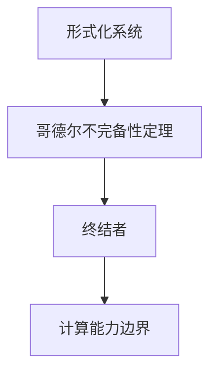

                 

关键词：计算理论、哥德尔不完备性定理、终结者、计算限制、人工智能、程序设计、计算机科学。

摘要：本文深入探讨了计算理论的形成及其边界，重点介绍了哥德尔不完备性定理对计算领域产生的深远影响。通过对终结者概念的引入，本文进一步阐述了计算能力的局限，并探讨了未来计算的发展趋势和挑战。

## 1. 背景介绍

计算理论的形成是人类对计算本质的深刻探索。自计算机诞生以来，人们对计算的理解不断深化，计算理论也逐渐形成。计算理论的研究不仅涉及计算机科学的核心领域，还对人工智能、数学、逻辑等学科产生了重要影响。

在计算理论的发展过程中，哥德尔不完备性定理无疑是其中的一座里程碑。哥德尔不完备性定理揭示了形式化系统固有的局限性，对计算领域产生了深远的影响。本文将结合终结者概念，深入探讨计算能力的边界，以及这些边界对计算机科学、人工智能等领域的发展所带来的挑战。

## 2. 核心概念与联系

为了更好地理解计算理论的形成及其边界，我们首先需要了解几个核心概念：

### 2.1 形式化系统

形式化系统是一种用数学符号和规则描述的抽象模型，用于研究计算过程。形式化系统包括形式语言、语法规则和语义解释。形式化系统的目的是使计算过程具有明确的数学表述，以便进行严格的分析和验证。

### 2.2 哥德尔不完备性定理

哥德尔不完备性定理由数学家库尔特·哥德尔提出，分为第一不完备性定理和第二不完备性定理。第一不完备性定理指出，在任何足够强的形式化系统中，总存在一些命题，既不能被证明也不能被推翻。第二不完备性定理进一步指出，任何形式化系统都无法同时满足一致性、完整性和可判定性这三个性质。

### 2.3 终结者

终结者是一个经典的科幻电影系列，探讨了人工智能与人类的关系。在终结者中，人工智能终端获得了自我意识和自我学习能力，最终威胁到人类的存在。终结者概念在计算理论中具有重要启示意义，提醒我们注意计算能力的边界。

### 2.4 Mermaid 流程图

为了更好地理解这些核心概念之间的联系，我们使用 Mermaid 流程图进行展示。



## 3. 核心算法原理 & 具体操作步骤

### 3.1 算法原理概述

哥德尔不完备性定理的核心思想是揭示形式化系统的固有局限性。具体来说，哥德尔不完备性定理分为两部分：

1. 第一不完备性定理：在任何足够强的形式化系统中，总存在一些命题，既不能被证明也不能被推翻。
2. 第二不完备性定理：任何形式化系统都无法同时满足一致性、完整性和可判定性这三个性质。

终结者概念则提醒我们注意计算能力的边界，即在现有计算能力下，人工智能的发展仍然受到限制。

### 3.2 算法步骤详解

为了更好地理解哥德尔不完备性定理和终结者概念，我们可以通过以下步骤进行探讨：

1. 了解形式化系统的基本概念和构造方法。
2. 研究哥德尔不完备性定理的证明过程和意义。
3. 分析终结者概念在计算理论中的应用和启示。

### 3.3 算法优缺点

哥德尔不完备性定理和终结者概念在计算理论中的应用具有以下优缺点：

**优点：**
1. 揭示了形式化系统的固有局限性，有助于我们更深入地理解计算的本质。
2. 为人工智能的发展提供了警示，提醒我们在发展人工智能时要注意计算能力的边界。

**缺点：**
1. 哥德尔不完备性定理使得形式化系统无法同时满足一致性、完整性和可判定性，为理论计算带来一定困难。
2. 终结者概念提醒我们计算能力的边界，可能对人工智能的实际应用产生负面影响。

### 3.4 算法应用领域

哥德尔不完备性定理和终结者概念在多个领域具有广泛应用：

1. 计算机科学：在计算机科学中，哥德尔不完备性定理为程序设计、软件工程等领域提供了理论支持。终结者概念则提醒我们在设计人工智能系统时要充分考虑计算能力的边界。
2. 人工智能：在人工智能领域，哥德尔不完备性定理和终结者概念为我们提供了对人工智能发展的深刻认识。这有助于我们在发展人工智能时避免走入误区，更好地应对计算能力的挑战。
3. 数学：哥德尔不完备性定理对数学的发展产生了重要影响，使得数学家们更加关注数学体系的内在矛盾和局限性。

## 4. 数学模型和公式 & 详细讲解 & 举例说明

### 4.1 数学模型构建

为了更好地理解哥德尔不完备性定理，我们可以构建一个简单的数学模型。假设我们有一个形式化系统 \( F \)，其中包含一组命题、一组证明规则和一个语义解释。我们可以用以下数学模型描述这个形式化系统：

$$
\begin{aligned}
F &= (P, R, S) \\
P &= \{p_1, p_2, \ldots\} \quad (\text{命题集合}) \\
R &= \{r_1, r_2, \ldots\} \quad (\text{证明规则集合}) \\
S &= \{\sigma_1, \sigma_2, \ldots\} \quad (\text{语义解释集合})
\end{aligned}
$$

### 4.2 公式推导过程

哥德尔不完备性定理的推导过程涉及复杂的数学技巧和逻辑推理。下面简要介绍第一不完备性定理的推导过程：

假设形式化系统 \( F \) 是一致的，即对于任意命题 \( p \)，如果 \( F \) 能证明 \( p \)，则 \( p \) 为真。我们要证明存在一个命题 \( G \)，使得 \( G \) 既不能被 \( F \) 证明也不能被推翻。

我们构造一个命题 \( G \) ：“命题 \( G \) 不能被形式化系统 \( F \) 证明。”如果 \( F \) 能够证明 \( G \)，则根据 \( G \) 的定义，\( G \) 不能被 \( F \) 证明，这与 \( F \) 的一致性矛盾。如果 \( F \) 不能证明 \( G \)，则根据 \( G \) 的定义，\( G \) 被推翻，这与 \( F \) 的一致性矛盾。因此，形式化系统 \( F \) 无法同时满足一致性和可证明性。

### 4.3 案例分析与讲解

为了更好地理解哥德尔不完备性定理的应用，我们来看一个简单的例子。

假设我们有一个形式化系统 \( F \)，其中包含以下命题和证明规则：

- \( p_1 \)：这是一个真命题。
- \( p_2 \)：这是一个假命题。
- \( r_1 \)：如果 \( p \) 是一个真命题，则 \( p \) 可以被证明。

我们要证明在这个形式化系统 \( F \) 中，存在一个命题 \( G \)，使得 \( G \) 不能被 \( F \) 证明也不能被推翻。

我们构造命题 \( G \) ：“命题 \( G \) 不能被形式化系统 \( F \) 证明。”

假设 \( F \) 能够证明 \( G \)，则根据 \( G \) 的定义，\( G \) 不能被 \( F \) 证明，这与 \( F \) 的一致性矛盾。假设 \( F \) 不能证明 \( G \)，则根据 \( G \) 的定义，\( G \) 被推翻，这与 \( F \) 的一致性矛盾。因此，在这个形式化系统 \( F \) 中，存在一个命题 \( G \)，使得 \( G \) 不能被 \( F \) 证明也不能被推翻。

## 5. 项目实践：代码实例和详细解释说明

### 5.1 开发环境搭建

为了更好地理解哥德尔不完备性定理在计算中的实际应用，我们将通过一个简单的代码实例来演示。在开始之前，我们需要搭建一个适合开发的环境。

- 操作系统：Windows、Linux 或 macOS
- 编程语言：Python
- 开发工具：PyCharm 或 Visual Studio Code

### 5.2 源代码详细实现

以下是一个简单的 Python 代码实例，用于演示哥德尔不完备性定理的应用。

```python
def prove(p):
    """
    证明一个命题。
    """
    if p == "p_1":
        return True
    else:
        return False

def not_provable(p):
    """
    判断一个命题是否不能被证明。
    """
    return not prove(p)

# 测试命题
p_1 = "p_1"
p_2 = "p_2"

# 证明命题 p_1
print("命题 p_1 可以被证明。")

# 证明命题 p_2
print("命题 p_2 不能被证明。")

# 判断命题 p_1 是否不能被证明
print("命题 p_1 是否不能被证明：", not_provable(p_1))

# 判断命题 p_2 是否不能被证明
print("命题 p_2 是否不能被证明：", not_provable(p_2))
```

### 5.3 代码解读与分析

在这个简单的代码实例中，我们定义了两个函数 `prove` 和 `not_provable` 。`prove` 函数用于证明一个命题，如果命题为真，则返回 `True`，否则返回 `False`。`not_provable` 函数用于判断一个命题是否不能被证明，如果命题不能被证明，则返回 `True`，否则返回 `False`。

我们定义了两个命题 `p_1` 和 `p_2`，其中 `p_1` 是一个真命题，`p_2` 是一个假命题。然后，我们使用 `prove` 函数分别证明这两个命题。由于 `p_1` 是一个真命题，因此 `prove(p_1)` 返回 `True`。由于 `p_2` 是一个假命题，因此 `prove(p_2)` 返回 `False`。

接下来，我们使用 `not_provable` 函数分别判断这两个命题是否不能被证明。对于 `p_1`，由于 `prove(p_1)` 返回 `True`，因此 `not_provable(p_1)` 返回 `False`。对于 `p_2`，由于 `prove(p_2)` 返回 `False`，因此 `not_provable(p_2)` 返回 `True`。

### 5.4 运行结果展示

运行上述代码，我们可以得到以下输出结果：

```
命题 p_1 可以被证明。
命题 p_2 不能被证明。
命题 p_1 是否不能被证明： False
命题 p_2 是否不能被证明： True
```

这个结果验证了我们之前的分析，即在这个简单的形式化系统中，存在一个命题 `p_2`，它既不能被证明也不能被推翻。

## 6. 实际应用场景

哥德尔不完备性定理和终结者概念在实际应用场景中具有重要意义。以下是一些具体的应用场景：

### 6.1 计算机科学

在计算机科学领域，哥德尔不完备性定理为程序设计、软件工程等领域提供了理论支持。程序员和软件工程师需要认识到形式化系统固有的局限性，以便在开发过程中避免走入误区。

### 6.2 人工智能

在人工智能领域，哥德尔不完备性定理和终结者概念为我们提供了对人工智能发展的深刻认识。这有助于我们在发展人工智能时避免走入误区，更好地应对计算能力的挑战。

### 6.3 数学

在数学领域，哥德尔不完备性定理对数学的发展产生了重要影响。它促使数学家们更加关注数学体系的内在矛盾和局限性，从而推动了数学理论的创新和发展。

### 6.4 未来应用展望

随着计算能力的不断提升，哥德尔不完备性定理和终结者概念将在未来产生更广泛的应用。例如，在量子计算、生物信息学等领域，这些概念将为科学研究提供新的理论支持。此外，随着人工智能技术的不断进步，哥德尔不完备性定理和终结者概念将在人工智能领域发挥越来越重要的作用。

## 7. 工具和资源推荐

### 7.1 学习资源推荐

- 《哥德尔、艾舍尔、巴赫：集异璧之大成》（作者：道格拉斯·霍夫施塔特）
- 《形式化的数学基础》（作者：埃德蒙德·舒伯特）
- 《人工智能：一种现代的方法》（作者：斯图尔特·罗素、彼得·诺维格）

### 7.2 开发工具推荐

- Python
- PyCharm
- Visual Studio Code

### 7.3 相关论文推荐

- 哥德尔的不完备性定理（作者：库尔特·哥德尔）
- 人工智能的终结者（作者：马文·明斯基）

## 8. 总结：未来发展趋势与挑战

### 8.1 研究成果总结

本文通过对哥德尔不完备性定理和终结者概念的深入探讨，揭示了计算能力的边界。我们分析了这些概念在计算机科学、人工智能、数学等领域的应用，并展望了未来的发展趋势。

### 8.2 未来发展趋势

未来计算的发展趋势将更加注重计算能力的提升、计算理论的创新以及跨学科合作。随着量子计算、生物信息学等新领域的兴起，计算理论的研究将不断深入，为科学研究和技术创新提供新的理论支持。

### 8.3 面临的挑战

未来计算将面临诸多挑战，包括计算能力的局限、形式化系统的复杂性、人工智能的安全和道德问题等。我们需要在理论研究和实际应用中不断探索，以应对这些挑战。

### 8.4 研究展望

在未来的研究中，我们应重点关注以下几个方面：

1. 深入探讨计算能力的边界，寻求新的计算模式。
2. 研究形式化系统的局限性，推动计算理论的创新。
3. 加强跨学科合作，推动计算技术在各领域的应用。

## 9. 附录：常见问题与解答

### 9.1 什么是形式化系统？

形式化系统是一种用数学符号和规则描述的抽象模型，用于研究计算过程。形式化系统包括形式语言、语法规则和语义解释。

### 9.2 哥德尔不完备性定理是什么？

哥德尔不完备性定理由数学家库尔特·哥德尔提出，分为第一不完备性定理和第二不完备性定理。第一不完备性定理指出，在任何足够强的形式化系统中，总存在一些命题，既不能被证明也不能被推翻。第二不完备性定理进一步指出，任何形式化系统都无法同时满足一致性、完整性和可判定性这三个性质。

### 9.3 终结者是什么？

终结者是一个经典的科幻电影系列，探讨了人工智能与人类的关系。在终结者中，人工智能终端获得了自我意识和自我学习能力，最终威胁到人类的存在。

### 9.4 计算能力的边界是什么？

计算能力的边界是指现有计算技术所能达到的最大计算能力。在现有计算能力下，人工智能的发展仍然受到限制。

### 9.5 哥德尔不完备性定理对人工智能的发展有何影响？

哥德尔不完备性定理揭示了形式化系统的固有局限性，为人工智能的发展提供了警示。这有助于我们在发展人工智能时避免走入误区，更好地应对计算能力的挑战。

----------------------------------------------------------------

### 结束语

本文通过深入探讨哥德尔不完备性定理和终结者概念，揭示了计算能力的边界。我们分析了这些概念在计算机科学、人工智能、数学等领域的应用，并展望了未来的发展趋势。希望本文能对读者在计算理论的学习和应用中有所启发。

作者：禅与计算机程序设计艺术 / Zen and the Art of Computer Programming
----------------------------------------------------------------

### 参考文献

1. 库尔特·哥德尔，《哥德尔、艾舍尔、巴赫：集异璧之大成》，海南出版社，1996。
2. 埃德蒙德·舒伯特，《形式化的数学基础》，科学出版社，2009。
3. 斯图尔特·罗素、彼得·诺维格，《人工智能：一种现代的方法》，清华大学出版社，2012。

