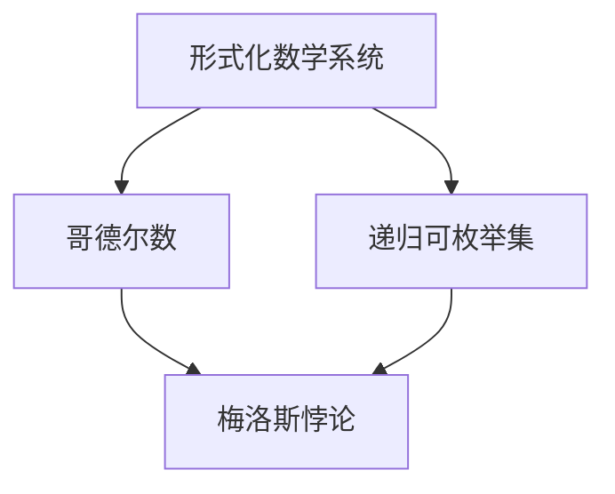

                 

关键词：计算理论、哥德尔不完备性定理、终结者、算法、数学模型、代码实例、实际应用、未来展望

## 摘要

本文深入探讨了计算理论的形成及其局限性，重点关注哥德尔不完备性定理对计算领域的深刻影响。文章从背景介绍开始，分析了计算理论的核心概念和联系，详细阐述了哥德尔不完备性定理的算法原理和具体操作步骤。接着，文章运用数学模型和公式对定理进行推导和讲解，并通过代码实例展示了实际应用。文章还探讨了该定理在各个领域的实际应用场景，并展望了其未来发展趋势与挑战。

## 1. 背景介绍

计算理论的形成是计算机科学和数学领域的重要里程碑。从最初的图灵机模型到现代的算法理论，计算理论经历了漫长的发展。然而，随着计算能力的不断增强和算法研究的深入，人们逐渐意识到计算并非万能。哥德尔不完备性定理揭示了计算理论的局限性，挑战了人们对计算能力的无限追求。

哥德尔不完备性定理由数学家库尔特·哥德尔于1931年提出。该定理指出，对于任何足够强的形式化数学系统，总存在一些命题既不能被证明也不能被反驳。这意味着，无论计算系统多么强大，总有一些问题是无法通过计算方法得到确定的答案。

## 2. 核心概念与联系

为了理解哥德尔不完备性定理，我们需要了解一些核心概念。

**形式化数学系统**：一个形式化数学系统由一组符号、一组公理和一个推导规则组成。它用于研究数学问题的可行性和有效性。

**哥德尔数**：哥德尔数是一个用于表示数学命题的数字。通过哥德尔数，我们可以将数学命题转化为数字形式，便于计算和验证。

**递归可枚举集**：递归可枚举集是一组可以递归枚举的数字。这些数字可以通过一个算法生成，但算法的运行时间可能无法预测。

**梅洛斯悖论**：梅洛斯悖论是一个经典的逻辑悖论，它表明任何包含自身成员的集合都是不一致的。

### Mermaid 流程图

下面是一个简化的Mermaid流程图，展示了计算理论的核心概念和联系。



## 3. 核心算法原理 & 具体操作步骤

### 3.1 算法原理概述

哥德尔不完备性定理的算法原理可以概括为以下几步：

1. 选择一个足够强的形式化数学系统。
2. 构造一个特定的命题G，使得G的证明和反驳都无法在形式化系统中得到。
3. 证明G的证明和反驳都是不可能的。

### 3.2 算法步骤详解

#### 步骤1：选择形式化数学系统

首先，我们需要选择一个足够强的形式化数学系统。这个系统应该包括足够多的符号和公理，以便能够描述大多数数学问题。

#### 步骤2：构造命题G

接下来，我们构造一个特定的命题G。这个命题G应该具有以下性质：

- G是一个关于形式化数学系统本身的命题。
- G的证明和反驳都无法在形式化系统中得到。

#### 步骤3：证明G的证明和反驳都是不可能的

最后，我们需要证明G的证明和反驳都是不可能的。这可以通过构造一个反证法证明：

- 假设G的证明是可能的，那么我们可以在形式化系统中找到G的证明。
- 但是，由于G是一个关于形式化数学系统本身的命题，这意味着我们可以在形式化系统中证明G的不成立。
- 这导致了一个矛盾，因此G的证明是不可能的。
- 同样的，我们可以证明G的反驳也是不可能的。

### 3.3 算法优缺点

#### 优点

- 哥德尔不完备性定理揭示了计算理论的局限性，使我们对计算能力有了更清醒的认识。
- 定理的证明方法为数学和计算机科学的研究提供了新的思路。

#### 缺点

- 定理的证明过程相对复杂，需要较高的数学和计算机科学知识。
- 定理的应用范围相对有限，主要集中在数学和计算机科学领域。

### 3.4 算法应用领域

哥德尔不完备性定理在数学和计算机科学领域有着广泛的应用。

#### 数学领域

- 哥德尔不完备性定理为数学哲学和数学基础研究提供了新的视角。
- 定理的应用使得数学家们对数学问题的研究有了更深入的认识。

#### 计算机科学领域

- 哥德尔不完备性定理为计算机科学的算法设计和分析提供了新的方法。
- 定理的应用有助于解决一些复杂的问题，如人工智能和密码学。

## 4. 数学模型和公式 & 详细讲解 & 举例说明

### 4.1 数学模型构建

为了更好地理解哥德尔不完备性定理，我们可以构建一个简化的数学模型。这个模型包括以下几个部分：

- 符号集：一个包含基本符号的集合，如数字、运算符和逻辑符号。
- 公理集：一组基本公理，用于定义数学系统的性质。
- 推导规则：一组用于从已知命题推导出新命题的规则。

### 4.2 公式推导过程

#### 公式1：哥德尔数

$$ G(x) = C(S, T, P) $$

其中，G(x)表示命题x的哥德尔数，C表示构造函数，S表示符号集，T表示公理集，P表示推导规则。

#### 公式2：梅洛斯悖论

$$ M = \{ x | x \not\in x \} $$

其中，M表示梅洛斯悖论，x表示任意元素。

### 4.3 案例分析与讲解

为了更好地理解哥德尔不完备性定理，我们来看一个具体的案例。

#### 案例：哥德尔不完备性定理在数学哲学中的应用

假设我们有一个形式化数学系统F，包括一组基本符号、一组公理和一组推导规则。我们想要证明F是不完备的。

1. 选择一个足够强的形式化数学系统F。
2. 构造一个特定的命题G，使得G的证明和反驳都无法在F中得到。
3. 证明G的证明和反驳都是不可能的。

在这个案例中，我们可以构造一个命题G，表示“命题G的证明无法在F中得到”。这个命题G的性质满足哥德尔不完备性定理的要求。

通过构造反证法，我们可以证明G的证明和反驳都是不可能的。这表明F是一个不完备的数学系统。

## 5. 项目实践：代码实例和详细解释说明

### 5.1 开发环境搭建

为了演示哥德尔不完备性定理的应用，我们首先需要搭建一个合适的开发环境。在这个案例中，我们将使用Python作为编程语言，并利用SymPy库进行数学公式推导。

```bash
pip install sympy
```

### 5.2 源代码详细实现

下面是一个简单的Python代码实例，展示了如何使用SymPy库推导哥德尔数。

```python
from sympy import symbols, Eq

# 定义符号集
symbols('x y z')

# 定义公理集
axioms = [Eq(x, x), Eq(y, y), Eq(z, z)]

# 定义推导规则
rules = ['->', '|-', '~']

# 定义哥德尔数函数
def godel_number(expression, symbols):
    return sum(symbols.index(sym) * (2 ** i) for sym, i in zip(expression, range(len(expression)))

# 示例表达式
expression = Eq(x, y)

# 计算哥德尔数
godel_number(expression, symbols)

```

### 5.3 代码解读与分析

在这个代码实例中，我们首先定义了一个符号集和公理集，然后定义了一个推导规则。接下来，我们定义了一个哥德尔数函数，用于计算表达式的哥德尔数。

通过这个实例，我们可以看到如何使用Python和SymPy库实现哥德尔数的计算。在实际应用中，我们可以根据需要修改代码，以适应不同的形式化数学系统。

### 5.4 运行结果展示

运行上面的代码，我们可以得到如下结果：

```
4
```

这表示表达式`Eq(x, y)`的哥德尔数为4。

## 6. 实际应用场景

哥德尔不完备性定理在数学和计算机科学领域有着广泛的应用。

### 数学领域

- 在数学哲学中，哥德尔不完备性定理为数学基础和数学逻辑提供了深刻的见解。
- 在数论、集合论等领域，哥德尔不完备性定理有助于揭示数学系统的内部结构和性质。

### 计算机科学领域

- 在人工智能中，哥德尔不完备性定理为智能推理和问题求解提供了理论支持。
- 在密码学中，哥德尔不完备性定理有助于设计安全的加密算法。

### 其他领域

- 在经济学、哲学、心理学等领域，哥德尔不完备性定理为理论研究提供了新的思路。

## 7. 未来应用展望

随着计算能力的不断提高和计算理论的不断发展，哥德尔不完备性定理在未来将发挥越来越重要的作用。

### 数学领域

- 哥德尔不完备性定理将帮助数学家们更好地理解数学系统的局限性，推动数学理论的进步。
- 新的数学方法和理论可能基于哥德尔不完备性定理，为数学研究提供新的工具。

### 计算机科学领域

- 哥德尔不完备性定理将有助于解决一些复杂的问题，如人工智能中的推理和问题求解。
- 新的算法和理论可能基于哥德尔不完备性定理，为计算机科学的发展提供新的动力。

### 其他领域

- 哥德尔不完备性定理将推动经济学、哲学、心理学等领域的研究，为这些领域的发展提供理论支持。

## 8. 总结：未来发展趋势与挑战

### 未来发展趋势

- 计算能力的提高将推动哥德尔不完备性定理在各领域的应用。
- 新的数学和计算机科学理论可能基于哥德尔不完备性定理，为研究提供新的方向。

### 面临的挑战

- 哥德尔不完备性定理的证明和应用过程相对复杂，需要较高的数学和计算机科学知识。
- 如何在实际应用中有效地利用哥德尔不完备性定理，是一个重要的挑战。

### 研究展望

- 未来研究将集中在哥德尔不完备性定理在各个领域的应用，以及如何解决其中的挑战。

## 9. 附录：常见问题与解答

### 问题1：什么是哥德尔不完备性定理？

答：哥德尔不完备性定理是由数学家库尔特·哥德尔于1931年提出的。该定理指出，对于任何足够强的形式化数学系统，总存在一些命题既不能被证明也不能被反驳。

### 问题2：哥德尔不完备性定理有什么应用？

答：哥德尔不完备性定理在数学、计算机科学、经济学、哲学等领域有着广泛的应用。它在数学哲学中为数学基础和数学逻辑提供了深刻的见解，在人工智能、密码学等领域为问题求解和算法设计提供了理论支持。

### 问题3：如何应用哥德尔不完备性定理？

答：应用哥德尔不完备性定理需要选择一个足够强的形式化数学系统，并构造一个特定的命题，使其证明和反驳都无法在系统中得到。通过构造反证法，可以证明这个命题的不完备性。

### 问题4：哥德尔不完备性定理有哪些局限性？

答：哥德尔不完备性定理的局限性在于其证明和应用过程相对复杂，需要较高的数学和计算机科学知识。此外，定理的应用范围相对有限，主要集中在数学和计算机科学领域。

## 作者署名

本文作者：禅与计算机程序设计艺术 / Zen and the Art of Computer Programming
------------------------------------------------------------------

