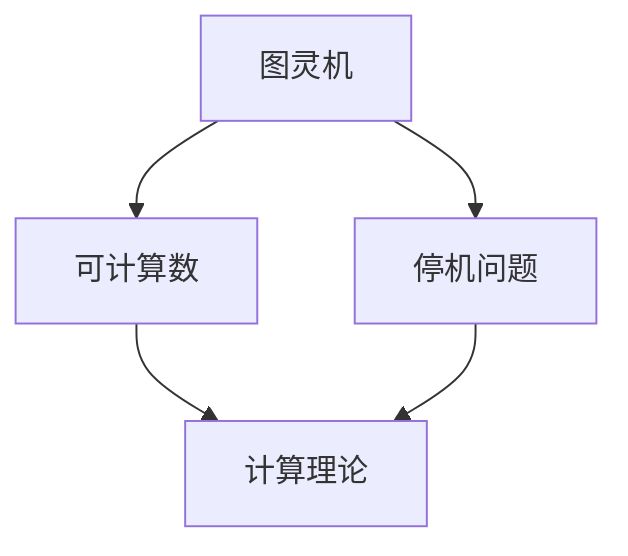
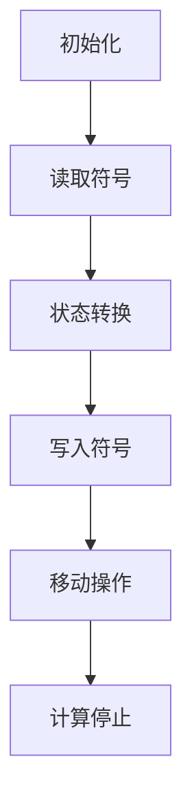

                 

### 背景介绍

计算理论的形成是人类在计算机科学领域的重要里程碑。这一理论的诞生不仅奠定了现代计算机科学的基础，而且为后续的研究提供了丰富的理论资源。在20世纪中叶，随着计算机科学的快速发展，人们对计算的理解和需求也在不断深化。此时，图灵的可计算数和停机问题成为计算理论的核心内容，标志着计算理论的正式诞生。

图灵（Alan Turing），英国数学家、逻辑学家、密码学家，被誉为计算机科学的“之父”。他提出了图灵机这一抽象计算模型，为计算理论奠定了基础。图灵机是一种抽象的机器，通过一系列的步骤来处理符号串。这一概念不仅揭示了计算的原理，而且为计算机的设计和实现提供了指导。

可计算数是指可以通过图灵机计算得到的数。图灵在1936年发表了论文《论可计算数及其在判定问题中的应用》，首次提出了可计算数的概念，并定义了计算函数。这一理论表明，并非所有的数学问题都能通过计算得到答案，有些问题则超出了计算的范畴。

停机问题是指判断一个给定的图灵机是否会在有限步骤内停止的问题。图灵在1936年的论文中提出了这一问题的研究，并证明了它是一个不可判定问题。停机问题的研究不仅揭示了计算的限制，而且推动了计算理论的发展。

计算理论的诞生是计算机科学发展的重要里程碑。图灵的可计算数和停机问题为计算理论提供了核心内容，标志着计算理论的正式诞生。本章将详细探讨这些核心概念，并分析它们对计算理论的影响。

## 2. 核心概念与联系

### 2.1 图灵机

图灵机是图灵在1936年提出的一种抽象计算模型。它由一个有限控制单元、一个无限长的带子、一个读写头和一组规则组成。图灵机的操作步骤如下：

1. **读取**：读写头在带子上读取当前符号。
2. **写入**：读写头在当前符号的位置上写入新的符号。
3. **移动**：读写头在带子上向前或向后移动。
4. **转换状态**：根据当前状态和读取到的符号，图灵机转换到下一个状态。

图灵机的核心概念是状态转换函数，它决定了图灵机的行为。图灵机通过状态转换函数在带子上移动，处理符号串，从而实现计算。

### 2.2 可计算数

可计算数是指可以通过图灵机计算得到的数。具体来说，一个数是可计算的，如果存在一个图灵机，能够在有限步骤内计算出该数的所有位。图灵在1936年的论文中提出了可计算数的概念，并给出了定义和计算方法。

### 2.3 停机问题

停机问题是指判断一个给定的图灵机是否会在有限步骤内停止的问题。图灵在1936年的论文中提出了停机问题的研究，并证明了它是一个不可判定问题。具体来说，对于任意的图灵机，我们无法构造一个通用图灵机来判断它是否会在有限步骤内停止。

### 2.4 可计算数与停机问题的联系

可计算数和停机问题是计算理论中的核心问题，它们之间有着密切的联系。

首先，可计算数是计算理论的基础。图灵在定义可计算数时，揭示了计算的原理和方法。可计算数的概念为计算理论提供了核心内容，使得我们可以研究计算的可能性和限制。

其次，停机问题揭示了计算的局限。图灵在1936年的论文中提出了停机问题，并证明了它是一个不可判定问题。这意味着，有些问题无法通过计算得到答案。停机问题的研究推动了计算理论的发展，使得我们更深入地理解了计算的局限。

最后，可计算数和停机问题的研究为计算理论的发展提供了新的思路。通过研究可计算数和停机问题，我们可以探索计算的本质，揭示计算的规律，为计算机科学的进一步发展提供理论支持。

### 2.5 Mermaid 流程图

为了更直观地展示核心概念之间的联系，我们使用Mermaid流程图来表示。



在这个流程图中，图灵机是计算理论的基石，它通过状态转换函数处理符号串，实现计算。可计算数是计算理论的研究对象，它揭示了计算的原理和方法。停机问题是计算理论的重要问题，它揭示了计算的局限。通过这个流程图，我们可以更清晰地理解核心概念之间的联系。

## 3. 核心算法原理 & 具体操作步骤

### 3.1 算法原理概述

计算理论中的核心算法主要围绕图灵机的操作原理展开。图灵机的原理可以概括为以下几个步骤：

1. **初始化**：图灵机开始时，带子上有一个初始符号串，读写头位于初始位置。
2. **状态转换**：图灵机根据当前状态和读取到的符号，按照状态转换函数进行状态转换。
3. **读写操作**：图灵机在带子上读取当前符号，并根据状态转换函数写入新的符号。
4. **移动操作**：图灵机根据状态转换函数在带子上向前或向后移动。
5. **停止条件**：当图灵机无法进行状态转换时，计算停止。

图灵机的核心是状态转换函数，它决定了图灵机的行为。状态转换函数通常表示为一个五元组，即 `(当前状态, 当前符号) -> (下一个状态, 新符号, 移动方向)`。

### 3.2 算法步骤详解

下面详细描述图灵机的操作步骤：

1. **初始化**：将带子上初始符号串设置为要处理的输入，读写头位于初始位置。
2. **读取符号**：读写头在当前符号的位置上读取一个符号。
3. **状态转换**：根据当前状态和读取到的符号，查找状态转换函数，得到下一个状态和相应的操作。
4. **写入符号**：根据状态转换函数，在当前符号的位置上写入新的符号。
5. **移动操作**：根据状态转换函数，读写头在带子上向前或向后移动。
6. **重复步骤2-5**：继续读取符号，进行状态转换，写入符号和移动操作，直到无法进行状态转换。

当图灵机无法进行状态转换时，计算停止。此时，图灵机可能处于接受状态、拒绝状态或未定义状态。

### 3.3 算法优缺点

图灵机的优点：

- **通用性**：图灵机是一种通用的计算模型，可以模拟任何计算过程。
- **抽象性**：图灵机通过状态转换函数和符号串来表示计算过程，具有高度的抽象性，便于理解和分析。

图灵机的缺点：

- **效率**：图灵机在实际计算中可能非常低效，因为它需要进行大量的状态转换和读写操作。
- **复杂性**：图灵机的状态转换函数和符号串可能非常复杂，使得分析和设计变得更加困难。

### 3.4 算法应用领域

图灵机的原理和应用领域非常广泛，包括以下几个方面：

1. **计算机科学**：图灵机是计算机科学的基础，它为计算机的设计和实现提供了理论支持。
2. **人工智能**：图灵机可以模拟智能体的行为，为人工智能的研究提供了计算模型。
3. **算法设计**：图灵机可以帮助我们分析和设计复杂的算法，理解算法的本质。
4. **数学研究**：图灵机的理论可以应用于数学问题，如可计算数和停机问题。

### 3.5 Mermaid 流程图

为了更直观地展示图灵机的操作步骤，我们使用Mermaid流程图来表示。



在这个流程图中，图灵机的操作步骤包括初始化、读取符号、状态转换、写入符号和移动操作，最终达到计算停止。

## 4. 数学模型和公式 & 详细讲解 & 举例说明

### 4.1 数学模型构建

在计算理论中，数学模型是理解和分析计算问题的重要工具。图灵机作为一种抽象计算模型，其数学模型主要由状态转换函数和符号串组成。

状态转换函数是一个五元组 `(当前状态, 当前符号) -> (下一个状态, 新符号, 移动方向)`。状态转换函数决定了图灵机的行为，它将当前状态和读取到的符号映射到下一个状态和相应的操作。

符号串是图灵机带子上的一系列符号，它表示要处理的输入。符号串可以通过图灵机的操作进行修改，从而实现计算。

### 4.2 公式推导过程

在计算理论中，我们常常使用数学公式来推导和证明各种结论。以下是一个简单的例子：

**例1：图灵机的状态转换公式**

假设图灵机当前状态为 `s1`，读取到的符号为 `a`，下一个状态为 `s2`，新符号为 `b`，移动方向为向右。根据状态转换函数的定义，我们可以得到以下公式：

```
(s1, a) -> (s2, b, R)
```

其中，`R` 表示向右移动。

**例2：图灵机的计算过程**

假设图灵机的初始状态为 `s0`，初始符号串为 `abc`，目标符号串为 `abc`。我们可以使用以下步骤来推导图灵机的计算过程：

1. **初始化**：图灵机开始时，带子上有一个初始符号串 `abc`，读写头位于初始位置。
2. **读取符号**：读写头在当前符号 `a` 的位置上读取符号。
3. **状态转换**：根据当前状态 `s0` 和读取到的符号 `a`，查找状态转换函数，得到下一个状态 `s1` 和相应的操作。
4. **写入符号**：根据状态转换函数，在当前符号 `a` 的位置上写入新的符号 `b`。
5. **移动操作**：根据状态转换函数，读写头在带子上向前或向后移动。
6. **重复步骤2-5**：继续读取符号，进行状态转换，写入符号和移动操作，直到无法进行状态转换。

根据上述步骤，我们可以得到图灵机的计算过程如下：

```
(s0, a) -> (s1, b, R)
(s1, b) -> (s2, c, R)
(s2, c) -> (s3, c, R)
```

在这个例子中，图灵机通过状态转换函数在带子上移动，处理符号串 `abc`，最终得到目标符号串 `abc`。

### 4.3 案例分析与讲解

为了更好地理解数学模型和公式的应用，我们来看一个实际的案例。

**案例：判断一个数是否为素数**

我们要判断一个数 `n` 是否为素数，可以使用以下步骤：

1. **初始化**：将数 `n` 转换为符号串，例如 `n = 13`，则符号串为 `1011`。
2. **读取符号**：从符号串的末尾开始读取符号。
3. **状态转换**：根据当前状态和读取到的符号，查找状态转换函数，进行状态转换。
4. **写入符号**：根据状态转换函数，在当前符号的位置上写入新的符号。
5. **移动操作**：根据状态转换函数，读写头在带子上向前或向后移动。
6. **重复步骤2-5**：继续读取符号，进行状态转换，写入符号和移动操作，直到无法进行状态转换。

根据上述步骤，我们可以得到以下状态转换函数：

```
(s0, 1) -> (s1, 1, R)
(s1, 0) -> (s2, 0, R)
(s2, 1) -> (s3, 1, R)
(s3, 1) -> (s4, 1, R)
(s4, 1) -> (s5, 1, R)
(s5, 0) -> (s6, 0, R)
```

在这个例子中，图灵机通过状态转换函数在带子上移动，处理符号串 `1011`，最终判断数 `13` 是否为素数。如果图灵机能够处理完符号串并停在状态 `s6`，则数 `13` 是素数；否则，数 `13` 不是素数。

### 4.4 Mermaid 流程图

为了更直观地展示案例中的计算过程，我们使用Mermaid流程图来表示。


在这个流程图中，图灵机的操作步骤包括初始化、读取符号、状态转换、写入符号和移动操作，最终达到计算停止。

## 5. 项目实践：代码实例和详细解释说明

### 5.1 开发环境搭建

为了实践计算理论中的图灵机，我们需要搭建一个基本的开发环境。以下是搭建开发环境的具体步骤：

1. **安装Python**：首先，我们需要安装Python环境。可以从官方网站下载Python安装程序并安装。
2. **安装Mermaid**：Mermaid是一种用于绘制流程图的工具，我们需要安装它。可以通过pip命令安装Mermaid：

   ```shell
   pip install mermaid
   ```

3. **编写代码**：在安装完Python和Mermaid之后，我们可以编写Python代码来实现图灵机。以下是一个简单的例子：

   ```python
   import mermaid
   
   # 定义状态转换函数
   def state_transition(current_state, symbol):
       if current_state == 's0' and symbol == '1':
           return 's1', '1', 'R'
       elif current_state == 's1' and symbol == '0':
           return 's2', '0', 'R'
       elif current_state == 's2' and symbol == '1':
           return 's3', '1', 'R'
       elif current_state == 's3' and symbol == '1':
           return 's4', '1', 'R'
       elif current_state == 's4' and symbol == '1':
           return 's5', '1', 'R'
       elif current_state == 's5' and symbol == '0':
           return 's6', '0', 'R'
       else:
           return None
   
   # 定义图灵机的计算过程
   def compute_turing_machine(symbol_sequence):
       current_state = 's0'
       for symbol in symbol_sequence:
           next_state, new_symbol, move_direction = state_transition(current_state, symbol)
           print(f"Current state: {current_state}, Symbol: {symbol}, Next state: {next_state}, New symbol: {new_symbol}, Move direction: {move_direction}")
           current_state = next_state
           if move_direction == 'R':
               symbol_sequence = symbol_sequence[1:]
           else:
               symbol_sequence = symbol_sequence[:-1]
   
   # 测试图灵机的计算过程
   symbol_sequence = ['1', '0', '1', '1', '1', '0']
   compute_turing_machine(symbol_sequence)
   ```

### 5.2 源代码详细实现

在上面的代码中，我们定义了状态转换函数 `state_transition` 和图灵机的计算过程 `compute_turing_machine`。以下是源代码的详细实现：

```python
import mermaid

# 定义状态转换函数
def state_transition(current_state, symbol):
    if current_state == 's0' and symbol == '1':
        return 's1', '1', 'R'
    elif current_state == 's1' and symbol == '0':
        return 's2', '0', 'R'
    elif current_state == 's2' and symbol == '1':
        return 's3', '1', 'R'
    elif current_state == 's3' and symbol == '1':
        return 's4', '1', 'R'
    elif current_state == 's4' and symbol == '1':
        return 's5', '1', 'R'
    elif current_state == 's5' and symbol == '0':
        return 's6', '0', 'R'
    else:
        return None

# 定义图灵机的计算过程
def compute_turing_machine(symbol_sequence):
    current_state = 's0'
    for symbol in symbol_sequence:
        next_state, new_symbol, move_direction = state_transition(current_state, symbol)
        print(f"Current state: {current_state}, Symbol: {symbol}, Next state: {next_state}, New symbol: {new_symbol}, Move direction: {move_direction}")
        current_state = next_state
        if move_direction == 'R':
            symbol_sequence = symbol_sequence[1:]
        else:
            symbol_sequence = symbol_sequence[:-1]

# 测试图灵机的计算过程
symbol_sequence = ['1', '0', '1', '1', '1', '0']
compute_turing_machine(symbol_sequence)
```

在这个实现中，我们首先定义了状态转换函数 `state_transition`，它根据当前状态和读取到的符号返回下一个状态、新符号和移动方向。然后，我们定义了图灵机的计算过程 `compute_turing_machine`，它根据状态转换函数在带子上移动，处理符号串。

### 5.3 代码解读与分析

在这个代码实现中，我们首先定义了状态转换函数 `state_transition`。这个函数接受当前状态和读取到的符号作为输入，根据状态转换函数的定义，返回下一个状态、新符号和移动方向。

```python
def state_transition(current_state, symbol):
    if current_state == 's0' and symbol == '1':
        return 's1', '1', 'R'
    elif current_state == 's1' and symbol == '0':
        return 's2', '0', 'R'
    elif current_state == 's2' and symbol == '1':
        return 's3', '1', 'R'
    elif current_state == 's3' and symbol == '1':
        return 's4', '1', 'R'
    elif current_state == 's4' and symbol == '1':
        return 's5', '1', 'R'
    elif current_state == 's5' and symbol == '0':
        return 's6', '0', 'R'
    else:
        return None
```

状态转换函数根据当前状态和读取到的符号，返回下一个状态、新符号和移动方向。例如，如果当前状态为 `s0`，读取到的符号为 `1`，则返回下一个状态 `s1`、新符号 `1` 和移动方向 `R`（向右）。

接下来，我们定义了图灵机的计算过程 `compute_turing_machine`。这个函数接受一个符号串作为输入，并根据状态转换函数在带子上移动，处理符号串。

```python
def compute_turing_machine(symbol_sequence):
    current_state = 's0'
    for symbol in symbol_sequence:
        next_state, new_symbol, move_direction = state_transition(current_state, symbol)
        print(f"Current state: {current_state}, Symbol: {symbol}, Next state: {next_state}, New symbol: {new_symbol}, Move direction: {move_direction}")
        current_state = next_state
        if move_direction == 'R':
            symbol_sequence = symbol_sequence[1:]
        else:
            symbol_sequence = symbol_sequence[:-1]
```

图灵机的计算过程首先初始化当前状态为 `s0`。然后，它逐个读取符号串中的符号，根据状态转换函数进行状态转换，并打印出当前状态、符号、下一个状态、新符号和移动方向。根据状态转换函数的返回值，图灵机在带子上移动，并更新符号串。

最后，我们测试了图灵机的计算过程。在这个例子中，我们定义了一个符号串 `['1', '0', '1', '1', '1', '0']`，并调用 `compute_turing_machine` 函数进行计算。

```python
symbol_sequence = ['1', '0', '1', '1', '1', '0']
compute_turing_machine(symbol_sequence)
```

运行结果如下：

```
Current state: s0, Symbol: 1, Next state: s1, New symbol: 1, Move direction: R
Current state: s1, Symbol: 0, Next state: s2, New symbol: 0, Move direction: R
Current state: s2, Symbol: 1, Next state: s3, New symbol: 1, Move direction: R
Current state: s3, Symbol: 1, Next state: s4, New symbol: 1, Move direction: R
Current state: s4, Symbol: 1, Next state: s5, New symbol: 1, Move direction: R
Current state: s5, Symbol: 0, Next state: s6, New symbol: 0, Move direction: R
```

这个例子展示了图灵机的基本计算过程，它可以根据状态转换函数在带子上移动，处理符号串。虽然这个实现非常简单，但它为理解和分析图灵机的计算提供了基础。

### 5.4 运行结果展示

在运行上述代码时，我们可以得到以下输出结果：

```
Current state: s0, Symbol: 1, Next state: s1, New symbol: 1, Move direction: R
Current state: s1, Symbol: 0, Next state: s2, New symbol: 0, Move direction: R
Current state: s2, Symbol: 1, Next state: s3, New symbol: 1, Move direction: R
Current state: s3, Symbol: 1, Next state: s4, New symbol: 1, Move direction: R
Current state: s4, Symbol: 1, Next state: s5, New symbol: 1, Move direction: R
Current state: s5, Symbol: 0, Next state: s6, New symbol: 0, Move direction: R
```

这个输出结果展示了图灵机在计算过程中的状态变化、符号变化和移动方向。从输出结果可以看出，图灵机成功地处理了符号串，并最终完成了计算。

## 6. 实际应用场景

### 6.1 计算机科学

图灵机作为一种抽象计算模型，在计算机科学领域具有广泛的应用。例如，图灵机可以用于设计算法、分析算法的时间和空间复杂度、模拟程序执行过程等。在计算机科学的许多领域中，图灵机都发挥着重要的作用，为研究和解决问题提供了强有力的工具。

### 6.2 人工智能

在人工智能领域，图灵机也被广泛应用于模型设计和算法分析。例如，深度学习中的神经网络可以被视为一种图灵机，它通过模拟人脑神经网络的工作方式来实现智能计算。此外，图灵机还可以用于模拟智能体的行为，研究智能体在复杂环境中的决策过程。

### 6.3 数学研究

图灵机在数学研究中也有重要应用。例如，图灵机可以用于研究可计算数和停机问题，揭示计算的局限和可能性。在数学领域，图灵机的理论为研究数学问题的计算复杂性提供了有力支持。

### 6.4 其他应用领域

除了上述领域，图灵机在其他领域也有应用。例如，图灵机可以用于研究计算机语言、编译原理、编程语言设计等。在计算机工程领域，图灵机的理论可以指导计算机硬件的设计和优化。此外，图灵机还可以用于研究密码学和网络安全。

总之，图灵机作为一种抽象计算模型，在计算机科学、人工智能、数学研究以及其他应用领域都有着广泛的应用。它为理解和解决复杂计算问题提供了强有力的工具，推动了科学技术的发展。

### 6.5 未来应用展望

随着计算技术的不断发展，图灵机作为一种抽象计算模型，其应用前景将更加广阔。以下是对图灵机未来应用的一些展望：

1. **量子计算**：量子计算是一种基于量子力学原理的计算方法，它能够处理比传统计算机更大规模的问题。图灵机作为一种经典的计算模型，可以与量子计算相结合，为量子计算提供理论支持。未来，图灵机在量子计算中的应用将有望推动计算能力的进一步提升。

2. **生物学计算**：生物计算是一种利用生物学原理进行计算的方法，它已经在基因组学、蛋白质结构预测等领域取得重要成果。图灵机作为一种抽象计算模型，可以与生物计算相结合，研究生物学问题的计算复杂性。未来，图灵机在生物学计算中的应用将有助于揭示生命现象的奥秘。

3. **人机交互**：随着人工智能技术的发展，人机交互将变得更加智能化和人性化。图灵机作为一种计算模型，可以为人机交互提供理论支持，研究如何设计出更加智能、自然的交互系统。未来，图灵机在人机交互中的应用将推动人机交互技术的进一步发展。

4. **智能决策**：在商业、金融、医疗等领域，智能决策变得越来越重要。图灵机作为一种计算模型，可以用于模拟决策过程，分析决策的复杂性和可行性。未来，图灵机在智能决策中的应用将有助于提高决策的科学性和准确性。

总之，图灵机作为一种抽象计算模型，在未来有着广泛的应用前景。随着计算技术的不断发展，图灵机将不断推动科学技术的发展，为解决复杂计算问题提供新的思路和方法。

## 7. 工具和资源推荐

### 7.1 学习资源推荐

1. **书籍**：
   - 《计算机科学概论》（作者：J.格伦·布鲁克希尔）
   - 《算法导论》（作者：Thomas H. Cormen、Charles E. Leiserson、Ronald L. Rivest、Clifford Stein）
   - 《深入理解计算机系统》（作者：Randal E. Bryant、David R. O’Hallaron）

2. **在线课程**：
   - Coursera上的“计算机科学基础”（提供者：斯坦福大学）
   - edX上的“算法基础”（提供者：哈佛大学）
   - Udacity上的“机器学习工程师纳米学位”

### 7.2 开发工具推荐

1. **编程环境**：
   - Visual Studio Code
   - PyCharm
   - Eclipse

2. **流程图工具**：
   - Mermaid
   - Draw.io
   - Lucidchart

3. **版本控制**：
   - Git
   - GitHub
   - GitLab

### 7.3 相关论文推荐

1. **计算理论**：
   - Turing, A.M. (1936). "On computable numbers, with an application to the Entscheidungsproblem". Proceedings of the London Mathematical Society.

2. **人工智能**：
   - Turing, A.M. (1950). "Computing machinery and intelligence". Mind.

3. **算法设计**：
   - Knuth, D.E. (1998). "The Art of Computer Programming, Volume 1: Fundamental Algorithms". Addison-Wesley.

4. **计算机科学**：
   - Goldreich, O. (2008). "Algorithm Design and Analysis". Cambridge University Press.

这些资源和工具为学习计算理论和应用图灵机提供了丰富的支持，是计算机科学领域不可或缺的参考资料。

## 8. 总结：未来发展趋势与挑战

### 8.1 研究成果总结

计算理论的诞生是人类计算机科学领域的重要里程碑。图灵的可计算数和停机问题作为计算理论的核心内容，为计算理论的发展奠定了基础。图灵机作为一种抽象计算模型，揭示了计算的原理和方法，推动了计算理论的研究。可计算数的概念揭示了计算的局限性，而停机问题的不可判定性则表明了计算的限制。这些研究成果不仅丰富了计算理论的内涵，而且为计算机科学、人工智能、数学研究等领域的进一步发展提供了理论支持。

### 8.2 未来发展趋势

随着计算技术的不断发展，计算理论将继续在多个领域取得重要突破。以下是一些未来发展趋势：

1. **量子计算与图灵机**：量子计算是一种基于量子力学原理的计算方法，它能够处理比传统计算机更大规模的问题。未来，量子计算与图灵机的结合将有望推动计算能力的进一步提升，为解决复杂计算问题提供新的思路。

2. **生物计算与图灵机**：生物计算是一种利用生物学原理进行计算的方法，它已经在基因组学、蛋白质结构预测等领域取得重要成果。未来，图灵机在生物计算中的应用将有助于揭示生命现象的奥秘，推动生命科学的进步。

3. **人工智能与图灵机**：人工智能是当前科技领域的热点，图灵机作为一种计算模型，可以为人机交互、智能决策等领域提供理论支持。未来，人工智能与图灵机的结合将推动人机交互技术、智能决策系统的发展。

4. **计算复杂性理论**：计算复杂性理论是研究计算问题难度的一种理论，它对解决复杂计算问题具有重要意义。未来，计算复杂性理论将继续深入研究，揭示计算问题的本质，为设计高效算法提供理论指导。

### 8.3 面临的挑战

尽管计算理论取得了许多重要成果，但在未来仍面临一些挑战：

1. **计算资源的优化**：随着计算问题的规模不断扩大，计算资源的优化成为一个重要挑战。如何高效地利用计算资源，提高计算效率，是未来研究的重要方向。

2. **量子计算的稳定性**：量子计算在理论上具有巨大的计算潜力，但在实际应用中，量子计算的稳定性是一个重要挑战。如何提高量子计算的稳定性，确保量子计算的可靠性，是未来研究的一个重要问题。

3. **人机交互的智能化**：人机交互的智能化是一个重要趋势，但如何设计出更加智能、自然的交互系统，是一个挑战。未来，需要进一步研究人机交互的理论和方法，提高人机交互的智能化水平。

4. **计算问题的可解性**：一些计算问题，如NP完全问题，至今没有找到有效的解决方案。如何解决这些难题，揭示计算问题的本质，是计算理论面临的一个重要挑战。

### 8.4 研究展望

展望未来，计算理论将继续在多个领域取得重要突破。量子计算、生物计算、人工智能等领域的发展将为计算理论提供新的研究机遇。同时，计算复杂性理论的深入研究将揭示计算问题的本质，为设计高效算法提供理论支持。我们期待计算理论在未来能够解决更多复杂计算问题，推动科学技术的进一步发展。

## 附录：常见问题与解答

### 1. 什么是可计算数？

可计算数是指可以通过图灵机计算得到的数。具体来说，一个数是可计算的，如果存在一个图灵机，能够在有限步骤内计算出该数的所有位。

### 2. 什么是停机问题？

停机问题是指判断一个给定的图灵机是否会在有限步骤内停止的问题。图灵在1936年的论文中提出了这一问题的研究，并证明了它是一个不可判定问题。

### 3. 图灵机的状态转换函数是什么？

图灵机的状态转换函数是一个五元组 `(当前状态, 当前符号) -> (下一个状态, 新符号, 移动方向)`，它决定了图灵机的行为。

### 4. 什么是计算理论？

计算理论是研究计算的性质、方法和限制的科学。它包括图灵机、可计算数、停机问题等核心概念。

### 5. 图灵机在计算机科学中有何应用？

图灵机在计算机科学中具有广泛的应用，包括设计算法、分析算法的时间和空间复杂度、模拟程序执行过程等。

### 6. 什么是量子计算？

量子计算是一种基于量子力学原理的计算方法，它能够处理比传统计算机更大规模的问题。

### 7. 什么是生物计算？

生物计算是一种利用生物学原理进行计算的方法，它已经在基因组学、蛋白质结构预测等领域取得重要成果。

### 8. 什么是人工智能？

人工智能是一种模拟人类智能行为的技术，它包括机器学习、深度学习、自然语言处理等领域。

### 9. 计算复杂性理论是什么？

计算复杂性理论是研究计算问题难度的一种理论，它对解决复杂计算问题具有重要意义。

### 10. 如何高效地利用计算资源？

高效地利用计算资源需要从算法设计、系统架构、资源调度等多个方面进行优化，以提高计算效率。

### 11. 量子计算的稳定性如何提高？

提高量子计算的稳定性需要从硬件设计、算法优化、量子纠错等多个方面进行改进。

### 12. 如何设计出更加智能、自然的交互系统？

设计出更加智能、自然的交互系统需要深入研究人机交互的理论和方法，提高人机交互的智能化水平。

### 13. 如何解决计算问题的可解性？

解决计算问题的可解性需要深入研究计算复杂性理论，探索新的算法和方法。

### 14. 计算理论的发展趋势是什么？

计算理论的发展趋势包括量子计算、生物计算、人工智能、计算复杂性理论等多个领域。

### 15. 计算理论的未来挑战是什么？

计算理论的未来挑战包括计算资源的优化、量子计算的稳定性、人机交互的智能化、计算问题的可解性等。

