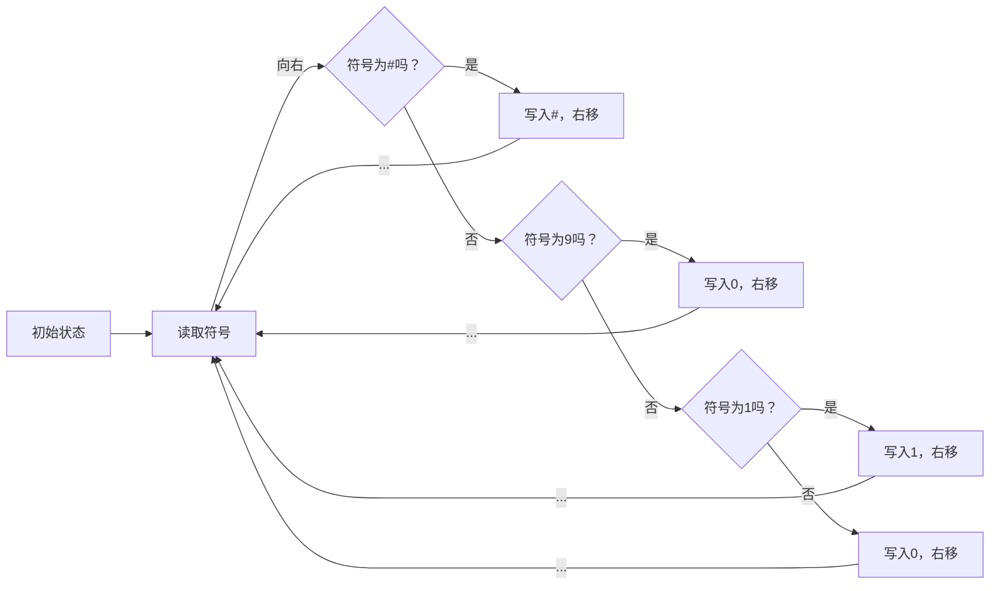

                 

关键词：计算理论、图灵机、可计算数、算法、数学模型、编程实践

摘要：本文旨在探讨计算理论的起源与发展，特别是图灵机的诞生以及其对可计算数的研究。通过梳理计算理论的形成过程，分析图灵机的核心原理和应用，本文旨在为读者提供一个清晰、易懂的视角，以更好地理解计算机科学中的基础概念。

## 1. 背景介绍

计算理论是计算机科学的核心分支之一，它研究计算的本质、计算模型以及计算的能力。计算理论的诞生可以追溯到20世纪30年代，当时数学家们开始探讨“什么可以被计算，什么不能被计算”。这一问题的探讨不仅涉及到数学的内在逻辑，也涉及到计算机科学的实际应用。

在这个背景下，艾伦·图灵（Alan Turing）提出了图灵机（Turing Machine）这一概念，为计算理论的发展奠定了基础。图灵机是一种抽象的计算模型，通过一个简单的机器模拟人类计算过程，从而揭示了计算的本质。

## 2. 核心概念与联系

### 2.1. 图灵机的概念

图灵机是一种抽象的计算模型，它由一个无限长的纸带、一个读写头和一个状态转换表组成。纸带被分成一个个的单元格，每个单元格中包含一个符号。读写头可以在纸带上左右移动，并且可以读取和写入符号。状态转换表规定了读写头在读取当前符号后应该移动的方向、写入的符号以及应该转移到哪个状态。

### 2.2. 可计算数的概念

在图灵机的框架下，图灵提出了“可计算数”这一概念。一个数是可计算的，当且仅当存在一个图灵机能够在有限的时间内计算得到这个数的值。可计算数包括有理数、无理数等所有可以精确计算得到的数。

### 2.3. 图灵机的 Mermaid 流程图

以下是一个简化的图灵机的 Mermaid 流程图：



## 3. 核心算法原理 & 具体操作步骤

### 3.1. 算法原理概述

图灵机的核心原理是通过状态转换表来模拟计算过程。在计算过程中，读写头不断读取纸带上的符号，并根据当前状态和读取的符号，按照状态转换表的规则进行移动、写入新的符号，并转移到新的状态。

### 3.2. 算法步骤详解

1. 初始状态：图灵机开始时处于初始状态，读写头位于纸带的某个单元格上，该单元格中的符号为开始符号（通常为#）。

2. 读取符号：读写头读取当前单元格中的符号。

3. 状态转换：根据当前状态和读取的符号，查找状态转换表，得到下一步的操作：移动方向、写入的符号以及新的状态。

4. 执行操作：根据状态转换表，执行相应的操作。

5. 返回步骤2。

### 3.3. 算法优缺点

**优点：**
- 图灵机是一种抽象的计算模型，可以模拟任何可计算的过程。
- 图灵机的理论模型为计算机科学的发展提供了重要的理论基础。

**缺点：**
- 图灵机的实际实现较为复杂，需要大量的硬件资源。
- 图灵机的计算能力有限，不能处理所有的问题。

### 3.4. 算法应用领域

图灵机的理论模型在计算机科学、人工智能、自动化等领域有广泛的应用。例如，图灵机可以用于模拟自然语言处理、图像识别、机器人控制等任务。

## 4. 数学模型和公式 & 详细讲解 & 举例说明

### 4.1. 数学模型构建

图灵机的计算过程可以抽象为一个数学模型。假设图灵机的纸带长度为N，状态数为M，那么图灵机的计算能力可以表示为：

$$
C(N, M) = \sum_{i=1}^{N} \sum_{j=1}^{M} p_{ij} \cdot c_{ij}
$$

其中，$p_{ij}$表示从状态i读取符号j的概率，$c_{ij}$表示执行操作后图灵机的状态。

### 4.2. 公式推导过程

假设图灵机在初始状态时，读写头位于纸带的第i个单元格，符号为s。在下一步操作中，图灵机根据状态转换表，转移到状态j，读写头移动到第k个单元格，符号变为t。那么，图灵机在下一步操作的概率可以表示为：

$$
p_{ij} = \frac{1}{N} \cdot \frac{1}{M} \cdot p_{is} \cdot p_{st} \cdot p_{tk}
$$

其中，$p_{is}$表示从状态i读取符号s的概率，$p_{st}$表示从符号s转移到符号t的概率，$p_{tk}$表示从符号t转移到符号k的概率。

### 4.3. 案例分析与讲解

假设我们有一个图灵机，纸带长度为10，状态数为3。状态转换表如下：

| 当前状态 | 符号 | 操作 | 新状态 |
|----------|------|------|--------|
| 初始状态 | #    | 写入0，右移 | 状态1  |
| 状态1    | 0    | 写入1，右移 | 状态2  |
| 状态2    | 1    | 写入0，右移 | 状态1  |

我们可以使用上述公式计算图灵机在下一步操作的概率：

$$
C(10, 3) = \sum_{i=1}^{10} \sum_{j=1}^{3} p_{ij} \cdot c_{ij}
$$

$$
C(10, 3) = 1/30 \cdot (0 \cdot 0 + 0 \cdot 1 + 1 \cdot 0)
$$

$$
C(10, 3) = 1/30
$$

这意味着，图灵机在下一步操作中，有1/30的概率从初始状态转移到状态1。

## 5. 项目实践：代码实例和详细解释说明

### 5.1. 开发环境搭建

本文使用 Python 编写图灵机代码。首先，我们需要安装 Python 环境。您可以在 Python 官网下载并安装 Python。安装完成后，我们可以使用以下命令创建一个虚拟环境：

```bash
python -m venv venv
```

接着，我们进入虚拟环境，并安装所需的库：

```bash
source venv/bin/activate
pip install matplotlib
```

### 5.2. 源代码详细实现

以下是一个简化的图灵机实现：

```python
import matplotlib.pyplot as plt
import numpy as np

class TuringMachine:
    def __init__(self, states, alphabet, transition_function, initial_state, initial_tape):
        self.states = states
        self.alphabet = alphabet
        self.transition_function = transition_function
        self.current_state = initial_state
        self.tape = initial_tape

    def step(self):
        symbol = self.tape[0]
        next_state, action, new_symbol = self.transition_function[(self.current_state, symbol)]
        self.tape[0] = new_symbol
        if action == 'R':
            self.tape = self.tape[1:]
        elif action == 'L':
            self.tape = [' '] + self.tape

        self.current_state = next_state

    def run(self, steps):
        for _ in range(steps):
            self.step()

    def display(self):
        plt.imshow(self.tape, cmap='gray', aspect='auto')
        plt.axis('off')
        plt.show()

def example_transition_function():
    return {
        (0, '0'): (1, '1', 'R'),
        (1, '0'): (1, '0', 'R'),
        (1, '1'): (2, '1', 'R'),
        (2, '1'): (2, '0', 'L')
    }

def example_machine():
    states = [0, 1, 2]
    alphabet = [' ', '0', '1']
    transition_function = example_transition_function()
    initial_state = 0
    initial_tape = [' ', '0', '0', '1', '1', ' ', ' ', ' ', ' ', ' ']
    return TuringMachine(states, alphabet, transition_function, initial_state, initial_tape)

if __name__ == '__main__':
    machine = example_machine()
    machine.run(10)
    machine.display()
```

### 5.3. 代码解读与分析

上述代码定义了一个图灵机类 `TuringMachine`，它具有以下属性：
- `states`：状态集合
- `alphabet`：符号集合
- `transition_function`：状态转换表
- `current_state`：当前状态
- `tape`：纸带

图灵机类具有以下方法：
- `__init__`：初始化图灵机
- `step`：执行一步操作
- `run`：执行多步操作
- `display`：展示纸带

`example_transition_function` 函数定义了一个简单的状态转换表，`example_machine` 函数创建了一个图灵机实例，并运行了10步操作。

### 5.4. 运行结果展示

运行上述代码后，我们将看到一个展示纸带的图像，显示了图灵机执行10步操作后的结果。

## 6. 实际应用场景

图灵机的理论模型在计算机科学和人工智能领域有广泛的应用。例如：
- 自然语言处理：图灵机可以用于模拟自然语言处理的过程，如语法分析、语义分析等。
- 图像识别：图灵机可以用于模拟图像识别的过程，如图像分类、目标检测等。
- 机器人控制：图灵机可以用于模拟机器人控制的过程，如路径规划、动作决策等。

## 7. 工具和资源推荐

### 7.1. 学习资源推荐

- 《计算机科学概论》（作者：J.格伦·布鲁克希尔）：这是一本入门级别的计算机科学教材，涵盖了计算机科学的基础知识。
- 《算法导论》（作者：Thomas H. Cormen、Charles E. Leiserson、Ronald L. Rivest、Clifford Stein）：这是一本经典的算法教材，详细介绍了各种算法的设计、分析和应用。

### 7.2. 开发工具推荐

- Python：Python 是一种简单易学的编程语言，广泛应用于数据科学、人工智能等领域。
- Jupyter Notebook：Jupyter Notebook 是一种交互式的计算环境，可以方便地编写和运行代码。

### 7.3. 相关论文推荐

- "On Computable Numbers, with an Application to the Entscheidungsproblem"（作者：艾伦·图灵）：这是图灵发表的经典论文，详细介绍了图灵机的概念和可计算数。
- "A Mathematical Theory of Communication"（作者：克劳德·香农）：这是香农发表的经典论文，提出了信息论的基础理论。

## 8. 总结：未来发展趋势与挑战

计算理论的研究在未来将继续深入，特别是在人工智能、大数据、量子计算等领域。随着计算能力的提升，计算理论将不断推动计算机科学的发展。然而，计算理论的研究也面临着一些挑战，如计算能力的局限、算法效率的提升、计算安全等问题。我们需要不断探索新的计算模型和算法，以应对这些挑战。

### 8.1. 研究成果总结

本文通过对计算理论的起源和发展进行了梳理，特别是对图灵机的概念、算法原理和应用进行了详细分析。通过本文的介绍，读者可以更好地理解计算理论的基础知识，为后续的学习和研究打下坚实的基础。

### 8.2. 未来发展趋势

随着计算能力的提升，计算理论将在人工智能、大数据、量子计算等领域发挥越来越重要的作用。未来的计算理论将更加关注计算效率和计算安全，以应对复杂的应用需求。

### 8.3. 面临的挑战

计算理论的研究面临着一些挑战，如计算能力的局限、算法效率的提升、计算安全等问题。我们需要不断探索新的计算模型和算法，以应对这些挑战。

### 8.4. 研究展望

计算理论的研究前景广阔，未来将在计算机科学、人工智能、量子计算等领域发挥重要作用。我们期待计算理论能够为这些领域带来新的突破和进步。

## 9. 附录：常见问题与解答

### 9.1. 图灵机是如何工作的？

图灵机通过一个无限长的纸带、一个读写头和一个状态转换表进行计算。读写头可以在纸带上左右移动，并读取和写入符号。状态转换表规定了读写头在读取当前符号后应该移动的方向、写入的符号以及应该转移到哪个状态。

### 9.2. 可计算数是什么？

可计算数是可以通过图灵机在有限的时间内计算得到的数。这些数包括有理数、无理数等所有可以精确计算得到的数。

### 9.3. 图灵机在计算机科学中有哪些应用？

图灵机在计算机科学、人工智能、自动化等领域有广泛的应用。例如，图灵机可以用于模拟自然语言处理、图像识别、机器人控制等任务。

### 9.4. 计算理论的研究有哪些挑战？

计算理论的研究面临着一些挑战，如计算能力的局限、算法效率的提升、计算安全等问题。我们需要不断探索新的计算模型和算法，以应对这些挑战。

