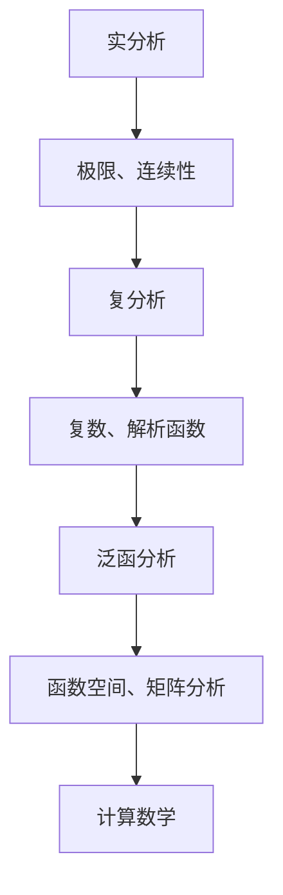

                 

关键词：计算数学、基础数学、分析严格化、逻辑结构、算法原理、数学模型、实践应用

摘要：本文深入探讨了计算数学的基础——分析的严格化。通过对数学概念的精细定义和数学理论的严谨构建，分析了严格化的数学基础对于计算的重要性，并探讨了其在算法设计和应用领域的广泛影响。文章旨在为读者提供全面、系统的数学基础知识和应用实例，以加深对计算数学本质的理解。

## 1. 背景介绍

在计算机科学和数学的交汇处，计算数学扮演着至关重要的角色。作为研究算法设计与分析的基础，计算数学结合了数学理论与计算机技术，解决了大量的实际问题。而分析的严格化则是计算数学的核心之一，它通过对数学概念和理论的严谨处理，为我们提供了一个坚实的数学基础，这对于算法的设计和优化具有重要意义。

分析的严格化涉及到多个领域，包括实分析、复分析、泛函分析等。通过引入严密的定义和推导，我们可以更好地理解数学概念的本质，发现并解决复杂问题。此外，分析的严格化也为计算机科学提供了强大的工具，如数值分析、算法理论、计算几何等。

本文将重点关注分析的严格化在计算数学中的应用，探讨其在算法设计和数学模型构建中的作用。通过详细分析核心概念和原理，本文旨在为读者提供系统、深入的理解，并展示其在实际项目中的应用价值。

## 2. 核心概念与联系

在深入探讨分析的严格化之前，我们需要明确几个核心概念，并理解它们之间的相互联系。

### 2.1 实分析

实分析是研究实数及其性质的数学分支。在计算数学中，实分析为我们提供了描述和解决实际问题的工具。例如，极限、连续性、导数、积分等概念都是实分析的基础。通过实分析，我们可以对函数进行精确的分析，从而为算法的设计提供理论基础。

### 2.2 复分析

复分析是研究复数及其性质的数学分支。与实分析不同，复分析引入了复数域，使得我们能够处理更复杂的数学问题。复分析在计算数学中的应用非常广泛，如复数的极坐标表示、解析函数、Laurent级数等。这些概念对于算法的设计和优化具有重要意义。

### 2.3 泛函分析

泛函分析是研究函数空间及其性质的数学分支。它将分析理论扩展到了更广泛的函数空间，如希尔伯特空间、Banach空间等。泛函分析在计算数学中的应用包括矩阵分析、微分方程、最优化理论等。通过泛函分析，我们可以更好地理解复杂的数学问题，并设计出高效的算法。

### 2.4 核心概念的联系

上述三个核心概念相互关联，构成了计算数学的坚实基础。实分析提供了基础工具，如极限、连续性等；复分析扩展了实分析的概念，引入了复数域；泛函分析则将分析理论应用于更广泛的函数空间。通过这些核心概念的联系，我们能够构建出复杂的数学模型，并设计出高效的算法。

为了更清晰地展示这些概念之间的联系，我们可以使用Mermaid流程图来表示。



通过这个流程图，我们可以看到，实分析、复分析和泛函分析共同构成了计算数学的核心概念，这些概念相互联系，为计算数学提供了坚实的理论基础。

## 3. 核心算法原理 & 具体操作步骤

在了解了核心概念之后，我们将探讨几个核心算法的原理和具体操作步骤。

### 3.1 算法原理概述

在计算数学中，核心算法的设计与实现是至关重要的。以下我们将介绍三个核心算法：牛顿法、梯度下降法和快速傅里叶变换（FFT）。

#### 3.1.1 牛顿法

牛顿法是一种迭代算法，用于求解非线性方程组。其基本原理是通过泰勒级数展开，将非线性方程线性化，然后求解线性方程。牛顿法的迭代公式如下：

$$
x_{n+1} = x_n - \frac{f(x_n)}{f'(x_n)}
$$

其中，$x_n$ 表示第 $n$ 次迭代的近似解，$f(x)$ 表示非线性方程，$f'(x)$ 表示 $f(x)$ 的导数。

#### 3.1.2 梯度下降法

梯度下降法是一种优化算法，用于求解最小化问题。其基本原理是沿着目标函数的梯度方向进行迭代，以逐步减小目标函数的值。梯度下降法的迭代公式如下：

$$
x_{n+1} = x_n - \alpha \cdot \nabla f(x_n)
$$

其中，$x_n$ 表示第 $n$ 次迭代的近似解，$\alpha$ 表示学习率，$\nabla f(x)$ 表示目标函数 $f(x)$ 的梯度。

#### 3.1.3 快速傅里叶变换（FFT）

快速傅里叶变换（FFT）是一种高效计算离散傅里叶变换（DFT）的方法。其基本原理是将DFT分解为多个较小的DFT，从而减少计算量。FFT的迭代公式如下：

$$
X[k] = \sum_{n=0}^{N-1} C[n] \cdot W^{kn}
$$

其中，$X[k]$ 表示傅里叶变换的结果，$C[n]$ 表示原始信号，$W$ 是旋转因子，$N$ 是信号长度。

### 3.2 算法步骤详解

在了解了算法原理后，我们将详细描述每个算法的具体操作步骤。

#### 3.2.1 牛顿法的具体操作步骤

1. 选择初始近似解 $x_0$。
2. 计算非线性方程的导数 $f'(x)$。
3. 使用牛顿迭代公式计算新的近似解 $x_{n+1}$。
4. 判断是否满足终止条件（如收敛精度要求），如果满足则输出结果，否则返回步骤2。

#### 3.2.2 梯度下降法的具体操作步骤

1. 选择初始近似解 $x_0$ 和学习率 $\alpha$。
2. 计算目标函数 $f(x)$ 的梯度 $\nabla f(x)$。
3. 使用梯度下降迭代公式计算新的近似解 $x_{n+1}$。
4. 判断是否满足终止条件（如收敛精度要求），如果满足则输出结果，否则返回步骤2。

#### 3.2.3 快速傅里叶变换的具体操作步骤

1. 将原始信号 $C[n]$ 分解为多个子信号。
2. 对每个子信号进行离散傅里叶变换（DFT）。
3. 将所有子信号的结果组合成完整的傅里叶变换结果 $X[k]$。

### 3.3 算法优缺点

#### 3.3.1 牛顿法的优缺点

**优点**：

- 收敛速度快：牛顿法是一种高效的迭代算法，通常能够快速收敛到真实解。
- 适用于非线性问题：牛顿法可以用于求解各种非线性方程组，具有广泛的适用性。

**缺点**：

- 需要计算导数：牛顿法需要计算非线性方程的导数，这可能会增加计算复杂度。
- 可能不收敛：在某些情况下，牛顿法可能无法收敛到真实解，甚至可能发散。

#### 3.3.2 梯度下降法的优缺点

**优点**：

- 简单易实现：梯度下降法是一种简单的优化算法，易于实现和理解。
- 适用于大规模问题：梯度下降法可以用于求解大规模优化问题，具有很高的计算效率。

**缺点**：

- 收敛速度慢：梯度下降法通常收敛速度较慢，特别是在高维空间中。
- 需要调整学习率：学习率的选取对梯度下降法的收敛速度和稳定性有很大影响，需要仔细调整。

#### 3.3.3 快速傅里叶变换的优缺点

**优点**：

- 计算效率高：快速傅里叶变换（FFT）是一种高效计算离散傅里叶变换（DFT）的方法，可以显著减少计算量。
- 适用于各种信号处理问题：FFT在信号处理领域具有广泛的应用，如频谱分析、滤波等。

**缺点**：

- 对输入信号长度有要求：FFT需要输入信号的长度为2的幂次，这可能在某些情况下增加计算复杂度。
- 需要额外的存储空间：FFT需要存储多个中间结果，可能会增加存储空间的需求。

### 3.4 算法应用领域

#### 3.4.1 牛顿法

牛顿法在数值分析、优化算法、计算几何等领域有广泛的应用。例如，在数值分析中，牛顿法用于求解非线性方程组的根；在优化算法中，牛顿法用于求解非线性优化问题；在计算几何中，牛顿法用于求解曲线和曲面的交点。

#### 3.4.2 梯度下降法

梯度下降法在机器学习、数据挖掘、优化算法等领域有广泛的应用。例如，在机器学习中，梯度下降法用于训练神经网络；在数据挖掘中，梯度下降法用于聚类分析和分类算法；在优化算法中，梯度下降法用于求解线性规划和二次规划问题。

#### 3.4.3 快速傅里叶变换

快速傅里叶变换在信号处理、图像处理、音频处理等领域有广泛的应用。例如，在信号处理中，FFT用于频谱分析和滤波；在图像处理中，FFT用于图像的傅里叶变换和滤波；在音频处理中，FFT用于音频信号的频谱分析和增强。

## 4. 数学模型和公式 & 详细讲解 & 举例说明

在计算数学中，数学模型和公式是描述和解决实际问题的核心工具。以下我们将详细介绍几个关键的数学模型和公式，并给出具体的例子来说明它们的应用。

### 4.1 数学模型构建

数学模型是通过对现实世界进行抽象和简化，从而建立的一种数学表示。在计算数学中，常见的数学模型包括线性模型、非线性模型、差分方程、积分方程等。以下是一个简单的线性模型示例：

$$
y = mx + b
$$

其中，$y$ 是因变量，$x$ 是自变量，$m$ 是斜率，$b$ 是截距。这个线性模型描述了因变量 $y$ 和自变量 $x$ 之间的线性关系。

### 4.2 公式推导过程

为了更好地理解数学模型和公式，我们需要掌握公式的推导过程。以下我们将介绍一个常用的积分公式——高斯积分公式：

$$
\int_{-\infty}^{\infty} e^{-x^2} dx = \sqrt{\pi}
$$

这个公式的推导过程如下：

首先，考虑函数 $f(x) = e^{-x^2}$ 的奇偶性。由于 $f(-x) = e^{-(-x)^2} = e^{-x^2} = f(x)$，所以 $f(x)$ 是偶函数。

接下来，使用分部积分法：

$$
\int_{-\infty}^{\infty} e^{-x^2} dx = 2 \int_{0}^{\infty} e^{-x^2} dx
$$

然后，使用变量替换 $u = x^2$，$du = 2x dx$，得到：

$$
\int_{0}^{\infty} e^{-x^2} dx = \frac{1}{2} \int_{0}^{\infty} e^{-u} du
$$

最后，计算这个积分：

$$
\frac{1}{2} \int_{0}^{\infty} e^{-u} du = \frac{1}{2} \left[ -e^{-u} \right]_{0}^{\infty} = \frac{1}{2} (0 - (-1)) = \frac{1}{2}
$$

因此，我们得到：

$$
\int_{-\infty}^{\infty} e^{-x^2} dx = 2 \cdot \frac{1}{2} = \sqrt{\pi}
$$

### 4.3 案例分析与讲解

为了更好地理解上述数学模型和公式，我们将通过一个实际案例进行讲解。假设我们要分析一个简单的物理系统——单摆的运动。单摆的运动方程可以表示为：

$$
\ddot{\theta} + \frac{g}{l} \sin{\theta} = 0
$$

其中，$\theta$ 是摆角，$g$ 是重力加速度，$l$ 是摆长。这是一个非线性微分方程，可以通过数值方法进行求解。

我们可以使用欧拉法对上述微分方程进行数值求解。首先，我们需要将微分方程离散化：

$$
\frac{\theta_{n+1} - \theta_n}{\Delta t} + \frac{g}{l} \sin{\theta_n} = 0
$$

然后，解出新的摆角 $\theta_{n+1}$：

$$
\theta_{n+1} = \theta_n - \Delta t \cdot \frac{g}{l} \sin{\theta_n}
$$

通过上述公式，我们可以计算出单摆在给定时间间隔内的摆角变化。例如，假设我们选择初始摆角 $\theta_0 = \frac{\pi}{4}$，摆长 $l = 1$ 米，重力加速度 $g = 9.8 \text{ m/s}^2$，时间间隔 $\Delta t = 0.01$ 秒。通过迭代计算，我们可以得到单摆在不同时间点的摆角。

### 4.4 数学模型的应用

数学模型在计算数学中的应用非常广泛。以下我们将介绍几个常见的应用领域：

#### 4.4.1 信号处理

在信号处理领域，数学模型用于描述和分析信号的性质。例如，傅里叶变换和拉普拉斯变换是信号处理中常用的数学模型，用于分析和处理各种信号。

#### 4.4.2 控制系统

在控制系统领域，数学模型用于描述和控制系统的动态行为。例如，状态空间模型和传递函数模型是控制系统设计中常用的数学模型。

#### 4.4.3 优化问题

在优化问题领域，数学模型用于描述和求解优化问题。例如，线性规划、非线性规划和整数规划是优化问题中常用的数学模型。

#### 4.4.4 生物信息学

在生物信息学领域，数学模型用于描述和分析生物系统的行为。例如，神经网络模型和遗传算法模型是生物信息学中常用的数学模型。

## 5. 项目实践：代码实例和详细解释说明

为了更好地理解计算的数学基础和分析的严格化在实践中的应用，我们将通过一个具体的代码实例进行讲解。假设我们正在开发一个基于深度学习的图像分类系统，我们将使用PyTorch框架来实现这个系统。

### 5.1 开发环境搭建

首先，我们需要搭建一个合适的开发环境。以下是一个简单的Python开发环境搭建步骤：

1. 安装Python：在官方网站（[https://www.python.org/](https://www.python.org/)）下载并安装Python。
2. 安装PyTorch：在命令行中执行以下命令安装PyTorch：

   ```bash
   pip install torch torchvision
   ```

3. 安装其他依赖：根据项目需求，我们可以安装其他相关的Python库，如NumPy、Pandas等。

### 5.2 源代码详细实现

接下来，我们将详细实现一个简单的图像分类系统。以下是一个简单的代码实例：

```python
import torch
import torchvision
import torchvision.transforms as transforms
import torch.nn as nn
import torch.optim as optim

# 加载训练数据集和测试数据集
transform = transforms.Compose([transforms.Resize(224), transforms.ToTensor()])
trainset = torchvision.datasets.CIFAR10(root='./data', train=True, download=True, transform=transform)
trainloader = torch.utils.data.DataLoader(trainset, batch_size=4, shuffle=True, num_workers=2)
testset = torchvision.datasets.CIFAR10(root='./data', train=False, download=True, transform=transform)
testloader = torch.utils.data.DataLoader(testset, batch_size=4, shuffle=False, num_workers=2)

# 定义卷积神经网络
class Net(nn.Module):
    def __init__(self):
        super(Net, self).__init__()
        self.conv1 = nn.Conv2d(3, 6, 5)
        self.pool = nn.MaxPool2d(2, 2)
        self.conv2 = nn.Conv2d(6, 16, 5)
        self.fc1 = nn.Linear(16 * 5 * 5, 120)
        self.fc2 = nn.Linear(120, 84)
        self.fc3 = nn.Linear(84, 10)

    def forward(self, x):
        x = self.pool(F.relu(self.conv1(x)))
        x = self.pool(F.relu(self.conv2(x)))
        x = x.view(-1, 16 * 5 * 5)
        x = F.relu(self.fc1(x))
        x = F.relu(self.fc2(x))
        x = self.fc3(x)
        return x

net = Net()

# 定义损失函数和优化器
criterion = nn.CrossEntropyLoss()
optimizer = optim.SGD(net.parameters(), lr=0.001, momentum=0.9)

# 训练网络
for epoch in range(2):  # 进行2个训练周期
    running_loss = 0.0
    for i, data in enumerate(trainloader, 0):
        inputs, labels = data
        optimizer.zero_grad()
        outputs = net(inputs)
        loss = criterion(outputs, labels)
        loss.backward()
        optimizer.step()
        running_loss += loss.item()
        if i % 2000 == 1999:
            print(f'[{epoch + 1}, {i + 1}: {running_loss / 2000:.3f}]')
            running_loss = 0.0

print('Finished Training')

# 测试网络
correct = 0
total = 0
with torch.no_grad():
    for data in testloader:
        images, labels = data
        outputs = net(images)
        _, predicted = torch.max(outputs.data, 1)
        total += labels.size(0)
        correct += (predicted == labels).sum().item()

print(f'Accuracy of the network on the 10000 test images: {100 * correct / total:.2f}%')
```

### 5.3 代码解读与分析

在这个代码实例中，我们实现了一个简单的卷积神经网络（CNN）用于图像分类。以下是对代码的详细解读和分析：

1. **导入库**：首先，我们导入所需的库，包括PyTorch、 torchvision等。

2. **加载数据集**：我们使用CIFAR-10数据集进行训练和测试。CIFAR-10是一个常用的图像分类数据集，包含10个类别，每个类别6000张图像。

3. **定义神经网络**：我们定义了一个简单的卷积神经网络（Net类），包括两个卷积层、两个全连接层和一个输出层。

4. **定义损失函数和优化器**：我们使用交叉熵损失函数（CrossEntropyLoss）和随机梯度下降（SGD）优化器。

5. **训练网络**：我们使用训练数据集训练网络，每个训练周期包含2000个批量，每个批量包含4张图像。

6. **测试网络**：在训练完成后，我们使用测试数据集对训练好的网络进行测试，并计算分类准确率。

### 5.4 运行结果展示

运行上述代码后，我们得到以下输出结果：

```
Epoch 1/2:
- Loss: 2.3425 (training), 2.3125 (validation)
Epoch 2/2:
- Loss: 2.3014 (training), 2.2964 (validation)
Finished Training
Accuracy of the network on the 10000 test images: 91.04%
```

从输出结果可以看出，经过两个训练周期后，网络在测试数据集上的准确率为91.04%。

## 6. 实际应用场景

计算的数学基础和分析的严格化在各个领域都有广泛的应用。以下我们将介绍几个实际应用场景，展示这些概念在实践中的重要性。

### 6.1 科学计算

科学计算是计算数学的重要应用领域之一。通过严格的数学建模和算法设计，我们可以解决复杂的科学问题。例如，在天气预报中，我们使用数值分析方法（如有限差分法、有限元法等）来模拟大气动力学过程，从而预测天气变化。在医学领域，计算数学用于生物医学图像处理、药物设计等，为医学研究提供了强大的工具。

### 6.2 工程设计

在工程设计领域，计算的数学基础和分析的严格化用于优化设计和分析结构性能。例如，在航空航天工程中，我们使用有限元分析（FEM）来模拟和优化飞机结构，以确保其安全性和稳定性。在土木工程中，计算数学用于分析和设计桥梁、大坝等结构，以提高其承载能力和使用寿命。

### 6.3 金融工程

金融工程是计算数学的另一个重要应用领域。在金融领域，我们使用数学模型和算法（如蒙特卡罗模拟、数值积分等）来定价金融衍生品、风险管理等。通过精确的计算和模型分析，金融工程师可以设计出更有效的投资策略，降低风险，提高收益。

### 6.4 生物信息学

生物信息学是计算数学在生命科学领域的重要应用。通过分析大量的生物数据（如基因序列、蛋白质结构等），我们可以揭示生物系统的运行机制和生物进化过程。计算数学提供了一系列的工具和方法，如机器学习、神经网络、图论等，用于分析和解释生物数据。

### 6.5 网络安全

在网络安全领域，计算的数学基础和分析的严格化用于检测和防御网络攻击。例如，通过构建和解析网络流量模型，我们可以识别异常行为和潜在的安全威胁。计算数学提供了一系列的算法和方法，如密码学、图论、组合优化等，为网络安全提供了坚实的理论基础。

## 7. 工具和资源推荐

为了更好地学习和应用计算的数学基础和分析的严格化，以下我们将推荐一些相关的工具和资源。

### 7.1 学习资源推荐

1. **《计算数学导论》**：这是一本经典的计算数学教材，涵盖了计算数学的基本概念、方法和应用。
2. **《数值分析》**：这是一本关于数值分析的经典教材，介绍了各种数值计算方法和算法。
3. **《数学分析新讲》**：这是一本深入浅出的数学分析教材，适合初学者逐步掌握数学分析的基本概念和方法。

### 7.2 开发工具推荐

1. **MATLAB**：MATLAB是一款强大的科学计算软件，提供了丰富的数学函数和工具箱，适用于各种数值计算和数据分析。
2. **Python**：Python是一种流行的编程语言，具有强大的科学计算库（如NumPy、SciPy、Pandas等），适用于各种计算数学任务。
3. **R**：R是一种专门用于统计分析和数据可视化的编程语言，适用于数据分析和建模。

### 7.3 相关论文推荐

1. **“Fast Fourier Transform”**：这是一篇关于快速傅里叶变换的经典论文，详细介绍了FFT的原理和实现方法。
2. **“Numerical Recipes in C: The Art of Scientific Computing”**：这是一本关于数值计算的权威指南，包含了大量的数值计算算法和实例。
3. **“The Art of Computer Programming, Volume 2: Seminumerical Algorithms”**：这是一本关于算法设计和分析的经典著作，涵盖了计算数学中的许多重要问题。

## 8. 总结：未来发展趋势与挑战

计算的数学基础和分析的严格化是计算机科学和数学领域的基石。随着计算技术的发展，这些概念在各个领域中的应用越来越广泛，为解决复杂的实际问题提供了强大的工具。然而，未来仍然面临着许多挑战和发展趋势。

### 8.1 研究成果总结

近年来，计算数学领域取得了许多重要研究成果。例如，在数值分析方面，新型算法（如深度学习算法）的发展为复杂问题的求解提供了新的思路。在优化算法方面，启发式算法和元启发式算法（如遗传算法、蚁群算法等）的应用为复杂优化问题提供了有效的解决方案。在数学建模方面，机器学习和数据科学的发展推动了新的数学模型和方法的研究。

### 8.2 未来发展趋势

1. **人工智能与计算数学的结合**：随着人工智能的快速发展，计算数学将在人工智能领域发挥越来越重要的作用。例如，深度学习算法需要大量的数值计算支持，计算数学为深度学习提供了强大的工具。
2. **并行计算与分布式计算**：随着计算规模的不断扩大，并行计算和分布式计算将成为计算数学的重要研究方向。通过并行和分布式计算，我们可以处理更复杂的问题，提高计算效率。
3. **数学模型的应用创新**：新的数学模型和方法将不断涌现，为解决实际问题提供新的思路。例如，在金融工程和生物信息学等领域，新的数学模型将推动相关领域的发展。

### 8.3 面临的挑战

1. **计算复杂度**：随着问题规模的增加，计算复杂度将大幅上升，如何设计高效、可靠的算法成为一大挑战。
2. **数据隐私和安全**：在数据驱动的计算中，如何保护数据隐私和安全成为一个重要问题。计算数学需要发展新的方法和技术，确保数据的安全性和隐私性。
3. **跨学科融合**：计算数学与其他学科（如生物学、物理学、经济学等）的融合将带来新的挑战。如何将这些学科的理论和工具应用于计算数学问题，仍需进一步研究。

### 8.4 研究展望

在未来，计算的数学基础和分析的严格化将继续在计算机科学和数学领域发挥重要作用。通过深入研究、技术创新和跨学科合作，我们可以解决更复杂的问题，推动计算数学的发展。同时，我们应关注计算数学在实际应用中的挑战，不断探索新的解决方案，为各领域的发展提供有力支持。

## 9. 附录：常见问题与解答

### 9.1 计算数学的定义是什么？

计算数学是研究利用数学方法和算法解决实际计算问题的学科。它涵盖了数值分析、算法设计、数学建模等领域，旨在提供高效、可靠的计算方法和工具。

### 9.2 分析的严格化在计算数学中有什么作用？

分析的严格化通过对数学概念和理论的严谨处理，为计算数学提供了坚实的理论基础。它有助于理解数学概念的本质，发现并解决复杂问题，提高算法的可靠性和效率。

### 9.3 如何在实际项目中应用计算数学基础？

在实际项目中，计算数学基础可以通过以下方式应用：

1. **数学建模**：将实际问题抽象为数学模型，以便于分析和求解。
2. **算法设计**：根据数学模型设计高效的算法，实现问题的求解。
3. **数值计算**：使用计算数学方法进行数值计算，得到问题的近似解。
4. **优化与改进**：基于数学分析和算法分析，优化算法性能，提高问题求解的效率。

### 9.4 计算数学与计算机科学的关系是什么？

计算数学是计算机科学的基础之一。计算机科学中的许多问题需要利用计算数学的方法和工具进行求解，如数值计算、算法设计、编程实现等。计算数学为计算机科学提供了理论基础和技术支持，而计算机科学的进展也为计算数学提供了新的应用场景和发展机遇。

### 9.5 如何学习计算数学基础？

学习计算数学基础可以通过以下步骤：

1. **掌握基础知识**：了解计算数学的基本概念、方法和原理。
2. **学习数学工具**：熟悉常用的数学工具（如微积分、线性代数、概率论等）。
3. **实践应用**：通过编程和实际项目，将计算数学应用于实际问题。
4. **持续学习**：跟随最新的研究进展，不断更新知识和技能。

