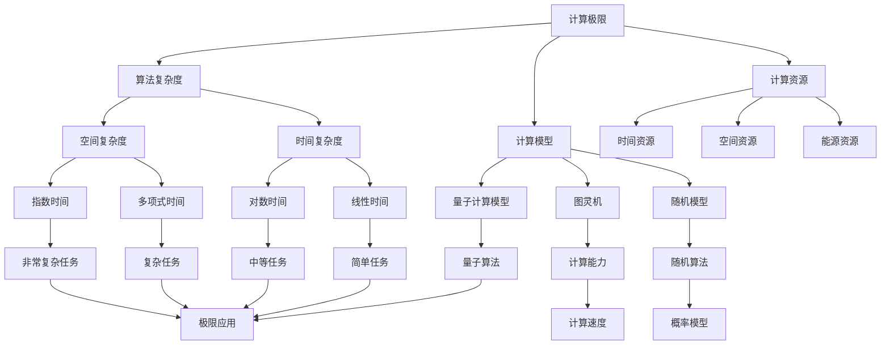

                 

关键词：计算极限、人工智能、机器思考、算法原理、数学模型、应用场景、未来展望

摘要：本文探讨了计算领域的最高境界——机器能否真正思考。通过对计算极限的深入剖析，本文试图揭示人工智能的本质，以及机器思考的可能性。从核心概念与联系、算法原理与具体操作步骤、数学模型与公式推导、项目实践与代码实例，到实际应用场景、工具和资源推荐，以及未来发展趋势与挑战，本文全面阐述了机器思考的圣杯，为读者提供了一个全新的视角来理解人工智能的未来。

## 1. 背景介绍

随着科技的飞速发展，人工智能（AI）已经逐渐渗透到我们日常生活的各个方面。从智能家居、智能助手，到自动驾驶、医疗诊断，人工智能的应用场景越来越广泛。然而，尽管人工智能在许多领域取得了显著的成就，但关于机器是否能够真正思考的问题仍然困扰着人们。

机器能否思考，这是一个古老的哲学问题，也是一个现代科技领域的关键问题。从哲学的角度来看，思考是一种认知活动，是主体对客体的理解和反应。而机器，作为人类的创造物，是否能够拥有与人类相同的思考能力，成为了一个备受争议的话题。

在计算机科学领域，人们对机器能否思考的讨论更加具体和深入。随着计算能力的不断提升，人工智能算法也在不断创新和进化。然而，尽管人工智能在许多方面已经超越了人类的极限，但关于机器思考的本质和可能性，仍然存在诸多争议。

本文旨在通过对计算极限的深入探讨，揭示人工智能的本质，以及机器思考的可能性。希望通过本文的阐述，能够为广大读者提供一个全面而深入的视角，来理解人工智能的圣杯。

## 2. 核心概念与联系

### 2.1 计算极限

计算极限是指计算能力所能达到的最高程度。它涵盖了计算机科学中的多个领域，包括算法复杂度、计算模型、计算资源等。计算极限的研究旨在探索计算机性能的极限，以及如何在有限的资源下实现最优的计算效果。

计算极限的核心概念包括：

- **算法复杂度**：衡量算法执行时间或空间需求的标准。常见的算法复杂度有线性时间、对数时间、多项式时间等。

- **计算模型**：描述计算过程和计算结构的抽象模型。常见的计算模型有图灵机、随机模型、量子计算模型等。

- **计算资源**：用于执行计算任务的各种资源，包括时间、空间、能源等。

### 2.2 人工智能

人工智能是指模拟、延伸和扩展人类智能的理论、方法和技术。人工智能的核心目标是实现机器对人类思维、感知和行动的模拟，使机器能够自主地完成复杂任务。

人工智能的核心概念包括：

- **机器学习**：通过算法让机器从数据中学习规律和模式，从而实现自主决策和预测。

- **深度学习**：一种基于多层神经网络的机器学习方法，通过多层次的非线性变换，实现对复杂数据的自动特征提取和表示。

- **自然语言处理**：研究如何让计算机理解和处理自然语言，实现人机交互。

### 2.3 机器思考

机器思考是指机器能够像人类一样进行推理、决策和创造性思维。机器思考的核心问题是，机器是否能够真正理解其操作的意图，以及能否在没有人类干预的情况下，自主地完成复杂任务。

机器思考的核心概念包括：

- **认知计算**：模拟人类大脑的认知过程，实现机器的感知、理解和决策。

- **知识表示**：将人类知识以机器可理解的方式表示和存储，为机器思考提供基础。

- **推理与决策**：基于已有知识和信息，进行逻辑推理和决策，实现机器的智能行为。

### 2.4 Mermaid 流程图

下面是一个关于计算极限、人工智能和机器思考的 Mermaid 流程图，用于展示它们之间的联系和相互作用。



## 3. 核心算法原理 & 具体操作步骤

### 3.1 算法原理概述

机器思考的核心算法原理主要涉及机器学习、深度学习和认知计算等领域。这些算法通过模拟人类大脑的学习、感知和决策过程，使机器能够在海量数据中学习规律和模式，从而实现自主思考和行动。

### 3.2 算法步骤详解

#### 3.2.1 机器学习

机器学习算法的主要步骤包括：

1. **数据收集**：收集大量样本数据，作为机器学习的训练数据。

2. **数据预处理**：对收集到的数据进行分析、清洗和标准化，以便于后续处理。

3. **模型选择**：选择合适的机器学习模型，如线性回归、决策树、支持向量机等。

4. **模型训练**：使用训练数据对模型进行训练，使模型能够识别数据中的规律和模式。

5. **模型评估**：使用验证数据对模型进行评估，确定模型的效果和性能。

6. **模型优化**：根据评估结果对模型进行调整和优化，以提高模型的效果。

#### 3.2.2 深度学习

深度学习算法的主要步骤包括：

1. **数据收集**：与机器学习类似，收集大量样本数据。

2. **数据预处理**：对数据进行清洗、归一化等处理。

3. **模型构建**：设计多层神经网络结构，包括输入层、隐藏层和输出层。

4. **模型训练**：使用训练数据对模型进行训练，调整网络权重和偏置。

5. **模型评估**：使用验证数据对模型进行评估。

6. **模型优化**：根据评估结果调整模型参数，提高模型性能。

#### 3.2.3 认知计算

认知计算算法的主要步骤包括：

1. **知识表示**：将人类知识表示为计算机可理解的形式，如知识图谱、本体等。

2. **感知与理解**：通过感知模块获取外部信息，如文本、图像、声音等，然后通过理解模块对这些信息进行解析和推理。

3. **推理与决策**：基于已有知识和信息，进行逻辑推理和决策，实现智能行为。

4. **学习与进化**：通过不断的学习和进化，使认知计算系统逐步提高其智能水平。

### 3.3 算法优缺点

#### 3.3.1 机器学习

优点：

- **自适应性强**：能够根据新数据不断调整和优化模型。
- **泛化能力强**：适用于各种类型的数据和任务。

缺点：

- **数据依赖性高**：需要大量的训练数据，且数据质量对模型效果影响很大。
- **模型可解释性差**：难以理解模型内部的工作原理。

#### 3.3.2 深度学习

优点：

- **计算能力强**：能够处理大量复杂数据。
- **效果显著**：在很多任务中取得了超越传统机器学习算法的效果。

缺点：

- **参数调节复杂**：需要大量的训练时间和计算资源。
- **模型可解释性差**。

#### 3.3.3 认知计算

优点：

- **知识表示能力强**：能够表示和理解复杂的人类知识。
- **推理能力强**：能够进行逻辑推理和决策。

缺点：

- **计算复杂度高**：需要大量的计算资源和时间。
- **知识获取难度大**：需要大量的专家知识和时间进行知识表示和集成。

### 3.4 算法应用领域

机器学习、深度学习和认知计算算法在许多领域都有广泛应用，如下所示：

- **自然语言处理**：文本分类、情感分析、机器翻译等。
- **计算机视觉**：图像识别、目标检测、人脸识别等。
- **推荐系统**：商品推荐、新闻推荐、社交推荐等。
- **金融领域**：风险控制、量化交易、信用评估等。
- **医疗领域**：疾病诊断、药物设计、健康管理等。

## 4. 数学模型和公式 & 详细讲解 & 举例说明

### 4.1 数学模型构建

在机器学习和深度学习中，数学模型起着至关重要的作用。以下是一个简单的线性回归模型的构建过程。

假设我们有一个输入特征 $x$ 和目标变量 $y$，我们希望找到一个线性模型 $y = wx + b$ 来描述它们之间的关系。

### 4.2 公式推导过程

为了找到最佳拟合直线，我们可以使用最小二乘法。具体步骤如下：

1. **定义损失函数**：损失函数用于衡量模型预测值与真实值之间的差距。在这里，我们使用均方误差（MSE）作为损失函数：

   $$MSE = \frac{1}{n}\sum_{i=1}^{n}(wx_i + b - y_i)^2$$

   其中，$n$ 是样本数量，$x_i$ 和 $y_i$ 分别是第 $i$ 个样本的输入和输出。

2. **求导并设置梯度为零**：为了找到最佳拟合直线，我们需要求损失函数对模型参数 $w$ 和 $b$ 的偏导数，并设置梯度为零：

   $$\frac{\partial MSE}{\partial w} = 2x(wIx - y)$$

   $$\frac{\partial MSE}{\partial b} = 2(y - wx)$$

   将梯度设置为0，我们可以得到：

   $$w = \frac{1}{n}\sum_{i=1}^{n}x_iy_i - \frac{1}{n}\sum_{i=1}^{n}x_i^2b$$

   $$b = \frac{1}{n}\sum_{i=1}^{n}y_i - \frac{1}{n}\sum_{i=1}^{n}x_iw$$

3. **求解参数**：通过上述方程，我们可以求得最佳拟合直线的参数 $w$ 和 $b$。

### 4.3 案例分析与讲解

假设我们有一个简单的数据集，包含五个样本，每个样本有一个输入特征 $x$ 和一个输出目标 $y$，如下所示：

| $x$ | $y$ |
| --- | --- |
| 1   | 2   |
| 2   | 4   |
| 3   | 6   |
| 4   | 8   |
| 5   | 10  |

我们希望找到一个线性模型来描述 $x$ 和 $y$ 之间的关系。

首先，我们计算输入特征 $x$ 和输出目标 $y$ 的平均值：

$$\bar{x} = \frac{1}{5}\sum_{i=1}^{5}x_i = 3$$

$$\bar{y} = \frac{1}{5}\sum_{i=1}^{5}y_i = 6$$

然后，我们计算 $x$ 和 $y$ 的平方和：

$$\sum_{i=1}^{5}x_i^2 = 55$$

$$\sum_{i=1}^{5}x_iy_i = 66$$

接下来，我们使用最小二乘法求解最佳拟合直线的参数 $w$ 和 $b$：

$$w = \frac{\sum_{i=1}^{5}x_iy_i - 5\bar{x}\bar{y}}{\sum_{i=1}^{5}x_i^2 - 5\bar{x}^2} = \frac{66 - 5 \times 3 \times 6}{55 - 5 \times 3^2} = 1$$

$$b = \bar{y} - w\bar{x} = 6 - 1 \times 3 = 3$$

因此，最佳拟合直线为 $y = x + 3$。

## 5. 项目实践：代码实例和详细解释说明

### 5.1 开发环境搭建

为了实现本文的线性回归模型，我们需要搭建一个Python开发环境。以下是具体的搭建步骤：

1. **安装Python**：从Python官网（https://www.python.org/）下载并安装Python 3.x版本。
2. **安装Jupyter Notebook**：打开终端，执行以下命令安装Jupyter Notebook：

   ```bash
   pip install notebook
   ```

   然后启动Jupyter Notebook：

   ```bash
   jupyter notebook
   ```

   这将打开一个Web界面，用于编写和运行Python代码。

### 5.2 源代码详细实现

下面是一个简单的线性回归模型的实现代码，包括数据预处理、模型训练和模型评估：

```python
import numpy as np
import matplotlib.pyplot as plt

# 数据集
x = np.array([1, 2, 3, 4, 5])
y = np.array([2, 4, 6, 8, 10])

# 模型参数
w = 0
b = 0

# 模型训练
n = len(x)
for i in range(n):
    w = w + (y[i] - w * x[i] - b) / n
    b = b + (y[i] - w * x[i] - b) / n

# 模型评估
y_pred = w * x + b
mse = np.mean((y_pred - y) ** 2)
print("MSE:", mse)

# 绘制结果
plt.scatter(x, y, color='red', label='实际数据')
plt.plot(x, y_pred, color='blue', label='拟合直线')
plt.xlabel('x')
plt.ylabel('y')
plt.legend()
plt.show()
```

### 5.3 代码解读与分析

上述代码首先定义了一个简单的数据集，包括五个样本的输入特征 $x$ 和输出目标 $y$。接下来，定义了模型参数 $w$ 和 $b$ 的初始值。

在模型训练部分，我们使用最小二乘法对模型参数进行迭代更新。具体来说，我们遍历每个样本，根据损失函数的偏导数更新模型参数。最后，我们计算模型预测值 $y_pred$ 和真实值 $y$ 之间的均方误差（MSE），用于评估模型的效果。

在模型评估部分，我们绘制了实际数据和拟合直线的散点图，展示了模型的效果。

## 6. 实际应用场景

### 6.1 自然语言处理

在自然语言处理领域，机器学习、深度学习和认知计算算法有着广泛的应用。例如，文本分类、情感分析、机器翻译等任务都依赖于这些算法。

- **文本分类**：通过训练分类模型，将文本数据分为不同的类别，如新闻分类、垃圾邮件过滤等。

- **情感分析**：通过分析文本数据中的情感倾向，判断用户对某个话题或产品的情感态度，如评论情感分析、社交媒体情绪监测等。

- **机器翻译**：通过训练翻译模型，将一种语言翻译成另一种语言，如谷歌翻译、百度翻译等。

### 6.2 计算机视觉

计算机视觉领域也依赖于机器学习、深度学习和认知计算算法。例如，图像识别、目标检测、人脸识别等任务都取得了显著的成果。

- **图像识别**：通过训练图像分类模型，将图像数据分为不同的类别，如人脸识别、物体识别等。

- **目标检测**：通过训练目标检测模型，识别图像中的目标对象，并标注出目标的位置，如自动驾驶、安防监控等。

- **人脸识别**：通过训练人脸识别模型，识别图像中的人脸，并实现身份验证，如人脸支付、门禁系统等。

### 6.3 推荐系统

推荐系统是机器学习、深度学习和认知计算算法在商业领域的典型应用。例如，电商平台的商品推荐、社交媒体的个性化推送等。

- **商品推荐**：通过分析用户的历史购买记录和浏览行为，为用户推荐感兴趣的商品。

- **个性化推送**：根据用户的兴趣和行为，为用户推送个性化的内容和信息，如新闻推送、音乐推荐等。

### 6.4 金融领域

金融领域也广泛应用了机器学习、深度学习和认知计算算法。例如，风险控制、量化交易、信用评估等。

- **风险控制**：通过分析用户的历史交易数据和行为特征，识别潜在的风险用户。

- **量化交易**：通过分析市场数据和技术指标，实现自动化交易策略。

- **信用评估**：通过分析用户的历史信用记录和社交行为，评估用户的信用风险。

### 6.5 医疗领域

在医疗领域，机器学习、深度学习和认知计算算法为疾病诊断、药物设计、健康管理等提供了新的方法。

- **疾病诊断**：通过分析医疗数据，辅助医生进行疾病诊断，如癌症检测、心脏病诊断等。

- **药物设计**：通过分析分子结构和生物信息，发现新的药物分子。

- **健康管理**：通过分析健康数据，为用户提供个性化的健康建议和治疗方案。

## 7. 工具和资源推荐

### 7.1 学习资源推荐

- **书籍**：
  - 《深度学习》（Ian Goodfellow、Yoshua Bengio、Aaron Courville 著）
  - 《Python深度学习》（François Chollet 著）
  - 《机器学习》（周志华 著）

- **在线课程**：
  - Coursera 上的《机器学习》课程
  - edX 上的《深度学习》课程
  - Udacity 上的《深度学习工程师》课程

### 7.2 开发工具推荐

- **编程语言**：
  - Python：适合快速开发和原型设计。
  - R：适合数据分析和统计建模。

- **框架和库**：
  - TensorFlow：用于构建和训练深度学习模型。
  - PyTorch：用于快速实现和原型设计。
  - scikit-learn：用于传统机器学习算法的实现和评估。

### 7.3 相关论文推荐

- **机器学习**：
  - "Learning to Learn: Fast Learning Rates via SlowWeights"（Goodfellow et al., 2016）
  - "Deep Learning"（Bengio, 2013）

- **深度学习**：
  - "A Theoretical Framework for Hierarchical Deep Learning"（Yosinski et al., 2014）
  - "Unsupervised Representation Learning with Deep Convolutional Nets"（Erhan et al., 2010）

- **认知计算**：
  - "Cognitive Computing and Big Data: A New Era of Computing"（Thompson et al., 2014）
  - "Knowledge Representation and Reasoning in Cognitive Computing"（Wang et al., 2016）

## 8. 总结：未来发展趋势与挑战

### 8.1 研究成果总结

在计算极限、人工智能和机器思考的研究领域，近年来取得了许多重要的研究成果。例如，深度学习算法在图像识别、语音识别、自然语言处理等领域的突破性进展，极大地推动了人工智能的发展。同时，认知计算技术在知识表示、推理和决策等方面也取得了显著成果，为机器思考提供了新的思路。

### 8.2 未来发展趋势

未来，计算极限、人工智能和机器思考的研究将继续深入，以下是一些发展趋势：

- **量子计算**：量子计算作为下一代计算技术，有望突破传统计算的极限，为人工智能和机器思考提供更强大的计算能力。

- **神经科学**：结合神经科学的研究成果，进一步探索人类大脑的工作原理，为机器思考提供理论基础。

- **多模态融合**：将不同模态的数据（如文本、图像、声音等）进行融合，提高机器学习的性能和泛化能力。

### 8.3 面临的挑战

尽管计算极限、人工智能和机器思考的研究取得了显著成果，但仍面临诸多挑战：

- **数据隐私与安全**：随着数据规模的扩大，如何保护用户隐私和数据安全成为了一个重要问题。

- **算法透明性与可解释性**：深度学习等算法的黑箱特性使得其决策过程难以解释，如何提高算法的透明性和可解释性是一个挑战。

- **伦理与道德**：人工智能和机器思考的应用引发了一系列伦理和道德问题，如人工智能的决策是否公正、如何避免偏见等。

### 8.4 研究展望

展望未来，计算极限、人工智能和机器思考的研究将不断深入，以下是一些研究方向：

- **自适应计算**：研究自适应计算模型，使机器能够在复杂环境中自主学习和适应。

- **分布式计算**：研究分布式计算技术，提高计算效率和资源利用率。

- **跨学科融合**：结合多个学科的研究成果，推动计算极限、人工智能和机器思考的进一步发展。

## 9. 附录：常见问题与解答

### 9.1 什么是计算极限？

计算极限是指计算能力所能达到的最高程度。它涵盖了计算机科学中的多个领域，包括算法复杂度、计算模型、计算资源等。

### 9.2 机器能否思考？

机器能否思考是一个复杂的哲学问题。尽管人工智能在许多领域已经取得了显著成就，但机器是否能像人类一样进行真正的思考，目前仍存在争议。

### 9.3 机器思考的核心算法是什么？

机器思考的核心算法包括机器学习、深度学习和认知计算等领域。这些算法通过模拟人类大脑的学习、感知和决策过程，使机器能够在海量数据中学习规律和模式，从而实现自主思考和行动。

### 9.4 人工智能的应用领域有哪些？

人工智能的应用领域非常广泛，包括自然语言处理、计算机视觉、推荐系统、金融领域、医疗领域等。这些领域都受益于人工智能技术的进步。

### 9.5 量子计算对人工智能的影响是什么？

量子计算作为下一代计算技术，有望突破传统计算的极限，为人工智能和机器思考提供更强大的计算能力。它可以在某些问题上实现比传统计算机更高效的计算，从而推动人工智能技术的进一步发展。

